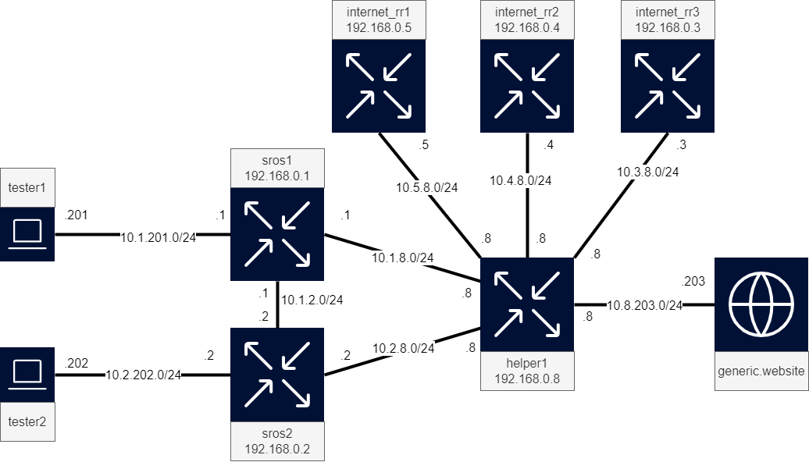

# SR OS Event Handling Scripts

Inside this lab are two use-cases that can be addressed using Nokia SROS' event handling system (EHS) combined with pySROS.
These use-cases demonstrate how you can use pySROS on the router itself to let it handle situations automatically - without any outside intervention.

The first part of this scenario revolves around handling changes in BGP peering sessions and acting upon those changes to protect other nodes in the network. The second part revolves around changes to configuration and how part of making sure that different parts of the configuration are kept in sync can be delegated to the system.

Event-handling in general can be useful for triaging problems automatically or for doing some repetitive sequential tasks automatically.

**Grading: Advanced**

**Elements: SR OS, pySROS**

## Lab diagram




## High level tasks to complete this project

1. Connect to the tester1 and tester2 nodes, ensure generic.website is reachable.
2. Use the delivered tool `./scripts/bgp_toggle.py` to shut down the interfaces towards the route reflectors. Is generic.website still reachable? <br />
*(This tool is written using pySROS)*
3. Restore the BGP sessions towards the route reflectors using the `./scripts/bgp_toggle.py` Python script.
4. Create a pySROS script that selectively disables the affected SR OS node's interfaces towards its tester. Use `./scripts/bgp_toggle.py` to test it. Does it behave as expected?
5. To further demonstrate, and to avoid the same issue reoccurring in future, add another route reflector. The configuration required to do this is provided below.
6. With a CPM filter configured to only allow traffic from select IP addresses for specific protocols, these filters have to be updated as well. This can be tedious and error-prone. Use EHS and pySROS to create a script that will automatically add the BGP peer to the CPM-filter match-list whenever a BGP peer is added to the configuration so we have one less thing to worry about.

## Deploying the lab

From the labs directory enter the following command to run the lab.

```
sudo containerlab deploy
```

This can take around 5 minutes to completely bring up all SROS devices with associated routing.

*Note: It is always advisable to do all development in a non-`root` user.  `containerlab` requires `root` to run though so use `sudo` as in the example above for the `deploy` and `destroy` arguments*

## Tools needed

| Role | Software |
| --- | --- |
| Router | SR OS release 23.7.R1 |
| Alpine Linux with nginx | small-scale traffic tester |


## Tool explanation

All tasks for the lab use-case can be completed on the provided nodes. The goal of this lab is to solve some tasks by writing code. Through container binds the nodes need only be made aware of the changes via the provided `tools` command. For the intended solution, required coding is limited to the sros1 and sros2 nodes (though feel free to experiment).

## Credentials and access

* sros1:            Default SR OS username and password
* sros2:            Default SR OS username and password
* tester1:          Username and password included in hackathon instance MOTD
* tester2:          Username and password included in hackathon instance MOTD
* server1:          Username and password included in hackathon instance MOTD
* helper1:          Default SR OS username and password
* internet_rr1:     Default SR OS username and password
* internet_rr2:     Default SR OS username and password
* internet_rr3:     Default SR OS username and password

## Connecting to a project from your laptop
Each public cloud instance has a port-range (50000 - 51000) exposed towards the Internet, as lab nodes spin up, a public port is dynamically allocated by the docker daemon on the public cloud instance.
You can utilize those to access the lab services straight from your laptop via the Internet.

With the `show-ports` command executed on a VM you get a list of mappings between external and internal ports allocated for each node of a lab. Consider the following example:
```
~$ show-ports
Name                       Forwarded Ports
clab-sros-eh-helper1       50133 -> 22, 50132 -> 830
clab-sros-eh-internet_rr1  50128 -> 22, 50127 -> 830
clab-sros-eh-internet_rr2  50141 -> 22, 50140 -> 830
clab-sros-eh-internet_rr3  50135 -> 22, 50134 -> 830
clab-sros-eh-server1       50130 -> 22
clab-sros-eh-sros1         50139 -> 22, 50138 -> 830
clab-sros-eh-sros2         50137 -> 22, 50136 -> 830
clab-sros-eh-tester1       50131 -> 22
clab-sros-eh-tester2       50129 -> 22
```
Each service exposed on a lab node gets a unique external port number as per the table above.
In the given case, tester1's SSHD is available on port 50131 of the VM, this is mapped to the container's port 22.

Optional:
> You can generate `ssh-config` using the `generate-ssh-config` command and store the output on your local laptop's SSH client, in order to connect directly to nodes.


## Reference documentation

* [pySROS documentation](https://network.developer.nokia.com/static/sr/learn/pysros/latest)
* [EHS-specifics](https://network.developer.nokia.com/static/sr/learn/pysros/latest/pysros.html#module-pysros.ehs)
* [pySROS repo](https://github.com/nokia/pysros)
* [SR OS documentation](https://documentation.nokia.com/sr/)


## Tasks

1. **Connect to the tester1 and tester2 nodes, ensure generic.website is reachable.**
    Ensure your access works. Issue a `wget generic.website` to ensure the topology is working correctly and traffic reaches through the sros and helper nodes before starting.
    If this traffic works, the BGP peerings between sros1, sros2 and the route reflectors are working.

    If you wish to do this without logging into the *tester1* and *tester2* nodes you can issue the following commands:

    ```
    docker exec -ti clab-sros-eh-tester1 wget generic.website
    docker exec -ti clab-sros-eh-tester2 wget generic.website
    ```

2. **Use the delivered tool `./scripts/bgp_toggle.py` to shut down the interfaces towards the route reflectors**<br />

    This tool is written using pySROS and can take `up` or `down` as a parameter. By default, `down` is used. When run from the hackathon VM this script will work as-is. When running it from your local machine, ensure the hostname and mapped NETCONF port of the helper node are set appropriately on line 16 and 17. The required information can be found using the `show-ports` alias.

    The result of running this script is that the previously mentioned BGP peerings go down and traffic that was working before is stopped.

    Repeating the action from task 1 on the tester gives an error indicating the website has become unreachable.

    **NOTE: When executing this script for the first time, the script may take several minutes to complete as it is obtaining and compiling the SR OS nodes YANG schema**

3. **Restore the BGP sessions towards the route reflectors using the `./scripts/bgp_toggle.py` Python script.**<br />
    You can do this by providing "up" as the first argument to the script. Does traffic to generic.website resume?

4. **Create a pySROS script that selectively disables the affected SR OS node's interfaces towards its tester.**

    Your script should be located in the `./scripts/opergroup_bgp_sros.py` file.  The name configured on the SR OS routers (*sros1* and *sros2*) is `opergroup_bgp_sros`.  Any Python code written in your script file `./scripts/opergroup_bgp_sros.py` will be loaded into memory by the router after issuing the command
    `tools perform python-script reload opergroup_bgp_sros`.

    The SR OS configuration on nodes *sros1* and *sros2* has been prepared such that any change in BGP peerings will lead to this script being executed.

    As an example, on router *sros1*, your script should disable the interface `tester1` if the BGP sessions go down.

    Like before, use `./scripts/bgp_toggle.py` to test your script's reaction to changes in the BGP sessions.

    *Enhancement: If you wish to go a further you can extend the script to re-enable the disabled interfaces whenever a route-reflector session is re-established.*

5. **To further demonstrate, and to avoid the same issue reoccurring in future, add another route reflector to sros1 and sros2. The configuration required to do this is**
    ```
    edit-config private
        configure {
            router "Base" {
                bgp {
                    neighbor "192.168.0.3" {
                        group "rr"
                    }
                }
            }
        }
    commit
    ```
    Does the session come up? What could be missing?

5. **With a CPM filter configured to only allow traffic from select IP addresses for specific protocols, these filters have to be updated as well. This can be tedious and error-prone. Use EHS and pySROS to create a script that will automatically add any and all BGP peers to a prefix list to be used in the CPM-filter. This script should take action whenever a BGP peer is added to the configuration so we have one less thing to worry about.**

    Create a script that will automatically apply the required changes to a BGP ACL such that the previously configured peer would have come up correctly. For this case, code is expected in the `./scripts/prefix_list_ehs.py` file. The tools command to reload the code is now `tools perform python-script reload prefix_list_ehs`.

    Which event does the script act upon? We used the BGP events previously.

    You could modify the existing bgp_peers match_list. For this document a new match-list named `ehs_controlled_bgp_peers` is assumed. To apply this new match-list, required configuration is:

    ```
    edit-config private
        configure {
            system {
                security {
                    cpm-filter {
                        ip-filter {
                            entry 200 {
                                match {
                                    src-ip {
        -                               ip-prefix-list "bgp_peers"
        +                               ip-prefix-list "ehs_controlled_bgp_peers"
                                    }
                                }
                            }
                            entry 210 {
                                match {
                                    dst-ip {
        -                               ip-prefix-list "bgp_peers"
        +                               ip-prefix-list "ehs_controlled_bgp_peers"
                                    }
                                }
                            }
                        }
                    }
                }
            }
        }
    commit
    ```
    *Enhancement: Can your program handle NTP and other protocols in a similar way?*

## Destroying the lab

When you have completed this scenario and don't want to continue playing with the setup, it can be destroyed by issuing the following command:

```
sudo containerlab destroy --cleanup
```
