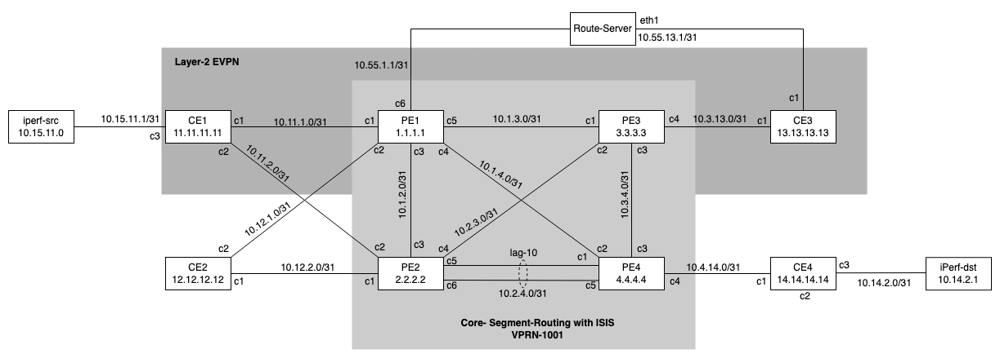

# SR OS Lab

Welcome to the generic SR OS lab, where you will learn and experience Nokia's industry proven network operating system.

This Network Lab is designed to provide infrastructure for a hands-on experience. It is pre-configured as a running network and provides a variety of additional tools, allowing users to gain practical knowledge and develop skills in such areas as; configuration management, programmability and streaming-telemetry.  

***If you are not sure which lab to use or you have a project of your own in mind then this is a great topology to deploy***

**Grading: Beginner - Intermediate - Advanced**

## Topology



This lab comes pre-configured with:
- a fully meshed P/PE Core
- IS-IS with MPLS Segment Routing enabled
- iBGP (MP-BGP ASN 65000) enabled exchanging IPv4/IPv6/VPN-IPV4/VPN-IPV6/EVPN
- VPRN 1001 (IP-VPN) where CE's are attached
- VPLS 2001 (EVPN)
- a fully functioning Telemetry stack
- a preconfigured Grafana dashboard

## Deploying the lab
The lab is deployed using the [containerlab](https://containerlab.dev) project, where the [`sros-generic-lab.clab.yml`](sros-generic-lab.clab.yml) file declaratively describes the lab topology.

1. Navigate to the SR OS lab folder 

	```
	cd sros-generic-lab/
	```

2. Deploy the lab using *containerlab* 

	```
	sudo containerlab deploy --reconfigure
	```

3. Destroy the lab using *containerlab* 

	```
	sudo containerlab destroy --cleanup
	```

## Credentials & Access
SR OS Nodes can be connected through ssh using the hostnames with default username and password. </br>

**username:** admin </br>
**password:** admin </br>

Tooling containers (srl-labs/network-multitool) can be accessed with following credentials:

**username:** user </br>
**password:** multit00l </br>

### Accessing the lab from within the VM
To access the lab nodes from within the VM, users should identify the names of the deployed nodes using the `sudo containerlab inspect` command:

```
sudo containerlab inspect
INFO[0000] Parsing & checking topology file: sros-generic-lab.clab.yml
+----+--------------------------------+--------------+------------------------------------+---------+---------+-----------------+-----------------------+
| #  |              Name              | Container ID |               Image                |  Kind   |  State  |  IPv4 Address   |     IPv6 Address      |
+----+--------------------------------+--------------+------------------------------------+---------+---------+-----------------+-----------------------+
|  1 | clab-sros-srx2023-ce1          | 6897dc97fcd4 | vr-sros:23.7.R1                    | vr-sros | running | 172.20.20.5/24  | 2001:172:20:20::5/64  |
|  2 | clab-sros-srx2023-ce2          | 413d88e63176 | vr-sros:23.7.R1                    | vr-sros | running | 172.20.20.16/24 | 2001:172:20:20::10/64 |
|  3 | clab-sros-srx2023-ce3          | c21eb08d85dc | vr-sros:23.7.R1                    | vr-sros | running | 172.20.20.4/24  | 2001:172:20:20::4/64  |
|  4 | clab-sros-srx2023-ce4          | 7e9e6c61403f | vr-sros:23.7.R1                    | vr-sros | running | 172.20.20.9/24  | 2001:172:20:20::9/64  |
|  5 | clab-sros-srx2023-consul-agent | 75e5ac0d733a | consul:1.15                        | linux   | running | 172.20.20.8/24  | 2001:172:20:20::8/64  |
|  6 | clab-sros-srx2023-gnmic        | 1bee5f2032e6 | ghcr.io/openconfig/gnmic           | linux   | running | 172.20.20.12/24 | 2001:172:20:20::c/64  |
|  7 | clab-sros-srx2023-grafana      | 51e63ca2aad7 | grafana/grafana:latest             | linux   | running | 172.20.20.14/24 | 2001:172:20:20::e/64  |
|  8 | clab-sros-srx2023-pe1          | 69903c0afb93 | vr-sros:23.7.R1                    | vr-sros | running | 172.20.20.6/24  | 2001:172:20:20::6/64  |
|  9 | clab-sros-srx2023-pe2          | 6a9878a43e6b | vr-sros:23.7.R1                    | vr-sros | running | 172.20.20.15/24 | 2001:172:20:20::f/64  |
| 10 | clab-sros-srx2023-pe3          | 46b0b66e2267 | vr-sros:23.7.R1                    | vr-sros | running | 172.20.20.10/24 | 2001:172:20:20::a/64  |
| 11 | clab-sros-srx2023-pe4          | 576306a09a26 | vr-sros:23.7.R1                    | vr-sros | running | 172.20.20.7/24  | 2001:172:20:20::7/64  |
| 12 | clab-sros-srx2023-prometheus   | f3d43e60670b | prom/prometheus:latest             | linux   | running | 172.20.20.11/24 | 2001:172:20:20::b/64  |
| 13 | clab-sros-srx2023-rs1          | c411b6a25593 | ghcr.io/srl-labs/network-multitool | linux   | running | 172.20.20.3/24  | 2001:172:20:20::3/64  |
| 14 | clab-sros-srx2023-tg1          | e91466614108 | ghcr.io/srl-labs/network-multitool | linux   | running | 172.20.20.2/24  | 2001:172:20:20::2/64  |
| 15 | clab-sros-srx2023-tg2          | c73b6adbada9 | ghcr.io/srl-labs/network-multitool | linux   | running | 172.20.20.13/24 | 2001:172:20:20::d/64  |
+----+--------------------------------+--------------+------------------------------------+---------+---------+-----------------+-----------------------+
```
*Note: The above output is an example only.  IP addresses may change.*

Using the names from the above output, we can login to the a node using the following command:

For example to access node `clab-sros-srx2023-pe1` via ssh simply type:

```
ssh admin@clab-sros-srx2023-pe1
```

### Accessing the lab via Internet

Each public cloud instance has a port-range (50000 - 51000) exposed towards the Internet, as lab nodes spin up, a public port is dynamically allocated by the docker daemon on the public cloud instance.
You can utilize those to access the lab services straight from your laptop via the Internet.

With the `show-ports` command executed on a VM you get a list of mappings between external and internal ports allocated for each node of a lab:

```
~$ show-ports
Name                            Forwarded Ports
clab-sros-srx2023-ce1           50029 -> 22, 50028 -> 830, 50027 -> 57400
clab-sros-srx2023-ce2           50006 -> 22, 50005 -> 830, 50004 -> 57400
clab-sros-srx2023-ce3           50022 -> 22, 50021 -> 830, 50020 -> 57400
clab-sros-srx2023-ce4           50003 -> 22, 50002 -> 830, 50001 -> 57400
clab-sros-srx2023-consul-agent  50026 -> 8500, 50000 -> 8600
clab-sros-srx2023-grafana       50000 -> 3000
clab-sros-srx2023-pe1           50025 -> 22, 50024 -> 830, 50023 -> 57400
clab-sros-srx2023-pe2           50016 -> 22, 50015 -> 830, 50014 -> 57400
clab-sros-srx2023-pe3           50013 -> 22, 50012 -> 830, 50011 -> 57400
clab-sros-srx2023-pe4           50010 -> 22, 50009 -> 830, 50008 -> 57400
clab-sros-srx2023-prometheus    50007 -> 9090
clab-sros-srx2023-rs1           50030 -> 22
clab-sros-srx2023-tg1           50031 -> 22
clab-sros-srx2023-tg2           50032 -> 22
```

*Note: The above output is an example only.  Allocated ports may change.*

Each service exposed on a lab node gets a unique external port number as per the table above. 
Using the above example, Grafana's web interface is available on port `50000` of the VM which is mapped to Grafana's node internal port of `3000`.

The following table shows common container internal ports and is meant to help you find the correct exposed port for the services.

| Service    | Internal Port number |
| ---------- | -------------------- |
| SSH        | 22                   |
| Netconf    | 830                  |
| gNMI       | 57400                |
| HTTP/HTTPS | 80/443               |
| Grafana    | 3000                 |

You can access the lab node on the external port for your given instance using the DNS name of the assigned VM.

| Group ID | hostname instance |
| --- | --- |
| **X** | **X**.srexperts.net |

In the example above, accessing PE1 would be possible by:

```
ssh admin@X.srexperts.net -p 50025
```

Using the example above, to access grafana you should use `http://X.srexperts.net:50000` in your prefered web browser (where `X` is the group ID you've been allocated).

### Accessing through docker

By issuing the following command, you can gain access to a running container:

```
docker exec -ti <container_ID> bash
```

## Tools provided  

| Role | Software |
| --- | --- |
| Route-Server     | [gobgp](https://github.com/osrg/gobgp)   |
| Draw Topology      | [draw.io](https://app.diagrams.net/)        |
| Telemetry collector | [gNMIc](https://gnmic.openconfig.net/) |
| Service Discovery     | [consul](https://www.consul.io/)   |
| Lab Emulation | [containerlab](https://containerlab.dev/) |
| Time-Series DB      | [prometheus](https://prometheus.io)   |
| Visualization       | [grafana](https://grafana.com)        |
| Traffic Generator       | [iperf](https://github.com/esnet/iperf)        |

## Traffic generation

### Enabling CE1->CE4 unidirectional traffic

*   SSH to traffic generator 1 (*tg1*)

    ```
    ssh user@clab-sros-srx2023-tg1
    ```

*   Verify connectivity by initiating ICMP echoes (ping) 
    to destination Traffic Generator (iperf-dst) at CE-4 
    
    ```
    ping 10.14.2.1
    ```

*   Start iperf traffic to destination server at CE-4

    ```
    /config/iperf.sh 10.14.2.1
    ```

### Disabling CE1->CE4 unidirectional traffic

*   SSH to traffic generator 1 (*tg1*)

    ```
    ssh user@clab-sros-srx2023-tg1
    ```
    
*   Stop iperf traffic by issuing the following command

    ```
    pkill iperf3
    ```

### Enabling CE4->CE1 unidirectional traffic

*   SSH to traffic generator 2 (*tg2*)

    ```
    ssh user@clab-sros-srx2023-tg2
    ```

*   Verify connectivity by initiating ICMP echoes (ping)
    to destination Traffic Generator (iperf-dst) at CE-1 
    
    ```
    ping 10.15.11.0
    ```

*   Start iperf traffic to destination server at CE-1

    ```
    /config/iperf.sh 10.15.11.0
    ```

### Disabling CE4->CE1 unidirectional traffic

*   SSH to traffic generator 2 (*tg2*)

    ```
    ssh user@clab-sros-srx2023-tg2
    ```
    
*   Stop iperf traffic by issuing the following command

    ```
    pkill iperf3
    ```

