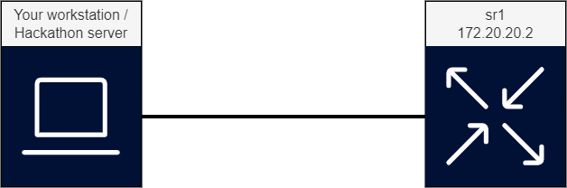

# SROS gNOI Certificates Management

The goal of this lab is to securely add a certificate to an SROS router, enable secure gRPC using that certificate and to manage the certificate's lifecycle using gNOI (gRPC Network Operations Interface).

**Grading: intermediate**

## Lab Diagram ##


## Deploying the lab

```shell
sudo containerlab deploy -c -t certs.clab.yml
```

Note: It is always advisable to do all development in a non-root user. containerlab requires root to run though so use sudo as in the example above for the deploy and destroy arguments

## Tools needed

| Role | Software |
| --- | --- |
| Lab Emulation | [containerlab](https://containerlab.dev/) |
| Configuration and telemetry tool | [gNMIc](https://gnmic.openconfig.net/) |
| Certificate generation and lifecycle      | [gNOIc](https://gnoic.kmrd.dev)   |
| Router / gRPC server | SR OS Release 23.7.R1

## Credentials and access

* sr1:            Default SR OS username and password

## Connecting to a project from your laptop
Each public cloud instance has a port-range (50000 - 51000) exposed towards the Internet, as lab nodes spin up, a public port is dynamically allocated by the docker daemon on the public cloud instance.
You can utilize those to access the lab services straight from your laptop via the Internet.

With the `show-ports` command executed on a VM you get a list of mappings between external and internal ports allocated for each node of a lab. Consider the following example:
```
~$ show-ports
Name                       Forwarded Ports
clab-certs-sr1             50189 -> 22, 50188 -> 830, 50187 -> 57400
```
Each service exposed on a lab node gets a unique external port number as per the table above.
In the given case, sr1's gRPC server is available on port 50187 of the VM, this is mapped to the container's port 57400.

Optional:
> You can generate `ssh-config` using the `generate-ssh-config` command and store the output on your local laptop's SSH client, in order to connect directly to nodes.

## Tasks

1. **Enable gNOI  on the router**

Use either gRPC calls (with gNMIc) or an SSH session on the router to make the necessary configuration changes to enable gNOIc. As a first step, certificate management itself has to be enabled:

XPATH: `/configure/system/grpc/gnoi/cert-mgmt`

CLI:   `configure system grpc gnoi cert-mgmt`

and secondly, the RPCs required by gNOIc to do certificate management must be allowed for the profile associated with the user. In this case, user *admin* is used. By default, this user uses the *administrative* user-profile.

XPATH: `/configure/system/security/aaa/local-profiles/profile[user-profile-name="administrative"]/grpc/rpc-authorization`

CLI:   `configure system security aaa local-profiles profile administrative grpc rpc-authorization`

2. **Generate a self signed CA certificate keypair to act as Certificate Authority (CA)**

Using gNOIc, create a self-signed certificate that will act as our CA for this exercise. In the next steps, we will use this CA to sign certificate requests.
gNOIc cmd: [cert create-ca](https://gnoic.kmrd.dev/command_reference/cert/create-ca/)

3. **Install a new certificate on the router and verify it's existence**

gNOIc allows us to request a CSR from the router (if it has the capacity to generate those), sign it and send the signed copy back to the router. This signed certificate can then be configured for use in the router. Use gNOIc to install the certificates to the router:

gNOIc cmd: [cert install](https://gnoic.kmrd.dev/command_reference/cert/install/)

and verify that they were indeed installed correctly:

gNOIc cmd: [cert get-certs](https://gnoic.kmrd.dev/command_reference/cert/get-certs/)

*Can you think of a reason why this method would be preferred over generating certificates offline and copying them to the router?*

4. **Create a Certificate Profile**

Changes have to be made to the router configuration to be able to make use of the newly installed certificates to secure gRPC communications. As before, use gRPC calls or a plain SSH session to make changes to the contexts listed below to create a certificate profile that makes use of the certificate installed in the previous step. Don't forget to enable it.

XPATH:  `/configure/system/security/tls/cert-profile`

CLI:    `configure system security tls cert-profile`

5. **Create Cipher lists**

In addition to the certificate profile, we must specify ciphers to use on the server side. Create a server-cipher-list with the ciphers you would like to permit your server to use.

XPATH:
```
/configure/system/security/tls/server-cipher-list/tls12-cipher
/configure/system/security/tls/server-cipher-list/tls13-cipher
```

CLI:    `configure system security tls server-cipher-list`

6. **Create server-tls-profile**

Add the cipher-list and certificate profile created in the previous two steps together into this server-tls-profile. Don't forget to enable it.

XPATH:  `/configure/system/security/tls/server-tls-profile`

CLI:    `configure system security tls server-tls-profile`

7. **Change the gRPC server from unsecure to secure**

In all of the previous steps, the gRPC server in the router was set to allow unsecure connections. Now that the certificates have been put in place, we can switch this to a secure mode of operation. Using gRPC calls or an SSH session, adapt the following configuration section to change the gRPC server to run securely.

XPATH:  `/configure/system/grpc`

CLI:    `configure system grpc`

8. **Validate that the gRPC server accepts secure connections**

If you used gNMIc in any of the previous steps, does re-using the same command still work? Does the gNOIc get-certs call from before still work? If not, is there any indication of what the error might be? Can you fix these calls?

9. **Rotate the certificate**

To further showcase the capabilities of gNOIc, rotate the certificate while there is an ongoing gNMI session. Does the session remain active?

gNOIc cmd: [cert rotate](https://gnoic.kmrd.dev/command_reference/cert/rotate/)

Use `get-certs` to confirm that the expiration date has been updated.

To create an ongoing gNMI session, you can use this gNMIc command:

`gnmic -a $(dig +short clab-certs-sr1)  -u admin -p admin subscribe --path /state/system/cpu[sample-period=1]/cards-and-ports --tls-ca sr1.cert`

10. **Revoke the certificate**

And finally, to complete the lab, revoke the certificate while there is an ongoing gNMI session. Does the session remain active?

gNOIc cmd: [cert revoke](https://gnoic.kmrd.dev/command_reference/cert/revoke/)

To create an ongoing gNMI session, you can use this gNMIc command:

`gnmic -a $(dig +short clab-certs-sr1)  -u admin -p admin subscribe --path /state/system/cpu[sample-period=1]/cards-and-ports --tls-ca sr1.cert`

## Destroying the lab

When you are complete with the lab, it can be destroyed by issuing the following command:

```
sudo containerlab destroy --cleanup
```
