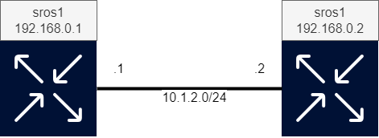

# SR OS Stateful Show Commands

In this lab you will use pySROS to generate a customized view of the routing table. Your script should output a view of the Base routing instance's routing table with a timestamp and a number indicating how many times your script has been run. Your script will be associated with a command-alias so that it appears to users as a regular SR OS command.

The initial version of the routing table view should contain rows where each row has the prefix, the protocol through which the route is learned and the IP address of the next-hop node (if applicable).
In subsequent steps we'll add timestamps and store the output on the compact flash to allow monitoring of the state of the routing table over time.

**Grading: Beginner**

**Elements: SR OS, pySROS, CRON, File I/O**

## Lab Diagram



## High level tasks to complete this project

* Connect to either *sros1* or *sros2* and observe how the custom MD-CLI command is configured. Rename it or make your own if desired.
* Write a program that gets the routes from the routing table and outputs them in a table.
* Amend the program to add timestamps to the output
* Add file I/O to the script such that the output is written to the router's file system.
* Finally, add sequence numbering to the flow such that each additional run has a new sequence number in the file created by your script.

An example solution to this lab is included in the `examples` folder.

## Deploying the lab

From the labs directory enter the following command to run the lab.

```
sudo containerlab deploy
```

This can take around 5 minutes to completely bring up all SROS devices with associated routing.

*Note: It is always advisable to do all development in a non-`root` user.  `containerlab` requires `root` to run though so use `sudo` as in the example above for the `deploy` and `destroy` arguments*

## Tools needed

| Role | Software |
| --- | --- |
| Router | SR OS release 23.7.R1 |

## Task explanation

The lab use-case can be completed by editing the `./scripts/sros_stateful_route_table.py` file.

The goal of this lab is to solve some tasks by writing code. Though containerlab links the `./scripts` directory with the nodes via a TFTP server, the nodes need to be made aware of the changes via the `tools perform python-script reload "sros_stateful_route_table"` command.

## Credentials and access

* sros1:            Default SR OS username and password
* sros2:            Default SR OS username and password

## Connecting to a project from your laptop
Each public cloud instance has a port-range (50000 - 51000) exposed towards the Internet, as lab nodes spin up, a public port is dynamically allocated by the docker daemon on the public cloud instance.
You can utilize those to access the lab services straight from your laptop via the Internet.

With the `show-ports` command executed on a VM you get a list of mappings between external and internal ports allocated for each node of a lab. Consider the following example:
```
~$ show-ports
Name                      Forwarded Ports
clab-sros-stateful-sros1  50182 -> 22, 50181 -> 830
clab-sros-stateful-sros2  50180 -> 22, 50179 -> 830
```
Each service exposed on a lab node gets a unique external port number as per the table above.
In the given case, sros1's SSHD is available on port 50182 of the VM, this is mapped to the container's port 22.

__Optional:__ With the ssh-config command executed on a VM, a copy-and-pasteable output is generated that can be used on your own system as an alternative to manually specifying username, host and port number. The generated text can be added to your ~/.ssh/config (or suitable alternative) file and you'll be able to use the container names as targets for ssh.

## Reference documentation

* [pySROS documentation](https://network.developer.nokia.com/static/sr/learn/pysros/latest)
* [pySROS repo](https://github.com/nokia/pysros)
* [SR OS documentation](https://documentation.nokia.com/sr/)

## Tasks

1. **Connect to either sros1 or sros2 and observe how the custom CLI command is configured. Rename it or make your own if desired.**

    Configuration for custom commands is located in the `/configure system management-interface cli md-cli environment command-alias` context. Does this command generate any output in the current state?

2. **Write a program that gets the routes from the routing table and outputs them in a table.**

    Modify the file `sros_stateful_route_table.py` in the `scripts` folder. This file is linked to both nodes in the topology. The nodes can be triggered to re-read the contents via the command `/tools perform python-script reload "sros_stateful_route_table"`. Your changes are then read into the running version of the script.

    An example of what your output could look is
```
===============================================================================
Routing table snapshot
===============================================================================
Prefix                   Protocol      Next Hop
-------------------------------------------------------------------------------
5.6.7.0/24               LOCAL
9.0.0.0/8                BGP           192.168.0.2
-------------------------------------------------------------------------------
No. of Routes: 2
===============================================================================
```

3. **Amend the program to add timestamps to the output**

    Take a look at pySROS' documentation, specifically the libraries adapted for SR OS as they include some options when it comes to timing.

    An example of what your output could look like after this step is
```
At time 2023/09/01 19:08:22, result:

===============================================================================
Routing table snapshot
===============================================================================
Prefix                   Protocol      Next Hop
-------------------------------------------------------------------------------
5.6.7.0/24               LOCAL
9.0.0.0/8                BGP           192.168.0.2
-------------------------------------------------------------------------------
No. of Routes: 2
===============================================================================
```


4. **Add File I/O to the script such that the output is written to the router's file system.**

    Store your script's outputs in the the sros_stateful folder on cf3:/. To accomplish this, again refer to the pySROS libraries as they include I/O. Some potentially useful commands to see the output your script is producing:

 ```
    /file
    change-directory sros_stateful
    list
    show <filename>
```

Outputs retrieved in this step should look similar to

```
[/]
A:admin@sros1# /file

[/file "cf3:\"]
A:admin@sros1# change-directory sros_stateful

[/file "cf3:\sros_stateful"]
A:admin@sros1# list

Volume in drive cf3 on slot A is SROS VM.

Volume in drive cf3 on slot A is formatted as FAT32

Directory of cf3:\sros_stateful

09/01/2023  05:51p      <DIR>          ./
09/01/2023  05:51p      <DIR>          ../
09/01/2023  07:21p                1133 _20230901-192158-UTC.410368.out
09/01/2023  07:22p                1133 _20230901-192258-UTC.410468.out
09/01/2023  07:23p                1133 _20230901-192358-UTC.410405.out
09/01/2023  07:11p                 737 current
               4 File(s)                   4136 bytes.
               2 Dir(s)               676388864 bytes free.


[/file "cf3:\sros_stateful"]
A:admin@sros1# show _20230901-192158-UTC.410368.out
File: _20230901-192158-UTC.410368.out
-------------------------------------------------------------------------------
At time 2023/09/01 19:21:58: Run number 32, result:

===============================================================================
Routing table snapshot
===============================================================================
Prefix                   Protocol      Next Hop
-------------------------------------------------------------------------------
5.6.7.0/24               LOCAL
9.0.0.0/8                BGP           192.168.0.2
-------------------------------------------------------------------------------
No. of Routes: 2
===============================================================================

===============================================================================
```

4. **Finally, add sequence numbering to the flow such that each additional run has a new sequence number in the file created by your script.**

    The script should check what the last used sequence number was and create a new file with the next sequence number in line. An example of what your output could look like is
```
At time 2023/09/01 19:08:22: Run number 7, result:

===============================================================================
Routing table snapshot
===============================================================================
Prefix                   Protocol      Next Hop
-------------------------------------------------------------------------------
5.6.7.0/24              LOCAL
9.0.0.0/8               BGP           192.168.0.2
-------------------------------------------------------------------------------
No. of Routes: 2
===============================================================================
```

*Enhancement: The configuration to run this script as a CRON task is included in the lab configuration though it is disabled by default. To enable it, enter commands into the node's CLI:*

```
edit-config private
    configure {
        system {
            cron {
                schedule "sros_stateful_route_table" owner "admin" {
                    admin-state enable
                }
            }
        }
    }
commit
```
Once enabled, information about the CRON schedule can be retrieved using this command:
`/show system cron schedule "sros_stateful_route_table" owner "admin"`


*CRON output is configured to be stored in `cf3:/sros_stateful/`. Does your script behave as intended when executed through CRON?*

*Enhancement: Can you make your script run from your local machine? This entails connecting to the routers with pySROS from a remote location instead of locally. Does the script behave the same in this scenario?*

*Bonus-points enhancement: On each execution of your new command, output the difference in the number of prefixes between the last run, and the current run.*

## Destroying the lab

When you have completed this scenario and don't want to continue playing with the setup, it can be destroyed by issuing the following command:

```
sudo containerlab destroy --cleanup
```