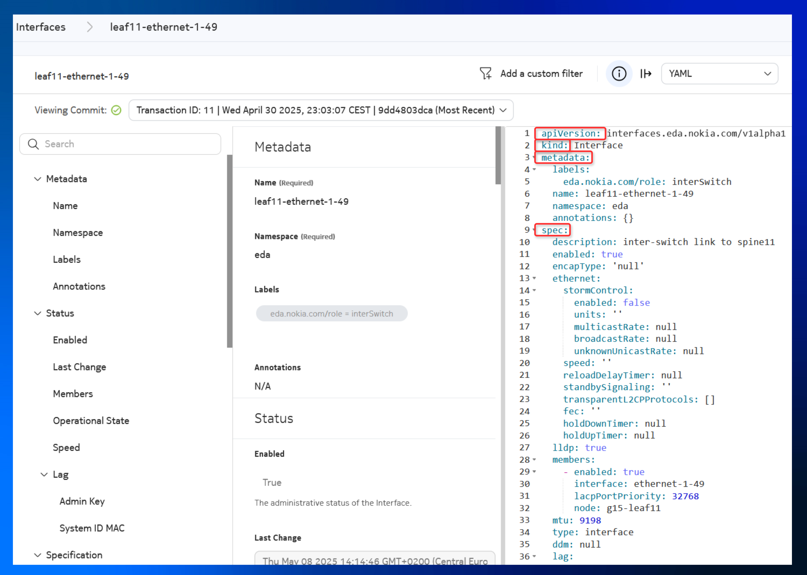
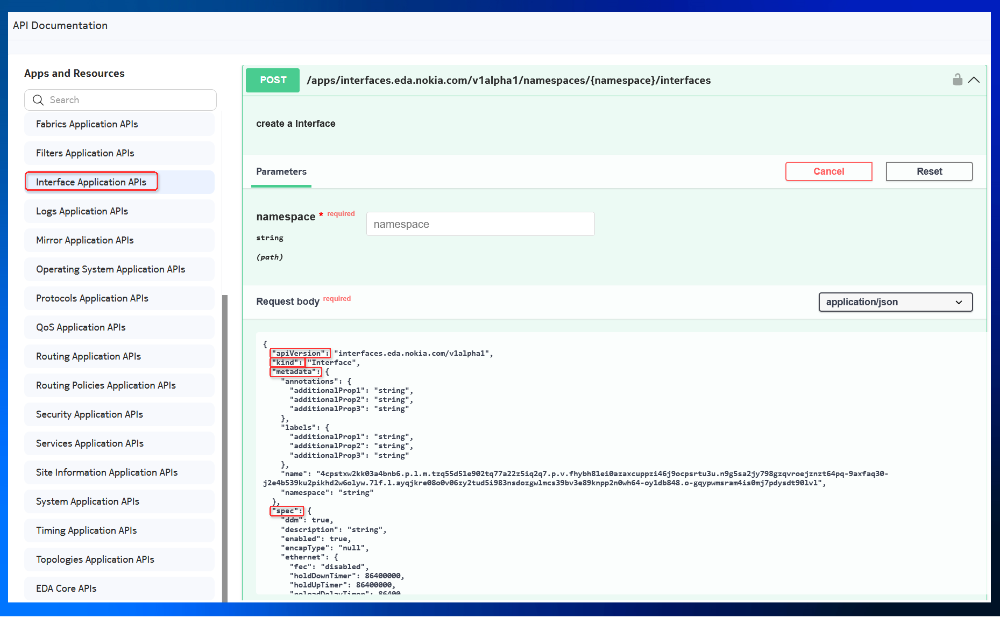

# Service Automation using Python

<script type="text/javascript" src="https://viewer.diagrams.net/js/viewer-static.min.js" async></script>

-{}-

|                       |                                                                                              |
| --------------------- | -------------------------------------------------------------------------------------------- |
| **Short Description** | Define an EDA virtual network integrating Layer 2/3 services using Python              |
| **Difficulty**        | Intermediate                                                                                     |
| **Tools used**        | Python, Pydantic                                                                                           |
| **Topology Nodes**    | :material-server: client11, :material-server: client12, :material-server: client13, :material-router: leaf11, :material-router: leaf12, :material-router: leaf13           |
| **References**        |[EDA API Guide][api-guide], [OpenAPI Swagger spec][swagger-spec], [Pydantic EDA][pydantic-eda]                                                                                             |

[api-guide]: https://docs.eda.dev/development/api/
[swagger-spec]: https://github.com/eda-labs/openapi
[pydantic-eda]: https://github.com/eda-labs/pydantic-eda
[pydantic]: https://docs.pydantic.dev/latest/

This is the final exercise in a four-part series on using EDA to automate datacenter overlay connectivity services. In this step, you will create the Virtual Network from **Part 3** against, but this time using **Python** and EDA's REST API instead of clicking through the UI.

- **[Part 1](../beginner/bridge-domains.md)**: achieve layer-2 connectivity using bridge domains
- **[Part 2](../beginner/routers.md)**: achieve layer-3 connectivity using routers
- **[Part 3](../beginner/virtual-networks.md)**: combine layer-2 and layer-3 connectivity through a single EDA object: the Virtual Network
- **Part 4 (this activity)**: automate overlay service provisioning from Part 3 with Python, [Pydantic][pydantic] and EDA REST API.

## Objective

This exercise shares the same goal as [Part 3](../beginner/virtual-networks.md): enabling three Linux hosts to communicate within the same subnet (switched traffic) and across different subnets (routed traffic). However, this time you will use the **EDA API** with Python as the API client using generated Pydantic classes based on the **EDA OpenAPI** specification.

/// admonition | If you haven’t already completed the [EDA REST API](../intermediate/api.md), we recommend doing so first. It offers a concise overview of key concepts that will help in understanding this exercise.
///

## Technology explanation

--8<-- "docs/eda/intermediate/api.md:api-intro"

EDA users can use any REST API client to interact with the EDA API, and in the [EDA REST API](../intermediate/api.md) exercise you got a chance to use the **Postman** client to interact with the EDA API. In this advanced exercise you will adopt a more sophisticated and powerful approach, you will use Python and its httpx client library as a REST API client, and for extra kinks you will consume the EDA API via [Pydantic][pydantic] models generated for the EDA OpenAPI specification.

/// admonition | Pydantic and OpenAPI
    type: subtle-note
**Pydantic** is a Python library used for data validation and data parsing using Python type annotations. It’s widely used to define schemas (models) for structured data, such as the kind you get from JSON APIs. It provides automatic validation, detailed error messages and conversion of input data to Python native types.

**OpenAPI** (formerly Swagger) is a standard specification for documenting and defining RESTful APIs. As the specification is usually written in YAML of JSON, it can be used to generate Documentation and Client SDKs.
///

### Why Pydantic?

Why would you even use Pydantic? What's wrong with just reading the OpenAPI spec, identifying the request body and go fire off the request? The answer is simple: Pydantic makes your code more robust, easy to write and read and thus makes your life easier. Let us expand.

Without Pydantic, every request you have would look like a JSON object inside your body. But how would you create this JSON body? Manually typing it in or templating with Jinja - and you are in for a good time debugging and runtime errors the moment you make a typo, miss a required field or transition to an API that has changed.

With Pydantic, you get the native Python classes generated from the OpenAPI spec so that you can programmatically generate request bodies, get IDE support and autocompletion and validate the provided data against the OpenAPI schema before you send the requests to the server.

### How Pydantic and OpenAPI Work Together

Pydantic models are commonly derived from an OpenAPI specification, which outlines the structure and rules of an API:

- OpenAPI defines the expected input, output, and behavior of an API.
- Pydantic enforces those rules and provides a Pythonic way to construct and validate data.

This allows developers to work with EDA resources programmatically, avoiding the need to manually craft JSON or YAML definitions.

/// note | The community project [Pydantic EDA][pydantic-eda] provides the Pydantic models for EDA generated from the EDA OpenAPI specification published in the [EDA OpenAPI spec][swagger-spec] repo.
///

Before diving into the task of creating a **Virtual Network** with Python, let's first review the basics concepts behind a Pydantic model, and for that we will use one of the most basic Units of automation: the **Interface**.

### Interface Pydantic Model

If you navigate in the EDA Ui to the -{{icons.topology()}}- → -{{icons.circle(letter="I", text="Interfaces")}}- and click for example on `leaf11-ethernet-1-49`, or visit the **EDA API documentation** (:octicons-question-24: icon in the top right), you'll notice that the resource definitions appear the same, only the format differs (YAML vs. JSON):

/// tab | EDA UI Interface yaml definition



///
/// tab | API Interface documentation



///

Since EDA models its resources as Kubernetes Custom Resources (CRs), each object follows a familiar structure with four key elements:

- `apiVersion`: The API group and API version the object belongs to
- `kind`: What kind of object you want to create
- `metadata`: Identification fields like a `name` string and a `namespace`, plus auxiliary metadata like `labels` and `annotations`.
- `spec`: provides the specification for the resource - its configuration.

With Pydantic classes you can define EDA resources using native Python code, providing type validation, structure enforcement, and a more native development experience.

Let's see side by side an Interface CR and it's Pydantic definition:

/// tab | Interface yaml definition

```yaml
apiVersion: interfaces.eda.nokia.com/v1alpha1
kind: Interface
metadata:
  name: leaf11-ethernet-1-49
  namespace: eda
spec:
  type: interface
  description: "inter-switch link to spine11"
  enabled: true
  mtu: 9198
  members:
    - node: g15-leaf11
      interface: ethernet-1-49
```

///
/// tab | Interface Pydantic definition

```python
import pydantic_eda.com.nokia.eda.interfaces.v1alpha1 as iface # (1)!


def interface(ns: str, name: str) -> iface.Interface: # (2)!
    iface_ = iface.Interface(
        apiVersion="interfaces.eda.nokia.com/v1alpha1",
        kind="Interface",
        metadata=iface.InterfaceMetadata( # (3)!
            name=name,
            namespace=ns,
        ),
        spec=iface.SpecModel( # (4)!
            description="inter-switch link to spine11",
            mtu=9198,
            members=[
                iface.Member(
                    interface="ethernet-1-49",
                    node="g15-leaf11",
                ),
            ],
        ),
    )

    return iface_
```

1. The first thing we do is to import the Pydantic classes already generated.
2. Our function takes as arguments the `namespace` and the `name` of the CR, and returns the **Interface** object.
3. **Metadata** is modeled as a class and takes the `namespace` and `name` as input.
4. The `spec` is also modeled as the **SpecModel** class.
///

Click at each annotation :material-plus-circle: to see a explanation of that relevant section.

The Python `interface` function shown is only one component of the complete code needed to fully provision a Virtual Network. It serves as a building block within a larger program. A complete Python solution includes:

- A `client` to manage the REST API connection and handle transaction creation and commit
- `logging` for monitoring interaction status
- Additional `functions` for defining other Pydantic-based EDA resources (e.g., Virtual Network)
- A `main` routine that orchestrates the overall workflow

For this exercise, we’ll provide these core components so you can concentrate on constructing the Pydantic model for the Virtual Network.

## Tasks

Now it's time to apply what we've learned so far and create a **Virtual Network** in the most pythonic way possible.

/// warning | IMPORTANT
Remove any Bridge Domains, Bridge Interfaces or VLANs created in the [Bridge Domains/Part 1](../beginner/bridge-domains.md) and the [Routers/Part 2](../beginner/routers.md) as our Virtual Network will create them or [simply reset EDA using the git time machine](../index.md#reset-eda).
///

### Setup environment

/// tip
It’s highly recommended to use a code editor with Python auto-completion and suggestions enabled, as it will significantly improve your productivity and help avoid syntax errors when working with Pydantic models.
///

Clone a Github repository that provides the basic components. You can clone it in your own personal device or your dedicated cloud instance (VM) running a copy of the lab topology.

If you're working on your local device, make sure the [uv python package manager and installer](https://github.com/astral-sh/uv) is installed beforehand.

```bash
git clone  -b srx-2025 https://github.com/eda-labs/openapi-example-python.git
cd openapi-example-python
uv sync
```

In the `main.py` file, configure the `YOUR_EDA_EXT_DOMAIN_NAME:PORT` with your EDA Web UI/API address you have been provided with.

### Start Coding

The project structure is the following:

```
openapi-example-python/
├── src/
│   ├── client.py              # Handles REST API communication and transactions
│   ├── logging.py             # Sets up logging configuration
│   └── virtualnetwork.py      # Defines Pydantic models for Virtual Network
├── main.py                    # Entry point to tie everything together
├── pyproject.toml             # Project metadata and dependencies (used by uv)
├── uv.lock                    # Lockfile with exact versions of dependencies
```

The `client.py` and `logging.py` files are prebuilt and ready to use.

Your task is to implement the Virtual Network definition inside the `virtualnetwork.py` file that is then referenced in the `main.py`. The `virtualnetwork.py` file has an import block that pulls in the generated Pydantic classes for the services application that contains the VirtualNetwork resource. By importing this module, you get access to the generated classes from the [OpenAPI spec for this application](https://rest.wiki/?https://raw.githubusercontent.com/eda-labs/openapi/refs/heads/main/apps/services.eda.nokia.com/v1alpha1/services.json).

Since you already have an idea what the virtual network resource consists of after completing the Part 3 of this challenge, you may start by typing starting to define your virtual network:

```python
vnet_ = service.VirtualNetwork()
```

And let IDE help you identify what properties a `VirtualNetwork` class has. Since the Virtual Network is a composite resource that references Bridge Domains, IRBs, VLANs and so on, you will have multiple specifications in the generated Pydantic model, they will differ by the name, but to see which one is relevant for which resource might require some looking around in the provided pydantic module.

### Test your code

Once you have your code ready you can execute it with `uv run python main.py`.

If everything works correctly, you should see output similar to the following:

```bash
[*]─[~/openapi-example-python]
└──> python main.py
[05/10/25 14:34:41] INFO     Authenticating with EDA API server                                                                                                                         client.py:54
                    INFO     Adding 'VirtualNetwork' resource from 'services.eda.nokia.com/v1alpha1' to the 'create' transaction list                                                  client.py:101
                    INFO     Transaction 183 committed                                                                                                                                 client.py:160
[05/10/25 14:34:43] INFO     Transaction 183 state: complete                                                                                                                           client.py:166

[*]─[~/openapi-example-python]
```

You can go now to the EDA UI **System** → **Transactions** and check the details of the Transaction and see your Virtual Network in the list of Virtual Network resources.

/// details | Hint
    type: subtle-note
Your function should list the specification of the bridge domains, a router, the routed interfaces and everything you used to create a VNET resource in the Part 3. You high level structure could look like this:

```python
def virtualnetwork(ns: str, name: str) -> service.VirtualNetwork:
    vnet = service.VirtualNetwork(
        apiVersion="services.eda.nokia.com/v1alpha1",
        kind="VirtualNetwork",
        metadata=service.VirtualNetworkMetadata(name=name, namespace=ns, labels={"role": "exercise"}),
        spec=service.SpecModel17(
            routers=[
                router,
            ],
            routedInterfaces=[
                routed_if_client11,
                routed_if_client13,
            ],
            bridgeDomains=[
                bd_300,
                bd_312,
            ],
            vlans=[
                vlan_300,
                vlan_312,
            ],
            irbInterfaces=[
                irb_300,
                irb_312,
            ],
        ),
    )

    return vnet
```

///

### Test the connectivity

With the Virtual Network committed to the fabric, you should now have IP connectivity between your clients! Login to one of the clients and try to ping the IP of the other ones!

/// admonition | See [Access Details](../index.md#access-details) if you need a reminder on how to access the nodes in the topology.
    type: subtle-question
///

--8<-- "docs/eda/beginner/virtual-networks.md:ping-tests"

## Summary and review

Great job! By completing this activity, you have accomplished the following:

- Gained an understanding of how to represent EDA resources in Python using Pydantic models. In a fully modeled way, without any YANG pains.
- Converted a Virtual Network configuration from the EDA UI into structured Python code.
- Programmatically created and submitted EDA resources using the REST API.
- Worked with project scaffolding, transaction handling, and data validation.
- Automated Virtual Network provisioning, enabling consistent and reusable deployment workflows.

/// details | Possible solution Python code (only look here as a last resort!)
    type: success

The solution to this challenge is [provided here](https://github.com/eda-labs/openapi-example-python/tree/srx-2025-solution).

This is just one possible solution. There are many valid ways to approach these tasks. If your code achieves the desired outcome, then your solution is perfectly valid!

///
