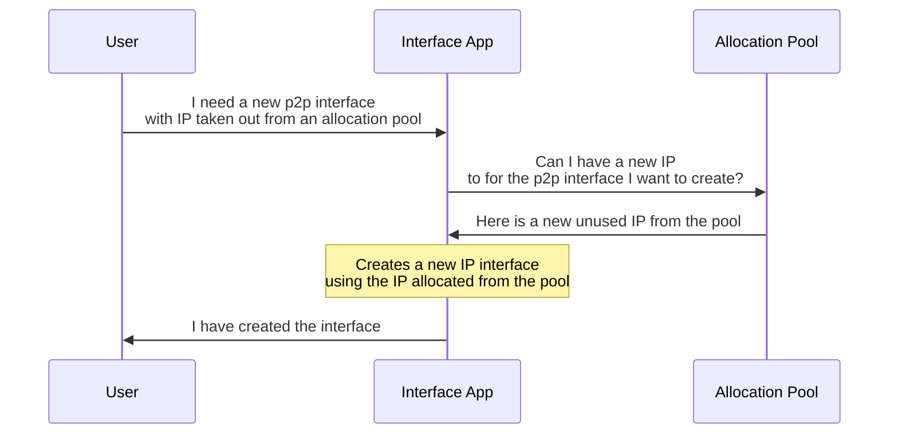

# Allocations

<script type="text/javascript" src="https://viewer.diagrams.net/js/viewer-static.min.js" async></script>

|                       |                                                                                                             |
| --------------------- | ----------------------------------------------------------------------------------------------------------- |
| **Short Description** | A fully declarative system must have a way to declare, manage and use allocations such as IP addresses, indexes and subnets. |
| **Difficulty**        | Beginner                                                                                                    |
| **Topology Nodes**    | leaf11, leaf12, leaf13, spine11, spine12                                                                    |
| **Tools used**        | EDA UI                                                                                                      |
| **References**        | [Allocation Pools documentation][allocation-docs]                                                                                                      |

[allocation-docs]: https://docs.eda.dev/user-guide/allocation-pools/

One of infamous challenges of network automation lies in the domain of Network Source of Trust, often abbreviated as NSoT. Managing IP addresses, ASN numbers, VLAN IDs and tunnel indexes without a system that allows you to both manage and enforce allocations to the network elements is a recipe for network configuration drift and sleepless nights.

EDA acts as an enforcing source of truth system, as it not only manages the allocation pools with IP addresses, VLAN IDs and so on, but also ensures that the allocated resources are actually provisioned on the managed devices.

/// note | Want to learn more about allocations?
After completing this exercise that introduces you to the concept of allocations you may want to try out the more advanced activity - [Custom Allocations](../intermediate/custom-allocations.md) - that explores how custom allocations can be defined such that you get to define what resource identifiers are allocated.
///

## Objective

Our objective is to learn what EDA's Allocation Pools are and how they ensure a consistent and automated way of resource identifiers allocations used in the [EDA Intents](declarative-intents.md).

Below is a call flow diagram that illustrates how EDA handles identifiers allocation requests from the user.



## Technology Explanation

EDA manages resource identifiers such as IP addresses, VLAN IDs, ASN numbers and tunnel indexes via a concept of [Allocation Pools][allocation-docs].

As with anything in EDA, an Allocation Pool is declaratively defined as a resource of a specific type. Four kinds of allocation pools are available in EDA, each defines a pool with a unique property to cater for a specific allocation use case:

* **Indices**  
    Specify a size and starting value  
    Return an integer on allocation
* **IP Addresses**  
    Specify an IPv4 or IPv6 subnet including mask in CIDR format (e.g. `192.0.2.0/24`)  
    Return an address from the subnet on allocation, without any mask information (e.g. `192.0.2.1`)
* **IP Addresses + Masks**  
    Specify an IPv4 or IPv6 subnet including mask in CIDR format (e.g. `192.0.2.0/24`)  
    Return an address from the subnet on allocation, with mask information (e.g. `192.0.2.1/24`)
* **Subnets**  
    Specify an IPv4 or IPv6 subnet including mask in CIDR format (e.g. `192.0.2.0/24`) and a subnet length (e.g. `31`)  
    Return a subnet of the specified length from the provided subnet on allocation, with mask information (e.g. `192.0.2.8/31`)

EDA Allocation Pools have certain interesting capabilities that make them play nice in the declarative setting:

* **Deterministic allocations** — If provided the same allocation input, the value of any previous allocation will be returned. No surprises!
* **Persist allocations** — Restarting the platform does not result in any re-indexing.
* **Implicit freeing of allocations** — If a resource is updated and no longer needs an allocation, it’s freed up for something else.

### Creating an Allocation Pool

An operator would create an allocation pool of a specific kind like any other resource, for example, here is a resource definition for an allocation pool of type `indices` that is used to allocate AS Numbers:

```yaml
apiVersion: core.eda.nokia.com/v1
kind: IndexAllocationPool
metadata:
  name: srexperts-asnpool
  namespace: eda
spec:
  segments:
    - start: 4200001000
      size: 1000
```

> The `kind` field is set to `IndexAllocationPool` to indicate that this is an allocation pool of type `indices`.

As mentioned above, the indices allocation pools are determined by the `start` and `size` fields. You can have many segments in a pool, but the segments must not overlap.

### Using Allocation Pools

The YAML above defines the `srexperts-asnpool` allocation pool, which starts from `4200001000` and has a size of `1000` elements in it. Whenever any EDA resource asks for an allocation from this pool, it will be allocated an AS Number from the range `[4200001000, 4200001999]` in the sequential order.

Here is how this pool is referenced in the Fabric resource that creates the DC fabric across all leaf and spines in our topology:

```yaml linenums="1" hl_lines="12"
apiVersion: fabrics.eda.nokia.com/v1alpha1
kind: Fabric
metadata:
  name: srexperts-fabric
  namespace: eda
spec:
  interSwitchLinks:
    linkSelector:
      - eda.nokia.com/role=interSwitch
    unnumbered: IPV6
  leafs:
    asnPool: srexperts-asnpool
    leafNodeSelector:
      - eda.nokia.com/role=leaf
  overlayProtocol:
    # omitted
  underlayProtocol:
    # omitted
```

Many resources you find in EDA will allow you to specify either a pool to select the identifier from, or allow you to set the identifier yourself in a static way.

For example, when creating a VLAN resource, you can either set the VLAN ID manually, or let EDA allocate a VLAN ID from a pool of VLANs.

```yaml linenums="1" hl_lines="12-13"
apiVersion: services.eda.nokia.com/v1alpha1
kind: VLAN
metadata:
  name: macvrf-100-vlan1
  namespace: eda
spec:
  bridgeDomain: macvrf-100
  interfaceSelector:
    - edge-type=compute
  uplink:
    # omitted
  vlanID: '1'
  vlanPool: ''
  # omitted
```

In the example above, the VLAN resource is using a statically assigned VLAN ID of `1`, and does not leverage any allocation pools, as the `vlanPool` field is left empty.

### Custom Allocations
<!-- --8<-- [start:custom-allocations] -->
Custom Allocations (aka Preallocations) are a way to mark identifiers in an allocation pool allocatable to only specific resources that requested them. For example, from the pool of AS Numbers we can preallocate the AS Number `4200001111` to the `leaf11` specifically by creating the allocation.

```yaml
apiVersion: core.eda.nokia.com/v1
kind: IndexAllocationPool
metadata:
  name: srexperts-asnpool
  namespace: eda
spec:
  publishAllocations: true
  segments:
    - start: 4200001000
      size: 1000
      allocations:
        - name: srexperts-fabric-leaf-leaf11
          value: 4200001111
```

The preallocation is defined in the allocation pool resource by providing the `allocations` block with the list of the following field pairs:

1. `name`: the "allocation key" that a specific application (fabric in the example above) would provide when requesting an allocation from the pool.
2. `value`: the value that should be allocated to the application.

With the preallocation defined as above, the fabric application can request an allocation from the `srexperts-asnpool` pool for the `leaf11` node and the preallocated value `4200001111` will be returned from the pool as the application would provide a key that matches the `name` field of the preallocation.
<!-- --8<-- [end:custom-allocations] -->

Applications are in control of the key format they send along with the request for an allocation. The Fabric apps uses the key in the following format:  
`{fabric-name}-{role-name}-{node-name}`  
which in the example above had been translated to `srexperts-fabric-leaf-leaf11`.

/// note | Custom Allocations activity
While this activity introduces you to the concept of allocations, we also have a more advanced - [Custom Allocations](../intermediate/custom-allocations.md) - exercise that you can try out to understand how you can pre-allocate resources from the pool and to have deterministic allocation results.
///

### Reservations

What if you want to reserve a block of indices, ip addresses or subnets from being allocated? For example, you want to create an IP Address pool that allocates IP addresses from subnet `10.1.0.0/16` and reserve the first 100 addresses as they are not used in your design, or allocated for other systems, not managed by EDA.

This is a job for **Reservations**. Reservations allow you to define blocks of identifiers that should not be allocated from this pool, effectively making them "reserved". Here is how we would define the reservations for the IP Address pool as per our intent to block first 100 addresses from a subnet:

```yaml
apiVersion: core.eda.nokia.com/v1
kind: IPAllocationPool
metadata:
  name: my-ip-pool
  namespace: eda
spec:
  segments:
    - reservations:
        - end: 10.1.0.0
          start: 10.1.0.99
      subnet: 10.1.0.0/16
```

## Tasks

### Identify Allocation Pools

Your first task is to find the existing allocation pools in the `eda` namespace. Start by logging in the EDA UI and find the Allocation Pools.

/// details | Hint: How to find existing allocation pools in UI
    type: example
Look for **Allocations** group in the left sidebar.

///

You may also use Kubernetes API and `kubectl` tool available on the server instance to find existing allocation pools. Try listing Index Allocation Pools using `kubectl`, you will need to know the resource kind to use; maybe EDA UI can give you a hint?

/// details | Hint: How to find allocation pool kind?
    type: example
To find the resource kind for the specific allocation, find the allocation resource in the EDA UI, and switch to the YAML view of the resource to see its kind:

-{{video(url='https://gitlab.com/rdodin/pics/-/wikis/uploads/9516ffe210e798b8312013c3c29b1125/CleanShot_2025-04-15_at_13.58.35.mp4')}}-

Knowing the resource kind, you can use `kubectl` and list resources by its kind:

```
kubectl -n eda get indexallocationpools
```

///

### Changing AS Numbering scheme

Now that you know what allocation pools exist in your EDA instance, it is time to find out how these pools are used.

The SReXperts 2025 topology that is deployed in the lab environment you work on uses EDA to deploy the fabric configuration over the three leafs and two spines that make up the DC1 topology.

-{{ diagram(url='srexperts/hackathon-diagrams/main/eda.drawio', title='EDA Managed nodes', page=0, zoom=1.5) }}-

By creating the **Fabric** resource in EDA, we configure the full underlay/overlay topology that makes it possible to create virtual networks on top of it. The Fabric configuration translates to several configuration blocks on the managed nodes:

* export/import policies
* network instances
* bgp peers in the underlay and overlay
* inter-switch link configs
* and so on and so forth

And all that, by submitting a single Fabric resource, that looks like in its entirety like this:

```yaml linenums="1" hl_lines="13 26 29-30 33"
--8<-- "eda/fabric/40_fabric.yaml"
```

Checkout the highlighted lines in the Fabric resource YAML. This is where we reference allocation pools of different kinds.

The Fabric application that processes the Fabric resource sees the referenced allocation pools and uses EDA SDK to request a next allocation for a particular resource.

In this task you are asked to change the AS Numbers used for the leaf switches in our fabric from the the 4-byte AS Number scheme to the 2-byte AS Number scheme, while keeping spines

/// details | Hints
    type: example
You can edit the existing `srexperts-asnpool` allocation pool and change the start and size of the AS Number range to fit the 2-byte AS Number scheme.

If you want a more challenging task, create a new pool and reference it from the Fabric resource under the `leafs` block, while keeping spines using the original allocation pool.
///

> When changing the pool configuration don't commit the change right away, use the [Dry Run](declarative-intents.md#dry-run) functionality to appreciate the automation mechanics that will expand a single pool change to a configuration change across the entire fabric.

By completing these tasks you should have a basic understanding of Allocation Pools used in EDA. What are they used for, what types of pools we have in the product and how they serve different purposes.

You also learned how to change existing and create new allocation pools, and how resources reference the pools to request identifiers from them.
