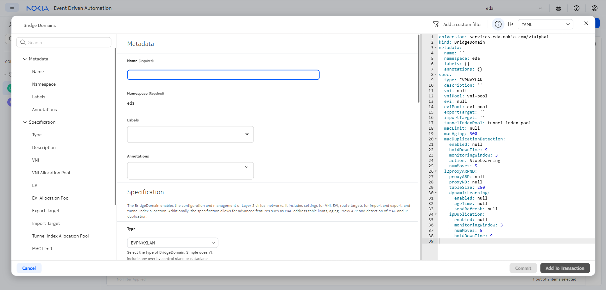
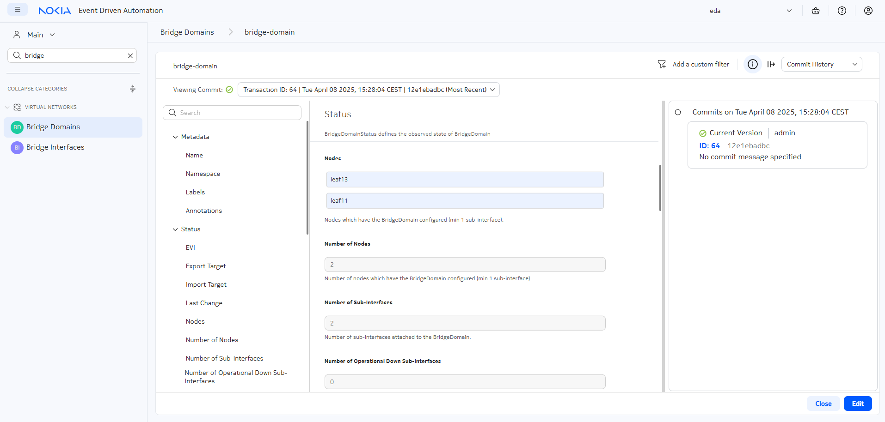
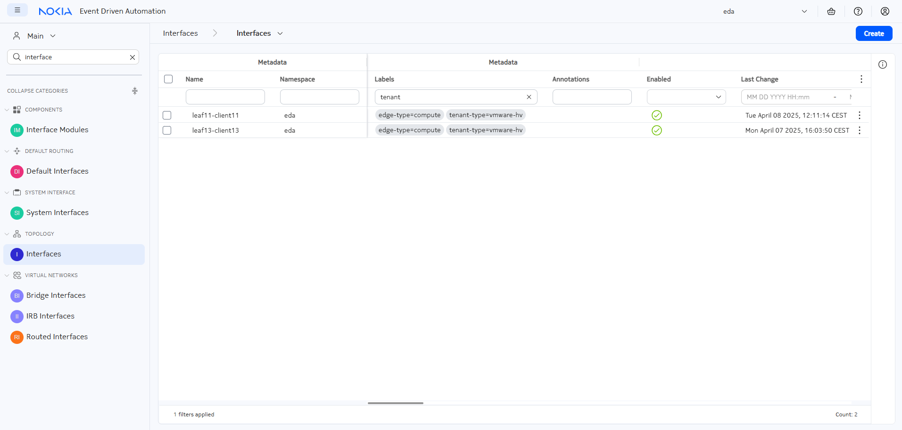

# Bridge domains

<script type="text/javascript" src="https://viewer.diagrams.net/js/viewer-static.min.js" async></script>

|                       |                                                                                                                      |
| --------------------- | -------------------------------------------------------------------------------------------------------------------- |
| **Short Description** | Creating bridge domains with EDA to achieve layer 2 connectivity                                                     |
| **Difficulty**        | Beginner                                                                                                             |
| **Tools used**        | /                                                                                                                    |
| **Topology Nodes**    | :material-server: client11, :material-server: client13, :material-router: leaf11, :material-router: leaf13           |
| **References**        | /                                                                                                                    |

This is the first exercise in a 4-part series around using EDA to achieve connectivity to, from, and within your datacenter. In this exercise, we will achieve layer-2 connectivity between two hosts in the same broadcast domain.

- **Part 1 (this activity)**: achieve layer-2 connectivity using bridge domains
- **[Part 2](routers.md)**: achieve layer-3 connectivity using routers
- **[Part 3](virtual-networks.md)**: combine layer-2 and layer-3 connectivity through a single EDA object - the Virtual Network (VNET)
- **[Part 4](../advanced/service-automation.md)**: automate parts 1 through 3 of this exercise with Python

## Objective

In this exercise, we enable the layer 2 connectivity between the two linux hosts in our lab topology. Both linux hosts have an IP address in the same IP subnet and our objective is to ensure that the traffic is switched over the datacenter fabric using a dedicated and isolated MAC-VRF service.

## Technology explanation

Layer-2 or switched traffic in a datacenter is often used in distributed workloads to accommodate connectivity between two computes, without the router being aware of which IPs the computes use to communicate. Some prominent examples where Layer 2 connectivity is required are:

1. **VM mobility**

    Virtual machines are being recreated with the same IP on a different physical compute, to allow for maintenance and rapid failover.

2. **DHCP**

    Broadcast traffic is often a significant and important part of connectivity between computes and relies exclusively on MAC addresses to communicate. One such example is the dynamic host configuration protocol (DHCP) used to dynamically assign IP addresses.

In this exercise, we'll take a look at how layer 2 connectivity can be facilitated using EDA's Bridge Domains. A bridge domain is another word for a Virtual Private LAN Service (VPLS in SR OS lingvo) or a MAC-VRF (SR Linux).

## Tasks

/// admonition | See [Access Details](../index.md#access-details) if you need a reminder on how to access the nodes in the topology.
    type: subtle-question
///

### Inspect the IP configuration of both clients

Before we start, we need to verify the IP configuration on both clients. We're interested in two things:

1. the **VLAN** the clients use to communicate
2. the **IP address** of each client so we can test later whether the connectivity is in place.  
    Multiple IP addresses are configured for different hackathon exercises, so you're looking for an IP in the subnet `10.30.0.0/24`

To connect to the shell of the client nodes, you should connect to the server running your lab and then ssh to each node, for example, for `client11`:

```bash title="execute from the lab server"
ssh user@clab-srexperts-client11
```

<div class="embed-result">
```{.text .no-select .no-copy}
[*]─[client11]─[~]
└──>
```
</div>

When in the client shell, try to answer these questions:

- Which **VLAN** are the clients using to communicate?
- Which command can you use to test the connectivity?

/// details | Hint: the relevant IP interfaces on the clients
    type: tip
/// tab | client-11

```bash
[*]─[client11]─[~]
└──> ip route show 10.30.0.0/24
10.30.0.0/24 dev eth1.300 proto kernel scope link src 10.30.0.11
```

///
/// tab | client-13

```bash
[*]─[client13]─[/]
└──> ip a | grep "10.30.0" -A 5 -B 2
5: eth1.300@eth1: <BROADCAST,MULTICAST,UP,LOWER_UP> mtu 9500 qdisc noqueue state UP group default qlen 1000
    link/ether aa:c1:ab:b9:1b:9e brd ff:ff:ff:ff:ff:ff
    inet 10.30.0.13/24 scope global eth1.300
       valid_lft forever preferred_lft forever
    inet6 fd00:fdfd:0:3000::13/64 scope global
       valid_lft forever preferred_lft forever
    inet6 fe80::a8c1:abff:feb9:1b9e/64 scope link
       valid_lft forever preferred_lft forever
```

///
///

/// details | Solution
    type: success
The VLAN the computes will use to access the layer 2 domain is VLAN `300`. Note that there are both IPv4 and IPv6 addresses configured on the node.

To test the connectivity, the following command can be used. Note that connectivity is currently not working, as expected. We will have to create the Bridge Domain to achieve it.

```bash
# for IPv4
[x]─[client11]─[/]
└──> ping -c 1 10.30.0.13
PING 10.30.0.13 (10.30.0.13) 56(84) bytes of data.
From 10.30.0.11 icmp_seq=1 Destination Host Unreachable

--- 10.30.0.13 ping statistics ---
1 packets transmitted, 0 received, +1 errors, 100% packet loss, time 0ms
```

```bash
# for IPv6
[x]─[client11]─[/]
└──> ping -c 1 fd00:fdfd:0:3000::13
PING fd00:fdfd:0:3000::13(fd00:fdfd:0:3000::13) 56 data bytes
From fd00:fdfd:0:3000::11 icmp_seq=1 Destination unreachable: Address unreachable

--- fd00:fdfd:0:3000::13 ping statistics ---
1 packets transmitted, 0 received, +1 errors, 100% packet loss, time 0ms
```

///

### List Bridge Domains

Login to the EDA UI using the assigned Group ID and EDA credentials provided to you.

The EDA platform consists of the core and the apps that extend it and provide the resources for declarative network management. Although you can make your own apps, Nokia already provides an extensive library of pre-installed apps that can handle a lot of configuration tasks. Programming your own app is beyond the scope of this exercise.

Look at the app menu in the left sidebar for "Bridge Domains", which is located in the "Virtual Networks" category.


When you click on the Bridge Domain menu element, you will see the list of existing Bridge Domains. A few of them are already there to power up other exercises, but none of them enable connectivity over VLAN 300 that our clients are intent on using.

If you come from operations you don't just blindly trust some lines in a management system, you want proofs, and better yet, the exact config that is running on the devices. Normally, you would log in to the switches, maybe one by one, and run the show commands. But this is so eighties, how about you use the query language that EDA provides and ask all your network elements to list their MAC VRFs?

EDA comes with a built-in network-wide query engine that allows you to query the network devices in a performant and scalable way. Using the sidebar navigation menu, select the **Queries** menu and paste the following in the EQL Query input field:

```
.namespace.node.srl.network-instance where ( type = "mac-vrf" )
```

You should see a network-wide query result with all nodes reporting back all network instances of type `mac-vrf` they have configured.


Then you can ask the nodes to list all subinterfaces they have and their single-tagged vlan ids:

```
.namespace.node.srl.interface.subinterface.vlan.encap.single-tagged
```

You will likely won't see any subinterface with VLAN 300, and that's expected, we did not configure this either. So let's get to it.

### Create a bridge domain

Using the "Create" button in the top-right, you can create a new bridge domain. In the center of the screen you can see all configuration options for the new bridge domain, and on the right is a YAML representation of the same. You can either fill the form fields, or edit the YAML, whatever you prefer.



Create a new bridge domain, so you can attach some interfaces to it in the next step. If you're not sure which value you need to pick for a particular property, you can leave the field default or empty. The most important properties are:

- A **name** so you can reference this bridge domain later.
- The **type** should be left as "EVPNVXLAN", as the Bridge Domain (mac vrf) will be used to provide overlay services.

/// details | A note about namespaces
    type: info
Namespaces in EDA are used to separate resources into any way you see fit: in a real-life network, you may want to split your fabric resources into regions or functions, for example. In the hackathon we have only one namespace -  `eda` - which has been pre-configured in your lab topology.
///

When you are finished, you can press the **Commit** button to commit the transaction[^1] right away which will result in EDA verifying the correctness of the Bridge Domain configuration and... It will store the Bridge Domain resource in the EDA database, but no config will be pushed to the nodes. Why, you ask?

The bridge domain configuration is only pushed to nodes when Bridge Interface resources are created that refer a bridge domain; And since we don't have them yet - EDA does not push anything to the nodes. We'll add them in the next step.

The solution can be found below in YAML format, if you want to refer to it. You can copy this yaml object into the right column in the GUI to change your current config.

/// details | Solution
    type: success

It is enough to define the Bridge Domain like this:

```yaml
apiVersion: services.eda.nokia.com/v1alpha1
kind: BridgeDomain
metadata:
  name: bridge-domain-vlan300
  namespace: eda
spec:
  type: EVPNVXLAN
  vniPool: vni-pool
  eviPool: evi-pool
  tunnelIndexPool: tunnel-index-pool
```

The key pieces here are the pools used for the VNI, EVI and tunnel index allocation. Want to know more about pools and how EDA presents itself as a source of truth and IPAM? Read about [Allocation Pools](../beginner/allocations.md) first.

///

After committing the Bridge Domain you can verify that it was **not** instantiated on the nodes by running the same EQL query listing all mac-vrfs as we did before.

### Create Bridge Interfaces

Bridge interfaces enable the attachment of the network interfaces to a particular service/vrf/bridge-domain. They can refer to a physical interface on a device, perform actions on ingress/egress and set the VLAN ID and thus ensure that multiple virtual machines can share the same physical interface, yet are logically isolated.

In EDA, you can create Bridge Interfaces resources one at a time by referencing a particular interface object, or create several of them by using labels. We'll start with manually specifying an interface, but in a future step we'll do this again with labels, which are much easier to work with!

Find the **Bridge Interfaces** section of the **Virtual Networks** category of your side menu on the left. You should not see any existing bridge interfaces, as we will create them in this exercise. Hit the **Create** button and let's dive in.

Recall, that the Bridge Interface resource in EDA can reference an existing Interface object to a single Bridge Interface mapped to a network interface. You are tasked with creating a Bridge Interface that would target the already existing interface `leaf11-client11` and associate it with the Bridge Domain we created earlier.  
In the Bridge Interface form you should at a minimum provide the following:

1. Bridge Interface a name
2. A reference to the Bridge Domain that this Bridge Interface should be connected to
3. A VLAN ID that this Bridge Interface should be using (hint: you found out the VLAN ID in one of the previous steps!).
4. A reference to the Interface resource that this Bridge Interface should be using.

Once you figured out what to enter in the Bridge Interface form, don't hit the **Commit** button right away as we did with the Bridge Domain. Let's explore the power of transactions and dry runs, by clicking the **Add to Transaction** button and stage our change into the transaction basket.

/// details | Solution
    type: success

```yaml
apiVersion: services.eda.nokia.com/v1alpha1
kind: BridgeInterface
metadata:
  name: client11-bridge-domain-300
  namespace: eda
spec:
  description: Provides a logical connection from client11 to the bridge domain using VLAN ID 300
  ###### WARNING ######
  # this name should match the name of the bridge domain created earlier
  #####################
  bridgeDomain: bridge-domain-vlan300
  vlanID: '300'
  interface: leaf11-client11
```

///

> Learn more about [Transactions](../beginner/declarative-intents.md#transactions) and [Dry Run](../beginner/declarative-intents.md#dry-run) functionality.

Use the Dry Run functionality in EDA to check what would change if we were to commit our Bridge Interface.

-{{video(url="https://gitlab.com/rdodin/pics/-/wikis/uploads/f0ba73de91d9be5ed31ea2b29df7f747/CleanShot_2025-05-02_at_10.34.09.mp4")}}-

As shown in the video snippet above, you can check the diffs that the particular transaction would emit, and there you have a chance to see what node-specific configs would be pushed to which nodes if we were to commit our transaction.

/// note | The Dry Run functionality does not touch the network elements in any way. All the potential change sets are computed by EDA. Safe and Fast.
///

The change set in the diff view should indicate that a subinterface with vlan-id is created on the `leaf11` switch as well as the network instance of type `mac-vrf` that this subinterface is connected to.

/// warning | Create the Bridge Interface targeting `leaf13` node as well, to attach the second client to the bridge domain before proceeding further.
///

#### Resource status

You should be able to see the Bridge Interface status reflected in the GUI. To see the status of the configured object in EDA you can use the info icon or double click on the created resource to open up the view mode.

-{{video(url="https://gitlab.com/rdodin/pics/-/wikis/uploads/fe725a247872b4a0bb39c4f91f63cbee/CleanShot_2025-05-02_at_11.37.38.mp4")}}-

 You can also navigate to your bridge domain, and find out which leaf nodes are now participating in the service.



### Testing the connectivity

With Bridge Domain and two Bridge Interfaces committed to the fabric, you should now have IP connectivity between your two clients! Login to one of the clients participating in the layer-2 service, and try to ping the IP of the other one!

/// tab | client-11

Connect to the server and then SSH into the client

```bash
ssh user@clab-srexperts-client11
```

Once in the shell, ping client13:

```bash
[*]─[client11]─[/]
└──> ping -c 1 10.30.0.13
PING 10.30.0.13 (10.30.0.13) 56(84) bytes of data.
64 bytes from 10.30.0.13: icmp_seq=1 ttl=64 time=3.13 ms

--- 10.30.0.13 ping statistics ---
1 packets transmitted, 1 received, 0% packet loss, time 0ms
rtt min/avg/max/mdev = 3.128/3.128/3.128/0.000 ms
```

And with IPv6:

```bash
[*]─[client11]─[/]
└──> ping -c 1 fd00:fdfd:0:3000::13
PING fd00:fdfd:0:3000::13(fd00:fdfd:0:3000::13) 56 data bytes
64 bytes from fd00:fdfd:0:3000::13: icmp_seq=1 ttl=64 time=1.92 ms

--- fd00:fdfd:0:3000::13 ping statistics ---
1 packets transmitted, 1 received, 0% packet loss, time 0ms
rtt min/avg/max/mdev = 1.915/1.915/1.915/0.000 ms
```

///
/// tab | client-13

Connect to the server and then SSH into the client

```bash
ssh user@clab-srexperts-client13
```

Once in the shell, ping client11:

```bash
[*]─[client13]─[/]
└──> ping -c 1 10.30.0.11
PING 10.30.0.11 (10.30.0.11) 56(84) bytes of data.
64 bytes from 10.30.0.11: icmp_seq=1 ttl=64 time=0.779 ms

--- 10.30.0.11 ping statistics ---
1 packets transmitted, 1 received, 0% packet loss, time 0ms
rtt min/avg/max/mdev = 0.779/0.779/0.779/0.000 ms
```

And with IPv6:

```bash
[*]─[client13]─[/]
└──> ping -c 1 fd00:fdfd:0:3000::11
PING fd00:fdfd:0:3000::11(fd00:fdfd:0:3000::11) 56 data bytes
64 bytes from fd00:fdfd:0:3000::11: icmp_seq=1 ttl=64 time=0.841 ms

--- fd00:fdfd:0:3000::11 ping statistics ---
1 packets transmitted, 1 received, 0% packet loss, time 0ms
rtt min/avg/max/mdev = 0.841/0.841/0.841/0.000 ms
```

///

Beautiful, we have configured the network connectivity in the overlay between clients 11 and 13 using EDA's Bridge Domain and Bridge Interface Resources. By the way, you can the same queries using EQL as we did [at the beginning of this exercise](#list-bridge-domains) to see the new bridge domain and interfaces present.

### Using labels

In the previous step, we have created a single bridge interface per (bridge-domain, interface, VLAN) combination. For dozens of services with hundreds of physical interfaces, this quickly becomes impractical. In this task, we'll take a look at [label-based](../beginner/label-based-selection.md) operations.

Start off by deleting the bridge interfaces you have created so far (you can keep the bridge domain). You can remove the Bridge Interfaces one by one, or by selecting them in the grid view and bulk deleting via the :material-dots-vertical: menu icon. After deleting the Bridge Interface objects feel free to run the EQL queries to ensure that the nodes were stripped off of the relevant configurations.

Next up, find the two Interfaces `leaf11-client11` and `leaf13-client13` in the **Interfaces** menu under the **Topology** group and have a look at the labels metadata field:


Each resource in EDA can have a number of labels, which can be used to select the resources. Want to know more about the labels - we have a [dedicated exercise](../beginner/label-based-selection.md) for it.

A label consists of a label key and a label value and is often written in the form of `key=value` string. For example, let's imagine that our two clients - client11 and client13 - are VMware hypervisors. Then we might want to tag them with the `tenant-type=vmware-hv` label to provide this metadata information that we can act on later.

You can edit the Interface resources one by one, or select them both and make use of the Bulk Edit edit unt

> To avoid issues with other exercises, don't delete any existing label by overriding their label key!

After assigning your new label to both interfaces, the list should look as follows (notice the filter in the Labels column at the top of the grid):



### VLAN resource

Now that both interfaces have been assigned a common label, any EDA application can select them based on the tag. If before we had to create two instances of Bridge Interface for each interface/vlab/bridge-domain triplet, now we can optimize the workflow by using a different EDA resource - the VLAN resource.

The VLAN resource, in contrast to the Bridge Interface, selects the interfaces based on the label selector, and does not allow you to individually pick an interface. It provides a way to connect the customer-facing interfaces to the bridge domain in a **bulk mode**. And this is exactly what you are tasked with, even though your fabric only has two clients, you can imagine running real fabric with hundreds or thousands VMs that ought to be interconnected via the overlay network service.

Select the **VLANs** application under the **Services** category in the sidebar and open the creation window for your first VLAN resource. When filling the the resource form, focus on:

- A **name** for your VLAN so you can easily recognize it later
- An optional **description**
- A **reference to the bridge domain** you created earlier
- A **label** in the `Interface Selector` section of the spec that you assigned to both client interfaces. This field does not auto-complete yet, so you need to manually enter the label. Follow the pattern `{key}={value}` and type in the label you assigned to the interfaces in the previous step.
- The **VLAN ID** you discovered at the start of this exercise. Note: replace the "pool" value from the field (which indicates that EDA should choose a VLAN from the allocation pool automatically) with the ID you discovered earlier.

After filling out the required fields, feel free to run a Dry Run and ensure that you see configuration changes aimed at both leaf switches and matching the configuration you've seen when manually added the Bridge Interfaces.

If everything was configured correctly and committed, you should now be able to see the status of both interfaces in your VLAN object.

/// details | Solution
    type: success

```yaml
apiVersion: services.eda.nokia.com/v1alpha1
kind: VLAN
metadata:
  name: bridge-domain-vlan300
  namespace: eda
spec:
  ###### WARNING ######
  # this name should match the name of the bridge domain created earlier
  #####################
  bridgeDomain: bridge-domain-vlan300
  description: >-
    This object creates a subinterface for each port assigned to label
    "tenant-type=vmware-hv"
  interfaceSelector:
    - tenant-type=vmware-hv
  vlanID: '300'
```

///

### Test the connectivity

To ensure that everything was configured correctly, re-check the connectivity between both clients

/// tab | client-11

Connect to the server and then SSH into the client

```bash
ssh user@clab-srexperts-client11
```

Once in the shell, ping client13:

```bash
[*]─[client11]─[/]
└──> ping -c 1 10.30.0.13
PING 10.30.0.13 (10.30.0.13) 56(84) bytes of data.
64 bytes from 10.30.0.13: icmp_seq=1 ttl=64 time=3.13 ms

--- 10.30.0.13 ping statistics ---
1 packets transmitted, 1 received, 0% packet loss, time 0ms
rtt min/avg/max/mdev = 3.128/3.128/3.128/0.000 ms
```

And with IPv6:

```bash
[*]─[client11]─[/]
└──> ping -c 1 fd00:fdfd:0:3000::13
PING fd00:fdfd:0:3000::13(fd00:fdfd:0:3000::13) 56 data bytes
64 bytes from fd00:fdfd:0:3000::13: icmp_seq=1 ttl=64 time=1.92 ms

--- fd00:fdfd:0:3000::13 ping statistics ---
1 packets transmitted, 1 received, 0% packet loss, time 0ms
rtt min/avg/max/mdev = 1.915/1.915/1.915/0.000 ms
```

///
/// tab | client-13

Connect to the server and then SSH into the client

```bash
ssh user@clab-srexperts-client13
```

Once in the shell, ping client11:

```bash
[*]─[client13]─[/]
└──> ping -c 1 10.30.0.11
PING 10.30.0.11 (10.30.0.11) 56(84) bytes of data.
64 bytes from 10.30.0.11: icmp_seq=1 ttl=64 time=0.779 ms

--- 10.30.0.11 ping statistics ---
1 packets transmitted, 1 received, 0% packet loss, time 0ms
rtt min/avg/max/mdev = 0.779/0.779/0.779/0.000 ms
```

And with IPv6:

```bash
[*]─[client13]─[/]
└──> ping -c 1 fd00:fdfd:0:3000::11
PING fd00:fdfd:0:3000::11(fd00:fdfd:0:3000::11) 56 data bytes
64 bytes from fd00:fdfd:0:3000::11: icmp_seq=1 ttl=64 time=0.841 ms

--- fd00:fdfd:0:3000::11 ping statistics ---
1 packets transmitted, 1 received, 0% packet loss, time 0ms
rtt min/avg/max/mdev = 0.841/0.841/0.841/0.000 ms
```

///

Great job completing the Bridge Domains exercise! You've successfully:

- Created layer-2 connectivity between client11 and client13 using EDA's Bridge Domain resources
- Learned how to configure Bridge Interfaces to connect physical interfaces to virtual networks
- Mastered the use of EDA's transaction and dry run capabilities to preview configuration changes
- Discovered the power of label-based operations to efficiently manage multiple interfaces
- Implemented VLAN resources to streamline the configuration process using interface selectors

Your work has established a functional layer-2 network service that allows both IPv4 and IPv6 communication between the clients. This foundation in EDA's declarative approach to network configuration will serve you well as you progress to more advanced topics like layer-3 connectivity with routers and virtual networks.

Ready for the next challenge? Continue to [Part 2: Routers](./routers.md) to build on what you've learned!

[^1]: If you want to learn more about transactions, checkout [transactions](../beginner/declarative-intents.md#transactions) section of the Declarative Intents exercise.
