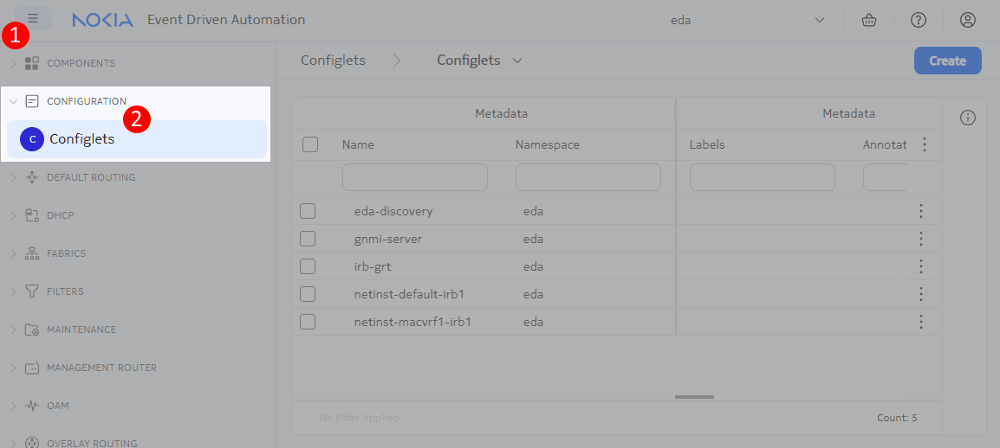

# Configlets

<script type="text/javascript" src="https://viewer.diagrams.net/js/viewer-static.min.js" async></script>

-{}-

|                       |                                                 |
| --------------------- | ----------------------------------------------- |
| **Short Description** | Using EDA Configlets to configure an NTP server |
| **Difficulty**        | Beginner                                        |
| **Topology Nodes**    | :material-router: leaf11-13, :material-router: spine11-12                        |

As we established in the [Declarative Intents](./declarative-intents.md) exercise, EDA intents define the desired state of a given service, protocol, deployment or in general any component of a target system. An application developer, be it Nokia or a 3rd-party, can create resources that declaratively define a particular aspect of a target element. But clearly, the development of EDA apps happens in stages, and not everything on a target node may already have a corresponding EDA App that automates the desired state.

In these cases where the desired state cannot be expressed using EDA intents alone it would be great to have a way to provision a user-defined configuration on a target node. This is what Configlets are for!

## Objective

Your task is to configure an new gRPC server on all switches in your fabric. Since there is not EDA App that allows to configure the gRPC server you will have to use the Configlet and provide the configuration yourself.

## Technology explanation

The -{{icons.circle(letter="C", text="Configlets")}}- resource located in the -{{icons.configuration()}}- category is a low level resource that allows a user to define the configuration in the JSON format that will be applied to the target node at a defined path. It is meant to be a stop-gap solution for configuration regions or objects that are not covered by EDA Apps.

The benefits of Configlets:

- Full configuration coverage. By providing node-level config snippets you can configure the darkest corners of a supported network OS.

But the drawbacks are very much noticeable:

- No abstraction. You provide the config in the node-level JSON format, so it can get large very quickly.
- No vendor-agnosticism. You have to know the exact configuration format of the target node, if you have multiple network OSes that you want to cover with a Configlet resource, you should specify the same config twice in two different native OS configurations.
- No state associated with the created object. Your configlet is just a way to deliver the configuration to the node, but if this config resulted in a working service - you wouldn't know.
- Linking to other resources is not possible. You can't request an IP or refer to a created object. Just the raw config itself.

A Configlet resource example looks like this:

```yaml
apiVersion: config.eda.nokia.com/v1alpha1
kind: Configlet
metadata:
  name: my-configlet
  namespace: eda
spec:
  endpointSelector:
    - key=value
  operatingSystem: srl # set to the EDA-supported OS
  configs:
    - path: .some.path{.name=="new-name"}
      operation: Create
      config: |-
        {
          "name": "new-name",
          "some-key": "some-value",
        }
```

It has the `endpointSelector` attribute that allows you to specify the target nodes using the [label selection](label-based-selection.md) mechanism.

The `operatingSystem` attribute specifies the target network OS, and you can see that you can only have one OS per resource, which proves that you need to create multiple resources if you want to cover multiple OSes.

The `configs` list allows to specify multiple configurations for the same target node. Each config snippet has a `path` where the `config` blob will be inserted, and an `operation` that specifies the action to be performed on the target node.

## Tasks

/// admonition | See [Access Details](../index.md#access-details) if you need a reminder on how to access the nodes in the topology.
    type: subtle-question
///

Your task is to create a new gRPC server on all switches in your fabric. The gRPC server should be named `hackathon-grpc` and run over port `55555`; it should have gNMI service enabled.

Since there is no EDA app yet to create the gRPC server, you will have to use a Configlet resource to achieve this.

### Configure the gRPC server in SR Linux

With Configlets, you have to specify the configuration yourself in the resource body. That means you first need to obtain the config in JSON format, as this is the format accepted by the Configlet.

The easiest way to get the config in the desired format is to create a candidate configuration for an object on the Network OS and then display it in the JSON format. SR Linux supports both candidates and JSON output, so what you need is to configure the gRPC server as per task description.

You are encouraged to try to configure an gRPC server yourself if you feel like it, but as this is an EDA exercise and not an SR Linux exercise, here is the procedure how to do that:

1. Login to any leaf switch in your fabric
2. Enter in the candidate mode with `enter candidate` command
3. When in the candidate mode, paste the following snippet that configures the NTP server as per the requirements

    ```srl
    system {
      grpc-server hackathon-grpc {
        admin-state enable
        port 55555
        services [
            gnmi
        ]
      }
    }
    ```

4. Now enter in the context of a candidate config for the gRPC server:

    ```srl
    --{ * candidate shared default }--[  ]--
    A:g15-leaf11# system grpc-server hackathon-grpc

    --{ * candidate shared default }--[ system grpc-server hackathon-grpc ]--
    A:g15-leaf11#
    ```

5. Since Configlet resource can insert the config at the specified path (provided in the JSONPath notation) we can display that path using the `pwc` command in SR Linux:

    ```srl
    --{ * candidate shared default }--[ system grpc-server hackathon-grpc ]--
    A:g15-leaf11# pwc jspath
    .system.grpc-server{.name=="hackathon-grpc"}
    ```

    The displayed path is what goes into the `.spec.configs[].path` field of the Configlet resource. Note it down.

6. Now display the config under this path in JSON format:

    ```srl
    --{ * candidate shared default }--[ system grpc-server hackathon-grpc ]--
    A:g15-leaf11# info | as json
    {
      "name": "hackathon-grpc",
      "admin-state": "enable",
      "port": 55555,
      "services": [
        "gnmi"
      ]
    }
    ```

    Great, that's it.

### Navigate to the Configlets menu

Now that we have all information we need, let's create the Configlet resource.

Look at the app menu in the left sidebar for -{{icons.circle(letter="C", text="Configlets")}}- in the -{{icons.configuration()}}- category.



When you click on the -{{icons.circle(letter="C", text="Configlets")}}- menu element, you get the list of existing Configlets. These were required for us to create the hackathon infra. As you can see, we used EDA to configure the fabric, and we had a use case for Configlets ourselves.

### Creating a new configlet

Click on **Create** button and start filling in the form or YAML representation with the information you collected so far. Shouldn't be hard now.

Maybe one hint for you, the Configlet allows you to list the nodes you wish to apply Configlet to manually using the `endpoints` field, or use the label selection via the `endpointsSelector` field. You can check what labels do your nodes have and pick the right ones to select leaf and spine switches.

The solution can be found below in the YAML format if you want to have a shortcut, but better ask our experts for guidance. Still, you can copy this yaml object into the right column in the edit form to set the values to the right ones.

/// details | Solution
    type: success

```
apiVersion: config.eda.nokia.com/v1alpha1
kind: Configlet
metadata:
  name: hackathon-grpc-exercise
  namespace: eda
  labels:
    role: exercise
spec:
  configs:
    - config: |
        {
          "name": "hackathon-grpc",
          "admin-state": "enable",
          "port": 55555,
          "services": [
            "gnmi"
          ]
        }
      operation: Create
      path: .system.grpc-server{.name=="hackathon-grpc"}
  endpointSelector:
    - eda.nokia.com/role=leaf
    - eda.nokia.com/role=spine
  operatingSystem: srl
```

///

### Check your work

If you have used the [Dry Run](declarative-intents.md#dry-run) functionality, you have already seen the diff of your intended change. But if you committed right away, you always have a chance to open up the Transaction history and switch to the diffs view to explore them:

-{{video(url="https://gitlab.com/rdodin/pics/-/wikis/uploads/7b3a5b14da793ca84106887265ce9ae7/CleanShot_2025-05-12_at_14.08.28.mp4")}}-

## Summary

In this exercise, you learned how to use EDA Configlets to configure network elements when there isn't a dedicated EDA App available for your specific configuration needs. You've successfully:

1. Created a Configlet resource to configure a gRPC server on all switches in your fabric
2. Learned how to extract the JSON path and configuration in JSON from SR Linux
3. Applied the configuration using label-based selection to target specific nodes

Configlets serve as a powerful stop-gap solution when you need to configure aspects of your network that aren't yet covered by EDA Apps. While they lack the abstraction, vendor-agnosticism, and state awareness of proper EDA intents, they provide complete configuration coverage by allowing you to specify node-level configuration snippets directly.

Remember that Configlets should be used judiciously - they're best suited for temporary solutions until proper EDA Apps become available for your configuration needs. The ideal approach is to use declarative intents whenever possible, falling back to Configlets only when necessary.
