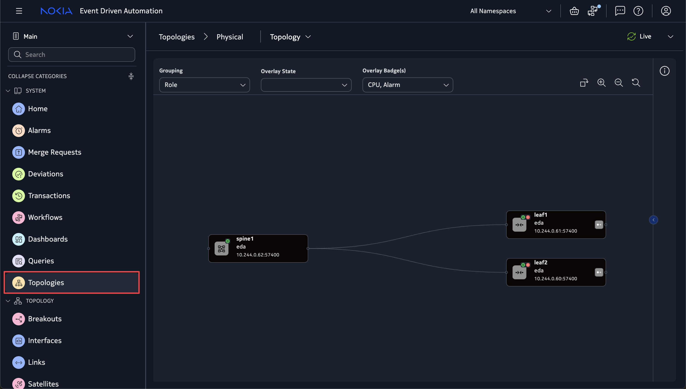
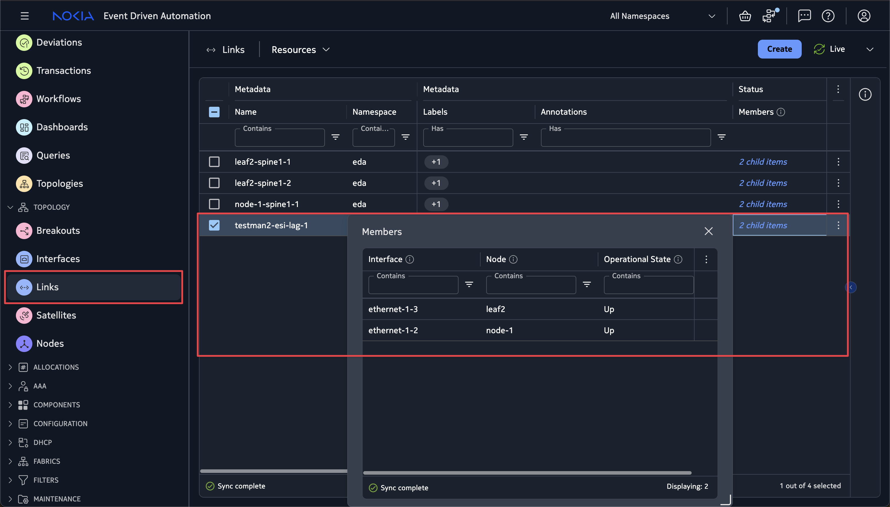
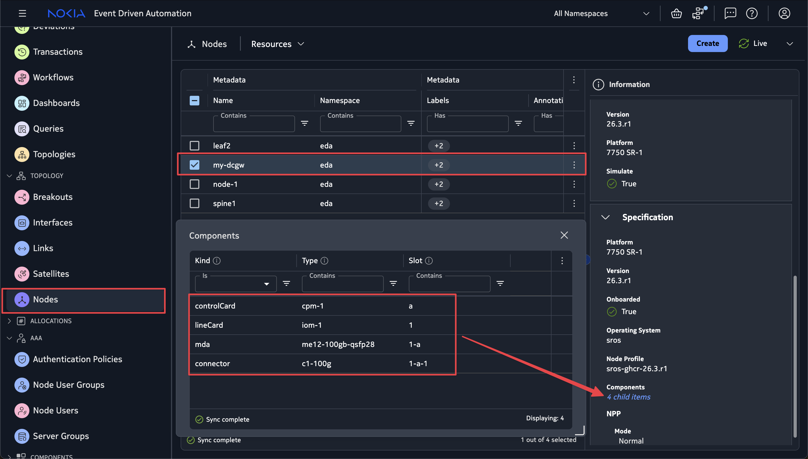
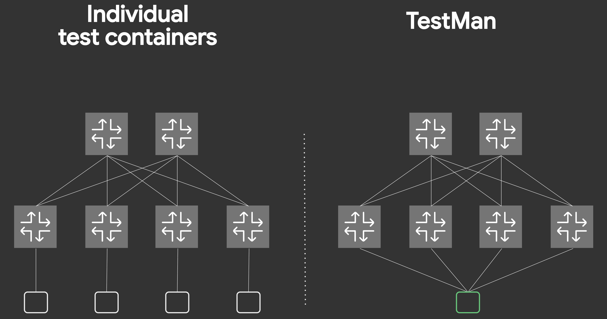

# Topology simulation with EDA Digital Twin

| <nbsp> {: .hide-th }        |  |
| --------------------------- |  |
| **Activity name**           | Topology simulation with EDA Digital Twin |
| **Difficulty**              | Beginner |
| **References**              | [EDA Digital Twin docs](https://docs.eda.dev/26.4/digital-twin/) |

One of the powerful features of Nokia EDA is its Digital Twin - a horizontally scalable, virtual environment with a complete replica of the production network.

It is useful for the whole network lifecycle, from day 0 to day 2+ operations. You can safely experiment with, design, develop and validate your network - all without touching production hardware. Safe, fast, and reliable.

In this exercise you are going to solve a challenge that every data center network engineer faces: how to create a virtual twin of a DC fabric and evolve it as requirements in our datacenter change.

## Objective

In this activity you will:

- Learn what the EDA Digital Twin is.
- Understand how EDA represents a network topology.
- Deploy a simulated topology using the NetworkTopology workflow.
- Graphically build a topology using the TopoBuilder tool.
- Use TestMan to verify connectivity in the virtualized fabric.

<!-- --8<-- [start:connectivity-details] -->
/// note | Connectivity details
For this activity only you are going to use an EDA instance that is designated to host the digital twin. Access this instance by going to https://1.eda.srexperts.net and log in with the following credentials:

- username: admin<b><ID></b> where <ID> is your group number
- password: the event password provided to you (common for all instances of the hackathon)
///
<!-- --8<-- [end:connectivity-details] -->

## Technology explanation

### The Digital Twin

EDA's Digital Twin is a unique network virtualization platform that leverages the Kubernetes platform that EDA itself runs on.

Running the digital twin on Kubernetes allows EDA to scale to meet the high node counts of real production network topologies.

Naturally as with Kubernetes, EDA uses the containerized network simulator images for both Nokia SR Linux and Nokia SR OS.  
These both behave like the real hardware from a configuration perspective, which will help in configuration validation and change management.

/// admonition | What about other vendors?
    type: question
EDA ramps up support for multiple 3rd party network operating systems for which the corresponding virtual image can be used in the Digital Twin. This activity only focuses on Nokia SR Linux and Nokia SR OS.
///

### EDA Resource refresher

The cornerstone of EDA ethos is its declarative nature to configure the network. Under the hood this is underpinned by the use of Resources - the intent captured in the declarative format that EDA knows how to consume.

EDA represents many things via these resources such as BGP peers, static routes, QoS policies, Filters, Virtual Networks, etc.

Same is true for defining the network topology and its components. There are many resources which make up the topology, and these are important to know and understand.

### What makes up an EDA topology?

A topology in itself is a collection of links and nodes. In EDA we have three main resources for this:

- **`TopoNode`** -Represents a node in the topology (for example: A switch, or a router)
- **`TopoLink`** - Represents a link. A connection between two nodes in the topology
- **`Interface`** - Represents an interface on a node in the topology

We also have counterpart resources for the virtual digital twin (or sim) domain. These are:

- **`SimNode`** - Represents a `TopoNode` in the Digital Twin domain
- **`SimLink`** - Represents a `TopoLink` in the Digital Twin domain

/// note | Automatic sim resource creation
When using the Digital Twin in EDA, if a `TopoNode/TopoLink` resource is defined then the corresponding `SimNode/SimLink` resources are automatically created.
///

The EDA instances you are using have the default [Try EDA](https://docs.eda.dev/26.4/getting-started/try-eda/) topology already running in the `eda` namespace. You can inspect the cluster resources to find the following topology resources representing this two leaf, one spine topology:

<figure markdown="1">

</figure>

```bash title="Get TopoNodes"
edactl -n eda get TopoNodes #(1)!
```

1. This command uses [**`edactl`**](https://docs.eda.dev/26.4/user-guide/command-line-tools/#edactl) CLI tool to query the EDA cluster for all `TopoNode` resources.

<div class="embed-result">
```
NAME     PLATFORM       VERSION   OS    ONBOARDED   MODE     NPP         NODE
leaf1    7220 IXR-D3L   26.3.1    srl   true        normal   Connected   Synced
leaf2    7220 IXR-D3L   26.3.1    srl   true        normal   Connected   Synced
spine1   7220 IXR-D5    26.3.1    srl   true        normal   Connected   Synced
```
</div>

We can also take a look and see that the SimNode resources are there for the nodes as well, which indicates the digital twin is in use.

Also notice the `testman-default` SimNode. We will touch on this later in the [TestMan](#adding-testman-to-the-digital-twin-topology) section.

```bash title="Get SimNodes"
edactl -n eda get SimNodes
```

<div class="embed-result">
```
NAME
leaf1
leaf2
spine1
testman-default
```
</div>

#### What the resources actually look like

What we saw just above was a list of all the topology resources in the cluster. What actually is in the resource itself?

Let's zoom in and take a closer look at the information defined in these custom resources.

/// admonition | CRD Browser
    type: tip
The EDA CRDs are easy to view via the [CRD Browser](https://crd.eda.dev).

CRDs (custom resource **definitions**) are essentially schemas that **define** what information will be found in a CR.

///
/// tab | TopoNode

Taking a look at the leaf1 `TopoNode` resource we can see the key information about the leaf1 node.

```
edactl -n eda get toponode leaf1 -o yaml
```

<div class="embed-result">
```yaml
apiVersion: core.eda.nokia.com/v1
kind: TopoNode
metadata:
  labels:
    eda.nokia.com/role: leaf # (1)!
    eda.nokia.com/security-profile: managed
  name: leaf1
  namespace: eda
spec:
  nodeProfile: srlinux-ghcr-26.3.1
  npp:
    mode: normal
  onBoarded: true
  operatingSystem: srl # (2)!
  platform: 7220 IXR-D3L # (3)!
  productionAddress: {}
  version: 26.3.1 # (4)!
```
</div>
1. The node has the role `leaf`
2. It's running SR Linux
3. The hardware platform is 7220 IXR-D3L
4. The software version is 26.3.1

:material-link: [TopoNode CRD Reference](https://crd.eda.dev/toponodes.core.eda.nokia.com/v1)

///
/// tab | TopoLink

Taking a look at the `TopoLink` resource for the link between leaf1 and spine1:

```yaml
apiVersion: core.eda.nokia.com/v1
kind: TopoLink
metadata:
  labels:
    eda.nokia.com/role: interSwitch
  name: leaf1-spine1-1
  namespace: eda
spec:
  links:
  - local:
      interface: ethernet-1-1 # (1)!
      interfaceResource: leaf1-ethernet-1-1
      node: leaf1
    remote:
      interface: ethernet-1-1
      interfaceResource: spine1-ethernet-1-1
      node: spine1
    type: interSwitch
status:
  members:
  - interface: ethernet-1-1
    node: leaf1
    operationalState: Up # (2)!
  - interface: ethernet-1-1
    node: spine1
    operationalState: Up
  operationalState: up # (3)!
```

1. Both nodes connect via `ethernet-1-1`
2. Each interface is operationally up
3. The link overall is operationally up

:material-link: [TopoLink CRD Reference](https://crd.eda.dev/topolinks.core.eda.nokia.com/v1)

///
/// tab | SimNode

The leaf1 `SimNode` resource mirrors the `TopoNode` however with additional simulation-specific fields.

```yaml
apiVersion: core.eda.nokia.com/v1
kind: SimNode
metadata:
  labels:
    eda.nokia.com/role: leaf
    eda.nokia.com/security-profile: managed
    eda.nokia.com/source: derived
  name: leaf1
  namespace: eda
spec:
  containerImage: ghcr.io/nokia/srlinux:26.3.1-410 # (1)!
  dhcp:
    preferredAddressFamily: IPv4
  gatewayAddress:
    ipv4: 192.168.1.1/16
  imagePullSecret: core # (2)!
  license: cx-srl-26-3-1-ghcr-license # (3)!
  operatingSystem: srl
  platform: 7220 IXR-D3L
  port: 57400
  productionAddress:
    ipv4: 192.168.0.2/16
  serialNumberPath: ""
  version: 26.3.1
  versionMatch: v26\.3\.1.*
  versionPath: .system.information.version
```

1. The container image used for the virtual node
2. The image pull secret used to pull the container image
3. The name of the license `ConfigMap` for the simulated node

:material-link: [SimNode CRD Reference](https://crd.eda.dev/simnodes.core.eda.nokia.com/v1)

///
/// tab | Interface

The `leaf1-ethernet-1-1` resource represents interface ethernet-1/1 on leaf1:

```yaml
apiVersion: interfaces.eda.nokia.com/v1
kind: Interface
metadata:
  labels:
    eda.nokia.com/role: interSwitch
  name: leaf1-ethernet-1-1
  namespace: eda
spec:
  enabled: true
  encapType: "Null" # (1)!
  ethernet:
    stormControl: {}
  lldp: true # (2)!
  members:
  - enabled: true
    interface: ethernet-1-1
    lacpPortPriority: 32768
    node: leaf1
  type: Interface
status:
  enabled: true
  lastChange: "2026-05-04T04:53:57.800Z"
  members:
  - enabled: true
    interface: ethernet-1-1
    lastChange: "2026-05-04T04:53:57.800Z"
    neighbors:
    - interface: ethernet-1/1 # (3)!
      node: spine1
    node: leaf1
    nodeInterface: ethernet-1/1
    operationalState: Up
    speed: 100G # (4)!
  operationalState: Up
  speed: 100G
```

1. Encapsulation is null (untagged)
2. LLDP is enabled on this interface
3. Detected peer is spine1 on ethernet-1/1
4. This is a 100G interface

:material-link: [Interface CRD Reference](https://crd.eda.dev/interfaces.interfaces.eda.nokia.com/v1)
///

#### Edge and ISL Links

When taking a look at the TopoLink resource, you may have noticed there was a link type field. Which was set to `InterSwitch` for our `leaf1-spine1-1` `TopoLink` resource.

In EDA we have the following link types:

- **Inter-Switch Links (ISL)** - Connect fabric nodes to each other (ie. leaf <-> spine). These are the backbone of our fabric and always have a local and remote endpoint defined
- **Edge links** - Connect nodes to external devices. Typically workloads (compute, storage, firewalls etc). Edge links typically only have a local endpoint defined, since the remote device is outside EDA's management domain

### Workflows in EDA

Now we know what resources make up a topology, but in a typical fabric you could have a massive topology and making all these resources individually is super tedious and not practical. It would be much easier to define the abstracted topology composition and let some automation generate the underlying resources...

This is where EDA **workflows** come into play. Workflows are run-to-completion programs that power any non-event-driven automation in EDA.  
Run a ping or traceroute - workflow. Upgrade an image on a node - workflow. Rotate a certificate - workflow again.

So it is natural to see the **`NetworkTopology`** workflow being used to enable an abstracted definition of your Topology as a single resource, and upon execution of the workflow all the underlying resources will be created automatically by EDA.

#### The NetworkTopology Workflow

The `NetworkTopology` workflow is the declarative way to define and deploy your network with EDA. It combines node definitions, link definitions, simulation parameters, and has powerful templating features into a single resource. Thus making fabric creation easy.

Below is an example of the default 'Try EDA' 2 leaf, 1 spine topology.

/// details | Full 'Try EDA' NetworkTopology Workflow definition  (click to expand)
    type: example

```yaml
--8<-- "docs/eda/beginner/assets/try-eda-wf.yaml"
```

///

We can use the CRD browser to take a look at some key parts of the Workflow definition.

:material-link: [NetworkTopology CRD](https://crd.eda.dev/networktopologies.topologies.eda.nokia.com/v1)

There are some key sections to the Workflow.

- **`nodeTemplates`** - Reusable templates which define parameters for nodes in the topology are defined.
- **`linkTemplates`** - Same concept for links in the fabric. Reusable templates which define parameters for links in the topology are defined.
- **`nodes`** - Instances of nodes in the topology (logically this is a `TopoNode`)
- **`links`** - Instances of links in the topology (logically this is a `TopoLink`)
- **`simulation`** - Definition for `simNodeTemplates` and `SimNode` instances in the topology, for the simulation/Digital Twin domain.

You may notice the usage of templates. The `NetworkTopology` workflow is template driven so that parameters for a certain node type/role can be defined once and then applied to instances of nodes in the topology.

This reduces the 'bloat' in large topology files and makes it easier to change parameters on large sets of nodes/links in the topology.

#### NetworkTopology Workflow Structure

##### Operations

The `operation` field controls how EDA applies the workflow resources.

| Operation | Action |
| - | - |
| `Reconcile` **(Default)** | Reconcile the topology resources from the defined workflow. Essentially triggers re-enforcement of the resource(s) to their desired state. This allows a user to add or remove nodes/links from the topology without having to figure out how to add/delete the underlying objects. EDA will reconcile the existing resources with the new ones defined in the workflow. |
| `Create` | Creates the topology resources defined in the workflow. |
| `Replace` | Replaces existing resources based on defined resource names from the workflow definition. |
| `ReplaceAll` | Delete all existing topology resources, then create new ones from defined workflow. This is typically used for fresh deployments when you want to apply the topology in a clean state and ensure that the nodes are started from scratch. |
| `Delete` | Delete resources based on defined resource names from workflow definition. |
| `DeleteAll` | Delete all topology resources in the namespace. |

##### Node Templates

The `nodeTemplates` section defines the templates, which are reusable sets of parameters which apply to the node instances in the topology.

The key fields are:

| Field | Description |
| - | - |
| `name` | The unique identifier for the node template. |
| `nodeProfile` | Reference to the name of the `nodeProfile` that the nodes will use. |
| `platform` | The hardware platform of the node. Like `7220 IXR-D3L`. |
| `license` | Reference to the name of the `ConfigMap` which holds the license key for the node. |
| `components` | Define the hardware components & chassis layout for the node. |

/// admonition | What is a `nodeProfile`?
    type: question
A **`nodeProfile`** is a resource which contains specific parameters relevant to the management of the node; Such as the software image, version, credentials etc.

The node profile must be available in the EDA instance before usage in the topology.
///

##### Link Templates

The `linkTemplates` section defines the templates, which are reusable sets of parameters which apply to the link instances in the topology.

The key fields are:

| Field | Description |
| - | - |
| `name` | The unique identifier for the link template. |
| `speed` | The speed of the link (ie. 1G, 10G, 100G, 800G etc.). |
| `type` | The link type (`Edge`, `InterSwitch` or `Loopback`). |
| `encapType` | Whether the interfaces are tagged or untagged (`Null` = Untagged, `Dot1q` = Tagged) |

## Tasks

--8<-- "docs/eda/beginner/digital-twin.md:connectivity-details"

### Bootstrap the namespace

The EDA instance you are using for this activity is shared across all groups, which means you need to scope your work to a specific namespace to avoid conflicts with other attendees going over the same activity.

EDA supports the notion of namespaces, which allow operators to scope their resources to a specific namespace, which in our case would be a "workspace" for your group. Make sure you check what group ID you have been assigned and execute the namespace creation command to create your unique namespace by replacing <ID> with your group number:

```bash title="Execute on the 1.srexperts.net instance"
edactl namespace bootstrap create --from-namespace eda group<ID> #(1)!
```

1. Make sure to replace <ID> with your group number.

This command should create a namespace in EDA that you should be using for the rest of the activity. In the EDA UI go and select your freshly minted namespace:

-{{image(url="images/ns-selection.png", padding=20, shadow=True, title="Select your namespace")}}-

### Deploy the Try EDA topology

First, we'll stand up our own Try EDA topology that consists of three nodes (2x leafs, 1x spine) using the `NetworkTopology` workflow.

1. Navigate to the [workflows](https://1.eda.srexperts.net/ui/main/workflows) in EDA UI.
2. Create a new workflow execution of `NetworkTopology`.
3. Paste in the [workflow YAML](#the-networktopology-workflow)
4. Ensure that you fill in the namespace field in the YAML you pasted, as it is intentionally left blank.
5. Run it.

-{{image(url="../../images/eda/digital-twin/workflow-hint.png", padding=0, title="Workflows application in EDA UI")}}-

#### Verification

In the homepage view you should start to see node and interface counts increasing and the nodes transitioning to the `Synced` state and the interfaces transitioning to the `Up` state.

-{{image(url="../../images/eda/digital-twin/deployed-try-eda-topo.png", padding=0)}}-

Checking the topology view, we should see our nodes there.

-{{image(url="../../images/eda/digital-twin/deployed-try-eda-topo2.png", padding=0)}}-

#### Inspect the Deployed Resources

Now let's verify that all the resources were created correctly.

Use `edactl get -n group<ID> <resource>` to list the topology and simulation resources.

Replace `<resource>` placeholder with the resource types we learned earlier.

We should find that they are all present in the cluster.

### TopoBuilder

The `NetworkTopology` workflow has simplified the topology creation in EDA, but we can take it a step further thanks to the community-driven [TopoBuilder](https://topobuilder.x.eda.dev) tool.

[TopoBuilder](https://topobuilder.x.eda.dev) is a WYSIWYG (*What You See Is What You Get*) topology editor and provides a GUI-driven flow to configure the parameters for the nodes/links used in the topology.

TopoBuilder can be found at [topobuilder.x.eda.dev](https://topobuilder.x.eda.dev).

Below are some demos of basic operations.

/// tab | Adding nodes
Right-click on the empty canvas, and click **'Add Node'** or **'Add SimNode'**.
<video controls>
  <source src="../../../images/eda/digital-twin/AddNodes.mp4" type="video/mp4">
</video>
///
/// tab | Adding links
Upon hovering on a node, click and drag from one of the circular drag handles to the drag handles on another node to create a link between the two nodes.
<video controls>
  <source src="../../../images/eda/digital-twin/AddLinks.mp4" type="video/mp4">
</video>
///
/// tab | Local LAGs
Shift-select[^1] links between a pair of nodes. Then right click and click **'Create local LAG'**.

<video controls>
  <source src="../../../images/eda/digital-twin/LocalLag.mp4" type="video/mp4">
</video>

///
/// tab | ESI-LAGs
Shift-select[^1] links that source from a SimNode and connect to two or more different leaf nodes. Then right click and click **'Create ESI-LAG'**.

<video controls>
  <source src="../../../images/eda/digital-twin/EsiLag.mp4" type="video/mp4">
</video>
///

### Add a node to the network

The fabric is live, but now requirements have changed and we need to grow the fabric to accommodate new workloads. Let's add a new leaf node.

1. Paste the [Try EDA topology workflow](#the-networktopology-workflow) into the TopoBuilder tool
2. {== Make sure to change the namespace field in the pasted YAML in the TopoBuilder UI to match your namespace, as by default it is empty==}
3. Use the TopoBuilder to insert a new leaf node using the canvas (right button click to add the node) and connect it to `spine1`.
4. Copy the YAML using the :material-content-copy: button in the toolbar.
5. Create a new workflow in your namespace and paste in the YAML you copied.
6. Run the workflow.

After deploying, we should see our new leaf node in the topology.

/// details | Verification

After successful deployment of the workflow, we should see our new node in EDA.

/// tab | EDA UI
-{{image(url="../../images/eda/digital-twin/inserted-node.png", padding=0)}}-
///

/// tab | `edactl`

Confirm the new `node-1` appears and is onboarded.

```bash title="Get TopoNodes"
edactl -n eda get TopoNodes
```

<div class="embed-result">
```
NAME     PLATFORM       VERSION   OS    ONBOARDED   MODE     NPP         NODE
leaf1    7220 IXR-D3L   26.3.1   srl   true        normal   Connected   Synced
leaf2    7220 IXR-D3L   26.3.1   srl   true        normal   Connected   Synced
node-1   7220 IXR-D3L   26.3.1   srl   true        normal   Connected   Synced
spine1   7220 IXR-D5    26.3.1   srl   true        normal   Connected   Synced
```
</div>
///

///

### `Reconcile` operation

We just inserted a new node by using the `ReplaceAll` operation, this worked well but what it did under the hood is remove and redeploy the existing nodes just to introduce a single new node.

This doesn't really make sense as we didn't need to touch the other nodes in the topology.

This is where the `Reconcile` operation comes in handy. Our input workflow would become the desired state, and what we have is the current state.

With the `Reconcile` operation, EDA only makes the differential changes required to achieve the desired state.

#### Remove a node from the network

Now we need to remove a switch; perhaps it's being decommissioned or simply no longer needed. Use the `Reconcile` operation to remove the node we just added.

With `Reconcile`, we define the desired end state of the topology as it should look *without* `node-1`.

/// details | Solution & Verification
Our workflow definition should include only the nodes and links that we want to keep.

We need to set the operation to `Reconcile` and remove `node-1` from the workflow definition, as well as any links it may have had connecting to it.

In TopoBuilder this is done easily, by just right-clicking on the `node-1` node and deleting it. The links for the node are then automatically deleted.

```diff title="Change operation to Reconcile"
apiVersion: topologies.eda.nokia.com/v1
kind: NetworkTopology
metadata:
  name: 46-add-node-topobuilder
spec:
-  operation: ReplaceAll
+  operation: Reconcile
```

```diff title="Delete node-1 node"
  nodes:
    - name: leaf1
      template: leaf
    - name: leaf2
      template: leaf
    - name: spine1
      template: spine
-   - name: node-1
-     template: leaf
```

After executing the workflow, EDA removes `node-1` while leaving the other nodes untouched.

/// tab | EDA UI

///

/// tab | `edactl`

Confirm `node-1` is gone and the other nodes we didn't intend to remove are still present.

```bash title="Get TopoNodes"
edactl -n eda get TopoNodes
```

<div class="embed-result">
```
NAME     PLATFORM       VERSION   OS    ONBOARDED   MODE     NPP         NODE
leaf1    7220 IXR-D3L   26.3.1    srl   true        normal   Connected   Synced
leaf2    7220 IXR-D3L   26.3.1    srl   true        normal   Connected   Synced
spine1   7220 IXR-D5    26.3.1    srl   true        normal   Connected   Synced
```
</div>
///

///

### Configure LAGs and ESI-LAGs

With the fabric taking shape, production workloads will need more bandwidth and redundancy. LAGs (Link Aggregation Groups) are a common solution, and EDA makes them easy to add declaratively.

In EDA there are two LAG types:

- **Local LAG** - A LAG created between a pair of two nodes.

- **ESI-LAG** - A LAG created between two or more devices in the fabric AND a single external device. Typically for multihoming workloads (such as storage or compute that should connect to many leaf nodes).

#### Local LAG

In the `NetworkTopology` workflow, a local LAG is defined by specifying multiple endpoints that reference the **same** pair of nodes:

```yaml
links:
  - name: local-lag-example
    template: isl
    endpoints:
      - local:
          node: leaf1
          interface: ethernet-1-10
        remote:
          node: spine1:
          interface: ethernet-1-5
      - local:
          node: leaf1
          interface: ethernet-1-11
        remote:
          node: spine1:
          interface: ethernet-1-6
```

Edge LAGs can be created by omitting the `remote:` portion from the endpoint.

```yaml
links:
  - name: leaf1-e1011
    template: edge
    endpoints:
      - local:
          node: leaf1
          interface: ethernet-1-10
      - local:
          node: leaf1
          interface: ethernet-1-11
```

When EDA processes this definition, it creates a single `Interface` resource for the LAG interface with multiple members.

#### ESI-LAG

Since the external device is outside EDA's management domain the ESI-LAGs are **edge links**. The key difference from a local LAG is that the endpoints reference **different** fabric nodes:

```yaml
links:
  - name: esi-lag-example
    template: edge
    endpoints:
      - local:
          node: leaf1
          interface: ethernet-1-1
      - local:
          node: leaf2
          interface: ethernet-1-1
```

In the Digital Twin, we use the `simNode` to represent the external devices.

When defining the ESI-LAG in the Digital Twin, each defined endpoint includes the `sim` block with the corresponding simNode and interface for that particular endpoint:

```yaml
links:
  - name: esi-lag-sim-example
    endpoints:
      - local:
          node: leaf1
          interface: ethernet-1-1
        sim:
          simNode: workload
          simNodeInterface: eth1
      - local:
          node: leaf2
          interface: ethernet-1-1
        sim:
          simNode: workload
          simNodeInterface: eth2
    template: edge
```

Notice that each endpoint is connected to the same `SimNode` (`workload`), however on different interfaces. This means the `SimNode` is dual-homed to both `leaf1` and `leaf2`.

#### Create an ESI-LAG

A new server needs redundant connectivity. Create an ESI-LAG that connects it to both `node-1` and `leaf2`.

- Add a new SimNode to act as our server.
    - Set the `simTemplate` to `server`.
- Create the edge links from our `node-1` and `leaf-2` leaf nodes to the server.
- Convert the two links into the ESI-LAG.
- Verify that the ESI-LAG `TopoLink` resource was created.

/// details | Solution & Verification
The output workflow should look like below. Notice two key things:

- Under `simulation.simNodes` we have a new `my-server` node. This is our mock server.
- We set it to use the `server` sim template, which uses a simple Linux container image.
- Under `links` we have the new `testman2-esi-lag-1` which has endpoint entries for **two different** nodes (`leaf2` and `node-1`).
<video controls>
  <source src="../../../images/eda/digital-twin/SimEsiLag.mp4" type="video/mp4">

</video>

Let's verify the resources created from the workflow.

/// tab | EDA UI

///

/// tab | `edactl`

Confirm `my-server-esi-lag-1` appears and is operationally up.

```bash title="Get TopoLinks"
edactl -n eda get TopoLinks
```

<div class="embed-result">
```
NAME                  OPERATIONAL STATE
leaf1-2-e1212         up
leaf1-e1011           up
leaf1-ethernet-1-3    up
leaf1-ethernet-1-4    up
leaf1-ethernet-1-5    up
leaf1-ethernet-1-6    up
leaf1-ethernet-1-7    up
leaf1-ethernet-1-8    up
leaf1-ethernet-1-9    up
leaf1-spine1-1        up
leaf1-spine1-2        up
leaf2-e1011           up
leaf2-ethernet-1-3    up
leaf2-ethernet-1-4    up
leaf2-ethernet-1-5    up
leaf2-ethernet-1-6    up
leaf2-ethernet-1-7    up
leaf2-ethernet-1-8    up
leaf2-ethernet-1-9    up
leaf2-spine1-1        up
leaf2-spine1-2        up
my-server-esi-lag-1   up
```
</div>

Inspect the endpoints to verify they connect to different nodes (`leaf2` and `node-1`).

```bash title="Get TopoLink resource data"
edactl get -n eda TopoLink my-server-esi-lag-1 -o yaml
```

<div class="embed-result">
```yaml
apiVersion: core.eda.nokia.com/v1
kind: TopoLink
metadata:
  labels:
    eda.nokia.com/role: edge
  name: my-server-esi-lag-1
  namespace: eda
spec:
  links:
  - local:
      interface: ethernet-1-13
      interfaceResource: lag-my-server-esi-lag-1-local
      node: leaf2
    remote:
      interfaceResource: ""
      node: ""
    type: edge
  - local:
      interface: ethernet-1-13
      interfaceResource: lag-my-server-esi-lag-1-local
      node: leaf1
    remote:
      interfaceResource: ""
      node: ""
    type: edge
status:
  members:
  - interface: ethernet-1-13
    node: leaf2
    operationalState: Up
  - interface: ethernet-1-13
    node: leaf1
    operationalState: Up
  operationalState: up
```
</div>

///

/// details | Solution workflow definition (click to expand)

```yaml
apiVersion: topologies.eda.nokia.com/v1
kind: NetworkTopology
metadata:
  name: 46-esi-lag
  namespace: ""
spec:
  operation: Reconcile
  nodeTemplates:
    - name: leaf
      labels:
        eda.nokia.com/role: leaf
        eda.nokia.com/security-profile: managed
      nodeProfile: srlinux-ghcr-26.3.1
      platform: 7220 IXR-D3L
    - name: spine
      labels:
        eda.nokia.com/role: spine
        eda.nokia.com/security-profile: managed
      nodeProfile: srlinux-ghcr-26.3.1
      platform: 7220 IXR-D5
  nodes:
    - name: leaf1
      template: leaf
      annotations:
        topobuilder.eda.labs/x: "100"
        topobuilder.eda.labs/y: "210"
    - name: leaf2
      template: leaf
      annotations:
        topobuilder.eda.labs/x: "285"
        topobuilder.eda.labs/y: "215"
    - name: spine1
      template: spine
      annotations:
        topobuilder.eda.labs/x: "195"
        topobuilder.eda.labs/y: "50"
  linkTemplates:
    - name: isl
      type: InterSwitch
      speed: 25G
      encapType: "Null"
      labels:
        eda.nokia.com/role: interSwitch
    - name: edge
      type: Edge
      encapType: Dot1q
      labels:
        eda.nokia.com/role: edge
  links:
    - name: leaf1-spine1-1
      endpoints:
        - local:
            node: leaf1
            interface: ethernet-1-1
          remote:
            node: spine1
            interface: ethernet-1-1
      template: isl
    - name: leaf1-spine1-2
      endpoints:
        - local:
            node: leaf1
            interface: ethernet-1-2
          remote:
            node: spine1
            interface: ethernet-1-2
      template: isl
    - name: leaf2-spine1-1
      endpoints:
        - local:
            node: leaf2
            interface: ethernet-1-1
          remote:
            node: spine1
            interface: ethernet-1-3
      template: isl
    - name: leaf2-spine1-2
      endpoints:
        - local:
            node: leaf2
            interface: ethernet-1-2
          remote:
            node: spine1
            interface: ethernet-1-4
      template: isl
    - name: my-server-esi-lag-1
      endpoints:
        - local:
            node: leaf2
            interface: ethernet-1-13
          sim:
            simNode: my-server
            simNodeInterface: eth1
        - local:
            node: leaf1
            interface: ethernet-1-13
          sim:
            simNode: my-server
            simNodeInterface: eth2
      template: edge
    - name: leaf1-ethernet-1-3
      endpoints:
        - local:
            node: leaf1
            interface: ethernet-1-3
      template: edge
    - name: leaf1-ethernet-1-4
      endpoints:
        - local:
            node: leaf1
            interface: ethernet-1-4
      template: edge
    - name: leaf1-ethernet-1-5
      endpoints:
        - local:
            node: leaf1
            interface: ethernet-1-5
      template: edge
    - name: leaf1-ethernet-1-6
      endpoints:
        - local:
            node: leaf1
            interface: ethernet-1-6
      template: edge
    - name: leaf1-ethernet-1-7
      endpoints:
        - local:
            node: leaf1
            interface: ethernet-1-7
      template: edge
    - name: leaf1-ethernet-1-8
      endpoints:
        - local:
            node: leaf1
            interface: ethernet-1-8
      template: edge
    - name: leaf1-ethernet-1-9
      endpoints:
        - local:
            node: leaf1
            interface: ethernet-1-9
      template: edge
    - name: leaf1-e1011
      endpoints:
        - local:
            node: leaf1
            interface: ethernet-1-10
      template: edge
    - name: leaf1-e1011
      endpoints:
        - local:
            node: leaf1
            interface: ethernet-1-11
      template: edge
    - name: leaf1-2-e1212
      endpoints:
        - local:
            node: leaf1
            interface: ethernet-1-12
      template: edge
    - name: leaf2-ethernet-1-3
      endpoints:
        - local:
            node: leaf2
            interface: ethernet-1-3
      template: edge
    - name: leaf2-ethernet-1-4
      endpoints:
        - local:
            node: leaf2
            interface: ethernet-1-4
      template: edge
    - name: leaf2-ethernet-1-5
      endpoints:
        - local:
            node: leaf2
            interface: ethernet-1-5
      template: edge
    - name: leaf2-ethernet-1-6
      endpoints:
        - local:
            node: leaf2
            interface: ethernet-1-6
      template: edge
    - name: leaf2-ethernet-1-7
      endpoints:
        - local:
            node: leaf2
            interface: ethernet-1-7
      template: edge
    - name: leaf2-ethernet-1-8
      endpoints:
        - local:
            node: leaf2
            interface: ethernet-1-8
      template: edge
    - name: leaf2-ethernet-1-9
      endpoints:
        - local:
            node: leaf2
            interface: ethernet-1-9
      template: edge
    - name: leaf2-e1011
      endpoints:
        - local:
            node: leaf2
            interface: ethernet-1-10
      template: edge
    - name: leaf2-e1011
      endpoints:
        - local:
            node: leaf2
            interface: ethernet-1-11
      template: edge
    - name: leaf1-2-e1212
      endpoints:
        - local:
            node: leaf2
            interface: ethernet-1-12
      template: edge
  simulation:
    simNodeTemplates:
      - name: default
        type: TestMan
      - name: server
        type: Linux
        image: ghcr.io/srl-labs/network-multitool
    simNodes:
      - name: testman-default
        template: default
      - name: my-server
        template: server
    topologies:
      - node: "*"
        interface: "*"
        simNode: testman-default
```

///

///

### Adding a DCGW (SR OS)

The DC fabric is running, but now we need WAN connectivity. Let's add a datacenter gateway (DCGW) to connect our fabric to the outside world. For this role, SR OS hardware is the right choice thanks to its stronger routing and WAN feature set.

So far we've only worked with fixed form-factor SR Linux nodes. All ports are built into the chassis, so no additional hardware definition is required besides the chassis type.

Many SR OS devices are modular chassis-based devices, which means we must define the hardware components and chassis layout in our topology.

The key components to know for SR OS devices are:

| Component            | Description                                                                                                             |
|----------------------|-------------------------------------------------------------------------------------------------------------------------|
| CPM                  | Control Processor Module. The card which contains the CPU for the management & control plane of the device.             |
| Line Card (IOM, XCM) | Cards which are for the datapath for high-bandwidth forwarding and advanced features (QoS, MPLS etc.)                   |
| SFM                  | Switch Fabric Module. Internal backplane which interconnects the CPMs & line cards.                                     |
| MDA                  | Media Dependent Adapter. A daughter-card of the line card which provides physical interfaces of a specific form-factor.  |
| Connector                  | Ports which are QSFP28/QSFP-DD which can be broken out into different speeds/counts. |

In the `NetworkTopology` workflow, you define these using the `components` field.

There are many permutations and component combinations that can be had with the plethora of SR OS hardware available, but we will stick to a 7750 SR-1 for this task, as it has quite a basic chassis layout.

```yaml
  nodeTemplates:
    - name: dcgw
      nodeProfile: sros-ghcr-26.3.r1
      platform: 7750 SR-1
      components:
        - kind: controlCard
          type: cpm-1
          slot: a
        - kind: lineCard
          type: iom-1
          slot: "1"
        - kind: mda
          type: me12-100gb-qsfp28 #(2)!
          slot: 1-a
        - kind: connector
          type: c1-100g #(1)!
          slot: 1-a-1
      labels:
        eda.nokia.com/security-profile: managed
        eda.nokia.com/role: borderleaf
```

1. `c1-100g` is a connector type which gives 1x 100G port.
2. `me12-100gb-qsfp28` is an MDA which gives us 12x100G QSFP28 ports.

:material-link: [SimNode CRD Reference](https://crd.eda.dev/simnodes.core.eda.nokia.com/v1) (see the `components` field).

/// admonition | SR OS card/port naming
    type: info

EDA supports multiple vendors (and platforms) which each bring their own interface naming schemes. To provide consistency EDA uses a normalized naming convention which applies to the card slots and ports on SR OS devices.

See the below sample table and [documentation reference](https://docs.eda.dev/26.4/apps/interfaces.eda.nokia.com/docs/resources/interface/#interface-naming-and-normalization) for further info.

| SR OS | EDA | Description |
| - | - | - |
| `1/1/1` | `ethernet-1-a-1` | Linecard 1, MDA "a" (1st), port 1 |
| `2/1/1` | `ethernet-2-a-1` | Linecard 2, MDA "a" (1st), port 1 |
| `2/2/1` | `ethernet-2-b-1` | Linecard 2, MDA "b" (2nd), port 1 |
| `2/2/c1/1` | `ethernet-2-b-1-1` | Linecard 2, MDA "b" (2nd), connector 1, port 1 |

///

Now time to add our DCGW.

/// note
You can use TopoBuilder to add the SR OS nodes and its components to the topology, however, TopoBuilder doesn't yet know what connector you want to use when adding the links. Make sure to consult with the port numbering rules above and edit them accordingly when using the TopoBuilder.
///

We need to:

- Add the node template for our 7750 SR-1 device
    - Ensure it is using nodeProfile `sros-ghcr-26.3.r1`
- Add the relevant CPM, IOM, MDA and Connector components.
- Connect it to the spine node.
    - Double-check to ensure the correct interface name is used.
- Deploy the workflow!

/// details | Solution & Verification

The key step is to add the node template for our 7750 SR-1 device.

We could've either manually created this with the GUI template building capability in TopoBuilder, or even simpler is to copy and paste the `dcgw` template definition from above into our workflow YAML.

We can verify the created resources from the workflow. Note that it may take a bit longer for the SR-OS node to onboard.

/// tab | EDA UI

The `my-dcgw` node is successfully onboarded and we can see our defined components present.


///

/// tab | `edactl`

Confirm `my-dcgw` appears with platform `7750 SR-1` and note the OS should be `sros`.

```bash title="Get TopoNodes"
edactl -n eda get TopoNodes
```

<div class="embed-result">
```
NAME      PLATFORM       VERSION   OS     ONBOARDED   MODE     NPP         NODE
leaf2     7220 IXR-D3L   26.3.1    srl    true        normal   Connected   Synced
my-dcgw   7750 SR-1      26.3.r1   sros   true        normal   Connected   Synced
node-1    7220 IXR-D3L   26.3.1    srl    true        normal   Connected   Synced
spine1    7220 IXR-D5    26.3.1    srl    true        normal   Connected   Synced
```
</div>

Inspect the `my-dcgw` TopoNode to verify the chassis components are defined.

```bash title="Get TopoNode resource data"
edactl get -n eda TopoNode my-dcgw -o yaml
```

<div class="embed-result">
```yaml
apiVersion: core.eda.nokia.com/v1
kind: TopoNode
metadata:
  labels:
    eda.nokia.com/role: borderleaf
    eda.nokia.com/security-profile: managed
  name: my-dcgw
  namespace: eda
spec:
  component:
  - kind: controlCard
    slot: a
    type: cpm-1
  - kind: lineCard
    slot: "1"
    type: iom-1
  - kind: mda
    slot: 1-a
    type: me12-100gb-qsfp28
  - kind: connector
    slot: 1-a-1
    type: c1-100g
  nodeProfile: sros-ghcr-26.3.r1
  npp:
    mode: normal
  onBoarded: true
  operatingSystem: sros
  platform: 7750 SR-1
  productionAddress: {}
  version: 26.3.r1
status:
  node-details: 10.244.0.195:57400
  node-state: Synced
  npp-details: 10.244.0.184:50057
  npp-pod: eda-npp-1
  npp-state: Connected
  operatingSystem: sros
  platform: 7750 SR-1
  simulate: true
  version: 26.3.r1
```
</div>

///

/// details | Solution workflow definition (click to expand)

```yaml
apiVersion: topologies.eda.nokia.com/v1
kind: NetworkTopology
metadata:
  name: 46-add-dcgw
  namespace: ""
spec:
  operation: Reconcile
  nodeTemplates:
    - name: dcgw
      nodeProfile: sros-ghcr-26.3.r1
      platform: 7750 SR-1
      components:
        - kind: controlCard
          type: cpm-1
          slot: a
        - kind: lineCard
          type: iom-1
          slot: "1"
        - kind: mda
          type: me12-100gb-qsfp28
          slot: 1-a
        - kind: connector
          type: c1-100g
          slot: 1-a-1
      labels:
        eda.nokia.com/security-profile: managed
        eda.nokia.com/role: borderleaf
    - name: leaf
      labels:
        eda.nokia.com/role: leaf
        eda.nokia.com/security-profile: managed
      nodeProfile: srlinux-ghcr-26.3.1
      platform: 7220 IXR-D3L
    - name: spine
      labels:
        eda.nokia.com/role: spine
        eda.nokia.com/security-profile: managed
      nodeProfile: srlinux-ghcr-26.3.1
      platform: 7220 IXR-D5
  nodes:
    - name: leaf1
      template: leaf
      annotations:
        topobuilder.eda.labs/x: "105"
        topobuilder.eda.labs/y: "215"
    - name: leaf2
      template: leaf
      annotations:
        topobuilder.eda.labs/x: "290"
        topobuilder.eda.labs/y: "220"
    - name: spine1
      template: spine
      annotations:
        topobuilder.eda.labs/x: "200"
        topobuilder.eda.labs/y: "55"
    - name: my-dcgw
      template: dcgw
      annotations:
        topobuilder.eda.labs/x: "50"
        topobuilder.eda.labs/y: "50"
  linkTemplates:
    - name: isl
      type: InterSwitch
      speed: 25G
      encapType: "Null"
      labels:
        eda.nokia.com/role: interSwitch
    - name: edge
      type: Edge
      encapType: Dot1q
      labels:
        eda.nokia.com/role: edge
  links:
    - name: leaf1-spine1-1
      endpoints:
        - local:
            node: leaf1
            interface: ethernet-1-1
          remote:
            node: spine1
            interface: ethernet-1-1
      template: isl
    - name: leaf1-spine1-2
      endpoints:
        - local:
            node: leaf1
            interface: ethernet-1-2
          remote:
            node: spine1
            interface: ethernet-1-2
      template: isl
    - name: leaf2-spine1-1
      endpoints:
        - local:
            node: leaf2
            interface: ethernet-1-1
          remote:
            node: spine1
            interface: ethernet-1-3
      template: isl
    - name: leaf2-spine1-2
      endpoints:
        - local:
            node: leaf2
            interface: ethernet-1-2
          remote:
            node: spine1
            interface: ethernet-1-4
      template: isl
    - name: my-dcgw-spine1-1
      endpoints:
        - local:
            node: my-dcgw
            interface: ethernet-1-a-1-1
          remote:
            node: spine1
            interface: ethernet-1-5
      template: isl
    - name: my-server-esi-lag-1
      endpoints:
        - local:
            node: leaf2
            interface: ethernet-1-13
          sim:
            simNode: my-server
            simNodeInterface: eth1
        - local:
            node: leaf1
            interface: ethernet-1-13
          sim:
            simNode: my-server
            simNodeInterface: eth2
      template: edge
    - name: leaf1-ethernet-1-3
      endpoints:
        - local:
            node: leaf1
            interface: ethernet-1-3
      template: edge
    - name: leaf1-ethernet-1-4
      endpoints:
        - local:
            node: leaf1
            interface: ethernet-1-4
      template: edge
    - name: leaf1-ethernet-1-5
      endpoints:
        - local:
            node: leaf1
            interface: ethernet-1-5
      template: edge
    - name: leaf1-ethernet-1-6
      endpoints:
        - local:
            node: leaf1
            interface: ethernet-1-6
      template: edge
    - name: leaf1-ethernet-1-7
      endpoints:
        - local:
            node: leaf1
            interface: ethernet-1-7
      template: edge
    - name: leaf1-ethernet-1-8
      endpoints:
        - local:
            node: leaf1
            interface: ethernet-1-8
      template: edge
    - name: leaf1-ethernet-1-9
      endpoints:
        - local:
            node: leaf1
            interface: ethernet-1-9
      template: edge
    - name: leaf1-e1011
      endpoints:
        - local:
            node: leaf1
            interface: ethernet-1-10
      template: edge
    - name: leaf1-e1011
      endpoints:
        - local:
            node: leaf1
            interface: ethernet-1-11
      template: edge
    - name: leaf1-2-e1212
      endpoints:
        - local:
            node: leaf1
            interface: ethernet-1-12
      template: edge
    - name: leaf2-ethernet-1-3
      endpoints:
        - local:
            node: leaf2
            interface: ethernet-1-3
      template: edge
    - name: leaf2-ethernet-1-4
      endpoints:
        - local:
            node: leaf2
            interface: ethernet-1-4
      template: edge
    - name: leaf2-ethernet-1-5
      endpoints:
        - local:
            node: leaf2
            interface: ethernet-1-5
      template: edge
    - name: leaf2-ethernet-1-6
      endpoints:
        - local:
            node: leaf2
            interface: ethernet-1-6
      template: edge
    - name: leaf2-ethernet-1-7
      endpoints:
        - local:
            node: leaf2
            interface: ethernet-1-7
      template: edge
    - name: leaf2-ethernet-1-8
      endpoints:
        - local:
            node: leaf2
            interface: ethernet-1-8
      template: edge
    - name: leaf2-ethernet-1-9
      endpoints:
        - local:
            node: leaf2
            interface: ethernet-1-9
      template: edge
    - name: leaf2-e1011
      endpoints:
        - local:
            node: leaf2
            interface: ethernet-1-10
      template: edge
    - name: leaf2-e1011
      endpoints:
        - local:
            node: leaf2
            interface: ethernet-1-11
      template: edge
    - name: leaf1-2-e1212
      endpoints:
        - local:
            node: leaf2
            interface: ethernet-1-12
      template: edge
  simulation:
    simNodeTemplates:
      - name: default
        type: TestMan
      - name: server
        type: Linux
        image: ghcr.io/srl-labs/network-multitool
    simNodes:
      - name: testman-default
        template: default
      - name: my-server
        template: server
    topologies:
      - node: "*"
        interface: "*"
        simNode: testman-default
```

///

///

### Adding TestMan to the Digital Twin topology

One of the big benefits of having a Digital Twin is that you can emulate client devices in it alongside the network topology, by connecting containers to the simulated network nodes.  
From these client containers, one can run test tools such as ping, traceroute, iPerf, and so on.  

By adding a `SimNode` with the type `Linux` to the topology and using a container image that comes loaded with diagnostic tools, like the `srl-labs/network-multitool` used elsewhere in the Hackathon topology, you can test the network.  
However, having to add a `SimNode` for each access port, or coming up with a complicated Linux network setup to allow testing from multiple points in the same `SimNode` can be cumbersome, and frankly, quite manual work.  
That is not very *EDA-ific*!

To address this issue, enter **TestMan**: a purpose-made testing container made for EDA, presenting the same API you know and love from EDA, that can test from *any* point in the network.



Adding a **TestMan** `SimNode` to our Digital Twin is easy - we just need to add the following snippet to the `NetworkTopology` resource describing the simulated topology.

```yaml
spec:
  simulation:
    topologies:
      - node: "*"
        interface: "*"
        simNode: testman-default
    simNodeTemplates:
      - name: default
        type: TestMan #(2)!
    simNodes:
      - name: testman-default #(1)!
        template: default
```

1. Currently `edactl` tool expects the TestMan node to be named `testman-default`.
2. The `.spec.simulation.simNodeTemplates[].type` field is set to `TestMan` to indicate that this Sim Node template represents a TestMan container and not just a generic Linux container.

What this snippet ensures is that a single instance of the **TestMan** container is spun up inside the Digital Twin, and a link is created between **TestMan** and every defined interface of every node.
This is already part of the `NetworkTopology` you spun up, so you have nothing further to do in this step!

### Viewing TestMan interfaces

In order to view the **TestMan** connections to our fabric, we can run the following **TestMan** `edactl` command:

```bash title="Retrieve TestMan interfaces"
edactl -n eda testman get-edge-if all
```

<div class="embed-result">
```
No EdgeInterfaces found
```
</div>

/// admonition | TestMan CLI
    type: tip
The `edactl -n <namespace> testman` command is going to be your command-line interface to interact with **TestMan**.
///

### Defining a test case using TestMan

To test the network on the Digital Twin using **TestMan**, we first need... a network. We already have a running topology, but no fabric, and no services defined!

Let's fix that by creating a *Fabric* and *VirtualNetwork* resource, the former creating a EVPN-VXLAN overlay fabric, the latter provisioning a MAC-VRF (Layer 2) service!  
The MAC-VRF should be selecting all interfaces with the `eda.nokia.com/role=edge` label selector, and apply VLAN ID 10!

/// details | Solution

/// tab | fabric.yaml

```yaml
apiVersion: fabrics.eda.nokia.com/v1
kind: Fabric
metadata:
  name: myfabric-1
spec:
  interSwitchLinks:
    linkSelectors:
    - eda.nokia.com/role=interSwitch
    unnumbered: IPv6
  leafs:
    leafNodeSelectors:
    - eda.nokia.com/role=leaf
  overlayProtocol:
    protocol: EBGP
  spines:
    spineNodeSelectors:
    - eda.nokia.com/role=spine
  systemPoolIPv4: systemipv4-pool
  underlayProtocol:
    bgp:
      asnPool: asn-pool
    protocols:
    - EBGP
```

///
/// tab | macvrf10.yaml

```yaml
apiVersion: services.eda.nokia.com/v2
kind: VirtualNetwork
metadata:
  name: demo-vnet-bd-vlan-10
spec:
  bridgeDomains:
  - name: vnet-demo-bd
    spec:
      encapOptions:
        vxlan:
          tunnelIndexPool: tunnel-index-pool
          vniPool: vni-pool
      eviPool: evi-pool
      macLearning:
        agingTimeSeconds: 300
        enabled: true
      type: EVPNVXLAN
  bridgeInterfaces: []
  irbInterfaces: []
  routedInterfaces: []
  routers: []
  vlans:
  - name: vnet-demo-vlan10
    spec:
      bridgeDomain: vnet-demo-bd
      interfaceSelectors:
      - eda.nokia.com/role=edge
      vlanID: "10"
```

///
/// tab | Applying resource manifests

```bash
cat << 'EOF' | kubectl apply -f -
apiVersion: fabrics.eda.nokia.com/v1
kind: Fabric
metadata:
  name: myfabric-1
  namespace: eda
spec:
  interSwitchLinks:
    linkSelectors:
    - eda.nokia.com/role=interSwitch
    unnumbered: IPv6
  leafs:
    leafNodeSelectors:
    - eda.nokia.com/role=leaf
  overlayProtocol:
    protocol: EBGP
  spines:
    spineNodeSelectors:
    - eda.nokia.com/role=spine
  systemPoolIPv4: systemipv4-pool
  underlayProtocol:
    bgp:
      asnPool: asn-pool
    protocols:
    - EBGP

---
apiVersion: services.eda.nokia.com/v2
kind: VirtualNetwork
metadata:
  name: demo-vnet-bd-vlan-10
  namespace: eda
spec:
  bridgeDomains:
  - name: vnet-demo-bd
    spec:
      encapOptions:
        vxlan:
          tunnelIndexPool: tunnel-index-pool
          vniPool: vni-pool
      eviPool: evi-pool
      macLearning:
        agingTimeSeconds: 300
        enabled: true
      type: EVPNVXLAN
  bridgeInterfaces: []
  irbInterfaces: []
  routedInterfaces: []
  routers: []
  vlans:
  - name: vnet-demo-vlan10
    spec:
      bridgeDomain: vnet-demo-bd
      interfaceSelectors:
      - eda.nokia.com/role=edge
      vlanID: "10"

EOF
```

///

///

### Executing a ping with TestMan

Now that our L2 service is up the first thing to check is that TestMan should now see some edge interfaces.

```bash title="Retrieve TestMan interfaces"
edactl -n eda testman get-edge-if all
```

<div class="embed-result">
```
--------------------------------------------------------------------------------
 Number of EdgeInterfaces found: 17
--------------------------------------------------------------------------------
Namespace           : eda
Testman             : testman-default
Name                : eif-leaf1-ethernet-1-11-vlan-10
IfResName           : leaf1-ethernet-1-11
IfName              : eth17
VlanID              : 10
Router              :
BridgeDomain        : vnet-demo-bd
MAC                 : FE:FC:74:00:00:06
IPs                 : 10.0.0.8
                    : fd12:3456:789a:1::8
--------------------------------------------------------------------------------
<snip>
```
</div>

Now let's run a connectivity test. TestMan can ping from any edge interface to any other which means we have to pick a source edge interface, and the destination IP of another edge interface.

We already have the IP address `10.0.0.8` from the above edge interface on leaf1 ethernet-1/11.10. So we just need to pick an edge interface to source the ping from.

Pick an edge interface on `leaf2` to source the ping from. Then execute:

```bash title="Run a ping test from an edge interface to a destination IP"
edactl -n eda testman ping eif-name <edge interface> 10.0.0.8
```

Where `<edge interface>` is replaced with the leaf2 edge interface name you have selected.

If all is successful, you should see the successful ping like below.

```
--- timeout: 16.00 sec, interval: 1000000 µsec ---
PING 10.0.0.8 from 10.0.0.14 &{eda eif-leaf2-ethernet-1-3-vlan-10}: 56(84) bytes of data.
84 bytes from 10.0.0.8: icmp_seq=0 ttl=128 time=2.103ms
--- 10.0.0.8 ping statistics ---
1 packets transmitted, 1 received, 0% packet loss, time 2ms
rtt min/avg/max/mdev = 2.103/2.103/2.103/0.000ms
```

/// details | Solution

```bash
edactl -n eda testman ping eif-name eif-leaf2-ethernet-1-3-vlan-10 10.0.0.8
```

<div class="embed-result">
```
--- timeout: 16.00 sec, interval: 1000000 µsec ---
PING 10.0.0.8 from 10.0.0.14 &{eda eif-leaf2-ethernet-1-3-vlan-10}: 56(84) bytes of data.
84 bytes from 10.0.0.8: icmp_seq=0 ttl=128 time=2.103ms
--- 10.0.0.8 ping statistics ---
1 packets transmitted, 1 received, 0% packet loss, time 2ms
rtt min/avg/max/mdev = 2.103/2.103/2.103/0.000ms
```
</div>
///

## Summary

In this activity, you:

- Explored how EDA represents topologies with Kubernetes Custom Resources.
- Deployed a fabric using the `NetworkTopology` workflow.
- Used TopoBuilder to visually design and modify the topology.
- Created an ESI-LAG to multi-home a workload.
- Added a DCGW, which was an SR OS device with defined chassis components (CPM, IOM, MDA, connectors).
- Validated end-to-end connectivity using TestMan.

From here, continue exploring by building larger topologies and deploying more services. You can experiment freely, fail safely, and iterate faster than ever before touching production.

[^1]: Hold &nbsp;++shift++&nbsp; while clicking to select multiple items.
