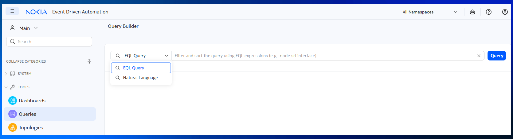

# EDA Query Language

|                       |                                                                                                                    |
| --------------------- | ------------------------------------------------------------------------------------------------------------------ |
| **Short Description** | The EDA Query Language (EQL) enables real-time querying across the entire fleet of the managed nodes and EDB data. |
| **Difficulty**        | Beginner                                                                                                           |
| **Topology Nodes**    | leaf11, leaf12, leaf13, spine11, spine12                                                                           |
| **Tools used**        | EDA UI                                                                                                             |

The EDA Query Language **(EQL)** allows real-time access to any YANG path on any managed elements network-wide, or any resource published in the EDA in-memory Database (EDB). It delivers instant, streaming results ideal for troubleshooting and observability and can feed data to the EDA visualization dashboards or be streamed out to external consumers.

## Objective

The goal of this exercise is to introduce you to the The EDA Query Language **(EQL)** in which we will review the EQL concepts such as `Tables`, `Selectors` or `Filters`, and solve some real-world troubleshooting challenges.  
By completing a series of tasks, you’ll gain a solid understanding of how to use EQL in your operations.

## Technology Explanation

### Queries page

The easiest way to run queries is right from the UI, in the **Tools** section, simply click `Queries`. You can also use the REST API or [`edactl`](https://docs.eda.dev/user-guide/using-the-clis/#edactl) command if you prefer.



The Queries UI consists of a query language selector and the query input fields. The query language selector allows to switch between the Natural Language and the EQL query language.

As you might have guessed the Natural Language allows you to form a query using natural language, like "How many BGP peers I have in my fabric?".  
And if you prefer structured queries, EQL is your friend. It is a query language that supports operands, filters and selectors to create complex but precise queries.

You will use both languages in the tasks we prepared for you.

### What Makes Up a Query?

A query in EQL is composed of several optional components, with only the first one being required:

- `Table` (required): The data source you're querying.  
Example: `.namespace.node.srl.interface`

- `Selector` (`fields` keyword): Specifies which fields to return, optionally applying functions to them.  
Example: `.namespace.node.srl.interface fields [oper-state, admin-state]`

- `Filter` (`where` keyword): Defines conditions for filtering results, using expressions within parentheses.  
Example: `.namespace.node.srl.interface where (admin-state = "disable" and .node.name = "leaf1")`

- `Sort` (`order by` keyword): Determines how the data should be ordered before being returned.  
Example: `.namespace.node.srl.platform.control.process order by [memory-usage descending]`

- `Limit` (`limit` keyword): Restricts the number of returned results.  
Example: `.namespace.node.srl.interface limit 10`

- `Frequency` (`delta` or `sample` keywords): Controls how often updates are returned, establishing a limit in the frequency of updates.  
Example: `.namespace.node.srl.interface delta milliseconds 1000`,
or `sample milliseconds 1000` for updates at regular intervals, regardless of change.

If you fancy a deeper dive into the query components, continue reading; else, jump straight to the [tasks](#tasks).

#### Table

A Table is defined using JSPath notation. Table boundaries occur at each list or container element within a target node schema, or within containers/lists exposed by EDA applications.

In simpler terms, each node in the JSPath hierarchy represents a distinct table. For example:

- `.namespace.node` is a table

- `.namespace.node.srl` is another table

- `.namespace.node.srl.interface` is yet another table

To specify a table, you use a complete JSPath expression without including keys.
Example: `.namespace.node.srl.interface.subinterface` refers to the subinterface table.

#### Selector · `fields`

A Selector is specified using the `fields` keyword. It defines an array of fields to be returned from the table, and may also include functions applied to those fields.

All selected fields must exist in the table being queried, otherwise the query will fail.

Only the fields explicitly listed will be returned. If no fields are specified, all fields from the table are returned by default.

The `fields` keyword must come before any `where` or `order by` clauses.

Example:
`.namespace.node.srl.interface fields [admin-state, description] order by [oper-state ascending natural]`

You can also use functions within the fields array for evaluation and aggregation:

`average()` — Returns the average value of a field over time.

`count()` — Returns the number of unique matches for a given filter.

`sum()` — Calculates the sum of values for a specific field.

These functions are useful for generating insights or summaries within your query results.

Example:
`.namespace.node.srl.interface fields [count(oper-state)] where (oper-state = "up")`

#### Filter · `where`

A Filter defines criteria for narrowing down query results and is specified using the where keyword. The following rules apply:

- A filter is composed of an ordered sequence of **fields**, **operators**, **values**, and  **keywords**.
- **Keywords** like `and` and `or` are case-insensitive—both `AND` and `and` are valid.

Supported **Operators**:

- Comparison: `=`, `!=`, `<=`, `>=`, `>`, `<`
- Logical: `and`, `or`, and parentheses `()` for grouping
- Membership:

    - `in`: checks if a field's value is in a list of values
    - `not in`: checks if a field's value is not in a list

**Field** names are written without quotes, while **values** are quoted if they are strings and left unquoted if they are integers.
Example: `.namespace.node.srl.interface where ((oper-state = "up") and (ifindex = 49150))`

As you can see, from the previous example, Filters can combine multiple conditions using parentheses and logical operators.

/// warning
Even a single condition must be enclosed in parentheses: `.namespace.node.srl.interface where (oper-state = "up") `
///

#### Sort · `order by`

A Sort determines the order in which results are returned, rather than filtering which data is selected. It is specified using the `order by` keyword.

You can include one order by clause per query. Its value is an array of fields, sorting directions, and (optionally) sorting algorithms, evaluated in the order provided.

Example:
`.namespace.node.srl.interface order by [oper-state ascending natural]`

The second element specifies the sort direction: `ascending` or `descending`.

The third element is optional and currently supports only `natural` as a sorting algorithm.

#### Limit · `limit`

The limit keyword restricts the number of results returned by a query. It is applied after all other operations, such as sorting.

`limit` takes a single integer value. When combined with order by, it allows you to retrieve the top N or bottom N results, depending on the sort direction.

The valid range for limit is `1 to 1000`. Values outside this range will result in an error.

Example: `.namespace.node.srl.interface order by [mtu descending] limit 10`

#### Frequency · `delta`/`sample`

The `delta` keyword controls how frequently query results are updated. It takes two arguments: a unit ( **milliseconds**) and a value representing the limit of the response rate.

For example:
`.namespace.node.srl.interface.traffic-rate where (in-bps != 0) delta seconds 1`
This means the client will receive updates no more than once per second.

Use delta to avoid overloading the client with rapid updates and to fine-tune the refresh rate for your use case.

### Navigating the EDA Database

After we covered a lot of theory on the query components, the next step is identifying where the relevant data resides within the EDB. The following table lists some most relevant tables/paths:

<p style="text-align:center;">EDA Queries Cheatsheet</p>

| Path                            | Description                                                                                                                                                                                                                                                                                                                                                                                                                    |
| ------------------------------- | ------------------------------------------------------------------------------------------------------------------------------------------------------------------------------------------------------------------------------------------------------------------------------------------------------------------------------------------------------------------------------------------------------------------------------ |
| **.cluster**                   | Holds information about cluster metrics and config/state engine. For example, we can get k8s pod status with `.cluster.apps.platform.metrics.namespace.pod` or we can get execution metrics of the state engine with `.cluster.state-engine.v1.script`                                                                                                                                                                         |
| **.namespace**                 | The root path for all our namespaced resources.                                                                                                                                                                                                                                                                                                                                        |
| .namespace.apps                | Access config and state information published by the EDA Apps                                                                                                                                                                                                                                                                                                                                                                                 |
| .namespace.alarms              | All the alarms raised by nodes are written in this table. For example, we can get current alarms with `.namespace.alarms.v1.current-alarm` or past ones with `.namespace.alarms.v1.alarm.history`                                                                                                                                                                                                                                        |
| .namespace.allocations         | Access EDA allocations pools information (irb indexes, ip pools, bgp asn numbers…). We can retrieve the information with `.namespace.allocations.v1.template.instance`                                                                                                                                                                                                                                                                      |
| .namespace.node                | Get real time access to node's config and state. For example, to get all state info about the SR Linux interfaces - `.namespace.node.srl.interface.subinterface` or display the statistics of all the interfaces with `.namespace.node.srl.interface.statistics`                                                                                                                                                                            |
| .namespace.resources           | A table that contains the state and specifications of all EDA Custom Resources. For example, we can check the health of our Fabric with `.namespace.resources.cr-status.fabrics_eda_nokia_com.v1alpha1.fabric.status` or see the list of BridgeDomains configured in our Fabric with `.namespace.resources.cr.services_eda_nokia_com.v1alpha1.bridgedomain` |
| .namespace.topologies.topology | Everything related to the Topologies tool in EDA dashboard goes here                                                                                                                                                                                                                                                                                                                                                           |

## Tasks

Done with the theory, let's put things into practice!

Imagine this: it’s 3:00 AM, and you’re in the middle of a migration window, moving VMs from one server cluster to another. These servers are connected to multiple leaf switches via a Layer 2 EVPN service (mac-vrf = `macvrf1`).
Based on your experience, you know that a good way to monitor the migration’s progress is by tracking the total number of MAC addresses learned in the service, and closely watching a few specific MACs to see how they shift between switches.

Typically you would do this by connecting to every switch and do `show` commands or have a script that will fetch the show commands and parse the output. With **EDA Queries**, we can do it centrally, in a fast, performant and always accurate way.

### Task 1: Query MAC addresses in a specific mac-vrf service

In this first exercise you have to perform a query that shows you all MAC addresses in the bridge table of the `macvrf1` deployed in your DC fabric. This service is already present in `leaf11`, `leaf12`, and `leaf13`.

/// details | Hints
    type: subtle-note
The command we would need to execute in our SR Linux switches is: `show network-instance macvrf1 bridge-table mac-table all`.

We need to filter to only show `macvrf1`, so we need to use the `where` keyword.
///

/// details | Solutions
    type: success
The EQL for this is:

```
.namespace.node.srl.network-instance.bridge-table.mac-table.mac where(.namespace.node.srl.network-instance.name = "macvrf1")
```

///

#### Natural Language

Remember that **Natural Language** language selector? It allows you to phrase your queries, well, naturally. So instead of thinking what would the query look like to get all MACs in a certain bridge domain, you could've simply asked:

```
show me all macs in the macvrf1 bridge domain
```

You should get the same result, as what NQL does is translates the natural language to a EQL query and runs it. A perfect way to learn and refine future queries.

### Task 2: Select specific fields to be displayed in MAC table

Now that you’ve retrieved the full list, refine your query to display only the essential details, such as the MAC address and the interfaces where each is learned.

/// details | Hints
    type: subtle-note
You need to use the [`fields`](#selector-fields) keyword. The field we are interested in is the `destination`
///

/// details | Solutions
    type: success
The EQL for this is:

```
.namespace.node.srl.network-instance.bridge-table.mac-table.mac fields [destination] where (.namespace.node.srl.network-instance.name = "macvrf1")
```

///

You can also try and use the NQL for this task.

### Task 3: Count entries in MAC table

Now, you want to see if all the macs are there, and you know that in a stable condition you have 21 MACs in your mac-vrf. Count the macs in your mac-vrf.

/// details | Hints
    type: subtle-note
You need to use the `count()` keyword to count the number of responses for a given EQL.
///

/// details | Solutions
    type: success
The EQL for this is:

```
.namespace.node.srl.network-instance.bridge-table.mac-table.mac fields [count(destination)] where (.namespace.node.srl.network-instance.name = "macvrf1")
```

///

### Task 4: Track specific MACs in your mac-vrf

And now, let's build a query to keep track of specific MAC addresses in our `macvrf1` service. Select any MAC address displayed in your **Task 2** exercise and build a query that only displays that one.

/// details | Hints
    type: subtle-note
We need to use parentheses `()` and `and` to group multiple terms
///

/// details | Solutions
    type: success
The EQL for this is:

```
.namespace.node.srl.network-instance.bridge-table.mac-table.mac fields [destination] where ((.namespace.node.srl.network-instance.name = "macvrf1") and (address = "AA:C1:AB:E0:66:72"))
```

///

### Bonus Task: do it in the cli

We can use the `edactl` command to perform all the different queries that we have tested. You just have to SSH to your own dedicated VM running the lab topology and type:

`edactl query 'your query here'`

You can optionally use the following Flags:

- `-r <value>`: to set the max number of rows visible on the terminal (default 20)
- `-s`: to stream query results

## Summary

This exercise introduces the EDA Query Language (EQL), a powerful tool for real-time querying across managed network elements and the EDA in-memory Database (EDB).

You learned the key components that EQL consists of, such as:

- Tables: Data sources you're querying (e.g., .namespace.node.srl.interface)
- Selectors: Fields to return using the fields keyword
- Filters: Conditions for filtering results using the where keyword
- Sort: Ordering of results using order by
- Limit: Restricting number of results using limit
- Frequency: Controlling update frequency using delta or sample

Practiced running the queries using two different query languages:

- EQL: Structured query language with precise syntax
- Natural Language: Alternative interface for forming queries in plain English

And used `edactl` to run the queries in the CLI.
