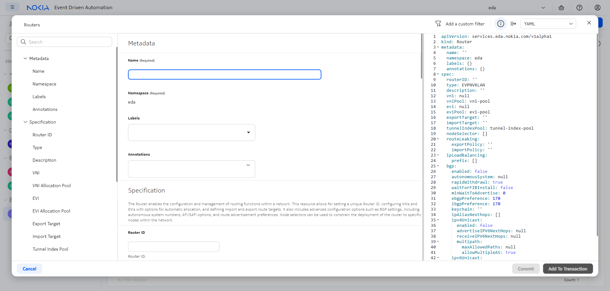
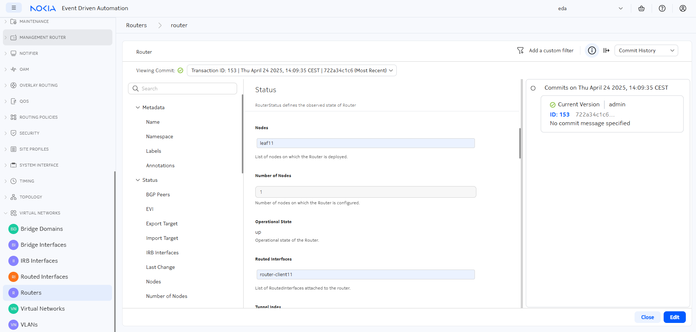

# Routers

<script type="text/javascript" src="https://viewer.diagrams.net/js/viewer-static.min.js" async></script>

-{}-

| <nbsp> {: .hide-th}   |                                                                                                            |
| --------------------- | ---------------------------------------------------------------------------------------------------------- |
| **Short Description** | Creating a router with EDA to achieve layer 3 connectivity                                                 |
| **Difficulty**        | Beginner                                                                                                   |
| **Resources used**        | **Virtual Networks** → **Routers** / **Routed Interfaces**                                                                                                         |
| **Topology Nodes**    | :material-server: client11, :material-server: client13, :material-router: leaf11, :material-router: leaf13 |
| **References**        | /                                                                                                          |

This is the second exercise in a 4-part series about using EDA to achieve connectivity to, from, and within your datacenter. In this exercise, we will achieve layer-3 connectivity between two hosts in different broadcast domains.

- **[Part 1](bridge-domains.md)**: achieve layer-2 connectivity using bridge domains
- **Part 2 (this activity)**: achieve layer-3 connectivity using routers
- **[Part 3](virtual-networks.md)**: combine layer-2 and layer-3 connectivity through a single EDA object: the Virtual Network
- **[Part 4](../advanced/service-automation.md)**: automate parts 1 through 3 of this exercise with Python

## Objective

In this exercise, we enable two linux hosts to talk to each other, but in contrast to the Part 1 exercise the two hosts reside in different subnets and have IP addresses from different subnets. Therefore, traffic must be routed instead of switched over the datacenter fabric using a dedicated and isolated service: the IP-VRF.

We will have to configure the overlay services in such a way that traffic between these client interfaces is successfully routed, without creating any layer-2 subnets in the overlay, pure L3.

-{{ diagram(url='srexperts/hackathon-diagrams/main/eda.drawio', title='Target connectivity model: Layer 3 only', page=5, zoom=2) }}-

## Technology explanation

While EVPN originally emerged as a Layer 2 VPN technology to overcome VPLS limitations, it has since evolved to become a unified control plane for many services, Layer 3 VPN included. Founded upon the BGP protocol, EVPN has lots of flexibility and features to become a one-stop-shop for all VPN services in various network deployments, but especially fit for the IP fabrics.

In the [Part 1](./bridge-domains.md) we learned how to use EDA to provide layer 2 services across an IP fabric. The focus of this part is on deploying a Layer 3 Ethernet VPN (EVPN) overlay service in the EDA-managed DC fabric.

We will instantiate an interface-less flavor of an L3 EVPN service that does not require the use of Integrated Routing and Bridging (IRB) interfaces, and as such has no need MAC VRF instances, ARP/ND entries synchronization, MAC/IP (RT2) and IMET routes.

As you might expect, the Layer 3 EVPN is designed to provide Layer 3 services across the fabric. As such, there are no stretched broadcast domains across the fabric and the customer equipment is directly connected via L3 interfaces to the leafs and often runs a PE-CE routing protocol to exchange IP prefixes.

Layer-3 or routed services enables a datacenter infrastructure team to:

1. reduce the size of Layer-2 broadcast domains and segment the network into smaller subnets interconnected by routers
2. force the traffic path of certain flows over specific paths.  
    For example: you may want to add a firewall between computes, so only traffic to and from the HTTPS port is allowed to go to a web farm. This is not possible with bridge domains, as traffic can be broadcasted for everyone to hear: this is not the case for routed traffic.

We'll look at how this connectivity can be achieved in EDA using declarative abstracted resources such as **Routers** and **Routed Interfaces**.  
A router is another word for Virtual Private Routed Network (or VPRN) in SR OS terms or IP-VRF in SR Linux. And a routed interface is an L3 interface that is part of a router.

The Router resource declaratively defines the virtual router (VRF) on the supported network OSes, whereas the Routed Interface resource defines the L3 interface that is part of virtual router.

## Tasks

/// admonition | See [Access Details](../index.md#access-details) if you need a reminder on how to access the nodes in the topology.
    type: subtle-question
///

The tasks ahead of you require you to enable the layer-3 connectivity between `clients11` and `client13`. You start from a clean slate where clients have IP addresses configured, and they are physically connected to the datacenter fabric, but there is no relevant config present on the leaf switches to enable this connectivity as shown on the diagram below:

-{{ diagram(url='srexperts/hackathon-diagrams/main/eda.drawio', title='Starting state', page=6, zoom=2) }}-

For this exercise, the clients have been configured with the following IP addresses:

| Client | Interface | IP address | VLAN  |
| --- | --- | --- | --- |
| client11 | eth1.311 | 10.30.1.11/24 <br/> fd00:fdfd:0:3001::11/64 | 311 |
| client13 | eth1.313 | 10.30.3.13/24 <br/> fd00:fdfd:0:3003::13/64 | 313 |

### Inspect the IP configuration of both clients

Before we start, we need to verify the IP configuration on both clients. We're interested in two things:

1. the **IP address** of each client's interface so we can test later whether the connectivity is in place.  
2. the **VLAN** this interface is configured with

Using the IP configuration provided in the [Objective](#objective) section, verify the acting configuration on the clients by connecting to the shell.

To connect to the shell of the client nodes, you should connect to the server running your lab and then ssh to each node, for example, for `client11`:

```bash title="execute from the lab server"
ssh user@clab-srexperts-client11
```

<div class="embed-result">
```{.text .no-select .no-copy}
[*]─[client11]─[~]
└──>
```
</div>

When in the client shell, use your linux skills to inspect the IP configuration of the client and match it with the IP plan provided in the [Objective](#objective) section.

/// details | Hint: the relevant IP interfaces on the clients
    type: tip
/// tab | client-11

```bash
[*]─[client11]─[/]
└──> ip a | grep "10.30.1" -A 5 -B 2
6: eth1.311@eth1: <BROADCAST,MULTICAST,UP,LOWER_UP> mtu 9500 qdisc noqueue state UP group default qlen 1000
    link/ether aa:c1:ab:2f:4b:67 brd ff:ff:ff:ff:ff:ff
    inet 10.30.1.11/24 scope global eth1.311
       valid_lft forever preferred_lft forever
    inet6 fd00:fdfd:0:3001::11/64 scope global
       valid_lft forever preferred_lft forever
    inet6 fe80::a8c1:abff:fe2f:4b67/64 scope link
       valid_lft forever preferred_lft forever
```

///
/// tab | client-13

```bash
[*]─[client13]─[/]
└──> ip a | grep "10.30.3" -A 5 -B 2
7: eth1.313@eth1: <BROADCAST,MULTICAST,UP,LOWER_UP> mtu 9500 qdisc noqueue state UP group default qlen 1000
    link/ether aa:c1:ab:b9:1b:9e brd ff:ff:ff:ff:ff:ff
    inet 10.30.3.13/24 scope global eth1.313
       valid_lft forever preferred_lft forever
    inet6 fd00:fdfd:0:3003::13/64 scope global
       valid_lft forever preferred_lft forever
    inet6 fe80::a8c1:abff:feb9:1b9e/64 scope link
       valid_lft forever preferred_lft forever
```

///
///

To test the connectivity, ping client13 interface from client11:

/// tab | IPv4

```bash
[x]─[client11]─[~]
└──> ping -c 1 10.30.3.13
PING 10.30.3.13 (10.30.3.13) 56(84) bytes of data.
From 10.30.1.11 icmp_seq=1 Destination Host Unreachable

--- 10.30.3.13 ping statistics ---
1 packets transmitted, 0 received, +1 errors, 100% packet loss, time 0ms
```

///

/// tab | IPv6

```bash
[x]─[client11]─[~]
└──> ping -c 1 fd00:fdfd:0:3003::13
PING fd00:fdfd:0:3003::13(fd00:fdfd:0:3003::13) 56 data bytes
From fd00:fdfd:0:3001::11 icmp_seq=1 Destination unreachable: Address unreachable

--- fd00:fdfd:0:3003::13 ping statistics ---
1 packets transmitted, 0 received, +1 errors, 100% packet loss, time 0ms
```

///

There is no connectivity, as the overlay services are not configured. There is no virtual router (VRF) in the fabric that would route the traffic between the clients.

### List Routers

We just established that the connectivity between our clients is not working, and assumed that this is due to the network not being configured to support this service.

In EDA, the Routers resources declaratively define the VRFs on the network elements. Let's check if there are any Routers already configured.

Login to the EDA UI using the assigned Group ID and EDA credentials provided to you.

/// admonition | EDA Core and the Apps
    type: subtle-info
The EDA platform consists of the core and the apps that extend it and provide the resources for declarative network management. Although you can make your own apps, Nokia already provides an extensive library of pre-installed apps that can handle a lot of configuration tasks. Programming your own app is beyond the scope of this exercise.
///

Look at the app menu in the left sidebar for -{{icons.circle(letter="R", text="Routers")}}-, which is located in the -{{icons.vnet()}}- category.


When you click on the -{{icons.circle(letter="R", text="Routers")}}- menu element, you get the list of existing Router resources. A few of them may already be there to power up other exercises, but none of them enable Layer-3 connectivity for our clients as your pings indicated.  
Time to create your first Router and see what it gets you.

### Create a Router

Using the "Create" button in the top-right, you can create a new Router. In the center of the screen you can see all configuration options for the new Router, and on the right is a YAML representation that could be used for automation.



By creating a new Router resource we intend our network elements to have a VRF that will serve as a virtual routing instance for the two clients.

The Router resource provides Network OS agnostic fields to define a virtual routing instance. The form and its YAML representation will have some fields set to their default values, and some fields will be set to `null` to indicate that they were not set. The most important Router properties you have to pay attention to are:

- A **name** so you can reference this Router later
- The **type** should be left as "EVPNVXLAN", as the Router is intended to provide overlay services and be used in the EVPN VXLAN fabric that you have at hand.

/// details | A note about namespaces
    type: info
Namespaces in EDA are used to separate resources into any way you see fit: in a real-life network, you may want to split your fabric resources into regions or functions, for example. In the hackathon we have only one namespace -  `eda` - which has been pre-configured in your lab topology.
///

When you are finished, you can press the **Commit** button to commit the transaction[^1] right away which will result in EDA verifying the correctness of the Router configuration and... It will store the Router resource in the EDA database, but no config will be pushed to the nodes. Why, you ask?  
The Router configuration is only pushed to nodes when Routed Interface resources are created that refer a Router; And since we don't have them yet - EDA does not push anything to the nodes. We'll add them in the next step.

When you configured and committed the Router configuration, your logical topology started to look like this:

-{{ diagram(url='srexperts/hackathon-diagrams/main/eda.drawio', title='Created a Router', page=7, zoom=2) }}-

The virtual router is created, but we did not create the interfaces that would connect to it, to satisfy the connectivity requirement.

The solution can be found below in YAML format, if you want to refer to it. You can copy this yaml object into the right column in the GUI to change your current config.

/// details | Solution
    type: success

```yaml
apiVersion: services.eda.nokia.com/v1alpha1
kind: Router
metadata:
  name: router
  namespace: eda
spec:
  eviPool: evi-pool
  tunnelIndexPool: tunnel-index-pool
  type: EVPNVXLAN
  vniPool: vni-pool
```

The key pieces here are the pools used for the VNI, EVI and tunnel index allocation. Want to know more about pools and how EDA presents itself as a source of truth and IPAM? Read about [Allocation Pools](../beginner/allocations.md) first.

///

### Create Routed Interfaces

The RoutedInterface enables the configuration and management of Layer 3 interfaces for routing traffic between different networks. This resource allows for specifying an underlying Interface and Router, configuring VLAN IDs, and setting the IP MTU. Routed Interfaces are similar to Bridge Interfaces, but they define a routed interface, instead of a bridged/switch one.

You will find the -{{icons.circle(letter="RI", text="Routed Interface")}}- resource under the -{{icons.vnet()}}- category. Your goal is two create two routed interface, one for each client. These interfaces should reference the physical network interfaces that are part of your topology as well reference the Router you created in the previous step.

The physical interfaces were already modeled in EDA with the -{{icons.circle(letter="I", text="Interface")}}- resource during the topology onboarding process, their names are:

- `leaf11-client11`
- `leaf13-client13`

When defining the Routed Interfaces, make sure to set the VLAN ID to match the one used by the associated client interface.

Additionally, you want to give the routed interface both an IPv4 and an IPv6 address that your clients will use as the gateway for the subnet.

Before you commit, do a [dry-run](../beginner/declarative-intents.md#dry-run) first, just like in the previous exercise! This will allow you to inspect the configuration pushed to the nodes. After you commit this change to the fabric, you should be able to see the routed interface status reflected in the GUI. You can also navigate to your router, and find out which leaf nodes are now participating in the service.



/// details | Solution
    type: success
//// tab | interface for client11

```yaml
apiVersion: services.eda.nokia.com/v1alpha1
kind: RoutedInterface
metadata:
  name: router-client11
  namespace: eda
spec:
  interface: leaf11-client11
  ipMTU: 1500
  ipv4Addresses:
    - ipPrefix: 10.30.1.1/24
      primary: true
  ipv6Addresses:
    - ipPrefix: fd00:fdfd:0:3001::1/64
  router: router
  vlanID: '311'
  vlanPool: vlan-pool
```

////
//// tab | interface for client13

```yaml
apiVersion: services.eda.nokia.com/v1alpha1
kind: RoutedInterface
metadata:
  name: router-client13
  namespace: eda
spec:
  interface: leaf13-client13
  ipMTU: 1500
  ipv4Addresses:
    - ipPrefix: 10.30.3.1/24
      primary: true
  ipv6Addresses:
    - ipPrefix: fd00:fdfd:0:3003::1/64
  router: router
  vlanID: '313'
  vlanPool: vlan-pool
```

////
///

Once this is done, you should be able to ping the gateway IP that you assigned in the Routed Interface resource from the client's shell. The examples are provided for `client11`.

/// tab | IPv4

```bash
[*]─[client11]─[/]
└──> ping -c 1 10.30.1.1
PING 10.30.1.1 (10.30.1.1) 56(84) bytes of data.
64 bytes from 10.30.1.1: icmp_seq=1 ttl=64 time=3.55 ms

--- 10.30.1.1 ping statistics ---
1 packets transmitted, 1 received, 0% packet loss, time 0ms
rtt min/avg/max/mdev = 3.553/3.553/3.553/0.000 ms
```

///
/// tab | IPv6

```bash
[*]─[client11]─[/]
└──> ping -c 1 fd00:fdfd:0:3001::1
PING fd00:fdfd:0:3001::1(fd00:fdfd:0:3001::1) 56 data bytes
64 bytes from fd00:fdfd:0:3001::1: icmp_seq=1 ttl=64 time=4.00 ms

--- fd00:fdfd:0:3001::1 ping statistics ---
1 packets transmitted, 1 received, 0% packet loss, time 0ms
rtt min/avg/max/mdev = 3.997/3.997/3.997/0.000 ms
```

///

With these changes committed, your logical connectivity diagram completes, as client interfaces are now connected to the virtual router, via the routed interfaces:

-{{ diagram(url='srexperts/hackathon-diagrams/main/eda.drawio', title='Routed Interfaces connected', page=8, zoom=2) }}-

### Enabling inter-client connectivity

So far, we've only pinged the router from each client, but in a real-world scenario we want to ping the other clients instead. On the clients, a static route has been pre-configured so that the subnet `10.30.0.0/16` is routed via each client's gateway, which includes the subnets of the other clients.

Give it a try!

/// tab | client-11

```bash
[*]─[client11]─[/]
└──> ping -c 1 10.30.3.13
PING 10.30.3.13 (10.30.3.13) 56(84) bytes of data.
64 bytes from 10.30.3.13: icmp_seq=1 ttl=253 time=4.93 ms

--- 10.30.3.13 ping statistics ---
1 packets transmitted, 1 received, 0% packet loss, time 0ms
rtt min/avg/max/mdev = 4.933/4.933/4.933/0.000 ms

[*]─[client11]─[/]
└──> ping -c 1 fd00:fdfd:0:3003::13
PING fd00:fdfd:0:3003::13(fd00:fdfd:0:3003::13) 56 data bytes
64 bytes from fd00:fdfd:0:3003::13: icmp_seq=1 ttl=253 time=6.04 ms

--- fd00:fdfd:0:3003::13 ping statistics ---
1 packets transmitted, 1 received, 0% packet loss, time 0ms
rtt min/avg/max/mdev = 6.039/6.039/6.039/0.000 ms
```

///
/// tab | client-13

```bash
[*]─[client13]─[/]
└──> ping -c 1 10.30.1.11
PING 10.30.1.11 (10.30.1.11) 56(84) bytes of data.
64 bytes from 10.30.1.11: icmp_seq=1 ttl=253 time=4.56 ms

--- 10.30.1.11 ping statistics ---
1 packets transmitted, 1 received, 0% packet loss, time 0ms
rtt min/avg/max/mdev = 4.559/4.559/4.559/0.000 ms

[*]─[client13]─[/]
└──> ping -c 1 fd00:fdfd:0:3001::11
PING fd00:fdfd:0:3001::11(fd00:fdfd:0:3001::11) 56 data bytes
64 bytes from fd00:fdfd:0:3001::11: icmp_seq=1 ttl=253 time=5.09 ms

--- fd00:fdfd:0:3001::11 ping statistics ---
1 packets transmitted, 1 received, 0% packet loss, time 0ms
rtt min/avg/max/mdev = 5.087/5.087/5.087/0.000 ms
```

///

## Summary

In this exercise, you successfully established layer-3 connectivity between two clients (`client11` and `client13`) residing in different subnets leveraging EDA's Router and Routed Interface resources. Specifically:

- You created a Router resource that defined a virtual routing instance (VRF) in the datacenter fabric
- You configured Routed Interfaces that connected the physical interfaces to the Router resource
- You established proper IP addressing for both IPv4 and IPv6 on the Routed Interfaces
- You verified connectivity between clients across different subnets through successful ping tests

Now that you mastered Layer-2 and Layer-3 basic buildings blocks represented by Bridge Domains and Routers, it is time to see how they can be combined in a single unit of abstraction that we call a Virtual Network, or VNET for short. On to the [next exercise](virtual-networks.md)!

[^1]: If you want to learn more about transactions, checkout [transactions](../beginner/declarative-intents.md#transactions) section of the Declarative Intents exercise.
