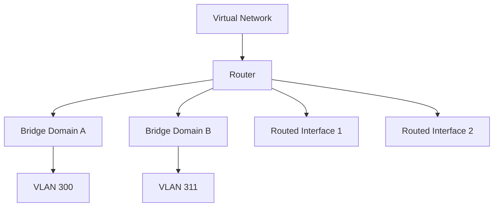
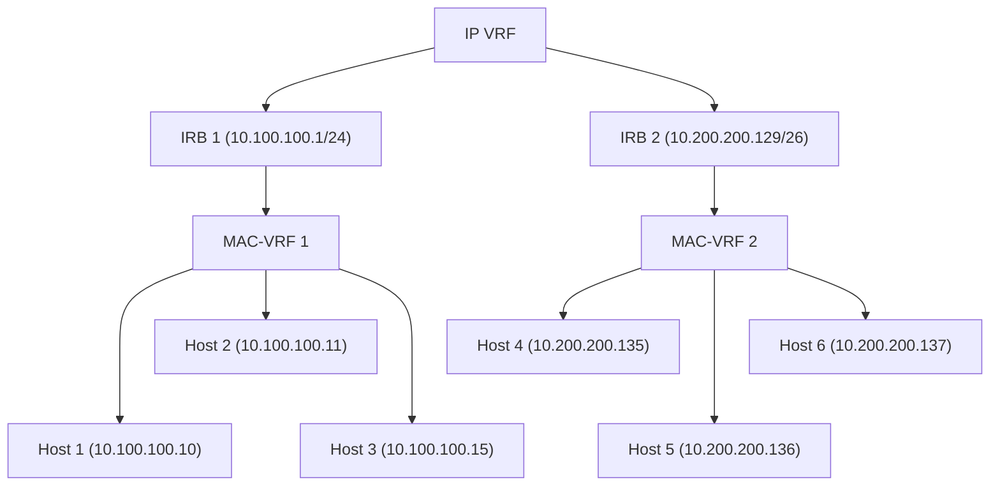
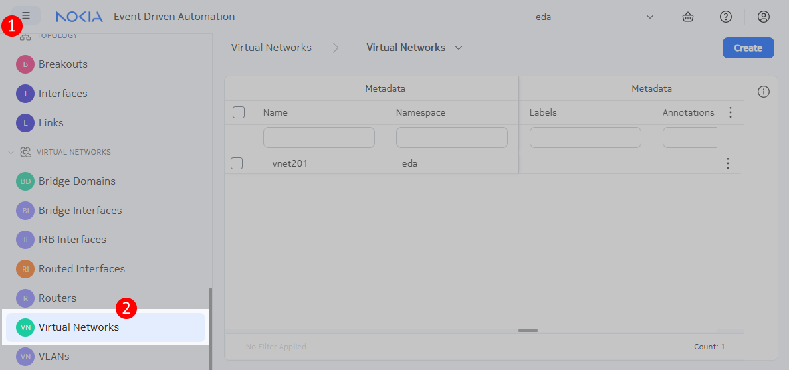

# Virtual Networks

<script type="text/javascript" src="https://viewer.diagrams.net/js/viewer-static.min.js" async></script>
-{}-

|                       |                                                                                              |
| --------------------- | -------------------------------------------------------------------------------------------- |
| **Short Description** | Creating a virtual network with EDA to combine layer-2 and layer-3 connectivity              |
| **Difficulty**        | Beginner                                                                                     |
| **Topology Nodes**    | :material-server: client11, :material-server: client12, :material-server: client13, :material-router: leaf11, :material-router: leaf12, :material-router: leaf13           |

This is the third exercise in a 4-part series around using EDA to achieve connectivity within your datacenter. In this exercise, we will leverage the knowledge gained in the previous two parts and deploy both layer-2 and layer-3 overlay services.  
Thanks to the power of abstracted and derived intents, under the hood the virtual network will create the individual resources we created manually in parts 1 & 2.

- **[Part 1](bridge-domains.md)**: achieve layer-2 connectivity using bridge domains
- **[Part 2](routers.md)**: achieve layer-3 connectivity using routers
- **Part 3 (this activity)**: combine layer-2 and layer-3 connectivity through a single EDA object: the Virtual Network
- **[Part 4](../advanced/service-automation.md)**: automate parts 1 through 3 of this exercise with Python

## Objective

Through the past two exercises, you have learned how to deploy pure layer-2 and pure layer-3 overlay services using EDA abstracted intents. In particular, for layer-2 services you have used the [Bridge Domain/Bridge Interface/VLAN](bridge-domains.md) resources, and for layer-3 services you used the [Router/Routed Interface](routers.md).

However, both these designs have their own challenges and limitations. A layer-2 overlay service does not allow inter-subnet routing and has all the challenges of a big broadcast domain.  
A pure layer-3[^1] design with clients using the layer-3 interfaces not only does not support applications that require L2 connectivity, but would also require each leaf to have a distinct and dedicated routed interface with a unique gateway IP, which makes host migration difficult.

This is why many datacenters are built using the hybrid approach of combining small layer-2 overlay services with the inter-subnet overlay routing. This design allows clients to use a simple LAG interface towards the leaf switches, while achieving multihoming, workload migration and layer-2 connectivity, when required.

In this exercise your focus will be on building a composite overlay service that will enable three linux hosts to talk to each other, both within their own subnet (switched traffic) and between the subnets (routed traffic).

## Technology explanation

We have covered the scenario where hosts can talk to each other in a layer-2 domain (via a [Bridge Domain](bridge-domains.md)), and the scenario where hosts in different subnets can be interconnected (via a [Router](routers.md)). We did not cover perhaps the most frequent scenario: a combination of the layer-2 inter-subnet bridging and layer-3 routing to interconnected different subnets.

Because of the popularity of this design, EDA provides a dedicated abstraction for it: the -{{icons.circle(letter="VN", text="Virtual Networks")}}- resource that you can find in -{{icons.vnet()}}- category.

A Virtual Network combines multiple bridge domains, routers, routed interfaces and protocols in a single resource. A typical Virtual Network might for example contain:

- A bridge domain for storage computes
- A bridge domain for GPU clusters
- A bridge domain for in-band management access to all computes
- Redundant routed interfaces, each towards a datacenter gateway (DCGW)
- BGP sessions with the DCGWs, so the internal routes can be advertised to the Wide-Area Network (WAN) and external routes can be imported to provide internet connectivity

In this exercise, we'll create a mix of bridge domains and routed interfaces that can all communicate with each other, regardless of whether their IP addresses are in the same subnet or not. The whole network connectivity design will be driven off of a single abstracted intent - **Virtual Network** - that will emit multiple sub-resources that we previously covered in parts [1](bridge-domains.md) and [2](routers.md).

The diagram below depicts how a single high-level Virtual Network resource emits multiple sub-resources and through this orchestrates a creation of a composite service topology.



### IRB interfaces

So far, we've seen two types of interfaces:

- A bridged interface, which connects a (physical port, VLAN) combination to a MAC-VRF
- A routed interface, which connects a (physical port, VLAN) combination to an IP-VRF

With a bridged interface, we can interconnect many hosts with an IP in the same subnet, whereas with a routed interface we can allow a single host to communicate with IPs outside of their subnet. We're missing one piece of the puzzle: what if we want many hosts with IPs in the same subnet, to all be able to communicate with IP addresses in the other subnets?

That's where the Integrated Routing and Bridging (IRB) comes in: an IRB is a logical interface that connects a MAC-VRF to an IP-VRF. The IRB needs to have an IP address assigned to it that the bridged interfaces will use to reach addresses outside of their subnet. Usually, the first host in the subnet is assigned to the IRB and is called the "anycast gateway", or simply "gateway".



The IRB interfaces depicted above "connect" a MAC-VRF to an IP-VRF and make the inter-subnet routing possible.

## Tasks

/// admonition | See [Access Details](../index.md#access-details) if you need a reminder on how to access the nodes in the topology.
    type: subtle-question
///

For this exercise the relevant IP configuration on the clients is presented below:

| Client | Interface | IP address | VLAN  |
| --- | --- | --- | --- |
| client11 | eth1.300 | 10.30.0.11/24 <br/> fd00:fdfd:0:3000::11/64 | 300 |
|  | eth1.311 | 10.30.1.11/24 <br/> fd00:fdfd:0:3001::11/64 | 311 |
| client12 | eth1.300 | 10.30.0.12/24 <br/> fd00:fdfd:0:3000::12/64 | 300 |
|  | eth1.312 | 10.30.2.12/24 <br/> fd00:fdfd:0:3002::12/64 | 312 |
| client13 | eth1.300 | 10.30.0.13/24 <br/> fd00:fdfd:0:3000::13/64 | 300 |
|  | eth1.313 | 10.30.3.13/24 <br/> fd00:fdfd:0:3003::13/64 | 313 |

And your task is to create a service that has the following connectivity matrix:

-{{ diagram(url='srexperts/hackathon-diagrams/main/eda.drawio', title='Target connectivity', page=9, zoom=1.5) }}-

/// warning | IMPORTANT
Remove any Bridge Domains, Bridge Interfaces or VLANs created in the [Bridge Domains/Part 1](bridge-domains.md) and the [Routers/Part 2](routers.md) as our Virtual Network will create them or [simply reset EDA using the git time machine](../index.md#reset-eda).
///

You should expect that clients can't reach each other in any direction, due to no overlay services being configured.

### List Virtual Networks

Login to the EDA UI using the assigned Group ID and EDA credentials provided to you.

/// admonition | EDA Core and the Apps
    type: subtle-info
The EDA platform consists of the core and the apps that extend it and provide the resources for declarative network management. Although you can make your own apps, Nokia already provides an extensive library of pre-installed apps that can handle a lot of configuration tasks. Programming your own app is beyond the scope of this exercise.
///

Look at the app menu in the left sidebar for -{{icons.circle(letter="VN", text="Virtual Networks")}}-, which is located in the -{{icons.vnet()}}- category.



When you click on the -{{icons.circle(letter="VN", text="Virtual Networks")}}- menu element, you get the list of existing Virtual Network resources. There will be one VNET already that powers up the hackathon infrastructure, but it does not interfere with the goal of this exercise.  
Time to create your first Virtual Network and make your clients talk to each other.

### Create a Virtual Network

Use the knowledge of the previous two exercises ([Bridge Domains](bridge-domains.md) and [Routers](routers.md)) to achieve the connectivity as shown on the diagram above. A single virtual network resource would be able to define the following:

- a **Router** to create the IP-VRF of the EVPNVXLAN type
- two **Routed Interfaces** to connect the Router to the `client11` and `client12` over the respective VLANs 311 and 313
- two **Bridge Domains** to create subnets for VLAN 300 and 312 respectively
- two **VLAN** resources to create Bridge Interfaces for the respective VLANs 300 and 312
- two **IRB Interfaces** to connect the Bridge Domains to the Router

Yes, a single Virtual Network resource can define all of these objects, and it will emit the necessary sub resources, and each sub resource can emit its own sub resources, and so on, until the configuration is complete.

/// note
Hosts `client11` and `client13` are both single-homed clients, meaning that they physically connect to only one leaf switch.

Host `client12` is different: it is multihomed to 3 leaf switches in an all-active configuration, and its EDA interface is called `lag1`. Can you find this special interface in EDA? Which physical ports are connected to `client12`?
///

/// warning | Auto-completion for non-committed objects
When creating an IRB for example, you must specify references to both a Router and a Bridge Domain. The autocomplete suggestions of these fields only show created objects. Therefore, you will not see suggestions for Routers and Bridge Domains that have not been committed yet. Specify the name without the auto-completion, as you provide it in the same resource.
///

/// details | Solution
    type: success

It might be tricky to solve this challenge if you see EDA for the first time, so here is a solution:

```yaml
apiVersion: services.eda.nokia.com/v1alpha1
kind: VirtualNetwork
metadata:
  name: virtual-network
  namespace: eda
  labels:
    role: exercise
spec:
  routers:
    - name: vnet-router
      spec:
        eviPool: evi-pool
        tunnelIndexPool: tunnel-index-pool
        type: EVPNVXLAN
        vniPool: vni-pool

  routedInterfaces:
    - name: vnet-routed-interface-client11
      spec:
        interface: leaf11-client11
        ipv4Addresses:
          - ipPrefix: 10.30.1.1/24
            primary: true
        ipv6Addresses:
          - ipPrefix: fd00:fdfd:0:3001::1/64
            primary: true
        router: vnet-router
        vlanID: '311'
    - name: vnet-routed-interface-client13
      spec:
        interface: leaf13-client13
        ipv4Addresses:
          - ipPrefix: 10.30.3.1/24
            primary: true
        ipv6Addresses:
          - ipPrefix: fd00:fdfd:0:3003::1/64
            primary: true
        router: vnet-router
        vlanID: '313'

  bridgeDomains:
    - name: vnet-bridge-domain-300
      spec:
        eviPool: evi-pool
        tunnelIndexPool: tunnel-index-pool
        type: EVPNVXLAN
        vniPool: vni-pool
    - name: vnet-bridge-domain-312
      spec:
        eviPool: evi-pool
        tunnelIndexPool: tunnel-index-pool
        type: EVPNVXLAN
        vniPool: vni-pool

  vlans:
    - name: vnet-vlan-300
      spec:
        bridgeDomain: vnet-bridge-domain-300
        interfaceSelector:
          - edge-type=compute
        uplink:
          uplinkVLANID: pool
        vlanID: '300'
    - name: vnet-vlan-312
      spec:
        bridgeDomain: vnet-bridge-domain-312
        interfaceSelector:
          - edge-type=compute
        uplink:
          uplinkVLANID: pool
        vlanID: '312'

  irbInterfaces:
    - name: vnet-irb-300
      spec:
        bridgeDomain: vnet-bridge-domain-300
        ipAddresses:
          - ipv4Address:
              ipPrefix: 10.30.0.1/24
              primary: true
            ipv6Address:
              ipPrefix: fd00:fdfd:0:3000::1/64
              primary: true
        hostRoutePopulate:
          dynamic: true
          static: true
        router: vnet-router
    - name: vnet-irb-312
      spec:
        bridgeDomain: vnet-bridge-domain-312
        ipAddresses:
          - ipv4Address:
              ipPrefix: 10.30.2.1/24
              primary: true
            ipv6Address:
              ipPrefix: fd00:fdfd:0:3002::1/64
              primary: true
        hostRoutePopulate:
          dynamic: true
          static: true
        router: vnet-router
```

///

We recommend you do a Dry Run first, and see the node configuration diff to see how much stuff gets created on the node when you commit it. Overlay services is not a small feat, and configuring this manually would be a lot of work. With EDA, you get a lot for free, with reliable and fast transaction model to ensure consistency and reliability.

When the Virtual Network resource is successfully created, test the connectivity between the clients. Try to understand what the ping command is doing, and which components you created in EDA are responsible for routing/switching the traffic to the correct destination. The activity has been successfully completed if all these ping commands succeed.

/// details | Ping & traceroute command syntax
    type: info
You can use the `-I` flat to force a ping request to exit through a particular interface. This is used in the commands below to force the traffic to either be switched or routed.

Similarly, you can use the `-i` flag with traceroute to see the difference between switched and routed traffic:

```
[*]─[client11]─[/]
└──> traceroute -i eth1.300 10.30.0.12
traceroute to 10.30.0.12 (10.30.0.12), 30 hops max, 46 byte packets
 1  10.30.0.12 (10.30.0.12)  0.826 ms  0.733 ms  0.510 ms

[*]─[client11]─[/]
└──> traceroute -i eth1.311 10.30.0.12
traceroute to 10.30.0.12 (10.30.0.12), 30 hops max, 46 byte packets
 1  10.30.1.1 (10.30.1.1)  1.156 ms  1.262 ms  0.769 ms
 2  10.30.0.12 (10.30.0.12)  0.978 ms  0.777 ms  0.777 ms
```

///
<!-- --8<-- [start:ping-tests] -->
/// tab | Client11

- `ping -I eth1.300 10.30.0.12`
- `ping -I eth1.311 10.30.2.12`
- `ping -I eth1.311 10.30.3.13`
///

/// tab | Client12

- `ping -I bond0.300 10.30.0.13`
- `ping -I bond0.312 10.30.1.11`
- `ping -I bond0.312 10.30.3.13`
///

/// tab | Client13

- `ping -I eth1.300 10.30.0.11`
- `ping -I eth1.313 10.30.1.11`
- `ping -I eth1.313 10.30.2.12`
///
<!-- --8<-- [end:ping-tests] -->

## Summary

In this exercise, you successfully created a Virtual Network that combines both layer-2 and layer-3 connectivity in a single abstracted intent. Specifically:

- You created a Virtual Network resource that defined multiple components in one declaration:
    - A Router to create an IP-VRF for layer-3 routing
    - Routed Interfaces to connect clients directly to the Router over specific VLANs
    - Bridge Domains to create layer-2 connectivity for specific VLANs
    - VLAN resources to create Bridge Interfaces for the respective VLANs
    - IRB Interfaces to connect the Bridge Domains to the Router, enabling inter-subnet routing

This exercise demonstrated the power of abstraction in EDA, where a single high-level Virtual Network resource can emit multiple sub-resources to orchestrate a complete connectivity solution. By combining layer-2 and layer-3 services, you've created a more flexible network design that supports both applications requiring direct layer-2 connectivity and the scalability benefits of layer-3 routing between subnets.

Now that you've mastered the basics of creating overlay services with EDA using both manual configuration and the Virtual Network abstraction, you're ready to move on to [Part 4](../advanced/service-automation.md) where you'll switch from UI to the code editor and will automate the service provisioning with EDA REST API!

[^1]: You can check an in-depth lab where we covered this type of design at [Learn SR Linux blog](https://learn.srlinux.dev/tutorials/l3evpn/rt5-only/).
