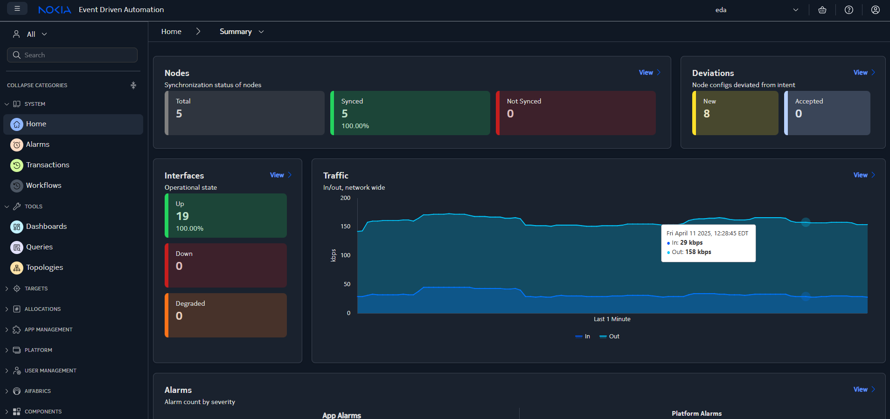
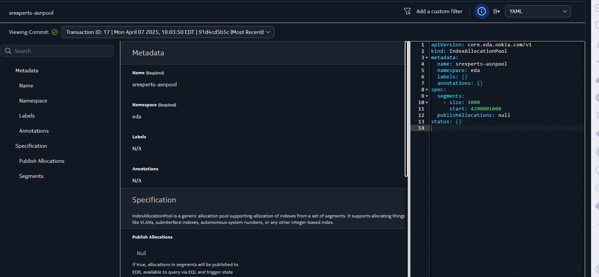
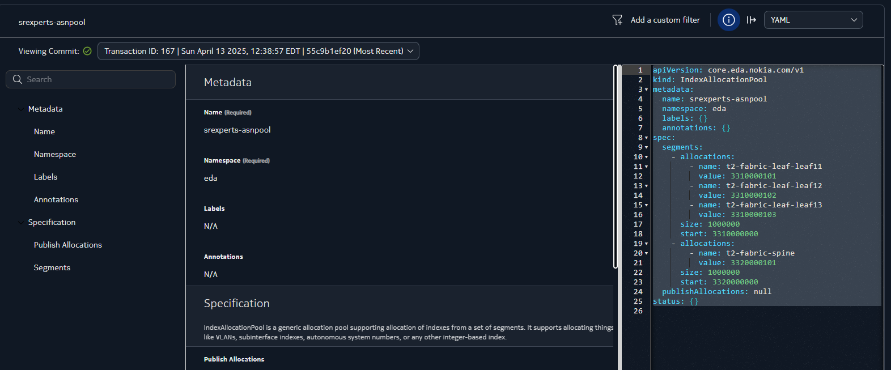

# Custom Allocations

<script type="text/javascript" src="https://viewer.diagrams.net/js/viewer-static.min.js" async></script>

|                       |                                                                                                                                                                                                              |
| --------------------- | ------------------------------------------------------------------------------------------------------------------------------------------------------------------------------------------------------------ |
| **Short Description** | Learn to define custom naming patterns for assigning ASNs and IPs in Nokia EDA. This exercise demonstrates how to override default values using an allocation method that meets customer-specific standards. |
| **Difficulty**        | Intermediate                                                                                                                                                                                                     |
| **Tools Used**        | EDA web UI, kubectl CLI                                                                                                                                |
| **Topology Nodes**    | leaf11, leaf12, leaf13, spine11, spine12                                                                                                                                                                     |
| **References**        | [Allocation Pools documentation][allocation-docs]                                                                                                               |

[allocation-docs]: https://docs.eda.dev/user-guide/allocation-pools/

Allocation of identifiers such as IP addresses, VLAN IDs, subinterface indexes and so on is a critical aspect of network design and management. Given that EDA acts as an authority for configuration of the managed targets, it automates and controls how resource identifiers are assigned via the concept of Allocation Pools.

/// note
This exercise dives deeper into the allocation methods and specifically in how to make custom allocations to ensure predictable allocations.

If you are new to the concept of allocations in EDA, we recommend you to complete the introductory [Allocations](../beginner/allocations.md) activity first.
///

By default, EDA assigns the next free resource identifiers from the associated Allocation Pool. Often this is sufficient, as many identifiers have local meaning and do not bear any meaning. Other times, however, it is necessary to assign identifiers in a deterministic manner, such as when the identifier needs to encode a specific role or function.

To support this use case, EDA Allocation Pools have notion of Custom Allocations (aka preallocations), that can be used to reserve a specific identifier for a specific target node. The usage of custom allocations is what this exercise focuses on.

## Objective

In this hands-on lab, you'll customize resource allocations in Nokia's EDA platform, overriding the default ASN, system IP, ISL assignments. This method ensures deterministic, user-provided resource assignments for easier device identification and troubleshooting. You can use both the Kubernetes CLI (via `kubectl`) and the EDA web UI to:

1. Customize ASNs for BGP peers
2. Assign system IPs from a user-defined subnet range
3. Configure inter-switch links (ISL) subnets for underlay point-to-point links

The goal is to replace generic, automatically-assigned values with a custom, consistent naming convention across the SReXperts lab topology.

## Technology Explanation

> For a generic explanation of Allocations, please refer to the [Allocations](../beginner/allocations.md#technology-explanation) activity.

--8<-- "docs/eda/beginner/allocations.md:custom-allocations"

### Allocation Key

At the center of the custom allocations lies the Allocation Key concept. The Allocation Key is a string that uniquely identifies a target that requires an allocation. Typically it is a node (or group of nodes) that requests a resource identifier (e.g., ASNs, system IPs).  
An EDA Application, like a Fabric app, Interface app, or BGP Peer app, provides the allocation key as a parameter when requesting an allocation. If an allocation pool contains a matching key in its definition, then the preallocated value will be returned to the calling applications.

It is up to a particular application to define the allocation key that it will use to request an allocation. As such, there is no standard allocation key format, and in the future we will document the allocation key formats for each application.

If we take the Fabric app as an example, it uses the following allocation keys when requesting AS Numbers from the pool:

* `{fabric_name}-leaf-{node_name}` - to assign AS Numbers to leaf nodes
* `{fabric_name}-spine` - to assign AS Numbers to spines. The node name is not present in the key, since all spines in the fabric share the same ASN as per the app design.

When an allocation resource has its `.spec.publishAllocations` field set to `true`, the allocation values are published EDA's in memory Database (EDB), so that it is easy to check the current allocation values and what keys were used by the application.

By using the `.namespace.allocations.v1.template.instance.allocation` EQL query you will see all allocations in the system. One of the tasks will teach you how to do it.

## Tasks

Your task is to align the allocation values used in the fabric to match a specific ASN address scheme convention employed by the organization.

We'll go step-by-step through the process of reviewing the current ASN assignments and then applying the new custom ASN scheme to the fabric. We'll use both the CLI and the EDA UI to accomplish this, and verify the changes with a EQL query.

### Concepts & Naming Conventions

In this exercise you are tasked with using a specific ASN format in your fabric - **33Xxxxyyyy** - where each part of the number encodes specific information:

* **33**: Fixed lab prefix ensuring a private, non-conflicting range.
* **X**: Network tier indicator:
    * **1**: Leaf
    * **2**: Spine
    * **3**: Superspine (if applicable)  
  *This digit immediately shows the device role.*
* **xxx**: Three-digit site/fabric identifier (e.g., `000` for a single site).
* **yyyy**: Four-digit device identifier (formatted as **RRNN**: two digits for rack and two for node).

For instance, **ASN 3310000101** decodes as:

* **33**: Lab prefix  
* **1**: Leaf node  
* **000**: Site ID  
* **0101**: Rack 01, Node 01

Mapping this design to the SReXperts fabric you are working on, the ASN format translates to:

| **Device**               | **Role**                | **Custom ASN** | **Breakdown**                                             |
| ------------------------ | ----------------------- | -------------- | --------------------------------------------------------- |
| leaf11                   | Leaf (Rack 01, Node 01) | 3310000101     | 33 (prefix) 1 (leaf) 000 (site) 0101 (rack01-node01)      |
| leaf12                   | Leaf (Rack 01, Node 02) | 3310000102     | 33 (prefix) 1 (leaf) 000 (site) 0102 (rack01-node02)      |
| leaf13                   | Leaf (Rack 01, Node 03) | 3310000103     | 33 (prefix) 1 (leaf) 000 (site) 0103 (rack01-node03)      |
| spine1                   | Spine (ID 01)           | 3320000101     | 33 (prefix) 2 (spine) 000 (site) 0101 (spine01)           |
| spine2                   | Spine (ID 02)           | 3320000101     | 33 (prefix) 2 (spine) 000 (site) 0101 (spine02)           |

### Step 1: Review Current ASN Assignments

First, let's verify what ASNs are currently assigned to the fabric devices before making any changes. We'll use the `kubectl` CLI to query the EDA system's current ASN allocation records.

* **List ASN Pools**  
  Run the following command to list the ASN allocation pool resource and see the current allocations:

    ```shell
    kubectl -n eda get indexallocationpools
    ```
  
* **Identify the ASN Pool**  
  Identify the name of the ASN pool being used. For example, if the pool is named `srexperts-asnpool`, inspect it with:

    ```shell
    kubectl -n eda get indexallocationpool srexperts-asnpool -o yaml
    ```
  
* **Review the Output**  
  The command outputs the YAML definition of the ASN allocation pool, including any pre-defined allocations. For example:
  
    ```yaml
    apiVersion: core.eda.nokia.com/v1
    kind: IndexAllocationPool
    metadata:
      creationTimestamp: "2025-04-07T14:03:46Z"
      generation: 5
      name: srexperts-asnpool
      namespace: eda
      resourceVersion: "1145904"
      uid: 2b1ec70a-3d9d-404b-8493-f87640d43638
    spec:
      segments:
      - size: 1000
        start: 4200001000
    ```
  
Keep this information handy, as it will be useful for comparing the before-and-after states. If you prefer a summary, list out each device and its current ASN based on the CLI output for your reference.

### Step 2: Confirm ASN Pool in EDA UI

Next, let's confirm which ASN pool is being used by our Fabric via the EDA UI. The EDA web interface provides a visual way to see the configured intents and their state.

**1. Open the EDA UI**  

Log in to the EDA web interface using the connectivity and credential details provided.



**2. Identify the ASN Pool used by the Leaf nodes**  

Let's find what allocation pool is being used for the leaf switches, by checking the configuration of the Fabric resource as it stands:

* Using the left sidebar, find the **Fabrics** group and click on **Fabrics** resource.  
* In the list of configured fabric resources double click on the fabric resource you have.  
* In the opened configuration view of the fabric resource, use the navigation panel on the left side to find the **Leafs** section.  
* Select the **Autonomous System Pool** in the left nav bar. You should see the right pane to scroll to the position where the ASN allocation pool name is set for the leaf nodes.  
  > *For example, it might indicate “Autonomous System Pool: srexperts-asnpool” or display another pool name.*


**3. Verify assigned AS Number**  
After you identified the pool name used for the leafs, check what AS Numbers have been assigned to the actual leaf nodes.

Using the nav bar of the Fabric resource, follow the **Status** -> **Leaf Nodes** path to see leaf nodes and their AS Numbers that are currently assigned.


**4. Check Pool configuration**  

Using the pool name identified in step 2, find this pool in the Allocation Pools and check its configuration.



**5. For Spine Nodes**  

* Check if there is a similar setting under **Spines** in the fabric settings.  
* If a separate pool is in use for spines, take note; if not, spines might also be using **srexperts-asnpool**.

**6. Review Assigned ASNs**  
Verify the current ASN assignments for the fabric to ensure everything is in order.  

-{{ diagram(url='srexperts/hackathon-diagrams/main/eda.drawio', title='EDA Managed nodes', page=4, zoom=1.5) }}-

### Step 3: Cross-Check ASN Allocations with EQL

Nokia EDA uses a single persistent database and it is Git. All configuration that must persist — including all allocations — is stored in a Git repository. But allocations can also be populated to the EDA's in-memory database - EDB - as driven by the `.spec.populateAllocations` boolean value that you may have seen in the allocation pool resource definition.

All pools that we have defined for this hackathon set this value to `true`, which means that allocations will be published to the EDB, and everything that is in the EDB can be queried using the EQL query language.

Use the below EQL to see existing allocations made from the `srexperts-asnpool` pool:

```
.namespace.allocations.v1.template.instance.allocation where ( .namespace.allocations.v1.template.name = "srexperts-asnpool" )
```

You should find the familiar `4200001001`, `4200001002`, `4200001003` ASN numbers allocated to the fabric leafs and `4200001000` allocated to spines.

After completing these steps, you have cross-validated the current state of ASN allocations via both the EDA UI and EQL. This ensures that you are ready to perform the customization by editing the ASN pool.

### Step 4: Update ASN Pool Definitions

Once we established the ASN allocation scheme being in place in our topology, we are ready dive into the configuration part of this exercise.

This is the critical step where we'll apply our custom ASN scheme by updating the ASN pool definitions in the EDA UI. We'll replace the old ASN values with our new ones (following the **33Xxxxyyyy** format).

**1. Edit the Index Pool resource**  

* Return to the EDA UI and find the Index resource associated with the `srexperts-asnpool`.  
* Click the **Edit** button to enter the editing mode for this pool resource.

**2. Modify Leaf ASN Entries**  

When in the Edit mode you will have a chance to add the explicit allocations using either the form, or by directly editing the YAML. What you're looking for is:

1. Adding the new `start` value to fit the new addressing scheme
2. Create allocations under the segment block that will list all keys and their explicit ASN values.

Remember, that the allocation key you would use needs to match the key format used by the Fabric app, as this is the app that asks for the allocations from the ASN pool in our topology. For example, keeping our numbering scheme in mind and having the fabric resource named as `srexperts-fabric`, the allocation key/value pair for `leaf11` should be:

```yaml
- name: srexperts-fabric-leaf-leaf11
  value: 3310000101
```

Repeat the process of adding the allocations for other leaf nodes.

**3. Modify Spine ASN Entries**  

Similarly, update the spine entries. The caveat here is that since the spines share the same ASN, their key does not feature the node name, and should be in the format of `{fabric_name}-spine`.

And you would need to define another segment for the spine ASN allocations, since the size of the allocation is limited by 2^24 and we distinct spines vs leafs using the 3rd digit in the 4-byte ASN.

/// details | Solution
    type: example
Here is how your the YAML representation of our intended edits to the `srexperts-asnpool` resource should look like:

```yaml
apiVersion: core.eda.nokia.com/v1
kind: IndexAllocationPool
metadata:
  name: srexperts-asnpool
  namespace: eda
spec:
  segments:
    - start: 3310000000
      size: 1000000
      allocations:
        - name: srexperts-fabric-leaf-leaf11
          value: 3310000101
        - name: srexperts-fabric-leaf-leaf12
          value: 3310000102
        - name: srexperts-fabric-leaf-leaf13
          value: 3310000103

    - start: 3320000000
      size: 1000000
      allocations:
        - name: srexperts-fabric-spine
          value: 3320000101
```

You can paste it in the YAML editor to apply.
///

**4. Dry Run**  

When iterating over your changes to the Index pool, make your life easier by [Dry Running](../beginner/declarative-intents.md#dry-run) the changes. The Dry Run will flag if you made any errors. If there were no errors, you can check the diffs during the dry run process to verify that the computed ASN values match your intent and they yield the necessary config changes on the expected nodes.

**5. Commit Changes**  

* After updating all the ASN entries, and ensuring that Dry Run passes over them, you can commit the changes to persist them in the EDA database and provisioned on the nodes.
* Click the **Commit** to commit your changes right away or **Add to Transaction** button if you want to have a dry run once again.
* The EDA platform will commit the changes to the underlying Git repository.
* If prompted, enter a commit message (e.g., “Update ASN allocations to custom scheme”).
* Confirm that the commit completes successfully without any errors.

   

### Step 5: Verify Changes

After committing the changes, it's time to confirm that they have been recorded correctly.

**1. In EDA UI (YAML view)**  

* Reopen the ASN pool YAML (as in Step 2) if the editor closed upon save.  
* Verify that the allocations lines now contain the new **33X...** ASN values.  
* This confirms that the updated configuration is stored in the system.

**2. In EDA UI (Fabric view)**  

* Check the Fabric's summary or device list to see if the ASN information has been updated.  
* Look for views that list leaf and spine nodes and confirm that their ASN attribute reflects the new values.  

**3. With EQL**  

* Run the EQL query you used in [step 3](#step-3-cross-check-asn-allocations-with-eql) to see the new allocations made from the `srexperts-asnpool` pool.

### Step 6: Network-level Verification

Now it's time to verify that the network is indeed using the new ASNs. We'll check this in several ways:

**Device CLI Verification**  

Log in to the actual Nokia SR Linux devices to confirm each node's local ASN and its BGP neighbor ASNs.

For example, connect to **leaf11** and check its BGP configuration:

```shell title="Execute on the server hosting the lab topology"
ssh clab-srexperts-leaf11
```

Then, in the SR Linux CLI run:

```srl
A:leaf11# info network-instance default protocols bgp autonomous-system
network-instance default {
    protocols {
        bgp {
            autonomous-system 3310000101
        }
    }
}
```

This output confirms that **leaf11** has a local ASN of **3310000101** (our custom ASN).

Next, check the BGP neighbors:

```
A:leaf11# show network-instance default protocols bgp summary
```

You should see spine neighbors with remote AS values of **3320000101**, **3320000102**, etc. (depending on your assignments). If the **State** is **Established**, then the BGP sessions are up with the new ASNs.

### Extra task: System IP Change

Change the system IP addresses for Spine 11 to `10.46.16.31` and Spine 12 to `10.46.16.32` to clearly distinguish spine switches (10.46.16.x) from leaf switches (10.46.15.x).

Feel free to experiment further:

* Try a different numbering scheme.
* See how EDA behaves when two pools overlap.
* Pre-allocate specific values to particular nodes using the allocations field.

For deeper insights, consult the [EDA documentation](https://docs.eda.dev/user-guide/allocation-pools/).

Congratulations! You have successfully implemented custom resource allocations in Nokia EDA and learned how to enforce naming conventions via automated network deployments. This wraps up the lab. Proceed to the next activity or apply these principles to your own network designs. Happy automating!

## Summary

Custom allocations are useful to ensure the deterministic resource allocation when a certain naming or addressing scheme is enforced by the design. EDA allows applications to reserve values for the given keys and thus ensures the flexible model to ensure predictable allocations.

They "key" to the pre-allocated values is driven by the requesting application, and is nothing more than a string value. Therefore, knowing the key that each application uses to request allocation is important for the service designer.  
You learned how to easily find the key each app uses through the EQL query.
