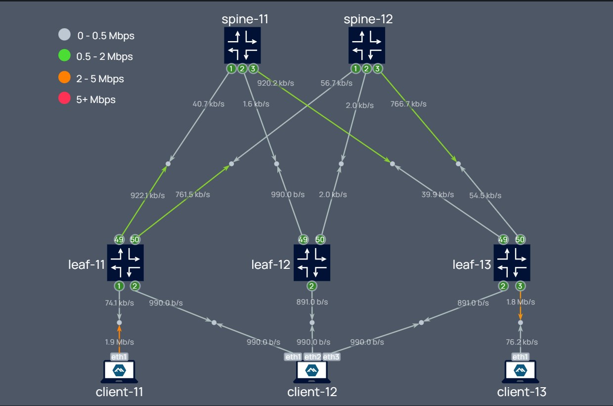

---
tags:
  - SR Linux
  - Scapy
  - Python
  - Linux
---

# Verify alternate path forwarding without disrupting the network


|                             |                                                                                                                                                                                                                        |
| --------------------------- | --------------------------------------------------------------------------------------------------------------------------------------------------------------------------------------------------------------------------------------------------------------------------------------------------------------------------------------------------------------------------------------------------------------------------------------------------------------------------------- |
| **Activity name**           | Verify alternate path forwarding without disrupting the network  |
| **Activity ID**           | 18                                                                |
| **Short Description**       | Using the open-source program Scapy, we can inject a custom frame out of a SR Linux interface so that we can then validate if the next-hop(s) are forwarding it as expected along the path. |
| **Difficulty**              | Advanced |
| **Tools used**              | [Python](https://www.python.org/){:target="_blank"}, [Scapy](https://scapy.net/){:target="_blank"}, [SR Linux traffic-monitor](https://documentation.nokia.com/srlinux/25-3/books/troubleshooting-toolkit/interactive-traffic-monitor-tool-troubleshooting-toolkit.html#interactive-traffic-monitor-tool-troubleshooting-toolkit){:target="_blank"} |
| **Topology Nodes**          | :material-router: spine11, :material-router: spine12, :material-router: leaf11, :material-router: leaf13 |
| **References**              | [SR Linux Troubleshooting Toolkit](https://documentation.nokia.com/srlinux/25-3/title/troubleshoot.html){:target="_blank"}<br>[Scapy documentation](https://scapy.readthedocs.io/en/latest/){:target="_blank"}<br>[SR Linux configuration management](https://documentation.nokia.com/srlinux/25-3/books/config-basics/configuration-management.html#configuration-management){:target="_blank"}<br>[SR Linux ACLs](https://documentation.nokia.com/srlinux/25-3/books/acl-policy-based-routing/access-control-lists.html#access-control-lists){:target="_blank"}<br>[SR Linux interface naming conventions](https://documentation.nokia.com/srlinux/25-3/books/interfaces/linux-interface-nam-conventions.html#undefined){:target="_blank"}<br>[SR Linux CLI](https://documentation.nokia.com/srlinux/25-3/books/system-mgmt/cli-interface.html#cli-interface){:target="_blank"}    |


When network operators encounter a service-impacting incident, their immediate priority is often to implement a quick workaround to restore service, followed by investigating the root cause and applying a permanent fix. These workarounds may involve actions such as deactivating traffic on a specific path.<p>

Root cause analysis and fixes, however, often require intrusive changes that reroute service traffic back to the original path. This process typically necessitates scheduling maintenance windows during off-hours to minimize potential disruptions to network traffic.<p>

This activity demonstrates how the open-source tool Scapy (pre-installed on SR Linux) can be utilized to inject custom service-like packets to an inactive or alternate path. This allows operators to verify traffic forwarding without making intrusive configuration changes. By leveraging this approach, operators can potentially accelerate the troubleshooting process while reducing the need for maintenance windows and minimizing network disruptions.

## Objective

Consider the following scenario:<p>
Unidirectional packet loss was reported for client traffic sourced from `client11` destined for `client13`.
After some trial and error actions, customer found the issue was resolved after disabling the underlay BGP session between :material-router: spine11 and :material-router: leaf11, diverting the traffic away from that link.<p>  

The workaround applied on :material-router: leaf11 is:
``` 
delete / network-instance default protocols bgp dynamic-neighbors interface ethernet-1/49.0
```


Your goal is to:<p>
1.  Verify the issue is present. (without making any config change)<p>
2.  Identify the reason for packet loss and apply the fix<p>
3.  Verify the issue is resolved, before reactivating BGP session.

## Technology explanation
To tackle this activity you will need to combine different tools present in SR Linux that will allow to manipulate and observe network traffic.<p>  

A basic level of Python, Linux OS, and SR Linux CLI navigation proficiency is assumed for this activity.<p>

The key technologies used in this activity are described here:  

### SR Linux routed interfaces
In SR Linux, any of the following objects is considered a routed interface:

- A subinterface that is child of an `irb` interface
- A subinterface that is child of a regular physical interface, configured with `type="routed"`

The control plane of a routed interface is bound to the underlying Linux OS (at the respective network-instance namespace). Therefore, those interfaces are accessible by user-space Linux programs.<p>

The name mapping between SR Linux CLI and Linux OS is easy to figure out (below is an example of how the routed subinterface `ethernet-1/1.0` is represented in SR CLI and Linux):
/// tab | SR Linux CLI
```bash hl_lines="3"
#ethernet-1/1.0
A:n1# show interface ethernet-1/1.0
ethernet-1/1.0 is up
    Network-instances:
      * Name: default (default)
    Encapsulation   : null
    Type            : routed
    IPv4 addr    : 192.168.1.2/30 (static, preferred, primary)
```
///
/// tab | Linux OS
```bash hl_lines="3"
#e1-1.0
A:n1# bash network-instance default ip address show e1-1.0
7: e1-1.0@if11: <BROADCAST,MULTICAST,UP,LOWER_UP> mtu 1500 qdisc noqueue state UP group default qlen 1000
    link/ether 1a:87:00:ff:00:01 brd ff:ff:ff:ff:ff:ff link-netns srbase
    inet 192.168.1.2/30 brd 192.168.1.3 scope global e1-1.0
       valid_lft forever preferred_lft forever
```
///

### Scapy
[Scapy](https://scapy.net/){:target="_blank"} is a powerful open-source interactive packet manipulation program. It is able to craft or decode packets of a wide number of protocols, send them on the wire, capture them, match requests and replies, and much more. 
It comes already pre-installed and is available from the SR Linux python virtual-environment. We can use it to send custom packets out of SR Linux routed interfaces. 

/// note
Make sure to launch scapy in the same network-instance as the target interface and from a user with **super-user** privilege.
///
You can use scapy through an interactive shell or by running python scripts.

/// tab | interactive shell

```bash title="opening interactive shell from SR Linux CLI"
A:n1# bash network-instance default /opt/srlinux/python/virtual-env/bin/scapy
                                      
                     aSPY//YASa       
             apyyyyCY//////////YCa       |
            sY//////YSpcs  scpCY//Pp     | Welcome to Scapy
 ayp ayyyyyyySCP//Pp           syY//C    | Version 2.5.0
 AYAsAYYYYYYYY///Ps              cY//S   |
         pCCCCY//p          cSSps y//Y   | https://github.com/secdev/scapy
         SPPPP///a          pP///AC//Y   |
              A//A            cyP////C   | Have fun!
              p///Ac            sC///a   |
              P////YCpc           A//A   | Craft packets like it is your last
       scccccp///pSP///p          p//Y   | day on earth.
      sY/////////y  caa           S//P   |                      -- Lao-Tze
       cayCyayP//Ya              pY/Ya   |
        sY/PsY////YCc          aC//Yp 
         sc  sccaCY//PCypaapyCP//YSs  
                  spCPY//////YPSps    
                       ccaacs         
                                      
>>> 
```
///   
/// tab | script

``` title="/etc/opt/srlinux/scapytest.py" 
from scapy.all import *
p=Ether(src='1A:CF:01:FF:00:00',dst='1A:CF:01:FF:00:01')/IP(src='192.168.1.2',dst='192.168.1.1')/ICMP(type=8)/Raw(load='hackaton2025')
sendp(p,iface='e1-50.0')
```
``` title="running the script"
--{ + running }--[  ]--
A:g15-leaf11# bash network-instance default /opt/srlinux/python/virtual-env/bin/python /etc/opt/srlinux/scapytest.py
.
Sent 1 packets.
```
/// tip | Script editing
```/etc/opt/srlinux/``` is directly accessible from the VM instance filesystem at ```~/clab-srexperts/<node-name>/config/```<br>
This allows you to edit scripts directly from the host using Visual Studio Code or any other editor.
///
/// tip | CLI alias
Create an environment [alias](https://learn.srlinux.dev/cli/#aliases){:target="_blank"} to easily run scapy scripts located in `/etc/opt/srlinux/` from your SR Linux CLI.  
``` title="run-scapy alias"
environment alias "run-scapy {name}" "bash network-instance default /opt/srlinux/python/virtual-env/bin/python /etc/opt/srlinux/{name}"
```
``` title="saving environment settings"
environment save home
```
///
///
####  scapy recipes

Find here some scapy usage examples that will be helpful for this activity.

/// details | building a packet using scapy layer objects
    type: tip

Stacking multiple scapy objects to build an Ethernet IPv4 ICMP packet
```python
p = Ether(src='1A:CF:01:FF:00:00',dst='1A:CF:01:FF:00:01')/IP(src='192.168.1.2',dst='192.168.1.1')/ICMP(type=8)/Raw(load='hackaton2025')
```
///

/// details | inspecting packet summary
    type: tip

```python
p
```
```python
<Ether  dst=1A:CF:01:FF:00:01 src=1A:CF:01:FF:00:00 type=IPv4 |<IP  frag=0 proto=icmp src=192.168.1.2 dst=192.168.1.1 |<ICMP  type=7 |<Raw  load='hackaton2025' |>>>>
```
///

/// details | inspecting packet details
    type: tip

```python
p.show()
```
```python
###[ Ethernet ]### 
  dst       = 1A:CF:01:FF:00:01
  src       = 1A:CF:01:FF:00:00
  type      = IPv4
###[ IP ]### 
     version   = 4
     ihl       = None
     tos       = 0x0
     len       = None
     id        = 1
     flags     = 
     frag      = 0
     ttl       = 64
     proto     = icmp
     chksum    = None
     src       = 192.168.1.2
     dst       = 192.168.1.1
     \options   \
###[ ICMP ]### 
        type      = echo-request
        code      = 0
        chksum    = None
        id        = 0x0
        seq       = 0x0
        unused    = ''
###[ Raw ]### 
           load      = 'hackaton2025'
```
///

/// details | inspecting packet details with checksums automatically calculated
    type: tip

```python
p.show2()
```
```python
###[ Ethernet ]### 
  dst       = 1a:cf:01:ff:00:01
  src       = 1a:cf:01:ff:00:00
  type      = IPv4
###[ IP ]### 
     version   = 4
     ihl       = 5
     tos       = 0x0
     len       = 40
     id        = 1
     flags     = 
     frag      = 0
     ttl       = 64
     proto     = icmp
     chksum    = 0xf780
     src       = 192.168.1.2
     dst       = 192.168.1.1
     \options   \
###[ ICMP ]### 
        type      = echo-request
        code      = 0
        chksum    = 0xf6ea
        id        = 0x0
        seq       = 0x0
        unused    = ''
###[ Raw ]### 
           load      = 'hackaton2025'
```
///

/// details | accessing a packet layer
    type: tip

```python
p['ICMP'] #by name
p[2] #by index
```
```python
<ICMP  type=echo-request |<Raw  load='hackaton2025' |>>
```
///

/// details | modifying a packet layer
    type: tip

```python
p['IP'].src='192.168.1.99'
p
```
```python
<Ether  dst=1A:CF:01:FF:00:01 src=1A:CF:01:FF:00:00 type=IPv4 |<IP  frag=0 proto=icmp src=192.168.1.99 dst=192.168.1.1 |<ICMP  type=echo-request |<Raw  load='hackaton2025' |>>>>
```
///

/// details | sending a packet out of an interface
    type: tip

```python
sendp(p,iface='e1-1.0')
```
```python
.
Sent 1 packets.
```
/// note 
checksum fields are calculated automatically if not defined
///
///

/// details | loading packets from a pcap file
    type: tip

```python title="loading pcap into a list of packets"
pkts=rdpcap('/etc/opt/srlinux/sample2.pcap')
```
```python title="inspecting first packet from the list"
pkts[0]
```
```
<Ether  dst=1a:87:00:ff:00:01 src=1a:cf:01:ff:00:01 type=IPv4 |<IP  version=4 ihl=5 tos=0x0 len=84 id=27262 flags=DF frag=0 ttl=64 proto=icmp chksum=0x4cd7 src=192.168.1.1 dst=192.168.1.2 |<ICMP  type=echo-request code=0 chksum=0x242c id=0x1e2d seq=0x1 unused='' |<Raw  load='\x11F\\xeag\x00\x00\x00\x00\\xf4$\x07\x00\x00\x00\x00\x00\x10\x11\x12\x13\x14\x15\x16\x17\x18\x19\x1a\x1b\x1c\x1d\x1e\x1f !"#$%&\'()*+,-./01234567' |>>>>
```
///

/// details | finding class arguments
    type: tip
Use help function, or check [Scapy API reference](https://scapy.readthedocs.io/en/latest/api/scapy.html){:target="_blank"}
```python 
help(ICMPv6EchoRequest)
```
```python
Help on class ICMPv6EchoRequest in module scapy.layers.inet6:
class ICMPv6EchoRequest(_ICMPv6)
|  ICMPv6EchoRequest(_pkt, /, *, type=128, code=0, cksum=None, id=0, seq=0, data=b'')
(...)
```
///


### Traffic-monitor
[SR Linux traffic-monitor](https://documentation.nokia.com/srlinux/25-3/books/troubleshooting-toolkit/interactive-traffic-monitor-tool-troubleshooting-toolkit.html#interactive-traffic-monitor-tool-troubleshooting-toolkit){:target="_blank"} can be used to capture ingress traffic transiting a node and save the contents to a PCAP file.
/// note | Remove shim-header after capture
`traffic-monitor` includes a shim header (the first 48 bytes of the file) in the packets saved to the .pcap file. This is not part of the original packet and is unrecognized by open source tools such as Wireshark or scapy.<br> Make sure to remove it after performing the capture. This can be done with `editcap` shell command, which is included in SR Linux OS:
```bash title="run from bash shell"
editcap -C 0:48  /home/linuxadmin/ICMP.pcap /home/linuxadmin/ICMP_chopped.pcap
```
///
/// note | Alternative traffic-capture methods on containerlab
It's possible to sniff any containerlab node link by [manually executing a shell command](https://containerlab.dev/manual/wireshark/#capture-modes){:target="_blank"} from the host.<br> The [VS Code containerlab extension](https://containerlab.dev/manual/vsc-extension/){:target="_blank"}(+ [EdgeShark](https://edgeshark.siemens.io/#/){:target="_blank"}) includes a feature that simplifies this - users can simply point and click on the desired node port node at VSC GUI to start a live capture on Wireshark.
/// tip | Consider checking out other activities
- [VS Code containerlab extension](../../../tools/tools-clab-vscode-plugin.md){:target="_blank"}
///
///

### Access control lists (ACLs)
[ACLs](https://documentation.nokia.com/srlinux/25-3/books/acl-policy-based-routing/access-control-lists.html#access-control-lists){:target="_blank"} can be useful for validating if traffic hits a SR Linux interface (can be applied either on ingress or egress)

/// tip | Consider checking out other activities
- [Traffic-monitor and Access Control Lists (ACLs)](../beginner/nos-srlinux-activity-11.md){:target="_blank"}
///
## Tasks

**You should read these tasks from top-to-bottom before beginning the activity**.  

It is tempting to skip ahead but tasks may require you to have completed previous tasks before tackling them.  

/// warning
MAC and IP addresses displayed in the outputs will differ from your Hackacton VM instance.
///

### Practice scapy
This is an optional introductory exercise to get familiar with scapy.<p>
Goal: generate an IPv6 `echo request` with payload "hackaton2025" from leaf11 to leaf13 (using system IPv6 addresses), via spine11.  
Verify that leaf13 successfully responds with an `echo reply`.<p>

Start by opening 3 separate CLI sessions, one to each node: leaf11, spine11, leaf13. You can connect from your Hackaton VM instance using the following commands:
```
ssh admin@clab-srexperts-leaf11
```
```
ssh admin@clab-srexperts-spine11
```
```
ssh admin@clab-srexperts-leaf13
```

#### Test ping from CLI
Let's start by testing a regular ping using CLI.<p> 

Consult the `leaf11` and `leaf13` IPv6 addresses of the system interface:
```title="example - consulting leaf11 system address" hl_lines="11" 
--{ + running }--[  ]--
A:g15-leaf11# /show interface system0
=======================================================================
system0 is up, speed None, type None
  system0.0 is up
    Network-instances:
      * Name: default (default)
    Encapsulation   : null
    Type            : None
    IPv4 addr    : 10.46.15.33/32 (static, preferred)
    IPv6 addr    : fd00:fde8::15:33/128 (static, preferred)
-----------------------------------------------------------------------
=======================================================================
```

Using the CLI, send an `ICMPv6 echo request` from leaf11 to leaf13 using the system addresses:
```title="from leaf11 CLI"
--{ + running }--[  ]--
A:g15-leaf11# ping network-instance default fd00:fde8::15:35 -I fd00:fde8::15:33 -c 1
Using network instance default
PING fd00:fde8::15:35(fd00:fde8::15:35) from fd00:fde8::15:33 : 56 data bytes
64 bytes from fd00:fde8::15:35: icmp_seq=1 ttl=63 time=4.37 ms

--- fd00:fde8::15:35 ping statistics ---
1 packets transmitted, 1 received, 0% packet loss, time 0ms
rtt min/avg/max/mdev = 4.366/4.366/4.366/0.000 ms
```

To monitor the request hitting leaf13, you can use `traffic-monitor`.
/// tab | cmd
```title="traffic-monitor"
/tools system traffic-monitor protocol icmp6 destination-address fd00:fde8::15:35 source-address fd00:fde8::15:33
```
with `verbose` option, more details of the packet can be seen
```title="traffic-monitor using verbose option"
/tools system traffic-monitor protocol icmp6 destination-address fd00:fde8::15:35 source-address fd00:fde8::15:33 verbose
```
/// 
/// tab | expected output
```title="traffic-monitor"
A:g15-leaf13# /tools system traffic-monitor protocol icmp6 destination-address fd00:fde8::15:35 source-address fd00:fde8::15:33
Capturing on 'monit'
 ** (tshark:685000) 15:56:22.573941 [Main MESSAGE] -- Capture started.
 ** (tshark:685000) 15:56:22.574049 [Main MESSAGE] -- File: "/tmp/wireshark_monitT2MX62.pcapng"
1       0.000000000     ethernet-1/50.0 1a:f7:25:ff:00:03       1a:2a:10:ff:00:32       fd00:fde8::15:33        fd00:fde8::15:35        ICMPv6   166     Echo (ping) request id=0xa56d, seq=1, hop limit=63
```
```title="traffic-monitor with verbose option"
A:g15-leaf13# /tools system traffic-monitor protocol icmp6 destination-address fd00:fde8::15:35 source-address fd00:fde8::15:33 verbose
Capturing on 'monit'
 ** (tshark:688292) 16:03:55.002018 [Main MESSAGE] -- Capture started.
 ** (tshark:688292) 16:03:55.002150 [Main MESSAGE] -- File: "/tmp/wireshark_monit4BJL62.pcapng"
Frame 1: 166 bytes on wire (1328 bits), 166 bytes captured (1328 bits) on interface monit, id 0
    Section number: 1
    Interface id: 0 (monit)
        Interface name: monit
    Encapsulation type: Ethernet (1)
    Arrival Time: May 15, 2025 16:03:56.200683793 UTC
    [Time shift for this packet: 0.000000000 seconds]
    Epoch Time: 1747325036.200683793 seconds
    [Time delta from previous captured frame: 0.000000000 seconds]
    [Time delta from previous displayed frame: 0.000000000 seconds]
    [Time since reference or first frame: 0.000000000 seconds]
    Frame Number: 1
    Frame Length: 166 bytes (1328 bits)
    Capture Length: 166 bytes (1328 bits)
    [Frame is marked: False]
    [Frame is ignored: False]
    [Protocols in frame: eth:srlinux:eth:ethertype:ipv6:icmpv6:data]
Srlinux Packet
    Ingress Port: ethernet-1/50.0
    Padding: 000000
Ethernet II, Src: 1a:f7:25:ff:00:03, Dst: 1a:2a:10:ff:00:32
    Destination: 1a:2a:10:ff:00:32
        Address: 1a:2a:10:ff:00:32
        .... ..1. .... .... .... .... = LG bit: Locally administered address (this is NOT the factory default)
        .... ...0 .... .... .... .... = IG bit: Individual address (unicast)
    Source: 1a:f7:25:ff:00:03
        Address: 1a:f7:25:ff:00:03
        .... ..1. .... .... .... .... = LG bit: Locally administered address (this is NOT the factory default)
        .... ...0 .... .... .... .... = IG bit: Individual address (unicast)
    Type: IPv6 (0x86dd)
Internet Protocol Version 6, Src: fd00:fde8::15:33, Dst: fd00:fde8::15:35
    0110 .... = Version: 6
    .... 0000 0000 .... .... .... .... .... = Traffic Class: 0x00 (DSCP: CS0, ECN: Not-ECT)
        .... 0000 00.. .... .... .... .... .... = Differentiated Services Codepoint: Default (0)
        .... .... ..00 .... .... .... .... .... = Explicit Congestion Notification: Not ECN-Capable Transport (0)
    .... 1100 0001 1010 1100 1000 = Flow Label: 0xc1ac8
    Payload Length: 64
    Next Header: ICMPv6 (58)
    Hop Limit: 63
    Source Address: fd00:fde8::15:33
    Destination Address: fd00:fde8::15:35
Internet Control Message Protocol v6
    Type: Echo (ping) request (128)
    Code: 0
    Checksum: 0x6e1a [correct]
    [Checksum Status: Good]
    Identifier: 0xacae
    Sequence: 1
    Data (56 bytes)

0000  6c 10 26 68 00 00 00 00 1a 0a 03 00 00 00 00 00   l.&h............
0010  10 11 12 13 14 15 16 17 18 19 1a 1b 1c 1d 1e 1f   ................
0020  20 21 22 23 24 25 26 27 28 29 2a 2b 2c 2d 2e 2f    !"#$%&'()*+,-./
0030  30 31 32 33 34 35 36 37                           01234567
        Data: 6c102668000000001a0a030000000000101112131415161718191a1b1c1d1e1f20212223…
        [Length: 56]
```
///

#### Build the packet using Scapy
///note
- The packet you will build is to be forced out via a specific interface (`leaf11`->`spine11`) at layer2 level. Therefore this implicates you also include the `Ethernet` layer when building it.
- You don't need to worry about checksums - Scapy will calculate this for you if those fields are not set for known classes.
///
/// admonition | Stop and take time to think here
    type: question
You already have information about the IPv6 address, the type of ICMPv6, and the payload intended. What other pieces of information do you need?
/// details | Hint
    type: tip
1. The `leaf11` subinterface that connects to `spine11`
2. The next-hop MAC address associated with that interface
///
///

/// details | Finding the subinterface name
You can use `show system lldp neighbor` on leaf11 or spine11 to get the name of the interfaces involved:
```hl_lines="7"
--{ + running }--[  ]--
A:g15-spine11# show system lldp neighbor
  +---------------+-------------------+--------------------+--------------------+-------------------+-------------------+---------------+
  |     Name      |     Neighbor      |  Neighbor System   |  Neighbor Chassis  |  Neighbor First   |   Neighbor Last   | Neighbor Port |
  |               |                   |        Name        |         ID         |      Message      |      Update       |               |
  +===============+===================+====================+====================+===================+===================+===============+
  | ethernet-1/1  | 1A:59:0E:FF:00:00 | g15-leaf11         | 1A:59:0E:FF:00:00  | 6 days ago        | 3 seconds ago     | ethernet-1/49 |
  | ethernet-1/2  | 1A:BF:0F:FF:00:00 | g15-leaf12         | 1A:BF:0F:FF:00:00  | 6 days ago        | 3 seconds ago     | ethernet-1/49 |
  | ethernet-1/3  | 1A:2A:10:FF:00:00 | g15-leaf13         | 1A:2A:10:FF:00:00  | 6 days ago        | 21 seconds ago    | ethernet-1/49 |
  | ethernet-1/31 | 0C:00:ED:79:5C:00 | g15-pe3            | 0C:00:ED:79:5C:00  | 6 days ago        | 20 seconds ago    | 1/1/c3/1      |
  | ethernet-1/32 | 0C:00:C1:3B:E1:00 | g15-pe2            | 0C:00:C1:3B:E1:00  | 6 days ago        | 7 seconds ago     | 1/1/c3/1      |
  +---------------+-------------------+--------------------+--------------------+-------------------+-------------------+---------------+
```
From the output above you can see that **leaf11** `ethernet-1/49` connects to **spine11** `ethernet-1/1`. But this are just the physical interface names without the `subinterface` part. To further get the subinterface index you can use `show interface ethernet-1/49`
```title="getting the complete subinterface name on leaf11 CLI"
A:g15-leaf11# /show interface ethernet-1/49
======================================================================
ethernet-1/49 is up, speed 100G, type None
  ethernet-1/49.0 is up
    Network-instances:
      * Name: default (default)
    Encapsulation   : null
    Type            : routed
    IPv6 addr    : fe80::1859:eff:feff:31/64 (link-layer, preferred)
----------------------------------------------------------------------
======================================================================
```
The subinterface is `ethernet-1/49.0` SR Linux CLI, which is attached to the network-instance `default` (the instance associated with the global routing-table). <br>
///admonition 
    type: question
What is correspondent name of this subinterface on Linux?
///
///

/// details | Finding the next-hop MAC address
    type: note
You can find the next-hop mac address from leaf11 by looking up `show arpnd neighbors` (if next-hop is ipv6), or `show arpnd arp-entries` (if next-hop is ipv4).
Alternatively, you can login to the next-hop and directly inspect it from the interface.
/// details | Getting next-hop MAC address from arpnd on leaf11
    type: tip
/// tab | cmd
```
/show arpnd neighbors
```
///
/// tab | expected output
```bash hl_lines="5"
A:g15-leaf11# /show arpnd neighbors 
+----------------+----------------+------------------------+---------+--------------------+---------------+-------------------+-----------+
|    Interface   |  Subinterface  |        Neighbor        | Origin  | Link layer address | Current state | Next state change | Is Router |
+================+================+========================+=========+====================+===============+===================+===========+
| ethernet-1/49  |              0 | fe80::18ef:1dff:feff:1 | dynamic | 1A:EF:1D:FF:00:01  | stale         | 2 hours from now  | true      |
| ethernet-1/50  |              0 | fe80::1840:1eff:feff:1 | dynamic | 1A:40:1E:FF:00:01  | stale         | an hour from now  | true      |
| irb0           |              1 | fe80::182d:eff:feff:41 |    evpn | 1A:2D:0E:FF:00:41  |               |                   |           |
| irb0           |              1 | fe80::18ce:fff:feff:41 |    evpn | 1A:CE:0F:FF:00:41  |               |                   |           |
| irb0           |            101 | fe80::182d:eff:feff:41 |    evpn | 1A:2D:0E:FF:00:41  |               |                   |           |
| irb0           |            101 | fe80::18ce:fff:feff:41 |    evpn | 1A:CE:0F:FF:00:41  |               |                   |           |
+----------------+----------------+------------------------+---------+--------------------+---------------+-------------------+-----------+
-------------------------------------------------------------------------------------------------------------------------------------------
  Total entries : 6 (0 static, 6 dynamic)
-------------------------------------------------------------------------------------------------------------------------------------------
```
///
///

/// details | Getting next-hop MAC address directly from neighbor spine11
    type: tip
/// tab | cmd
```
info from state / interface ethernet-1/1 ethernet hw-mac-address
```
///
/// tab | expected output
```bash hl_lines="5"
--{ + running }--[  ]--
A:g15-spine11# info from state / interface ethernet-1/1 ethernet hw-mac-address
    interface ethernet-1/1 {
        ethernet {
            hw-mac-address 1A:EF:1D:FF:00:01
        }
    }
```
///
///
///

Open a Scapy interactive shell on `leaf11` in the context of `network-instance default`
/// tab | cmd
```
bash network-instance default
/opt/srlinux/python/virtual-env/bin/scapy
```
///
/// tab | expected output
```py
A:g15-leaf11# bash network-instance default
admin@g15-leaf11:~$ /opt/srlinux/python/virtual-env/bin/scapy
AutoCompletion, History are disabled.
                                      
                     aSPY//YASa       
             apyyyyCY//////////YCa       |
            sY//////YSpcs  scpCY//Pp     | Welcome to Scapy
 ayp ayyyyyyySCP//Pp           syY//C    | Version 2.5.0
 AYAsAYYYYYYYY///Ps              cY//S   |
         pCCCCY//p          cSSps y//Y   | https://github.com/secdev/scapy
         SPPPP///a          pP///AC//Y   |
              A//A            cyP////C   | Have fun!
              p///Ac            sC///a   |
              P////YCpc           A//A   | To craft a packet, you have to be a
       scccccp///pSP///p          p//Y   | packet, and learn how to swim in
      sY/////////y  caa           S//P   | the wires and in the waves.
       cayCyayP//Ya              pY/Ya   |        -- Jean-Claude Van Damme
        sY/PsY////YCc          aC//Yp    |
         sc  sccaCY//PCypaapyCP//YSs  
                  spCPY//////YPSps    
                       ccaacs         
                                      
>>> 
```
///

Use scapy's [layer stacking](https://scapy.readthedocs.io/en/latest/usage.html#stacking-layers){:target="_blank"} to build the packet and store it in a python variable. All Scapy functions and classes should be already loaded by default in this interactive python shell.  

///Tip
Use the following Scapy classes to build the packet<p>
- [Ether()](https://scapy.readthedocs.io/en/latest/api/scapy.layers.l2.html#scapy.layers.l2.Ether){:target="_blank"}  
- [IPv6()](https://scapy.readthedocs.io/en/latest/api/scapy.layers.inet6.html#scapy.layers.inet6.IPv6){:target="_blank"}  
- [ICMPv6EchoRequest()](https://scapy.readthedocs.io/en/latest/api/scapy.layers.inet6.html#scapy.layers.inet6.ICMPv6EchoRequest){:target="_blank"}  
- [Raw()](https://scapy.readthedocs.io/en/latest/api/scapy.packet.html#scapy.packet.Raw){:target="_blank"}  

Check out [scapy recipes](#scapy-recipes) for an example of a packet built using layer stacking.
///

After you build the packet, use the `show()` method to display it. Should look like this:
```python title="displaying packet object stored in the variable pkt"
>>> p.show()
###[ Ethernet ]### 
  dst       = 1A:EF:1D:FF:00:01
  src       = 1A:41:AA:AA:00:32
  type      = IPv6
###[ IPv6 ]### 
     version   = 6
     tc        = 0
     fl        = 0
     plen      = None
     nh        = ICMPv6
     hlim      = 64
     src       = fd00:fde8::15:33
     dst       = fd00:fde8::15:35
###[ ICMPv6 Echo Request ]### 
        type      = Echo Request
        code      = 0
        cksum     = None
        id        = 0x0
        seq       = 0x0
        data      = ''
###[ Raw ]### 
           load      = 'hackaton2025'
```

#### Send the packet
Continuing from the previous Scapy interactive session, use the [`sendp` function](https://scapy.readthedocs.io/en/latest/usage.html#sending-packets){:target="_blank"} to generate a network packet from your Scapy packet object and send it out on the desired interface.
///tip
Check out [scapy recipes](#scapy-recipes) for an example.
///

You will know to have succeeded if the custom generated ICMPv6 `echo request` hits the leaf13 ethernet-1/49.0 and an ICMPv6 `echo response` is generated back towards leaf11.  
The ICMP payload should read "**hackaton2025**"<p>
  
/// tip
To monitor the ICMP probes you can use `tools system traffic-monitor` from the SR Linux CLI (note that `traffic-monitor` is only able to capture on ingress direction).
On the leaf nodes you can also use `tcpdump` from the bash shell, which will display both `egress` and `ingress` direction since the probes terminate in the leafs control-plane.  
On the spine, `tcpdump` from bash will not capture the ICMP packet because this is treated as transit traffic.  
/// details | Monitoring ICMP on leaf11 with `tcpdump`
    type: tip
/// tab | cmd
```
bash network-instance default tcpdump -i any -X "icmp6"
```
///
/// tab | expected output
```
--{ + running }--[  ]--
A:g15-leaf13# bash network-instance default tcpdump -i any -X "icmp6"
tcpdump: data link type LINUX_SLL2
tcpdump: verbose output suppressed, use -v[v]... for full protocol decode
listening on any, link-type LINUX_SLL2 (Linux cooked v2), snapshot length 262144 bytes
10:15:15.333297 e1-49.0 Out IP6 fd00:fde8::15:33 > fd00:fde8::15:35: ICMP6, echo request, id 0, seq 0, length 20
        0x0000:  6000 0000 0014 3a40 fd00 fde8 0000 0000  `.....:@........
        0x0010:  0000 0000 0015 0033 fd00 fde8 0000 0000  .......3........
        0x0020:  0000 0000 0015 0035 8000 8836 0000 0000  .......5...6....
        0x0030:  6861 636b 6174 6f6e 3230 3235            hackaton2025
10:15:15.337510 e1-50.0 In  IP6 fd00:fde8::15:35 > fd00:fde8::15:33: ICMP6, echo reply, id 0, seq 0, length 20
        0x0000:  600c 4a45 0014 3a3f fd00 fde8 0000 0000  `.JE..:?........
        0x0010:  0000 0000 0015 0035 fd00 fde8 0000 0000  .......5........
        0x0020:  0000 0000 0015 0033 8100 8736 0000 0000  .......3...6....
        0x0030:  6861 636b 6174 6f6e 3230 3235            hackaton2025
```
///
///

/// details | Monitoring ICMP on leaf11 with `tools system traffic-monitor`
    type: tip

/// tab | cmd
```
tools system traffic-monitor protocol icmp6 verbose
```
///
/// tab | expected output
```
--{ + running }--[  ]--
A:g15-leaf11# tools system traffic-monitor protocol icmp6 verbose
Capturing on 'monit'
 ** (tshark:3130357) 12:39:51.105397 [Main MESSAGE] -- Capture started.
 ** (tshark:3130357) 12:39:51.105572 [Main MESSAGE] -- File: "/tmp/wireshark_monit80K142.pcapng"
Frame 1: 122 bytes on wire (976 bits), 122 bytes captured (976 bits) on interface monit, id 0
    Section number: 1
    Interface id: 0 (monit)
        Interface name: monit
    Encapsulation type: Ethernet (1)
    Arrival Time: Apr 16, 2025 12:39:53.000743494 UTC
    [Time shift for this packet: 0.000000000 seconds]
    Epoch Time: 1744807193.000743494 seconds
    [Time delta from previous captured frame: 0.000000000 seconds]
    [Time delta from previous displayed frame: 0.000000000 seconds]
    [Time since reference or first frame: 0.000000000 seconds]
    Frame Number: 1
    Frame Length: 122 bytes (976 bits)
    Capture Length: 122 bytes (976 bits)
    [Frame is marked: False]
    [Frame is ignored: False]
    [Protocols in frame: eth:srlinux:eth:ethertype:ipv6:icmpv6:data]
Srlinux Packet
    Ingress Port: ethernet-1/50.0
    Padding: 000000
Ethernet II, Src: 1a:40:1e:ff:00:01, Dst: 1a:41:0d:ff:00:32
    Destination: 1a:41:0d:ff:00:32
        Address: 1a:41:0d:ff:00:32
        .... ..1. .... .... .... .... = LG bit: Locally administered address (this is NOT the factory default)
        .... ...0 .... .... .... .... = IG bit: Individual address (unicast)
    Source: 1a:40:1e:ff:00:01
        Address: 1a:40:1e:ff:00:01
        .... ..1. .... .... .... .... = LG bit: Locally administered address (this is NOT the factory default)
        .... ...0 .... .... .... .... = IG bit: Individual address (unicast)
    Type: IPv6 (0x86dd)
Internet Protocol Version 6, Src: fd00:fde8::15:35, Dst: fd00:fde8::15:33
    0110 .... = Version: 6
    .... 0000 0000 .... .... .... .... .... = Traffic Class: 0x00 (DSCP: CS0, ECN: Not-ECT)
        .... 0000 00.. .... .... .... .... .... = Differentiated Services Codepoint: Default (0)
        .... .... ..00 .... .... .... .... .... = Explicit Congestion Notification: Not ECN-Capable Transport (0)
    .... 1100 0100 1010 0100 0101 = Flow Label: 0xc4a45
    Payload Length: 20
    Next Header: ICMPv6 (58)
    Hop Limit: 63
    Source Address: fd00:fde8::15:35
    Destination Address: fd00:fde8::15:33
Internet Control Message Protocol v6
    Type: Echo (ping) reply (129)
    Code: 0
    Checksum: 0x8736 [correct]
    [Checksum Status: Good]
    Identifier: 0x0000
    Sequence: 0
    Data (12 bytes)

0000  68 61 63 6b 61 74 6f 6e 32 30 32 35               hackaton2025
        Data: 6861636b61746f6e32303235
        [Length: 12]
```
///
///
///

#### Build & Send the packet in one-shot by executing a python script
Here you will repeat the same task but using a script instead of the Scapy interactive shell.  
///tip
Check out [Scapy technology explanation - Script ](#__tabbed_2_2) for an example
///

/// details | Solution - Practice Scapy
    type: success
/// details | Python script
```py title="leaf11 /etc/opt/srlinux/scapytest.py"
from scapy.all import *
p = Ether(src='1A:41:AA:AA:00:32',dst='1A:EF:1D:FF:00:01') \
    /IPv6(src='fd00:fde8::15:33',dst='fd00:fde8::15:35') \
    /ICMPv6EchoRequest() \
    /Raw(load='hackaton2025')
sendp(p,iface='e1-49.0',count=1)
```
We use scapy to create an ethernet frame send from `ethernet-1/49.0` on leaf11 to spine11,
enclosing an IPv6 packet from leaf11's system address to leaf13, which contains the ICMPv6 packet with the desired payload.
///
/// details | Execution
``` title="execution"
A:g15-leaf11# bash network-instance default /opt/srlinux/python/virtual-env/bin/python /etc/opt/srlinux/scapytest.py
.
Sent 1 packets.
```
///
/// details | Validation
```
--{ + running }--[  ]--
A:g15-leaf11# bash network-instance default tcpdump -i any -X "icmp6"
tcpdump: data link type LINUX_SLL2
tcpdump: verbose output suppressed, use -v[v]... for full protocol decode
listening on any, link-type LINUX_SLL2 (Linux cooked v2), snapshot length 262144 bytes
10:15:15.333297 e1-49.0 Out IP6 fd00:fde8::15:33 > fd00:fde8::15:35: ICMP6, echo request, id 0, seq 0, length 20
        0x0000:  6000 0000 0014 3a40 fd00 fde8 0000 0000  `.....:@........
        0x0010:  0000 0000 0015 0033 fd00 fde8 0000 0000  .......3........
        0x0020:  0000 0000 0015 0035 8000 8836 0000 0000  .......5...6....
        0x0030:  6861 636b 6174 6f6e 3230 3235            hackaton2025
10:15:15.337510 e1-50.0 In  IP6 fd00:fde8::15:35 > fd00:fde8::15:33: ICMP6, echo reply, id 0, seq 0, length 20
        0x0000:  600c 4a45 0014 3a3f fd00 fde8 0000 0000  `.JE..:?........
        0x0010:  0000 0000 0015 0035 fd00 fde8 0000 0000  .......5........
        0x0020:  0000 0000 0015 0033 8100 8736 0000 0000  .......3...6....
        0x0030:  6861 636b 6174 6f6e 3230 3235            hackaton2025
```
///
///

### Start traffic

For the rest of activity, we will simulate a network issue which we will diagnose.

Activate traffic between `client11` and `client13`.  
/// details | How to open a shell prompt to access client nodes
    type: tip

From your Hackton VM, you can use either of this options:

- `ssh user@<client-hostname>`
- `sudo docker exec -it clab-srexperts-<client-hostname> bash`

Example - accessing client11:
/// tab | ssh
```
❯ ssh user@clab-srexperts-client11

[*]─[client11]─[~]
```
///
/// tab | docker exec
```
❯ sudo docker exec -it clab-srexperts-client11 bash

[*]─[client11]─[/]
└──> 
```
///
///

/// details | Start traffic flow between client11 and client13
/// tab | cmd
```bash title="from client11"
/traffic.sh -a start -d client13.vprn.dci  
```
///
/// tab | expected output
```
[*]─[client11]─[/]
└──> /traffic.sh -a start -d client13.vprn.dci
starting traffic to client13.vprn.dci, binding on client11.vprn.dci, saving logs to /tmp/client13.vprn.dci.log
```
///
This creates 8 TCP flows pushing 2Mbps from client11 to client13

///

Verify that the traffic is being load-balanced between the two spines. You use `traffic-monitor` on leaf13 or visualize it in Grafana.
You should see that leaf13 receives traffic destined for client13 from both spines.

/// details | `traffic-monitor` on leaf13 
/// tab | cmd
```
tools system traffic-monitor destination-address fd00:ffdd:0:30::13
```
///
/// tab | expected output
```
--{ + running }--[  ]--
A:g15-leaf13# tools system traffic-monitor destination-address fd00:ffdd:0:30::13
Capturing on 'monit'
 ** (tshark:2004371) 14:05:16.697563 [Main MESSAGE] -- Capture started.
 ** (tshark:2004371) 14:05:16.697698 [Main MESSAGE] -- File: "/tmp/wireshark_monitWNQO42.pcapng"
1       0.000000000     ethernet-1/49   aa:c1:ab:ac:d8:86       aa:c1:ab:f5:c8:0c       fd00:ffdd:0:30::11      fd00:ffdd:0:30::13      TCP     1582     40085 → 5201 [ACK] Seq=1 Ack=1 Win=502 Len=1448 TSval=1965427181 TSecr=1214556716
2       0.000012085     ethernet-1/49   aa:c1:ab:ac:d8:86       aa:c1:ab:f5:c8:0c       fd00:ffdd:0:30::11      fd00:ffdd:0:30::13      TCP     1582     40085 → 5201 [ACK] Seq=1449 Ack=1 Win=502 Len=1448 TSval=1965427181 TSecr=1214556716
3       0.000016733     ethernet-1/49   aa:c1:ab:ac:d8:86       aa:c1:ab:f5:c8:0c       fd00:ffdd:0:30::11      fd00:ffdd:0:30::13      TCP     1582     40085 → 5201 [ACK] Seq=2897 Ack=1 Win=502 Len=1448 TSval=1965427181 TSecr=1214556716
4       0.000021178     ethernet-1/49   aa:c1:ab:ac:d8:86       aa:c1:ab:f5:c8:0c       fd00:ffdd:0:30::11      fd00:ffdd:0:30::13      TCP     1582     40085 → 5201 [PSH, ACK] Seq=4345 Ack=1 Win=502 Len=1448 TSval=1965427181 TSecr=1214556716
5       0.000025687     ethernet-1/49   aa:c1:ab:ac:d8:86       aa:c1:ab:f5:c8:0c       fd00:ffdd:0:30::11      fd00:ffdd:0:30::13      TCP     1582     40085 → 5201 [ACK] Seq=5793 Ack=1 Win=502 Len=1448 TSval=1965427181 TSecr=1214556716
6       0.000030150     ethernet-1/49   aa:c1:ab:ac:d8:86       aa:c1:ab:f5:c8:0c       fd00:ffdd:0:30::11      fd00:ffdd:0:30::13      TCP     1582     40085 → 5201 [ACK] Seq=7241 Ack=1 Win=502 Len=1448 TSval=1965427181 TSecr=1214556716
7       0.000034543     ethernet-1/49   aa:c1:ab:ac:d8:86       aa:c1:ab:f5:c8:0c       fd00:ffdd:0:30::11      fd00:ffdd:0:30::13      TCP     1582     40085 → 5201 [ACK] Seq=8689 Ack=1 Win=502 Len=1448 TSval=1965427181 TSecr=1214556716
8       0.000038856     ethernet-1/49   aa:c1:ab:ac:d8:86       aa:c1:ab:f5:c8:0c       fd00:ffdd:0:30::11      fd00:ffdd:0:30::13      TCP     1582     40085 → 5201 [PSH, ACK] Seq=10137 Ack=1 Win=502 Len=1448 TSval=1965427181 TSecr=1214556716
9       0.000043458     ethernet-1/50   aa:c1:ab:ac:d8:86       aa:c1:ab:f5:c8:0c       fd00:ffdd:0:30::11      fd00:ffdd:0:30::13      TCP     1582     37879 → 5201 [ACK] Seq=1 Ack=1 Win=502 Len=1448 TSval=1965427181 TSecr=1214556754
10      0.000047984     ethernet-1/50   aa:c1:ab:ac:d8:86       aa:c1:ab:f5:c8:0c       fd00:ffdd:0:30::11      fd00:ffdd:0:30::13      TCP     1582     37879 → 5201 [ACK] Seq=1449 Ack=1 Win=502 Len=1448 TSval=1965427181 TSecr=1214556754
11      0.000052522     ethernet-1/50   aa:c1:ab:ac:d8:86       aa:c1:ab:f5:c8:0c       fd00:ffdd:0:30::11      fd00:ffdd:0:30::13      TCP     1582     37879 → 5201 [PSH, ACK] Seq=2897 Ack=1 Win=502 Len=1448 TSval=1965427181 TSecr=1214556754
12      0.000056899     ethernet-1/50   aa:c1:ab:ac:d8:86       aa:c1:ab:f5:c8:0c       fd00:ffdd:0:30::11      fd00:ffdd:0:30::13      TCP     1582     37879 → 5201 [ACK] Seq=4345 Ack=1 Win=502 Len=1448 TSval=1965427181 TSecr=1214556754
13      0.000061277     ethernet-1/49   aa:c1:ab:ac:d8:86       aa:c1:ab:f5:c8:0c       fd00:ffdd:0:30::11      fd00:ffdd:0:30::13      TCP     1582     43655 → 5201 [ACK] Seq=1 Ack=1 Win=502 Len=1448 TSval=1965427181 TSecr=1214556753
14      0.000065637     ethernet-1/50   aa:c1:ab:ac:d8:86       aa:c1:ab:f5:c8:0c       fd00:ffdd:0:30::11      fd00:ffdd:0:30::13      TCP     1582     37879 → 5201 [ACK] Seq=5793 Ack=1 Win=502 Len=1448 TSval=1965427181 TSecr=1214556754
15      0.000070044     ethernet-1/49   aa:c1:ab:ac:d8:86       aa:c1:ab:f5:c8:0c       fd00:ffdd:0:30::11      fd00:ffdd:0:30::13      TCP     1582     43655 → 5201 [ACK] Seq=1449 Ack=1 Win=502 Len=1448 TSval=1965427181 TSecr=1214556753
```
///
Notice that traffic destined to client13 (fd00:ffdd:0:30::13) is being received on interface ethernet-1/49 and ethernet-1/50, coming from both spines.
///

/// details | visualizing traffic in Grafana
    type: note 
Connect to Grafana to have a real-time view of link utilization across fabric.
``` title="Grafana URL"
http://<group-id>.srexperts.net:3000/
```

Go to `Home > Dashboards > SR Linux Telemetry > Link Bandwidth`.<p>
Something like this is expected:

///

### Introduce the network condition

Now we'll disrupt the traffic between leaf11 and spine11.
Run this command on the VM instance to load the network condition for this activity. (issue + workaround)
```
eval "$(base64 -d <<< "Z25taWMgLWEgY2xhYi1zcmV4cGVydHMtc3BpbmUxMSAtdSBhZG1pbiAtcCAkRVZFTlRfUEFTU1dPUkQgLS1pbnNlY3VyZSBzZXQgLS11cGRhdGUgLzo6Ompzb25faWV0Zjo6OiJ7XCJhY2xcIjp7XCJhY2wtZmlsdGVyXCI6W3tcIm5hbWVcIjpcInZ4bGFuXCIsXCJ0eXBlXCI6XCJpcHY0XCIsXCJzdWJpbnRlcmZhY2Utc3BlY2lmaWNcIjpcImlucHV0LWFuZC1vdXRwdXRcIixcInN0YXRpc3RpY3MtcGVyLWVudHJ5XCI6dHJ1ZSxcImVudHJ5XCI6W3tcInNlcXVlbmNlLWlkXCI6MTAsXCJtYXRjaFwiOntcImlwdjRcIjp7XCJwcm90b2NvbFwiOjE3fSxcInRyYW5zcG9ydFwiOntcImRlc3RpbmF0aW9uLXBvcnRcIjp7XCJvcGVyYXRvclwiOlwiZXFcIixcInZhbHVlXCI6NDc4OX19fSxcImFjdGlvblwiOntcImRyb3BcIjp7fX19LHtcInNlcXVlbmNlLWlkXCI6OTk5LFwiYWN0aW9uXCI6e1wiYWNjZXB0XCI6e319fV19XSxcImludGVyZmFjZVwiOlt7XCJpbnRlcmZhY2UtaWRcIjpcImV0aGVybmV0LTEvMS4wXCIsXCJpbnB1dFwiOntcImFjbC1maWx0ZXJcIjpbe1wibmFtZVwiOlwidnhsYW5cIixcInR5cGVcIjpcImlwdjRcIn1dfX1dfX0iO2dubWljIC1hIGNsYWItc3JleHBlcnRzLWxlYWYxMSAtdSBhZG1pbiAtcCAkRVZFTlRfUEFTU1dPUkQgLS1pbnNlY3VyZSBzZXQgLS1kZWxldGUgJy9uZXR3b3JrLWluc3RhbmNlW25hbWU9ZGVmYXVsdF0vcHJvdG9jb2xzL2JncC9keW5hbWljLW5laWdoYm9ycy9pbnRlcmZhY2VbaW50ZXJmYWNlLW5hbWU9ZXRoZXJuZXQtMS80OS4wXScKCgo=")"
```
After few seconds, traffic should be diverted away from link :material-router: spine11 <> :material-router: leaf11. Like before, you can check this on leaf13.

/// details | Check that traffic has been diverted from spine11
/// tab | cmd
```
tools system traffic-monitor destination-address fd00:ffdd:0:30::13
```
///
/// tab | expected output
```
--{ + running }--[  ]--
A:g15-leaf13# tools system traffic-monitor destination-address fd00:ffdd:0:30::13
Capturing on 'monit'
 ** (tshark:2007254) 14:14:19.153689 [Main MESSAGE] -- Capture started.
 ** (tshark:2007254) 14:14:19.153815 [Main MESSAGE] -- File: "/tmp/wireshark_monitRQ5042.pcapng"
1       0.000000000     ethernet-1/50   aa:c1:ab:ac:d8:86       aa:c1:ab:f5:c8:0c       fd00:ffdd:0:30::11      fd00:ffdd:0:30::13      TCP     1582     40085 → 5201 [ACK] Seq=1 Ack=1 Win=502 Len=1448 TSval=1965967198 TSecr=1215097450
2       0.000013104     ethernet-1/50   aa:c1:ab:ac:d8:86       aa:c1:ab:f5:c8:0c       fd00:ffdd:0:30::11      fd00:ffdd:0:30::13      TCP     1582     40085 → 5201 [ACK] Seq=1449 Ack=1 Win=502 Len=1448 TSval=1965967198 TSecr=1215097450
3       0.000018342     ethernet-1/50   aa:c1:ab:ac:d8:86       aa:c1:ab:f5:c8:0c       fd00:ffdd:0:30::11      fd00:ffdd:0:30::13      TCP     1582     40085 → 5201 [ACK] Seq=2897 Ack=1 Win=502 Len=1448 TSval=1965967198 TSecr=1215097450
4       0.000023773     ethernet-1/50   aa:c1:ab:ac:d8:86       aa:c1:ab:f5:c8:0c       fd00:ffdd:0:30::11      fd00:ffdd:0:30::13      TCP     1582     40085 → 5201 [PSH, ACK] Seq=4345 Ack=1 Win=502 Len=1448 TSval=1965967198 TSecr=1215097450
5       0.000028586     ethernet-1/50   aa:c1:ab:ac:d8:86       aa:c1:ab:f5:c8:0c       fd00:ffdd:0:30::11      fd00:ffdd:0:30::13      TCP     1582     40085 → 5201 [ACK] Seq=5793 Ack=1 Win=502 Len=1448 TSval=1965967198 TSecr=1215097450
6       0.000033799     ethernet-1/50   aa:c1:ab:ac:d8:86       aa:c1:ab:f5:c8:0c       fd00:ffdd:0:30::11      fd00:ffdd:0:30::13      TCP     1582     40085 → 5201 [ACK] Seq=7241 Ack=1 Win=502 Len=1448 TSval=1965967198 TSecr=1215097450
7       0.000044854     ethernet-1/50   aa:c1:ab:ac:d8:86       aa:c1:ab:f5:c8:0c       fd00:ffdd:0:30::11      fd00:ffdd:0:30::13      TCP     1582     40085 → 5201 [ACK] Seq=8689 Ack=1 Win=502 Len=1448 TSval=1965967198 TSecr=1215097450
8       0.000049826     ethernet-1/50   aa:c1:ab:ac:d8:86       aa:c1:ab:f5:c8:0c       fd00:ffdd:0:30::11      fd00:ffdd:0:30::13      TCP     1582     40085 → 5201 [PSH, ACK] Seq=10137 Ack=1 Win=502 Len=1448 TSval=1965967198 TSecr=1215097450
9       0.000055025     ethernet-1/50   aa:c1:ab:ac:d8:86       aa:c1:ab:f5:c8:0c       fd00:ffdd:0:30::11      fd00:ffdd:0:30::13      TCP     1582     40085 → 5201 [ACK] Seq=11585 Ack=1 Win=502 Len=1448 TSval=1965967198 TSecr=1215097450
10      0.000060071     ethernet-1/50   aa:c1:ab:ac:d8:86       aa:c1:ab:f5:c8:0c       fd00:ffdd:0:30::11      fd00:ffdd:0:30::13      TCP     1582     37879 → 5201 [ACK] Seq=1 Ack=1 Win=502 Len=1448 TSval=1965967198 TSecr=1215097514
11      0.000070294     ethernet-1/50   aa:c1:ab:ac:d8:86       aa:c1:ab:f5:c8:0c       fd00:ffdd:0:30::11      fd00:ffdd:0:30::13      TCP     1582     37879 → 5201 [ACK] Seq=1449 Ack=1 Win=502 Len=1448 TSval=1965967198 TSecr=1215097514
12      0.000075162     ethernet-1/50   aa:c1:ab:ac:d8:86       aa:c1:ab:f5:c8:0c       fd00:ffdd:0:30::11      fd00:ffdd:0:30::13      TCP     1582     37879 → 5201 [ACK] Seq=2897 Ack=1 Win=502 Len=1448 TSval=1965967198 TSecr=1215097514
13      0.000079972     ethernet-1/50   aa:c1:ab:ac:d8:86       aa:c1:ab:f5:c8:0c       fd00:ffdd:0:30::11      fd00:ffdd:0:30::13      TCP     1582     37879 → 5201 [PSH, ACK] Seq=4345 Ack=1 Win=502 Len=1448 TSval=1965967198 TSecr=1215097514
14      0.000085018     ethernet-1/50   aa:c1:ab:ac:d8:86       aa:c1:ab:f5:c8:0c       fd00:ffdd:0:30::11      fd00:ffdd:0:30::13      TCP     1582     37879 → 5201 [ACK] Seq=5793 Ack=1 Win=502 Len=1448 TSval=1965967198 TSecr=1215097514
15      0.000089974     ethernet-1/50   aa:c1:ab:ac:d8:86       aa:c1:ab:f5:c8:0c       fd00:ffdd:0:30::11      fd00:ffdd:0:30::13      TCP     1582     37879 → 5201 [ACK] Seq=7241 Ack=1 Win=502 Len=1448 TSval=1965967198 TSecr=1215097514
```
///
You should now see that traffic is only coming from ethernet-1/50, connected to spine12.
///

/// warning
Before moving to a different activity, don't forget to revert this changes using the following command:
```
eval "$(base64 -d <<< "Z25taWMgLWEgY2xhYi1zcmV4cGVydHMtbGVhZjExIC11IGFkbWluIC1wICRFVkVOVF9QQVNTV09SRCAtLWluc2VjdXJlIHNldCAtLXVwZGF0ZSAvOjo6anNvbl9pZXRmOjo6IntcIm5ldHdvcmstaW5zdGFuY2VcIjpbe1wibmFtZVwiOlwiZGVmYXVsdFwiLFwicHJvdG9jb2xzXCI6e1wiYmdwXCI6e1wiZHluYW1pYy1uZWlnaGJvcnNcIjp7XCJpbnRlcmZhY2VcIjpbe1wiaW50ZXJmYWNlLW5hbWVcIjpcImV0aGVybmV0LTEvNDkuMFwiLFwicGVlci1ncm91cFwiOlwiYmdwZ3JvdXAtZWJncC1zcmV4cGVydHMtZmFicmljXCIsXCJhbGxvd2VkLXBlZXItYXNcIjpbXCI0MjAwMDAxMDAwXCJdfV19fX19XX0iO2dubWljIC1hIGNsYWItc3JleHBlcnRzLXNwaW5lMTEgLXUgYWRtaW4gLXAgJEVWRU5UX1BBU1NXT1JEIC0taW5zZWN1cmUgc2V0IC0tZGVsZXRlICcvYWNsL2FjbC1maWx0ZXJbbmFtZT12eGxhbl1bdHlwZT1pcHY0XScgLS1kZWxldGUgJy9hY2wvaW50ZXJmYWNlW2ludGVyZmFjZS1pZD1ldGhlcm5ldC0xLzEuMF0n")"
```
///

### Verify the issue is present
Use scapy to test customer traffic over the path :material-router: leaf11 -> :material-router: spine11 and confirm an issue is present (packet can't reach `client13`).<p>
Following are some hints.

/// details | client traffic sample
    type: tip

Load a client traffic sample into scapy and make adjustments as needed.
This is faster than to build it from scratch and also ensures that it matches closest as possible to the original. Think about in which interface a traffic capture would be most useful, and then what to do with it.
///

/// details | traffic distinction
    type: tip

To help distinguish scapy generated traffic from the active traffic, you can make a slight modification on the packet, such as the `TCP source-port`.
This can be used as match criteria in an ACL or tcpdump
///

/// details | good vs bad path
    type: tip

Compare outcomes when sending traffic on the good vs the bad link. This gives you more confidence that packet was built and sent correctly using scapy.
///

/// details | verification
    type: tip

Use tcpdump on `client13` or an egress ACL at `leaf13` to check if the generated traffic reach it's final destination.
///

/// details | scapy objects
    type: tip

In case you prefer to build the packet from scratch, this classes are useful: `Ether`, `IP`, `UDP`, `VXLAN`, `IPv6`, `TCP`, `Raw`. Find respective constructor arguments on [Scapy API reference](https://scapy.readthedocs.io/en/latest/api/scapy.html){:target="_blank"}, or by using `help` on scapy interactive shell.
///

/// details | dst ethernet mac address
    type: tip

Make sure the outer ethernet header `dst mac address` match the far-end interface.
///

/// details | Solution
    type: success
/// details | Capture VXLAN traffic on spine12

/// tab | cmd
``` title="capture traffic"
tools system traffic-monitor protocol udp destination-port 4789 source-address 10.46.15.33 destination-address 10.46.15.35 output-file /etc/opt/srlinux/sample.pcap
```
``` title="strip shim header"
bash sudo editcap -C 0:48 /etc/opt/srlinux/sample.pcap /etc/opt/srlinux/sample_clean.pcap
```
///
/// tab | expected result
``` title="capture traffic"
--{ + running }--[  ]--
A:g15-spine12# tools system traffic-monitor protocol udp destination-port 4789 source-address 10.46.15.33 destination-address 10.46.15.35 output-file /etc/opt/srlinux/sample.pcap
Capturing on 'monit'
 ** (tshark:3073257) 15:14:04.510057 [Main MESSAGE] -- Capture started.
 ** (tshark:3073257) 15:14:04.510167 [Main MESSAGE] -- File: "/etc/opt/srlinux/sample.pcap"
844 packet(s)
```
``` title="strip shim header"
--{ + running }--[  ]--
A:g15-spine12# bash sudo editcap -C 0:48 /etc/opt/srlinux/sample.pcap /etc/opt/srlinux/sample_clean.pcap

--{ + running }--[  ]--
A:g15-spine12#
```
///
On spine12, we capture VxLAN encapsulated traffic from leaf11 to leaf13, which is expected to include client11 to client13 iperf traffic in the payload.
///

/// details | copying .pcap from spine12 to leaf11
Copy the output pcap onto leaf11.
```
scp admin@clab-srexperts-spine12:/etc/opt/srlinux/sample_clean.pcap admin@clab-srexperts-leaf11:/etc/opt/srlinux/
```
///

/// details | selecting a packet to replicate
Inspect the pcap in scapy interactive shell or wireshark/tcpdump to find an interesting packet. 
/// tab | cmd
```bash title="using tcpdump to inspect first 5 packets of a pcap file"
tcpdump -n --number -c 5 -r /etc/opt/srlinux/sample_clean.pcap
```
///
/// tab | expected output
```bash title="using tcpdump to inspect first 5 packets of a pcap file"
reading from file /etc/opt/srlinux/sample_clean.pcap, link-type EN10MB (Ethernet), snapshot length 262144
    1  11:00:57.156759 IP 10.46.15.33.54440 > 10.46.15.35.4789: VXLAN, flags [I] (0x08), vni 101
IP6 fd00:ffdd:0:30::11.55899 > fd00:ffdd:0:30::13.5201: Flags [.], seq 1020888361:1020889809, ack 507685124, win 502, options [nop,nop,TS val 3077564486 ecr 2326697021], length 1448
    2  11:00:57.157743 IP 10.46.15.33.63411 > 10.46.15.35.4789: VXLAN, flags [I] (0x08), vni 101
IP6 fd00:ffdd:0:30::11.35341 > fd00:ffdd:0:30::13.5201: Flags [.], seq 34139074:34140522, ack 2731365516, win 502, options [nop,nop,TS val 3077564486 ecr 2326697022], length 1448
    3  11:00:57.157752 IP 10.46.15.33.62434 > 10.46.15.35.4789: VXLAN, flags [I] (0x08), vni 101
IP6 fd00:ffdd:0:30::11.49553 > fd00:ffdd:0:30::13.5201: Flags [.], seq 653595445:653596893, ack 309863149, win 502, options [nop,nop,TS val 3077564486 ecr 2326697022], length 1448
    4  11:00:57.157757 IP 10.46.15.33.58759 > 10.46.15.35.4789: VXLAN, flags [I] (0x08), vni 101
IP6 fd00:ffdd:0:30::11.33267 > fd00:ffdd:0:30::13.5201: Flags [.], seq 386651847:386653295, ack 2254687927, win 502, options [nop,nop,TS val 3077564486 ecr 2326697023], length 1448
    5  11:00:57.158814 IP 10.46.15.33.54440 > 10.46.15.35.4789: VXLAN, flags [I] (0x08), vni 101
IP6 fd00:ffdd:0:30::11.55899 > fd00:ffdd:0:30::13.5201: Flags [.], seq 17376:18824, ack 1, win 502, options [nop,nop,TS val 3077564487 ecr 2326698501], length 1448
```
Any of the above packets are good candidates.
///

Or use a tool such as `tshark`(included in SR Linux) to filter out traffic to a new pcap file.
```bash
tshark -Y "tcp.port == 5201" -r /etc/opt/srlinux/sample_clean.pcap -w /etc/opt/srlinux/sample_clean_iperf.pcap
```
///

/// details | leaf11 scapy script
```python title="/etc/opt/srlinux/scapytest.py"
from scapy.all import *
pkts=rdpcap('/etc/opt/srlinux/sample_clean.pcap')

p=pkts[0] # packet number 1

#packet to spine11
p['TCP'].sport = 22049
p['Ether'].dst = '1A:EF:1D:FF:00:01' #mac-address of spine11 interface ethernet-1/1
sendp(p,iface='e1-49.0',count=1)

#packet to spine12
p['TCP'].sport = 22050
p['Ether'].dst = '1A:40:1E:FF:00:01' #mac-address of spine12 interface ethernet-1/1
sendp(p,iface='e1-50.0',count=1)
```
On leaf11, we load the .pcap, pick one of the packets, modify it and finally send it via the "bad" and the "good" paths.  
Ethernet destination address is modified to match the respective next-hop interfaces of spine11 and spine12. 
Packet is marked with different port numbers, so we can easy correlate which one failed.

```python title="alternative way to build packet instead of loading from pcap"
p = Ether(src='1A:8C:0D:FF:00:31',dst='1A:44:1E:FF:00:01') \
/IP(src='10.46.15.33',dst='10.46.15.35') \
/UDP(dport=4789)/VXLAN(vni=101) \
/Ether(src='aa:c1:ab:ca:d1:99',dst='aa:c1:ab:4d:57:d1') \
/IPv6(src='fd00:ffdd:0:30::11',dst='fd00:ffdd:0:30::13') \
/TCP(dport=5201)/Raw('A'*1400)
```

///

/// details | script execution

/// tab | cmd
```bash title="leaf11 CLI"
bash network-instance default /opt/srlinux/python/virtual-env/bin/python /etc/opt/srlinux/scapytest.py
```
///
/// tab | expected output
```
.
Sent 1 packets.
.
Sent 1 packets.

```
///
///

/// details | verification on client13

/// tab | cmd
```
docker exec clab-srexperts-client13 tcpdump -i eth1.101 "port 22049 or port 22050"
```
///
/// tab | expected output
```
tcpdump: verbose output suppressed, use -v[v]... for full protocol decode
listening on eth1.101, link-type EN10MB (Ethernet), snapshot length 262144 bytes
16:03:21.473914 IP6 client11.vprn.dci.22050 > client13.vprn.dci.5201: Flags [.], seq 4262142854:4262144302, ack 3536965253, win 502, options [nop,nop,TS val 1449829158 ecr 698962517], length 1448
```
Only the packet sent via spine12 arrived at client13.
///
///

///

### Find the root-cause and apply the fix.
Try to isolate where the issue is located, then investigate what could be causing the issue.
/// details | how-to generate packets in a loop from scapy
    type: tip
While investigating reason for traffic drop, it's useful to have a predictable continuous stream of test traffic running. `loop` and `inter` parameters can be used in `sendp` to achieve that.
```py title="sending continuous stream of traffic at rate of 10 pps"
sendp(p,iface='e1-49.0',loop=1,inter=0.1)
```
To stop the script use `Ctrl-C`
///

/// details | hint
    type: tip

Check if the impacted traffic can be seen by `traffic-monitor` in spine11
///
/// details | hint
    type: tip
Since there is no significant active traffic on the link due to the underlay BGP session being down, we can monitor the interface stats to confirm if scapy generated traffic is indeed hitting the subinterface. How you can monitor those stats? Suggestion: look for interface / subinterface statistics on the `state` datastore (`info from state / interface ...`). Is there any particular stat counter that suggests those packets are getting discarded?
///
/// details | hint
    type: tip
Is traffic other than VXLAN being dropped as well? You can experiment tweaking the destination UDP port to a different value, or build a different kind of packet like we did in first task.
/// note
If you are modifying a running scapy script you need restart it for the changes to take effect.
///
///

/// details | Solution
    type: success

/// details | traffic-monitor on spine11
```bash
/tools system traffic-monitor protocol udp source-address 10.46.15.33 destination-address 10.46.15.35
```
///
/// details | monitoring ingress packet counter
```bash
/monitor from state interface ethernet-1/1 subinterface 0 statistics in-packets
```
packets are expected to increment around the same rate as they are being generated by scapy
///
/// details | monitoring packet discards on spine11
```bash
/monitor from state interface ethernet-1/1 subinterface 0 statistics in-discarded-packets
```
discarded packets are expected to increment around the same rate as they are being generated by scapy
///
/// details | Trying other type of traffic
```py title="tweaking UDP layer destination port"
#(...)
#packet to spine11
p['TCP'].sport = 22049
p['UDP'].dport = 123 # modifying UDP layer destination port
#(...)
```
///
/// details | root-cause
```bash title="spine11"
enter candidate
delete / acl interface ethernet-1/1.0
commit stay
```
///

///

### Verify the issue is resolved
Using the same scapy scripts as in previous tasks, re-test the path before enabling BGP. 

/// details | Solution
    type: success
/// tab | cmd
```title="leaf11 CLI"
bash network-instance default /opt/srlinux/python/virtual-env/bin/python /etc/opt/srlinux/scapytest.py
```
```title="client13"
tcpdump -i eth1.101 "port 22049 or port 22050"
```
///
/// tab | expected output
```bash title="leaf11 CLI"
.
Sent 1 packets.
.
Sent 1 packets.
```
```bash title="client13"
tcpdump: verbose output suppressed, use -v[v]... for full protocol decode
listening on eth1.101, link-type EN10MB (Ethernet), snapshot length 262144 bytes
16:17:32.290073 IP6 client11.vprn.dci.22049 > client13.vprn.dci.5201: Flags [.], seq 4262142854:4262144302, ack 3536965253, win 502, options [nop,nop,TS val 1449829158 ecr 698962517], length 1448
16:17:32.382384 IP6 client11.vprn.dci.22050 > client13.vprn.dci.5201: Flags [.], seq 4262142854:4262144302, ack 3536965253, win 502, options [nop,nop,TS val 1449829158 ecr 698962517], length 1448
```
///
///

### Reactivate BGP session
Reactivate BGP session and check that the 2Mbps traffic rebalances between spine11 and spine12 as expected.
``` title="leaf11 CLI"
enter candidate
set / network-instance default protocols bgp dynamic-neighbors interface ethernet-1/49.0 allowed-peer-as [ 4200001000 ] peer-group spine
commit stay
```
### Revert network condition
Run this on your group's VM instance to rollback changes introduced by task 3 (Introduce the network condition).
``` 
eval "$(base64 -d <<< "Z25taWMgLWEgY2xhYi1zcmV4cGVydHMtbGVhZjExIC11IGFkbWluIC1wICRFVkVOVF9QQVNTV09SRCAtLWluc2VjdXJlIHNldCAtLXVwZGF0ZSAvOjo6anNvbl9pZXRmOjo6IntcIm5ldHdvcmstaW5zdGFuY2VcIjpbe1wibmFtZVwiOlwiZGVmYXVsdFwiLFwicHJvdG9jb2xzXCI6e1wiYmdwXCI6e1wiZHluYW1pYy1uZWlnaGJvcnNcIjp7XCJpbnRlcmZhY2VcIjpbe1wiaW50ZXJmYWNlLW5hbWVcIjpcImV0aGVybmV0LTEvNDkuMFwiLFwicGVlci1ncm91cFwiOlwiYmdwZ3JvdXAtZWJncC1zcmV4cGVydHMtZmFicmljXCIsXCJhbGxvd2VkLXBlZXItYXNcIjpbXCI0MjAwMDAxMDAwXCJdfV19fX19XX0iO2dubWljIC1hIGNsYWItc3JleHBlcnRzLXNwaW5lMTEgLXUgYWRtaW4gLXAgJEVWRU5UX1BBU1NXT1JEIC0taW5zZWN1cmUgc2V0IC0tZGVsZXRlICcvYWNsL2FjbC1maWx0ZXJbbmFtZT12eGxhbl1bdHlwZT1pcHY0XScgLS1kZWxldGUgJy9hY2wvaW50ZXJmYWNlW2ludGVyZmFjZS1pZD1ldGhlcm5ldC0xLzEuMF0n")"
```
### Stop traffic
/// tab | cmd
``` title="from client11"
/traffic.sh -a stop -d client13.vprn.dci
```
///
/// tab | expected output
```
[*]─[client11]─[~]
└──> /traffic.sh -a stop -d client13.vprn.dci
stopping traffic to client13.vprn.dci
```
///

## Summary and review

Congratulations!  If you have got this far you have completed this activity and achieved the following:

- You have used Python 3 programming language with the open-source Scapy module to build and generate custom traffic out of SR Linux interfaces
- You have used SR Linux traffic monitor tools to capture network traffic
- You have used the SR Linux model-driven CLI interface to manage configuration and monitor interface stats
- You have combined all of the above to validate and troubleshoot traffic forwarding over an alternate path without making intrusive changes in the network.

If you're hungry for more have a go at another activity!
