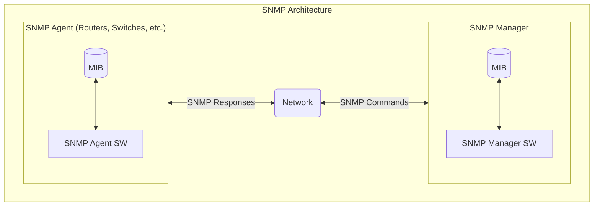

---
tags:
  - SR Linux
  - SNMP
  - Programmability
  - Management
  - MicroPython
---

# Customize your network's observability using SR Linux' SNMP Framework


|                             |                                                                                                                                                                                                                                                                                                                                                                                                                                                                                   |
| --------------------------- | --------------------------------------------------------------------------------------------------------------------------------------------------------------------------------------------------------------------------------------------------------------------------------------------------------------------------------------------------------------------------------------------------------------------------------------------------------------------------------- |
| **Activity name**           | Customize your network's observability using SR Linux' SNMP Framework                                                                                                                                                                                                                                                                                                                                                                                                                         |
| **Activity ID**           | 58                                                                                                                                                                                                                                                                                                                                                                                                                          |
| **Short Description**       | Enhance network observability by extending SR Linux's default SNMP MIBs and Traps. In this activity, you will create a custom SNMP Trap which is triggered by an ACL hit.                                                                                                                                                                                |
| **Difficulty**              | Intermediate                                                                                                                                                                                                                                                                                                                                                                                                                  |
| **Tools used**              | [SNMP](https://documentation.nokia.com/srlinux/24-10/books/system-mgmt/snmp.html){:target='_blank'}, [MicroPython](https://micropython.org/){:target='_blank'}                                                                                                                                                                                                                                                                                                                                                                                                                                              |
| **Topology Nodes**          | :material-router: spine11, :material-router: leaf11                                                                                                                                                                                                                                                                                                                                                                                                                                |
| **References**              | [SR Linux's built-in MIBs and traps](https://documentation.nokia.com/srlinux/24-10/books/system-mgmt/snmp.html){:target='_blank'}<br/>[SNMP Framework blogpost](https://learn.srlinux.dev/snmp/snmp_framework/){:target='_blank'}<br/>[MicroPython](https://docs.micropython.org/en/latest/){:target='_blank'}<br/>[YANG Browser](https://yang.srlinux.dev/v24.10.4){:target="_blank"}<br/> |


Many of the activities in this hackathon focus on programmability and automation in a model-driven network.  There are still some systems that require the use of more traditional (dare we say, legacy?) protocols such as SNMP.  Thankfully, SR Linux combines the best of both worlds with a highly configurable and flexible SNMP framework that lets you define your own MIBs and traps, using the same mechanisms that power its built-in SNMP capabilities. 

This SNMP framework is explained in detail in the following article on [customizing SNMP MIBs for Gets and Traps in SR Linux](https://learn.srlinux.dev/snmp/snmp_framework/){:target='_blank'}. 

In this activity, we will briefly review the most important aspects and then move straight into an example, followed by a task where you will implement an SNMP Trap yourself.


## Objective

Enhance network observability by extending SR Linux's default SNMP MIBs and Traps. Through this objective, you will:

- Gain a deeper understanding of SR Linux’s SNMP framework.
- Learn how to design and implement custom MIBs and Traps within SR Linux.
- Implement your custom SNMP Trap which will be triggered on an ACL hit.

## Technology explanation

### SNMP architecture
SNMP is an application-layer protocol that enables communication between managers (the network management system) and agents (the network devices). It provides a standard framework to monitor devices in a network from a central location.

An SNMP manager can get a value from an SNMP agent. The manager uses definitions in the management information base (MIB) to perform operations on the managed device such as retrieving values from variables and processing traps.

The following actions can occur between the agent and the manager:

- The manager gets information from the agent.
- The agent sends traps to notify the manager of significant events that occur on the system.



### Management information base (MIB)
A management information base (MIB) is a formal specifications document with definitions of management information used to remotely monitor, configure, and control a managed device or network system. The agent’s management information consists of a set of network objects that can be managed with SNMP. 

Object identifiers are unique object names that are organized in a hierarchical tree structure. The main branches are defined by the Internet Engineering Task Force (IETF). When requested, the Internet Assigned Numbers Authority (IANA) assigns a unique branch for use by a private organization or company. The branch assigned to Nokia (TiMetra) is 1.3.6.1.4.1.6527.

The SNMP agent provides management information to support a collection of IETF specified MIBs and a number of MIBs defined to manage devices and network data unique to the Nokia router.

MIB files are packaged with each release and are available on the Nokia support portal or in `/opt/srlinux/snmp/MIBs.zip`.
A list of supported OIDs for monitoring is available in the `numbers.txt` file that is included with the MIB files, or by executing the `file cat /etc/opt/srlinux/snmp/exportedOids` command. A list of supported traps can be accessed by executing the `file cat /etc/opt/srlinux/snmp/installedTraps` command.

/// note
`/etc/opt/srlinux/snmp/installedTraps` and `/etc/opt/srlinux/snmp/exportedOids` only exist when an SNMP trap group and an SNMP access group is configured respectively. Refer to the [documentation](https://documentation.nokia.com/srlinux/24-10/books/system-mgmt/snmp.html#snmpv2c){:target="_blank"} for more information on how to configure SNMP trap groups and SNMP access groups in SR Linux.
/// admonition | Filesystem
    type: subtle-note
`/etc/opt/srlinux/` is directly accessible from the VM instance filesystem at `~/clab/clab-srexperts/node_name/config/`
///
///

### Customizing SNMP MIBs for Gets and Traps in SR Linux

SR Linux version 24.10.1 introduces a customizable SNMP framework allowing you to define your own SNMP management information bases (MIBs) for gets and traps. This same framework powers [SR Linux's built-in MIBs and traps](https://documentation.nokia.com/srlinux/24-10/books/system-mgmt/snmp.html){:target='_blank'}, offering flexibility that customizes SNMP MIBs to the specific requirements for your network.

The framework defines:

- Mapping files (YAML): To define MIB tables and object identifiers (OIDs).
- Conversion scripts (uPython): To process data from the management server via gNMI and convert it for SNMP.

#### Creating Custom MIBs

You can create custom MIB definitions following these steps:

1. Define the mapping file: Specify paths, tables, scalars, and their structure in YAML.
2. Write the conversion script: Implement a `snmp_main` function in uPython that processes the input JSON and generates SNMP objects.
3. Add the mapping file to the list of table definitions to `/etc/opt/srlinux/snmp/snmp_files_config.yaml`.

/// admonition | Location of Built-in and Custom SNMP Framework Files
    type: subtle-note
The user-defined MIB definitions and files with the associated scripts are stored in `/etc/opt/srlinux/snmp` directory, while the built-in MIB definitions are stored in `/opt/srlinux/snmp` directory.
///

Built-in MIB examples (like `if_mib.yaml`) show how interface data maps to SNMP tables using standard OIDs and types such as counters, strings, and timeticks. Your custom MIBs follow this same structure. 

##### Python Script

The script entry point is a function called `snmp_main` that takes a JSON string as input and returns a JSON string.

```python
def snmp_main(in_json_str: str) -> str:
```

Refer to the built-in scripts as examples. The `/opt/srlinux/snmp/scripts/utilities.py` script contains some useful helper functions to perform various checks and common type conversions.

#### Creating Custom Traps

Traps are defined with mapping files that look similar to the MIB files, but include additional parameters for triggers and variable bindings. As you have seen in the beginning of this document, the built-in traps mapping files are listed in the global `/opt/srlinux/snmp/snmp_files_config.yaml`.

A list of OIDs available for traps is in `/etc/opt/srlinux/snmp/installedTraps` when a `trap-group` is configured. This file is created at runtime when the SNMP server is started.

To define custom traps:

1. Define the mapping file: Define the trap triggers, contexts, and variable bindings in YAML.
2. Write the conversion script: Implement trigger events and generate trap data in the `snmp_main` function.
3. Add the mapping file to the list of trap definitions to `/etc/opt/srlinux/snmp/snmp_files_config.yaml`.

##### Python Script

The script entry point is a function called `snmp_main` that takes a JSON string as input and returns a JSON string.

```python
def snmp_main(in_json_str: str) -> str:
```

Refer to the built-in scripts as examples.  The `/opt/srlinux/snmp/scripts/utilities.py` script contains some useful helper functions to perform various checks and common type conversions.

#### Directory Structure for Custom Files

Place user-defined files in `/etc/opt/srlinux/snmp`.

Changes to mapping files and scripts are not automatically read by the SNMP server, a restart of the SNMP server is required.

```srl
--{ running }--[  ]--
A:srl1# /tools system app-management application snmp_server-mgmt restart
```

#### Debugging and Troubleshooting

Debug files are generated in `/tmp/snmp_debug/$NETWORK_INSTANCE` when `debug: true` is set in the YAML configuration file.

* For MIBs: check `/etc/opt/srlinux/snmp/exportedOids` for your OIDs and make sure an `/ system snmp access-group` is configured.
* For traps: check `/etc/opt/srlinux/snmp/installedTraps` for your traps and make sure a `/ system snmp trap-group` is configured.
* Input/output logs: Check `.json_input`, `.json_output`, `.console` and `.error` files for debugging script execution.  The `.console` files contain output printed by the scripts and the `.error` files contain mapping and scripts errors.
* Path data: Inspect debug outputs for issues in path retrieval.

## Examples

This section describes the implementation of a gRPCServer MIB and a gRPCServer Trap. Feel free to simply read through them and use them as an inspiration for the task at hand. Or you can also actually implement them on one of the SR Linux nodes in our topology.

### gRPCServer MIB

Let's add a custom SNMP MIB to SR Linux at **runtime**, no feature requests, no software upgrades, by creating a gRPC server SNMP MIB.

#### Table Definition

Add a new table definition to `/etc/opt/srlinux/snmp/scripts/grpc_mib.yaml`.

This MIB has a single index `gRPCServerName` and 6 columns; the gRPC server network instance, its admin and operational states, the number of accepted and rejected RPCs and the last time an RPC was accepted.

All of these fields can be mapped from leafs that are found under the XPath `/system/grpc-server/...`

/// admonition | Inspecting XPaths
You can inspect specific XPaths in SR Linux using the command:
```
A:srl# /tree xpath from state / system grpc-server
/system/grpc-server[name=*]
/system/grpc-server[name=*]/admin-state:
/system/grpc-server[name=*]/timeout:
/system/grpc-server[name=*]/rate-limit:
<snip>
```
Or by using the [YANG Browser](https://yang.srlinux.dev/v24.10.4){:target="_blank"}.
///

```{.yaml .code-scroll-lg}
###########################################################################
# Description:
#
# Copyright (c) 2024 Nokia
###########################################################################
# yaml-language-server: $schema=./table_definition_schema.json

paths:
  - /system/grpc-server/...
python-script: grpc_mib.py
enabled: true
debug: true
tables:
  - name: gRPCServerTable
    enabled: true
    oid: 1.3.6.1.4.1.6527.115.114.108.105.110.117.120
    indexes:
      - name: gRPCServerName
        oid: 1.3.6.1.4.1.6527.115.114.108.105.110.117.120.1.1
        syntax: octet string
    columns:
      - name: grpcServerNetworkInstance
        oid: 1.3.6.1.4.1.6527.115.114.108.105.110.117.120.1.2
        syntax: octet string
      - name: grpcServerAdminState
        oid: 1.3.6.1.4.1.6527.115.114.108.105.110.117.120.1.3
        syntax: integer
      - name: grpcServerOperState
        oid: 1.3.6.1.4.1.6527.115.114.108.105.110.117.120.1.4
        syntax: integer
      - name: grpcServerAccessRejects
        oid: 1.3.6.1.4.1.6527.115.114.108.105.110.117.120.1.5
        syntax: integer
      - name: grpcServerAccessAccepts
        oid: 1.3.6.1.4.1.6527.115.114.108.105.110.117.120.1.6
        syntax: integer
      - name: grpcServerLastAccessAccept
        oid: 1.3.6.1.4.1.6527.115.114.108.105.110.117.120.1.7
        syntax: timeticks
```
/// details | OID definition
OIDs are typically hierarchically structured. Since this is an example, we are using an arbitrary OID within Nokia assigned enterprise branch `1.3.6.1.4.1.6527`. The suffix `115.114.108.105.110.117.120` actually decodes to `srlinux` in ASCII. 
///

The table definition file has the following important top level fields:

* `paths`: Specifies the gNMI paths for retrieving data.
* `python-script`: References the Python script used for data conversion.
* `tables`: Lists MIB tables, their structure, and their OIDs.
* `scalars`: Defines scalar OIDs. (not used in this MIB definition)

You can see the list of MIB table definitions in the `tables` list, where each table has the following structure:

* `name`: Specifies the name of the SNMP table. This is used for identification and reference in the SNMP configuration.
* `enabled`: Defines whether the table is active (true) or inactive (false).
* `oid`: The base OID for the table. All rows and columns in the table are extensions of this base OID.
* `indexes`: Indexes uniquely identify rows in the table. Each index maps a specific OID to a value that differentiates rows. A list of column definitions that serve as unique identifiers for rows.
    * `name`: The name of the index column.
    * `oid`: The OID for the index.
    * `syntax`: The data type of the index value.
* `columns`: Columns represent attributes or properties for each row in the table. Each column is defined with an OID and a data type.
    * `name`: The name of the column.
    * `oid`: The OID for the column.
    * `syntax`: The data type of the column's value.
    * `binary`: (optional) Indicates if the value is base64-encoded.
    * `enabled`: (optional) Enables or disables the column.

The `syntax` field in SNMP table and scalar definitions specifies the data type of the OID value. Each data type maps to a specific ASN.1 type, defining how the data is represented and transmitted in SNMP operations. Below is a detailed explanation of the supported data types.

/// details | Data Types
    type: subtle-note

* `octet string`: Represents a sequence of octets (bytes). Commonly used for textual information (e.g., names, descriptions) or raw binary data. E.g: `ifDescr`.
* `integer / integer32`: Represents a signed 32-bit integer. Used for numeric attributes like counters, states, or enumerations. E.g: `ifType`, `ifAdminStatus`, `ifOperStatus`.
* `unsigned / unsigned32`: Represents an unsigned 32-bit integer. E.g: values that should not be negative like counts or identifiers.
* `counter / counter32`: Represents a counter that increments over time and wraps back to 0 when it exceeds the maximum value (4,294,967,295). E.g: `ifInOctets`, `ifOutOctets`.
* `counter64`: Represents a 64-bit counter for high-capacity devices or metrics with large values. E.g: `ifHCInOctets`, `ifHCOutOctets`.
* `gauge / gauge32`: Represents a non-negative integer that can increase or decrease but cannot wrap. E.g `ifSpeed`.
* `timeticks`: Represents time in hundredths of a second since a device was last initialized or restarted. E.g: `ifLastChange`.
* `ipaddress`: Represents an IPv4 address as a 32-bit value. Stored and transmitted in network byte order (big-endian).
* `object identifier`: Represents an OID as a series of numbers identifying objects or properties in the SNMP tree.
* `bits`: Represents a sequence of bits, often used to define flags or multiple binary states.
///

#### Python Script

The YAML file references a Python script called `grpc_mib.py`. It must be placed in the same directory as the `grpc_mib.yaml` file.

The script is fairly simple; it grabs the JSON input and sets some global SNMP information such as the system boot time (useful for calculating time ticks values).  After that, it iterates over the list of gRPC servers in the input JSON and set each server's columns values (with the correct format) in the prepared output dict.  Finally it returns the output dict as a JSON blob.

```{.python .code-scroll-lg}
#!/usr/bin/python
###########################################################################
# Description:
#
# Copyright (c) 2024 Nokia
###########################################################################

import json

import utilities

SERVER_ADMIN_STATUS_UP = 1
SERVER_ADMIN_STATUS_DOWN = 2

IF_OPER_STATUS_UP = 1
IF_OPER_STATUS_DOWN = 2


# maps the gNMI admin status value to its corresponding SNMP value
def convertAdminStatus(value: str):
    if value is not None:
        if value == "enable":
            return SERVER_ADMIN_STATUS_UP
        elif value == "disable":
            return SERVER_ADMIN_STATUS_DOWN


# maps the gNMI oper status value to its corresponding SNMP value
def convertOperStatus(value: str):
    if value is not None:
        if value == "up":
            return IF_OPER_STATUS_UP
        elif value == "down":
            return IF_OPER_STATUS_DOWN


#
# main routine
#
def snmp_main(in_json_str: str) -> str:
    in_json = json.loads(in_json_str)

    del in_json_str

    # read in general info from the snmp server
    snmp_info = in_json.get("_snmp_info_")
    utilities.process_snmp_info(snmp_info)

    # prepare the output dict
    output = {"tables": {"gRPCServerTable": []}}

    # Iterate over all grpc-server instances
    grpc_servers = in_json.get("system", {}).get("grpc-server", [])
    for server in grpc_servers:
        # Extract required fields
        name = server.get("name", "")
        statistics = server.get("statistics", {})
        access_rejects = statistics.get("access-rejects", 0)
        access_accepts = statistics.get("access-accepts", 0)

        last_access_accept = 0
        # Grab the last-access-accept timestamp
        _last_access = statistics.get("last-access-accept", False)
        if _last_access:
            ts = utilities.parse_rfc3339_date(_last_access)
            # Convert it to timeTicks from boot time
            last_access_accept = utilities.convertUnixTimeStampInTimeticks(ts)

        # Append the object to the output
        output["tables"]["gRPCServerTable"].append(
            {
                "objects": {
                    "gRPCServerName": name,
                    "grpcServerNetworkInstance": server.get("network-instance", ""),
                    "grpcServerAdminState": convertAdminStatus(
                        server.get("admin-state", "")
                    ),
                    "grpcServerOperState": convertOperStatus(server.get("oper-state")),
                    "grpcServerAccessRejects": access_rejects,
                    "grpcServerAccessAccepts": access_accepts,
                    "grpcServerLastAccessAccept": last_access_accept,
                }
            }
        )

    return json.dumps(output)
```

#### Custom MIBs File

Reference the YAML mapping file in the your `snmp_files_config.yaml` so that the SNMP server loads it.

```{.bash .no-select}
cat /etc/opt/srlinux/snmp/snmp_files_config.yaml
```

<div class="embed-result">
```{.yaml .no-copy .no-select}
table-definitions:
  - scripts/grpc_mib.yaml
```
</div>

#### SNMP Server Restart

Restart the SNMP server process for it to load the new custom MIB definitions.

```srl
--{ running }--[  ]--
A:srl1# /tools system app-management application snmp_server-mgmt restart
/system/app-management/application[name=snmp_server-mgmt]:
    Application 'snmp_server-mgmt' was killed with signal 9

/system/app-management/application[name=snmp_server-mgmt]:
    Application 'snmp_server-mgmt' was restarted
```

#### Test Your New MIB

You can test your new MIB using tools like `snmpwalk`.

```.bash
snmpwalk -v 2c -c <community_name> <node_ip_or_hostname> 1.3.6.1.4.1.6527.115

iso.3.6.1.4.1.6527.115.114.108.105.110.117.120.1.2.4.109.103.109.116 = STRING: "mgmt"                            # <-- grpcServerNetworkInstance
iso.3.6.1.4.1.6527.115.114.108.105.110.117.120.1.3.4.109.103.109.116 = INTEGER: 1                                # <-- gRPCServerAdminState
iso.3.6.1.4.1.6527.115.114.108.105.110.117.120.1.4.4.109.103.109.116 = INTEGER: 1                                # <-- grpcServerOperState
iso.3.6.1.4.1.6527.115.114.108.105.110.117.120.1.5.4.109.103.109.116 = INTEGER: 0                                # <-- grpcServerAccessRejects
iso.3.6.1.4.1.6527.115.114.108.105.110.117.120.1.6.4.109.103.109.116 = INTEGER: 3                                # <-- grpcServerAccessAccepts
iso.3.6.1.4.1.6527.115.114.108.105.110.117.120.1.7.4.109.103.109.116 = Timeticks: (44659000) 5 days, 4:03:10.00  # <-- grpcServerLastAccessAccept
```

Have a look at `/tmp/snmp_debug` to see the input and output JSON blobs when `debug: true` is set in the YAML configuration file.

There you have it: a user-defined SNMP MIB added to SR Linux at **runtime**, no feature request, no software upgrade needed.

### gRPCServer Traps

Similar to the SNMP MIB, let's add custom SNMP traps to SR Linux at **runtime**, no feature requests, no software upgrades, by creating a gRPC server SNMP trap. Traps are independent from MIBs and do not need a corresponding MIB that is used for SNMP gets.

#### Trap Definitions

Add a new trap definitions to `/etc/opt/srlinux/snmp/scripts/grpc_traps.yaml`.

Two traps are defined:

* **gRPCServerDown:** sent when a gRPC server goes down.
* **gRPCServerUp:** sent when a gRPC server comes up, including at startup.

Both of these traps are triggered from the `/system/grpc-server/oper-state` XPath.

```{.yaml .code-scroll-lg}
###########################################################################
# Description:
#
# Copyright (c) 2024 Nokia
###########################################################################
# yaml-language-server: $schema=./trap_definition_schema.json

python-script: grpc_traps.py
enabled: true
debug: true
traps:
  - name: gRPCServerDown
    enabled: true
    startup: true
    oid: 1.3.6.1.4.1.6527.115.114.108.105.110.117.122
    enterprise: 1.3.6.1.4.1.6527.1.20
    triggers:
      - /system/grpc-server/oper-state
    context:
      - /system/grpc-server/...
    data:
      - objects: # this object is a scalar, does not use an index
          - name: gRPCServerName
            oid: 1.3.6.1.4.1.6527.115.114.108.105.110.117.120.1.1
            syntax: octet string
  - name: gRPCServerUp
    enabled: true
    startup: true
    oid: 1.3.6.1.4.1.6527.115.114.108.105.110.117.123
    enterprise: 1.3.6.1.4.1.6527.1.20
    triggers:
      - /system/grpc-server/oper-state
    context:
      - /system/grpc-server/...
    data:
      - objects: # this object is a scalar, does not use an index
          - name: gRPCServerName
            oid: 1.3.6.1.4.1.6527.115.114.108.105.110.117.120.1.1
            syntax: octet string
```
The trap definition YAML file has exactly the same top level elements as the table definition file but instead of `tables` the file contains `traps` top-level list. 

Besides the common `name`, `enabled` and `oid` fields, the `traps` object has the following fields:

* `triggers`: Specifies paths that trigger the trap.
* `context`: Additional paths to fetch data for the trap.
* `data`: Defines variable bindings included in the trap.

#### Python Script

The YAML file references a Python script called `grpc_traps.py`. It must be placed in the same directory as the `grpc_mib.yaml` file.

The script is fairly simple; it grabs the JSON input and looks for the gRPC server name to add as a variable binding. You can add additional variable bindings to traps that are relevant if you want, but in this case we only need one for the server name. Finally it returns the output dict as a JSON blob.

```{.python .code-scroll-lg}
###########################################################################
# Description:
#
# Copyright (c) 2025 Nokia
###########################################################################

import json
from collections import OrderedDict
import re
import utilities

# list of traps that will be echoed back to the client
traps_list_db: list = []


def parseGrpcServerKeys(xpath: str):
    # retrieve the name of the grpc-server from the xpath
    name_pattern = re.compile(r"[^\]]+\[([^\[\]=]+?)=([^\]]+)\]")
    matches = name_pattern.match(xpath)
    if matches is not None:
        return matches.group(2)
    return None


def gRPCServerUpgRPCServerUpDownTrap(grpc_servers: list, trap: dict, value) -> None:
    filter_key = parseGrpcServerKeys(trap.get("xpath", ""))
    if filter_key is None:
        raise ValueError(f"Can't look for a grpc-server without an xpath")

    # loop over all grpc-servers, filter the ones that match the xpath
    for server in grpc_servers:
        server_name = server.get("name", "")  # key
        if server_name != filter_key:
            continue

        # only report the grpc-servers that have the correct oper-state (unless force flag was used)
        if not utilities.is_forced_simulated_trap():
            oper_state = server.get("oper-state", "")
            if value is not None and oper_state != value:
                continue

        row = OrderedDict()
        objects = OrderedDict()

        objects["gRPCServerName"] = server_name

        row["trap"] = trap.get("name", "")
        row["indexes"] = OrderedDict()  # no indexes to report
        row["objects"] = objects
        traps_list_db.append(row)


#
# main routine
#
def snmp_main(in_json_str: str) -> str:
    global traps_list_db

    in_json = json.loads(in_json_str)

    # read in general info from the snmp server
    snmp_info = in_json.get("_snmp_info_")
    utilities.process_snmp_info(snmp_info)

    # read in info about the traps that will be triggered in this request (depending on the trigger)
    trap_info = in_json.get("_trap_info_", [])

    system = in_json.get("system", {})
    grpc_servers = system.get("grpc-server", [])

    # loop over all traps in this request
    for trap in trap_info:
        name = trap.get("name", "")
        trigger = trap.get("trigger", "")
        newValue = trap.get("new-value", "")

        if name == "gRPCServerDown":
            if newValue == "down" or utilities.is_forced_simulated_trap():
                gRPCServerUpgRPCServerUpDownTrap(grpc_servers, trap, newValue)
        elif name == "gRPCServerUp":
            if newValue == "up" or utilities.is_forced_simulated_trap():
                gRPCServerUpgRPCServerUpDownTrap(grpc_servers, trap, newValue)
        else:
            raise ValueError(f"Unknown trap {name} with trigger {trigger}")

    response: dict = {}

    response["traps"] = traps_list_db

    return json.dumps(response)
```

#### Custom Traps File

Reference the YAML mapping file in the your `snmp_files_config.yaml` so that the SNMP server loads it.

```{.bash .no-select}
cat /etc/opt/srlinux/snmp/snmp_files_config.yaml
```

<div class="embed-result">
```{.yaml .no-copy .no-select}
trap-definitions:
  - scripts/grpc_traps.yaml
```
</div>

#### SNMP Server Restart

Restart the SNMP server process for it to load the new custom traps.

```srl
--{ running }--[  ]--
A:srl1# /tools system app-management application snmp_server-mgmt restart
/system/app-management/application[name=snmp_server-mgmt]:
    Application 'snmp_server-mgmt' was killed with signal 9

/system/app-management/application[name=snmp_server-mgmt]:
    Application 'snmp_server-mgmt' was restarted
```

#### Test Your New Traps

Test your new traps by sending them from SR Linux.
/// Tab | Trigger the trap using a tools command
```srl
--{ running }--[  ]--
A:srl1# /tools system snmp trap gRPCServerDown force trigger "/system/grpc-server[name=mgmt]/oper-state"
/:
    Trap gRPCServerDown was sent

--{ running }--[  ]--
A:srl1# /tools system snmp trap gRPCServerUp force trigger "/system/grpc-server[name=mgmt]/oper-state"
/:
    Trap gRPCServerUp was sent
```
///
/// Tab | Trigger the trap by disabling / enabling the gRPC-server
```srl
--{ + running }--[  ]--
A:srl1# enter candidate

--{ + candidate shared default }--[  ]--
A:srl1# system grpc-server mgmt admin-state disable

--{ +* candidate shared default }--[  ]--
A:srl1# commit stay
All changes have been committed. Starting new transaction.

--{ + candidate shared default }--[  ]--
A:srl1# system grpc-server mgmt admin-state enable

--{ +* candidate shared default }--[  ]--
A:srl1# commit now
All changes have been committed. Leaving candidate mode.
```
///

You can see the traps being received on a Unix host using tools like `snmptrapd`.

```{.text .no-select}
snmptrapd -f -Lo
```

<div class="embed-result">
```{.text .no-select .no-copy}
NET-SNMP version 5.9.1
2025-02-13 16:02:28 srlinux.example.com [UDP: [192.168.0.12]:59562->[192.168.0.10]:162]:
DISMAN-EVENT-MIB::sysUpTimeInstance = Timeticks: (68600) 0:11:26.00 # <-- sysUpTime
SNMPv2-MIB::snmpTrapOID.0 = OID: SNMPv2-SMI::enterprises.6527.115.114.108.105.110.117.122 # <-- gRPCServerDown
SNMPv2-MIB::snmpTrapEnterprise.0 = OID: SNMPv2-SMI::enterprises.6527.1.20 # <-- Nokia private enterprise number
SNMPv2-SMI::enterprises.6527.115.114.108.105.110.117.120.1.1.0 = STRING: "mgmt" # <-- gRPCServerName

2025-02-13 16:02:33 srlinux.example.com [UDP: [192.168.0.12]:59562->[192.168.0.10]:162]:
DISMAN-EVENT-MIB::sysUpTimeInstance = Timeticks: (69100) 0:11:31.00 # <-- sysUpTime
SNMPv2-MIB::snmpTrapOID.0 = OID: SNMPv2-SMI::enterprises.6527.115.114.108.105.110.117.123 # <-- gRPCServerUp
SNMPv2-MIB::snmpTrapEnterprise.0 = OID: SNMPv2-SMI::enterprises.6527.1.20 # <-- Nokia private enterprise number
SNMPv2-SMI::enterprises.6527.115.114.108.105.110.117.120.1.1.0 = STRING: "mgmt" # <-- gRPCServerName

```
</div>

Have a look at `/tmp/snmp_debug` to see the input and output JSON blobs when `debug: true` is set in the YAML configuration file.

#### Input JSON Blob

```{.bash .no-select}
cat /tmp/snmp_debug/mgmt/grpc_traps.json_input
```

<div class="embed-result">
```{.json .code-scroll-lg .no-copy}
// comments will be removed before sending to the python-script
{
    "_snmp_info_": {
        "boottime": "2025-02-13T20:51:02Z",
        "datetime": "2025-02-13T21:02:33Z",
        "debug": true,
        "is-cold-boot": false,
        "network-instance": "mgmt",
        "platform-type": "7220 IXR-D2L",
        "script": "grpc_traps.yaml",
        "sysobjectid": "1.3.6.1.4.1.6527.1.20.26",
        "sysuptime": 69100,
        "trigger": "/system/grpc-server[name=mgmt]",
        "paths": [
            "/system/grpc-server[name=mgmt]/..."
        ]
    },
    "_trap_info_": [
        {
            "name": "gRPCServerDown",
            "new-value": "up",
            "old-value": "down",
            "startup": true,
            "trigger": "/system/grpc-server/oper-state",
            "xpath": "/system/grpc-server[name=mgmt]/oper-state"
        },
        {
            "name": "gRPCServerUp",
            "new-value": "up",
            "old-value": "down",
            "startup": true,
            "trigger": "/system/grpc-server/oper-state",
            "xpath": "/system/grpc-server[name=mgmt]/oper-state"
        }
    ],
    "system": {
        "grpc-server": [
            {
                // Path:        "/system/grpc-server[name=mgmt]"
                "name": "mgmt",
                "admin-state": "enable",
                "default-tls-profile": false,
                "max-concurrent-streams": 65535,
                "metadata-authentication": true,
                "network-instance": "mgmt",
                "oper-state": "up",
                "port": 57400,
                "rate-limit": 65000,
                "session-limit": 20,
                "timeout": 7200,
                "tls-profile": "clab-profile",
                "yang-models": "native",
                "gnmi": {
                    "commit-confirmed-timeout": 0,
                    "commit-save": false,
                    "include-defaults-in-config-only-responses": false
                },
                "services": [
                    "gnmi",
                    "gnoi",
                    "gnsi",
                    "gribi",
                    "p4rt"
                ],
                "source-address": [
                    "::"
                ],
                "trace-options": [
                    "request",
                    "response",
                    "common"
                ],
                "unix-socket": {
                    "admin-state": "enable",
                    "socket-path": "/opt/srlinux/var/run/sr_grpc_server_mgmt"
                }
            }
        ]
    }
}
```
</div>

#### Output JSON Blob

```{.bash .no-select}
cat /tmp/snmp_debug/mgmt/grpc_traps.json_output
```

<div class="embed-result">
```{.json .no-copy .no-select}
{
    "traps": [
        {
            "trap": "gRPCServerUp",
            "indexes": {},
            "objects": {
                "gRPCServerName": "mgmt"
            }
        }
    ]
}
```
</div>

There you have it: user-defined SNMP traps added to SR Linux at **runtime**, no feature request, no software upgrade needed.

## Tasks

**You should read these tasks from top-to-bottom before beginning the activity**.  

It is tempting to skip ahead but tasks may require you to have completed previous tasks before tackling them. 

You are now equipped with all the knowledge to create your own custom SNMP MIBs or Traps in SR Linux. To test your newly acquired knowledge, you will create a new custom SNMP Trap. In this task you will enhance your network's observability by creating an SNMP Trap for the ACL `matched-packets` statistic.

Please refer to the [Troubleshooting Access Control Lists (ACLs) using traffic monitoring tools, and configuration checkpoints](../beginner/nos-srlinux-activity-11.md){:target="_blank"} activity for more information about ACLs in SR Linux.

### Create a rollback checkpoint

```srl
/ tools system configuration generate-checkpoint name 'snmp-start' comment 'start of the activity'
```

### Create an SNMP access-group and trap-group

To enable SNMP on your :material-router: spine11 node, you first need to configure an access-group and a trap-group.

/// details | Hint 1
    type: tip

Check out the [documentation page](https://documentation.nokia.com/srlinux/24-10/books/system-mgmt/snmp.html){:target="_blank"} on SNMP in SR Linux. Make sure you configure your trap-group with the correct destination address in your management network.
///
/// details | Solution
    type: success
```srl
--{ + running }--[  ]--
A:g15-spine11# info system snmp
    system {
        snmp {
            access-group SNMPv2-RO-Community {
                security-level no-auth-no-priv
                community-entry RO-Community {
                    community $aes1$AWCRb2THTuMd5G8=$i60dOVPIHcmUuTNwePE+JQ==
                }
            }
            trap-group demo {
                admin-state enable
                network-instance mgmt
                destination collector {
                    admin-state enable
                    address 10.128.15.1
                    security-level no-auth-no-priv
                    community-entry demo {
                        community $aes1$AWAp8kl/wnx0RG8=$0tiHTb7b/9pRdrUHb7b1MA==
                    }
                }
            }
            network-instance mgmt {
                admin-state enable
            }
        }
    }
```
///

### Configure an ACL on Spine11

Configure an Access Control List (ACL) on :material-router: spine11 to capture (match and accept) ICMP packets originating from  :material-router: leaf11. If you're unsure how to do this, the procedure is explained here. 


1. Create the ACL and enable statistics tracking (set statistics-per-entry to true to monitor matched packets).
2. Add an entry with matching criteria for ICMP traffic, define the match conditions (e.g. protocol type = ICMP) and specify the desired action. 
3. Apply the ACL to the appropriate interface (this should be the same interface that the ICMP packets were observed on during the packet capture in the previous task).

/// details | Solution
    type: success
```
A:g15-spine11# enter candidate
A:g15-spine11# diff
     acl {
         acl-filter ping_leaf type ipv4 {
             description "ACL to capture ICMP request from leaf"
             statistics-per-entry true
             entry 10 {
                 match {
                     ipv4 {
                         protocol icmp
                         destination-ip {
                             prefix 10.46.15.31/32
                         }
                         icmp {
                             type echo
                         }
                         source-ip {
                             prefix 10.46.15.33/32
                         }
                     }
                 }
                 action {
                     accept {
                     }
                 }
             }
         }
         interface ethernet-1/1.0 {
             input {
                 acl-filter ping_leaf type ipv4 {
                 }
             }
         }
     }
```
///
### Check ACL statistics
Perform a ping command on :material-router: leaf11.
```bash
--{ + running }--[  ]--
A:g15-leaf11# ping network-instance default 10.46.15.31 -c 8
Using network instance default
PING 10.46.15.31 (10.46.15.31) 56(84) bytes of data.
64 bytes from 10.46.15.31: icmp_seq=1 ttl=64 time=2.79 ms
64 bytes from 10.46.15.31: icmp_seq=2 ttl=64 time=2.97 ms
64 bytes from 10.46.15.31: icmp_seq=3 ttl=64 time=3.00 ms
64 bytes from 10.46.15.31: icmp_seq=4 ttl=64 time=2.95 ms
64 bytes from 10.46.15.31: icmp_seq=5 ttl=64 time=1.27 ms
64 bytes from 10.46.15.31: icmp_seq=6 ttl=64 time=3.17 ms
64 bytes from 10.46.15.31: icmp_seq=7 ttl=64 time=2.31 ms
64 bytes from 10.46.15.31: icmp_seq=8 ttl=64 time=2.94 ms

--- 10.46.15.31 ping statistics ---
8 packets transmitted, 8 received, 0% packet loss, time 7010ms
rtt min/avg/max/mdev = 1.271/2.674/3.167/0.580 ms
```
Then, on :material-router: spine11, check the ACL statistics.
You should observe that the number of matched packets corresponds exactly to the number of ICMP packets sent from :material-router: leaf11.
If you run the ping multiple times, the statistics will show a cumulative count of all matching packets since the ACL was applied.
/// details | Check ACL statistics show command
/// tab | Command
``` bash
/show acl acl-filter ping_leaf type ipv4 entry 10
```
///
/// tab | expected output
``` bash
A:g15-spine11# show acl acl-filter ping_leaf type ipv4 entry 10
==========================================================================================================================================================================================================================
Filter        : ping_leaf
SubIf-Specific: disabled
Entry-stats   : yes
Entries       : 1
--------------------------------------------------------------------------------------------------------------------------------------------------------------------------------------------------------------------------
 Subinterface    Input   Output
ethernet-1/1.0   yes     no    
--------------------------------------------------------------------------------------------------------------------------------------------------------------------------------------------------------------------------
Entry 10
  Match               : protocol=icmp, 10.46.15.33/32(*)->10.46.15.31/32(*)
  Action              : accept
  Match Packets       : 8
  Last Match          : 2 minutes ago
  TCAM Entries        : 1 for one subinterface and direction
--------------------------------------------------------------------------------------------------------------------------------------------------------------------------------------------------------------------------
```
///
///


/// details | Check ACL statistics info from state command
/// tab | Command
``` bash
info from state / acl acl-filter ping_leaf type ipv4 entry 10 statistics
```
///
/// tab | expected output
``` bash
A:g15-spine11# info from state acl acl-filter ping_leaf type ipv4 entry 10 statistics
    acl {
        acl-filter ping_leaf type ipv4 {
            entry 10 {
                statistics {
                    matched-packets 8
                    last-match "2025-05-13T13:55:09.000Z (3 seconds ago)"
                }
            }
        }
    }

```
///
///

### Create your custom Trap Definition

In this activity we want to expose the `matched-packets` and `last-match` statistics as an SNMP Trap.

Create the file `acl_traps.yaml` in the `etc/opt/srlinux/snmp/scripts` directory on :material-router: spine11. Take a look at the `grpc_traps.yaml` file from the example earlier and use this as a reference to see what is needed in your `.yaml` file.

/// Note
Use the [YANG Browser](https://yang.srlinux.dev/v24.10.4){:target="_blank"} to easily figure out the YANG-paths you need.
///

/// details | Hint 1
    type: tip

The trigger you might want to use can be `matched-packets`. The corresponding YANG path is the following:
``` bash
/acl/acl-filter[name=*][type=*]/entry[sequence-id=*]/statistics/matched-packets
```
///

/// details | Hint 2
    type: tip
Think about the data you will send to the controller when the Trap is triggered. This could be:

- ACLFilterName
- ACLFilterType
- ACLFilterEntry
- ACLFilterMatchedPackets
- ACLFilterLastMatch

///

/// details | Solution
    type: success
``` yaml
###########################################################################
# Description:
#
# Copyright (c) 2025 Nokia
###########################################################################
# yaml-language-server: $schema=./trap_definition_schema.json

python-script: acl_traps.py
enabled: true
debug: true
traps:
  - name: ACLMatchedPacket
    enabled: true
    startup: true
    oid: 1.3.6.1.4.1.6527.99.117.115.116.111.109
    enterprise: 1.3.6.1.4.1.6527.1.20
    triggers:
      - /acl/acl-filter[name=*][type=*]/entry[sequence-id=*]/statistics/matched-packets
    context:
      - /acl/acl-filter[name=*][type=*]/entry[sequence-id=*]/statistics/...
    data:
      - objects: # this object is a scalar, does not use an index
          - name: ACLFilterName
            oid: 1.3.6.1.4.1.6527.99.117.115.116.111.109.1.1
            syntax: octet string
          - name: ACLFilterType
            oid: 1.3.6.1.4.1.6527.99.117.115.116.111.109.1.2
            syntax: octet string
          - name: ACLFilterEntry
            oid: 1.3.6.1.4.1.6527.99.117.115.116.111.109.1.3
            syntax: octet string
          - name: ACLFilterMatchedPackets
            oid: 1.3.6.1.4.1.6527.99.117.115.116.111.109.1.4
            syntax: integer
          - name: ACLFilterLastMatch
            oid: 1.3.6.1.4.1.6527.99.117.115.116.111.109.1.5
            syntax: timeticks
```
///

### Create your custom uPython conversion script
Create the python script that will take the JSON input and returns the output dict as a JSON blob.
Your `acl_traps.yaml` file needs to reference a script called `acl_traps.py`. This scripts needs to be created in the same directory `/etc/opt/srlinux/snmp/scripts`. Make sure you have set the debug flag in `acl_traps.yaml` to `true`. This will make debugging your script a lot easier; the input/output JSON will be visible in the `/tmp/snmp_debug/mgmt` directory. Next to this, any console output or errors will be logged in this folder.

Try to find inspiration in the `grpc_traps.py` script from the earlier example.

/// Note
Before looking at the solution, make sure to move to the next subtask, where it is explained how you deploy and trigger your custom SNMP Trap. Since the debug flag is enabled, you will get a better insight into what your script is doing when the SNMP Trap is triggered.
///


/// details | Hint 1
    type: tip

Try to follow a similar structure to the example. Here, this boils down to the following template.

```python
###########################################################################
# Description:
#
# Copyright (c) 2025 Nokia
###########################################################################

import json
from collections import OrderedDict
import re
import utilities

# List of traps to be returned to the client
traps_list_db: list = []

def parseACLFilterKeys(xpath: str):
    """
    Extracts values from [key=value] sections in the XPath string.
    Returns a list of values like ['ping_leaf', 'ipv4', '10']
    """
    name_pattern = re.compile(r"\[([^\[\]=]+)=([^\]]+)\]")
    results = []

    ### Your logic here

    return results if results else None


def ACLMatchedPacketTrap(acl_filter: list, entry: list, trap: dict, value) -> None:
    """
    Processes a trap of type 'ACLMatchedPacket' by matching filter attributes
    in the XPath to those in the ACL config data.
    """
    # Populate traps_list_db


def snmp_main(in_json_str: str) -> str:
    """
    Main entry point: processes input JSON string containing trap and ACL data,
    returns the trap response JSON string.
    """
    global traps_list_db
    traps_list_db.clear()  # Ensure clean start for each run

    in_json = json.loads(in_json_str)

    # Process SNMP server info

    # Get trap and ACL data

    # Return SNMP trap response
    return json.dumps({"traps": traps_list_db})

```
///
/// details | Hint 2
    type: tip

The gRPC server only had one identifier, its name. In the case of ACLs, there are statistics per ACL, ACL type and ACL entry. Make sure you alter your script to be able to handle this.

``` python
def parseACLFilterKeys(xpath: str):
    """
    Extracts values from [key=value] sections in the XPath string.
    Should return a list of values like ['ping_leaf', 'ipv4', '10']
    """
    name_pattern = re.compile(r"\[([^\[\]=]+)=([^\]]+)\]") # This regex will match "key" and "value" 
    results = []

    ### Your logic here to extract the values

    return results if results else None
```
///

/// details | Solution
    type: success
``` python
###########################################################################
# Description:
#
# Copyright (c) 2025 Nokia
###########################################################################

import json
from collections import OrderedDict
import re
import utilities

# List of traps to be returned to the client
traps_list_db: list = []

def parseACLFilterKeys(xpath: str):
    """
    Extracts values from [key=value] sections in the XPath string.
    Returns a list of values like ['ping_leaf', 'ipv4', '10']
    """
    name_pattern = re.compile(r"\[([^\[\]=]+)=([^\]]+)\]")
    results = []

    while True:
        match = name_pattern.search(xpath)
        if not match:
            break
        results.append(match.group(2))  # Extract the value only

        # Advance past the matched closing bracket manually
        close_idx = xpath.find(']')
        if close_idx == -1:
            break
        xpath = xpath[close_idx + 1:]  # Trim the processed part

    return results if results else None


def ACLMatchedPacketTrap(acl_filter: list, entry: list, trap: dict, value) -> None:
    """
    Processes a trap of type 'ACLMatchedPacket' by matching filter attributes
    in the XPath to those in the ACL config data.
    """
    filter_key = parseACLFilterKeys(trap.get("xpath", ""))
    if not filter_key or len(filter_key) < 3:
        raise ValueError("Invalid or missing XPath filter keys")

    filter_name_key, filter_type_key, filter_entry_key = filter_key[:3]

    for acl in acl_filter:
        if acl.get("name", "") != filter_name_key:
            continue
        if acl.get("type", "") != filter_type_key:
            continue

        for acl_entry in acl.get("entry", []):
            sequence_id = str(acl_entry.get("sequence-id", ""))
            if sequence_id != filter_entry_key:
                continue

            # Skip if trap is not forced and matched packet count doesn't match
            matched_packets = acl_entry.get("statistics", {}).get("matched-packets", 0)
            last_match = acl_entry.get("statistics", {}).get("last-match", "")

            if not utilities.is_forced_simulated_trap():
                if value is not None and matched_packets != value:
                    continue

            # Convert last match time to SNMP timeTicks format
            last_match_ts = utilities.parse_rfc3339_date(last_match)
            last_match_tt = utilities.convertUnixTimeStampInTimeticks(last_match_ts)

            # Build SNMP response structure
            row = OrderedDict()
            objects = OrderedDict()

            objects["ACLFilterName"] = filter_name_key
            objects["ACLFilterType"] = filter_type_key
            objects["ACLFilterEntry"] = sequence_id
            objects["ACLFilterMatchedPackets"] = int(matched_packets)
            objects["ACLFilterLastMatch"] = last_match_tt

            row["trap"] = trap.get("name", "")
            row["indexes"] = OrderedDict()  # No indexes used
            row["objects"] = objects

            traps_list_db.append(row)


def snmp_main(in_json_str: str) -> str:
    """
    Main entry point: processes input JSON string containing trap and ACL data,
    returns the trap response JSON string.
    """
    global traps_list_db
    traps_list_db.clear()  # Ensure clean start for each run

    in_json = json.loads(in_json_str)

    # Process SNMP server info
    snmp_info = in_json.get("_snmp_info_")
    utilities.process_snmp_info(snmp_info)

    # Get trap and ACL data
    trap_info = in_json.get("_trap_info_", [])
    acl = in_json.get("acl", {})
    acl_filter = acl.get("acl-filter", [])
    acl_entry = acl.get("entry", [])  # Not currently used, but preserved

    for trap in trap_info:
        name = trap.get("name", "")
        trigger = trap.get("trigger", "")
        new_value = trap.get("new-value", "")

        if name == "ACLMatchedPacket":
            ACLMatchedPacketTrap(acl_filter, acl_entry, trap, new_value)
        else:
            raise ValueError(f"Unknown trap {name} with trigger {trigger}")

    # Return SNMP trap response
    return json.dumps({"traps": traps_list_db})

```

///

### Custom Traps File

Reference the YAML mapping file in the your `snmp_files_config.yaml` so that the SNMP server loads it.

```bash
cat /etc/opt/srlinux/snmp/snmp_files_config.yaml
```

```yaml
trap-definitions:
  - scripts/acl_traps.yaml
```

### SNMP Server Restart

Restart the SNMP server application to make sure it loads the new custom trap.

```srl
--{ + running }--[  ]--
A:g15-spine11# /tools system app-management application snmp_server-mgmt restart
/system/app-management/application[name=snmp_server-mgmt]:
    Application 'snmp_server-mgmt' was killed with signal 15

/system/app-management/application[name=snmp_server-mgmt]:
    Application 'snmp_server-mgmt' was restarted
```

### Test Your New Trap

Sending a ping from :material-router: leaf11 to :material-router: spine11 should trigger your newly created trap.

You can see the traps being received on a Unix host using tools like `snmptrapd`.

/// details | Test your trap using snmptrapd
/// tab | Command
```bash
snmptrapd -f -Lo
```
///
/// tab | expected output
```bash

NET-SNMP version 5.9.1 AgentX subagent connected
NET-SNMP version 5.9.1
2025-05-15 15:35:50 clab-srexperts-spine11 [UDP: [10.128.15.31]:59592->[10.128.15.1]:162]:
iso.3.6.1.2.1.1.3.0 = Timeticks: (7604300) 21:07:23.00  
iso.3.6.1.6.3.1.1.4.1.0 = OID: iso.3.6.1.4.1.6527.99.117.115.116.111.109        
iso.3.6.1.6.3.1.1.4.3.0 = OID: iso.3.6.1.4.1.6527.1.20      
iso.3.6.1.4.1.6527.99.117.115.116.111.109.1.1.0 = STRING: "cpm" 
iso.3.6.1.4.1.6527.99.117.115.116.111.109.1.2.0 = STRING: "ipv4"        
iso.3.6.1.4.1.6527.99.117.115.116.111.109.1.3.0 = STRING: "10"      
iso.3.6.1.4.1.6527.99.117.115.116.111.109.1.4.0 = INTEGER: 1716 
iso.3.6.1.4.1.6527.99.117.115.116.111.109.1.5.0 = Timeticks: (7604300) 21:07:23.00

2025-05-15 15:35:50 clab-srexperts-spine11 [UDP: [10.128.15.31]:59592->[10.128.15.1]:162]:
iso.3.6.1.2.1.1.3.0 = Timeticks: (7604300) 21:07:23.00  
iso.3.6.1.6.3.1.1.4.1.0 = OID: iso.3.6.1.4.1.6527.99.117.115.116.111.109        
iso.3.6.1.6.3.1.1.4.3.0 = OID: iso.3.6.1.4.1.6527.1.20      
iso.3.6.1.4.1.6527.99.117.115.116.111.109.1.1.0 = STRING: "cpm" 
iso.3.6.1.4.1.6527.99.117.115.116.111.109.1.2.0 = STRING: "ipv4"        
iso.3.6.1.4.1.6527.99.117.115.116.111.109.1.3.0 = STRING: "260"     
iso.3.6.1.4.1.6527.99.117.115.116.111.109.1.4.0 = INTEGER: 1082346      
iso.3.6.1.4.1.6527.99.117.115.116.111.109.1.5.0 = Timeticks: (7604300) 21:07:23.00

2025-05-15 15:35:50 clab-srexperts-spine11 [UDP: [10.128.15.31]:59592->[10.128.15.1]:162]:
iso.3.6.1.2.1.1.3.0 = Timeticks: (7604300) 21:07:23.00  
iso.3.6.1.6.3.1.1.4.1.0 = OID: iso.3.6.1.4.1.6527.99.117.115.116.111.109        
iso.3.6.1.6.3.1.1.4.3.0 = OID: iso.3.6.1.4.1.6527.1.20      
iso.3.6.1.4.1.6527.99.117.115.116.111.109.1.1.0 = STRING: "ping_leaf"   
iso.3.6.1.4.1.6527.99.117.115.116.111.109.1.2.0 = STRING: "ipv4"        
iso.3.6.1.4.1.6527.99.117.115.116.111.109.1.3.0 = STRING: "10"      
iso.3.6.1.4.1.6527.99.117.115.116.111.109.1.4.0 = INTEGER: 16        
iso.3.6.1.4.1.6527.99.117.115.116.111.109.1.5.0 = Timeticks: (7604300) 21:07:23.00

```
///
///

/// details | Note
    type: tip

As you can see in the expected output of the `snmptrapd` command, all configured ACLs will trigger a trap when their matched-packets statistic changes. This might be undesired. Consider changing your SNMP trap trigger to:
``` yaml
    triggers:
      - /acl/acl-filter[name=ping_leaf][type=*]/entry[sequence-id=*]/statistics/matched-packets
```
This way you will only trigger a trap when the `ping_leaf` ACL has a matched packet.
///


Have a look at `/tmp/snmp_debug` to see the input and output JSON blobs when `debug: true` is set in the YAML configuration file.

### Configuration rollback

To complete the activity, you should rollback to the initial configuration.

You have two options:

- Manually remove the changes which would be more complex and prone to error.
- Rollback from the checkpoint which is the recommended and easier method. Don't forget to commit the new rolled-back configuration.

After executing the rollback command and committing the changes, verify that the ACL and SNMP configuration you applied on :material-router: spine11 is no longer present. Afterwards, restart the SNMP application once again.

/// details | Solution
    type: success
/// tab | Rollback
```srl
tools system configuration checkpoint snmp-start revert
commit now
```
///
/// tab | SNMP restart
```srl
A:spine11# /tools system app-management application snmp_server-mgmt restart
/system/app-management/application[name=snmp_server-mgmt]:
    Application 'snmp_server-mgmt' was killed with signal 15

/system/app-management/application[name=snmp_server-mgmt]:
    Application 'snmp_server-mgmt' was restarted

```
///
///

## Summary and review
Congratulations! If you have got this far you have completed this activity and achieved the following:

  - Explored the SNMP framework in SR Linux
  - Learned the process of creating custom SNMP MIBs and Traps
  - Created and sent your own custom SNMP Trap
  - Debugged MicroPython code using console output, error messages, and JSON input/output
  - Tested your SNMP Trap using `snmptrapd`

If you're eager for more, why not try another activity?
