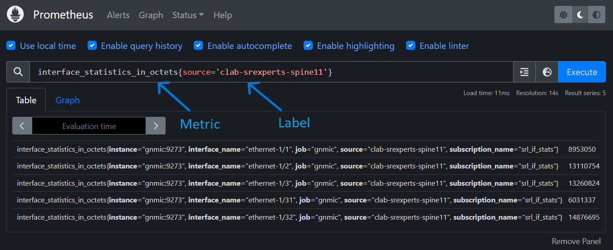

---
tags:
  - Streaming_telemetry
  - grafana
  - prometheus
  - gnmic
  - dashboard
  - visualization
  - SR OS
  - SR Linux
---

# Create a graphical dashboard to monitor live BGP statistics


|                             |                                                                                                                                                                                                                                                                                                                                                                                                                                                                                   |
| --------------------------- | --------------------------------------------------------------------------------------------------------------------------------------------------------------------------------------------------------------------------------------------------------------------------------------------------------------------------------------------------------------------------------------------------------------------------------------------------------------------------------- |
| **Activity name**           | Create a graphical dashboard to monitor live BGP statistics using Grafana                                                                                                                                                                                                                                                                                                                                                                                                                          |                                                                                                                                   |
| **Activity ID**           | 43                                                                                                                                                                                                                                              
| **Short Description**       | Grafana dashboard is a customizable interface used to visualize and analyze data from various sources in real time. It allows users to create interactive panels (like graphs, charts, and tables) to monitor system metrics, application performance, and business KPIs.  This activity will use live streaming telemetry to visualize the network.                                                                                                                                                                                                                                                                                                                                               |
| **Difficulty**              | Beginner                                                                                                                                                                                                                                                                                                                                                                                                                  |
| **Tools used**              | [gNMIc](https://gnmic.openconfig.net/), [Prometheus](https://prometheus.io/), [Grafana](https://grafana.com/), [SR OS](https://www.nokia.com/ip-networks/service-router-operating-system-nos/), [SR Linux](https://www.nokia.com/ip-networks/service-router-linux-NOS/)                                                                                                                                                                                                                                                                                                                                                                                                                                              |                                                                                                                                                                       |
| **Topology Nodes**          |  :material-router: PE2  :material-router: spine11  |
| **References**              | [YANG Browser](https://yang.srlinux.dev/v25.3.1), [SR OS YANG Path finder](https://yang.labctl.net/yang/SROS/) |


**This activity uses SR OS and SR Linux to provide streaming telemetry statistics.**

Streaming telemetry is a modern approach to network monitoring that continuously collects and streams real-time data from network devices using protocols like gNMI. Unlike traditional pulling methods, it enables high-frequency data collection, reducing latency and improving network visibility. By integrating tools like gNMIc as the collector, Prometheus as the time-series database, and Grafana for dynamic visualization, it provides actionable insights into network performance and trends in real time.


## Objective
Network operators need near real-time visibility into network metrics like BGP peer health or interface statistics across multiple routers to proactively detect service disruptions. In the upcoming tasks you will build a live dashboard to monitor BGP peer status, enabling faster incident response in production.

In this lab we will experience:

1. how to identify and subscribe to streaming telemetry metrics

2. how the components of the telemetry stack work together

3. how to visualize the metrics

4. how variables can enhance filtering and dashboard reusability 


## Telemetry Stack Components

Here we briefly go through telemetry stack components and their role in the streaming telemetry.

### gNMIc
gNMIc is a telemetry collection client, developed by Nokia and donated to the Openconfig project.  It allows operators to subscribe to streaming telemetry data from network devices and export it to a variety of destinations. In this lab, gNMIc is used to subscribe to the telemetry data from SR Linux and SR OS nodes and export it to the prometheus time-series database.

#### Subscribing to data
Metric paths are what the collector uses to identify the data that you would like receive notifications from.

- [x] SR OS provides a valuable capability to display the gNMI path directly from the CLI. This simplifies the process of locating the path to a specific metric, even without access to a YANG browser.

!!! info "Connect to a SR OS Node"
    ```   
    ssh admin@clab-srexperts-pe2
    ```
Consider that you want to fetch information about the operationally up BGP peers of the router.  You may use the MD-CLI command `pwc gnmi-path` to find the paths to subscribe to.

``` hl_lines="2"
[/]
A:admin@g15-pe2# state router bgp convergence family ipv4

[/state router "Base" bgp convergence family ipv4]
A:admin@g15-pe2# pwc gnmi-path 
Present Working Context:
/state/router[router-name=Base]/bgp/convergence/family[family-type=ipv4]
```

- [x] SR Linux is a YANG-modeled network operating system, identifying the gNMI paths that correspond to the data we want to retrieve can be done in the SR Linux CLI.

!!! info "Connect to a SR Linux Node"
    ```   
    ssh admin@clab-srexperts-spine11
    ```
Consider that you want to fetch the VLAN information of interfaces, the `xpath` command can provide the details as shown below; or you can also find the intended paths by searching the keywords in [YANG Browser](https://yang.srlinux.dev/v25.3.1).

``` hl_lines="2"
--{ running }--[  ]--
A:admin@spine11# tree xpath interface subinterface vlan
/interface[name=*]/subinterface[index=*]/vlan
/interface[name=*]/subinterface[index=*]/vlan/encap
/interface[name=*]/subinterface[index=*]/vlan/encap/single-tagged
/interface[name=*]/subinterface[index=*]/vlan/encap/single-tagged/vlan-id:
```


In your hackathon network, the gNMIc configuration file `config.yml` is applied to the gNMIc client at startup. If you review the gNMIc -{{ github_link('clab/configs/gnmic/config.yml') }}- you will find the main parts of the configuration for the collector as briefly mentioned in below diagram.


### Prometheus
Prometheus is a widely used open-source time-series database (TSDB). In this activity, it is utilized to store telemetry data exported by gNMIc. The Prometheus configuration file -{{ github_link('clab/configs/prometheus/prometheus.yml') }}- contains a minimal setup and directs Prometheus to scrape data from the gNMIc collector at 5-second intervals. Metrics are stored as time-series data, including timestamps indicating when they were recorded, along with optional key-value pairs known as labels.

!!! info "Connect ot Prometheus Web UI"
    ```   
    http://<group-id>.srexperts.net:9090
    ```



### Grafana
Grafana provides visualization for the collected telemetry data. 
You can find preconfigured reference dashboards that offer multiple views of the collected real-time data. Navigate thorugh the different dashboards and try to figure out how the data is visualized.

!!! info "Connect to Grafana"
    ```     
    http://<group-id>.srexperts.net:3000
    ```

/// tab | Dashboards


///
/// tab | Generic Topology


///
/// tab | SR Linux Telemetry


///
/// tab | SROS Telemetry


///
/// tab | Syslog


///


## Tasks
In the following tasks you will create your own Grafana dashboard, manipulate the gNMIc `config.yml` to add new metrics to monitor and define variables to improve interactive filtering.

### Create a new Grafana Dashboard
In order to create a new dashboard, log into Grafana through the top right `Sign in` with the username `admin` and the password provided on your group's handout.  

Follow this workflow through the Grafana menus:


Now you can create your own panel like below example that applies for both SR OS and SR Linux:

:material-numeric-1-circle: Choose the type of graph you want to see, relevant to your metrics: here we chose a `Bar gauge`.

:material-numeric-2-circle: Change the metric view from `Builder` to `Code`.

:material-numeric-3-circle: Through the metric browser, select needed metric: here we chose `bgp peers` for SR OS.

:material-numeric-4-circle: In the Options bar Legend box, by selecting the `Custom`, you can filter for example on `source`.

:material-numeric-5-circle: Give a Title to your Graph in `Panel options`.


/// tab | SR OS BGP peers

///


Following the same procedure, make a similar panel visualizing SR Linux Dynamic BGP Peers.

??? success "SR Linux Panel Sample"
    /// tab | SR Linux Dynamic BGP Peers
    
    ///

You can follow the same procedure for different graph types and various metrics.

!!! info
    You need to subscribe to the desired metrics in advance for them to appear (this is the next task).


    
    


### Add New Metrics
Open the `config.yml` file of gNMIc on your group's Hackathon VM in `$HOME/SReXperts/clab/configs/gnmic/config.yml`.  This file is where you will add new metric subscriptions in the `containers` --> `config` --> `subscriptions` list. Here are two samples; one for SR OS and one for SR Linux.


/// tab | SR OS subscription

``` py
subscriptions:
  sros_event_handler_stats:
    paths: 
      -  ???   #The path for SR OS event-handling stats
      -  ???   #The path for SR OS event-trigger stats
    mode: stream
    stream-mode: sample
    sample-interval: 5s
```

///
/// tab | SR Linux subscription

``` py
subscriptions:
  srl_if_ipv6_stats:
    paths: 
      -  ???   #The path for SR Linux interface IPv6 stats
    mode: stream
    stream-mode: sample
    sample-interval: 5s
```

///
/// tab | Containers subscription

``` py hl_lines="23 42"
loader:
  type: docker
  address: unix:///run/docker.sock
  filters:
    # filter 1
    - containers:
        - label: clab-node-kind=nokia_srlinux
      network:
        name: srexperts
      port: "57400"
      config:
        username: admin
        insecure: true
        encoding: proto
        subscriptions:
          - srl_platform
          - srl_apps
          - srl_if_stats
          - srl_if_lag_stats
          - srl_net_instance
          - srl_bgp_stats
          - srl_event_handler_stats
          - srl_if_ipv6_stats
    # filter 2
    - containers:
        - label: clab-node-kind=nokia_sros
      network:
        name: srexperts
      port: "57400"
      config:
        username: admin
        insecure: true
        encoding: json
        subscriptions:
          - sros_ports_stats
          - sros_router_bgp
          - sros_router_interface
          - sros_router_isis
          - sros_router_route_table
          - sros_system
          - sros_service_stats
          - sros_event_handler_stats
```

///

??? tip "How to acquire paths"

    /// tab |  SR OS gnmi-path

    ``` hl_lines="5"
    [/]
    A:admin@g15-pe2# /state log event-handling 

    [/state log event-handling]
    A:admin@g15-pe2# pwc gnmi-path 
    Present Working Context:
    /state/log/event-handling
    ```
    ///

    /// tab |  SR Linux xpath

    ``` hl_lines="2"
    --{ running }--[  ]--
    A:admin@spine11# tree xpath interface subinterface ipv6
    /interface[name=*]/subinterface[index=*]/ipv6

    ```
    ///

After modifying the gNMIc `config.yml` file, save it and restart the gNMIc container.
  
  1. Find the gnmic container name
  ```
    sudo clab inspect --all | grep gnmic
  ```
  2. Restart the container
  ```
    docker restart <container_name>
  ```
Now you can check the newly added metrics in Prometheus and Grafana.

### Add dashboard variables for interactive filtering
Grafana dashboard variables allow users to choose values from a dropdown menu to filter the data shown in panels. This makes dashboards more dynamic and user-friendly, especially when monitoring multiple devices, interfaces, or services.

In this task you will create a variable that allows users to select which device (source) they want to view metrics for, directly from a drop-down menu.

1. Open Your Dashboard

    :octicons-dot-16: Go to the Grafana dashboard you created earlier.

    :octicons-dot-16: Click the gear icon :octicons-gear-24: in the top-right corner to open **Dashboard Settings**.
    
    :octicons-dot-16: In the left menu, click **Variables**.

2. Create a New Variable

    :octicons-dot-16: Click **:material-calculator-variant-outline: Add variable**.

    :octicons-dot-16: Fill in the fields as follows:

    - Select variable type: **Query**</p>
    - Name: **device**</p>
    - Label: **Device Selector**</p>
    - Data Source: :simple-prometheus:**Prometheus**</p>
    - Query type: **Label values**
    - Label: **source**
    - Metric: 
    
          for SR OS: **`router_bgp_statistics_peers`**</p> 
          for SR Linux: **`network_instance_protocol_bgp_statistics_dynamic_peers`**

    :octicons-dot-16: Under **Selection Options**, enable:

    - :ballot_box_with_check: Multi-value</p>
    - :ballot_box_with_check: Include All option

    :octicons-dot-16: Click **Apply** and save the dashboard

3. Use the Variable in a Panel

    :octicons-dot-16: Go back to your dashboard.</p>
    :octicons-dot-16: Click :fontawesome-regular-pen-to-square: on the menu of the panel to edit.</p>

    :octicons-dot-16: In the Query section --> **Metric browser** replace the fixed source value with your new variable:</p>
     ```bash
     router_bgp_statistics_peers{source=~"$device"}
     ```

    This means: filter `router_bgp_statistics_peers` data for only the device(s) selected in the dropdown.

    
    
    :octicons-dot-16: Click **Apply** or Update to save the panel.

4. Test the Variable

    :octicons-dot-16: At the top of your dashboard, you will now see a dropdown called **Device Selector** (or whatever label you gave it).</p>
    :octicons-dot-16: Try selecting different devices.</p>

    :octicons-dot-16: Watch the graph update automatically to show metrics only for the selected device(s).</p>
    
By defining such variables, you don’t need to make a separate panel for each device. Users can quickly switch between devices or compare multiple ones.


## Summary

By completing the tasks of this activity, you have achieved the following:

- You have an understanding of how the components of streaming telemetry collaborate
- You learnt how to find the path to different metrics in SR OS and SR Linux
- You learnt how to subscribe to new metrics
- You made your customized Grafana dashboard
- You added new variable to improve dashboard reusability and scalability.

With this dashboard, you can now monitor critical metrics live, respond to issues faster, and reduce mean time to resolution during network incidents.
Now you can subscribe to any metric you desire and visualize them as you wish.
