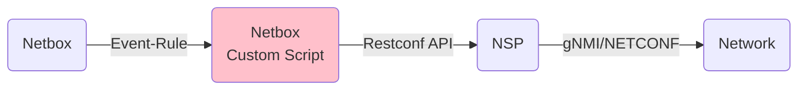
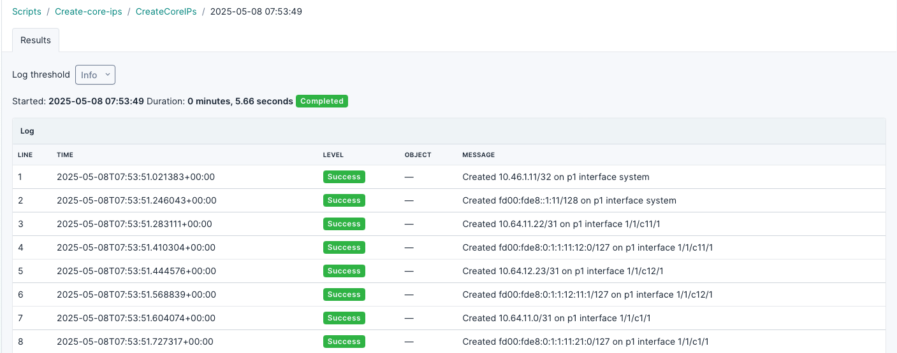
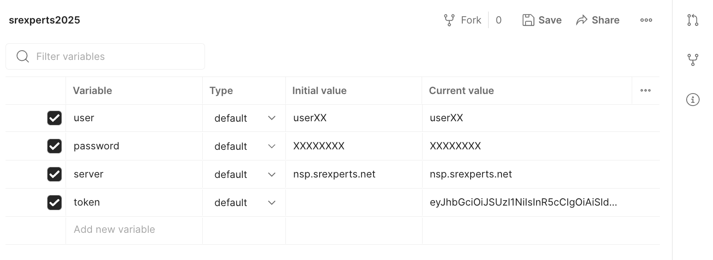
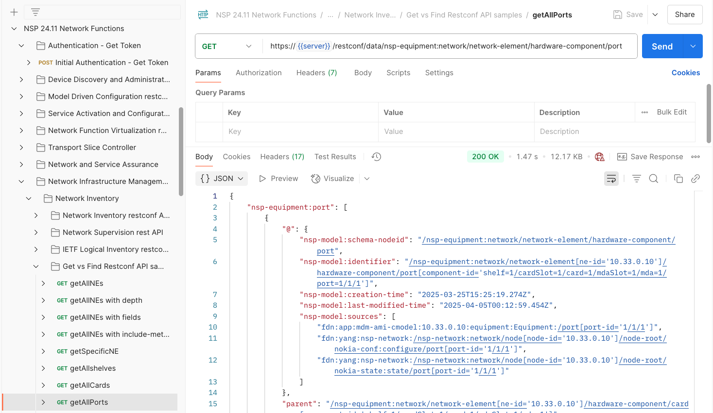
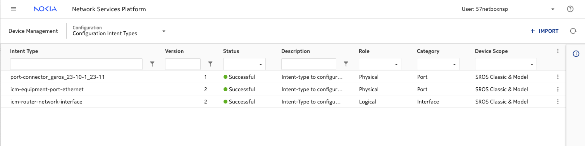
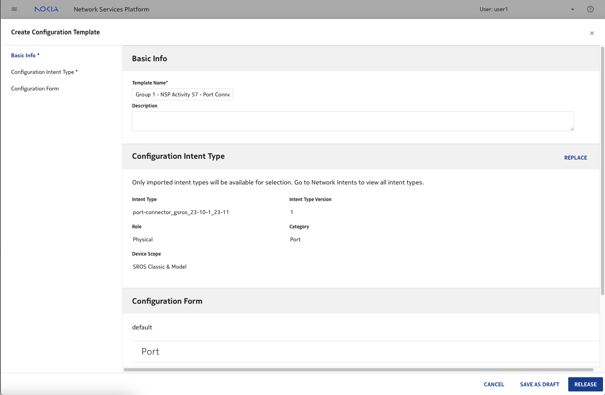
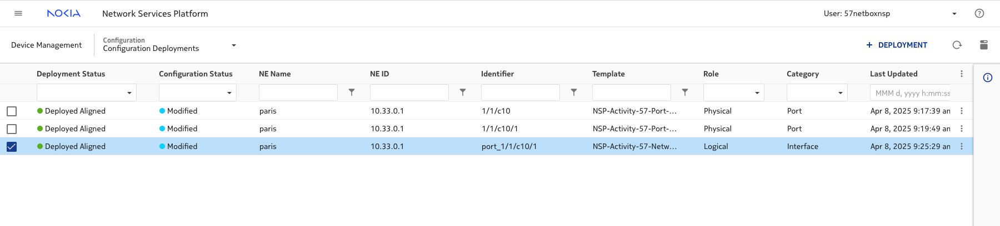
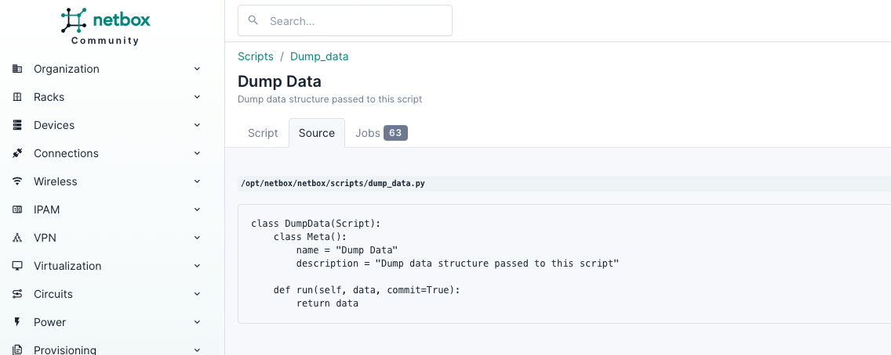
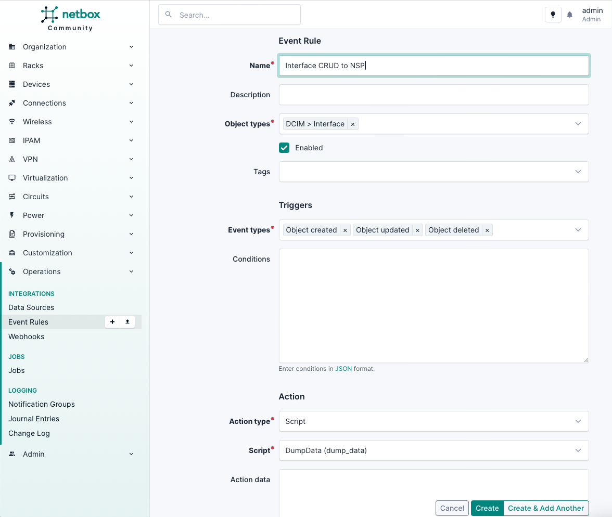
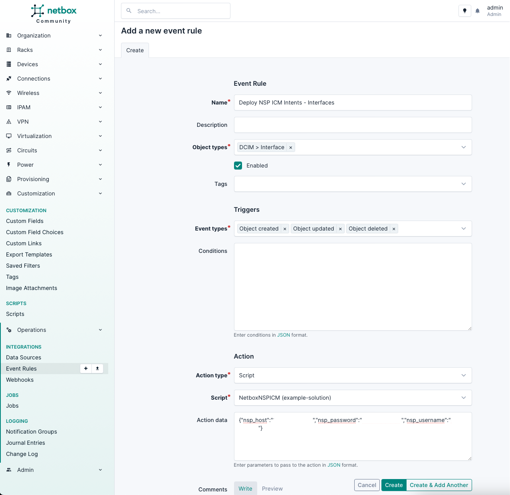

---
tags:
  - NSP
  - NetBox
  - Python
---

# Deploying NSP Intents using Netbox

|     |     |
| --- | --- |
| **Activity name** | Deploying NSP Intents with NetBox |
| **Activity ID** | 57 |
| **Short Description** | Use NetBox for infrastructure management on top of NSP to create/update infrastructure intents. |
| **Difficulty** | Advanced |
| **Tools used** | [Postman](https://www.postman.com/downloads/) |
| **Topology Nodes** | :material-router: PE1, :material-router: PE2, :material-router: PE3, :material-router: PE4, :material-router: P1, :material-router: P2 |
| **References** | [Nokia  Developer Portal](https://network.developer.nokia.com) (Sign up for a free account)<br/>[NSP Postman collections](https://network.developer.nokia.com/static/private/downloads/postmanCollections/24_11_NSP_Postman_Collections.zip)<br/>[Netbox Shell Documentation](https://netboxlabs.com/docs/netbox/en/stable/administration/netbox-shell/) |

## Objective

Netbox is a Source of Truth platform for recording the target state of your network infrastructure, both physical and logical. NSP is an intent-driven automation platform we'll be using to control the IP network domain, based on the information defined in Netbox. In this activity, you'll create a custom Netbox script to translate Netbox's version of the network state into NSP intents to control device configuration.

This is the rough flow chart of the solution we're going to construct, the Netbox custom script is where most of the effort will be focused.


## Prerequisites

- NSP RESTCONF APIs using POSTMAN
- Practical programming experience using python

## NetBox

### DCIM
The Data Center Infrastructure Management (DCIM) module in Netbox provides tools for documenting network infrastructure, including devices, racks, and cables. It centers around the Device model for hardware and the Interface model for network ports, allowing operators to track both physical connections and interface configurations in a centralized system.

DCIM's power lies in how it relates these components - Interfaces can be connected to other Interfaces via Cables, Devices can be mounted in Racks at specific positions, and everything can be organized by Site and Location. This creates a complete model of the physical network that serves as a source of truth for automation. The module also includes features for tracking power connections, console ports, and front/rear panel layouts of devices.

For network automation use-cases, the Device and Interface models are particularly valuable as they can be integrated with other systems (like NSP) to drive configuration changes based on the documented physical state in Netbox.

### IPAM
The IP Address Management (IPAM) module in Netbox provides tools for managing IP addresses, prefixes, VLANs, and VRFs. A key feature is the IPAddress model which represents individual IP addresses and their assignments. IPAddress objects can be directly associated with Interface objects from the DCIM module, creating a clear link between physical ports and their IP addressing. This relationship is crucial for network automation as it allows operators to track both the physical connectivity and logical addressing of network devices in one system. The IPAM module supports both IPv4 and IPv6 addressing, CIDR notation, and can enforce rules around address assignment and utilization. When integrated with the Interface model, it provides a complete view of both physical and logical network configurations that can be used as a source of truth for automation platforms.

## Accessing Netbox
!!! note
    Login to the Netbox UI via the web interface:<br>

    **URL**: http://**GROUP_NUMBER**.srexperts.net:8000 <br>
    **Username**: admin <br>
    **Password**: same password as the instance SSH or SROS and SRL nodes <br>


## Tasks

**You should read these tasks from top-to-bottom before beginning the activity.**

It is tempting to skip ahead but tasks may require you to have completed previous tasks before tackling them.  

### Explore Netbox
We've already done some work to load the Hackathon topology into Netbox - this includes specifying Manufactures and Device Types, creating Racks, installing Devices into racks with hostnames, Interfaces and connecting devices to one another. 

#### Explore Core Netbox Components
   * Browse the **Devices** section to see all network equipment
   * Examine the **Racks** view to understand physical infrastructure layout, use the **Elevations** menu option to view a visual representation of the rack front/rear.
   * Click into individual devices to view their basic information, browse the **Interfaces** tab to list interfaces and inspect their basic parameters.

#### Run the IP Allocation Custom Script
You'll may notice that devices don't have IPs assigned to interface within Netbox. Because each lab environment has unique IP space, we have to dynamically add IP addresses to each Netbox instance. The next instructions will show you an example of how a custom script is run interactively and what they can do.

???+ note "Run Netbox IP Assignment Script"
    * Navigate to `Customization > Scripts > Create IP interfaces on core nodes`
    * In the `Instance id` field, put in your group number such as `10`. Be sure this is correct, your NSP intents won't work unless this is correct.
    * Click the `Run Script` button.
    * This should result in successful results:
    

### Explore the NSPs APIs 
- [Install Postman](https://www.postman.com/downloads/)
- Download the [NSP Postman collections](https://network.developer.nokia.com/api-documentation/) and import to Postman - we'll specifically need the `Network Functions` and `ICM` Collections.

#### Setup Postman Authentication
- Create an Environment
- Populate the variables using the NSP credentials provided to you, **don't** just copy what's here:
    
- Update the **Initial Authentication** POST call with the following contents added to the **Script** tab:
    ```javascript
    var jsonBody = JSON.parse(responseBody);
    pm.environment.set("token", jsonBody.access_token);
    ```
- Run the **Initial Authentication** call and ensure a token is returned.

When the Initial Authentication call is made, the token should get updated in the environment variable.
Once authenticated, the generated bearer-token will be used for follow-up API calls to authenticate.
Be aware, that the token is only valid for a certain period of time.
Either one must refresh it once in a while, or reauthenticate when the token has expired.

If you use an older version of POSTMAN, you will find the script in a tab called **Tests**.

/// note
The POSTMAN collection hosted on the developer portal made available by the NSP product-team stores the auth-token under `Globals`.
The script used in this activity stores the token in the environment instead, which allows toggling between different environments without the need to reconnect.
///

#### List all network ports
List all network ports using RESTCONF `GET`
`24.11 Network Functions > Network Infrastructure Management > Network Inventory > Get vs Find Restconf API samples> GET getAllPorts`


#### Search NSP Inventory 
Execute the `Filter ethernet ports` Postman example found in `24.11 Network Functions > Network Infrastructure Management > Network Inventory > Get vs Find Restconf API samples> POST Filter ethernet ports`. Because this is using the `nsp-inventory:find` RPC using RESTCONF `POST`, we can pass JSON in the `Body` tab to filter for specific ports. Inspect the **Body** tab and adjust the xpath filter.

```
{
    "input" : {
        "xpath-filter": "/nsp-equipment:network/network-element[ne-name='g2-pe1']/hardware-component/port[contains('name', '1/1/c10')]",
        "include-meta": false
    }
}
```

/// note
To keep things easy, we are filtering by `ne-name` and not by `ne-id`.
In the example above the filter matches for port `1/1/c10` on `PE1` for Group 2.
Adjust the `ne-name` to match your group.
///

Inspect the results - note the `equipment-extension-port:extension` stanza in the results body **doesn't**  have a `deployments` key.
We'll come back to this later.

### Create NSP ICM Templates
We'll now set up some configuration templates we'll later reference in our Netbox script.
Head over to the NSP UI and browse to `Device Management > Configuration Intent Types`.

#### Check ICM Intent Types
Ensure our required intent-types have been imported into `Device Management`, the three types listed below should be in the table with a `Success` status.

* `port-connector_gsros_<version>` - For basic configuration on the physical port (Admin state etc.)
* `icm-equipment-port-ethernet` - For Ethernet configuration on the physical port (MTU, LLDP etc.)
* `icm-router-network-interface` - For IP Interfaces added to the "Base" router (IPv4, IPv6 addresses etc.)



#### Create ICM Templates
We'll now create ICM Templates, these are the blueprints we'll use to create Intent deployments in our Netbox script. 

* Using the drop-down next to `Device Management` browse to `Configuration Templates`.
* Create a template called `Group 10 - NSP Activity 57 - Port Connector` using intent-type `port-connector_gsros_<version>`. Click Release.
* Repeat for the other two intent-types: `icm-equipment-port-ethernet` and `icm-router-network-interface` using similar names swapping the "Port Connector" part.



#### Create ICM Configuration Deployments

Create 3 ICM Configuration Deployments using your templates.
Choose an unused port and do some basic port configuration:

| Template | Target | Config |
| --- | --- | --- |
| Connector Port | NE: `PE1`<br/>Port: `1/1/c10` | Breakout: `c1-100g` |
| Ethernet Port | NE: `PE1`<br/>Port: `1/1/c10/1` | *keep defaults* |
| Network Interface | Interface Name: `port_1/1/c10/1` | Port Binding: `port`<br/>Port `1/1/c10/1`<br/>IPv4 Primary Address: `1.6.20.25`<br/>IPv4 Primary Prefix Length: `31` |

/// note
We'll use this naming scheme in the deployment script. This is the basic process we'll use via the API for the Netbox script.
///



* Re-execute the `Filter Ethernet ports` postman call from the previous step - can you see the `deployments` key? See the details of the deployment listed. This is how you should detect if an existing ICM Deployment already exists for a port. 

### Create Netbox Event Rule

#### View the Dump Data Script
Back in the Netbox UI, browse to `Customization > Scripts` and click on the `Dump Data` script. At the top there are tabs to show the script source and to show the `Jobs` - these are the instances of the script being executed. You can click the ID number of each job execution to view the script output.



#### Create Dump Data Event Rule
Netbox can create a rule that responds to changes for particular objects and trigger web hooks or script executions. We're going to create a testing rule that runs an existing script called **DumpData** - all this script does is print out the `data` parameter that's passed to the `run()` method of the script when the Event Rule is triggered.

* Create an Event Rule under `Operations > Event Rules` with **Action Type** of `Script` set to the existing **DumpData** script. 
* Note the `Action data` field where you can provide arbitrary JSON that gets included with the `data` parameter, we'll use this later. 
* You can test this rule by making a change to a device's interface and inspecting the job log: `Operations > Jobs > <id>`. This output is a useful reference when creating your custom script.




### Write Netbox Script
Our goal is to have a python script that gets uploaded to Netbox and run whenever an interface object in Netbox is created or changed. Your challenge is to flesh out the skeleton script with all the required functionality to query NSP inventory, determine what action is needed and make calls to the NSP API to create ICM Deployments. You'll want to use Postman as your API reference to find the endpoints you need and what needs to be passed in them.

Netbox scripts should be written in your own development environment or IDE - VSCode is a great starting point.

#### Netbox Script Skeleton
We've provided this skeleton script as a starting point - it provides the basic structure and allows you to run the script interactively (on the terminal) or after being uploaded to Netbox. 

For running on the terminal, please ensure you've installed the `requests` pip package.
```
pip install requests
```

!!! tip
    This skeleton script has some custom magic that means it can (mostly) be run outside the Netbox execution environment. This means participants can run the script on their local machine or on the jump host to test the NSP calls. Any calls that use the Netbox models will fail, comment those out and set static values during testing.

??? note "skeleton.py"
    ```python 
    --8<-- "./docs/nsp/advanced/resources/57-netbox/skeleton.py"
    ```

??? note "sample_data.json"
    ```json
    --8<-- "./docs/nsp/advanced/resources/57-netbox/sample_data.json"
    ```


* Copy the above `sample_data.json` and `skeleton.py` contents into their own files in your development environment. Edit the `sample_data.json` file and update the `nsp_host`, `nsp_user` and `nsp_password` keys to match your lab access details.
* Run the skeleton script, passing in the sample_data.json file. You should get a message indicating successful authentication. If not, diagnose why.

```bash
> python3 ./skeleton.py sample_data.json
> Authenticated with NSP! Status Code:200
```

#### Your Turn
There are some hints below about how you could structure your script, try your best without referring to this if you can.
??? tip  
    #### Script format
    * The netbox `data` parameter doesn't indicate the action type (create, update, delete) so some logic is required to determine the required action.
    * Write a method that can interface with the NSP Inventory API (`Filter ethernet ports`) explored earlier and search for Port/Ethernet/Interface deployments.
    * Write a method that can create/update/delete an NSP ICM Deployment given service data parameters and the ICM template name. You'll need to explore the NSP ICM Postman collection to find the best API call to make.
    * You'll need to create separate Port, Ethernet and Interface Deployments when the script runs.
    * Assemble the final logic in the run() method, pulling the required information from Netbox object queries (interface details like state, MTU, IP address etc.) and pass it to the ICM deployment target_data param.

You can test your script by running it interactively and pass in the sample_data.json file. As mentioned above, netbox object queries won't work - you'll need to stub those out for static values during testing. Example output from a script execution is shown below:
```bash
> python3 ./skeleton.py sample_data.json
> Authenticated with NSP! Status Code:200
> Querying NSP for Port Deployments...
> 1 Port deployment found
> Netbox interface exists, we need to update the NSP ICM Deployment
> Updating NSP ICM Deployment...
> SUCCESS:204 - updated NSP ICM Deployment for Port 1/1/c10.
```

#### Useful Netbox script snippets
The [Netbox Shell Documentation](https://netboxlabs.com/docs/netbox/en/stable/administration/netbox-shell/) is a good reference for how to query and filter models in Custom scripts. You can also access the API docs directly in Netbox (a good way to see keys on each model) at `<netbox_url>/api/`.

* Lookup a device's `system` address using the Netbox API. 
```python title="Get System Address"
i = [i for i in 
        list(IPAddress.objects.filter(
            interface__device__name="pe1", interface__name="system")) 
        if ':' not in str(i.address) # only ipv4 address
    ][0]
```

* Retrieve a Netbox interface from the id parameter in the `data` param:
```python title="Get Interface by ID"
nb_interface = list(Interface.objects.filter(id=data.get('id')))
```

* Get the IP addresses (IPv4 and IPv6) for a given Interface:
```python title="Get IP addresses for an interface by Interface ID"
ip_addresses = list(IPAddress.objects.filter(interface_id=data.get('id')))
```

### Deploy to Netbox
Once you have a basic script that can create/update/delete NSP ICM intent deployments based on the sample data, we can setup the Event Rule in Netbox.

#### Upload Script
First we need to upload your script to Netbox:
* Browse to `Customization > Scripts > Add` and upload your script source.
Now to hook the script up to an event rule. You can either reuse the Event Rule we created earlier, or create a second one which might be better for debugging - when an interface is changed, you'll have a Netbox `Job` output that the script was executed with from the other Event Rule.

#### Create Event Rule
* Browse to `Operations > Event Rules` in Netbox
* Create an event rule that will trigger your script. 
* Note the `Action Data` section - provide the following JSON snippet customized with your NSP's login details and host IP.

```json
{"nsp_host":"nsp.srexperts.net","nsp_password":"<NSP_PASSWORD>","nsp_username":"<NSP_USERNAME>>"}
```



#### Test
Now you can test! Choose a device interface, make a change and test your script. Some example changes:

* Change the Netbox interface state to "disabled" to ensure a Port Connector ICM deployment disables the interface.
* Change the MTU of a Netbox interface to ensure the Ethernet ICM deployment changes the ethernet MTU.
* Add an IP address to an existing interface and ensure a Network Interface ICM is created.
* Delete an interface that already has ICM Deployments, ensure that all three Deployments are removed from NSP.

/// note
To access the Netbox interface navigate to `Devices > DEVICE COMPONENTS > Interfaces`.
///

### Solution
Here is an example solution that can create and update NSP ICM Intents:

??? note "Example Solution"
    ```python 
    --8<-- "./docs/nsp/advanced/resources/57-netbox/example-solution.py"
    ```
