---
tags:
  - NSP
  - EVPN
  - Network Intent
  - EPIPE
---

# T-LDP to EVPN Migration

|     |     |
| --- | --- |
| **Activity name** | T-LDP to EVPN Migration |
| **Activity ID** | 72 |
| **Short Description** | Converting EPIPE services from Targeted LDP (T-LDP) to Ethernet VPN (EVPN) |
| **Difficulty** | Advanced |
| **Tools used** |  |
| **Topology Nodes** | :material-router: PE1, :material-router: PE2 |
| **References** | [NSP Documentation](https://documentation.nokia.com/nsp/24-11/libfiles/landing.html)<br/> [NSP Developer Portal](https://network.developer.nokia.com/learn/24_11/)<br/> [NSP Service Management](https://documentation.nokia.com/nsp/24-11/NSP_Service_Management_Guide/iptitle.html)<br/> [SROS Documentation](https://documentation.nokia.com/sr/24-10/index.html)<br/> [SROS L2 Service and EVPN Advance Configuration Guide](https://documentation.nokia.com/sr/24-10/7750-sr/titles/layer-2-services-evpn.html) |

In this activity, we explore the evolution of L2VPN services—from traditional EPIPE over TLDP to a more scalable, modern alternative: EPIPE over EVPN.

We'll begin by revisiting how EPIPE services over TLDP work within the Nokia IP/MPLS ecosystem, then introduce EVPN (Ethernet VPN)—a standards-based
solution gaining widespread adoption for its superior scalability, operational simplification, and flexibility.

But we won’t stop at theory. You'll get your hands dirty in a guided migration exercise, where we use Nokia NSP (Network Services Platform) to
automate the transition of a traditional TLDP-based EPIPE to an EVPN-based EPIPE service.

## Tasks

**You should read these tasks from top-to-bottom before beginning the activity.**

It is tempting to skip ahead but tasks may require you to have completed previous tasks before tackling them.  

### Refresh: Understand the Current TLDP-Based EPIPE Setup

Before we modernize, let’s take a moment to appreciate the traditional approach to create EPIPE services in **SR** OS.

/// warning | Assumption
You’ve already worked with **Nokia SROS** and have hands-on experience configuring **TLDP-based EPIPE services**.
This section is a quick recap—not a deep dive.
///

#### What is EPIPE (TLDP)?

- **EPIPE** is Nokia’s implementation of [**point-to-point L2VPN**](https://documentation.nokia.com/sr/23-10-2/books/layer-2-services-evpn/vll-services.html#ai9enrmqoi) services—commonly used for Ethernet pseudowires. 
- It uses **TLDP (Targeted Label Distribution Protocol)** to signal **pseudowire labels** between Provider Edge (PE) routers.
- The **service path** includes:
  - **SDP (Service Distribution Point)**: For transport tunnels, often RSVP-TE or SR.
  - **SAP (Service Access Point)**: Interface/encapsulation binding.
  - **Service ID + VC Label**: For traffic identification and forwarding.

/// warning | Limitations
* TLDP lacks **built-in service discovery**, **scalability**, and **flexible multi-homing** options.
* No **MAC learning** across the core—making it less ideal for dynamic data center or multi-tenant environments.
* Troubleshooting TLDP issues at scale becomes harder with **manual provisioning**.
///

#### Creation of TLDP-based EPIPE Service Creation

So now, let’s deploy a TLDP-based EPIPE. To simplify the service creation, we’ll use NSP UI, although we shall checked if the LDP already established in across the network.

/// note
This service will be the foundation of your upcoming automation journey.
We’ll validate it, convert its tunnels, and re-deploy using EVPN.
///

/// tab | Topology


- **PE1** and **PE2** exchange **T-LDP messages** to establish the pseudowire.
- Traffic is label-switched across the MPLS core.
///
/// tab | Established LDP
```
# PE1
/configure router "Base" ldp { }

# P1
/configure router "Base" ldp { }

# PE2
/configure router "Base" ldp { }

```
///
/// tab | TLDP-EPIPE Service Creation

Navigate yourself to NSP - Service Management GUI.
On the top right region, click [kebab menu](https://www.geeksforgeeks.org/what-is-kebab-menu/), select Execute Workflow and `select srexperts_Traditional_Epipe_Creation`

/// warning | Important

  In this step, it’s essential to assign properly your target PEs (remember you will be assigned pod) and a unique service identifier to each new service to avoid conflicts from duplicate IDs. Use the following convention:

  ```
  3<lab-id><random-number>
  ```

  - `<lab-id>`: two digits (01–99)  
  - `<random-number>`: one digit (1–5)  

  **Example:**  
  If `<lab-id>` = 10 and `<random-number>` = 4, the resulting service identifier is **3104**.

  -{{video(url="https://gitlab.com/-/project/69754954/uploads/1a7151ebd4f3bffd300139d0eb2bd985/srexperts_Traditional_Epipe_Creation.mp4")}}-
///

///
/// tab | TLDP-EPIPE Service Verification

The following is an example MD-CLI command for verifying an TLDP-EPIPE service.

```
[pr:/configure service sdp 3104]
A:admin@g1-pe1# info
    admin-state enable
    delivery-type mpls
    signaling tldp
    allow-fragmentation false
    ldp false
    bgp-tunnel false
    sr-isis true
    sr-ospf false
    far-end {
        ip-address fd00:fde8::1:22 
    }

[pr:/configure service sdp 3104]
A:admin@g1-pe1#  
[pr:/configure service epipe "3104"]
A:admin@g1-pe1# info
    admin-state enable
    description "Bulk Provisioning using WFM"
    service-id 3104
    customer "1"
    service-mtu 1600
    spoke-sdp 3104:3104 {
        admin-state enable
        collect-stats false
        control-word false
        vc-type ether
        pw-status {
            signaling true
        }
    }
    sap 1/1/c6/1:3104 {
        admin-state enable
        description "Endpoint A"
    }

[pr:/configure router "Base" ldp]
A:admin@g1-pe1# /show service id 3104 base

===============================================================================
Service Basic Information
===============================================================================
Service Id        : 3104                 Vpn Id            : 0
Service Type      : Epipe               
MACSec enabled    : no                  
Name              : 3104
Description       : (Not Specified)
Customer Id       : 1                   Creation Origin   : manual
Last Status Change: 04/17/2025 12:36:23 
Last Mgmt Change  : 04/17/2025 12:35:42 
Test Service      : No                  
Admin State       : Up                  Oper State        : Up
MTU               : 1514                
Vc Switching      : False               
SAP Count         : 1                   SDP Bind Count    : 1
Per Svc Hashing   : Disabled            Lbl Eth/IP L4 TEID: Disabled
Ignore MTU Mismat*: Disabled            
Vxlan Src Tep Ip  : N/A
Force QTag Fwd    : Disabled            
Lcl Switch Svc St : sap                 
Oper Group        : <none>              
 
-------------------------------------------------------------------------------
Service Access & Destination Points
-------------------------------------------------------------------------------
Identifier                               Type         AdmMTU  OprMTU  Adm  Opr
-------------------------------------------------------------------------------
sap:1/1/c6/1:3104                         q-tag        9212    9212    Up   Up
sdp:22:3104 S                             Spok         0       9186    Up   Up
  (fd00:fde8::1:22)
===============================================================================
* indicates that the corresponding row element may have been truncated.

[pr:/configure router "Base" ldp]
A:admin@g1-pe1# 

[pr:/configure service sdp 3104]
A:admin@g1-pe2# info
    admin-state enable
    delivery-type mpls
    signaling tldp
    allow-fragmentation false
    ldp false
    bgp-tunnel false
    sr-isis true
    sr-ospf false
    far-end {
        ip-address fd00:fde8::1:21 
    }

[pr:/configure service sdp 3104]
A:admin@g1-pe2# 

[pr:/configure service epipe "3104"]
A:admin@g1-pe2# info
    admin-state enable
    description "Bulk Provisioning using WFM"
    service-id 3104
    customer "1"
    service-mtu 1600
    spoke-sdp 3104:3104 {
        admin-state enable
        collect-stats false
        control-word false
        vc-type ether
        pw-status {
            signaling true
        }
    }
    sap 1/1/c6/1:3104 {
        admin-state enable
        description "Endpoint B"
    }

[pr:/configure router "Base" ldp]
A:admin@g1-pe2# /show service id 3104 base

===============================================================================
Service Basic Information
===============================================================================
Service Id        : 3104                 Vpn Id            : 0
Service Type      : Epipe               
MACSec enabled    : no                  
Name              : 3104
Description       : (Not Specified)
Customer Id       : 1                   Creation Origin   : manual
Last Status Change: 04/17/2025 12:36:22 
Last Mgmt Change  : 04/17/2025 12:36:16 
Test Service      : No                  
Admin State       : Up                  Oper State        : Up
MTU               : 1514                
Vc Switching      : False               
SAP Count         : 1                   SDP Bind Count    : 1
Per Svc Hashing   : Disabled            Lbl Eth/IP L4 TEID: Disabled
Ignore MTU Mismat*: Disabled            
Vxlan Src Tep Ip  : N/A
Force QTag Fwd    : Disabled            
Lcl Switch Svc St : sap                 
Oper Group        : <none>              
 
-------------------------------------------------------------------------------
Service Access & Destination Points
-------------------------------------------------------------------------------
Identifier                               Type         AdmMTU  OprMTU  Adm  Opr
-------------------------------------------------------------------------------
sap:1/1/c6/1:3104                         q-tag        9212    9212    Up   Up
sdp:21:3104 S                             Spok         0       9186    Up   Up
  (fd00:fde8::1:21)
===============================================================================
* indicates that the corresponding row element may have been truncated.

[pr:/configure router "Base" ldp]
A:admin@g1-pe2# 
```
///

### Introduce: Learn the Key Concepts and Operational Benefits of EVPN

It’s time to meet the modern alternative to TLDP-based EPIPE: [**EVPN (Ethernet VPN)**](https://documentation.nokia.com/sr/24-10/7x50-shared/layer-2-services-evpn/ethernet-virtual-private-networks.html#ai9emdyvlr).

#### What is EVPN?

EVPN is a **standards-based control plane** for Layer 2 and Layer 3 VPNs, leveraging **BGP** for service signaling. Unlike TLDP, EVPN provides rich features and dynamic capabilities that make it the go-to solution for **scalable, flexible, and automated** service delivery.

EVPN is widely deployed across:

- **Service Provider core networks**
- **Data center fabrics**
- **Cloud interconnect solutions**

#### Key Concepts

| Concept                 | What It Means                                                                 |
|-------------------------|------------------------------------------------------------------------------|
| **MAC Learning in Control Plane** | Learns MAC addresses via BGP, not flooding—reduces unknown unicast traffic.   |
| **BGP Signaling**       | Replaces TLDP; uses MP-BGP for scalability and robustness.                  |
| **EVPN Route Types**    | Various route types (e.g., Type 2 for MAC/IP) help separate signaling intent.|
| **Multi-Homing with All-Active** | Provides fast convergence and redundancy without manual provisioning.         |
| **Single Service Model**| EVPN can do both L2 and L3 VPNs with a unified provisioning model.           |

#### Operational Benefits Over TLDP

| Benefit                       | TLDP-Based EPIPE                        | EVPN-Based EPIPE                         |
|------------------------------|-----------------------------------------|------------------------------------------|
| **Scalability**              | Static provisioning, label-heavy        | Dynamic, BGP-driven, better scaling      |
| **Discovery**                | Manual configuration                    | Auto-discovery via BGP                   |
| **Redundancy & Fast Failover**| Limited with manual configs             | Active-active multihoming with BGP ECMP  |
| **Interoperability**         | Nokia-proprietary signaling             | Standards-based (RFC 7432 and beyond)    |
| **Operational Simplicity**   | Complex to maintain at scale            | Intent-based, simplified via NSP         |

/// note | **TL;DR**
EVPN brings **service agility**, **dynamic scaling**, and **better operational visibility** to L2VPNs—and it’s **fully supported in Nokia’s NSP**, making automation and orchestration a natural next step.
///

### Creation of EVPN-EPIPE

/// tab | Topology


```mermaid
flowchart LR
    subgraph BGP["☁ IP/MPLS/SRv6 Core"]
        PE1_Group[PE1]
        BGP-RR
        PE2_Group[PE2]
    end

    subgraph PE1_Group["PE1"]
        SAP1(("SAP"))
        BGP1(("BGP"))
    end

    subgraph PE2_Group["PE2"]
        SAP2(("SAP"))
        BGP2(("BGP"))
    end

    subgraph BGP-RR["RR"]
        BGP3(("BGP"))
    end

    CE1 <--> SAP1
    BGP1 <-.-> BGP3
    BGP2 <-.-> BGP3
    SAP2 <--> CE2
 
classDef small font-size:10px,padding:0px,margin:0px,shape:circle;
class SAP1,SAP2,BGP1,BGP2,BGP3 small;
```

- PE1 and PE2 exchange EVPN Route Type 2 messages (MAC/IP advertisements) over MP-BGP sessions to establish the service.
- The underlay transport (e.g., RSVP-TE or Segment Routing) provides MPLS forwarding across the core.
- MAC learning is performed in the control plane, and pseudowires are signaled using BGP-encapsulated EVPN routes rather than TLDP.
- This allows dynamic service discovery, redundant multihoming, and better fault isolation and scaling.

In short, EVPN abstracts complexity away from the edge and makes service orchestration far more flexible—especially when driven by automation platforms like NSP.

///
/// tab | EVPN-EPIPE Service Creation
Navigate yourself to NSP - Service Management GUI.
On the top right region, click [kebab menu](https://www.geeksforgeeks.org/what-is-kebab-menu/), select Execute Workflow and `select srexperts_Evpn_Epipe_Creation`

/// warning | Important
  In this step, it’s essential to assign properly your target PEs (remember you will be assigned pod) and a unique service identifier to each new service to avoid conflicts from duplicate IDs. Use the following convention:

  ```
  1<lab-id><random-number>
  ```

  - `<lab-id>`: two digits (01–99)  
  - `<random-number>`: one digit (1–5)  

  **Example:**  
  If `<lab-id>` = 10 and `<random-number>` = 4, the resulting service identifier is **1104**.

  -{{video(url="https://gitlab.com/-/project/69754954/uploads/ae0580971fdfa5fa133fd4b716ee765e/srexperts_Evpn_Epipe_Creation.mp4")}}-
///

///
/// tab | EVPN-EPIPE Service Verification

The following is an example MD-CLI command for verifying an EVPN-EPIPE service.

 *Key Insight: Many service objects like service-id, customer, SAP, and MTU are reused from the TLDP model. What changes is the signaling mechanism—from TLDP to BGP-EVPN—and the use of attachment circuits and EVI to define endpoints.*

```
## PE1

A:admin@g1-pe1# 
/configure private 
/configure service epipe 1104
    admin-state enable
    service-id 1104
    customer "1"
    service-mtu 1600
    sap 1/1/c6/1:1104 {
        admin-state enable
        description "Endpoint A"
    }
    bgp-evpn {
        evi 1104
        local-attachment-circuit "for-site-A" {
            eth-tag 3
        }
        remote-attachment-circuit "for-site-B" {
            eth-tag 4
        }
        mpls 1 {
            admin-state enable
            auto-bind-tunnel {
                resolution filter
                resolution-filter {
                    rsvp true
                    sr-te true
                    sr-isis true
                }
            }
        }
    }

[pr:/configure service epipe "1104"]
A:admin@g1-pe1#  /show service id 1104 base      

===============================================================================
Service Basic Information
===============================================================================
Service Id        : 1104                 Vpn Id            : 0
Service Type      : Epipe               
MACSec enabled    : no                  
Name              : 1104
Description       : (Not Specified)
Customer Id       : 1                   Creation Origin   : manual
Last Status Change: 04/23/2025 17:15:33 
Last Mgmt Change  : 04/23/2025 17:11:51 
Test Service      : No                  
Admin State       : Up                  Oper State        : Up
MTU               : 1600                
Vc Switching      : False               
SAP Count         : 1                   SDP Bind Count    : 0
Per Svc Hashing   : Disabled            Lbl Eth/IP L4 TEID: Disabled
Ignore MTU Mismat*: Disabled            
Vxlan Src Tep Ip  : N/A
Force QTag Fwd    : Disabled            
Lcl Switch Svc St : sap                 
Oper Group        : <none>              
 
-------------------------------------------------------------------------------
Service Access & Destination Points
-------------------------------------------------------------------------------
Identifier                               Type         AdmMTU  OprMTU  Adm  Opr
-------------------------------------------------------------------------------
sap:1/1/c6/1:1104                         q-tag        9212    9212    Up   Up
===============================================================================
* indicates that the corresponding row element may have been truncated.

[pr:/configure service epipe "1104"]
A:admin@g1-pe1#  /show service id 1104 evpn-mpls 

===============================================================================
BGP EVPN-MPLS Dest (Instance 1)
===============================================================================
TEP Address                         Egr Label               Last Change
                                     Transport:Tnl-id       
-------------------------------------------------------------------------------
10.46.1.22                          524274                  04/23/2025 17:15:33
                                    sr-te:655364             
-------------------------------------------------------------------------------
Number of entries : 1
-------------------------------------------------------------------------------
===============================================================================


## PE2

A:admin@g1-pe2# 
/configure private 
/configure service epipe 1104
    admin-state enable
    service-id 1104
    customer "1"
    service-mtu 1600
    sap 1/1/c6/1:1104 {
        admin-state enable
        description "Endpoint A"
    }
    bgp-evpn {
        evi 1104
        local-attachment-circuit "for-site-A" {
            eth-tag 2
        }
        remote-attachment-circuit "for-site-B" {
            eth-tag 1
        }
        mpls 1 {
            admin-state enable
            auto-bind-tunnel {
                resolution filter
                resolution-filter {
                    rsvp true
                    sr-te true
                    sr-isis true
                }
            }
        }
    }
  
[pr:/configure service epipe "1104"]
A:admin@g1-pe2#  

[pr:/configure service epipe "1104"]
A:admin@g1-pe2# /show service id 1104 base      

===============================================================================
Service Basic Information
===============================================================================
Service Id        : 1104                 Vpn Id            : 0
Service Type      : Epipe               
MACSec enabled    : no                  
Name              : 1104
Description       : (Not Specified)
Customer Id       : 1                   Creation Origin   : manual
Last Status Change: 04/23/2025 17:15:36 
Last Mgmt Change  : 04/23/2025 17:12:55 
Test Service      : No                  
Admin State       : Up                  Oper State        : Up
MTU               : 1600                
Vc Switching      : False               
SAP Count         : 1                   SDP Bind Count    : 0
Per Svc Hashing   : Disabled            Lbl Eth/IP L4 TEID: Disabled
Ignore MTU Mismat*: Disabled            
Vxlan Src Tep Ip  : N/A
Force QTag Fwd    : Disabled            
Lcl Switch Svc St : sap                 
Oper Group        : <none>              
 
-------------------------------------------------------------------------------
Service Access & Destination Points
-------------------------------------------------------------------------------
Identifier                               Type         AdmMTU  OprMTU  Adm  Opr
-------------------------------------------------------------------------------
sap:1/1/c6/1:1104                         q-tag        9212    9212    Up   Up
===============================================================================
* indicates that the corresponding row element may have been truncated.

[pr:/configure service epipe "1104"]
A:admin@g1-pe2# 

[pr:/configure service epipe "1104"]
A:admin@g1-pe2# /show service id 1104 evpn-mpls 

===============================================================================
BGP EVPN-MPLS Dest (Instance 1)
===============================================================================
TEP Address                         Egr Label               Last Change
                                     Transport:Tnl-id       
-------------------------------------------------------------------------------
10.46.1.21                          524273                  04/23/2025 17:15:36
                                    isis:524299              
-------------------------------------------------------------------------------
Number of entries : 1
-------------------------------------------------------------------------------

<snipped >

```
///

### Compare: TLDP-EPIPE vs EVPN-EPIPE

So, at this section you have configured TLDP based EPIPE and EVPN based EPIPE, let’s now explore the structural and operational differences between **TLDP-based EPIPE** and **EVPN-based EPIPE** services—focusing on what stays the same, what changes, and why EVPN provides significant operational advantages.


#### Configuration Comparison

| Element                      | TLDP-EPIPE (`service-id 3104`)                                                                                     | EVPN-EPIPE (`service-id 1104`)                                                  |
|------------------------------|--------------------------------------------------------------------------------------------------------------------|--------------------------------------------------------------------------------|
| `service-id`                | `3104`                                                                                                              | `1104`                                                                          |
| `customer`                  | `"1"`                                                                                                              | `"1"`                                                                          |
| `sap`                       | `1/1/c6/1:3104`                                                                                                      | `1/1/c6/1:1104`                                                                  |
| `service-mtu`               | `1600`                                                                                                             | `1600`                                                                         |
| **Tunnel Signaling**        | `spoke-sdp` (requires separate `sdp` object pre-created and referenced)                                           | Inline within `bgp-evpn` block                                                 |
| **SDP Definition**          | External under `/configure service sdp 3104`<br>Must specify `signaling tldp` and `far-end ip-address`             | No external SDP needed – tunnels are selected dynamically via `auto-bind`     |
| **Transport Resolution**    | Configured under SDP (`sr-isis true`)                                                                              | `auto-bind-tunnel` with resolution filters (e.g., `sr-te`, `rsvp`, `sr-isis`) |
| **Signaling Protocol**      | TLDP                                                                                                               | BGP-EVPN                                                                       |
| **Learning Method**         | MAC learning in data plane                                                                                         | MAC learning in control plane (via BGP Type 2 routes)                         |
| **Operational Simplicity**  | Requires manual pre-provisioning of SDP                                                                            | Inline definition reduces complexity                                           |


#### Operational Comparison

| Attribute                      | TLDP-EPIPE (`3104`)        | EVPN-EPIPE (`1104`)        |
|-------------------------------|----------------------------|---------------------------|
| **Service Type**              | Epipe                      | Epipe                     |
| **Admin/Oper State**          | Up / Up                   | Up / Up                   |
| **SAP Count**                 | 1                         | 1                         |
| **SDP Bind Count**            | 1                         | 0                         |
| **SDP/TEP Transport**         | `sdp:3104` with `sr-isis`   | TEP learned dynamically (e.g., `sr-te:655364`) |
| **VC Switching**              | False                     | False                     |


#### What This Tell Us

| Area                       | TLDP-EPIPE                                | EVPN-EPIPE                               |
|----------------------------|--------------------------------------------|-------------------------------------------|
| **Service Reusability**   | Harder – due to manual SDP provisioning    | Easier – everything inline in one block   |
| **Transport Agnosticism**| Tied to SDP configuration (`sr-isis`)       | Transport resolved dynamically            |
| **Automation Readiness** | Manual binding of SDP to service            | Built for intent-driven automation        |
| **Operational Simplicity**| Higher provisioning overhead               | Simplified configuration and troubleshooting |

> *In TLDP, you must pre-create the `SDP` under a separate hierarchy and ensure it matches far-end values. EVPN eliminates this step entirely—relying on control-plane discovery and dynamic tunnel binding.*


### Automate: Use an NSP Workflow to Migrate from TLDP-EPIPE to EVPN-EPIPE

By now, you’ve gained a clear understanding of how **TLDP-EPIPE** and **EVPN-EPIPE** services differ in their configuration, signaling, and operational behavior.
Now it's time to **put that knowledge to work**—by using a pre-built **NSP Workflow** to automate the service migration from **legacy TLDP-based EPIPE** to a **modern EVPN-based model**.

In this section, you’ll:

1. **Run the migration workflow** from NSP’s workflow dashboard.
2. Observe how it:

   - Unassociates the original TLDP service.
   - Applies the EVPN template.
   - Pushes the updated service definition.

3. Monitor job state and validate the change via `/show service id <id>` commands.
4. Confirm that the migrated service now uses **EVPN signaling** and no longer references an SDP.

This will **cement your understanding** of how the conceptual differences in TLDP vs EVPN translate to real operational behavior—and prepare you for the next section where **you’ll tweak and extend the workflow yourself**.


/// details | Pre-built Workflow
    type: tip

/// tab | NSP Workflow Definition
```yaml
version: '2.0'

traditional-epipe-to-evpn:
  tags:
    - sf-service-operation

  input:
    - svc
    - targetTemplate

  output:
    result: <% $.result %>
    status: success

  output-on-error:
    result: >-
      <% let(x => $.containsKey("runtimeError")) -> 
      switch($x => $.runtimeError, not $x => "Check flow for more details") %>
    status: failed

  vars:
    restconfUrl: https://restconf-gateway/restconf

  tasks:
    payloadState:
      action: std.noop
      publish:
        svcName: <% $.svc.get("service-id") %>
        neSvcId: <% $.svc.get("ne-service-id") %>
        svcKind: <% $.svc.get("@").get("nsp-model:schema-nodeid").split("/").last() %>
        intentKeyFormat: service-extension:<% $.svc.get("@").get("nsp-model:schema-nodeid").split("/").last() %>-svc
        executionId: <% $.get("__execution").id %>
      on-success:
        - frameIntentKeys: <% $.svcKind = "eline" %>
        - unsupportedServiceType: <% $.svcKind != "eline" %>

    frameIntentKeys:
      action: std.noop
      publish:
        intentKeys: <% let(x => $.intentKeyFormat) -> [$.svc.get($x).get("intent-instance-identifier"), $.svc.get($x).get("intent-type")] %>
      on-success:
        - createExectionEnv

    unsupportedServiceType:
      action: std.fail
      publish-on-error:
        runtimeError: "Only traditional EPIPE services are currently supported"

    ## ENV is used to handle variable assignment/scope issue
    ## when using loopback calls to same task multiple times
    createExectionEnv:
      action: nsp.environment
      input:
        environment: <% $.executionId %>
        operation: update
        entries:
          jobName: ""
          stage: migrate
          intentId: <% $.intentKeys.join(",") %>
      on-success:
        - getSvcIntentData

    ## Intent data fetch after re-association can be incomplete 
    ## without device-id so a retry is required
    getSvcIntentData:
      action: nsp.https
      retry:
        count: 5
        delay: 1
        break-on: <% $.containsDeviceId %>
        continue-on: <% not $.containsDeviceId %>
      input:
        method: GET
        url: <% $.restconfUrl %>/data/nsp-service-intent:intent-base/intent=<% env($.executionId).intentId %>
        resultFilter: $.content.get("nsp-service-intent:intent").select($.delete("@", "deployment-state", "deployment-tracking-id"))
      publish:
        svcIntentData: <% { "nsp-service-intent:intent" => task().result.content } %>
        containsDeviceId: >-
          <% let(x => task().result.content.first().get("intent-specific-data")) ->  
          $x.get($x.keys().first()).get("site-a").containsKey("device-id") %>
      on-success:
        - dropSdpDetailFromIntentData: <% env($.executionId).stage = "migrate" %>
        - updateEvpnData: <% env($.executionId).stage = "associate" %>

    dropSdpDetailFromIntentData:
      action: std.js
      input: 
        context: <% $ %>
        script: |
          let sdpDropped = $.svcIntentData;
          delete sdpDropped["nsp-service-intent:intent"][0]["intent-specific-data"]["epipe:epipe"]["sdp-details"];
          return sdpDropped;
      publish:
        intentDataUpdated: <% task().result %>
      on-success:
        - updateService

    updateService:
      action: nsp.https
      input:
        method: PUT
        url: https://service-fulfillment/nsp-ibsf/api/v1/restconf/nsp-service-intent:intent-base/intent=<% env($.executionId).intentId %>
        body: <% $.intentDataUpdated %>
        resultFilter: $.content.response.data["slc-job-id"]
      publish:
        jobName: <% task().result.content %>
      on-success:
        - updateEnvService

    updateEnvService:
      action: nsp.environment
      input:
        environment: <% $.executionId %>
        operation: update
        entries:
          jobName: <% $.jobName %>
      on-success:
        - getJobState

    getJobState:
      action: nsp.https
      retry:
        count: 5
        delay: 1
        break-on: <% $.jobState.state != "running" %>
        continue-on: <% $.jobState.state = "running" %>
      input:
        method: POST
        url: <% $.restconfUrl %>/operations/nsp-inventory:find
        body:
          input:
            xpath-filter: /nsp-jobs-manager:jobs-manager/managed-jobs[name = '<% env($.executionId).jobName %>']
            fields: state;managed-tasks(task-name;state;response)
            include-meta: false
        resultFilter: $.content.get("nsp-inventory:output").data.first()
      publish:
        jobState: <% task().result.content %>
      on-success:
        - unassociate: <% $.jobState.state = "success" and env($.executionId).stage = "migrate" %>
        - getSvcIntentData: <% $.jobState.state = "success" and env($.executionId).stage = "associate" %>
        - successMessage: <% $.jobState.state = "success" and env($.executionId).stage = "evpnUpdate" %>
        - rollbackChanges: <% $.jobState.state = "failed" and env($.executionId).stage = "migrate" %>
        - rollbackFailed: <% $.jobState.state = "failed" and env($.executionId).stage = "rollback" %>
        - associateFailed: <% $.jobState.state = "failed" and env($.executionId).stage = "associate" %>
        - evpnUpdateFailed: <% $.jobState.state = "failed" and env($.executionId).stage = "evpnUpdate" %>

    rollbackFailed:
      action: std.fail
      publish-on-error:
        runtimeError: "Rollback to original service state failed. Check getJobState task for more info."
      on-complete:
        - deleteExectionEnv

    associateFailed:
      action: std.fail
      publish-on-error:
        runtimeError: "Service association to new template failed. Check getJobState task for more info."
      on-complete:
        - deleteExectionEnv

    evpnUpdateFailed:
      action: std.fail
      publish-on-error:
        runtimeError: "EVPN service update failed. Check getJobState task for more info."
      on-complete:
        - deleteExectionEnv

    successMessage:
      action: std.noop
      publish:
        result: "Successfully migrated the service from SDP to EVPN based."
      on-complete:
        - deleteExectionEnv

    deleteExectionEnv:
      action: nsp.environment
      input:
        environment: <% $.executionId %>
        operation: delete

    rollbackChanges:
      action: std.noop
      publish:
        intentDataUpdated: <% $.svcIntentData %>
      on-success:
        - updateEnvRollback

    updateEnvRollback:
      action: nsp.environment
      input:
        environment: <% $.executionId %>
        operation: update
        entries:
          stage: rollback
      on-success:
        - updateService

    unassociate:
      action: nsp.https
      input:
        method: POST
        url: <% $.restconfUrl %>/operations/nsp-service-associate:unassociate
        body: 
          input:
            service-ids:
              - <% $.svcName %>
      on-success:
        - associateTargetTemplate

    ## unassociate does not provide job name so have to run a retry
    associateTargetTemplate:
      action: nsp.https
      retry:
        count: 5
        delay: 1
        break-on: <% $.jobName != "error" %>
        continue-on: <% $.jobName = "error" %>
      input:
        method: POST
        url: <% $.restconfUrl %>/data/nsp-service-intent:create-intent-from-services
        body: 
          input:
            template-name: <% $.targetTemplate %>
            service-ids:
              - <% $.svcName %>
        resultFilter: $.content.response.data.get("jobs-successfully-created").first().get("job-name")
      publish:
        jobName: <% task().result.content %>
      publish-on-error:
        jobName: error
      on-success:
        - updateEnvAssociate

    updateEnvAssociate:
      action: nsp.environment
      input:
        environment: <% $.executionId %>
        operation: update
        entries:
          stage: associate
          jobName: <% $.jobName %>
          intentId: <% [$.svcName, "evpn-epipe"].join(",") %>
      on-success:
        - getJobState

    updateEvpnData:
      action: std.js
      input: 
        context: <% $ %>
        script: |
          let flag = false;

          const neSvcId = $.neSvcId;
          const targetTemplate = $.targetTemplate;
          let svcIntentData = $.svcIntentData;

          svcIntentData["nsp-service-intent:intent"][0]["olc-state"] = "deployed";
          let extract = svcIntentData["nsp-service-intent:intent"][0]["intent-specific-data"]["evpn-epipe:evpn-epipe"];

          if(!extract["site-a"]["device-id"]) flag = true;
          if(!extract["site-b"]["device-id"]) flag = true;

          extract["evpn-type"] = "mpls";

          // Update SITE-A
          extract["site-a"]["evi"] = parseInt(neSvcId);
          extract["site-a"]["local-ac"] = {
            "eth-tag": 3,
            "name": "for-site-A"
          }
          extract["site-a"]["remote-ac"] = {
            "eth-tag": 4,
            "name": "for-site-B"
          }
          extract["site-a"]["mpls"] = {
            "bgp-instance": {},
            "auto-bind-tunnel": {
              "resolution": "filter",
              "resolution-filter": {
                "sr-te": true,
                "rsvp": true,
                "sr-isis": true                
              }
            }
          }

          // Update SITE-B
          extract["site-b"]["evi"] = parseInt(neSvcId);
          extract["site-b"]["local-ac"] = {
            "eth-tag": 4,
            "name": "for-site-B"
          }
          extract["site-b"]["remote-ac"] = {
            "eth-tag": 3,
            "name": "for-site-A"
          }
          extract["site-b"]["mpls"] = {
            "bgp-instance": {},
            "auto-bind-tunnel": {
              "resolution": "filter",
              "resolution-filter": {
                "sr-te": true,
                "rsvp": true,
                "sr-isis": true
              }
            }
          }

          return [flag, svcIntentData];
      publish:
        isIncomplete: <% task().result[0] %>
        intentDataUpdated: <% task().result[1] %>
      on-success:
        - updateEnvEvpn: <% not $.isIncomplete %>
        - intentDataIncomplete: <% $.isIncomplete %>

    updateEnvEvpn:
      action: nsp.environment
      input:
        environment: <% $.executionId %>
        operation: update
        entries:
          stage: evpnUpdate
      on-success:
        - updateService

    intentDataIncomplete:
      action: std.fail
      publish-on-error:
        runtimeError: "Intent Data site info missing device-id after template re-association."
      on-complete:
        - deleteExectionEnv

  ## Note:
  ## {{ show router bgp routes evpn auto-disc }}
  ## to check the RD value auto discovered without explicit RD definitions
```
/// 
/// tab | NSP Workflow Action Definition
```yaml
version: "2.0"

evpnEpipeTemplates:
  description: List EVPN-EPIPE Templates
  base: nsp.https
  base-input:
    method: POST
    url: https://<% locate_nsp() %>:8545/restconf/operations/nsp-inventory:find
    body:
      input:
        xpath-filter: /service-template:templates/template[intent-type = "evpn-epipe"]
        fields: name;description;intent-type;intent-version;state
        include-meta: false
        sort-by: ["name"]
    resultFilter: $.content.get("nsp-inventory:output")
  input:
    - formValues: ""
    - token_auth
  output: <% $.content.data %>
```
///
/// tab | Workflow Execution Demo Video

-{{video(url="https://gitlab.com/-/project/69754954/uploads/19d04f55cef587f71589b0406bee5958/srexperts_Traditional_Epipe_To_EVPN.mp4")}}-

///
///

#### What’s Happening Behind the Scenes?

The workflow built using **Mistral**, an **open-source workflow engine**, and **JavaScript-based logic** for data handling.
Here’s what it does at a high level:

1. **Detects the existing TLDP-based service** (your `svc` input).
2. **Extracts and interprets the intent** associated with that service.
3. **Cleans up legacy TLDP-specific details**, like `sdp-details`.
4. **Transforms the service model** into EVPN using a reusable service template.
5. **Pushes changes to NSP Service Management** using RESTCONF calls.
6. **Monitors job progress** and reports success or initiates rollback if needed.

**Key takeaway**: This automation encapsulates all the logic from the **Compare** section—translating TLDP-specific components like SDP and VC-ID into EVPN’s model using EVI, eth-tags, and dynamic tunnel resolution.


#### Workflow Tech Stack

| Component           | Purpose                                                    |
|---------------------|------------------------------------------------------------|
| **Mistral**         | Orchestrates task logic, dependencies, and flow control    |
| **JavaScript**      | Handles dynamic manipulation of service data (intents, templates) |
| **RESTCONF**        | Acts as the interface between the workflow and NSP’s Service Manager API |

/// details | Want to Go Deeper?
    type: tip

If you're interested in learning more about the tools powering this automation, here are some helpful resources:

**NSP Service Management**:

Understand how services are modeled, managed, and tracked in NSP:  
- [NSP Service Management Guide (24.11)](https://documentation.nokia.com/nsp/24-11/NSP_Service_Management_Guide/iptitle.html)  
- [Nokia Developer Portal – Service Management Overview](https://network.developer.nokia.com/learn/24_11/network-functions/service-management/)

**NSP Workflow**:

Explore how workflows are designed and executed within NSP using Mistral:  
- [NSP Workflow Guide (24.11)](https://documentation.nokia.com/nsp/24-11/Network_Automation/workflows-vol.html)  
- [Nokia Developer Portal – Workflow Programming](https://network.developer.nokia.com/learn/24_11/programming/workflows)

> 💡 These links are optional, but useful if you're curious about how NSP orchestrates service operations or want to build your own workflows in the future.

The workflow is entirely built on **open and readable technology**, so you're free to inspect, extend, or experiment with it.

///


### Explore: Modify the Workflow Yourself

Until now, you've seen how the **NSP Workflow** migrates a traditional **TLDP-EPIPE** service to an **EVPN-based** model—automating intent handling, SDP cleanup, and transport reassociation. But what if your **transport requirements** change?

Let’s dive deeper and **customize the workflow**.


#### Challenge: Change the Transport Tunnel from `sr-isis` to `segment routing traffic engineering`

By default, the migration preserves the transport tunnel type defined in the legacy service. In our case, that's **`sr-isis`**—a topology-based label distribution model.
However, **SR-ISIS does not support Traffic Engineering (TE)**, which limits your ability to influence path selection beyond the IGP's shortest path.
To enable **TE capabilities**, we want to update the EVPN service to use **Segment Routing Traffic Engineering (SR-TE)** instead—giving us fine-grained control over how traffic flows across the MPLS core.

> **Goal**: Modify the workflow to replace `sr-isis` with `sr-te` in the EVPN transport tunnel selection.


#### Where to Look

To make this change, you’ll need to:

- Clone the workflow `traditional-epipe-to-evpn` to be `<unique Traditional EPIPE service identifier>-traditional-epipe-to-evpn`
- Check input-form and ensure that the schema-form definition from the original workflow is maintained
- Locate the logic that sets the tunnel type in the workflow.
- Understand how the EVPN service definition is dynamically updated.
- Modify the **`updateEvpnData`** task, which is written in JavaScript and controls the MPLS transport attributes for both **site-a** and **site-b**.

/// warning | Important
  > Assuming your previously Traditional EPIPE service id (e.g., 3804) the cloned workflow name should be `3104-traditional-epipe-to-evpn`
///

> 💡 **Hint**: Inside `updateEvpnData`, look for this part of the script:
>
> ```javascript
> "resolution-filter": {
>     "sr-te": true,
>     "rsvp": true
> }
> ```

Right now, both **SR-TE** and **RSVP** are enabled for fallback. You'll want to **remove `sr-isis` entirely** and possibly set **`sr-te` as the only preferred option**.

/// details | Video Walktrough
    type: info

-{{video(url="https://gitlab.com/-/project/69754954/uploads/ce6ab90a54d84d0093117d607588b5fc/srexperts_Modifiying_Traditional_Epipe_To_EVPN.mp4")}}-

///

#### Important: Start with a Fresh Service

> Your previously migrated EPIPE service (e.g., `service-id 3804`) has already been processed and updated.

To try this modification cleanly:

- Go back and **create a new TLDP-EPIPE** service (e.g., `service-id 3805`).
- Follow the same workflow trigger process—this time with your modified logic.
- Validate that the new EVPN service uses **Segment Routing LSP** in the output of:
  ```bash
  /show service id <your-new-id> evpn-mpls
  ```

Look for a tunnel ID labeled like `sr-te:<value>`—that’s how you confirm your modification worked.


#### Why This Matters

This final challenge highlighted a core truth in modern networking: automation is no longer optional, but **how** you automate is just as important as what you automate.

In this activity, you didn’t just run a script—you tailored a workflow to meet specific operational goals. You saw firsthand how **transport flexibility** is embedded in the EVPN model, and how intent-driven design allows you to evolve services in a controlled, automated, and auditable way.

The workflow wasn’t a black box. It was a transparent, inspectable, and editable sequence of tasks—one that you could shape to match the nuances of your network. That’s a key inflection point. This is where you begin to transition from simply **using** automation to actively **shaping** it.


## Wrap-Up: What You’ve Learned

You've just completed an activity that offers much more than configuration tasks—it delivers a holistic journey into modern service transformation. It’s a hands-on blueprint for how today’s network engineers must think, design, and operate.

This wasn’t just about migrating a service from TLDP to EVPN. It was about learning **how to evolve networks intelligently**, understanding what to preserve, what to transform, and how to do it with clarity and intent.

You explored how TLDP-based EPIPE services are structured, operated, and managed. You contrasted that with the architecture of EVPN-based EPIPE, where control plane learning, dynamic tunnel binding, and scalable signaling mechanisms fundamentally improve the model. And you did more than compare—you migrated, validated, and customized that journey using a real-world tool: Nokia’s Network Services Platform (NSP).

But the real takeaway goes beyond NSP.

NSP is a robust automation platform, yes—but it's just one tool in your growing toolkit. The mindset you practiced here—**abstracting services**, **modeling intents**, **decoding automation logic**, and **thinking beyond the CLI**—can be applied with or without NSP. Whether you're using [Nokia’s Event-Driven Automation (EDA) platform](https://www.youtube.com/watch?v=E8EDqHc2_zA), Ansible, Terraform or even custom Python, the core principles remain the same.

And here’s something crucial to remember: **network automation doesn’t replace the network engineer**. It elevates them.

Machines can push configurations, but they can’t replace the judgment, design intuition, domain knowledge and most importantly wisdom that you bring. Automation needs you—not just to implement it, but to guide it. What’s changing isn’t your relevance, but the **scale** and **scope** of your impact.

This activity gave you a template that applies across many domains. You can take what you learned here and confidently tackle other service transitions—like migrating from **VPLS to EVPN**, or automating **data center fabrics with VXLAN overlays**. You can model and migrate **L3VPNs**, automate **traffic-engineered SR-TE tunnels**, or bring **intent-based design** into your IP core and cloud edge.

Looking ahead, the same foundational principles can even be extended to **AI-assisted automation**. Imagine using **Model Context Protocol (MCP)**—an emerging framework where **AI models interface directly with network controllers** to interpret high-level service intent, recommend optimizations, or even auto-resolve failures in real time. In such architectures, **AI doesn’t replace the network engineer—it acts as a co-pilot**, helping translate dynamic business needs into actionable, verifiable network changes.

What you’ve built here prepares you not just for today’s migrations—but for tomorrow’s autonomous networks.
What you’ve done here—modeling a service, abstracting its lifecycle, transforming it, and validating the outcome—is repeatable, scalable, and increasingly indispensable.

You're no longer simply configuring networks. You're now designing their evolution, shaping their logic, and writing the rules that govern their automation.

This isn’t the end of the lab. It’s the beginning of a new way to think.

So take what you’ve built here—skills, mindset, clarity—and carry it forward. Look at every legacy service, every manual process, and every operational bottleneck, and ask:

What can I abstract?

What can I automate?

What can I modernize?

Because at the heart of all this technology, the goal remains the same: [**Connecting People**](https://www.youtube.com/watch?v=2TnFN8zXpEs) more reliably, more intelligently, and more purposefully than ever before.
