---
tags:
  - NSP
  - MD-CLI
  - Analytics
  - Telemetry
  - Kafka
  - Workflow Manager
--- 

# Indicators Analytics

|     |     |
| --- | --- |
| **Activity name** | Indicators Analytics |
| **Activity ID** | 68 |
| **Short Description** | Visualize nodal CPU usage, add thresholds, and trigger workflow-based automation |
| **Difficulty** | Beginner |
| **Tools used** | NSP |
| **Topology Nodes** | :material-router: PE1, :material-router: leaf11 |
| **References** | [NSP CN Telemetry Concepts](https://network.developer.nokia.com/learn/24_11/network-functions/data-collection-and-analysis/telemetry/telemetry-collection/cn-telemetry) |

## Objective

As a network operator managing a large-scale infrastructure, one of your biggest challenges is detecting hidden resource pressure early—before it escalates into service impact. For example, CPU overload on a network node might begin with subtle spikes triggered by OAM stress, constant routing updates from a flapping link, or aggressive telemetry polling. Without early detection, these small disturbances can accumulate into routing instability, degraded performance, or even outages. Identifying such issues early is critical, yet raw telemetry alone often makes it difficult to distinguish normal fluctuations from real problems.

In this activity, you will use Indicator Analytics to turn raw telemetry into actionable insights. An indicator is a subscription to a customized metric that allows you to define and monitor KPIs using telemetry data, arithmetic operators, and aggregation functions. You will create an indicator for CPU usage monitoring, set a static threshold, and configure Threshold Crossing Alerts to trigger when limits are exceeded. You will then observe these alerts flowing into Kafka, where they can be tied to programmable workflows, and visualize the collected data in the Data Collection Viewer.

By the end, you will see how Indicator Analytics enables you to:

* Detect anomalies in near real time.
* Take proactive action before performance degrades.
* Build a foundation for closed-loop network automation through workflows.

## Technology Explanation

NSP’s cloud-native telemetry solution leverages gNMI and YANG models to stream real-time metrics from the network. The telemetry data is collected and processed by the Analytics framework, where it can be enriched, aggregated, and evaluated against thresholds. When raising conditions are met, Threshold Crossing Alerts are generated and published into Kafka to drive network automation or consumption by external systems.

### Model XPATH

Telemetry subscriptions use path expressions to select specific objects in the YANG tree to be monitored. This allows operators to focus on the exact objects and metrics of interest. The SR OS MD-CLI command `pwc json-instance-path` helps you determine the correct path for a given CLI context.

### Kafka

Apache Kafka acts as messaging system for NSP notifications. Once generated, TCAs are published to Kafka topics, enabling scalable event delivery to downstream consumers. Topic names such as `nsp-act-action-event` are used to route the alerts.

### NE-ID

The NE-ID is a unique identifier for network elements managed by NSP. It typically matches the system loopback IP-address.

### Threshold Crossing Alerts (TCA)

Threshold Crossing Alerts are a mechanism to detect when metrics exceed a defined threshold and optionally trigger actions.

## Tasks

**You should read these tasks from top-to-bottom before beginning the activity.**

It is tempting to skip ahead but tasks may require you to have completed previous tasks before tackling them.  

### Create a new Indicator

Login to NSP WebUI and navigate to `Data Collection and Analysis Management` and then `Indicators`.

/// details | Lauch Indicator Analytics WebUI
    type: success

///

To create a new indicator on your `pe1` node, click on `+ INDICATOR` on the top right of your screen.
Use the following information to fill in the required form:

```yaml
General:
  Name: cpu-tca-g1-pe1                                                      (update to match your group)
  Collection Interval: 30 secs
  Window Duration: 15 min
Configuration:
  Telemetry Type: telemetry:/base/system-info/system
  Selected Counters: cpu-usage
  Object Filter: /nsp-equipment:network/network-element[ne-name='g1-pe1']   (update to match your group)
Thresholds:
  Threshold: 15                                                             (update based on what is considered normal)
  Direction: Increasing
  Actions:
    Action: Kafka
    Topic Name: nsp-act-action-event
    Content: CPU usage crossed
```

Click `CREATE` to add and activate the indicator.

/// details | Help (if getting stuck)
     type: success
* The indicator subscription is specific to an individual network element.
* Update `Indicator Name` and `Object Filter` to match your group
* Set the `Threshold Value` based on the current resource consumption of your NE by running `Verify Resources`. Note that this check may take some time to complete.
* Click `SAVE` to confirm and store the `Threshold Settings`.

/// tab | Create Indicator
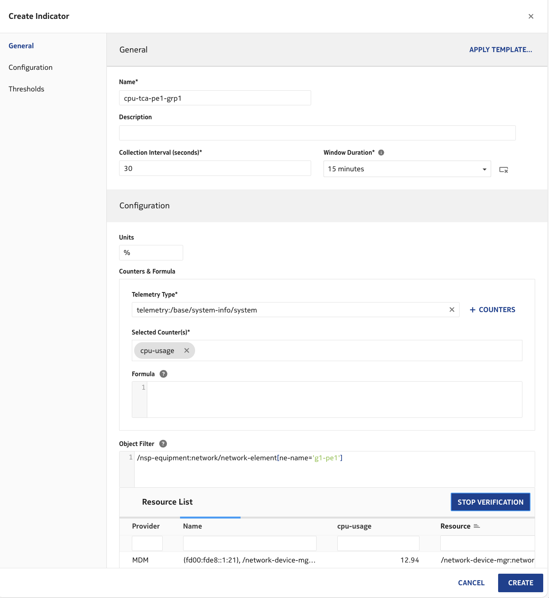
///
/// tab | Create Threshold
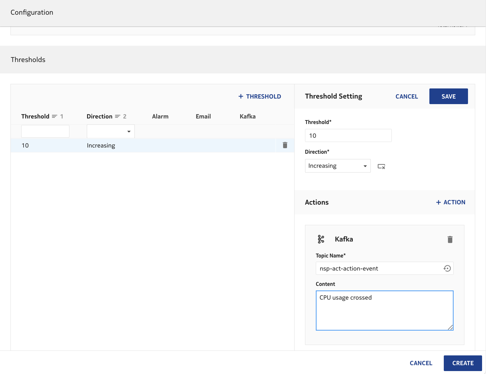
///
///

### Trigger a Threshold Event

One way to increase CPU usage is to run **rapid pings** between two nodes. Both the node sending pings and the node responding will experience higher CPU load. You may also use any other method that reliably increases CPU usage.

/// details | Rapid Ping Hint
    type: success
You can generate CPU load directly from the SR OS CLI using the command below to run rapid pings. Make sure to adjust the target IP address as needed. The actual CPU impact depends on the test parameters provided (count, interval, size).

The example below runs a ping test from pe1 to p1, lasting about 60 seconds and using an interface IP address as the destination. Since interface addresses are identical across all groups, you can simply copy and paste the command on your system to quickly generate additional CPU load through rapid pings.

```
[/]
A:admin@g1-pe1# ping 10.64.11.0 router-instance Base count 6000 interval 0.01 size 1400 output-format summary 
PING 10.64.11.0 1400 data bytes
!!!!!!!!!!!!!!!!!!!!!!!!!!!!!!!!!!!!!!!!!!!!!!!!!!!!!!!!!!!!!!!!!!!!!!!!!!!!!!!!!!!!!!!!!!!!!!!!!!!!!!!!!!!!!!!!!!!!!!!!!!!!!!!!!!!!!!!!!!!!!!!!!!!!!!!!!!!!!!!!!!!!!!!!!!!!!!!!!!!!!!!!!!!!!!!!!!!!!!!!!!!!!!!!!!!!!!!!!!!!!!!!!!!!!!!!!!!!!!!!!!!!!!!!!!!!!!!!!!!!!!!!!!!!!!!!!!!!!!!!!!!!!!!!!!!!!!!!!!!!!!!!!!!!!!!!!!!!!!!!!!!!!!!!!!!!!!!!!!!!!!!!!!!!!!!!!!!!!!!!!!!!!!!!!!!!!!!!!!!!!!!!!!!!!!!!!!!!!!!!!!!!!!!!!!!!!!!!!!!!!!!!!!!!!!!!!!!!!!!!!!!!!!!!!!!!!!!!!!!!!!!!!!!!!!!!!!!!!!!!!!!!!!!!!!!!!!!!!!!!!!!!!!!!!!!!!!!!!!!!!!!!!!!!!!!!!!!!!!!!!!!!!!!!!!!!!!!!!!!!!!!!!!!!!!!!!!!!!!!!!!!!!!!!!!!!!!!!!!!!!!!!!!!!!!!!!!!!!!!!!!!!!!!!!!!!!!!!!!!!!!!!!!!!!!!!!!!!!!!!!!!!!!!!!!!!!!!!!!!!!!!!!!!!!!!!!!!!!!!!!!!!!!!!!!!!!!!!!!!!!!!!!!!!!!!!!!!!!!!!!!!!!!!!!!!!!!!!!!!!!!!!!!!!!!!!!!!!!!!!!!!!!!!!!!!!!!!!!!!!!!!!!!!!!!!!!!!!!!!!!!!!!!!!!!!!!!!!!!!!!!!!!!!!!!!!!!!!!!!!!!!!!!!!!!!!!!!!!!!!!!!!!!!!!!!!!!!!!!!!!!!!!!!!!!!!!!!!!!!!!!!!!!!!!!!!!!!!!!!!!!!!!!!!!!!!!!!!!!!!!!!!!!!!!!!!!!!!!!!!!!!!!!!!!!!!!!!!!!!!!!!!!!!!!!!!!!!!!!!!!!!!!!!!!!!!!!!!!!!!!!!!!!!!!!!!!!!!!!!!!!!!!!!!!!!!!!!!!!!!!!!!!!!!!!!!!!!!!!!!!!!!!!!!!!!!!!!!!!!!!!!!!!!!!!!!!!!!!!!!!!!!!!!!!!!!!!!!!!!!!!!!!!!!!!!!!!!!!!!!!!!!!!!!!!!!!!!!!!!!!!!!!!!!!!!!!!!!!!!!!!!!!!!!!!!!!!!!!!!!!!!!!!!!!!!!!!!!!!!!!!!!!!!!!!!!!!!!!!!!!!!!!!!!!!!!!!!!!!!!!!!!!!!!!!!!!!!!!!!!!!!!!!!!!!!!!!!!!!!!!!!!!!!!!!!!!!!!!!!!!!!!!!!!!!!!!!!!!!!!!!!!!!!!!!!!!!!!!!!!!!!!!!!!!!!!!!!!!!!!!!!!!!!!!!!!!!!!!!!!!!!!!!!!!!!!!!!!!!!!!!!!!!!!!!!!!!!!!!!!!!!!!!!!!!!!!!!!!!!!!!!!!!!!!!!!!!!!!!!!!!!!!!!!!!!!!!!!!!!!!!!!!!!!!!!!!!!!!!!!!!!!!!!!!!!!!!!!!!!!!!!!!!!!!!!!!!!!!!!!!!!!!!!!!!!!!!!!!!!!!!!!!!!!!!!!!!!!!!!!!!!!!!!!!!!!!!!!!!!!!!!!!!!!!!!!!!!!!!!!!!!!!!!!!!!!!!!!!!!!!!!!!!!!!!!!!!!!!!!!!!!!!!!!!!!!!!!!!!!!!!!!!!!!!!!!!!!!!!!!!!!!!!!!!!!!!!!!!!!!!!!!!!!!!!!!!!!!!!!!!!!!!!!!!!!!!!!!!!!!!!!!!!!!!!!!!!!!!!!!!!!!!!!!!!!!!!!!!!!!!!!!!!!!!!!!!!!!!!!!!!!!!!!!!!!!!!!!!!!!!!!!!!!!!!!!!!!!!!!!!!!!!!!!!!!!!!!!!!!!!!!!!!!!!!!!!!!!!!!!!!!!!!!!!!!!!!!!!!!!!!!!!!!!!!!!!!!!!!!!!!!!!!!!!!!!!!!!!!!!!!!!!!!!!!!!!!!!!!!!!!!!!!!!!!!!!!!!!!!!!!!!!!!!!!!!!!!!!!!!!!!!!!!!!!!!!!!!!!!!!!!!!!!!!!!!!!!!!!!!!!!!!!!!!!!!!!!!!!!!!!!!!!!!!!!!!!!!!!!!!!!!!!!!!!!!!!!!!!!!!!!!!!!!!!!!!!!!!!!!!!!!!!!!!!!!!!!!!!!!!!!!!!!!!!!!!!!!!!!!!!!!!!!!!!!!!!!!!!!!!!!!!!!!!!!!!!!!!!!!!!!!!!!!!!!!!!!!!!!!!!!!!!!!!!!!!!!!!!!!!!!!!!!!!!!!!!!!!!!!!!!!!!!!!!!!!!!!!!!!!!!!!!!!!!!!!!!!!!!!!!!!!!!!!!!!!!!!!!!!!!!!!!!!!!!!!!!!!!!!!!!!!!!!!!!!!!!!!!!!!!!!!!!!!!!!!!!!!!!!!!!!!!!!!!!!!!!!!!!!!!!!!!!!!!!!!!!!!!!!!!!!!!!!!!!!!!!!!!!!!!!!!!!!!!!!!!!!!!!!!!!!!!!!!!!!!!!!!!!!!!!!!!!!!!!!!!!!!!!!!!!!!!!!!!!!!!!!!!!!!!!!!!!!!!!!!!!!!!!!!!!!!!!!!!!!!!!!!!!!!!!!!!!!!!!!!!!!!!!!!!!!!!!!!!!!!!!!!!!!!!!!!!!!!!!!!!!!!!!!!!!!!!!!!!!!!!!!!!!!!!!!!!!!!!!!!!!!!!!!!!!!!!!!!!!!!!!!!!!!!!!!!!!!!!!!!!!!!!!!!!!!!!!!!!!!!!!!!!!!!!!!!!!!!!!!!!!!!!!!!!!!!!!!!!!!!!!!!!!!!!!!!!!!!!!!!!!!!!!!!!!!!!!!!!!!!!!!!!!!!!!!!!!!!!!!!!!!!!!!!!!!!!!!!!!!!!!!!!!!!!!!!!!!!!!!!!!!!!!!!!!!!!!!!!!!!!!!!!!!!!!!!!!!!!!!!!!!!!!!!!!!!!!!!!!!!!!!!!!!!!!!!!!!!!!!!!!!!!!!!!!!!!!!!!!!!!!!!!!!!!!!!!!!!!!!!!!!!!!!!!!!!!!!!!!!!!!!!!!!!!!!!!!!!!!!!!!!!!!!!!!!!!!!!!!!!!!!!!!!!!!!!!!!!!!!!!!!!!!!!!!!!!!!!!!!!!!!!!!!!!!!!!!!!!!!!!!!!!!!!!!!!!!!!!!!!!!!!!!!!!!!!!!!!!!!!!!!!!!!!!!!!!!!!!!!!!!!!!!!!!!!!!!!!!!!!!!!!!!!!!!!!!!!!!!!!!!!!!!!!!!!!!!!!!!!!!!!!!!!!!!!!!!!!!!!!!!!!!!!!!!!!!!!!!!!!!!!!!!!!!!!!!!!!!!!!!!!!!!!!!!!!!!!!!!!!!!!!!!!!!!!!!!!!!!!!!!!!!!!!!!!!!!!!!!!!!!!!!!!!!!!!!!!!!!!!!!!!!!!!!!!!!!!!!!!!!!!!!!!!!!!!!!!!!!!!!!!!!!!!!!!!!!!!!!!!!!!!!!!!!!!!!!!!!!!!!!!!!!!!!!!!!!!!!!!!!!!!!!!!!!!!!!!!!!!!!!!!!!!!!!!!!!!!!!!!!!!!!!!!!!!!!!!!!!!!!!!!!!!!!!!!!!!!!!!!!!!!!!!!!!!!!!!!!!!!!!!!!!!!!!!!!!!!!!!!!!!!!!!!!!!!!!!!!!!!!!!!!!!!!!!!!!!!!!!!!!!!!!!!!!!!!!!!!!!!!!!!!!!!!!!!!!!!!!!!!!!!!!!!!!!!!!!!!!!!!!!!!!!!!!!!!!!!!!!!!!!!!!!!!!!!!!!!!!!!!!!!!!!!!!!!!!!!!!!!!!!!!!!!!!!!!!!!!!!!!!!!!!!!!!!!!!!!!!!!!!!!!!!!!!!!!!!!!!!!!!!!!!!!!!!!!!!!!!!!!!!!!!!!!!!!!!!!!!!!!!!!!!!!!!!!!!!!!!!!!!!!!!!!!!!!!!!!!!!!!!!!!!!!!!!!!!!!!!!!!!!!!!!!!!!!!!!!!!!!!!!!!!!!!!!!!!!!!!!!!!!!!!!!!!!!!!!!!!!!!!!!!!!!!!!!!!!!!!!!!!!!!!!!!!!!!!!!!!!!!!!!!!!!!!!!!!!!!!!!!!!!!!!!!!!!!!!!!!!!!!!!!!!!!!!!!!!!!!!!!!!!!!!!!!!!!!!!!!!!!!!!!!!!!!!!!!!!!!!!!!!!!!!!!!!!!!!!!!!!!!!!!!!!!!!!!!!!!!!!!!!!!!!!!!!!!!!!!!!!!!!!!!!!!!!!!!!!!!!!!!!!!!!!!!!!!!!!!!!!!!!!!!!!!!!!!!!!!!!!!!!!!!!!!!!!!!!!!!!!!!!!!!!!!!!!!!!!!!!!!!!!!!!!!!!!!!!!!!!!!!!!!!!!!!!!!!!!!!!!!!!!!!!!!!!!!!!!!!!!!!!!!!!!!!!!!!!!!!!!!!!!!!!!!!!!!!!!!!!!!!!!!!!!!!!!!!!!!!!!!!!!!!!!!!!!!!!!!!!!!!!!!!!!!!!!!!!!!!!!!!!!!!!!!!!!!!!!!!!!!!!!!!!!!!!!!!!!!!!!!!!!!!!!!!!!!!!!!!!!!!!!!!!!!!!!!!!!!!!!!!!!!!!!!!!!!!!!!!!!!!!!!!!!!!!!!!!!!!!!!!!!!!!!!!!!!!!!!!!!!!!!!!!!!!!!!!!!!!!!!!!!!!!!!!!!!!!!!!!!!!!!!!!!!!!!!!!!!!!!!!!!!!!!!!!!!!!!!!!!!!!!!!!!!!!!!!!!!!!!!!!!!!!!!!!!!!!!!!!!!!!!!!!!!!!!!!!!!!!!!!!!!!!!!!!!!!!!!!!!!!!!!!!!!!!!!!!!!!!!!!!!!!!!!!!!!!!!!!!!!!!!!!!!!!!!!!!!!!!!!!!!!!!!!!!!!!!!!!!!!!!!!!!!!!!!!!!!!!!!!!!!!!!!!!!!!!!!!!!!!!!!!!!!!!!!!!!!!!!!!!!!!!!!!!!!!!!!!!!!!!!!!!!!!!!!!!!!!!!!!!!!!!!!!!!!!!!!!!!!!!!!!!!!!!!!!!!!!!!!!!!!!!!!!!!!!!!!!!!!!!!!!!!!!!!!!!!!!!!!!!!!!!!!!!!!!!!!!!!!!!!!!!!!!!!!!!!!!!!!!!!!!!!!!!!!!!!!!!!!!!!!!!!!!!!!!!!!!!!!!!!!!!!!!!!!!!!!!!!!!!!!!!!!!!!!!!!!!!!!!!!!!!!!!!!!!!!!!!!!!!!!!!!!!!!!!!!!!!!!!!!!!!!!!!!!!!!!!!!!!!!!!!!!!!!!!!!!!!!!!!!!!!!!!!!!!!!!!!!!!!!!!!!!!!!!!!!!!!!!!!!!!!!!!!!!!!!!!!!!!!!!!!!!!!!!!!!!!!!!!!!!!!!!!!!!!!!!!!!!!!!!!!!!!!!!!!!!!!!!!!!!!!!!!!!!!!!!!!!!!!!!!!!!!!!!!!!!!!!!!!!!!!!!!!!!!!!!!!!!!!!!!!!!!!!!!!!!!!!!!!!!!!!!!!!!!!!!!!!!!!!!!!!!!!!!!!!!!!!!!!!!!!!!!!!!!!!!!!!!!!!!!!!!!!!!!!!!!!!!!!!!!!!!!!!!!!!!!!!!!!!!!!!!!!!!!!!!!!!!!!!!!!!!!!!!!!!!!!!!!!!!!!!!!!!!!!!!!!!!!!!!!!!!!!!!!!!!!!!!!!!!!!!!!!!!!!!!!!!!!!!!!!!!!!!!!!!!!!!!!!!!!!!!!!!!!!!!!!!!!!!!!!!!!!!!!!!!!!!!!!!!!!!!!!!!!!!!!!!!!!!!!!!!!!!!!!!!!!!!!!!!!!!!!!!!!!!!!!!!!!!!!!!!!!!!!!!!!!!!!!!!!!!!!!!!!!!!!!!!!!!!!!!!!!!!!!!!!!!!!!!!!!!!!!!!!!!!!!!!!!!!!!!!!!!!!!!!!!!!!!!!!!!!!!!!!!!!!!!!!!!!!!!!!!!!!!!!!!!!!!!!!!!!!!!!!!!!!!!!!!!!!!!!!!!!!!!!!!!!!!!!!!!!!!!!!!!!!!!!!!!!!!!!!!!!!!!!!!!!!!!!!!!
---- 10.64.11.0 PING Statistics ----
6000 packets transmitted, 6000 packets received, 0.00% packet loss
round-trip min = 1.56ms, avg = 4.64ms, max = 60.7ms, stddev = 4.10ms
```
///

### Visualize your Indicator

Now that your telemetry stream and thresholds are active, follow these steps:

* Open `Data Collection and Analysis Visualizations`
* Select your resource(s)
* `PLOT` your resource(s)

/// note
The Indicator Visualization can directly be opened from Indicator Management. Check the context menu (3 dots) of the Indicator entry you've created.

The threshold will be shown as a red line on the graph.
///

/// details | Step-by-Step (if getting stuck)
    type: success
/// tab | 01 Navigation
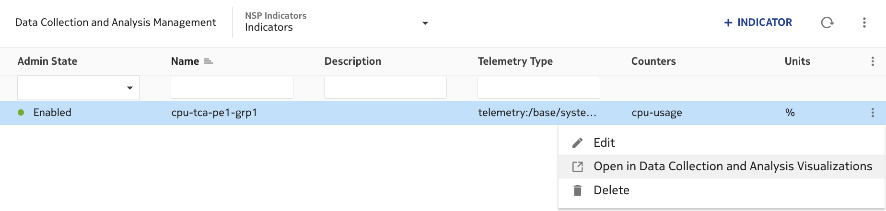
///
/// tab | 02 Resource Selection
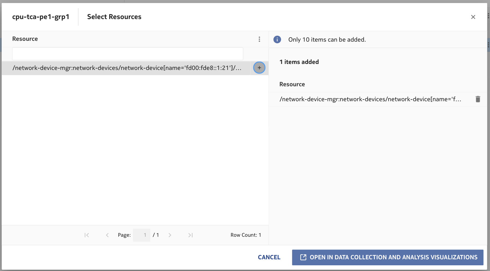
///
/// tab | 03 Plot Config
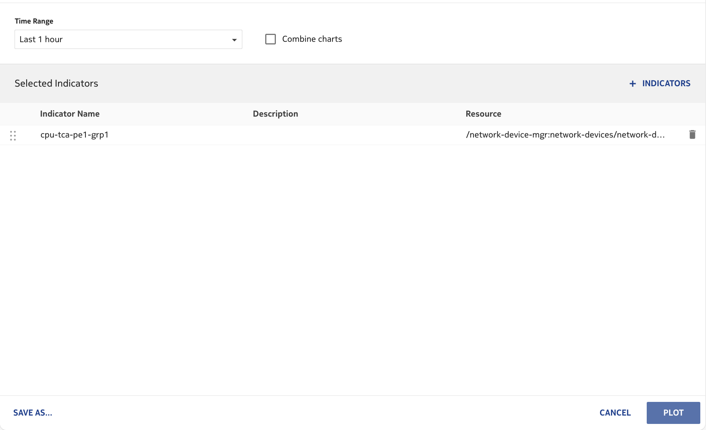
///
/// tab | 04 Output Graph
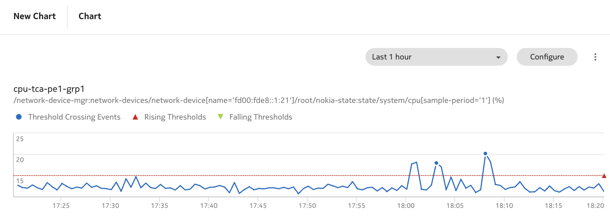
///
///

Once the threshold is crossed, a Kafka message is published.

/// details | Kafka Message Example
```json
{
  "ietf-restconf:notification": {
    "nsp-act:action-event": {
      "type": "Threshold-Crossing",
      "rule": "ind_threshold_6f4bda9e_3f04_4a46_ae44_79b5fdf6cd07",
      "process": "cpu-tca-pe1-grp1_15_increasing",
      "source": {
        "neName": "fd00:fde8::1:21",
        "name": "cpu-tca-pe1-grp1",
        "neId": "fd00:fde8::1:21",
        "networkDeviceId": "/network-device-mgr:network-devices/network-device[name='fd00:fde8::1:21']/root/nokia-state:state/system/cpu[sample-period='1']",
        "eventTime": "2025-08-21T22:08:06Z"
      },
      "payload": {
        "thresholdName": "cpu-tca-pe1-grp1_15_increasing",
        "direction": "RISING",
        "threshold": "15",
        "value": "20.1500"
      },
      "content": "CPU usage crossed",
      "timestamp": "2025-08-21T22:08:08.869Z"
    },
    "eventTime": "2025-08-21T22:08:08.869Z"
  }
}
```
///

By consuming those Kafka notifications, we can implement closed-loop automation using workflows, which will be explored next.

### Create a workflow to consume the Kafka event

To visualize the Kafka event, lets create a simple workflow that gets executed when the target Kafka event gets created. First open the Workflow Manager WebUI by clicking on `Workflows` under section `PROGRAMMING` in the Hamburger Menu. Now list the `Workflows` in the drop-down menu. Click on `+ WORKFLOW` to create the new workflow:

/// details | Help (if getting stuck)
     type: success
/// tab | Open Workflow Manager
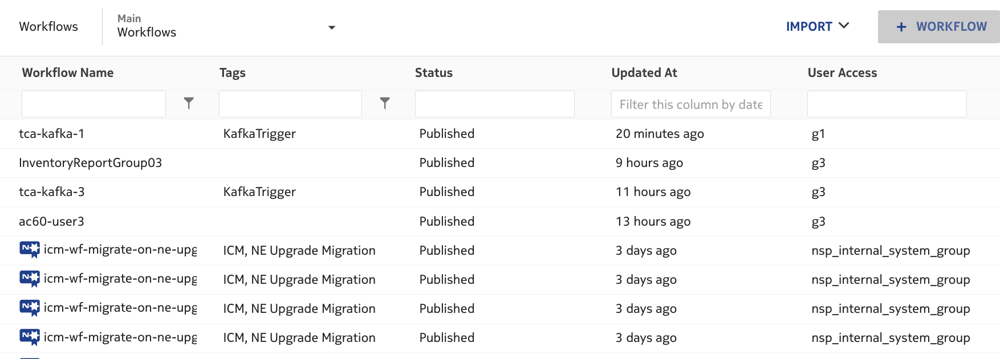
///
/// tab | Create a new Workflow
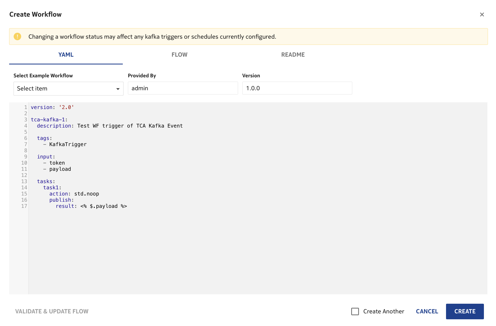
///
/// tab | Workflow Definition
```yaml
version: '2.0'

tca-kafka-<Group-ID>:
  description: Test WF trigger of TCA Kafka Event

  tags:
    - KafkaTrigger

  input:
    - token
    - payload

  tasks:
    task1:
      action: std.noop   
      publish:
        result: <% $.payload %>
```
///

* The tag `KafkaTrigger` in the workflow definition is mandatory to associate it with Kafka events.
* Workflows associated to a Kafka event must have `token` and `payload` as inputs in its definition.
* Replace `Group-Id` with your assigned group. This is required to make the workflow name unique. For example, if you are in group 17, use `tca-kafka-17`
* Before you save the new workflow, you first must click on `VALIDATE & UPDATE FLOW`. Once if is successfully validated, you can click on `CREATE` to save it.
* New workflows are created in status `Draft`. To execute the workflow it must be set to `Published` first.
///

### Associate Kafka events to your Workflow

In the Workflow Manager WebUI navigate to `Kafka Triggers`.

To create a new association, click on `+ KAFKA TRIGGER` on the top right of your screen.
Use the following information to fill in the required forms:

```yaml
Workflow: tca-kafka-<Group-ID> (unchanged)
Edit Format: FORM (unchanged)
Kafka Topic: nsp-act-action-event
Trigger Name: match-on-cpu-tca-pe1-grp1 (update to match your group)
Trigger Rule: $[?( @.data['ietf-restconf:notification']['nsp-act:action-event'].source.name == 'cpu-tca-pe1-grp1' )] (update to match your group)
Kafka Event: JSON
Enabled: True
Limit per Minute: 10 (unchanged)
```

/// note
- Trigger Rule syntax is based on [JsonPath](https://github.com/json-path/JsonPath).
- Replace `Group-Id` with your assigned group. This his needed to make the trigger name unique. For example, if you are in group 17, use `match-on-neId-17`. It's also required to reference the workflow you've created in the previous step, like `tca-kafka-17` in case of group 17.
- Replace `NE-ID` with the system loopback IP-address of the target network element to be monitored.
///

### Validate Automated Workflow Execution

When a trigger rule matches an event, the `Times Matched` and `Times Executed` columns are updated automatically. After execution completes, you can navigate to the Workflow Execution page to view the output.

/// tab | Check Kafka Trigger
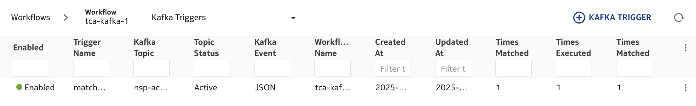
///
/// tab | Execution
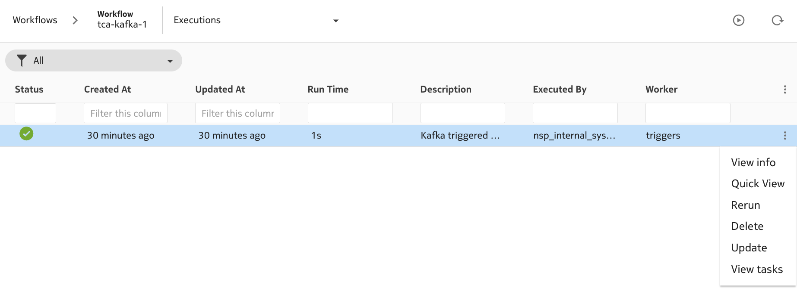
///
/// tab | Execution Details
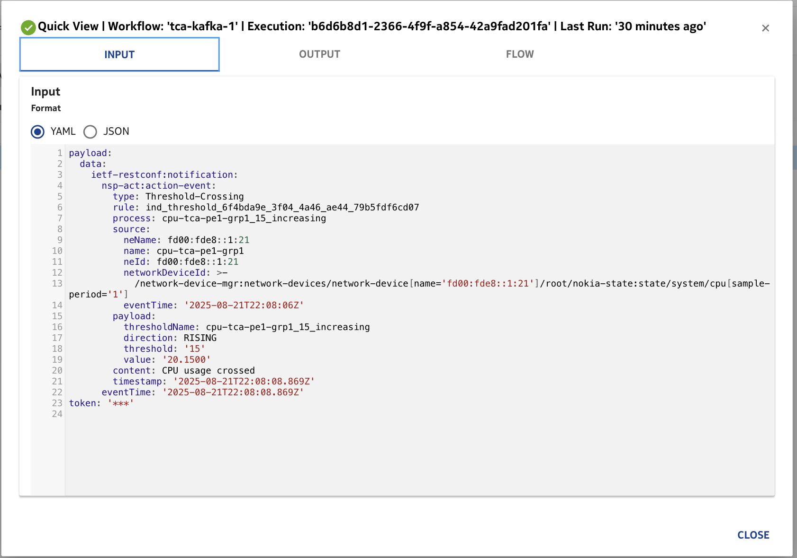
///

## Summary

Congratulations! You have completed this activity. Take a moment to review what you have achieved:

* Configure Threshold Crossing Alerts (TCA) on system metrics.
* Create model-driven telemetry subscriptions using gNMI and YANG paths.
* Apply object filters to target specific network elements.
* Trigger Kafka-based actions on threshold events.
* Visualize telemetry time series to observe performance trends.

While the configuration may seem straightforward, this activity covered the essential telemetry workflow to collect, sense, and act on real-time network data. These are foundational capabilities for building robust observability pipelines.

---

## Next steps

Here are some suggestions on how to continue:

* Run the [Baseline Analytics](../beginner/69-nsp-baseline-analytics.md) activity and understand the differences between Indicators and Baselines.
* Extend monitoring beyond CPU to include interface, memory, or protocol KPIs.
* Explore workflows for closed-loop automation using telemetry triggers.