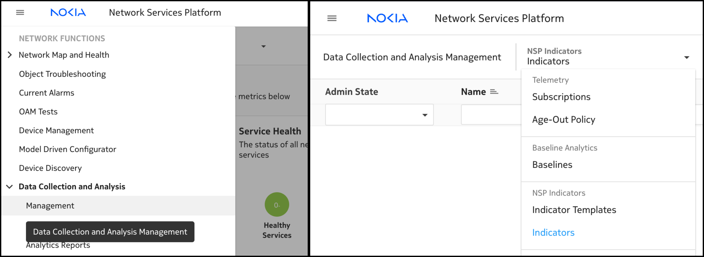
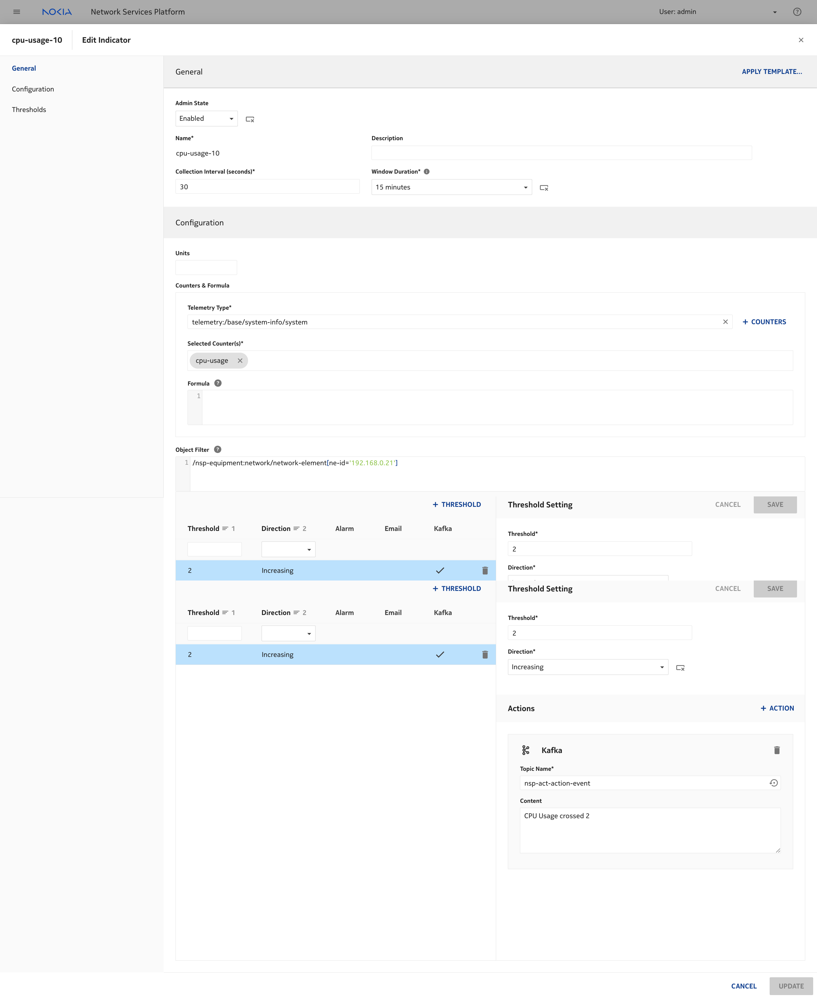
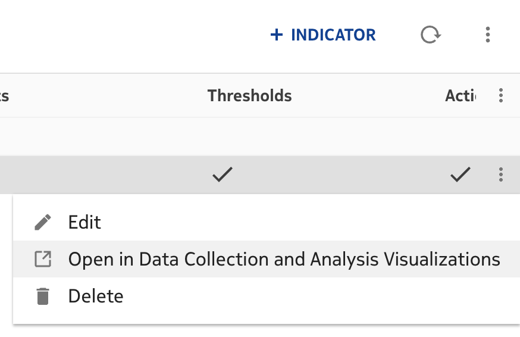
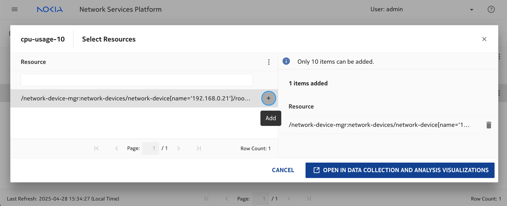
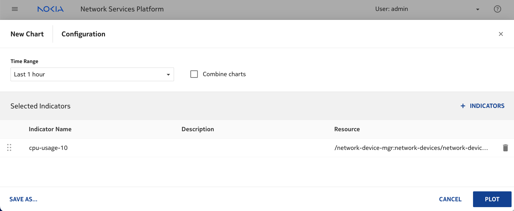
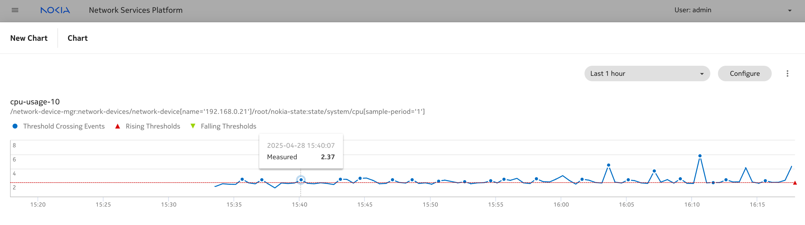
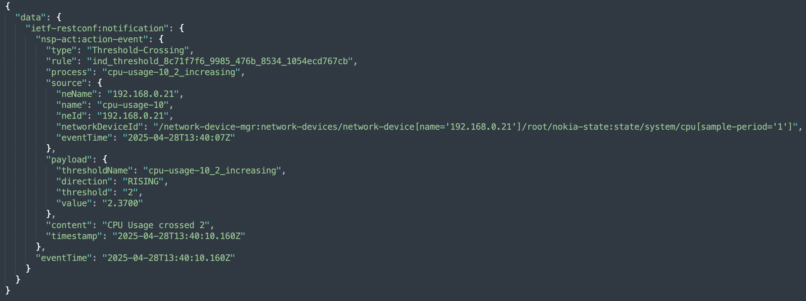

---
tags:
  - NSP
  - MD-CLI
  - Telemetry
  - Kafka
--- 

# Indicators Analytics

|     |     |
| --- | --- |
| **Activity name** | Indicators Analytics |
| **Activity ID** | 68 |
| **Short Description** | Explore NSP UI on creating Threshold Crossing Alarms (TCA) using NSP CN Telemetry |
| **Difficulty** | Beginner |
| **Tools used** |  |
| **Topology Nodes** | all SR OS and SRLinux nodes |
| **References** |  |

## Objective

Explore NSP Data Collection App to create TCA on CPU usage and visualize the threshold crossing in NSP Data Collection Viewer.

## Technology explanation

### Model-driven XPATH

When navigating the NE CLI paths, for SR OS `pwc json-instance-path` gives you the working context for defining the telemetry subscription object filter.

## Tasks

**You should read these tasks from top-to-bottom before beginning the activity.**

It is tempting to skip ahead but tasks may require you to have completed previous tasks before tackling them.  

### Navigate into Indicators UI from the Data Collection App

Once you have logged into NSP, navigate into Indicators from the Data Collection App.

/// details | Indicators UI

///

### Create an NSP Indicator

1. Name: cpu-tca-[grpId]
2. Collection Interval: `30 secs`
3. Window Duration: `15 mins`
4. Telemetry Type: `telemetry:/base/system-info/system`
5. Selected Counters: `cpu-usage`
6. Object Filter: `/nsp-equipment:network/network-element[ne-id='<<ne-id>>']`
7. Threshold:
    1. Threshold: `2`
    2. Direction:  `Increasing`
    3. Actions:
        - Topic Name: `nsp-act-action-event`
        - Content: `CPU Usage crossed 2`
    4. Click Save

/// note

The indicator subscription is specific to an individual network element.
Please select an `ne-id` that belongs to the network elements of your group.
///

/// details | Sample Indicator Definition
    type: success

///

### Increasing CPU Usage

One possible means of increasing the CPU usage is by performing a rapid-ping to the node or a config push.
This isn't the only way to increase CPU usage. If you have a method that works, feel free to perform it.

Now that we have increased the CPU usage, lets see how to visualize the Telemetry Collection.

### Visualize Telemetry Collection

In order to visualize the collection, there are a few stages of definition to reach it.

1. Initiate the Viewer
2. Select the resource to visualize the collection
3. Define additional plotter configs like time range
4. Plotter is initialised

/// note

The threshold is displayed as a red line on the Plotter to visualize the configured limit.
Keep in mind that a threshold alert will only be triggered on the first increase after the threshold is set.
If the most recent value was already above the threshold at the time of configuration, this will not trigger an alert.
///

/// tab | 01 Telemetry Viewer Navigation

///
/// tab | 02 Resource Selection to Plot

///
/// tab | 03 Define Plotter Config

///
/// tab | 04 Plotter View

///

### nsp-act-action-event Notification

If you are looking to visualize how a Kafka JSON notification would look like, below shows a sample message.

/// details | Sample Kafka Notification
    type: success

///

## Summary and review

Congratulations!  If you have got this far you have completed this activity and achieved the following:

- You have learnt how to create Threshold crossing alerts
- You have learnt how to create Telemetry subscriptions
- You have learnt to build object filters
- You have learnt on possible actions that can be taken once a threshold is crossed

This sure is an achievement! Well done!

If you're hungry for more feel free to explore the same activity for an SRL node.
