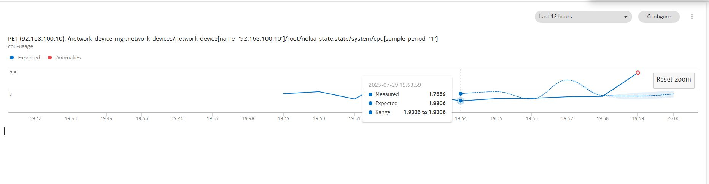

---
tags:
  - NSP
  - MD-CLI
  - Analytics
  - Telemetry
---

# Baseline Analytics

|     |     |
| --- | --- |
| **Activity name** | Baseline Analytics |
| **Activity ID** | 69 |
| **Short Description** | Anomaly detection using historical telemetry data and Z-Score analysis |
| **Difficulty** | Beginner |
| **Tools used** | NSP |
| **Topology Nodes** | :material-router: pe1, :material-router: agg1 |
| **References** | [NSP Baseline Analytics](https://documentation.nokia.com/nsp/24-8/NSP_Data_Collection_and_Analysis_Guide/dca_baselines.html) |

## Objective

In large networks, operators must keep critical device and service metrics under control — such as link utilization, memory usage, or temperature. The challenge is that these metrics rarely stay constant:

* Traffic naturally peaks during business hours and drops at night.
* CPU or memory load may vary with planned maintenance windows.
* Temperature follows device, environmental and seasonal patterns.

Traditionally, operators define static thresholds (e.g., CPU > 80%, link utilization > 70%). But static thresholds don’t reflect real behavior. They are often too strict (raising false alarms every Monday morning when traffic ramps up) or too loose (missing actual anomalies).

The alternative — manually adjusting thresholds for every device, per metric, per time-of-day or day-of-week — is not scalable. It requires constant human monitoring, is prone to error, and becomes unmanageable at scale when networks contain thousands of nodes.

Baseline Analytics solves this problem. By automatically learning normal patterns from historical telemetry, NSP builds dynamic, seasonal baselines. These baselines adapt to daily or weekly variations and automatically adjust thresholds without manual intervention. Operators are then alerted only when behavior truly deviates from the norm — e.g., if traffic stays unusually high late at night, or if a router’s temperature spikes outside its usual profile.

In this activity you will take some initial steps into the world of Baseline Analytics with NSP.

## Technology Explanation

### Baseline Training with Dynamic Updates
NSP looks at historical telemetry to learn what normal looks like for each metric. For example, it can learn that interface utilization is always high on Monday mornings but drops on weekends. This means thresholds do not need to be manually adjusted.

Baselines are not static. As new telemetry is collected, NSP updates the baseline so that it stays aligned with current trends. This prevents outdated thresholds from generating false alarms.

### Windowing
Once you create a baseline, statistics for a selected resource (or group of resources) are collected over a defined time window. Data is typically gathered at shorter collection intervals, but all values collected within the window are aggregated into a single data point for the baseline. Each window then has its own expected value based on historical data, making it easier to compare measurements against what is typical for that time period.

### Metric Aggregation

Different metric types are aggregated differently when building baselines:

* **Counters** — cumulative values measured over a window (example: octets transmitted)
* **Gauges** — snapshot values that can go up or down (example: CPU load in percent)
* **Samples** — discrete points measured (example: latency measured periodically)

### Seasonality
Metrics often follow recurring time-based patterns. For example:

* **Daily season** — traffic rises every weekday around 9am and drops overnight
* **Weekly season** — weekends often show lower traffic compared to weekdays

A season defines the length of the repeating cycle used for training the baseline (e.g., 24 hours). The baseline learns expected values within that cycle, so it can account for recurring variations.

Typically, you configure the longest relevant season (e.g., 1 week if weekday vs. weekend differences matter). Keep in mind that longer seasons require more time to collect enough data before the baseline becomes reliable.

### Z-Score
A Z-Score is a statistical way to measure how far a value is from the expected average, expressed in units of standard deviation. Using Z-Score allows NSP to detect unusual events automatically, without operators having to guess or configure thresholds manually.

* A Z-Score of **0** means the value is exactly as expected.
* A Z-Score of **+3** means the value is three standard deviations above normal (a rare event, often flagged as an anomaly).

### Anomaly Detection
By comparing the current metric value to the expected baseline using the Z-Score, NSP can highlight anomalies. These are shown visually in the WebUI (red dots vs dotted baseline) and can trigger alerts for operator action.

## Tasks

**You should read these tasks from top-to-bottom before beginning the activity.**

It is tempting to skip ahead but tasks may require you to have completed previous tasks before tackling them.  

### Create a new Baseline for PE1 (SR OS)

Login to NSP WebUI and navigate to `Data Collection and Analysis Management` and then `Baselines`.

/// details | Step-by-Step (if getting stuck)
     type: success
/// tab | 01 NSP Home Nav

///
/// tab | 02 Data Collection Nav

///
/// tab | 03 Management tab

///
/// tab | 04 Baseline Tab

///
///

Now, click on `+ BASELINE` on the top right of your screen to create a baseline on your `pe1` node. Use the following information to fill in the required form:

```yaml
General:
  Collection Interval: 30 secs
  Season: 5 mins
  Window Duration: 1 min
Filter And Counters:
  Object Filter: /nsp-equipment:network/network-element[ne-name='g1-pe1']       (update to match your group)
  Telemetry Type: telemetry:/base/system-info/system
  Selected Counters: cpu-usage (Gauge)
Detector:
  Algorithm: Z-Score Absolute
  Comparison: Less than
  Threshold: 2
```

/// details | Help (if getting stuck)
     type: success
* Replace `g1-pe1` to match the system-name of the `pe1` node in your system. Like if you are in group 17, it becomes `g17-pe1`.
* The baseline name is auto generated and cannot be set during creation.
* After you filled in the form click on `VERIFY RESOURCES`. It may take a bit of time to list the desired counter. Once you see your resource, click on `STOP VERIFICATION`, select the resource to be monitored, and confirm by clicking on `CREATE`.
* Edit the baseline created: Add a detector with the information provided above.

/// tab | 01 Baseline Definition

///
/// tab | 02 Algorithm Definition

///
///

### Create a new Baseline for AGG1 (SRLinux)

In the previous task, you created a baseline for SR OS. Now, to gain more hands-on experience, create another subscription using an SRLinux node. This time, let’s focus on interface statistics. Port `ethernet-1/1` on node `agg1` is operational and carries some control-plane traffic, making it a good candidate for monitoring. If you choose raw counters such as received or transmitted octets, make sure to set the `Type` to `Counter`.

/// details | Solution (if getting stuck)
     type: success
```yaml
General:
  Collection Interval: 30 secs
  Season: 5 mins
  Window Duration: 1 min
Filter And Counters:
  Object Filter: /nsp-equipment:network/network-element[ne-name='g1-agg1']       (update to match your group)
  Telemetry Type: telemetry:/base/interfaces/interface
  Selected Counters: received-octets (Counter)
Detector:
  Algorithm: Z-Score Absolute
  Comparison: Less than
  Threshold: 3
```

As in the previous task, after clicking `VERIFY RESOURCES` it takes about 30 seconds to populate the list of available interface resources. Once the list appears, stop verification, select interface `ethernet-1/1`, and proceed to create the baseline.
///

With these two baselines — CPU for SR OS and interface statistics for SR Linux — you now have vendor-agnostic metrics that provide a consistent, normalized view across device families and vendors. This makes it easy to work seamlessly across different platforms.

### Check the Telemetry subscription

Login into the SR OS node you are monitoring and check the active telemetry subscriptions from CLI.

/// admonition | Do you spot the corresponding gRPC subscription?
    type: question
The corresponding subscription is retrieving CPU usage stats at a 30sec interval.
///

/// details | gRPC Subscription Checking Hint
    type: success
/// tab | List Active Subscriptions Command
```
[/]
A:admin@g1-pe1# show system telemetry grpc subscription
```
///
/// tab | Example Output of Subscriptions
```
===============================================================================
Telemetry gRPC subscriptions
===============================================================================
Id            User                             Mode                       Port
  Destination                                                                 
-------------------------------------------------------------------------------
1             admin                            stream                    58876
     172.31.255.29
2             admin                            stream                    58876
     172.31.255.29
3             admin                            stream                    58876
     172.31.255.29
4             admin                            stream                    58876
     172.31.255.29
5             admin                            stream                    58876
     172.31.255.29
6             admin                            stream                    58876
     172.31.255.29
7             admin                            stream                    58876
     172.31.255.29
13            admin                            stream                    43182
     172.31.255.29
14            admin                            stream                    43182
     172.31.255.29
15            admin                            stream                    43182
     172.31.255.29
16            admin                            stream                    43182
     172.31.255.29
17            admin                            stream                    43182
     172.31.255.29
19            admin                            stream                    45599
     172.31.255.29
23            admin                            stream                    45599
     172.31.255.29
-------------------------------------------------------------------------------
No. of gRPC Telemetry subscriptions: 14
===============================================================================
```
///
/// tab | Get Subscribed Paths Command
The corresponding SR OS CLI command requires the subscription-id to be provided. You may need to check the corresponding subscriptions one after another to identify the correct one. As you've just added the new subscription, most likely it is the last one in the list. However, it is a good learning to check some of the listed subscriptions to better understand the structure.

```
[/]
A:admin@g1-pe1# show system telemetry grpc subscription 23 paths
```
///
/// tab | Example Output of Subscribed Paths
```
===============================================================================
Telemetry gRPC subscription
===============================================================================
Subscription id       : 23
User                  : admin
Destination           : 172.31.255.29
Port                  : 45599
Subscription mode     : stream
Encoding              : json
Notification count    : 2428
Context count         : 2428
Notification bundling : Disabled

Extensions
-------------------------------------------------------------------------------
Config-Subscription   : Disabled

-------------------------------------------------------------------------------
Paths
-------------------------------------------------------------------------------
Path                  : /state/system/cpu[sample-period=1]/summary/usage/cpu-
                        usage
Path mode             : sample
Sample interval       : 30000 ms
Finished samples      : 2428
Deferred samples      : 0
Total collection time : 2428 ms
Min collection time   : 1 ms
Avg collection time   : 1 ms
Max collection time   : 1 ms
-------------------------------------------------------------------------------
No. of paths          : 1
===============================================================================
```
///
///

/// details | Pro Tip
    type: tip
To check your SR Linux node for active subscriptions, you first need to enter `state` mode.

```
--{ + running }--[  ]--
A:g1-agg1# enter state

--{ + state }--[  ]--
A:g1-agg1# system grpc-server insecure-mgmt

--{ + state }--[ system grpc-server insecure-mgmt ]--
A:g1-agg1# info
    admin-state enable
    timeout 7200
    rate-limit 65000
    session-limit 100
    max-concurrent-streams 65535
    metadata-authentication true
    yang-models native
    default-tls-profile false
    network-instance mgmt
    port 57400
    oper-state up
    trace-options [
        request
        response
        common
    ]
    services [
        gnmi
        gnoi
        gnsi
        gribi
        p4rt
    ]
    source-address [
        ::
    ]
    gnmi {
        commit-confirmed-timeout 0
        commit-save false
        include-defaults-in-config-only-responses false
    }
    statistics {
        access-rejects 1
        last-access-reject "2025-08-18T20:44:20.284Z (2 days ago)"
        access-accepts 887
        last-access-accept "2025-08-21T16:25:53.883Z (10 minutes ago)"
        rpc /gnmi.gNMI/Capabilities {
            access-rejects 1
            last-access-reject "2025-08-18T20:44:20.284Z (2 days ago)"
            access-accepts 1
            last-access-accept "2025-08-18T20:46:51.041Z (2 days ago)"
        }
        rpc /gnmi.gNMI/Get {
            access-rejects 0
            access-accepts 441
            last-access-accept "2025-08-18T21:02:05.427Z (2 days ago)"
        }
        rpc /gnmi.gNMI/Set {
            access-rejects 0
            access-accepts 1
            last-access-accept "2025-08-18T20:46:55.276Z (2 days ago)"
        }
        rpc /gnmi.gNMI/Subscribe {
            access-rejects 0
            access-accepts 444
            last-access-accept "2025-08-21T16:25:53.883Z (10 minutes ago)"
        }
    }
    unix-socket {
        admin-state enable
        socket-path /opt/srlinux/var/run/sr_grpc_server_insecure-mgmt
    }
    client 1 {
        type gnmi
        user admin
        user-agent "gNMIc/0.38.2 grpc-go/1.63.2"
        remote-host 10.128.1.71
        remote-port 39726
        start-time "2025-08-15T04:07:45.467Z (6 days ago)"
        gnmi {
            paths 1 {
                path "/system/app-management/application[name=*]/..."
                mode SAMPLE
                sample-interval 5
            }
        }
    }
    client 2 {
      ...
    }
    ...
```
///

### Trigger a Baseline Event

By creating another subscription on `agg1` and reviewing the active subscriptions should have given NSP enough time to learn what is considered a normal CPU usage for `pe1`. This initial training phase takes about 3 seasons (≈15 minutes). Now, let’s generate some load to trigger a baseline event.

One way to increase CPU usage is to run **rapid pings** between two nodes. Both the node sending pings and the node responding will experience higher CPU load. You may also use any other method that reliably increases CPU usage.

/// details | Rapid Ping Hint
    type: success
You can generate CPU load directly from the SR OS CLI using the command below to run rapid pings. Make sure to adjust the target IP address as needed. The actual CPU impact depends on the test parameters provided (count, interval, size).

The example below runs a ping test from pe1 to p1, lasting about 60 seconds and using an interface IP address as the destination. Since interface addresses are identical across all groups, you can simply copy and paste the command on your system to quickly generate additional CPU load through rapid pings.

```
[/]
A:admin@g1-pe1# ping 10.64.11.0 router-instance Base count 6000 interval 0.01 size 1400 output-format summary 
PING 10.64.11.0 1400 data bytes
!!!!!!!!!!!!!!!!!!!!!!!!!!!!!!!!!!!!!!!!!!!!!!!!!!!!!!!!!!!!!!!!!!!!!!!!!!!!!!!!!!!!!!!!!!!!!!!!!!!!!!!!!!!!!!!!!!!!!!!!!!!!!!!!!!!!!!!!!!!!!!!!!!!!!!!!!!!!!!!!!!!!!!!!!!!!!!!!!!!!!!!!!!!!!!!!!!!!!!!!!!!!!!!!!!!!!!!!!!!!!!!!!!!!!!!!!!!!!!!!!!!!!!!!!!!!!!!!!!!!!!!!!!!!!!!!!!!!!!!!!!!!!!!!!!!!!!!!!!!!!!!!!!!!!!!!!!!!!!!!!!!!!!!!!!!!!!!!!!!!!!!!!!!!!!!!!!!!!!!!!!!!!!!!!!!!!!!!!!!!!!!!!!!!!!!!!!!!!!!!!!!!!!!!!!!!!!!!!!!!!!!!!!!!!!!!!!!!!!!!!!!!!!!!!!!!!!!!!!!!!!!!!!!!!!!!!!!!!!!!!!!!!!!!!!!!!!!!!!!!!!!!!!!!!!!!!!!!!!!!!!!!!!!!!!!!!!!!!!!!!!!!!!!!!!!!!!!!!!!!!!!!!!!!!!!!!!!!!!!!!!!!!!!!!!!!!!!!!!!!!!!!!!!!!!!!!!!!!!!!!!!!!!!!!!!!!!!!!!!!!!!!!!!!!!!!!!!!!!!!!!!!!!!!!!!!!!!!!!!!!!!!!!!!!!!!!!!!!!!!!!!!!!!!!!!!!!!!!!!!!!!!!!!!!!!!!!!!!!!!!!!!!!!!!!!!!!!!!!!!!!!!!!!!!!!!!!!!!!!!!!!!!!!!!!!!!!!!!!!!!!!!!!!!!!!!!!!!!!!!!!!!!!!!!!!!!!!!!!!!!!!!!!!!!!!!!!!!!!!!!!!!!!!!!!!!!!!!!!!!!!!!!!!!!!!!!!!!!!!!!!!!!!!!!!!!!!!!!!!!!!!!!!!!!!!!!!!!!!!!!!!!!!!!!!!!!!!!!!!!!!!!!!!!!!!!!!!!!!!!!!!!!!!!!!!!!!!!!!!!!!!!!!!!!!!!!!!!!!!!!!!!!!!!!!!!!!!!!!!!!!!!!!!!!!!!!!!!!!!!!!!!!!!!!!!!!!!!!!!!!!!!!!!!!!!!!!!!!!!!!!!!!!!!!!!!!!!!!!!!!!!!!!!!!!!!!!!!!!!!!!!!!!!!!!!!!!!!!!!!!!!!!!!!!!!!!!!!!!!!!!!!!!!!!!!!!!!!!!!!!!!!!!!!!!!!!!!!!!!!!!!!!!!!!!!!!!!!!!!!!!!!!!!!!!!!!!!!!!!!!!!!!!!!!!!!!!!!!!!!!!!!!!!!!!!!!!!!!!!!!!!!!!!!!!!!!!!!!!!!!!!!!!!!!!!!!!!!!!!!!!!!!!!!!!!!!!!!!!!!!!!!!!!!!!!!!!!!!!!!!!!!!!!!!!!!!!!!!!!!!!!!!!!!!!!!!!!!!!!!!!!!!!!!!!!!!!!!!!!!!!!!!!!!!!!!!!!!!!!!!!!!!!!!!!!!!!!!!!!!!!!!!!!!!!!!!!!!!!!!!!!!!!!!!!!!!!!!!!!!!!!!!!!!!!!!!!!!!!!!!!!!!!!!!!!!!!!!!!!!!!!!!!!!!!!!!!!!!!!!!!!!!!!!!!!!!!!!!!!!!!!!!!!!!!!!!!!!!!!!!!!!!!!!!!!!!!!!!!!!!!!!!!!!!!!!!!!!!!!!!!!!!!!!!!!!!!!!!!!!!!!!!!!!!!!!!!!!!!!!!!!!!!!!!!!!!!!!!!!!!!!!!!!!!!!!!!!!!!!!!!!!!!!!!!!!!!!!!!!!!!!!!!!!!!!!!!!!!!!!!!!!!!!!!!!!!!!!!!!!!!!!!!!!!!!!!!!!!!!!!!!!!!!!!!!!!!!!!!!!!!!!!!!!!!!!!!!!!!!!!!!!!!!!!!!!!!!!!!!!!!!!!!!!!!!!!!!!!!!!!!!!!!!!!!!!!!!!!!!!!!!!!!!!!!!!!!!!!!!!!!!!!!!!!!!!!!!!!!!!!!!!!!!!!!!!!!!!!!!!!!!!!!!!!!!!!!!!!!!!!!!!!!!!!!!!!!!!!!!!!!!!!!!!!!!!!!!!!!!!!!!!!!!!!!!!!!!!!!!!!!!!!!!!!!!!!!!!!!!!!!!!!!!!!!!!!!!!!!!!!!!!!!!!!!!!!!!!!!!!!!!!!!!!!!!!!!!!!!!!!!!!!!!!!!!!!!!!!!!!!!!!!!!!!!!!!!!!!!!!!!!!!!!!!!!!!!!!!!!!!!!!!!!!!!!!!!!!!!!!!!!!!!!!!!!!!!!!!!!!!!!!!!!!!!!!!!!!!!!!!!!!!!!!!!!!!!!!!!!!!!!!!!!!!!!!!!!!!!!!!!!!!!!!!!!!!!!!!!!!!!!!!!!!!!!!!!!!!!!!!!!!!!!!!!!!!!!!!!!!!!!!!!!!!!!!!!!!!!!!!!!!!!!!!!!!!!!!!!!!!!!!!!!!!!!!!!!!!!!!!!!!!!!!!!!!!!!!!!!!!!!!!!!!!!!!!!!!!!!!!!!!!!!!!!!!!!!!!!!!!!!!!!!!!!!!!!!!!!!!!!!!!!!!!!!!!!!!!!!!!!!!!!!!!!!!!!!!!!!!!!!!!!!!!!!!!!!!!!!!!!!!!!!!!!!!!!!!!!!!!!!!!!!!!!!!!!!!!!!!!!!!!!!!!!!!!!!!!!!!!!!!!!!!!!!!!!!!!!!!!!!!!!!!!!!!!!!!!!!!!!!!!!!!!!!!!!!!!!!!!!!!!!!!!!!!!!!!!!!!!!!!!!!!!!!!!!!!!!!!!!!!!!!!!!!!!!!!!!!!!!!!!!!!!!!!!!!!!!!!!!!!!!!!!!!!!!!!!!!!!!!!!!!!!!!!!!!!!!!!!!!!!!!!!!!!!!!!!!!!!!!!!!!!!!!!!!!!!!!!!!!!!!!!!!!!!!!!!!!!!!!!!!!!!!!!!!!!!!!!!!!!!!!!!!!!!!!!!!!!!!!!!!!!!!!!!!!!!!!!!!!!!!!!!!!!!!!!!!!!!!!!!!!!!!!!!!!!!!!!!!!!!!!!!!!!!!!!!!!!!!!!!!!!!!!!!!!!!!!!!!!!!!!!!!!!!!!!!!!!!!!!!!!!!!!!!!!!!!!!!!!!!!!!!!!!!!!!!!!!!!!!!!!!!!!!!!!!!!!!!!!!!!!!!!!!!!!!!!!!!!!!!!!!!!!!!!!!!!!!!!!!!!!!!!!!!!!!!!!!!!!!!!!!!!!!!!!!!!!!!!!!!!!!!!!!!!!!!!!!!!!!!!!!!!!!!!!!!!!!!!!!!!!!!!!!!!!!!!!!!!!!!!!!!!!!!!!!!!!!!!!!!!!!!!!!!!!!!!!!!!!!!!!!!!!!!!!!!!!!!!!!!!!!!!!!!!!!!!!!!!!!!!!!!!!!!!!!!!!!!!!!!!!!!!!!!!!!!!!!!!!!!!!!!!!!!!!!!!!!!!!!!!!!!!!!!!!!!!!!!!!!!!!!!!!!!!!!!!!!!!!!!!!!!!!!!!!!!!!!!!!!!!!!!!!!!!!!!!!!!!!!!!!!!!!!!!!!!!!!!!!!!!!!!!!!!!!!!!!!!!!!!!!!!!!!!!!!!!!!!!!!!!!!!!!!!!!!!!!!!!!!!!!!!!!!!!!!!!!!!!!!!!!!!!!!!!!!!!!!!!!!!!!!!!!!!!!!!!!!!!!!!!!!!!!!!!!!!!!!!!!!!!!!!!!!!!!!!!!!!!!!!!!!!!!!!!!!!!!!!!!!!!!!!!!!!!!!!!!!!!!!!!!!!!!!!!!!!!!!!!!!!!!!!!!!!!!!!!!!!!!!!!!!!!!!!!!!!!!!!!!!!!!!!!!!!!!!!!!!!!!!!!!!!!!!!!!!!!!!!!!!!!!!!!!!!!!!!!!!!!!!!!!!!!!!!!!!!!!!!!!!!!!!!!!!!!!!!!!!!!!!!!!!!!!!!!!!!!!!!!!!!!!!!!!!!!!!!!!!!!!!!!!!!!!!!!!!!!!!!!!!!!!!!!!!!!!!!!!!!!!!!!!!!!!!!!!!!!!!!!!!!!!!!!!!!!!!!!!!!!!!!!!!!!!!!!!!!!!!!!!!!!!!!!!!!!!!!!!!!!!!!!!!!!!!!!!!!!!!!!!!!!!!!!!!!!!!!!!!!!!!!!!!!!!!!!!!!!!!!!!!!!!!!!!!!!!!!!!!!!!!!!!!!!!!!!!!!!!!!!!!!!!!!!!!!!!!!!!!!!!!!!!!!!!!!!!!!!!!!!!!!!!!!!!!!!!!!!!!!!!!!!!!!!!!!!!!!!!!!!!!!!!!!!!!!!!!!!!!!!!!!!!!!!!!!!!!!!!!!!!!!!!!!!!!!!!!!!!!!!!!!!!!!!!!!!!!!!!!!!!!!!!!!!!!!!!!!!!!!!!!!!!!!!!!!!!!!!!!!!!!!!!!!!!!!!!!!!!!!!!!!!!!!!!!!!!!!!!!!!!!!!!!!!!!!!!!!!!!!!!!!!!!!!!!!!!!!!!!!!!!!!!!!!!!!!!!!!!!!!!!!!!!!!!!!!!!!!!!!!!!!!!!!!!!!!!!!!!!!!!!!!!!!!!!!!!!!!!!!!!!!!!!!!!!!!!!!!!!!!!!!!!!!!!!!!!!!!!!!!!!!!!!!!!!!!!!!!!!!!!!!!!!!!!!!!!!!!!!!!!!!!!!!!!!!!!!!!!!!!!!!!!!!!!!!!!!!!!!!!!!!!!!!!!!!!!!!!!!!!!!!!!!!!!!!!!!!!!!!!!!!!!!!!!!!!!!!!!!!!!!!!!!!!!!!!!!!!!!!!!!!!!!!!!!!!!!!!!!!!!!!!!!!!!!!!!!!!!!!!!!!!!!!!!!!!!!!!!!!!!!!!!!!!!!!!!!!!!!!!!!!!!!!!!!!!!!!!!!!!!!!!!!!!!!!!!!!!!!!!!!!!!!!!!!!!!!!!!!!!!!!!!!!!!!!!!!!!!!!!!!!!!!!!!!!!!!!!!!!!!!!!!!!!!!!!!!!!!!!!!!!!!!!!!!!!!!!!!!!!!!!!!!!!!!!!!!!!!!!!!!!!!!!!!!!!!!!!!!!!!!!!!!!!!!!!!!!!!!!!!!!!!!!!!!!!!!!!!!!!!!!!!!!!!!!!!!!!!!!!!!!!!!!!!!!!!!!!!!!!!!!!!!!!!!!!!!!!!!!!!!!!!!!!!!!!!!!!!!!!!!!!!!!!!!!!!!!!!!!!!!!!!!!!!!!!!!!!!!!!!!!!!!!!!!!!!!!!!!!!!!!!!!!!!!!!!!!!!!!!!!!!!!!!!!!!!!!!!!!!!!!!!!!!!!!!!!!!!!!!!!!!!!!!!!!!!!!!!!!!!!!!!!!!!!!!!!!!!!!!!!!!!!!!!!!!!!!!!!!!!!!!!!!!!!!!!!!!!!!!!!!!!!!!!!!!!!!!!!!!!!!!!!!!!!!!!!!!!!!!!!!!!!!!!!!!!!!!!!!!!!!!!!!!!!!!!!!!!!!!!!!!!!!!!!!!!!!!!!!!!!!!!!!!!!!!!!!!!!!!!!!!!!!!!!!!!!!!!!!!!!!!!!!!!!!!!!!!!!!!!!!!!!!!!!!!!!!!!!!!!!!!!!!!!!!!!!!!!!!!!!!!!!!!!!!!!!!!!!!!!!!!!!!!!!!!!!!!!!!!!!!!!!!!!!!!!!!!!!!!!!!!!!!!!!!!!!!!!!!!!!!!!!!!!!!!!!!!!!!!!!!!!!!!!!!!!!!!!!!!!!!!!!!!!!!!!!!!!!!!!!!!!!!!!!!!!!!!!!!!!!!!!!!!!!!!!!!!!!!!!!!!!!!!!!!!!!!!!!!!!!!!!!!!!!!!!!!!!!!!!!!!!!!!!!!!!!!!!!!!!!!!!!!!!!!!!!!!!!!!!!!!!!!!!!!!!!!!!!!!!!!!!!!!!!!!!!!!!!!!!!!!!!!!!!!!!!!!!!!!!!!!!!!!!!!!!!!!!!!!!!!!!!!!!!!!!!!!!!!!!!!!!!!!!!!!!!!!!!!!!!!!!!!!!!!!!!!!!!!!!!!!!!!!!!!!!!!!!!!!!!!!!!!!!!!!!!!!!!!!!!!!!!!!!!!!!!!!!!!!!!!!!!!!!!!!!!!!!!!!!!!!!!!!!!!!!!!!!!!!!!!!!!!!!!!!!!!!!!!!!!!!!!!!!!!!!!!!!!!!!!!!!!!!!!!!!!!!!!!!!!!!!!!!!!!!!!!!!!
---- 10.64.11.0 PING Statistics ----
6000 packets transmitted, 6000 packets received, 0.00% packet loss
round-trip min = 1.56ms, avg = 4.64ms, max = 60.7ms, stddev = 4.10ms
```
///

### Visualize your Baseline

* Open `Data Collection and Analysis Visualizations`
* `PLOT` the selected baseline resource

/// note
The Baseline Visualization can directly be opened from Baseline Management. Check the context menu (3 dots) of the Baseline entry you've created.

The anomalies are displayed as red dots on the plotter. The expected values are generated using the collected statistics, visualized using dotted lines.
///

/// details | Step-by-Step (if getting stuck)
     type: success
/// tab | 01 Telemetry Viewer Navigation

///
/// tab | 02 Resource Selection to Plot

///
/// tab | 03 Result

///
///

## Summary

 Congratulations! You have completed this activity. Take this opportunity to look back on some of the things you have achieved:

* Learn how to configure Baseline Analytics in the NSP WebUI.
* Understand how to train and apply statistical models on telemetry data.
* Detect anomalies using Z-Score based detection.
* Use object filters and telemetry paths to scope your analysis.
* Visualize baseline behavior and anomaly events.
* Understand the relationship between collection interval, seasonality, and window size.

---

## Next Steps

Here are some suggestions on how to continue:

* Run the [Indicator Analytics](../beginner/68-indicator-analytics.md) activity and understand the differences between Indicators and Baselines.
* Add baselines for other KPIs like interface or ports.
* Run Baseline Analytics at scale targeting many objects.
