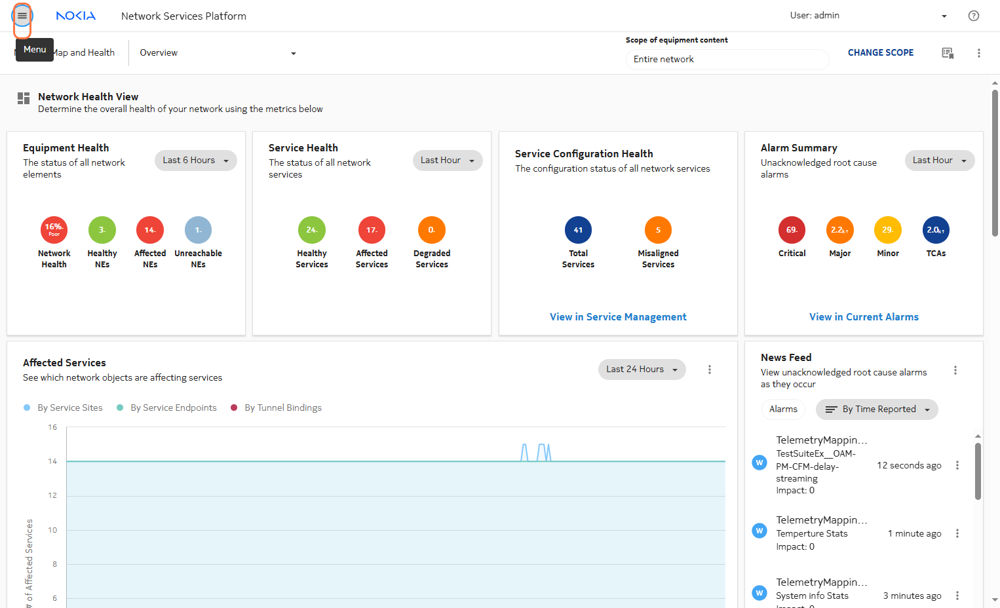
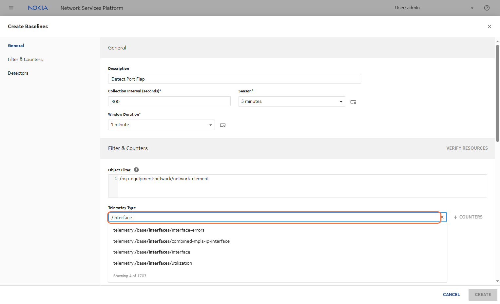

---
tags:
  - NSP
  - Baseline
  - Analytics
---

# Baseline Analytics

|     |     |
| --- | --- |
| **Activity name** | Baseline Analytics |
| **Activity ID** | 69 |
| **Short Description** | Detect anomalies through training and providing a baseline |
| **Difficulty** | Beginner |
| **Tools used** |     |
| **Topology Nodes** | :material-router: PE3 |
| **References** | [NSP baseline](https://documentation.nokia.com/nsp/24-11/NSP_Data_Collection_and_Analysis_Guide/dca_baselines.html) |

This guided activity walks you through detecting port flaps using telemetry data and statistical anomaly detection techniques.
The workflow collects port telemetry from routers, applies Z-score-based anomaly detection after training a baseline.

## Prerequisites

- Basic understanding of NSP
- Understanding on time-series data and statistical algorithm
- Knowing the common models in NSP and filter can be used on these model to query the appropriate router resource.

## Key Learnings

By the end of this activity, you'll be able to create and train a baseline for anamoly detection.

## Terminology

**Baseline Training and Z-score Detection**

Train on historical port status data to establish a statistical norm.
Use Z-score to flag deviations beyond a defined threshold, indicating a flap event.

**Statistical Terminology**

Understand how statistical algorithm are used for anomaly detection

## High-level Data Flow

1. Define the Collection Interval

        This is how often you collect data.

        Example:
        Every 15 minutes, collect metrics like received-octets.

2. Filter the NSP resource using a path-filter

        Select which resources to monitor using a filter path.

        Example:
        Filter for ports with traffic, specific interfaces, or NE-IDs.

3. Aggregate the data based on counter, gauge or sample

        You collect metrics like:

        * counters (e.g., received-octets),
        * gauges (e.g., CPU usage),
        * samples (e.g., latency).

4. Seasonality and window allows us to calculate the mean and variance

        You define a season (e.g., 1 week) and split it into windows (e.g., 15-min intervals).
        For a 1-week season with 15m windows, there are:
        7 days x 24 hours x 4 windows/hour = 672 windows
        Each window has its own baseline value — the expected metric for that time slot based on past values.

5. Update the Baseline

        After each new measurement, the system updates the expected value for that window using a baseline algorithm .
        So, the value you see for Tuesday 08:00–08:15 is based on past Tuesdays at the same time.

6. Apply one of the anamoly algorithm to detect anamoly based on the mean and variance

        Once we have a baseline (expected mean and variance), we apply an anomaly detection algorithm.
        If a new value deviates too far from the expected value (e.g., outside 3×standard deviation), it's flagged as an anomaly.

---

## Tasks

**You should read these tasks from top-to-bottom before beginning the activity.**

It is tempting to skip ahead but tasks may require you to have completed previous tasks before tackling them.  

### Configure a Baseline Analytics

/// note | Click on Menu to access the hamburger menu

///

/// note | Click on Data Collection and Analysis

///

/// note | Click on Management

///

/// note | Click on Dropdown

///

/// note | Click on Baseline subsection

///

/// note | Click on BASELINE to create the baseline

///

/// note | Give a Name For the Use Case

///

/// note | Define the collectionInterval

///

/// note | Choose a seasonlity

///

/// note | Click on 5 minutes

///

/// note | Click on Window Duration

///

/// note | Click on 1 minute for the window

///

/// note | Click on ​Object Filter to select your resource

///

/// note | Type "/" to select available filters

Choose `nsp-equipment:network/network-element`
///

/// note | Type "/interface" to find the telemetry type

///

/// note | Click on interfaces/interface to monitor ports

///

/// note | Click on COUNTERS for data aggregation

///

/// note | Click on / Press Space to toggle row selection (checked)

Check `transmitted-octets-periodic`
///

/// note | Click on / Press Space to toggle row selection (checked)

Check `received-octets-periodic`
///

/// note | Click on ADD

///

/// note | Click on / Press SPACE to select this row

///

/// note | Click on Counter

///

/// note | Click on / Press SPACE to select this row

///

/// note | Click on Counter

///

/// note | Click on VERIFY RESOURCES

///

/// note | Select the router or resource where you want to apply this baseline

///

/// note | You can select multiple resources

/// warning
Make sure to select resources from routers that belong to your group.
Access control is not enforced.
///
///

/// note | Click on CREATE

///

/// note | Click on CLOSE

///

/// note | Click on the create baseline

///

/// note | Click on 3 dots to edit option

///

/// note | Click on Edit

///

/// note | Click rule to create a rule for detecting anamoly

///

/// note | Set up the comparator

///

/// note | And set the threshold value

///

/// note | Click on UPDATE to add the changes

///

/// note | Click on CANCEL to rerturn to baseline

///

/// note | Click on 3 dots to access visualization

///

/// note | Click on Open in Data Collection and Analysis Visualizations

///

/// note | Click on PLOT

/// warning
With the settings provided (collection: 30s, window: 1min, season: 5min) you should wait around 10min to see results!
///
///

### Generate some traffic

Use high frequency ping (rapid, large mtu) to generate some traffic to ensure hitting the baseline.
Continue monitoring the plotter.

/// note
Based on the seasonality and window length, the detector rule will begin to apply.
You need to configure the comparator to detect values less than a threshold close to 0.
This helps identify anomalies such as port flapping, where there is a sudden drop in the metric value toward zero.

Anamolies are pushed into a kafka topic which can be used to trigger email notification or closed of automation.
///

/// note | **SUMMARY**
Name: Detect Port Flaps

        Collection Interval: 30 secs
        Sesonality: 5 mins
        Window Duration: 1 mins
        Telemetry Type: /interfaces/interface
        Object Filter: /nsp-equipment:network/network-element[ne-id={{router-id}}]

Detector:

        Threshold: 0.0001
        Comparison: Less than
        Algorithm: Z-score Absolute
        Evaluate What: Value
        Evaluate When: End of Window
///

### Next steps

Here are some ideas on how to continue:

* What's the difference between indicators and baseline?
* Add baselines for other KPIs like CPU and memory.
