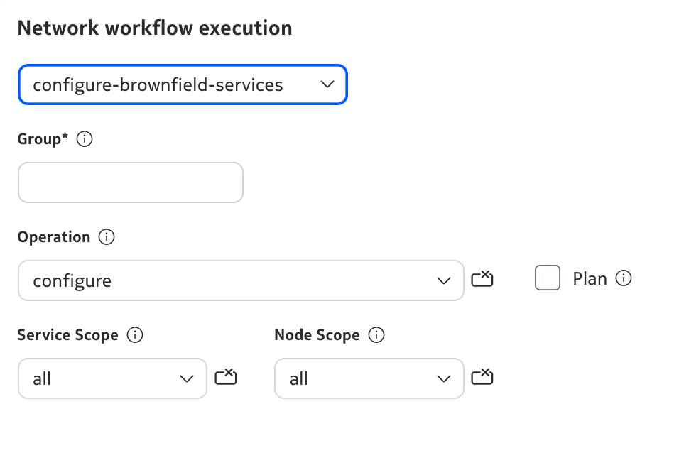
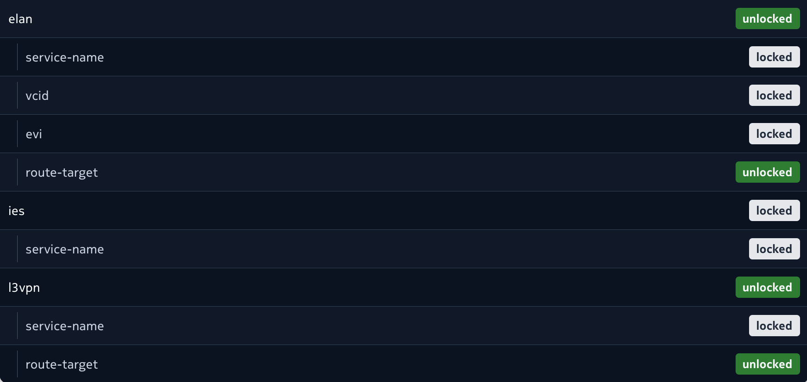

# Brownfield Service Discovery

| Field | Value |
| --- | --- |
| **Activity name** | Brownfield Service Discovery |
| **Activity ID** | 38 |
| **Short Description** | Discover brownfield services from the network |
| **Difficulty** | Beginner |
| **Topology Nodes** | :material-router: PE1, :material-router: PE2 |

## Objective

Operations teams typically treat NSP as the operational center for what is deployed across the PEs and groups they manage. When L3VPN and L2VPN services are configured straight on the routers, that configuration stays on the devices until you deliberately import them through **brownfield discovery**.

In this activity you create one VPRN and one VPLS on PE1 and PE2, then discover them using NSP’s **auto-stitching** algorithms and service resync to bring **those services** into the NSP model. 

## Technology explanation

### Data sync mappers

Data sync mappers in NSP define how device service data (e.g. VPRN/VPLS on SR OS) maps into NSP's service model. The right mappers must be loaded for the service types you want to discover.

/// details | Where are data sync mappers in NSP?
    type: question
Under **Artifacts**, select **All Artifacts** from the dropdown. Search for `data-sync`; you should find these mappers pre-installed in the system.
///

### Brownfield discovery and auto-stitching

NSP groups discovered service sites from multiple devices into one logical service model (e.g. one L3VPN spanning PE1 and PE2). Enabling the right auto-stitching algorithms ensures your VPRN and VPLS across both PEs **each become** one service in NSP.

/// details | Why brownfield discovery is not automatic by default?
    type: question

- **Cost and impact** — A resync walks large configuration and state trees on the nodes you target. Doing that for all devices on a tight schedule or on every small change would add heavy load on controllers and devices and generate a lot of northbound work. Operators run discovery when they intend to reconcile, in a window they control.
- **Not all device config should be imported** — A PE may host legacy VPNs, lab services, or shared infrastructure that you never want in NSP's service layer. Automatic import would either surface the wrong services or create duplicates and ownership conflicts with greenfield work. 
- **The pipeline must be correct before import** — Data sync mappers, CAM artifacts, and stitch rules must match your OS versions and your service model. If NSP ran discovery blindly whenever config changed, you could get failed imports, partial mapping, or inconsistent service data. 
- **Stitching and grouping are policy** — How separate device-local sites roll up into one logical L3VPN or L2VPN depends on rules and naming conventions that differ per deployment. That is not something the system can safely infer for everyone without explicit configuration.

///

## Tasks

**You should read these tasks from top to bottom before beginning the activity.**

It is tempting to skip ahead, but tasks may require you to have completed previous tasks before tackling them.

/// warning
Remember that you are using a shared NSP system. Include your group number in every workflow input that asks for **Group**.
///

### Quick start on NSP Web UI

|     |     |
| --- | --- |
| **NE Session** | `☰` → `Network Search and Inventory` → find your group's PE node (for example `g7-pe1`) → open the row context menu `⋮` → `Open in NE Session`. |
| **NSP Help** | `?` icon at the top right for context-aware quick help and to open the Help Center. On some pages, the `?` icon also links directly to related Help Center articles. |
| **Service Management** | `☰` → `Service Management` |
| **Workflow Manager** | `☰` → `Workflows` |
| **Artifacts** | `☰` → `Artifacts` |

To keep the walkthrough in one place, this activity uses a small set of workflows so each step is straightforward and you can see how NSP automates brownfield discovery end to end.

/// details | How to check workflow execution status?
    type: question

To check the execution status of any workflow, navigate to **Workflow Manager**, select **Workflow Executions** from the dropdown. Locate your execution. If you see more than one execution (since it is a shared NSP system), double-click one of the entries. From the dropdown, select **Input/Output** to cross-check your execution. To drill deeper into the flow, select **Flow** view from the dropdown.

///

### Create the services

/// note
The workflow targets nodes whose **ne-name** matches `g<N>-pe1` and `g<N>-pe2`.
///

1. Go to **Service Management**. Open the menu (**⋮**) in the upper-right corner, then **Execute workflow**. Under network workflow execution, select **`configure-brownfield-services`**.
2. Set **Group** to your group ID, **Operation** to `configure`, **Service Scope** to `all`, and **Node Scope** to `all`.
3. Optionally run the workflow first with **Plan** set to `true` to preview a report of the services that will be created.
4. When you are ready to apply, run the workflow again with the same inputs as above and **Plan** set to `false`.

{: style="max-width: 500px; height: auto; display: block; margin-left: auto; margin-right: auto; border-radius: 10px;"}

When execution succeeds, open **View Result** to review what was done.

### Verify services on the network

1. On your group's PE1 and PE2, open an **NE Session** as mentioned in the Quick Start section.
2. **Connect** to the NE and run `show service service-using`.
3. If you selected `all` for **Service Scope** in the previous step, you should see the expected VPRN and VPLS services (for example `activity-38-g1-vprn` and `activity-38-g1-vpls`).

/// details | CLI check
    type: hint
From **NE Session**, connect to **PE1** and **PE2** and run `show service service-using`. With **Service Scope** `all` from Challenge 1, expect entries such as `activity-38-g1-vprn` and `activity-38-g1-vpls` (replace `1` with your group ID where applicable).
///

### Verify auto-stitching

1. Go to **Service Management**. Open the menu (**⋮**) in the upper-right corner, then **Execute workflow**. Under network workflow execution, select **`get-auto-stitch-setting`** and click **Execute**.
2. When execution succeeds, open **View Result**. For this activity, confirm that **route-target** is **unlocked** for **both** the **ELAN** and **L3VPN** service types.

{: style="max-width: 700px; height: auto; display: block; margin-left: auto; margin-right: auto; border-radius: 10px;"}

### Verify service discovery in NSP

1. Open **Service Fulfillment** and select the **Services** view from the dropdown (if it is not already selected).
2. Search by **Service Name** (for example `activity-38-g1-vprn`, `activity-38-g1-vpls`) or **Service-ID** (for example `501`, `601` for group 1).
3. You should see **one L3VPN (VPRN)** and **one L2VPN (VPLS)** with the expected names/IDs, each reflecting both PEs (two sites) after stitching.

/// details | What if nothing appears yet?
    type: question

By default, service discovery runs on an interval (often on the order of **five minutes**). Wait for at least one cycle, refresh the **Services** view, then verify earlier steps if entries are still missing. If the problem persists, check with the team before changing stitching policy on your own.

///

## Summary

Congratulations! In this activity you explored:

- How NSP uses workflows to simplify repeated steps and surface clear results
- How NSP discovers services that already exist on the network
- How NSP builds its service model through data sync and stitching

## Next steps

Now that you have discovered the services and used route-targets for stitching, consider designs that need a different grouping rule (for example, based on customer ID or NE name). For those cases, continue with [Custom Service Splitting](../intermediate/nsp-activity-39.md) to split or stitch brownfield services in custom ways.