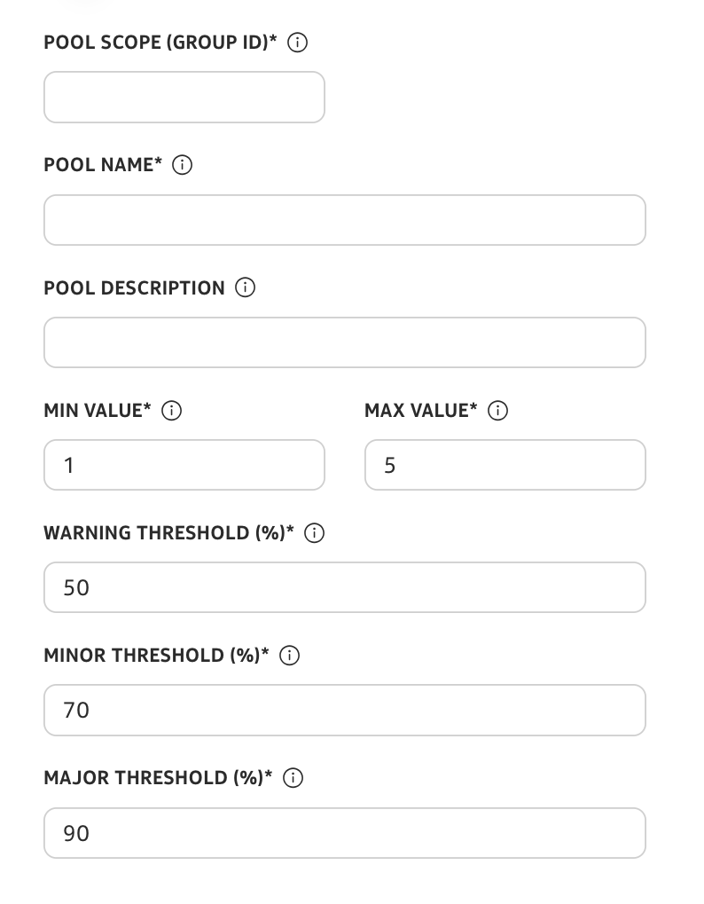
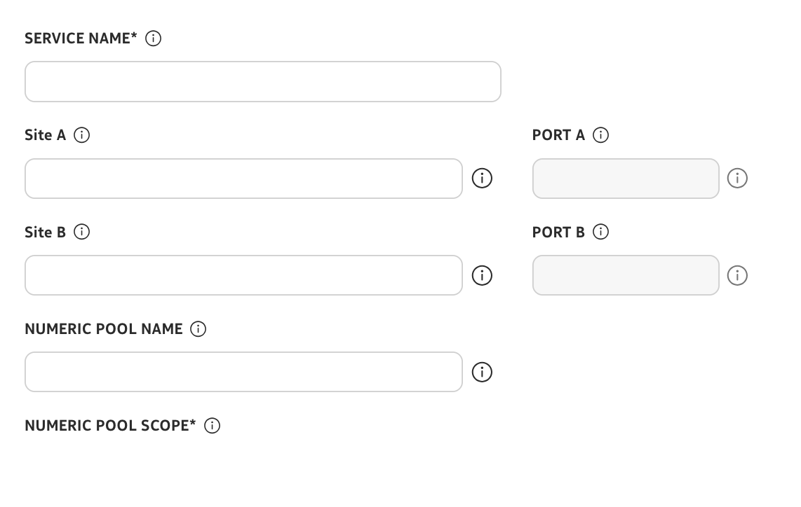
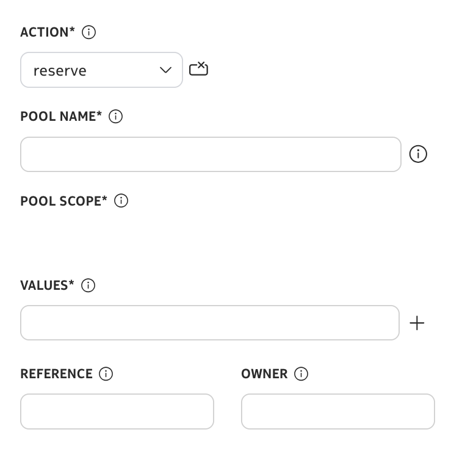

# Service Provisioning with Resource Pools

|     |     |
| --- | --- |
| **Activity name** | Service Provisioning with Resource Pools |
| **Activity ID** | 67 |
| **Short Description** | Provision services that draw resources using NSP Resource Management |
| **Difficulty** | Beginner |
| **Topology Nodes** | any :material-router: PE nodes |
| **References** | [Workflow Development](https://network.developer.nokia.com/learn/25_11/artifact-development/programming/workflows/wfm-workflow-development/)   [Mistral DSL v2 specification](https://docs.openstack.org/mistral/ocata/dsl/dsl_v2.html)   [Resource Management](https://network.developer.nokia.com/learn/25_11/artifact-development/programming/network-automation/resource-manager/)   [Resource Pool API Collection](https://network.developer.nokia.com/api-collections/25.11/Resource_Administration_RESTCONF_API/)   [Intent-Based Service Fulfillment (IBSF)](https://network.developer.nokia.com/learn/25_11/API-reference/network-functions/service-management/) |

## Objective

Teams often track VLANs, IP ranges, and other shared numbers in spreadsheets, CMDBs, or tickets. When several groups use the same ranges, it is hard to know what is still free.

This activity showcases how **NSP's Resource Management** can unify these shared numbers into one view, hand out resource values, block reuse, and still follow the usual service create-and-delete path.

## Technology explanation

### Resource Management

NSP's Resource Management allows operators to define and manage pools of resources (e.g., IP addresses, VLAN IDs, RD/RT). A **Numeric Pool** is a specific type of resource pool that manages a range of numerical values (e.g., VLAN IDs, port numbers).

### Intent-Based Service Fulfillment (IBSF)

IBSF (**Service Management**) provides a declarative service lifecycle management framework: you define a service intent, and IBSF handles deployment, state reconciliation, and removal on the target nodes. Resource pool integration can be built directly into an intent-type definition so that pool values are obtained and released automatically during the service lifecycle.

### Workflow Manager (WFM)

WFM (built on OpenStack Mistral DSL v2) workflows can interact with various NSP components and external systems. For this activity, the provisioning workflow artifacts are available preinstalled. They orchestrate resource pool obtain/release and delegate the actual service deployment to IBSF, giving you explicit control over each phase without modifying the intent-type code.

## Tasks

/// warning
Remember that you are using a shared NSP system. Include your group number in every workflow input that asks for **Group**.
///

**You should read these tasks from top to bottom before beginning the activity.**

It is tempting to skip ahead, but tasks may require you to have completed previous tasks before tackling them.

### Quick start on NSP Web UI

|     |     |
| --- | --- |
| **NE Session** | `☰` → `Network Search and Inventory` → find your group’s PE node (for example `g7-pe1`) → open the row context menu `⋮` → `Open in NE Session`. |
| **NSP Help** | `?` icon at the top right for context-aware quick help and to open the Help Center. On some pages, `?` also links directly to related Help Center articles. |
| **Resource Management** | `☰` → `Network Intents` → top right `⋮` → `Open Resource Management` |
| **Service Management** | `☰` → `Service Management` |
| **Workflow Manager** | `☰` → `Workflows` |

/// details | How to check workflow execution status?
    type: question

To check the execution status of any workflow, navigate to **Workflow Manager**, select **Workflow Executions** from the dropdown. Locate your execution. If you see more than one execution (since it is a shared NSP system), double-click one of the entries. From the dropdown, select **Input/Output** to cross-check your execution. To drill deeper into the flow, select **Flow** view from the dropdown.

///

/// note
Work **top to bottom**. Later challenges assume the earlier ones succeeded. Treat each heading as a **challenge**: decide *what* to run and *how* to prove success in **Resource Management** before you open a hint. Hints hold exact workflow names, navigation, screenshots, and troubleshooting tips.
///

### Create a Numeric Pool

1. Go to **Workflow Manager**. Search for `create-numeric-pool-with-threshold-policy`, open the row menu (**⋮**) next to the entry, and choose **Execute workflow**. 
2. Set **Pool Scope** to your group ID and provide a **Pool Name** of your choice. Add a **Pool Description** if you prefer, and leave the rest at their defaults unless you want to change a setting (feel free to do so). Click **Execute**.

{: style="max-width: 300px; height: auto; display: block; margin-left: auto; margin-right: auto; border-radius: 10px;"}

/// details | How would you verify in Resource Management?
    type: question
From **Resource Management**, open **Numeric pools** and **Threshold policies**. Confirm the pool appears, scope matches your group, and the threshold policy is attached. Capture pool name, scope, and utilization (or total vs. used) before moving on.
///

/// details | Why use a workflow instead of the UI?
    type: question

Creating a resource pool through the NSP **UI** is allowed only for **administrator** roles.

This workflow is built on the NSP [Resource Pool API](https://network.developer.nokia.com/api-collections/25.11/Resource_Administration_RESTCONF_API/). It creates a **Threshold Policy** first, then creates a scoped **Numeric Pool** with that policy attached, in one execution.

The threshold policy is also the hook for [Resource Pool Monitoring and Alerting](nsp-activity-41.md), where utilization crossings drive alarms and Kafka-triggered automation.
///

### Consume the pool from a service

As part of this task, **let’s** provision an **EVPN ELINE (P2P)** service so it **obtains** values from your pool and you can see the reservation in Resource Management.

/// details | Workflow and checks
In **Workflow Manager**, run **`create-evpn-epipe-service-with-resource-pool`**. Align inputs with your devices, ports, and **the same pool identity** you established when you created the numeric pool, then **Execute**.

{: style="max-width: 500px; height: auto; display: block; margin-left: auto; margin-right: auto; border-radius: 10px;"}

In **Resource Management** → **Numeric pools**, open your pool: utilization should change and a reservation row should reference your **service name**.
///

/// details | What if create fails?
    type: tip

Inspect the workflow **Flow** and **Input/Output**. Re-check pool name/scope and node/port reachability. Change one input category at a time instead of all fields at once.
///

### Prove the pool tracks growth

Now that you have created a service, add a **second** instance and observe how **different** values and reservations show up in the pool.

/// details | Hint
    type: hint
Run **`create-evpn-epipe-service-with-resource-pool`** again with a **new** service name and consistent pool fields. Compare the numeric pool view before and after: utilization rises and two distinct references should appear (names depend on your inputs).
///

### Release capacity on delete

Now **let’s** remove one service and confirm the pool **gives back** what it had reserved.

Run the **`delete-evpn-epipe-service-with-resource-pool`** workflow with inputs that match the service and pool you created. Then reopen the pool in **Resource Management**: utilization should fall, the reservation row for that service should disappear, and no row should list that service as a **reference**.

/// details | What if delete fails?
    type: tip

Inspect workflow execution output. Cross-check service name, pool name/scope, and node values. If utilization does not drop, the delete path may not have completed—trace the **Flow** to the failing step.
///

### Reserve resources for a future purpose

Through **Resource Management** you can reserve one or more values for a labeled future use.

1. Go to **Workflow Manager**. Search for `reserve-or-release-numeric-pool`, open the row menu (**⋮**) next to the entry, and choose **Execute workflow**. 
2. Set the **Action** input to **reserve** to hold values for future use.
3. To release, set the **Action** input to **release** and provide the **Values** list. The **Reference** and **Owner** inputs are not required for release.

{: style="max-width: 300px; height: auto; display: block; margin-left: auto; margin-right: auto; border-radius: 10px;"}

Repeat reserve → release on a small set of IDs and watch utilization and the reservations list after each run.

## Summary

Congratulations! In this activity you moved from manual mental tracking to system-enforced assignment: pool creation, workflow-driven consumption, release on delete, and manual reserve for planned work—core Resource Management literacy.

## Next steps

Now that you have discovered how to create a resource pool and a threshold on top of it, it makes sense to complete the picture with closed-loop automation that responds when thresholds are crossed. Continue with [Resource Pool Monitoring and Alerting](nsp-activity-41.md) to visualize threshold alerts and Kafka-triggered workflow execution based on those alerts.
