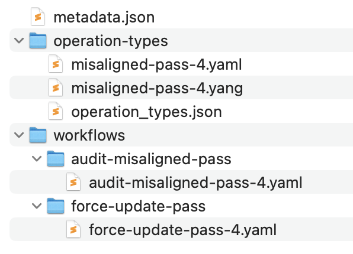

---
tags:
  - NSP
  - Workflow Manager
  - Device Operation
  - LSO (Large Scale Operation)
  - Artifact Manager
---

# Network Element Password Audit and Alignment

|     |     |
| --- | --- |
| **Activity name** | Network Element Password Audit and Alignment |
| **Activity ID** | 66 |
| **Short Description** | Audit the NE user password and align to the target password if misaligned  |
| **Difficulty** | Intermediate |
| **Topology Nodes** | any SR OS node |
| **References** | [LSO Framework](https://network.developer.nokia.com/learn/24_11/network-functions/device-management/lsom-framework-apis/#Guidelines), [Workflow Development](https://network.developer.nokia.com/learn/25_4/programming/workflows/wfm-workflow-development/), [RFC8072 (YANG PATCH)](https://www.rfc-editor.org/rfc/rfc8072.html) |

## Objective

You need a reliable way to enforce your organization’s passwords on many devices—without manual spot checks, risky ad-hoc fixes, or “hope it’s compliant” assumptions. In this activity, you’ll use a custom, two-phase **Device Operation** built on NSP’s **Large-Scale Operation Manager (LSOM)** to:

* **Detect** non-compliant device user passwords at scale (validation phase).
* **Reconcile** only where needed, safely and predictably (fix phase).

The outcome is a repeatable, operator-friendly control you can run on any set of targets nodes to continuously check and enforce device-level passwords to be set correctly and update if needed.

## Technology explanation

**Device Operation** in NSP are tools that help manage network devices. They can do many things, like checking device settings, making backups, restoring data, or upgrading software.

These operations run through workflows — think of them like step‑by‑step instructions. Another part of NSP, called LSOM, oversees running those workflows, keeping track of their progress, and giving you control over when and how they run.

An operation always targets one or more devices. To run it, the workflow needs to know the device’s ID (called `ne-id`). In our case, since we’re managing device user accounts, we also need a `username` and `password`.

For our automation, we need to create three things:

1. A workflow to check if a device user’s password is correct.
2. A workflow to fix the password if it’s wrong.
3. An operation that ties these workflows together so they can be run easily.

To make sharing and installing these three parts simple, we’ll put them all together into one package called an **Artifact Bundle**.

The YAML syntax for writing workflows is very intuitive, as it uses simple English expressions to describe the execution and data flow including conditional statements. Please study the workflow code carefully to get used to the syntax and principles, soon you will write your first own workflow.

### Artifact Bundle

To build a device operation that runs multiple workflows, you need to follow a specific directory structure. Each file and folder in this structure has its own purpose, keeping the execution logic separate from the user interface so everything stays clean and well‑organized.

| Path                                                | Description                                                       |
|-----------------------------------------------------|-------------------------------------------------------------------|
| `metadata.json`                                     | **Artifact Bundle meta-data**                                     |
| `workflows/`                                        | **Directory for workflows**                                       |
| `|__audit-misaligned-pass/`                         |                                                                   |
| `      |__audit-misaligned-pass-<< GroupId >>.yaml` | Workflow-1 to audit the NE password                               |
| `|__force-update-pass/`                             |                                                                   |
| `      |__force-update-pass-<< GroupId >>.yaml`     | Workflow-2 to realign the password if misalignment exists         |
| `operation-types/`                                  | **Directory for operation-types**                                 |
| `      |__operation_types.json`                     | Operation-type meta information                                   |
| `      |__misaligned-pass-<< GroupId >>.yang`       | Operational model (in YANG) defining operation input and output   |
| `      |__misaligned-pass-<< GroupId >>.yaml`       | Mapping profile: Defines phases with workflow references          |

/// warning
The YANG-defined operation input (and output) is provided and persisted in clear-text.
As this applies to every field regardless of confidentiality, having user passwords unencrypted impacts applicability for production environments.
///

## Tasks

**You should read these tasks from top-to-bottom before beginning the activity.**

It is tempting to skip ahead but tasks may require you to have completed previous tasks before tackling them.

/// warning
Remember that you are using a single shared NSP system that is used for all groups. Ensure
your group-number is part of the operation and workflow names you are creating to ensure uniqueness.
///

### Getting Started

Creating things from scratch can feel daunting and even overwhelming. To save you from piecing together all the required components that define the structure and format of an operation, we provide you with a [LSO Skeleton Bundle Generator](./resources/bundle-generate-66.html). This tool creates an artifact bundle in the exact structure expected by the system, giving you a ready-made starting point. From there, you can easily build upon it and move on to more advanced use cases.

### Password Audit Workflow

Part of monitoring local user configuration in a network element is being able to audit what is there. Let's create the workflow to audit the NE user password.

The general flow is the following:

1. Retrieve the current password from the NE
2. Compare it to the configured target password
3. Generate an audit result indicating compliance or deviation

To keep things efficient, we are providing you with the complete workflow code in the box below.

/// details | Workflow code
    type: note

```yaml
version: '2.0'

audit-misaligned-pass-<<GroupId>>:
  tags:
    - LSO

  input:
    - neId ## mandatory input for LSO operations
    - username ## NE User to validate
    - password ## Expected password

  output:
    lsoInfo: <% $.lsoInfo %> ## mandatory output for LSO operations
    misaligned: <% $.misaligned %> ## mandatory output leaf parameter defined in misaligned-pass.yang

  output-on-error:
    lsoInfo: <% $.lsoInfo %> ## mandatory output for LSO operations for errors
    misaligned: <% $.misaligned %> ## mandatory output leaf parameter defined in misaligned-pass.yang

  vars:
    lsoInfo: Failed
    lsoStageError: Unknown ## mandatory for LSO operations stage level errors
    misaligned: "no"

  tasks:
    checkUsernameIsAdmin:
      action: std.noop
      on-success:
        - avoidAdmin: <% $.username = "admin" %>
        - getAdminPass: <% $.username != "admin" %>

    avoidAdmin:
      action: std.fail
      publish-on-error:
        lsoInfo: "Info: Admin user cannot be used as input"
        lsoStageError: Admin user cannot be used as input

    getAdminPass: ## access the configured hashed password via MDC API
      action: nsp.https
      input:
        url: https://restconf-gateway/restconf/data/network-device-mgr:network-devices/network-device=<% $.neId %>/root/nokia-conf:/configure/system/security/user-params/local-user/user=<% $.username %>
        resultFilter: $.content.get("nokia-conf:user").first().password
      publish:
        nePass: <% task().result.content %>
        lsoInfo: <% task().result.content %>
      publish-on-error:
        lsoInfo: "Error: Failed to get <% $.username %> user password"
        lsoStageError: <% task().result %>
      on-success:
        - checkMisalignment

    checkMisalignment: ## Check alignment of configured password with the password provided as input
      action: nsp.python
      input:
        context: <% [$.password, $.nePass] %>
        script: |
          import bcrypt
          if bcrypt.checkpw(context[0].encode("utf-8"), context[1].encode("utf-8")):
            return "no"
          else:
            return "yes"
      publish:
        misaligned: <% task().result %>
        lsoInfo: <% task().result %>
      publish-on-error:
        lsoInfo: "Error: Failed to check for misalignment"
        lsoStageError: <% task().result %>
      on-success:
        - adminPassAligned: <% $.misaligned = "no" %>

    adminPassAligned: ## handle misalignment information
      action: std.fail
      publish-on-error:
        lsoInfo: "Info: Password of <% $.username %> user is aligned"
        lsoStageError: Password of <% $.username %> user is aligned
```

/// note
Keep in mind that this workflow is intended to fail if the password matches and succeed if it does not. This ensures the Operation Manager multi-phase transition from Audit to Align: a mismatch triggers progression to the align phase, while a match halts it since no action is needed. Though logical, this may feel counterintuitive—success on mismatch and failure on match.
///

///

A few observations worth noting:

* Some specific rules need to be adhered to for the workflow to be valid LSO. Have a look at how the variables `lsoInfo` and `lsoStageError` are used. Those variables provide a feedback loop to *Device Operations* to understand execution progress and reasoning of the result.
* NSP uses the `admin` user for mediation (CLI, xFTP, NETCONF and gRPC). As we don't want to break your lab, an initial check is done to avoid updating the admin user's password by accident.
* The workflow input must fit the needs of the operation, so it needs to match the operation model. Alternatively, values could be set statically in the mapping profile.
* The general logic in LSO is that only targets that have successfully passed one phase are considered for the execution of the next phase(s). That's why we need to think carefully about the returned execution state. If and only if the check was executed successfully and we found a misalignment will the workflow return `success`. In other words, only then would the target device be selected for the next phase to realign the password. In all other cases (password was aligned already, workflow failed) the target is marked as `failed` and it would not be considered for realignment of the password.

/// note | Give it a try!

You don't need to wait until everything comes together as an operation. You can try out the workflow right now. You may use either the NSP WebUI or Visual Studio Code (or code-server) with the NOKIA WFM extension to create and run the workflow. For now, you can use the `admin` user, but ideally you can already create another NE user like `nsptest` on your targeted SR OS node.

/// details | Creating a local user using MD-CLI in SR OS
    type: hint

```bash
edit-config private
configure system security user-params local-user user nsptest password t0ps3creT.
commit
```

You can use the same approach to update the user password to test your implementation.
///
///

### Password Update Workflow

Now that we know when users are in violation of our organization's password policy, we need to automate remedying that situation.

Having familiarity with the mechanics and structure of workflows, it is your turn to create the second workflow. While the first workflow identifies password rule violations, the second workflow can update configured NE user passwords with a password that is specified as input.

Create a workflow called `force-update-pass-<<GroupId>>`. You may user either NSP WebUI or Visual Studio Code (or code-server) with the NOKIA WFM extension to create and run the workflow. Test your workflow properly before you continue!

/// details | Hint
    type: tip

1. While you can use MD‑CLI commands like `info json` and `pwc model-path` to help build the resource URI and payload, it’s often easier to check the workflow you already have — the URI it uses contains everything needed for your write request.
2. In RESTCONF there are multiple ways to update the password. You may decide to use HTTP PUT, to **replace** the current password value. You may use HTTP PATCH, to **merge** it. The most flexible way is using **YANG PATCH**.
3. Use the WFM action `nsp.https` to execute a RESTCONF call from the workflow.

If you feel that you are hitting a roadblock in your development of this second workflow you can ask the hackathon support team for some advice. There are many possible solutions using various approaches for contacting the node, what matters in the end is the functionality of your code.

Remember, the provided working example is not the only possible solution. You are free to use the [nsp.mdm_cli](https://network.developer.nokia.com/learn/24_11/programming/workflows/wfm-workflow-development/wfm-workflow-actions) action which would perform the same using CLI commands. Or look at the NETCONF protocol with action [netconf.configure](https://network.developer.nokia.com/learn/24_11/programming/workflows/wfm-workflow-development/wfm-workflow-actions).

Whatever path you end up taking, once your code works the foundation has been laid, you'll have learned some new skills and will be able to build from there.

///

/// details | Possible solution (only look here as a last resort!)
    type: success

```yaml
version: '2.0'

force-update-pass-<<GroupId>>:
  tags:
    - LSO

  input:
    - neId
    - username
    - password

  output:
    lsoInfo: <% $.lsoInfo %>
    misaligned: <% $.misaligned %>

  output-on-error:
    lsoInfo: <% $.lsoInfo %>
    misaligned: <% $.misaligned %>

  vars:
    lsoInfo: Failed
    lsoStageError: Unknown
    misaligned: "yes"

  tasks:
    checkUsernameIsAdmin:
      action: std.noop
      on-success:
        - avoidAdmin: <% $.username = "admin" %>
        - updateAdminPass: <% $.username != "admin" %>

    avoidAdmin:
      action: std.fail
      publish-on-error:
        lsoInfo: "Info: Admin user cannot be used as input"
        lsoStageError: Admin user cannot be used as input

    updateAdminPass: ## update the NE User password using MDC API
      action: nsp.https
      input:
        method: PATCH
        url: https://restconf-gateway/restconf/data/network-device-mgr:network-devices/network-device=<% $.neId %>/root/
        accept: application/yang-data+json
        contentType: application/yang-patch+json
        body:
          ietf-yang-patch:yang-patch:
            patch-id: patch-pass
            edit:
              - operation: merge
                target: nokia-conf:/configure/system/security/user-params/local-user/user=<% $.username %>
                edit-id: edit-pass
                value:
                  nokia-conf:user:
                    user-name: <% $.username %>
                    password: <% $.password %>
      publish:
        misaligned: "no"
        lsoInfo: <% task().result.content %>
      publish-on-error:
        lsoInfo: "Error: Failed to update <% $.username %> user password"
        lsoStageError: <% task().result %>
```
///

Now that we have automated auditing and updating NE password configuration individually, let's see how to combine that into a single operation.

### Operation Type

The first part of creating an operation in the LSOM framework is defining the operation type.

| **Key**              | **Description**                                                  |
|----------------------|------------------------------------------------------------------|
| `name`               | Same as the bundle name                                          |
| `description`        | Short description                                                |
| `category`           | Operation type category (`other`, `backup`, `restore`, `upgrade`)     |
| `created-by`         | Created by (e.g., `nsp_internal_system_user`)                    |
| `operation-model`    | `<bundle-name>.yang`                                             |
| `profile`            | `<bundle-name>.yaml`                                             |
| `life-cycle-state`   | Release status (`draft`, `released`, `withdrawn`)                                |
| `additional-tag`     | Customs tags, e.g., `["LSO", "SR OS"]`                           |
| `version`            | Version number in `x.y.z` format (e.g., `1.0.0`)                 |


/// details |  `operation_types.json`
    type: success

```json
{
  "operation-type": {
    "name": "misaligned-pass-<< GroupId >>",
    "description": "Operation for Misaligned Pass << GroupId >>",
    "category": "other",
    "created-by": "nsp_internal_system_user",
    "operation-model": "misaligned-pass-<< GroupId >>.yang",
    "profile": "misaligned-pass-<< GroupId >>.yaml",
    "life-cycle-state": "released",
    "additional-tag": ["LSO", "SR OS"],
    "version": "1.0.0"
  }
}
```

///

### Operation Input-Output

Regardless of whether the operation is single-phase or multi-phase, all phases share the same input and output parameters. If you believe a particular phase does not require certain inputs, default values can also be defined within the phase definition. We will cover this in the next section.

/// note
The input and output of any LSO operation are defined in YANG.
///

/// details | Hint
    type: tip

When updating the operation's YANG file which was already generated using the [LSO Skeleton Bundle Generator](#getting-started), keep the following points in mind:

1. The module name, prefix, and the final segment of the namespace (after the colon) must all match.
2. In the `when` clause of the augment statements, the value being compared should always be the module name.
3. Only the container elements within the two augment sections should be modified based on the specific requirements.

///
/// details |  `misaligned-pass-<< GroupId >>.yang`
    type: success

```yang
module misaligned-pass-<< GroupId >> {
  yang-version 1.1;
  namespace "urn:nokia:nsp:model:lso:operation:misaligned-pass-<< GroupId >>";
  prefix misaligned-pass-<< GroupId >>;

  import nsp-lso-operation {
    prefix nlo;
  }

  organization "Nokia";
  contact "";
  description "Operation for Misaligned Pass";

  revision 2024-10-08 {
    description "version 1";
    reference "";
  }

  augment "/nlo:lso-operations/nlo:operation" {
    when "operation-type='misaligned-pass-<< GroupId >>'";
    description "Augmentation of operation input";
    container misaligned-pass-<< GroupId >>-operation {
      leaf username {
        type string;
        mandatory true;
        description "Admin username of the node";
      }
      leaf password {
        type string;
        mandatory true;
        description "Intended password on the node";
      }
    }
  }

  augment "/nlo:lso-operations/nlo:operation/nlo:executions/nlo:execution" {
    when "../../operation-type='misaligned-pass-<< GroupId >>'";
    description "Augmentation of operation execution state data";
    container misaligned-pass-<< GroupId >>-execution {
      leaf misaligned {
        type string;
        description "Indicates misalignment of password";
      }
    }
  }
}
```

///

With the operation's input and output defined let's see how we specify the operation's phases.

### Operation Phases

This section defines the phases used in the Operation Type execution. It includes the phase name, description, concurrency limits, supported NE families and versions as well as the workflow triggered during each phase.

| **Key**               | **Description**                                                                 |
|-----------------------|---------------------------------------------------------------------------------------------|
| `phase`               | Phase name (e.g., `Audit`) — also indicates phase order                                     |
| `description`         | Description of what the phase does                                                          |
| `concurrency_count`   | Number of NEs on which the phase can run concurrently                                       |
| `phase_timeout`       | Timeout for the phase (in minutes)                                                          |
| `ne_families`         | NE families on which this workflow phase can be executed (list)                             |
| `|__family_type`      | Specific NE family types (e.g., `7750 SR, 7950 XRS, 7450 ESS, 7250 IXR`)                    |
| `|__ne_versions`      | Version information for the NE family (list)                                                |
| `    |__version`      | Specific NE version supported (e.g., `all`)                                                 |
| `    |__workflow_name` | Workflow to be called when executing this phase                                            |
| `    |__workflow_inputs` | Workflow inputs (leave empty if not required)                                            |


/// details | `misaligned-pass-<< GroupId >>.yaml`
    type: success

```yaml
phases:
  - phase: Audit
    description: Audit for misaligned Admin user password
    concurrency_count: 20
    phase_timeout: 15
    ne_families:
      - family_type: 7750 SR, 7950 XRS, 7450 ESS, 7250 IXR
        ne_versions:
          - version: all
            workflow_name: audit-misaligned-pass-<< GroupId >>
            workflow_inputs:
```

///

Now that we're familiar with writing the Audit phase, it is left up to you as an exercise to construct the Update phase. This phase is like the Audit phase shown above.

/// details | Possible solution (only look here as a last resort!)
    type: success

```yaml
  - phase: Update
    description: Force update Admin user password
    concurrency_count: 20
    phase_timeout: 15
    ne_families:
      - family_type: 7750 SR, 7950 XRS, 7450 ESS, 7250 IXR
        ne_versions:
          - version: all
            workflow_name: force-update-pass-<< GroupId >>
            workflow_inputs:
```
///

Now that we've created all the files related to the LSO operation, let's consolidate this information into an operation metadata file. This file enables NSP to verify the integrity of the operation package and determine the target application onto which the files should be deployed.

### Operation Metadata

This section defines the **metadata and artifact details** required for the Device Operation. It describes the versioning scheme, creation details, and the list of files included in the artifact, along with their format and purpose.

| **Key**                        | **Description**                                                   |
|--------------------------------|-------------------------------------------------------------------|
| `meta-data-header`             | Metadata container for information describing the operation type  |
| `|__version`                   | Version of the operation type in `x.y.z` format (e.g., `1.0.0`)   |
| `|__buildNumber`               | First number from the `version` (e.g., `1` from `1.0.0`)          |
| `|__formatVersion`             | First two parts of the `version` (e.g., `1.0` from `1.0.0`)       |
| `|__createdBy`                 | Created by                                                        |
| `|__creationDate`              | Date and time of creation (UTC)                                   |
| `|__title`                     | Operation Type title                                              |
| `|__description`               | Short description of the Operation Type                           |
| `artifact-meta-data`           | List of artifacts used by this operation                          |
| `|__name`                      | Name of the operation type or workflow artifact                   |
| `|__version`                   | Version of the artifact in `x.y.z` format (e.g., `1.0.0`)         |
| `|__targetApplication`         | Target application (e.g., `lsom-server-app`, `workflow-manager`)  |
| `|__applicationCompatibility`  | NSP release version from which the operation can be executed      |
| `|__artifact-content`          | List of files included in the artifact                            |
| `    |__fileName`              | File name of the artifact                                         |
| `    |__path`                  | Path inside the package where the file is stored                  |
| `    |__type`                  | MIME type of the file (e.g., `application/octet-stream`)          |


/// details | `metadata.json`
    type: success

```json
{
  "meta-data-header": {
    "version": "1.0.0",
    "buildNumber": "1",
    "formatVersion": "1.0",
    "createdBy": "SRX Hackathon 2025",
    "creationDate": "Tue, 06 May 2024 00:00:00 UTC",
    "title": "Operation for Misaligned Pass << GroupId >>",
    "description": "Operation for Misaligned Pass"
  },
  "artifact-meta-data": [
    {
      "name": "misaligned-pass-<< GroupId >>",
      "version": "1.0.0",
      "targetApplication": "lsom-server-app",
      "applicationCompatibility": "23.3+",
      "artifact-content": [
        {
          "fileName": "misaligned-pass-<< GroupId >>.yaml",
          "path": "operation-types",
          "type": "application/octet-stream"
        },
        {
          "fileName": "misaligned-pass-<< GroupId >>.yang",
          "path": "operation-types",
          "type": "application/octet-stream"
        },
        {
          "fileName": "operation_types.json",
          "path": "operation-types",
          "type": "application/octet-stream"
        }
      ]
    },
    {
      "name": "audit-misaligned-pass-<< GroupId >>",
      "version": "1.0.0",
      "targetApplication": "workflow-manager",
      "applicationCompatibility": "23.3+",
      "artifact-content": [
        {
          "fileName": "audit-misaligned-pass-<< GroupId >>.yaml",
          "path": "workflows/audit-misaligned-pass",
          "type": "application/octet-stream"
        }
      ]
    },
    {
      "name": "force-update-pass-<< GroupId >>",
      "version": "1.0.0",
      "targetApplication": "workflow-manager",
      "applicationCompatibility": "23.3+",
      "artifact-content": [
        {
          "fileName": "force-update-pass-<< GroupId >>.yaml",
          "path": "workflows/force-update-pass",
          "type": "application/octet-stream"
        }
      ]
    }
  ]
}
```

///

### Build & Installation

We now have all the necessary files and directories in place to proceed uploading the LSO operation we have created to NSP.

To do that, perform the following:

/// details | Target directory structure (sample for Group 4)

///

1. Let's ZIP the directory content (not the directory itself).
2. Rename the file to `misaligned-pass-<< GroupId >>.zip`
3. Install the package into NSP using the Artifact Administrator WebUI.

/// warning
If you are zipping the files on MacOS, run the following commands to remove unnecessary system files:

```bash
zip -d misaligned-pass-<< GroupId >>.zip __MACOSX/\*
zip -d misaligned-pass-<< GroupId >>.zip \*/.DS_Store
```
///

/// details | Sample result

///

/// note
If you’re having trouble building the bundle with the correct content and directory structure, use the [Complete LSO Bundle Generator](./resources/bundle-generate-66.html?kind=complete) to create a fully‑structured bundle with all required contents.
///

### Execution

0. Create a new user `nspuser` on both PE1 and PE2 using random passwords.
1. After the artifact installation is complete, open the Device Management application.
2. From the dropdown menu, select `All Operations`, then create a new operation by clicking the `+ OPERATION` button in the top-right corner.
3. Execute the audit/realign operation on PE1 and PE2.
4. Verify the operation results and confirm the device passwords.
5. Modify the password on PE1 only.
6. Execute the audit/realign operation again.
7. Check the operation results and verify the device passwords once more.

Expected result: Any password misalignment is detected and automatically corrected.

## Summary

Congratulations — you’ve completed this activity! Take a moment to reflect on what you achieved:

* Built and packaged NSP workflows into an Artifact Bundle  
* Combined validation and remediation logic into a single Device Operation  
* Enforced password compliance across devices through LSOM-managed execution  
* Interacted with devices using YANG-modeled data and RESTCONF APIs  
