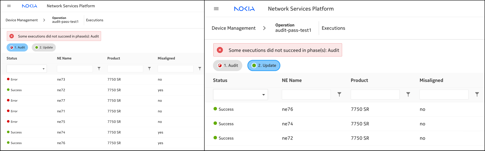

---
tags:
  - NSP
  - Workflow Manager
  - Device Operations
  - Artifact Manager
--- 

# Network Element Password Audit and Alignment

|     |     |
| --- | --- |
| **Activity name** | Network Element (NE) Password Audit and Alignment |
| **Activity ID** | 66 |
| **Short Description** | Audit the NE user password and align to the target password if misaligned  |
| **Difficulty** | Intermediate |
| **Tools used** |  |
| **Topology Nodes** | :material-router: PE1 |
| **References** |  |

## Objectives

Design, implement and test a custom two-phase **Device Operations** using the NSP Large-Scale Operations Manager (LSOM) framework to manage and synchronize NE user passwords.

## Technology Overview

**Device Operations** are part of the NSP *Device Management*, designed to support a wide range of operations including Audits, Backups/Restores and Software Upgrades.
To enable customizability, those operations are running programmable **workflows**, while LSOM orchstrates the execution of those workflows while improving the operational
experience by adding progress monitoring and execution control.

The target of any operation are devices, which depending on the use-case can be either a single network element or multiple.
Consequently, every workflow associated with an operation includes the `ne-id` (device identifier) as required input.
In our scenario, since we're managing nodal users, `username` and `password` become additional input parameters.

Our automation activity will require 3 artifacts to be created…
First, there is a workflow to audit the current password of the NE user to check for misaligments.
Second, there is another workflow to realign the user password in case there was a mismatch.
Third, there is the operation, bringing everything together.

Finally, to simplify the transfer and installation of these 3 artifacts that belong together,
you will package everything together becoming an `artifact bundle`.

## Artifact Bundle

To implement the device operation that orchestrates multiple workflows, the operation must adhere to a prescribed directory structure.
Each file and component within this structure fulfills a specific function ensuring clean modularity between the execution logic and the user interface definition.

| Path                                                                               | Description                                                       |
|------------------------------------------------------------------------------------|-------------------------------------------------------------------|
| `metadata.json`                                                                    | **Artifact Bundle meta-data**                                     |
| `workflows/`                                                                       | **Directory for workflows**                                       |
| \|__`audit-misaligned-pass/`                                                       |                                                                   |
| &nbsp;&nbsp;&nbsp;&nbsp;&nbsp;&nbsp;\|__`audit-misaligned-pass-<< groupId >>.yaml` | Workflow #1 to audit the NE password                              |
| \|__`force-update-pass/`                                                           |                                                                   |
| &nbsp;&nbsp;&nbsp;&nbsp;&nbsp;&nbsp;\|__`force-update-pass-<< groupId >>.yaml`     | Workflow #2 to realign the password if misalignment exists        |
| `operation-types/`                                                                 | **Directory for operation-types**                                 |
| &nbsp;&nbsp;&nbsp;&nbsp;&nbsp;&nbsp;\|__`operation_types.json`                     | Operation-type meta information                                   |
| &nbsp;&nbsp;&nbsp;&nbsp;&nbsp;&nbsp;\|__`misaligned-pass-<< groupId >>.yang`       | Operational model (in YANG) defining operation input and output   |
| &nbsp;&nbsp;&nbsp;&nbsp;&nbsp;&nbsp;\|__`misaligned-pass-<< groupId >>.yaml`       | Mapping profile: Defines phases with workflow references          |

/// warning

The YANG-defined operation input (and output) is provided and persisted in clear-text.
As this applies to every field regardless of confidentiality, having user passwords unencrypted impacts applicability for production environments.
///

## Tasks

/// warning
Remind, that you are using a single NSP system (shared), that is used for all groups. Therefore, ensure
your group-number is part of the operation and workflow names you are creating to ensure uniqueness.
///

**You should read these tasks from top-to-bottom before beginning the activity.**

It is tempting to skip ahead but tasks may require you to have completed previous tasks before tackling them.  

### Workflow 1 - Password Audit

First, lets create the workflow to audit the NE user password.
The general flow is the following:

1. Retrieve the current password from the NE
2. Compare it to the configured target password
3. Generate an audit result indicating compliance or deviation

NSP Workflow Manager user OpenStack Mistral, while we've added a lot of actions and expressions to tailor it for network automation.
[Click here](https://network.developer.nokia.com/learn/24_11/programming/workflows) for a quick starter guide on writing workflows.

To keep things efficient, we are providing you with the complete workflow code.

/// details | Possible solution (only look here as a last resort!)
    type: success

/// note
Keep in mind that this workflow execution is intended to fail if the password is a match (or aligned) while it is expected to succeed if there is a misalignment. The reason behind this change is to faciliate the LSO flow to transition from Audit to Align phase.
///

```yaml
version: '2.0'

audit-misaligned-pass-<<groupId>>:
  tags:
    - LSO

  input:
    - neId ## mandatory input for LSO operations
    - username ## NE User to validate
    - password ## Expected password

  output:
    lsoInfo: <% $.lsoInfo %> ## mandatory output for LSO operations
    misaligned: <% $.misaligned %> ## mandatory output leaf parameter defined in misaligned-pass.yang 

  output-on-error:
    lsoInfo: <% $.lsoInfo %> ## mandatory output for LSO operations for errors
    misaligned: <% $.misaligned %> ## mandatory output leaf parameter defined in misaligned-pass.yang 

  vars:
    lsoInfo: Failed
    lsoStageError: Unknown ## mandatory for LSO operations stage level errors

  tasks:
    checkUsernameIsAdmin:
      action: std.noop
      on-success:
        - avoidAdmin: <% $.username = "admin" %>
        - getAdminPass: <% $.username != "admin" %>

    avoidAdmin:
      action: std.fail
      publish-on-error:
        lsoInfo: "Info: Admin user cannot be used as input"
        lsoStageError: Admin user cannot be used as input

    getAdminPass: ## access the configured hashed password via MDC API
      action: nsp.https
      input: 
        url: https://restconf-gateway/restconf/data/network-device-mgr:network-devices/network-device=<% $.neId %>/root/nokia-conf:/configure/system/security/user-params/local-user/user=<% $.username %>
        resultFilter: $.content.get("nokia-conf:user").first().password
      publish:
        nePass: <% task().result.content %>
        lsoInfo: <% task().result.content %>
      publish-on-error:
        lsoInfo: "Error: Failed to get <% $.username %> user password"
        lsoStageError: <% task().result %>
      on-success:
        - checkMisalignment

    checkMisalignment: ## Check alignment of configured password with the password provided as input
      action: nsp.python
      input:
        context: <% [$.password, $.nePass] %>
        script: |
          import bcrypt
          if bcrypt.checkpw(context[0].encode("utf-8"), context[1].encode("utf-8")):
            return "no"
          else:
            return "yes"
      publish:
        misaligned: <% task().result %>
        lsoInfo: <% task().result %>
      publish-on-error:
        lsoInfo: "Error: Failed to check for misalignment"
        lsoStageError: <% task().result %>
      on-success:
        - adminPassAligned: <% $.misaligned = "no" %>

    adminPassAligned: ## handle misalignment information
      action: std.fail
      publish-on-error:
        lsoInfo: "Info: Password of <% $.username %> user is aligned"
        lsoStageError: Password of <% $.username %> user is aligned
```
///

The YAML syntax for writing workflows is very intuitive, as it uses simple English expressions to describe the
execution and data flow including conditional statements. Please study the workflow code carefully, to get used
to the syntax and principles, as soon you will write your first own workflow.

Observations:

* Some specific rules apply to make the workflow fit the needs of LSO. Have a look, how the environment/output variables
  `lsoInfo` and `lsoStageError` are used. Those variables provide a feedback loop to *Device Operations* to understand
  execution progress and reasoning of the result.
* NSP uses the `admin` user for mediation (CLI, xFTP, NETCONF and gRPC). As we don't want to break your lab, an initial
  check is done to avoid updating the admin users password by accident.
* The workflow input needs to fit the needs of the operation, so it needs to match the operation model (while values
  could also be statically set in the mapping profile).
* The general logic in LSOM is, that only target that have successfully passed one phase are considered for the execution
  of the next phase(s). That's why, we need to be careful about the execution state we are returning. If and only if the
  check was executed successfully, but we found a misalignment, the workflow will return `success`. Aka, the target device
  would be selected for the next phase, to realign the password. In all other cases, like if the password was aligned, we
  mark the target as `failed` and the target would not be considered for realignment of the password.

/// note | Give it a try!

You don't need to wait until everything comes together as operation, you can try out the workflow right now.
You may user either NSP WebUI or Visual Studio Code (or code-server) with the NOKIA WFM extension to create
and run the workflow. For now, you can use the `admin` user, but ideally you can already create another NE
user like `nsptest`.
///

/// details | Want to create a NE user using MD-CLI?
    type: tip

```bash
edit-config private
configure system security user-params local-user user nsptest password t0ps3creT.
commit
```

Same could be used to update the user password at any time.
///

### Workflow 2 - Update/Align User Password

Now that you are familiar with the mechanics and structure of workflows, turn is on you to create the second workflow all
by yourself. While the first workflow was about identifying misalignments, the second workflow is update the NE user
password to match the provided password.

Create a workflow called force-update-pass-`<<groupId>>`. You may user either NSP WebUI or Visual Studio Code (or code-server)
with the NOKIA WFM extension to create and run the workflow. Test your workflow properly before you continue!

/// details | Hint
    type: tip

1. In the first workflow we've used the NSP RESTCONF API to access the device using the device model.
   In MD-CLI you may use `info json` and `pwc model-path` to help constructing the resource URI and
   the body payload. But it might be even simpler: The URI from reading the user password contains
   all details to construct the corresponding write request.
2. In RESTCONF there are multiple ways to update the password. You may decide to use HTTP PUT, to
   **replace** the current password value. You may use HTTP PATCH, to **merge** it. The most
   flexible way is using **YANG PATCH** (RFC8072).
3. To execute a RESTCONF call, ultimately you can use WFM action `nsp.https`.
4. If you feel more comfortable usign CLI you may consider using `nsp.mdm_cli`.

We provide you with a working, but only look there if you totally get stuck as last resort!
Try to figure it out yourself, and if you hit a roadblock ask the hackathon support team.
Remind, the provided working example is not the only solution possible. You are free to use the
[nsp.mdm_cli](https://network.developer.nokia.com/learn/24_11/programming/workflows/wfm-workflow-development/wfm-workflow-actions)
action which would perform the same usign CLI commands. Or why not getting used to the NETCONF protocol
using action [netconf.configure](https://network.developer.nokia.com/learn/24_11/programming/workflows/wfm-workflow-development/wfm-workflow-actions)?

Whatever path you go, if **your code** works, that's great while you've achieved something!
///

/// details | Possible solution (only look here as a last resort!)
    type: success

```yaml
version: '2.0'

force-update-pass-<<groupId>>:
  tags:
    - LSO

  input:
    - neId
    - username
    - password

  output:
    lsoInfo: <% $.lsoInfo %>
    misaligned: <% $.misaligned %>

  output-on-error:
    lsoInfo: <% $.lsoInfo %>
    misaligned: <% $.misaligned %>

  vars:
    lsoInfo: Failed
    lsoStageError: Unknown
    misaligned: "yes"

  tasks:
    checkUsernameIsAdmin:
      action: std.noop
      on-success:
        - avoidAdmin: <% $.username = "admin" %>
        - updateAdminPass: <% $.username != "admin" %>

    avoidAdmin:
      action: std.fail
      publish-on-error:
        lsoInfo: "Info: Admin user cannot be used as input"
        lsoStageError: Admin user cannot be used as input

    updateAdminPass: ## update the NE User password using MDC API
      action: nsp.https
      input:
        method: PATCH 
        url: https://restconf-gateway/restconf/data/network-device-mgr:network-devices/network-device=<% $.neId %>/root/
        accept: application/yang-data+json
        contentType: application/yang-patch+json
        body:
          ietf-yang-patch:yang-patch:
            patch-id: patch-pass
            edit:
              - operation: merge
                target: nokia-conf:/configure/system/security/user-params/local-user/user=<% $.username %>
                edit-id: edit-pass
                value:
                  nokia-conf:user:
                    user-name: <% $.username %>
                    password: <% $.password %>
      publish:
        misaligned: "no"
        lsoInfo: <% task().result.content %>
      publish-on-error:
        lsoInfo: "Error: Failed to update <% $.username %> user password"
        lsoStageError: <% task().result %>
```
///

Now that we have learnt and tried how to audit and force update NE password misalignments individually, lets see how to combine them into a single operation.

### Operation Type

First part of creating an LSO operation is defining the operation type. This is done as part of the operation_types.json

/// details |  operation_types.json
    type: success

/// warning
Code comments are defined purely for readability. Make sure the comments are removed when saving the file.
///

```json
{
  "operation-type": {
    "name": "misaligned-pass-<< groupId >>", // same as the bundle name
    "description": "Operation for Misaligned Pass << groupId >>", // short description
    "category": "other", // default (do not change)
    "created-by": "nsp_internal_system_user", // default (do not change)
    "operation-model": "misaligned-pass-<< groupId >>.yang", // <bundle-name>.yang
    "profile": "misaligned-pass-<< groupId >>.yaml", // <bundle-name>.yaml
    "life-cycle-state": "released",
    "additional-tag": ["LSO", "SR OS"],
    "version": "1.0.0"
  }
}
```

///

### Operation Input-Output

Regardless of whether the operation is single-phase or multi-phase, all phases share the same input and output parameters.
If you believe a particular phase does not require certain inputs, default values can also be defined within the phase
definition itself (which we’ll cover in the next section).

/// note
The input and output for any LSO operation are defined using YANG format.
///

/// details | Hint
    type: tip

When creating the operation's YANG file, keep the following points in mind:

1. The module name, prefix, and the final segment of the namespace (after the colon) must all match.
2. The when clause of the augment statement, the value being compared should always be the module name.
3. Only the container elements within the two augment sections should be modified based on the specific requirements.

///
/// details |  misaligned-pass`-<< groupId >>`.yang
    type: success

/// warning
Code comments are defined purely for readability. Make sure the comments are removed when saving the file.
///

```yang
module misaligned-pass-<< groupId >> {
  yang-version 1.1;
  namespace "urn:nokia:nsp:model:lso:operation:misaligned-pass-<< groupId >>";
  prefix misaligned-pass-<< groupId >>;

  import nsp-lso-operation { // dont not change
    prefix nlo;
  }

  organization "Nokia"; // dont not change
  contact "";
  description "Operation for Misaligned Pass"; // same short description as provided in operation_types.json

  revision 2024-10-08 {
    description "version 1";
    reference "";
  }

  augment "/nlo:lso-operations/nlo:operation" {
    when "operation-type='misaligned-pass-<< groupId >>'"; // compare parameter has to be the module name always
    description "Augmentation of operation input";
    container misaligned-pass-<< groupId >>-operation { // syntax: <module-name>-operation
      leaf username {
        type string;
        mandatory true;
        description "Admin username of the node";
      }
      leaf password {
        type string;
        mandatory true;
        description "Intended password on the node";
      }
    }
  }

  augment "/nlo:lso-operations/nlo:operation/nlo:executions/nlo:execution" {
    when "../../operation-type='misaligned-pass-<< groupId >>'"; // compare parameter has to be the module name always
    description "Augmentation of operation execution state data";
    container misaligned-pass-<< groupId >>-execution { // syntax: <module-name>-execution
      leaf misaligned {
        type string;
        description "Indicates misalignment of password";
      }
    }
  }
}
```

///

With the operation's input & output defined lets see how we define the phase.

### Operation Phases

/// details | misaligned-pass`-<< groupId >>`.yaml
    type: success

```yaml
phases:
  - phase: Audit ## Phase 1
    description: Audit for misaligned Admin user password
    concurrency_count: 20 ## No. of NE on which the phase can run concurrently
    phase_timeout: 15
    ne_families:
      - family_type: 7750 SR, 7950 XRS, 7450 ESS, 7250 IXR ## NE family on which this WF phase can be executed on
        ne_versions:
          - version: all
            workflow_name: audit-misaligned-pass-<< groupId >> ## workflow to be called on the execution of this phase
            workflow_inputs: ## not default inputs (leave it empty)
```

///

Now that we're familiar with writing the Audit phase, I'll let you work out how to construct the Update/Align phase.

/// details | Possible solution (only look here as a last resort!)
    type: success

/// details | Update/Align Phase

```yaml
  - phase: Update ## Phase 2
    description: Force update Admin user password
    concurrency_count: 20
    phase_timeout: 15
    ne_families:
      - family_type: 7750 SR, 7950 XRS, 7450 ESS, 7250 IXR
        ne_versions:
          - version: all
            workflow_name: force-update-pass-<< groupId >>
            workflow_inputs:
```

///
///

Now that we've created all the files related to the LSO operation, let's consolidate this information into an operation metadata file. This file enables NSP to verify the integrity of the operation file and determine the target application onto which the files should be deployed.

### Operation Metadata

/// details | metadata.json
    type: success

/// warning
Code comments are defined purely for readability. Make sure the comments are removed when saving the file.
///

```json
{
  "meta-data-header": {
    "version": "1.0.0",
    "buildNumber": "1",
    "formatVersion": "1.0",
    "createdBy": "SRX Hackathon 2025",
    "creationDate": "Tue, 06 May 2024 00:00:00 UTC",
    "title": "Operation for Misaligned Pass << groupId >>", // Operation Type title
    "description": "Operation for Misaligned Pass" // short description of Operation Type
  },
  "artifact-meta-data": [
    {
      "name": "misaligned-pass-<< groupId >>",
      "version": "1.0.0", // same as the version in meta-data-header
      "targetApplication": "lsom-server-app", // mandatory do not change
      "applicationCompatibility": "23.3+", // NSP release from which the operation can be executed on
      "artifact-content": [
        {
          "fileName": "misaligned-pass-<< groupId >>.yaml",
          "path": "operation-types",
          "type": "application/octet-stream"
        },
        {
          "fileName": "misaligned-pass-<< groupId >>.yang",
          "path": "operation-types",
          "type": "application/octet-stream"
        },
        {
          "fileName": "operation_types.json",
          "path": "operation-types",
          "type": "application/octet-stream"
        }
      ]
    },
    {
      "name": "audit-misaligned-pass-<< groupId >>",
      "version": "1.0.0",
      "targetApplication": "workflow-manager", // mandatory do not change
      "applicationCompatibility": "23.3+",
      "artifact-content": [
        {
          "fileName": "audit-misaligned-pass-<< groupId >>.yaml",
          "path": "workflows/audit-misaligned-pass",
          "type": "application/octet-stream"
        }
      ]
    },
    {
      "name": "force-update-pass-<< groupId >>",
      "version": "1.0.0",
      "targetApplication": "workflow-manager", // mandatory do not change
      "applicationCompatibility": "23.3+",
      "artifact-content": [
        {
          "fileName": "force-update-pass-<< groupId >>.yaml",
          "path": "workflows/force-update-pass",
          "type": "application/octet-stream"
        }
      ]
    }
  ]
}
```

///

### Execution

Now that we have all the necessary filed and directory structure in place,

1. Lets ZIP the directory content and install the package into NSP using the Artifact Admin Application.
2. Rename the file to misaligned-pass-<< groupId >>.zip
3. Once the Artifact has been installed. go to the Device Management App.
4. From the dropdown select All Operations and create a new Operation from `+OPERATION` button on top right.
5. Provide in the necessary input and click Run.

/// warning
If you are compressing to zip on MacOS, run the following commands to remove unnecessary system files:

```bash
zip -d Archive.zip __MACOSX/\*
zip -d Archive.zip \*/.DS_Store
```
///

/// details | Sample result

///

## Summary and review

Congratulations!  If you have got this far you have completed this activity and achieved the following:

* You have learnt how to write Workflows
* You have learnt how to combine workflows to make an LSO Operation
* You have learnt to build NSP Artifacts
* You have learnt how to use RESTCONF APIs to interact with MD nodes managed in NSP
* You have worked with YANG modeled data

This is a pretty extensive list of achievements! Well done!

If you're hungry for more feel free to explore the same activity for an SRL node.
