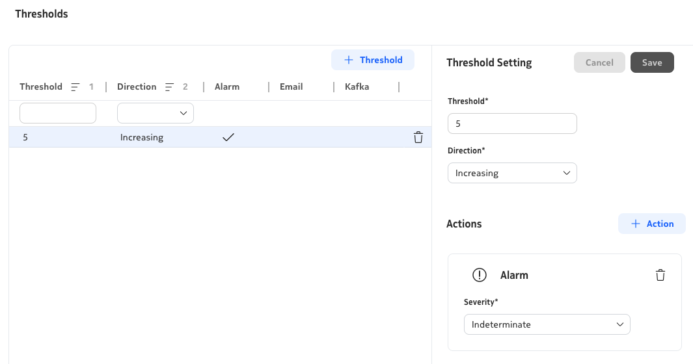
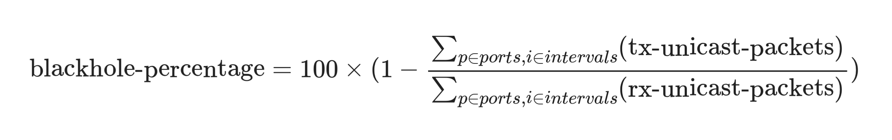

# Blackholing Detection

|     |     |
| --- | --- |
| **Activity name** | Blackholing Detection |
| **Activity ID** | 35 |
| **Short Description** | Monitor nodal ingress and egress traffic to detect potential blackholing events |
| **Difficulty** | Intermediate |
| **Tools used** | NSP Indicator Analytics |
| **Topology Nodes** | :material-router: PE1 :material-router: P1 |
| **References** | [Developer Portal](https://network.developer.nokia.com) <br/> [NSP Indicators](https://documentation.nokia.com/nsp/25-11/NSP_Data_Collection_and_Analysis_Guide/dca_indicators.html) <br/> [Object Filters](https://documentation.nokia.com/nsp/25-11/NSP_Data_Collection_and_Analysis_Guide/ob_filter_intro.html) <br/> [Object Filters Details](https://documentation.nokia.com/nsp/25-11/NSP_Data_Collection_and_Analysis_Guide/how_filters.html) |

## Objectives

At scale, one of the hardest failures to catch is traffic that disappears *inside* the network: routing mistakes, hardware faults, resource pressure, or policy errors can all drop or strand packets, yet the outage often stays invisible until it shows up as user-visible slowness, support churn, or SLA risk. Teams frequently fall back on platform-local clues such as queue drops and forwarding-error counters, but those signals differ by chipset, line card, and software release, so they do not compose into one portable playbook you can run everywhere.

In this activity, you implement blackholing detection in NSP using *nodal traffic symmetry* (aggregate ingress versus egress at a node). You create an indicator, validate it with a controlled fault, and use the alarm as an early prompt for deeper investigation.

## Technology Explanation

### Indicator Analytics

An indicator is a persistent telemetry subscription that can optionally apply a formula across one or more raw counters, then evaluate the result against one or more threshold rules.

### Object Filters

Each indicator is scoped to a set of resources through an XPath object filter, written against the NSP model. The filter determines which network objects — ports, interfaces, nodes — contribute data to the indicator formula.

### The Traffic Symmetry Principle

IP routers and Ethernet switches are forwarding devices. This means the aggregate number of packets received across all active interfaces should equal the aggregate number transmitted. A persistent deviation from this balance indicates that some traffic is entering the node but not leaving — a blackholing condition.

/// details | Why use unicast packet counters and not byte counters?
    type: question

Routers may add or strip encapsulation headers, so the byte count of a packet can legitimately change between ingress and egress without any loss occurring. This is especially true for Layer-2 services (ELINE, ELAN), where the per-packet overhead can be significant because the L2 header is preserved end-to-end. Packet counts are unaffected by this overhead.

Moreover, broadcast, multicast, and unknown-flooded traffic may be replicated to multiple egress interfaces, so ingress and egress are not expected to match one-to-one for those kinds of traffic. Packet-handling side effects such as QoS/ACL behavior also affect symmetry, and IP fragmentation can produce multiple egress packets from one ingress packet.

///

### Threshold Crossing Alerts (TCA)

When an indicator formula value rises above (or falls below) a configured threshold, NSP emits a TCA alarm. Alternatively, TCA events can be published to Kafka. Each event includes the indicator name, the threshold that was crossed, the actual measured value, and a timestamp.

/// details
    type: note

Because the chosen approach to measuring imbalance produces some expected *background noise*, a threshold above 1% is recommended rather than triggering on every deviation.

Due to the telemetry collection, aggregation, and evaluation pipeline, alarms and visualization updates lag 3–4 minutes behind real network conditions when using the minimum supported interval. When triggering a test condition, allow for this delay before concluding the indicator is not working.

///

## Tasks

**You should read these tasks from top to bottom before beginning the activity.**

It is tempting to skip ahead, but tasks may require you to have completed previous tasks before tackling them.

/// warning
Remember that you are using a shared NSP system. Include your group number in every activity you perform.
///

### Quick start on NSP Web UI

|     |     |
| --- | --- |
| **NE Session** | `☰` → `Network Search and Inventory` → find your group's PE node (for example `g7-pe1`) → open the row context menu `⋮` → `Open in NE Session`. |
| **NSP Help** | `?` icon at the top right for context-aware quick help and to open the Help Center. On some pages, the `?` icon also links directly to related Help Center articles. |
| **Telemetry Statistic Search** | `?` icon at the top right → Under `Reference ▼` → `Statistics Search ▶` → `Telemetry Statistic Search` tool |
| **Inventory** | `☰` → `Network Search and Inventory` |
| **Indicator Analytics** | `☰` → `Data Collection and Analysis` → `Management` → select `Indicators` from the dropdown |
| **Workflow Manager** | `☰` → `Workflows` |

### Quick Start on NSP Telemetry

Navigate into NSP **Inventory**:

1. Select a node such as `g2-p1` (replace `g2` based on your group).
2. Open the row context menu `⋮` and choose `Plot statistics`.
3. Wait about one minute, then review the CPU and memory graphs.
4. Click `Configure` and inspect the telemetry settings.

Repeat the procedure for a port:

1. Select port `1/1/c1/1` on `g2-p1` (replace `g2` based on your group).
2. Open the row context menu `⋮` and choose `Plot utilization statistics`.
3. Wait about one minute and confirm these four counters are plotted: input and output utilization, received and transmitted octets (periodic).
4. Click `Configure` and inspect the telemetry settings.

/// details | Configuration details
    type: note

**For node:**

- Collection Interval: `10 sec`
- Telemetry Type: `telemetry:/base/system-info-system`
- Counters: `cpu-usage`, `memory-used`
- Object Filter: `/nsp-equipment:network/network-element[ne-id='fd00:fde8::2:11']`

**For port:**

- Collection Interval: `10 sec`
- Telemetry Type: `telemetry:/base/interfaces/utilization`
- Counters: `input-utilization`, `output-utilization`, `received-octets-periodic`, `transmitted-octets-periodic`
- Object Filter: `/nsp-equipment:network/network-element[ne-id='fd00:fde8::2:11']/hardware-component/port[component-id='shelf=1/cardSlot=1/card=1/mdaSlot=1/mda=1/port=1/1/c1/breakout-port=1/1/c1/1']`

Note: The `ne-id` used in the example is specific to group 2.

///

/// note
The XPath filters used above are *instance filters*, where the filter uniquely identifies a single resource. Object filters can also select groups of resources based on specified criteria.
///

Ports can also `Plot error statistics` via `telemetry:/base/interfaces/interface-errors`. Feel free to visualize these as well.

To check which telemetry types and counters are available, navigate to the `Telemetry Statistic Search` tool. In this activity, we will use `telemetry:/base/interfaces/interface` because this telemetry type includes the packet counters needed for traffic symmetry checks: `received-unicast-packets-periodic` and `transmitted-unicast-packets-periodic`.

### Create and Visualize a Traffic Indicator

1. Navigate to **Indicator Analytics**. Click on `+ Indicator` on the top right of your screen. Use the following information to fill in the required form:

    /// details | Indicator Configuration
        type: example
        open: true

    ```yaml
    General:
      Name: G2-PORTS-TX
      Collection Interval: 30 secs
    Configuration:
      Telemetry Type: telemetry:/base/interfaces/interface
      Selected Counters: transmitted-octets-periodic
    ```

    Use the following `Object Filter` (XPath syntax):
    ```yaml
    /nsp-equipment:network/network-element[contains(ne-name, 'g2-')]/hardware-component/port[(oper-state='enabled') and boolean(port-details[port-type = 'ethernet-port'])]
    ```

    **NOTE:** Replace `g2` with your group number. This indicator is for visualization only. Do not add any thresholds.

    ///

    /// details 
        type: debug

    Before saving an indicator, use `Verify Resources` to resolve the filter against live inventory and confirm it matches exactly the set of objects you expect. Click `Stop Verification` when you are satisfied with the result.

    ///

2. Click `Create` to add and activate the Indicator.

3. To visualize your indicator, click the three dots next to the entry and choose `Open in Data Collection and Analysis Visualization`. Select one or more ports (for example `g2-p1 / 1/1/c1/1`), and confirm you can plot the metric.

    /// tip
    If you see the error **Invalid telemetry filter**, the filter is either syntactically wrong or returns no matching resources. If you copied and pasted the filter above and still see the error, you probably did not update it for your group; with access control applied, no ports are returned.

    You can validate the filter in Workflow Manager by executing action `nsp.https` with RPC `nsp-inventory:find` and the following input:

    ```yaml
    url: https://restconf-gateway/restconf/operations/nsp-inventory:find
    body:
      input:
        xpath-filter: /nsp-equipment:network/network-element[contains(ne-name, 'g2-')]/hardware-component/port[(oper-state='enabled') and boolean(port-details[port-type = 'ethernet-port'])]
        include-meta: false
    method: POST
    ```

    Paste your indicator's object filter into `xpath-filter` and run it to:

    - Verify filter syntax
    - Check how many resources match
    - Inspect returned objects and refine the filter
    ///

### Create a Basic Blackhole Detection Indicator

Now create a new indicator that serves as a loss signal for `P1`. You will keep the previous indicator intact and visualize both side-by-side later.

Here are the differences compared to the simple indicator you've created before:

- Window duration: `1 minute`
- Select packet counters for receive and transmit (periodic unicast packets)
- Object filter: scope to `P1` only in your group (for example: `g2-p1`)
- Add a formula that calculates RX/TX asymmetry using bracketed counter names, for example `{received-unicast-packets-periodic_avg}`
- Add the Threshold setting to define the alert. Change the value based on the aggregate you perform.

  /// details | Sample Threshold Alert Setting
  
  ///

/// note
In formulas, you use aggregated window fields (`_min`, `_max`, `_avg`, `_sum`) rather than raw counters.

With a `30 sec` collection interval and `1 minute` window duration, each tumbling window contains two samples per resource. You can choose min/max/avg/sum depending on which aggregation rule best matches your requirements.
///

/// details | Help (if getting stuck)
    type: success
| Section | Field | Value |
|---|---|---|
| General | Name | G2-BLACKHOLE-P1 |
|  | Collection Interval | 30 secs |
|  | Window Duration | 1 minute |
| Configuration | Units | packets |
|  | Telemetry Type | `telemetry:/base/interfaces/interface` |
|  | Selected Counters | `transmitted-unicast-packets-periodic received-unicast-packets-periodic` |
|  | Formula | `{received-unicast-packets-periodic_sum}-{transmitted-unicast-packets-periodic_sum}` |
|  | Object Filter | `/nsp-equipment:network/network-element[ne-name = 'g2-p1']/hardware-component/port[(oper-state='enabled') and boolean(port-details[port-type = 'ethernet-port'])]` |
///

When you run `Verify Resources`, you should see the 8 active Ethernet ports on P1. Visualize port `1/1/c1/1` to inspect the symmetry behavior.

/// warning
Indicator values are delayed by approximately 3-4 minutes. If you see "No Data" right after creation, you may need to wait until the first data values are available.
///

Key takeaways:

- Tumbling windows update once per window interval, not continuously.
- `_min`, `_max`, `_avg`, `_sum` represent different aggregation rules for resource counters.
- At this stage, each interface is still evaluated individually (no cross-interface aggregation yet).

### Testing the Blackhole Indicator

Visualize both indicators `G2-PORTS-TX` and `G2-BLACKHOLE-P1` for node `g2-p1` port `1/1/c1/1` together.

Open a **NE Session** on `PE1` from the NE Inventory and run the following command:

```bash
$ ping 10.46.2.11 interval 0.01 count 100000 output-format summary
```

This generates ~100 ICMP packets per second for around 15 minutes.

!!! note
    Use your group-specific target IP: `10.46.{grp}.11`

Open another CLI session on `P1` and add a management access filter to simulate blackholing:

!!! abstract "Management Access Filter (MAF) Configuration on P1"
    ```bash
    edit-config private
    /configure system security management-access-filter ip-filter
      admin-state enable
      default-action accept
      entry 10 {
          action drop
          match {
              protocol icmp
          }
      }
    commit
    exit all
    quit-config
    ```

To allow ICMP again (clear fault), disable the filter:

!!! abstract "Disable MAF (P1)"
    ```bash
    edit-config private
    /configure system security management-access-filter ip-filter admin-state disable
    commit
    quit-config
    ```

To reproduce the fault again, enable it:

!!! abstract "Re-enable MAF (P1)"
    ```bash
    edit-config private
    /configure system security management-access-filter ip-filter admin-state enable
    commit
    quit-config
    ```

### Blackhole Detection as Aggregate Across Interfaces

Traffic can enter on one interface and leave on another.  
To evaluate node-level behavior, aggregate across all active Ethernet ports.

You may use resource aggregation functions such as `min()`, `max()`, `avg()`, `sum()`.

Example:

- `max({transmitted-unicast-packets-periodic_max})` gives the peak TX load among all selected interfaces in the window.

Now update your blackhole formula to compute a node-level aggregate.

/// details | Help (if getting stuck)
    type: success
```yaml
  Formula: sum({received-unicast-packets-periodic_sum}-{transmitted-unicast-packets-periodic_sum})
```
///

### Blackhole Detection as Ratio

Formulas support operators `+`, `-`, `*`, `/`, absolute value (`|value|`), parentheses, and constants. Update the formula to express packet loss as a percentage. Your math looks like this:

{: style="max-width: 600px; height: auto; display: block; margin-left: auto; margin-right: auto; border-radius: 10px;"}

/// details | Help (if getting stuck)
    type: success
```yaml
  Formula: sum({received-unicast-packets-periodic_sum} - {transmitted-unicast-packets-periodic_sum}) / sum({received-unicast-packets-periodic_sum}) * 100
```
///

Then set a threshold to alert when blackholing exceeds 5 percent.

### Simulate a Blackholing Event and Observe the Alert

Introduce a controlled fault:

1. Keep rapid ping running from `PE1` toward `P1`.
2. Enable the management access filter (MAF) on `P1` to drop ICMP.
3. Watch indicator behavior and alarms over the next few minutes.

/// note
From the indicator perspective, packets appear on ingress. The CPM will discard the ICMP ping requests before processing. Therefore, no responses appear at egress, which is the blackholing signature you are trying to detect.
///

Return to visualization. After 3-4 minutes the asymmetry ratio should rise above the threshold. A marker in the graph will signal that the threshold was crossed. The TX volume indicator still shows traffic arriving; the ratio reveals that a growing share is not leaving. Check alarms and confirm that alerts clear after you remove the fault.

### View alarms via WF Kafka trigger

Due to access-control restrictions in your setup, the `IndicatorThresholdCrossingEvent` may not appear in the Current Alarms view. To work around this, navigate to **Workflow Manager** → **Workflow Executions**, locate a run whose name matches `srx-alarm-kafka-payload`. On a shared system there may be several runs; pick one tied to your test window. Use **Input/Output** to confirm how alarm fields appear for downstream logic.

/// details | Sample TCA Alert Payload
    type: example

This workflow listens for indicator-related Kafka alarm events (CREATE conditions) on the `nsp-db-fm` topic and displays the content of any alarms that are raised.

```yaml
result:
  additionalText: |-
    Threshold Crossing:
    - threshold-value: 5
    - direction: RISING
    - value: 80.5900
    - event-time: 2026-05-14T01:09:00Z
    - resource: N/A
  affectedObject: >-
    fdn:yang:nsp-indicator:/nsp-indicator:rta-indicator-rules/rule[name='G2-BLACKHOLE-P1']
  alarmName: IndicatorThresholdCrossingEvent
  affectedObjectType: nsp-indicator:rta-indicator-rules/rule
  sourceType: nsp
  sourceSystem: fdn:app:nsp-indicator
  probableCause: thresholdCrossed
  affectedObjectName: G2-BLACKHOLE-P1
```
///

## Summary

Congratulations. In this activity you built a practical workflow to detect potential traffic blackholing on a single node:

- You started with a simple traffic-visualization indicator.
- You added a formula-based asymmetry indicator for `P1`.
- You validated object filters and resource selection.
- You simulated and cleared a controlled ICMP drop fault with MAF.
- You correlated CLI actions with delayed indicator and alarm behavior.

The key idea is intentionally simple: use widely available packet telemetry to detect suspicious traffic disappearance without relying on platform-specific logic.

Because this approach is statistical, some baseline imbalance is expected.  
A threshold such as 5 percent helps separate normal variation from events worth investigating.

## Next Steps

If your lab includes SR Linux nodes, try applying a similar indicator to them to validate that your solution works universally in heterogeneous environments. Indicator templates can help you deploy blackhole detection consistently across multiple nodes.

You can also explore other indicators. For example, you could build an interface burst indicator using the ratio of `_max` to `_avg` with a 30-second collection interval and a 5-minute window. The same principles apply, making indicators a powerful way to detect abnormal patterns proactively.
