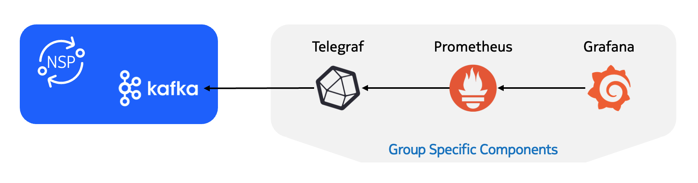
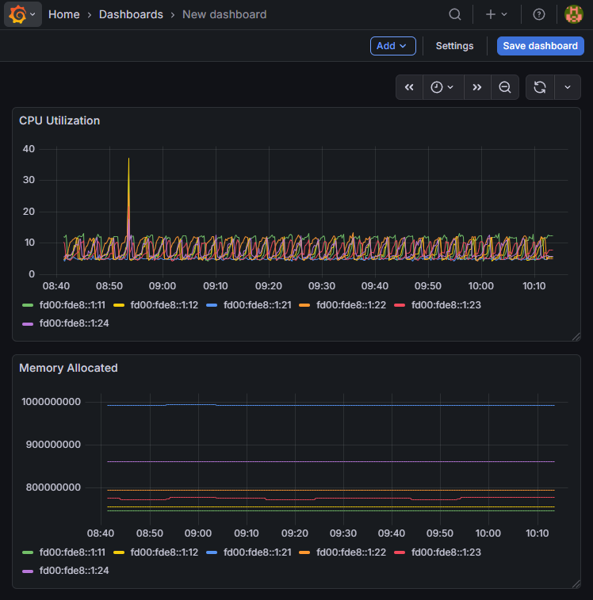

# Visualize Telemetry Data with Grafana

|     |     |
| --- | --- |
| **Activity name** | Visualize Telemetry Data with Grafana |
| **Activity ID** | 43 |
| **Short Description** | Visualize telemetry data collected by NSP in an external Grafana instance |
| **Difficulty** | Intermediate |
| **Tools used**              | [Telegraf](https://www.influxdata.com/time-series-platform/telegraf/)<br/>[Prometheus](https://prometheus.io/) <br/> [Grafana](https://grafana.com/docs/grafana/latest/)                                      
| **Topology Nodes** | any SR OS or SRL node |
| **References** | [NSP x Grafana Integration](https://network.developer.nokia.com/tutorials/integrating-customer-provided-grafana-instance-with-nsp-data-sources/) <br/> [NSP Telemetry Search Tool](https://documentation.nokia.com/nsp/25-11/NSPTST/NSP_STATS/html/stats.html) |

## Objective

Operations teams often run a single monitoring stack of dashboards and alerts in one place (for many networks and IT systems). When you add a new domain of Nokia routers under NSP, that domain’s metrics live in NSP unless you deliberately connect them to the rest of your tooling. The problem is fragmentation: you need the same Grafana-based “single pane of glass” you already rely on, without giving up NSP’s data collection for those devices.

This activity shows how the **same telemetry NSP collects** can appear in an existing Grafana instance **outside NSP**, alongside (not instead of) the charts you visualize in NSP’s own Data Collection and Analysis UI.

It is also a good way to get started with NSP's telemetry framework, because you can explore different telemetry types, try object filtering, and inspect the resulting data easily.

## Technology and Integration explanation

The path from devices to dashboards in this activity is: collection in NSP, export on Kafka, **Telegraf** between Kafka and Grafana, then dashboards in **Grafana**. The drawing below visualizes the setup:

{: style="height: auto; max-width: 600px; display: block; margin-left: auto; margin-right: auto;"}

### NSP Data Collection and Analysis

Data Collection and Analysis in NSP is a module that collects information from managed network elements. A predefined set of telemetry types covers many different metrics. Filtering rules (which elements and objects to include) let you control how and from where data is collected.

### Kafka

Apache Kafka is an open-source distributed event streaming application that publishes streams of records to named **topics**. The consumers read and process those streams in near real time, often with durable retention until downstream systems catch up. NSP uses Kafka to create telemetry subscriptions towards NE that external systems can futher consume. The underlying plumbing on how NSP Kafka connects with **Telegraf** is already prepared for you.

### Telegraf

Telegraf is an open-source data-collection agent that gathers metrics and events from configured inputs and forwards or stores them for configured outputs.

In this activity, Telegraf sits between Kafka and Grafana: it pulls (or receives) the stream from NSP’s side of the pipeline and makes the metrics available to downstream tools.

### Prometheus

Prometheus is a popular open-source time-series database. It is configured to scrape the Telegraf instance and store the retrieved metrics.

### Grafana

Grafana is an open-source analytics platform for dashboards and alerts: you connect data sources and build charts, exploration views, and operational views on top of that data.

In this activity, Grafana uses the Prometheus instance as a **data source**. From there you can build dashboards and panels (any visualization Grafana supports) for the metrics that arrived via NSP and Telegraf.

## Tasks

/// warning
Remember that you are using a shared NSP system. Ensure your group number is included in the identifier for objects you create (filename and any group-scoped names).
///

**You should read these tasks from top-to-bottom before beginning the activity.**

It is tempting to skip ahead, but tasks may require you to have completed previous tasks before tackling them.

### Quick start on NSP Web UI

|     |     |
| --- | --- |
| **NE Session** | `☰` → `Network Search and Inventory` → find your group’s PE node (for example `g7-pe1`) → open the row context menu `⋮` → `Open in NE Session`. |
| **NSP Help** | `?` icon at the top right for context-aware quick help and to open the Help Center. On some pages, `?` also links directly to related Help Center articles. |
| **Data Collection and Analysis** | `☰` → `Data Collection and Analysis` → `Management`. |

/// details | Telemetry Quick Start
[Blackholing Detection](nsp-activity-35.md#quick-start-on-nsp-telemetry) includes a “Quick Start on NSP Telemetry” section that may help you get started. It explains subscriptions and walks through creating your first one.
///

### Configure your Telemetry subscription

Click the **+ Subscription** button at the top right.

In the form, the **Name** and **Telemetry Type** fields are mandatory; the rest are optional (collection interval, object filter, and so on).

/// warning
Use your Group ID in the Name (for example, `tel-interface-10`)
///

The optional fields are still worth reviewing. For example:

- The **Collection interval** controls how often NSP samples the network elements. The default is `900 seconds (15 minutes)`, so with the default you get only one new data point every fifteen minutes, which can be too slow when you are trying out charts and Grafana panels.
  > Try lowering the interval while you are experimenting. Then tighten it again if you need more control over the load.

- If you define a subscription without an **Object Filter**, NSP tries to subscribe to all network elements and objects that match the selected telemetry type. For example, a subscription with telemetry type `telemetry:/base/interfaces/interface` and no object filter creates interface statistics subscriptions for every interface on every managed network element.

We recommend specifying an object filter when you are getting started. It makes the behavior easier to understand and limits how much data you will visualize in Grafana later.

Feel free to start with a common metric such as port or interface traffic statistics, walk through the tasks, and repeat later with a different metric.

/// details | Identifying Telemetry Types
NSP uses dedicated telemetry types to define network element data paths and the kinds of metrics collected. To map a telemetry type to paths on the element (or the reverse), use the **Telemetry Statistics Search Tool** in the NSP Help Center.
///

For this activity, also enable:

- **Enable notifications and notification counters**
  > so NSP publishes collected data to the Kafka stream

- **Specify a custom notification topic**
    - `ns-eg-tel-grafana-{groupId}-{counter}`
      > so Telegraf can consume the collected data
      > use only **1** or **2** as the counter value

The Telegraf instance is preconfigured to consume Kafka topics in NSP that follow the pattern above. Because each group has its own Telegraf instance, only that group's data is consumed and written to the Prometheus database.

#### Verify data collection with NSP (optional)

In the subscription list, open the **context menu** (three dots on the right) for your subscription and choose **Open in Data Collection and Analysis Visualizations**.

You get a wizard much like the subscription editor: it starts from your saved settings, which you can still adjust for plotting. If **Counter** is not already set, select one. Then choose **Plot** to render graphs for the metrics you picked.

/// note
One visualization definition in NSP can show **at most 10** charts. Keep the object filter and the number of counters modest so you stay under that cap.
///

When you are satisfied that NSP is collecting data, move on to Grafana. Connecting NSP to Grafana is not part of this exercise (the lab has already done it). For background, see Nokia’s tutorial on [integrating a customer-provided Grafana instance with NSP data sources](https://network.developer.nokia.com/tutorials/integrating-customer-provided-grafana-instance-with-nsp-data-sources/).

#### Verify data collection with Prometheus (optional)

The Prometheus Web UI is also exposed in this setup. You can use the metrics explorer in Prometheus to check which series are available.

> To open the Prometheus UI on your laptop, use `http://<group-id>.srexperts.net:9090`.

For an NSP telemetry type named `telemetry:/base/system-info/system`, which may collect multiple counters from network elements, the Prometheus metric name follows the pattern `base_system_info_system_[counter]`.

### Create visualizations in Grafana

Now use the preconfigured **Prometheus** data source and build dashboards and panels that align with the subscription you defined.

> To open the Grafana UI on your laptop, use `http://<group-id>.srexperts.net:3000`.

Grafana is preconfigured with anonymous access enabled so you can view dashboards without signing in. To edit dashboards or add new ones, log in as `admin` with password `$EVENT_PASSWORD` (login button in the top-right corner). Some dashboards are already provisioned.

As an end-to-end task, create a new dashboard that shows memory and CPU utilization for a specific subset of SR OS network elements managed by NSP.

/// details | Creating a new Grafana Dashboard
In the Grafana UI, select **Dashboards** in the left sidebar. You will see existing dashboards and a **New** dropdown in the top-right corner. Use it to create a dashboard, choose **Add visualization**, and select the **Prometheus** data source so the panel reads NSP telemetry for your group.
///


To achieve this, consider:

- choosing the correct telemetry type in NSP
- crafting an object filter to specify the network elements from which NSP should collect data
- choosing a suitable visualization in Grafana

/// details | Solution: Create SR OS memory and CPU utilization dashboard
    type: solution

You first need to create a new dashboard (click **Dashboards** → **New** → **New dashboard**), then add two visualization panels.

/// tab | 1- NSP Telemetry Subscription

- The correct telemetry type is `telemetry:/base/system-info/system`
- Use a low **Collection interval** while testing
- Select **Enable notifications and notification counters**

Here are example object filter statements to limit the subscription to specific network elements:

- Select network elements by `ne-id`:

  `/nsp-equipment:network/network-element[ne-id='fd00:fde8::1:11' or ne-id='fd00:fde8::1:12']
`

Full NSP telemetry subscription definition:
```json
{
  "subscription": [
    {
      "name": "CPU_Memory_Util",
      "description": "",
      "filter": "/nsp-equipment:network/network-element[containsIgnoreCase('ne-name','g1') and product='7750 SR']",
      "type": "telemetry:/base/system-info/system",
      "period": 10,
      "state": "enabled",
      "sync-time": "00:00",
      "db": "disabled",
      "notification": "enabled",
      "file": "disabled",
      "file-path": "",
      "fields": [],
      "notif-topic": "ns-eg-tel-grafana-1-1"
    }
  ]
}
```
**Note:** It might take 2-3 minutes before the data is available for visualization on Grafana.
///


/// tab | 2 - Grafana Dashboard

To create visualizations for SR OS CPU and memory utilization, follow these steps:

1. Click **+ Add visualization** and select **Prometheus**.
2. Use the query builder at the bottom of the panel.
3. Plot `base_system_info_system_memory_allocated` for current memory use.
4. Add another panel for `base_system_info_system_cpu_usage`.

You should see time series for memory allocation and CPU usage across the selected NEs.

It will look similar to this:



///

///

## Summary

Congratulations! In this activity you created telemetry subscriptions in NSP with object filters and visualized the collected metrics in your lab Grafana instance (via Kafka, Telegraf, and Prometheus).

## Next steps

Now that you have a telemetry subscription running and data visible in Grafana, explore NSP's telemetry framework further. Think about useful filters, for example:

- collect port statistics only for ports that are **up**
- collect specific metrics from network elements whose names contain a substring such as `pe`
- try normalized telemetry types so one subscription can cover SR Linux and SR OS (for example `telemetry:/base/system-info/system`; you could extend your dashboard to include SRL nodes as well)

If you want to go deeper on gNMI-based telemetry collection, see the NOS activities, such as [SR OS Streaming Telemetry](../../nos/sros/beginner/55-SROS_Streaming_Telemetry.md).