---
tags:
  - VScode
  - Containerlab
  - clab
  - edgeshark

---

# VS Code Containerlab Extension

|                               |                                               |
| ----------------------------- | --------------------------------------------- |
| **Activity name**             | VS Code Containerlab extension                 |
| **Activity ID**               | 44                                            |                                                    
| **Short Description**         | Learn how to use the Containerlab extension for VS Code to improve your lab workflow. |
| **Difficulty**                | Beginner                                      |
| **Tools used**                | [Visual Studio Code](https://code.visualstudio.com/)    |
| **References**                | [VS Code containerlab Extension](https://marketplace.visualstudio.com/items?itemName=srl-labs.vscode-containerlab)<br/>[Containerlab VS Code documentation](https://containerlab.dev/manual/vsc-extension/)<br/>    |


The **VS Code Containerlab Extension** enhances the Containerlab user experience. Taking advantage of powerful text editing functionality and the extensibility of [Visual Studio Code](https://code.visualstudio.com/), the extension provides an easy way to manage the entire lifecycle of your labs.

## Objective

This activity will walk you through the entire process of installation and usage of key features of the extension such as topology creation, lab management and packet capture.

## Key features

First let's go over some key functionality of what makes the extension so good. We will learn more about each component later.

You can view a [video walkthrough](https://www.youtube.com/watch?v=NIw1PbfCyQ4) which shows some basic usage of the extension.

### Tree views

When opening the Containerlab extension, you will notice there are three distinct panels; being:

- [Running labs](#running-labs)
- [Undeployed local labs](#undeployed-local-labs)
- [Help & feedback](#help--feedback)


/// note
The panels are referred to as tree views because when populated with elements, they will be displayed following a hierarchical tree structure with root nodes which can branch down to leaf nodes.
///

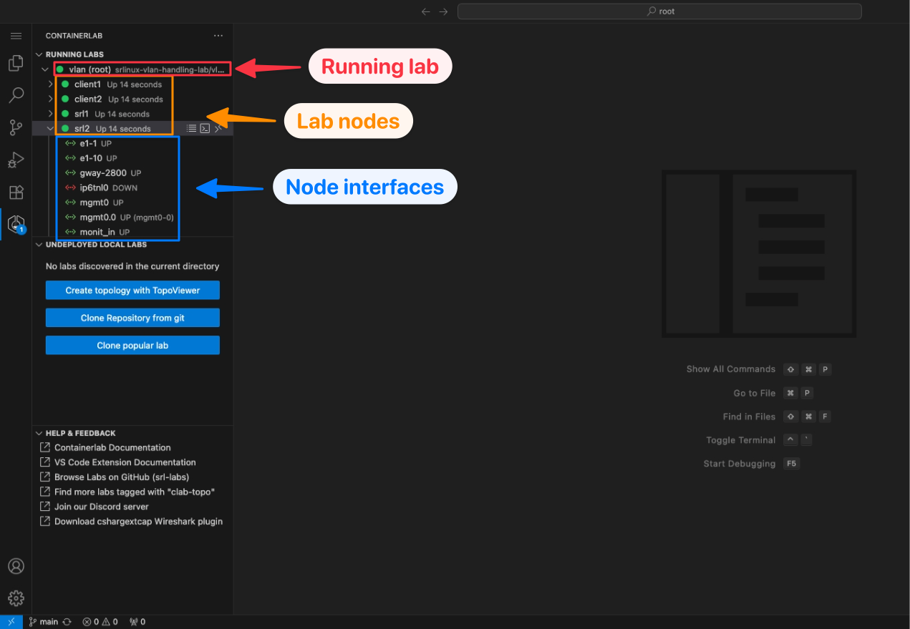

#### Running labs

The running labs panel will display all deployed containerlabs on the system.

You can expand the running lab to view the individual containers which belong to the lab, and interact with them (ie. telnet, SSH, start/stop etc.)

You can expand each container to view it's interfaces, set link impairments and perform packet captures.

#### Undeployed local labs

The undeployed local labs panel will show all discovered topology files in the directory of your current [VS Code Workspace.](https://code.visualstudio.com/docs/editing/workspaces/workspaces)

Topology files are discovered by recursively searching your workspace directory and subdirectories for files which have the `*.clab.yaml` or `*.clab.yml` file extension.

#### Help & Feedback

The aptly named 'Help & Feedback' panel displays shortcuts to documentation pages which can be of help when using Containerlab.

### Visualization and editing

The extension makes it easy to visualize and edit topologies by introducing the TopoViewer tool.

The TopoViewer is a graphical topology creator/editor allowing Containerlab topologies to be created interactively. TopoViewer also is a visualization tool to interact with your running lab topologies.

The extension makes it easy to also use the existing visualization tooling, such as the web graph or [clab-io-draw](https://github.com/srl-labs/clab-io-draw).

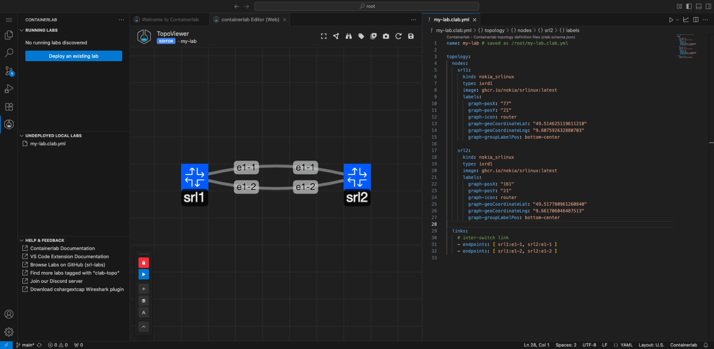

### Integrated packet capture

Packet capture is an integral component of labbing. [Edgeshark](https://github.com/siemens/edgeshark) is a tool which makes container packet capture extremely easy, we have had it available to use with Containerlab for a while.

The extension further improves on this by integrating Wireshark directly into your VS Code window to make packet capture extremely easy. No dependencies required on your laptop at all.

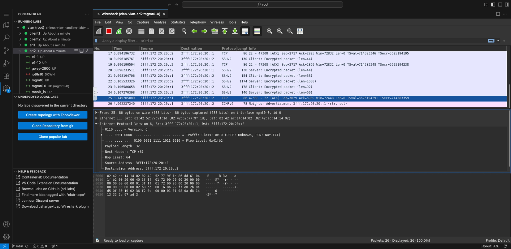

### Link impairments

In Containerlab you are able to set link impairments for your labs. The impairments are delay, jitter, corruption and packet loss. 

The extension simplifies the method of managing these impairments by providing a page to manage all impairments for a nodes' interface(s); or quickly setting an impairment on an interface via the interface element in the running labs tree.

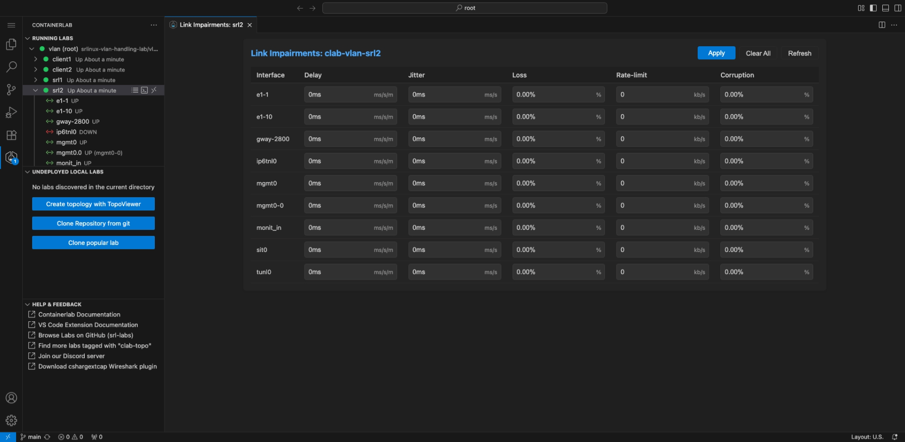

## Tasks

It's now time to give the extension a test-drive.

We will first do some basic setup to get the extension up and running.
    
### Connect to Containerlab host

If you are using Visual Studio code on your own machine, you must connect to the lab environment using the Remote SSH functionality in VS Code, as this is where Containerlab is running.

??? tip "How to use Remote SSH"
    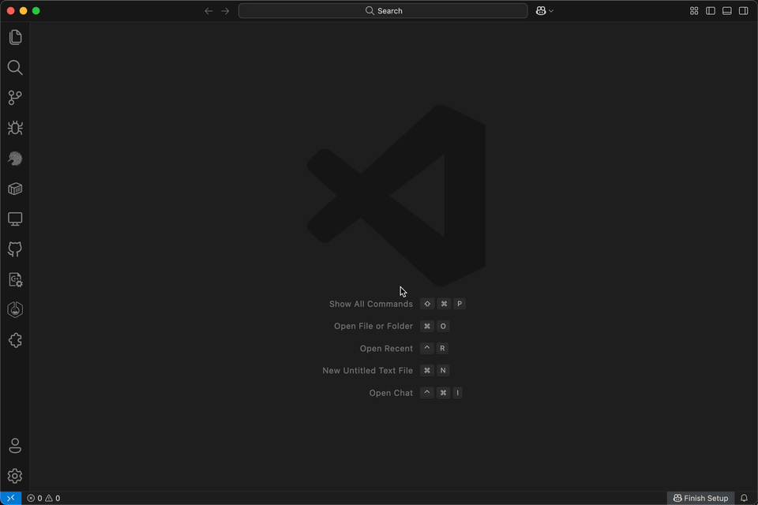

!!!info
    If you are unable to install Visual Studio Code on your laptop. You can use the code-server instance for a browser-based Visual Studio Code instance.
    
    Simply navigate to `<Group ID>.srexperts.net` in your browser to access the code-server. You can skip the next installation step if using this method.

### Installation of the extension

If you are running VS Code locally on your laptop you can navigate to [containerlab.dev/vscode](https://containerlab.dev/vscode) in your browser, this will provide a prompt to open VS Code to the store extension page.

You can also navigate to the extensions tab inside of VS Code and serach for 'Containerlab':

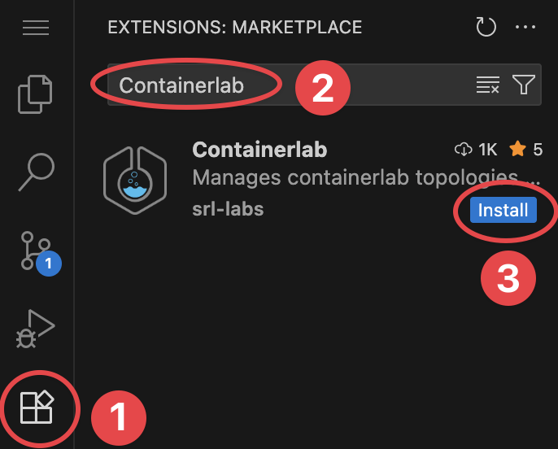

After installation, you should see a new 'Welcome to Containerlab' page appear.

/// admonition | Containerlab installation
    type: tip
The extension will also detect if Containerlab is installed on your system, if it's not found you will get a prompt in the bottom right to **Install Containerlab**. 

Hit **Install Containerlab**, tada! as easy as that Containerlab (and it's depedencies) are now installed and ready to go on your system.
///

Let's also create a directory we will work out of.

```bash
mkdir ~/srx25
```

Enter that folder in VS Code by navigating to the file menu (top left), and select 'Open Folder', and open the folder that was just created.

### Graphical topology creation

You will notice the Containerlab logo now appears on your extension bar. Click on it to open the extension, you will see the tree view.

You should notice the 3 distinct panels. Let's create a topology using TopoViewer: the bundled graphical topology creation & editing tool.

Launch TopoViewer by clicking on the :material-file-plus-outline: icon; or the 'Create topology with TopoViewer' button.

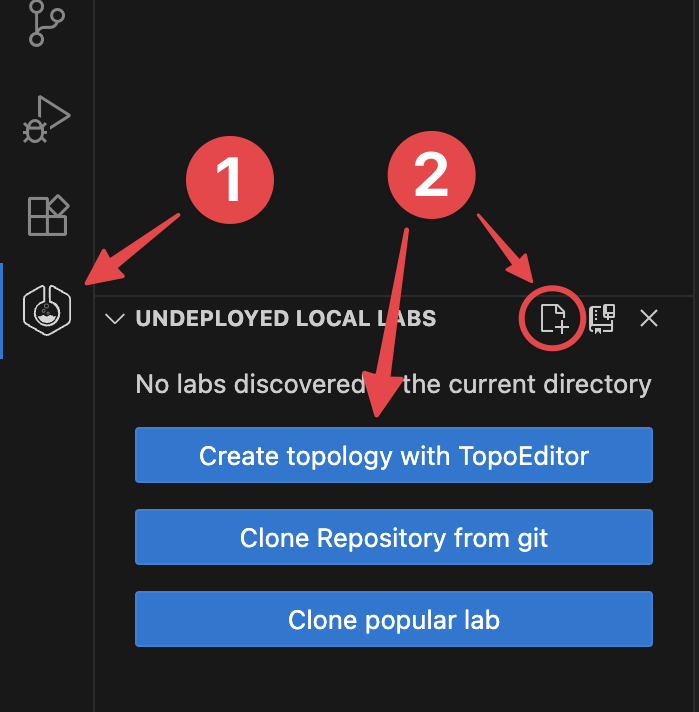

You will be prompted for a path for where to put the new topology file. Type the name you want for your topology.

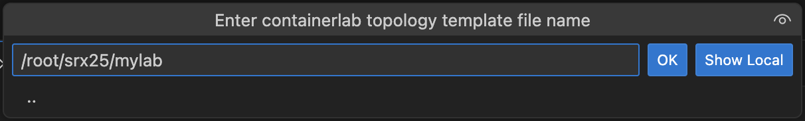

TopoViewer will now open. On one side of the screen you will see the Containerlab YAML file, and on the other is the TopoViewer graphical topology editor.

The default topology consists of 2 SR Linux nodes connected back to back with a link on both the `e1-1` and `e1-2` interfaces.

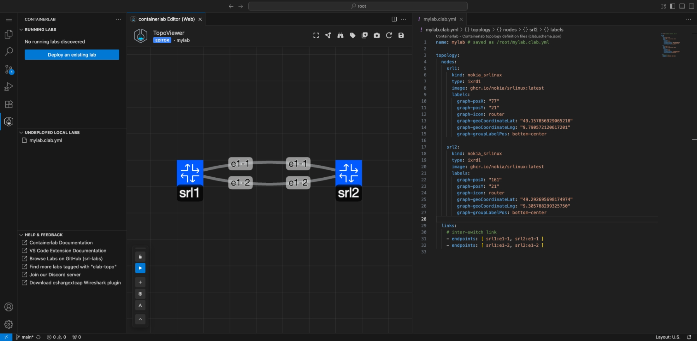

You can click and drag on nodes to move them around. Add nodes using the :octicons-plus-16: icon, hold right click on a node or a link to open an editor wheel which lets you edit properties of the node/link, or add/remove a node/link.

You can also reposition and lock the position of the floating editor panel. Hover over the icons on the floating panel to see what function each button does.


After getting some usage with the TopoViewer, stick to a basic two-nodes SRL topology, with at least one link between the two nodes on their `e1-1` interfaces.

### Manage lab lifecycle

Now that we have created a topology, lets use the extension to manage the lab lifecycle.

In the lab explorer, you should notice the lab we have created under the 'Undeployed local labs' tab. You can deploy the lab either of below methods:

- Use the Deploy (:fontawesome-solid-play:) button on the floating panel in TopoViewer.

    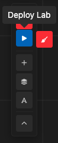

- Right click on the lab in the lab explorer and click **Deploy**.

    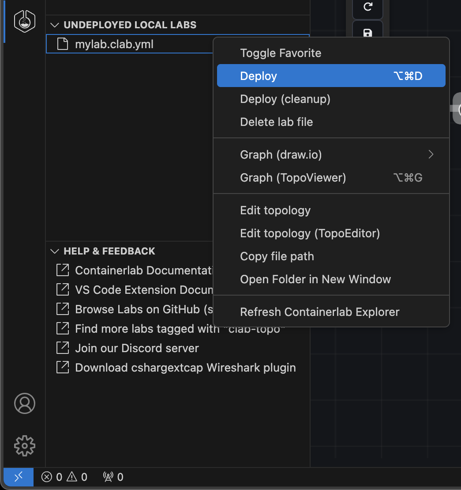

-   Enter the `Edit Lab topology` and use the play icon :fontawesome-solid-play: at upper-right corner for the lab management options.

    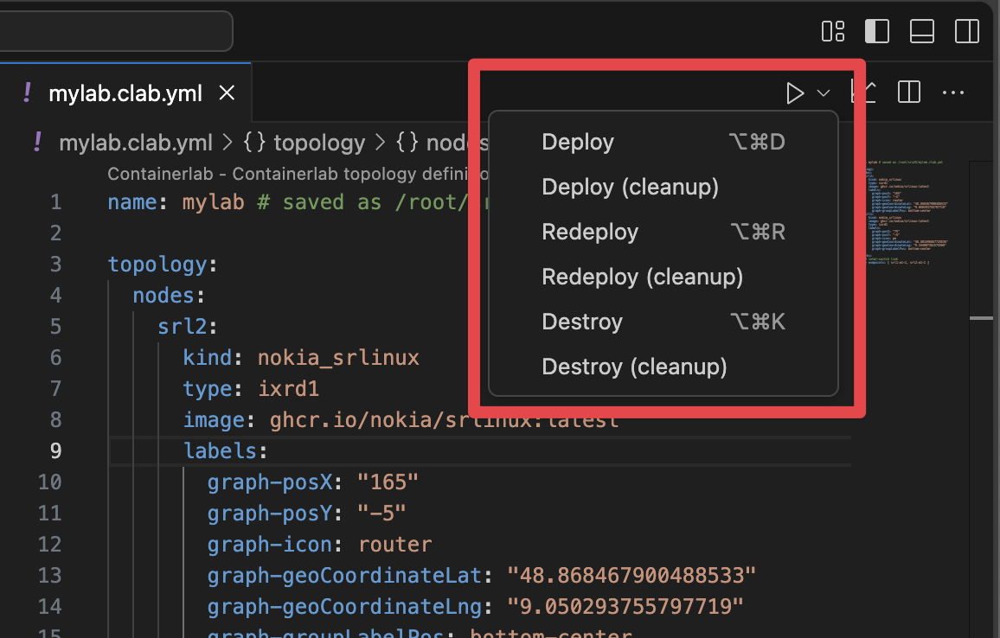

When the lab deployment starts, a small box will show on the *bottom right* to notify us that the lab is in the process of deploying. 

We can click the **View Logs** button of this box to open the **Output** panel and watch all logging and backend command execution.

Looking back at the tree view, you should be able to see the icon colour of the lab change to a &nbsp;:green_circle:&nbsp; when the lab is up and running.

You should also notice that the TopoViewer has now changed into viewer mode, editing functionality is no longer available, and the mode inidicator below the TopoViewer text in the navbar says 'Viewer'.

With the lab running, you can expand the lab in the tree view and drill all the way down to per-node interface level. 

By hovering on the lab, containers or interfaces you can see a small tooltip which displays some key info, such as node name, image, kind, IP address or interface MAC addresses and MTU.
  
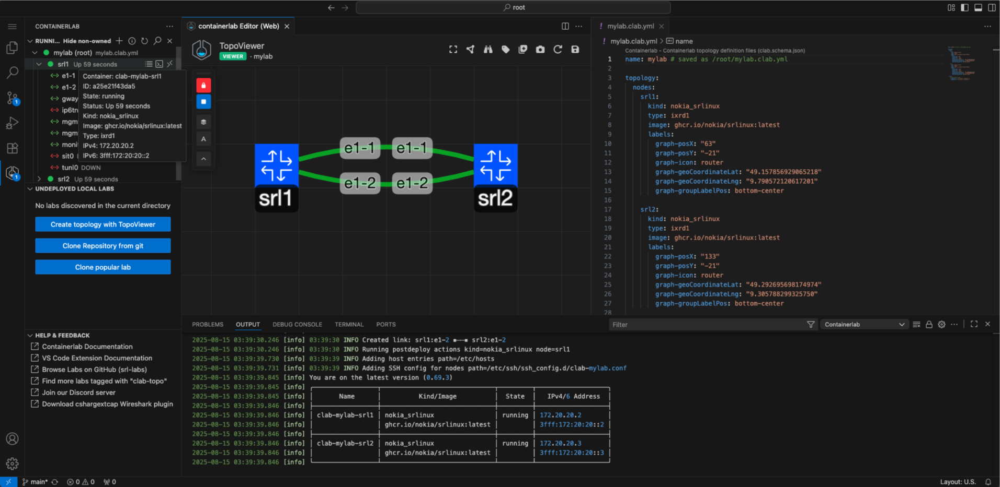

We can also inspect the lab in the tabular format you may be used to from the Containerlab CLI. This is a great way to quickly take a look at all information of the lab.

Simply right click on the lab name then click **Inspect Lab**.

There is a search box to aide in filtering if your topology has many nodes.

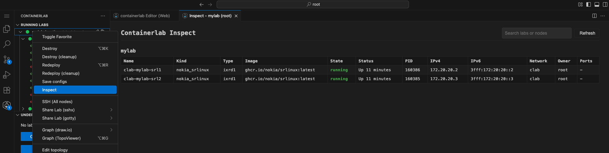

### Interact with nodes

You can interact with the lab nodes either via the tree view or TopoViewer.

#### Using tree view

If you hover over the container node in the tree, you should notice on the right side that there are three quick actions for the node.

- :fontawesome-solid-bars: lets you view the containers logs. Useful to see any bootup or crash information.
- :octicons-terminal-16: lets you connect to the container shell. This is useful for linux nodes, or troubleshooting.
- :material-remote-desktop: lets you connect via SSH to the node. This is the how you can easily drop into the CLI of the NOS.

You can also right-click on the node in the tree view to see all functionality available to interact with a node, for example: to connect via telnet.

/// tip
If you right click on the lab node in the tree, you can SSH to all nodes in your topology using VS Codes' integrated multi tabbed terminal.
///

#### Using TopoViewer

Since we have deployed the lab, TopoViewer has detected our lab is running and accordingly switched to view mode. This means the radial menu when you right click on a node has changed. 

With this context-aware radial menu, you can:

- SSH to the node.
- Drop into the node's container shell.
- View the nodes's container logs.
- View node properties.

Try it out, and connect to the nodes in your topology.

### Topology visualization

Let's take a look at some of the enhanced graphing functionality the extension provides.

#### TopoViewer enhanced visualization

With TopoViewer, there are extra functions to aid in the visualization of your lab topology. 

In the floating panel there is the :fontawesome-solid-layer-group: Add Group, and :fontawesome-solid-font: Add Text buttons.

These allow you to enhance the topology diagram to make your topology truly beautiful.

/// tip
In the top right of the TopoViwer navbar, there is a :fontawesome-solid-camera: icon. This will export the TopoViewer canvas to an SVG file, effectively exporting an image of your topology to make sharing easy.
///

#### draw.io

To take your diagrams to the next level let's introduce [draw.io](https://github.com/jgraph/drawio), it is a free and open-source diagramming tool.

Pairing this with the [clab-io-draw](https://github.com/srl-labs/clab-io-draw/tree/main?tab=readme-ov-file#clab-io-draw) tool, we can easily export our topology to a draw.io compatible diagram.

This saves a lot of effort in manual diagramming, and is useful for creating enhanced diagrams as well as enabling exporting to standard tools such as Visio.

You can generate draw.io diagrams from the extension with a few clicks.

Right-click on the lab in the tree view and hover over **Graph Lab (draw.io)**. This will open a submenu where you can choose between

- Horizontal mode (automatically lay out nodes horizontally - position from left to right).
- Interactive mode (opens a terminal UI to configure the diagram output style).
- Vertical mode (automatically lay out nodes vertically - position top to bottom).

The diagram opens inside a draw.io editor inside VS Code so that you can edit away.

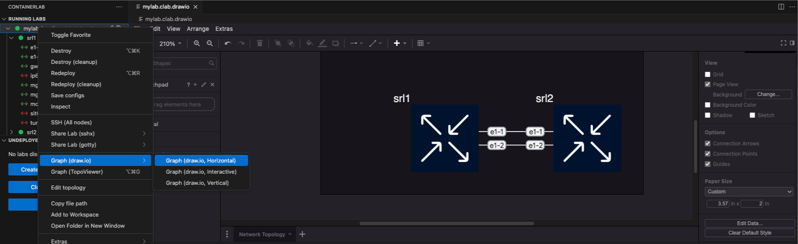

### Links

In this exercise we will take a look at some of the available interaction with links in our topology; these being link impairments and packet capture.

#### Configure IP addressing

Let's first configure the interfaces on our two SRL nodes. We need to bring them up and assign some IP addresses.

1. Connect via SSH to both nodes. The default password is `NokiaSrl1!`

2. Configure the `ethernet-1/1` interfaces of each of the nodes. 

    Don't worry if you're unfamiliar with the SR Linux CLI, refer to the configuration sample below.

    /// tab | srl1

    ``` srl1
    A:srl1# enter candidate
    / interface ethernet-1/1 admin-state enable
    / interface ethernet-1/1 subinterface 0 ipv4 admin-state enable
    / interface ethernet-1/1 subinterface 0 ipv4 address 10.1.2.1/30
    / network-instance default type default 
    / network-instance default admin-state enable
    / network-instance default interface ethernet-1/1.0
    A:srl1# commit now
    ```

    ///
    /// tab | srl2

    ``` srl2
    A:srl2# enter candidate
    / interface ethernet-1/1 admin-state enable
    / interface ethernet-1/1 subinterface 0 ipv4 admin-state enable
    / interface ethernet-1/1 subinterface 0 ipv4 address 10.1.2.2/30
    / network-instance default type default 
    / network-instance default admin-state enable
    / network-instance default interface ethernet-1/1.0
    A:srl2# commit now
    ```
    ///

3. Perform a test ping to make sure our configuration works

    ```
    A:admin@srl1# ping 10.1.2.2 network-instance default -c 4
    Using network instance default
    PING 10.1.2.2 (10.1.2.2) 56(84) bytes of data.
    64 bytes from 10.1.2.2: icmp_seq=1 ttl=64 time=2.29 ms
    64 bytes from 10.1.2.2: icmp_seq=2 ttl=64 time=3.17 ms
    64 bytes from 10.1.2.2: icmp_seq=3 ttl=64 time=3.25 ms
    64 bytes from 10.1.2.2: icmp_seq=4 ttl=64 time=3.50 ms

    --- 10.1.2.2 ping statistics ---
    4 packets transmitted, 4 received, 0% packet loss, time 3004ms
    rtt min/avg/max/mdev = 2.289/3.050/3.496/0.455 ms
    ```

#### Packet capture

Now that we have established connectivity between the two nodes, let's try and take a look at what is actually going across the link.

Packet capture is important to see what's happening in your lab. In the extension this is made easy with a fully integrated Wireshark experience.

Go back to the tree view, expand the lab and container nodes so that you can see their interfaces. If you hover over the interfaces you should see a Wireshark icon &nbsp;:simple-wireshark:.

Upon clicking it, you should notice Wireshark has now opened in a tab in your VS Code window.

If you inititate another ping, you should see the ICMP packets on the link.

/// admonition | How does this work?
    type: question
Wireshark runs in a Linux container on the Containerlab host. The container has minimal packages ensure the Wireshark GUI is displayed. The Wireshark window is launched and then streamed via VNC into your VS Code window.

When connecting using VS Code remote functionality, the VNC is streamed securely through the VS Code remote tunnel. <u>No extra external ports are opened</u>.
///

#### Link impairments

We can ping between our nodes, and inspect the packets with Wireshark. Last of all let's try the link impairments.

Link impairments let us impair the quality of the link by setting packet loss, corruption, jitter and packet corruption. This is useful for simulation of real-world scenarios such as long-distance or damaged/degraded links.

Let's start a ping between the two nodes (omit the `-c 4` option so the ping is infinite).

Enter the impairment editor by right clicking on one of the nodes in the tree, and selecting the 'Link impairments' option in the context menu. This will open the impairment editor.

Set some significant delay on the `e1-1` interface, such as 1 second. You should notice the time in your ping increase accordingly.

Play around with the other impairments. Set some packet loss, or corruption and check the Wireshark capture. Sky is the limit.


## Summary

Now that you have reached the end of this activity, you should now know the following:

- How to use the Containerlab VS Code extension.
- How to create a topology using the TopoViewer GUI.
- How to manage the lifecycle of a lab from the tree view.
- Visualization of labs.
- Interaction with interfaces of your lab.
- Interaction with nodes of your lab.

Keep exploring, there are far more possibilities provided by VS Code Containerlab extension.
