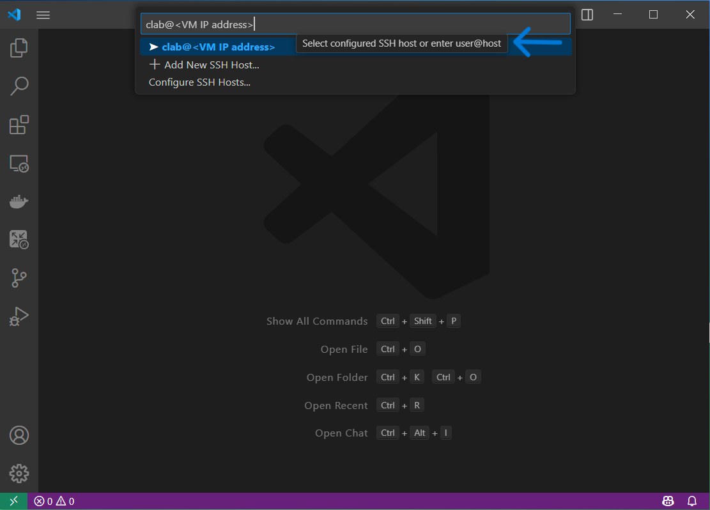

---
tags:
  - VScode
  - Containerlab
  - clab
  - edgeshark

---

# VS Code Containerlab Extension

|                               |                                               |
| ----------------------------- | --------------------------------------------- |
| **Activity name**             | VScode Containerlab extension                |
| **Activity ID**               | 44                                            |                                                    
| **Short Description**         | Learn how to use the Containerlab extension for VS Code to improve your lab workflow. |
| **Difficulty**                | Beginner                                      |
| **Tools used**                | [Visual Studio Code](https://code.visualstudio.com/)<br/>[Containershark Plugin](https://github.com/siemens/cshargextcap/tree/v0.10.7)     |
| **References**                | [VS Code containerlab Extension](https://marketplace.visualstudio.com/items?itemName=srl-labs.vscode-containerlab)<br/>[Containerlab VS Code documentation](https://containerlab.dev/manual/vsc-extension/)<br/>    |


The **VS Code Containerlab Extension** enhances the Containerlab user experience. Taking advantage of powerful text editing functionality in [Visual Studio Code](https://code.visualstudio.com/), the extension provides an easy way to manage the entire lifecycle of your labs.

## Objective

This activity will walk you through the entire process of installation and usage of key features of the extension such as topology creation, lab management and packet capture.

## Key features

First let's go over some key functionality of what makes the extension so good. We will learn more about each component later.

You can view a [video walkthrough](https://www.youtube.com/watch?v=NIw1PbfCyQ4) which shows some basic usage of the extension.

### Lab explorer

The aptly named lab explorer is a panel (similar to the file explorer in VS Code) which displays all running labs on the system, as well as locally discovered containerlab topology files for your [open workspace](https://code.visualstudio.com/docs/editing/workspaces/workspaces) in Visual Studio Code.

The lab explorer is a tree view, which means you can expand each lab to drill down to containers and their interfaces for further interaction.

### Visualization and editing

The extension makes it easy to visualize and edit topologies.

You can either edit the YAML file we are all used to using the in-built VS Code editor. The extension also introduces the TopoViewer and TopoEditor tools which respectively give you beautiful GUIs to visualize and create/edit your topologies.

The extension makes it easy to use existing visualization tools such as the web graph, or [clab-io-draw](https://github.com/srl-labs/clab-io-draw).

### Edgeshark 

[Edgeshark](https://github.com/siemens/edgeshark) is a tool which makes container packet capture extremely easy, we have had it available to use with Containerlab for a while, but the experience is made one step easier by having it integrated in the extension making the workflow to initiate a capture extremely fast.

### Link impairments

In Containerlab you are able to set link impairments for your labs. The impairments are delay, jitter, corruption and packet loss. 

The extension simplifies the method of managing these impairments with a table view or quick-input box activated from the tree view. 

## Tasks

It's now time to give the extension a test-drive.

We will first do some basic setup to get the extension up and running.

### Connect to Containerlab host

If you are using Visual Studio code on your own machine, you must connect to the lab environment using the Remote SSH functionality in VS Code, as this is where Containerlab is running.

??? tip "How to use Remote SSH"
    /// tab | Install SSH

    

    ///
    /// tab | Connect to Host

    

    ///
    /// tab | Select SSH host

    

    ///

!!!info
    If you are unable to install Visual Studio Code on your laptop. You can use the code-server instance for a browser-based Visual Studio code instance.
    
    Simply navigate to `<Group ID>.srexperts.net` in your browser to access the code-server. You can skip the next installation step if using this method.

### Installation of the extension

If you are running VS Code locally on your laptop you can navigate to [containerlab.dev/vscode](https://containerlab.dev/vscode) in your browser, this will provide a prompt to open VS Code to the store extension page.

You can also navigate to the extensions tab inside of VS Code and serach for 'Containerlab':


If installing the extension on a system without Containerlab installed, the extension will prompt you to **Install Containerlab**. Now you don't even need to manually install Containerlab, simply push the **Install Containerlab** button and Containerlab + all dependencies will automatically install.

Let's also create a directory we will work out of.

```bash
mkdir ~/srx25
```

Enter that folder in VS Code by navigating to the file menu (top left), and select 'Open Folder', and open the folder that was just created.

### Graphical topology creation

You will notice the Containerlab logo now appears on your extension bar. Click on it to open the extension, you will see the tree view.

At the top-right of the extension panel, you can see some common functions. If you hover over each one a small tooltip will show to describe the icon's functionality.


Click on the :material-file-plus-outline: icon to open TopoEditor.

You will be prompted for a path for where to put the new topology file. Type the name you want for your topology.


TopoEditor will now open. On one side of the screen you will see the Containerlab YAML file, and on the other is the TopoEditor graphical topology editor.

The default topology consists of 2 SR Linux nodes connected back to back.


You can click and drag on nodes to move them around, hold right click on nodes or links to open an editor wheel. You can also use left click with the Shift or Alt keys to quickly add/remove nodes/links.

After getting some usage with the TopoEditor, stick to a basic two-nodes SRL topology, with a single link between the two nodes.

### Deploy the lab

Now that we have created a topology, lets use the extension to manage the lab lifecycle. 

In the lab explorer, you should now see the lab we just created, you can deploy the lab either of below methods:

- [x] Right click on the lab in the lab explorer and choose **Deploy** or **Deploy (cleanup)**. 
    
    Once the lab is running, from here you can also destroy (bring down) or redeploy (restart) your lab.

    

- [x] Enter the `Edit Lab topology` and use the play icon :fontawesome-solid-play: at upper-right corner for the lab management options.

    

When the lab deployment starts, a small box will show on the *bottom right* to notify us that the lab is in the process of deploying. 

We can click the **View Logs** button of this box to open the **Output** panel and watch all logging and backend command execution.

Looking back at the tree view, you should be able to see the icon colour of the lab change to a &nbsp;:green_circle:&nbsp; when the lab is up and running.

With the lab running, you can expand the lab in the tree view and go all the way down to interface level. 

By hovering on the lab, containers or interfaces you can see a small tooltip which displays some key info, such as node name, image, kind, IP address or interface MAC addresses and MTU.

    


We can also inspect the lab in the tabular format you may be used to from the Containerlab CLI. This is a great way to quickly take a look at all information of the lab.

Simply right click on the lab name then click **Inspect Lab**


### Interact with nodes

The tree view provides quick action buttons for common actions, such as connecting to a node via SSH by making use of the built-in VS Code terminal we get tabbed terminal sessions.

You can also right-click on the node in the tree view to see all functionality available to interact with a node.

Try it out, and connect to the nodes in your topology.


### Topology visualization

Now that the lab is deployed, in this exercise we will see the graphing functionality provided by the extension.

#### Using TopoViewer

[TopoViewer](https://github.com/asadarafat/topoViewer) is a network visualization tool that transforms the Containerlab topology data into a visual diagram that network engineers are more familiar with. 

It is based on Cytoscape.js and looks and is very similar to the TopoEditor we used earlier.

The tight integration of TopoViewer into the extension means that you can interact with your nodes directly from the extension via TopoViewer.

- [x] Right-click on the lab in lab explorer and select **Graph Lab (TopoViewer)**; you will have a view of your topology with options like toggling the endpoint tags, reloading the topoviewer and saving changes.

- [x] Moreover by selecting each node, a **Node Properties** window will open that provides some information about each container and an **Actions** drop-down menu with useful options such as `Connect to SSH`, `View Logs`, etc . 


- [x] Finally position the nodes in the way you would like to see in a network and save. After saving, if you look to the `lab.clab.yml` file you will see that labels are edited accordingly for each node.

TopoViewer is very useful for rearranging the nodes position especially for large topologies with numerous network elements.

#### Generate draw.io diagrams

[clab-io-draw](https://github.com/srl-labs/clab-io-draw/tree/main?tab=readme-ov-file#clab-io-draw) enables seamless conversion between containerlab YAML files and [draw.io](https://draw.io) diagrams. This simplifies visualization, documentation, and sharing of network topologies. 

You can generate draw.io diagrams from the extension with a few clicks.

- [x] Right-click on the lab in lab explorer and select **Graph Lab (draw.io)**. The draw.io diagram will be automatically generated. Notice that all the labels such as link_id are available as properties for the draw.io objects.


### Links

In this exercise we will take a look at some of the available interaction with links in our topology; these being link impairments and packet capture.

#### Configure Interfaces

Let's first configure the interfaces on our two SRL nodes.

- [x] Connect to SSH of both nodes to configure the interface toward the other node.


- [x] Configure the IP addresses on the connecting interface between nodes; below you can find a sample.

/// tab | srl-1

``` srl-1
A:srl-1# enter candidate
 / interface ethernet-1/1 admin-state enable
 / interface ethernet-1/1 subinterface 0 ipv4 admin-state enable
 / interface ethernet-1/1 subinterface 0 ipv4 address 10.1.2.1/30
 / network-instance default type default 
 / network-instance default admin-state enable
 / network-instance default interface ethernet-1/1.0
A:srl-1# commit now
```

///
/// tab | srl-2

``` srl-2
A:srl-2# enter candidate
 / interface ethernet-1/1 admin-state enable
 / interface ethernet-1/1 subinterface 0 ipv4 admin-state enable
 / interface ethernet-1/1 subinterface 0 ipv4 address 10.1.2.2/30
 / network-instance default type default 
 / network-instance default admin-state enable
 / network-instance default interface ethernet-1/1.0
A:srl-1# commit now
```
///

#### Link impairments

Now that the interfaces between the nodes are configured, we can try out the link impairment functionality.

Start a ping between the two nodes, and introduce delay using either of the following methods.

1. The impairment editor:

    You can navigate to the link impairment editor by right clicking on the node in the tree view and selecting **Link Impairments**. In realtime we should see the ping RTT increase due to the delay.

    

2. Set delay on the Interface:

    Right-click on the intended interface and select set delay, you will be prompted to set the link delay.

    

#### Packet capture

Packet capture is important to see what's going on in your lab. In the extension we can initiate a packet capture by simply clicking on the &nbsp;:simple-wireshark:&nbsp; icon on the interface in the tree view.

This will only work if you:

1. Have Edgeshark installed on your Containerlab system.
2. Have the local [cshargextcap](https://github.com/siemens/cshargextcap/releases/latest) plugin for Wireshark installed locally.

??? tip "How to install edgeshark"
    Press `CTRL`+`SHIFT`+`P` to open the command palette. You can then type 'Edgeshark' and select  **Containerlab: Install Edgeshark**. Done.

    


## Summary

Now that you have reached the end of this activity, you should now know the following:

- How to use the Containerlab VS Code extension.
- How to create a topology using the TopoEditor GUI.
- How to manage the lifecycle of a lab from the tree view.
- Visualization of labs.
- Interaction with interfaces of your lab.
- Interaction with nodes of your lab.

Keep exploring, there are far more possibilities provided by VS Code Containerlab extension.