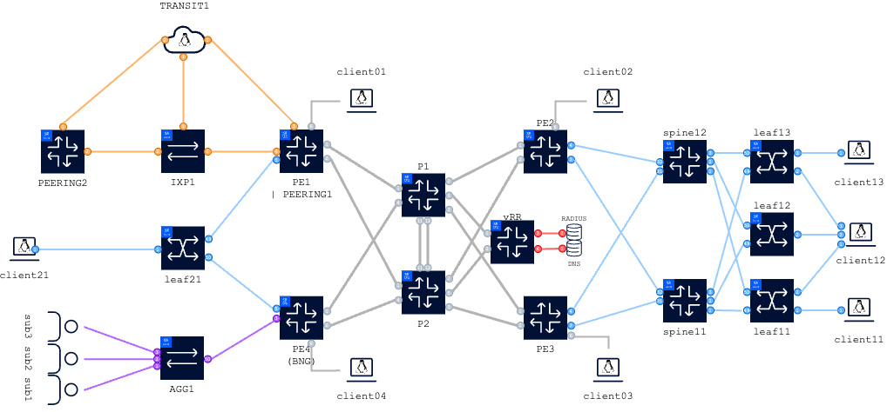

# Welcome at the hackathon @ SReXperts 2024!

This README is your starting point into the hackathon, it should get you familiar with the lab environment provided by Nokia, and provide an overview of the suggested sample activities.

During the afternoon you will work in groups (or alone if you prefer) on any project that you are inspired to tackle or on one of the pre-provided activities of varying difficulty.

As long as you have a laptop with the ability to SSH we have example activities and a generic lab topology to help you progress if you don’t have something specific already in mind.   

Need help, not a problem, pop your hand in the air and an eager expert will be there to guide you. 

## Lab Environment
For this hackathon each (group of) participant(s) will receive their own dedicated cloud instance (VM) running a copy of the generic lab topology.

If everything went according to plan, you should have received a physical piece of paper which contains:
- a group ID allocated to your group (or to yourself if you're working alone)
- SSH credentials to a public cloud instance dedicated to your group. 
- HTTPS URL's towards this repo and access to a web based IDE in case you don't have one installed on your operating system.

> !!! Make sure to backup any code, config, ... <u> offline (e.g your laptop)</u>.
> The public cloud instances will be destroyed once the hackathon is concluded.</p>

### Group ID

Please refer to the paper provided by the hackathon session leader. If nothing has been provided, not a problem, pop your hand in the air and an eager expert will be there to allocate one for you. 

| Group ID | hostname instance |
| --- | --- |
| 1 | 1.srexperts.net |
| 2 | 2.srexperts.net |
| ... | ... |
| **X** | **X**.srexperts.net |

### SSH

hostname: `refer to the paper provided `

username: `refer to the paper provided or the slide presented`

password: `refer to the paper provided or the slide presented`

[Optional] To enable password-less access to an instance, use `ssh-keygen -h` to generate a public/private key pair and then `ssh-copy-id` to copy it over.

### WiFi

Details provided in the session.

### NSP

The NSP can be accessed using a browser at [https://nsp.srexperts.net](https://nsp.srexperts.net)

username: `user<Group ID>`

password: `refer to the paper provided or the slide presented`

> The [Lab Discovery use-case](./activities/nsp-b-lab-discovery) must be executed first before starting any other NSP activities.

### Activities & Topology

During this hackathon you can work on any problem/project you are inspired to tackle and/or on one of the pre-provided activities of varying difficulty. In comparison to last years' event we've spent effort aggregating all of the pre-provided activities on a single generic topology, so fewer time is lost on deploying various labs, allowing you to focus on the objective at hand.

#### Pre-provided activities

Below you can find a table with links towards those pre-provided project which you can use as a baseline for the problem/project you might want to tackle or perform the tasks we've set up for you.

Each pre-provided activity comes with a README of it's own, please click the pre-provided activities for more information.

| Link to pre-provided activity | NOS | Difficulty |
| --- | --- | --- |
| [Pre-requiste to any NSP use-case: Lab Discovery](./activities/nsp-b-lab-discovery) | NSP | Basic |
| [Config snapshot & Rollback](./activities/nsp-b-config-snapshot-rollback) | NSP | Basic |
| [Pro-active measurement](./activities/nsp-b-proactive-measurement) | NSP | Basic |
| [Kafka closed loop automation](./activities/nsp-i-kafka-closed-loop-automation) | NSP | Intermediate |
| [Security baselining](./activities/nsp-a-baseline-security) | NSP | Advanced |
| [Security scanning](./activities/nsp-a-security-scan) | NSP | Advanced |
| [Using NSP APIs](./activities/nsp-a-using-nsp-apis) | NSP | Advanced |
| [CLI aliasing](./activities/srlinux-b-cli-aliasing) | SR Linux | Basic |
| [Event handler](./activities/srlinux-b-event-handler-backup) | SR Linux | Basic |
| [gNMIc](./activities/srlinux-b-gnmic) | SR Linux | Basic |
| [gNOIc](./activities/srlinux-b-gnoi) | SR Linux | Basic |
| [Logging](./activities/srlinux-b-loki-logging) | SR Linux | Basic |
| [Streaming telemetry](./activities/srlinux-b-streaming-telemetry) | SR Linux | Basic |
| [Configuration using Ansible intents](./activities/srlinux-i-ansible-intent) | SR Linux | Intermediate |
| [Create a CLI plugin](./activities/srlinux-i-cli-plugin-show-version) | SR Linux | Intermediate | 
| [Customize the CLI](./activities/srlinux-i-custom-cli) | SR Linux | Intermediate |
| [Using gNMI with Python](./activities/srlinux-i-pygnmi) | SR Linux | Intermediate |
| [Event Handling System (EHS)](./activities/sros-b-ehs-updating-system-name) | SR OS | Basic |
| [gNMIc](./activities/sros-b-gnmic) | SR OS | Basic |
| [gNOIc](./activities/sros-b-gnoi) | SR OS | Basic |
| [Getting started with pySROS](./activities/sros-b-pysros-getting-started) | SR OS | Basic |
| [pySROS login banner](./activities/sros-b-pysros-login-banner) | SR OS | Basic |
| [Streaming Telemetry](./activities/sros-b-streaming-telemetry) | SR OS | Basic |
| [Using Ansible with the netcommon modules](./activities/sros-i-ansible-netconf) | SR OS | Intermediate |
| [BNG: Customizing DHCP and RADIUS](./activities/sros-i-bng-alc) | SR OS | Intermediate |
| [BNG: Catching resource shortages](./activities/sros-i-bng-resources) | SR OS | Intermediate | 
| [Customize the MD-CLI](./activities/sros-i-cli-command-customization) | SR OS | Intermediate |
| [Configure and test EVPN using pySROS](./activities/sros-i-configure-and-test-evpn) | SR OS | Intermediate |
| [Explore pySROS best practices and limits](./activities/sros-i-pysros-limit-testing) | SR OS | Intermediate |
| [RPKI & automated peering configuration](./activities/sros-a-automated-configuration) | SR OS | Advanced |
| [Combining pySROS and the Event Handling System (EHS)](./activities/sros-a-event-handling) | SR OS | Advanced |

#### Topology

When accessing your hackathon VM instance you'll see this repository has already been cloned for you and a fully configured network (powered by [containerlab](https://www.containerlab.dev)), including P, PE and datacentre nodes is already available for you to use.

*Don't worry: This is your personal group network, you cannot impact any other groups.*



The above topology contains a number of functional blocks to help you in area's you might want to focus on, it contains:

- Routing:
  - SR-MPLS (Dual-Stack ISIS)
  - MP-BGP (SAFIs with IPv6 next-hop) ; single node (vRR) route-reflector
  - 2x P-nodes (SR OS)
  - 4x PE-nodes (SR OS)
  - 1x route-reflector (SR OS)
- Data Centers:
  - DC1: a CLOS model
    - 2x spines (spine11|spine12) and 3 leaf switches (leaf11|leaf12|leaf13)
  - DC2: a single leaf (leaf21) to demonstrate Data Center Interconnect usecases
  - IPv6 BGP unnumbered configured in the underlay
  - DCGW Integration:
    - DC1: PE2 and PE3
    - DC2: PE1 and PE4
  - a Data Center interconnect using a MPLS IP-VPN (EVPN/IPVPN integration):
    - VPRN "DCI" and EVPN/VPLS "IPVRF201" and EVPN/VPLS "IPVRF202"
- Subscriber management (BNG+NAT) on PE4
- a Transit/Peering setup with RPKI available on PE1
- a fully working telemetry stack (gNMIc/prometheus/grafana + syslog/promtail/loki)
- Linux clients are attached to both the GRT and VPRN services allowing a full mesh of traffic. 

### Help! I've bricked my lab, how do I redeploy? 

When accessing your hackathon VM instance you'll see the SReXperts directory is a git clone of this repository.
A fully configured network (powered by [containerlab](https://www.containerlab.dev)), including P, PE and datacentre nodes is already available for you to use.

If you have broken something and would like to restore the state without extensively troubleshooting, you can destroy and redeploy the command via following `make` commands:

> Note: we use containerlab under the hood, the Makefile is just a simple wrapper around it.

``` 
~$ cd $HOME/
~$ make destroy -C /home/nokia/SReXperts/clab/
~$ make deploy -C /home/nokia/SReXperts/clab/
```

### Credentials & Access

#### Accessing the lab from within the VM

To access the lab nodes from within the VM, users should identify the names of the deployed nodes using the `sudo containerlab inspect` command:

```
sudo containerlab inspect -a
+----+--------------+-----------+---------------------------+--------------+------------------------------------+---------------+---------+----------------+--------------+
| #  |  Topo Path   | Lab Name  |           Name            | Container ID |               Image                |     Kind      |  State  |  IPv4 Address  | IPv6 Address |
+----+--------------+-----------+---------------------------+--------------+------------------------------------+---------------+---------+----------------+--------------+
|  1 | srx.clab.yml | srexperts | clab-srexperts-agg1       | 674410c9af85 | ghcr.io/nokia/srlinux:24.3.2       | nokia_srlinux | running | 10.128.1.52/24 | N/A          |
|  2 |              |           | clab-srexperts-client01   | 84d10798f3e1 | ghcr.io/srl-labs/network-multitool | linux         | running | 10.128.1.25/24 | N/A          |
|  3 |              |           | clab-srexperts-client02   | 4097ff655bd0 | ghcr.io/srl-labs/network-multitool | linux         | running | 10.128.1.26/24 | N/A          |
|  4 |              |           | clab-srexperts-client03   | 2b4bc0f5beda | ghcr.io/srl-labs/network-multitool | linux         | running | 10.128.1.27/24 | N/A          |
|  5 |              |           | clab-srexperts-client04   | ad92d1770e8e | ghcr.io/srl-labs/network-multitool | linux         | running | 10.128.1.28/24 | N/A          |
|  6 |              |           | clab-srexperts-client11   | 6c30905e24d7 | ghcr.io/srl-labs/network-multitool | linux         | running | 10.128.1.36/24 | N/A          |
|  7 |              |           | clab-srexperts-client12   | e7c67b6243ad | ghcr.io/srl-labs/network-multitool | linux         | running | 10.128.1.37/24 | N/A          |
|  8 |              |           | clab-srexperts-client13   | dd3e7de474fe | ghcr.io/srl-labs/network-multitool | linux         | running | 10.128.1.38/24 | N/A          |
|  9 |              |           | clab-srexperts-client21   | b0aa7b04e83d | ghcr.io/srl-labs/network-multitool | linux         | running | 10.128.1.42/24 | N/A          |
| 10 |              |           | clab-srexperts-dns        | 908441c7e174 | ghcr.io/srl-labs/network-multitool | linux         | running | 10.128.1.15/24 | N/A          |
| 11 |              |           | clab-srexperts-gnmic      | 49fd00767f0a | ghcr.io/openconfig/gnmic:0.36.2    | linux         | running | 10.128.1.71/24 | N/A          |
| 12 |              |           | clab-srexperts-grafana    | ae9792b4685a | grafana/grafana:10.3.5             | linux         | running | 10.128.1.73/24 | N/A          |
| 13 |              |           | clab-srexperts-ixp1       | 8f2e2a34ec1d | ghcr.io/nokia/srlinux:24.3.2       | nokia_srlinux | running | 10.128.1.51/24 | N/A          |
| 14 |              |           | clab-srexperts-leaf11     | ae40f8086951 | ghcr.io/nokia/srlinux:24.3.2       | nokia_srlinux | running | 10.128.1.33/24 | N/A          |
| 15 |              |           | clab-srexperts-leaf12     | 5b8ef1f0851f | ghcr.io/nokia/srlinux:24.3.2       | nokia_srlinux | running | 10.128.1.34/24 | N/A          |
| 16 |              |           | clab-srexperts-leaf13     | 0b6cdb0f1f74 | ghcr.io/nokia/srlinux:24.3.2       | nokia_srlinux | running | 10.128.1.35/24 | N/A          |
| 17 |              |           | clab-srexperts-leaf21     | fbe450f93f20 | ghcr.io/nokia/srlinux:24.3.2       | nokia_srlinux | running | 10.128.1.41/24 | N/A          |
| 18 |              |           | clab-srexperts-loki       | 81e922e2255b | grafana/loki:2.9.7                 | linux         | running | 10.128.1.76/24 | N/A          |
| 19 |              |           | clab-srexperts-p1         | 9a7be92bc261 | vr-sros:24.3.R2                    | nokia_sros    | running | 10.128.1.11/24 | N/A          |
| 20 |              |           | clab-srexperts-p2         | dcf131b23d80 | vr-sros:24.3.R2                    | nokia_sros    | running | 10.128.1.12/24 | N/A          |
| 21 |              |           | clab-srexperts-pe1        | eb95be700e43 | vr-sros:24.3.R2                    | nokia_sros    | running | 10.128.1.21/24 | N/A          |
| 22 |              |           | clab-srexperts-pe2        | 331942c949ee | vr-sros:24.3.R2                    | nokia_sros    | running | 10.128.1.22/24 | N/A          |
| 23 |              |           | clab-srexperts-pe3        | b75dae1a645a | vr-sros:24.3.R2                    | nokia_sros    | running | 10.128.1.23/24 | N/A          |
| 24 |              |           | clab-srexperts-pe4        | 35b7bb4c8a9e | vr-sros:24.3.R2                    | nokia_sros    | running | 10.128.1.24/24 | N/A          |
| 25 |              |           | clab-srexperts-peering2   | 53d62d034b51 | ghcr.io/nokia/srlinux:24.3.2       | nokia_srlinux | running | 10.128.1.53/24 | N/A          |
| 26 |              |           | clab-srexperts-prometheus | 6411ad6c5712 | prom/prometheus:v2.51.2            | linux         | running | 10.128.1.72/24 | N/A          |
| 27 |              |           | clab-srexperts-promtail   | 4db67735ce8b | grafana/promtail:2.9.7             | linux         | running | 10.128.1.75/24 | N/A          |
| 28 |              |           | clab-srexperts-radius     | 9ce33544e642 | ghcr.io/srl-labs/network-multitool | linux         | running | 10.128.1.14/24 | N/A          |
| 29 |              |           | clab-srexperts-rpki       | 2fed2c9c9306 | rpki/stayrtr                       | linux         | running | 10.128.1.55/24 | N/A          |
| 30 |              |           | clab-srexperts-spine11    | 56298e38e060 | ghcr.io/nokia/srlinux:24.3.2       | nokia_srlinux | running | 10.128.1.31/24 | N/A          |
| 31 |              |           | clab-srexperts-spine12    | ae95193f1764 | ghcr.io/nokia/srlinux:24.3.2       | nokia_srlinux | running | 10.128.1.32/24 | N/A          |
| 32 |              |           | clab-srexperts-sub1       | 7198475d0d38 | ghcr.io/srl-labs/network-multitool | linux         | running | 10.128.1.61/24 | N/A          |
| 33 |              |           | clab-srexperts-sub2       | 7b1e568aa8bc | ghcr.io/srl-labs/network-multitool | linux         | running | 10.128.1.62/24 | N/A          |
| 34 |              |           | clab-srexperts-sub3       | 2bfa959cf182 | ghcr.io/srl-labs/network-multitool | linux         | running | 10.128.1.63/24 | N/A          |
| 35 |              |           | clab-srexperts-syslog     | 7df2f459faf4 | linuxserver/syslog-ng:4.5.0        | linux         | running | 10.128.1.74/24 | N/A          |
| 36 |              |           | clab-srexperts-transit1   | 7836cd8cde2c | ghcr.io/srl-labs/network-multitool | linux         | running | 10.128.1.54/24 | N/A          |
| 37 |              |           | clab-srexperts-vRR        | bca098b72c01 | vr-sros:24.3.R2                    | nokia_sros    | running | 10.128.1.13/24 | N/A          |
+----+--------------+-----------+---------------------------+--------------+------------------------------------+---------------+---------+----------------+--------------+
```

Using the names from the above output, we can login to the a node using the following command:

For example to access node `clab-srexperts-pe1` via ssh simply type:

```
ssh admin@clab-srexperts-pe1
```

#### Accessing the lab via Internet

Each public cloud instance has a port-range (50000 - 51000) exposed towards the Internet, as lab nodes spin up, a public port is allocated by the docker daemon on the public cloud instance.
You can utilize those to access the lab services straight from your laptop via the Internet.

With the `show-ports` command executed on a VM you get a list of mappings between external and internal ports allocated for each node of a lab:

```
~$ show-ports
Name                       Forwarded Ports
clab-srexperts-agg1        50052 -> 22, 50352 -> 57400
clab-srexperts-client01    50025 -> 22
clab-srexperts-client02    50026 -> 22
clab-srexperts-client03    50027 -> 22
clab-srexperts-client04    50028 -> 22
clab-srexperts-client11    50036 -> 22
clab-srexperts-client12    50037 -> 22
clab-srexperts-client13    50038 -> 22
clab-srexperts-client21    50042 -> 22
clab-srexperts-dns         50015 -> 22
clab-srexperts-grafana     3000 -> 3000
clab-srexperts-ixp1        50051 -> 22, 50351 -> 57400
clab-srexperts-leaf11      50033 -> 22, 50333 -> 57400
clab-srexperts-leaf12      50034 -> 22, 50334 -> 57400
clab-srexperts-leaf13      50035 -> 22, 50335 -> 57400
clab-srexperts-leaf21      50041 -> 22, 50341 -> 57400
clab-srexperts-p1          50011 -> 22, 50411 -> 830, 50311 -> 57400
clab-srexperts-p2          50012 -> 22, 50412 -> 830, 50312 -> 57400
clab-srexperts-pe1         50021 -> 22, 50421 -> 830, 50321 -> 57400
clab-srexperts-pe2         50022 -> 22, 50422 -> 830, 50322 -> 57400
clab-srexperts-pe3         50023 -> 22, 50423 -> 830, 50323 -> 57400
clab-srexperts-pe4         50024 -> 22, 50424 -> 830, 50324 -> 57400
clab-srexperts-peering2    50053 -> 22, 50353 -> 57400
clab-srexperts-prometheus  9090 -> 9090
clab-srexperts-radius      50014 -> 22
clab-srexperts-spine11     50031 -> 22, 50331 -> 57400
clab-srexperts-spine12     50032 -> 22, 50332 -> 57400
clab-srexperts-sub1        50061 -> 22
clab-srexperts-sub2        50062 -> 22
clab-srexperts-sub3        50063 -> 22
clab-srexperts-transit1    50054 -> 22
clab-srexperts-vRR         50013 -> 22, 50413 -> 830, 50313 -> 57400
```

Each service exposed on a lab node gets a unique external port number as per the table above. 
In the given case, Grafana's web interface is available on port 3000 of the VM which is mapped to Grafana's node internal port of 3000.

The following table shows common container internal ports and is meant to help you find the correct exposed port for the services.

| Service    | Internal Port number |
| ---------- | -------------------- |
| SSH        | 22                   |
| Netconf    | 830                  |
| gNMI       | 57400                |
| HTTP/HTTPS | 80/443               |
| Grafana    | 3000                 |

Subsequently you can access the lab node on the external port for your given instance using the DNS name of the assigned VM.

| Group ID | hostname instance |
| --- | --- |
| **X** | **X**.srexperts.net |

In the example above, accessing `pe1` would be possible by: 

```
ssh admin@X.srexperts.net -p 50021
```

In the example above, accessing grafana would be possible browsing towards **http://X.srexperts.net:3000** (where X is the group ID you've been allocated)

[Optional] You can generate `ssh-config` using the `generate-ssh-config` command and store the output on your local laptop's SSH client, in order to connect directly to nodes.

#### Traffic generation: starting and stopping

In the generic topology, linux clients are attached to a number of routers:

- the PE layer
- the leafs in each data center
- in multiple VRFs: global routing table (grt) and vprn "dci" (vprn.dci)

One can start and/or stop traffic by connecting to the relevant client using SSH, and running `/traffic.sh`, for example:

```
ssh user@clab-srexperts-client11

client11:~$ /traffic.sh [-a <start|stop>] [-d <dns hostname>]
```

The dns hostname is composed out of the client name and a domain suffix.

| SSH | Client | Global Routing Table suffix | VPRN "DCI" suffix |
| --- | --- | --- | --- |
| clab-srexperts-client01 | client01 | .grt | .vprn.dci |
| clab-srexperts-client02 | client02 | .grt | .vprn.dci |
| clab-srexperts-client03 | client03 | .grt | .vprn.dci |
| clab-srexperts-client04 | client04 | .grt | .vprn.dci |
| clab-srexperts-client11 | client11 | .grt | .vprn.dci |
| clab-srexperts-client12 | client12 | .grt | .vprn.dci |
| clab-srexperts-client13 | client13 | .grt | .vprn.dci |
| clab-srexperts-client14 | client21 | .grt | .vprn.dci |

For example, if you'd like to start a unidirectional traffic flow from `client11` to `client21` in the global routing table:
```
client11:~$ /traffic.sh -a start -d client21.grt
starting traffic to client21.grt, binding on client11.grt, saving logs to /tmp/client21.grt.log
```

Stopping the traffic flow would be achieved by:

```
client11:~$ /traffic.sh -a stop -d client21.grt
stopping traffic to client21.grt
```

However, if you'd like to start a full mesh of traffic between `client11` and the rest of the clients, this could be achieved by executing: 

```
client11:~$ /traffic.sh -a start -d all.grt
starting traffic to client01.grt, binding on client11.grt, saving logs to /tmp/client01.grt.log
starting traffic to client02.grt, binding on client11.grt, saving logs to /tmp/client02.grt.log
starting traffic to client03.grt, binding on client11.grt, saving logs to /tmp/client03.grt.log
starting traffic to client04.grt, binding on client11.grt, saving logs to /tmp/client04.grt.log
starting traffic to client12.grt, binding on client11.grt, saving logs to /tmp/client12.grt.log
starting traffic to client13.grt, binding on client11.grt, saving logs to /tmp/client13.grt.log
starting traffic to client21.grt, binding on client11.grt, saving logs to /tmp/client21.grt.log

client11:~$ /traffic.sh -a stop -d all.grt
stopping traffic to client01.grt
stopping traffic to client02.grt
stopping traffic to client03.grt
stopping traffic to client04.grt
stopping traffic to client12.grt
stopping traffic to client13.grt
stopping traffic to client21.grt
```

## Cloning this repository

If you would like to work locally on your personal device you should clone this repository. This can be done using one of the following commands.

HTTPS:
```
git clone https://github.com/nokia/SReXperts.git
```

SSH:
```
git clone git@github.com:nokia/SReXperts.git
```

GitHub CLI:
```
gh repo clone nokia/SReXperts
```

## Useful links

* [Network Developer Portal](https://network.developer.nokia.com/)
* [containerlab](https://containerlab.dev/)
* [gNMIc](https://gnmic.openconfig.net/)

### SR Linux

* [Learn SR Linux](https://learn.srlinux.dev/)
* [YANG Browser](https://yang.srlinux.dev/)
* [gNxI Browser](https://gnxi.srlinux.dev/)

### SR OS

* [SR OS Release 24.3](https://documentation.nokia.com/sr/24-3/index.html)
* [pySROS](https://network.developer.nokia.com/static/sr/learn/pysros/latest/index.html)
* [Network Developer Portal](https://network.developer.nokia.com/sr/learn/)

### Misc Tools/Software
#### Windows

* [WSL environment](https://learn.microsoft.com/en-us/windows/wsl/install)
* [Windows Terminal](https://apps.microsoft.com/store/detail/windows-terminal/9N0DX20HK701)
* [MobaXterm](https://mobaxterm.mobatek.net/download.html)
* [PuTTY Installer](https://the.earth.li/~sgtatham/putty/latest/w64/putty-64bit-0.78-installer.msi)
* [PuTTY Binary](https://the.earth.li/~sgtatham/putty/latest/w64/putty.exe)


#### MacOS

* [iTerm2](https://iterm2.com/downloads/stable/iTerm2-3_4_19.zip)
* [Warp](https://app.warp.dev/get_warp)
* [Hyper](https://hyper.is/)
* [Terminal](https://support.apple.com/en-gb/guide/terminal/apd5265185d-f365-44cb-8b09-71a064a42125/mac)

#### Linux

* [Gnome Console](https://apps.gnome.org/en/app/org.gnome.Console/)
* [Gnome Terminal](https://help.gnome.org/users/gnome-terminal/stable/)

#### IDEs

* [VS Code](https://code.visualstudio.com/Download)
* [VS Code Web](https://vscode.dev/)
* [Sublime Text](https://www.sublimetext.com/download)
* [IntelliJ IDEA](https://www.jetbrains.com/idea/download/)
* [Eclipse](https://www.eclipse.org/downloads/)
* [PyCharm](https://www.jetbrains.com/pycharm/download)
