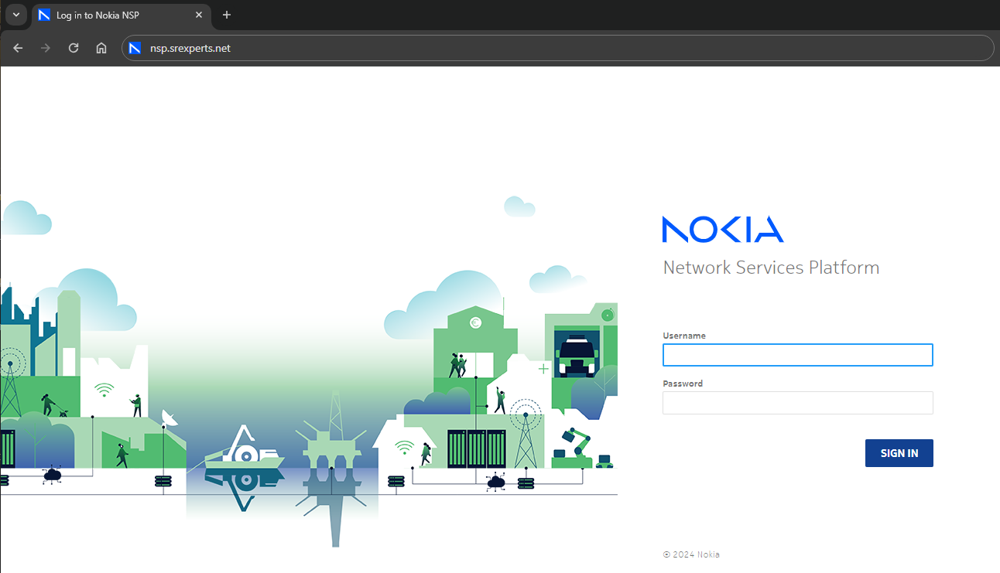
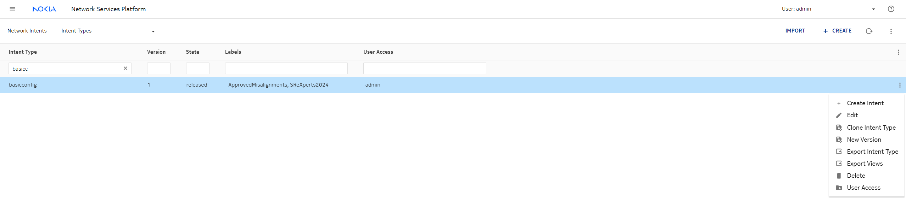
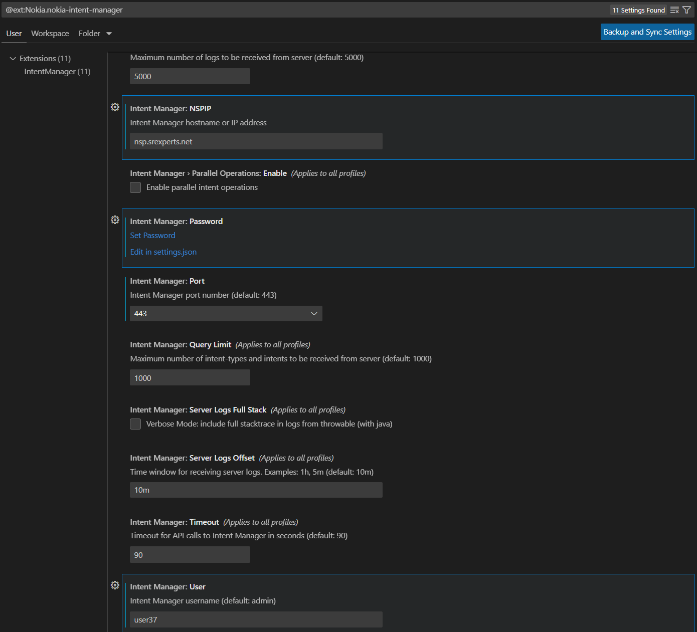
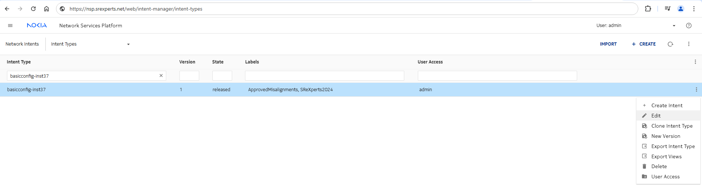
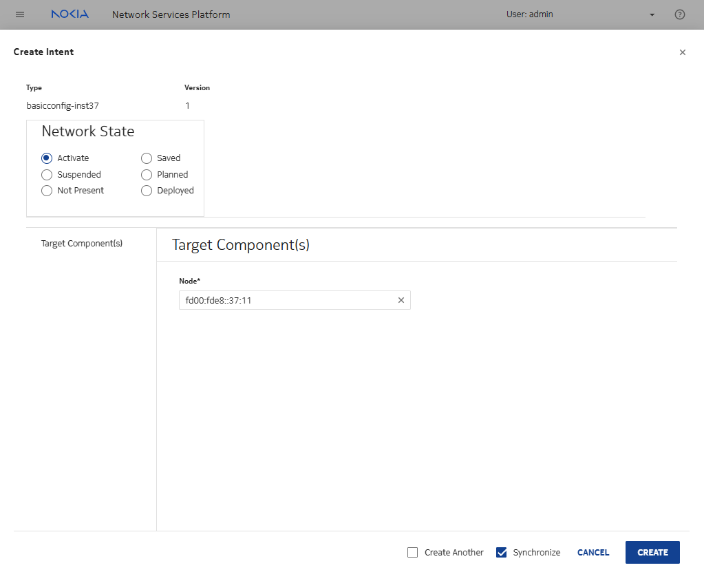
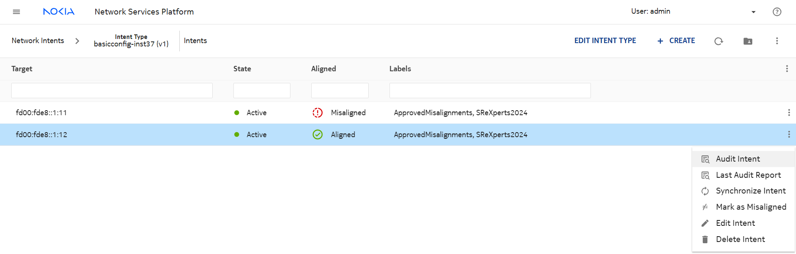

# NE Baseline Security using NSP

| Item | Details |
| --- | --- |
| Short Description | Implementing and Assuring Node Security using Intents for SR Linux and SR OS |
| Skill Level | Advanced |
| Tools Used | NSP IM |

## Objective
For this exercise, you'll take a guided tour through writing intents for NSP following the IPL!nk principles. These principles from the primer session will be heavily relied upon, and these intents will differ from the IBSF and ICM formats you may be familiar with. Boilerplate intents are provided. You will be expected to make modifications to the intents to add attributes or support for another NOS. To do this, the idea will be to first become acquainted with the base version of the intent, to then modify it for SR OS, make sure everything behaves as expected and finally to make it work in a similar way for SR Linux.

## Accessing the lab
In this lab you will interact with the NSP both through the GUI and with Intent Manager specifically using the vsCode plugin for it.
For SR OS, we will use nodes `p1` and `p2`, for SR Linux (in the later part of the lab) we will use `spine11` and `spine12`.
These nodes can be accessed via
```
ssh admin@clab-srexperts-p1
ssh admin@clab-srexperts-p2
ssh admin@clab-srexperts-spine11
ssh admin@clab-srexperts-spine12
```
with the credentials provided to you.

## Task 0: Discovery of the lab

If this is your first NSP activity for this hackathon, ensure to first execute the activity called `nsp-b-lab-discovery`. It should not take long!

## Task 1: Using the GUI
We will first look through the GUI to find the `basicconfig` intent. Access the NSP at `nsp.srexperts.net` and log in to the GUI using the credentials provided.


1. Using the hamburger menu, find the network intents that have been pre-loaded into the system.
2. In the list either use the available filters to look only for intents tagged SReXperts2024 or scroll down to find the `basicconfig` intent.
3. Drill down into the `basicconfig` intent, and click on `Edit Intent Type` to look at the insides of this intent.

Explore especially the `Resources` tab. In the `SR OS.ftl` file provided as part of the `basicconfig` intent, what do you notice? Do you recognize the content? The intent already supports several configuration items related to security policy. The items implemented are:
- Disable telnet and telnet6 server functionality
- Disable the on-board FTP server
- Create a Management-Access-Filter (MAF) with IPv6 and MAC filters that accept everything
- Creating a MAF IP filter with a default action to `accept` and specific entries for
   - entry 10 for plain SSH
   - entry 20 to allow NETCONF
   - entry 30 to allow gRPC
   - entry 40 to allow ICMP
   - entry 100 that logs and accepts everything else.
- Create a log 90 that stores logs generated by the MAF (and security in general)

Telnet and FTP configurations we can all agree with, the MAF, clearly, is not very secure. As this is a containerlab topology, we use these settings to ensure persistent access and in the hopes of avoiding restarting the topology due to an unfortunate configuration change that blocks access to the system.

4. Before continuing, create a clone version of this intent to work with and modify.

To clone an intent, go back to the list of intents and use the three dots on the right hand side after finding the intent you would like to clone.

Personalize the cloned intent by giving it a new name that includes your assigned instance ID, e.g. use `basicconfig-inst37` if your assigned instance ID happens to be `37`.

## Task 2 ( Option A ): Using the vsCode plugin
We are assuming here, that you are able to install, or have already installed, the Visual Studio Code and the vsCode extension for Intent Manager.
If you are not able or not allowed to install Visual Studio Code on your machine, consider Option B.

1. If not already done, download and install [Visual Studio Code](https://code.visualstudio.com/download).
2. If not already done, install the [vsCode extension for Intent Manager](https://marketplace.visualstudio.com/items?itemName=Nokia.nokia-intent-manager).
3. Configure the vsCode extension to authenticate against the SReXperts NSP at `nsp.srexperts.net` using the credentials provided to you.

Once you've configured the connection settings correctly, reload vsCode using Command Palette `Developer (Reload Window)`.
If you experience issues saying NSP is unreachable, ask for help.
3. In vsCode, find your personal version of the `basicconfig` intent-type (appended with your instance ID), created in the previous task. Within it, look for the `SR OS.ftl` file as you did previously from the GUI. It may look familiar - it is the same file after all.
4. For the cloned intent to be usable, all occurrences of `basicconfig` have to be changed to match `basicconfig-inst37` (assuming you are group 37).
In total, there are 7 occurences. They are in
- `script-content.js` (3x)
- `yang-modules/basicconfig.yang` (3x)

Update these files to use the new name and save the intent. Observe what happens when you save and see how long it takes. Verify your changes in the GUI to ensure everything is behaving as expected.

5. Optionally look through the boilerplate provided in the intent. Nothing needs to be changed here, though if you have some ideas or suggestions feel free to share them.
6. In the GUI or in vsCode, you'll notice the difference between your version of the intent-type and the original is the state. The original is in state `released` while yours is a `draft`. To finish this task, change your intent-type's lifecycle state to `released` and save the changes.


## Task 2 (Option B): Using the GUI
If the vsCode plugin is not a preferred (or possible) option for you, the GUI is a viable alternative though slighly less developer-friendly. In this task, the cloned intent will be made ready for use.
1. (Re-)open the GUI, and access the Network Intents section of NSP.
2. In the list of intent-types, find your specific version. For this example, we use `basicconfig-inst37` but your instance ID may differ. Either click on `Edit Intent Type` or open the three-dots-means-more-options-menu and click on `Edit`.

4. For the cloned intent to be usable, all occurrences of `basicconfig` have to be changed to match `basicconfig-inst37` (assuming you are group 37). In total, there are 7 occurences. They are in
- `script-content.js` (3x)
- `yang-modules/basicconfig.yang` (3x)
5. Optionally, look through the boilerplate provided in the intent. Nothing needs to be changed here, though if you have some ideas or suggestions feel free to share them.
6. In the GUI or in vsCode, you'll notice the difference between your version of the intent-type and the original is the state. The original is in state `released` while yours is a `draft`. To finish this task, change your intent-type's lifecycle state to `released` and save the changes.


## Task 3: Deploying the intent
For the remainder of this lab, any time the intent-type is to be modified, you are free to use any method you prefer. The two methods outlined above are considered equal in that regard.

1. Take stock of the situation.

Investigate, before any intents are deployed against your instance, what the status is of the configurations that will be changed by your intent. Look back to task 1 to see which configurations would be affected.

2. Deploying intents from the GUI.

    2.1 To deploy your version of the `basicconfig` intent to your instance's `p1` node, open the NSP GUI and go to the Network Intents page.

    2.2 On the intents page, open your intent and click on `+ Create`. A menu opens.

    2.3 The menu has only a single input for a target NE. Specify the NE ID for your instance's `p1` node and create the intent.

    2.4 Verify that the configuration on `p1` changes.


3. Deploying intents from the API (optional - can be replaced by repeating 1. using your instance's `p2` as an input parameter instead)

   3.1 Having now seen how to deploy intents via the GUI, you may be interested in deploying it via the API as well. First, look through the [API Docs](https://documenter.getpostman.com/view/26248101/2sA35D64D6#5c3727c5-919f-4675-8300-666c2c924232).

   3.2 Use the API call documented for retrieving intent deployments and apply it for your customized intent and chosen device target. The returned JSON body will give you an idea of what your CREATE request should look like. In the [examples](./examples) folder, a Python script [examples/main.py](./examples/main.py) is included that may provide some inspiration. The resulting API call's body should look like

    ```
    {
       "ibn:output": {
          "intents": {
                "intent": [
                   {
                      "required-network-state": "active",
                      "blocked": "false",
                      "intent-type-label": [
                            "ApprovedMisalignments",
                            "SReXperts2024"
                      ],
                      "intent-specific-data": {
                            "basicconfig-inst37:basicconfig-inst37": {}
                      },
                      "supports-health": true,
                      "aligned": "false",
                      "intent-type": "basicconfig-inst37",
                      "intent-type-version": 1,
                      "target": "fd00:fde8::1:13"
                   }
                ]
          },
          "page-size": 1,
          "total-count": 1
       }
    }
    ```

   3.3 Use the API and what you saw in the previous step to craft a payload for your own API call, use it to deploy your intent to `p2`.

4. Read your writes

Using either the GUI or the API, verify that the deployed intents have the intended effect on your setup. Is the configuration aligned?

## Task 4: Extend the intent-type with something small
In this task, we explore how to add additional configuration to the cloned `basicconfig` intent-type to extend its coverage. The idea with this type of intent is that model-driven node configuration can be easily reused to populate the intent-type. This is exactly what we will try to do for model-driven SR OS nodes in this task.
1. Change your intent-type in such a way that it creates an additional entry `50` in the management-access-filter that explicitly accepts SNMP Traps (UDP 162 as both destination and source port). The resulting configuration in SR OS should be
```
configure {
    system {
        security {
            management-access-filter {
                ip-filter {
                    default-action accept
                    entry 50 {
                        match {
                            dst-port {
                                port 162
                            }
                            src-port {
                                port 162
                            }
                        }
                    }
                }
            }
        }
    }
}
```

2. After making your changes in the intent-type, trigger an `Audit` of the intent from the GUI, on either `p1` or `p2`. What result do you expect?



3. Synchronize either `p1` or `p2`, make sure that your changes in the intent-type are propagated correctly and verify the result on the node CLI.
4. Repeat steps 2 and 3 but using the API instead of the GUI for the other node. This step is once again optional. Repeat steps 2 and 3 for the other node if you wish to stick to the GUI. You can refer to the [API Docs](https://documenter.getpostman.com/view/26248101/2sA35D64D6#54898b73-1083-4247-a051-96ba7f570c9c), the [examples](./examples) folder or the browser console for inspiration.

## Task 5: Extend the intent-type with something big
For the previous task, a simple copy-and-paste of what was already in the intent with minor modifications was all that was needed to get the desired result. Kudos to you if you used a different approach already. In either case, a different approach will be required for this task.

The modification required in this task isn't based on existing content of the intent-type, rather requiring entirely new sections to be added to the `SR OS.ftl` file.

1. For this task, add basic cpm-filter functionality to your intent. This configuration is to be added (although feel free to add more of your own!)
```
configure {
    system {
        security {
            cpm-filter {
                default-action accept
                ip-filter {
                    entry 10 {
                        match {
                            protocol icmp
                        }
                        action {
                            accept
                        }
                    }
                    entry 20 {
                        match {
                            protocol tcp-udp
                        }
                        action {
                            accept
                        }
                    }
                }
            }
        }
    }
}
```
To help you with this task, rely on `info json` and `pwc model-path` from the SR OS MD-CLI or use the Model Driven Configurator to see what payloads it sends to approximate what you will need to add to `SR OS.ftl`.

Notice the presence of `merge` and `replace` operations. The merging operation will add your configuration to the specified context and leave the existing configuration intact. Replacing the context will replace the existing context with your payload.

2. Using what you've seen so far, audit and synchronize the intents such that `p1` and `p2` are in line with your changes. Try to avoid locking yourself (or NSP) out of the router.

3. Enable the `update-fault-tolerance` configuration in the global BGP context to bring the configuration in line with Nokia's recommendation.

In [examples/SR OS.ftl](<./examples/SR OS.ftl>) an example intent-type-resource is included that may offer you some inspiration should you become stuck.

## Task 6: Extend the intent-type for SR Linux
Completing this lab requires a magnum opus of sorts. If you've made it this far that means you are well-versed in the intent principles we are using here and SR OS. This intent-type is designed to allow simple onboarding of different NOSes. Having SR Linux available in the topology we would be amiss if we do not add coverage for it to our intent-type. As before, open your intent-type. In line with `SR OS.ftl`, it stands to reason that we will need a similar file for SR Linux. That might be `SRL.ftl` or `SRLinux.ftl` or `SR Linux.ftl`, how can you find which one would be correct?

In the GUI's edit view `script` tab, at the bottom, you can discover the correct filename to use. If you are using the vsCode plugin, look in `script-content.js`.

Once you've determined the filename to use, create it as an empty file next to `SR OS.ftl`. A suggested SR Linux configuration to add (but, as before, feel free to use your own) is:
```
acl {
    acl-filter cpm type ipv4 {
        entry 470 {
            match {
                ipv4 {
                    protocol tcp
                }
                transport {
                    destination-port {
                        value 2200
                    }
                }
            }
        }
    }
    acl-filter cpm type ipv6 {
        entry 520 {
            match {
                ipv4 {
                    protocol tcp
                }
                transport {
                    destination-port {
                        value 2200
                    }
                }
            }
        }
    }
}
system {
    ssh-server mgmt {
        rate-limit 10
    }
    ftp-server {
        network-instance default {
            admin-state disable
        }
        network-instance mgmt {
            admin-state disable
        }
    }
}
```

Use what you've learned and populate `SRLinux.ftl` so this configuration can be applied. The first pointer to take into account here is that the equivalent of `info json` for SR Linux is `info | as json`, and this output modifier can be used in general. The second pointer is that the Model Driven Configurator knows which namespaces (or prefixes) to use, and this information is also freely available [online](https://yang.srlinux.dev/).

Once complete, deploy the intent to `spine11` and `spine12` using one of your learned methods and confirm the changes are applied succesfully.

In [examples/SRLinux.ftl](./examples/SRLinux.ftl) an example intent-type-resource is included that may offer you some inspiration should you become stuck.
