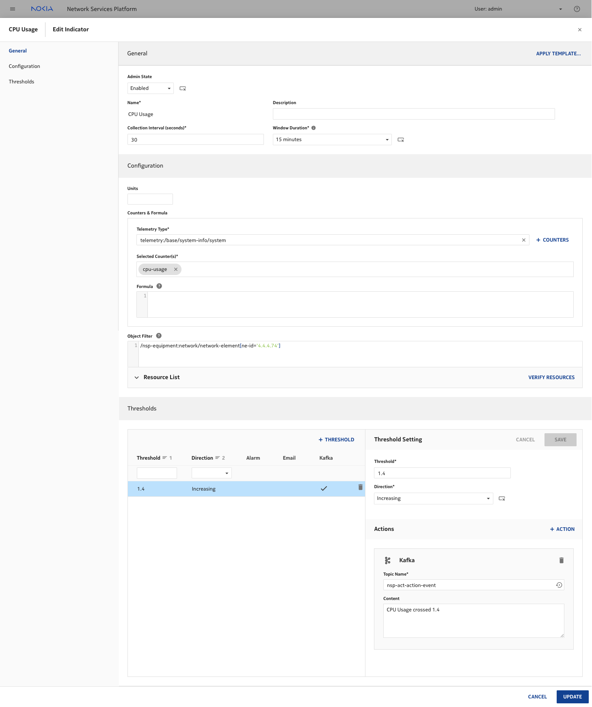
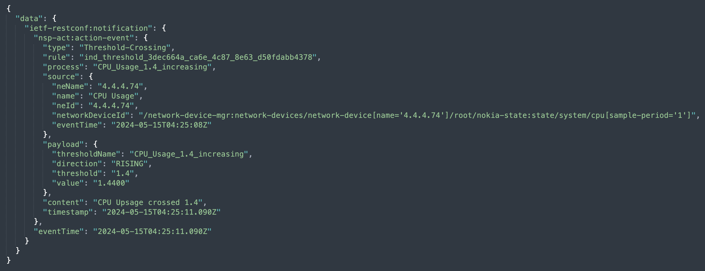
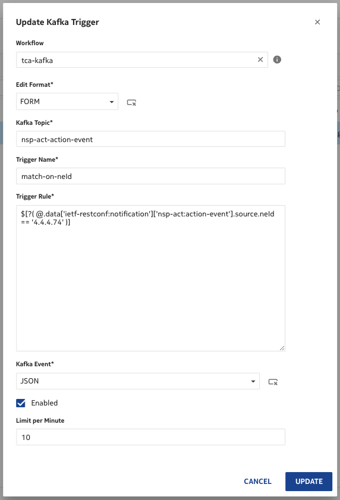
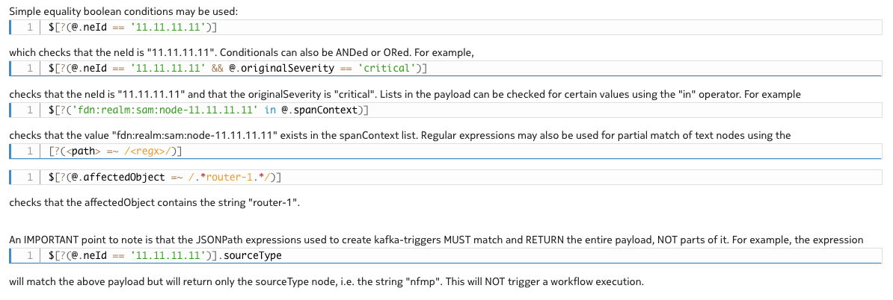
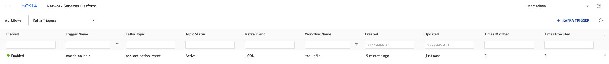
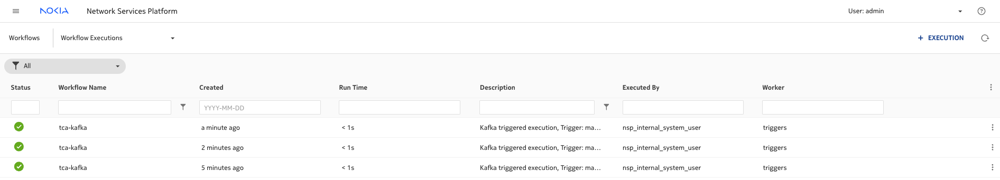
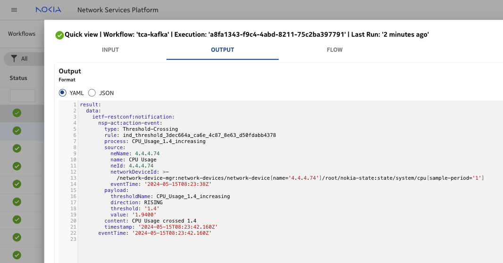

# Programmable closed-loop automation w/ NSP

| Item | Details |
| --- | --- |
| Short Description | explore WFM with Kafka-trigger to implement closed-loop automation |
| Skill Level | Intermediate |
| Tools Used | NSP WFM |

## Prerequisites
1. Basic knowledge the NSP UI
2. Familiarity with NSP Workflow Manager
3. Working with Model driven CLI of NE

## Objective
This exercise, explores the way to consume kafka events to run a workflow when NSP's cloud native telemetry app raises a Threshold Crossing Alerts (TCA).

## Access to the Lab
Access to the NE wont be essential as NSP telemetry object filter uses the NSP common equipment model. But if needed the node can be accessed via: `ssh admin@ne-mgmt-ip`

## Steps

### 0. Discovery of the lab

If this is your first NSP activity for this hackathon, ensure to first execute the activity called `nsp-b-lab-discovery`. It should not take long!

### 1. Create an NSP Indicator subscription to record CPU usage
1. Collection Interval: `30 secs`
2. Window Duration: `15 mins`
3. Telemetry Type: `telemetry:/base/system-info/system`
4. Object Filter: `/nsp-equipment:network/network-element[ne-id='4.4.4.74']`
5. Threshold:
    1. Threshold: `1.4`
    2. Direction:  `Increasing`
    3. Actions:
        - Topic Name: `nsp-act-action-event`
        - Content: `CPU Usage crossed 1.4`



#### Note:
The indicator subscription is specific to an individual network element.
Please select an `ne-id` that belongs to the network elements of your group.
Could be SRL or SR OS node either.

### 2. Sample nsp-act-action-event Notification


### 3. Create a Workflow to consume the kafka event
```
version: '2.0'

tca-kafka-groupXX:
  description: Test WF trigger of TCA Kafka Event

  tags:
    - KafkaTrigger

  input:
    - token
    - payload

  tasks:
    task1:
      action: std.noop   
      publish:
        result: <% $.payload %>
```
#### Note:
1. The tag `KafkaTrigger` is mandatory to associate a kafka event with a WF.
2. Workflow associated to a Kafka event should ONLY have `token` and `payload` as its input.
3. The workflow name must be unique. For example if you are in group 17, use `tca-kafka-group17`

### 4. Associate Kafka event to a Workflow
1. Workflow: `tca-kafka-groupXX`
2. Edit Format: `FORM`
3. Kafka Topic: `nsp-act-action-event`
4. Trigger Name: `match-on-neId-groupXX`
5. Trigger Rule: `$[?( @.data['ietf-restconf:notification']['nsp-act:action-event'].source.neId == '4.4.4.74' )]`
6. Kakfa Event: `JSON`
7. Enabled (checkbox): `true`



#### Note:
1. Trigger Rule syntax is based on https://github.com/json-path/JsonPath. Few examples below.
2. The trigger name must be unique. For example if you are in group 17, use `match-on-neId-group17`
3. Reference the workflow you've created in step 3, like `tca-kafka-group17` in case of group 17.
4. Please select the `ne-id` that belongs to the network elements of your group (same as in step 1).



### 5. Times Matched
When the trigger rule matches the event, `Times Matched` and `Times Executed` column are automatically updated.



### 6. View the WF Execution


