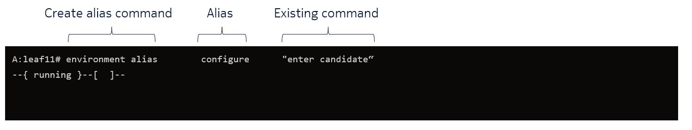
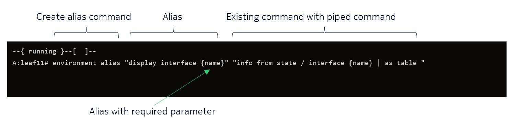
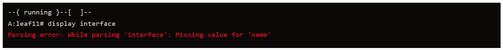
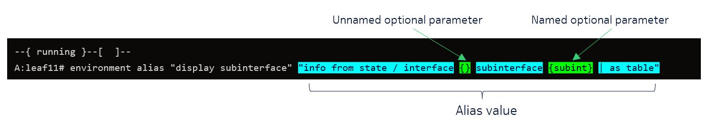
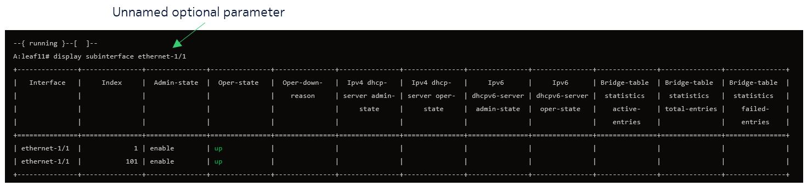
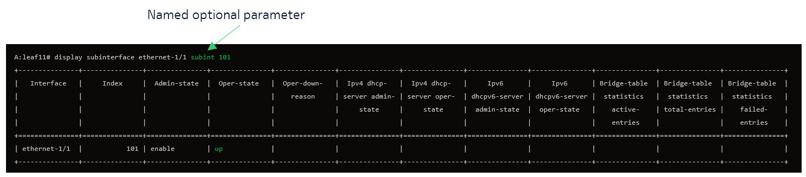
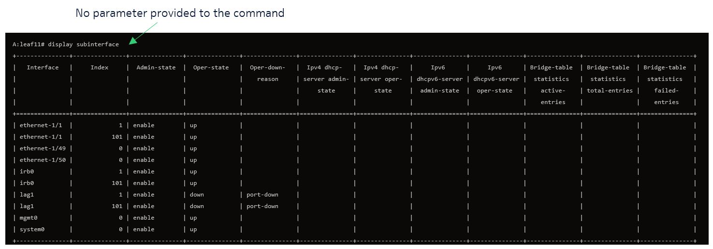

# CLI Aliases in SR Linux

| Item              | Details                                               |
| ----------------- | ----------------------------------------------------- |
| Short Description | Simplify SR Linux command line interface with Aliases |
| Skill Level       | Beginner                                              |
| Tools Used        | SR Linux                                              |

## Creating aliases for CLI commands in SR Linux

With SR Linux, users have the flexibility to create aliases for long, complex CLI commands, or reformat them in a more familiar way. As a shortcut for entering commands, you can configure CLI command aliases using the `environment alias` command. An alias can include one or more CLI command keywords and arguments.

## Objective

In this lab, you will learn how to implement aliases in SR Linux through hands-on examples. By following these examples, you will gain practical experience. At the end of the lab, there is an exercise to test what you have learned.

* Basic alias examples
* Aliases with required parameters examples
* Aliases with optional parameters examples

## Accessing a lab node

In this lab you will create CLI aliases on `clab-srexperts-leaf11` node. You can log in by using the container name.

```bash
ssh admin@clab-srexperts-leaf11
```

<!-- GETTING STARTED -->
## Basic Commands

We will start with a very basic example. In order to create an alias, you will need to use the `environment alias` command followed by the alias you want to create and the existing command you want to replace.

 

To give a first example, imagine you want to mimic how a user enters configuration mode in a different system than SR Linux. You can simply create an alias for the `enter candidate` command.

  ```sh
  A:leaf11# environment alias "configure"  "enter candidate"
  --{ running }--[  ]--
  ```

Execute the newly created alias and notice how the prompt changes from running to configuration mode represented by `candidate shared default`.

  ```sh
  A:leaf11# configure
  --{ candidate shared default }--[  ]--
  ```

The SR Linux CLI includes many commands you're already familiar with from the Linux world, such as `grep` and the pipe `|` commands. These are very useful for filtering outputs, but using multiple piped commands can be cumbersome. Creating an alias can simplify this process.

| Create alias command                            |      Alias can have more than one word       |                  Existing Command                   |                                               Piped Commands |
| :---------------------------------------------- | :------------------------------------------: | :-------------------------------------------------: | -----------------------------------------------------------: |
| $`\textcolor{green}{\text{environment alias}}`$ | $`\textcolor{red}{\text{"display up-int"}}`$ | $`\textcolor{blue}{\text{"show interface brief"}}`$ | $`\textcolor{purple}{\text{"\| grep ethernet \| grep up"}}`$ |

Create an alias `display up-int` for the following show command `show interface brief | grep ethernet | grep up` which shows all ethernet interfaces that are operational up. You should note that an alias can exist of multiple words.

  ```sh
   A:leaf11# environment alias "display up-int" "show interface brief | grep ethernet | grep up"
  ```

Run the alias command.

  ```sh
   A:leaf11# display up-int

| ethernet-1/1        | enable                                   | up                                       | 25G 
| ethernet-1/2        | enable                                   | up                                       | 25G 
| ethernet-1/49       | enable                                   | up                                       | 100G
| ethernet-1/50       | enable                                   | up                                       | 100G  

  ```

When using aliases auto-complete works in the same way as with regular commands.

display $`\textcolor{grey}{\text{up-int}}`$

<p align="right">(<a href="#table-of-content">back to top</a>)</p>

## Alias with required parameters

Sometimes you want to parameterize an alias to limit down the scope of the output just to show you the area of interest. Such aliases can have one or more **required** parameters. It is crucial to note that if these parameters are not provided, the CLI will return an error.

A parameter can be provided by making use of the curly brackets `{}`. By providing a value inside the curly brackets, e.g. `{name}`, you define this parameter to be required when running the alias. We will later see how we can add optional parameters.

 

Create the following alias to summarize the interface information in table format. Note we are using the required parameter `{name}` which will be substitute during runtime with your provided parameter, e.g. `ethernet-1/49` or `system0`.

  ```sh
environment alias "display interface {name}" "info from state / interface {name} | as table "
  ```

Execute the alias and type `display interface <TAB>`, you should see a drop-down box will appear with all available parameter for you to choose from. These correspond to the `{name}` parameter described above.


What happens if you don't provide the parameter? Try it out!



As shown above, a required parameter appears between curly brackets in the alias string. This parameter must also be present with curly brackets in the existing CLI string, and its actual value will be substituted  when the alias is executed.

<p align="right">(<a href="#table-of-content">back to top</a>)</p>

## Alias with optional parameters

When a parameter is specified between curly brackets only on the alias value side, it becomes an optional parameter for the alias command. An optional parameter can be unnamed, indicated by just curly brackets {}, where the parameter itself is the value. Alternatively, it can be a named optional parameter, indicated by a keyword within curly brackets {name}, forming a keyword-value pair. To clarify, let's explore some examples.



In the example below you can see we create an unamed parameter `{}` for the interface names and a named parameter `{subint}` for the subinterface. Note that we define only parameters on the alias value side, this makes this alias an optional alias.

  ```sh
environment alias "display subinterface" "info from state / interface {} subinterface {subint} | as table"
  ```

Execute the alias with only the unamed parameter



Execute now the alias with the named and unamed parameter.



_Missing optional parameter is substituted by wildcard:_



<p align="right">(<a href="#table-of-content">back to top</a>)</p>

## Task

Try to implement what you have learned so far by creating an alias for a long CLI command.

I have a lengthy CLI command that displays the BFD status of the interfaces in a specific format. I want to visualize it in a table with specific columns. Since the command is extensive and I don't want to retype it every time, this is an ideal use case for an alias!

```
info from state bfd subinterface system0.0 | as table | filter fields admin-state desired-minimum-transmit-interval required-minimum-receive detection-multiplier minimum-echo-receive-interval max-hop-count
```

Run this command in CLI to see the output. Note that this command shows the bfd status for interface system0.0.

```
A:leaf11# info from state bfd subinterface system0.0 | as table | filter fields admin-state desired-minimum-transmit-interval required-minimum-receive detection-multiplier minimum-echo-receive-interval max-hop-count
+--------------------------+-------------+-----------------------------------+--------------------------+----------------------+-------------------------------+---------------+
|            Id            | Admin-state | Desired-minimum-transmit-interval | Required-minimum-receive | Detection-multiplier | Minimum-echo-receive-interval | Max-hop-count |
+==========================+=============+===================================+==========================+======================+===============================+===============+
| system0.0                | enable      |                            100000 |                   100000 |                    3 |                             0 |           255 |
+--------------------------+-------------+-----------------------------------+--------------------------+----------------------+-------------------------------+---------------+
```

Create an alias `show bfd` to simplify this long command. Add an optional parameter for the subinterfaces, allowing you to select which subinterface to display.

<details>
<summary>Tip?</summary>
You need to parameterize the subinterface, in this example it's system0.0. Try to add `{}` in the correct location in the long command when creating the alias
</details>

<details>
<summary>Solution</summary>

```python
A:leaf11# environment alias "show bfd" "info from state bfd subinterface {} | as table | filter fields admin-state desired-minimum-transmit-interval required-minimum-receive detection-multiplier mi
nimum-echo-receive-interval max-hop-count"

--{ running }--[  ]--
A:leaf11# show bfd system0.0
+--------------------------+-------------+-----------------------------------+--------------------------+----------------------+-------------------------------+---------------+
|            Id            | Admin-state | Desired-minimum-transmit-interval | Required-minimum-receive | Detection-multiplier | Minimum-echo-receive-interval | Max-hop-count |
+==========================+=============+===================================+==========================+======================+===============================+===============+
| system0.0                | enable      |                            100000 |                   100000 |                    3 |                             0 |           255 |
+--------------------------+-------------+-----------------------------------+--------------------------+----------------------+-------------------------------+---------------+


```

</details>

<!-- Load and Save Env -->
## Appendix: Saving aliases

Aliases are ephemeral unless saved to the environment file. Yes, aliases are saved in a separate file from the configuration file.

_Saving environment settings:_

  ```sh
environment save home

Saved configuration to /admin/.srlinuxrc
--{ + running }--[  ]--
  ```

<p align="right">(<a href="#table-of-content">back to top</a>)</p>
