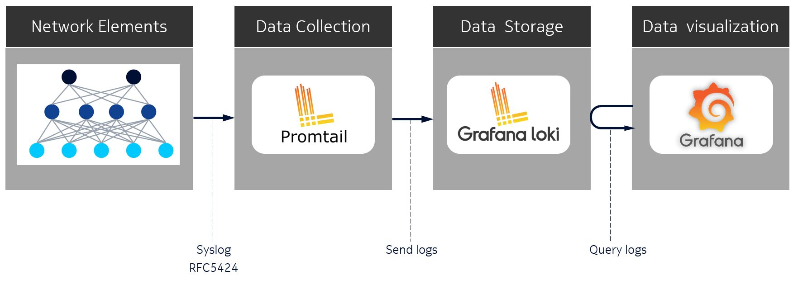
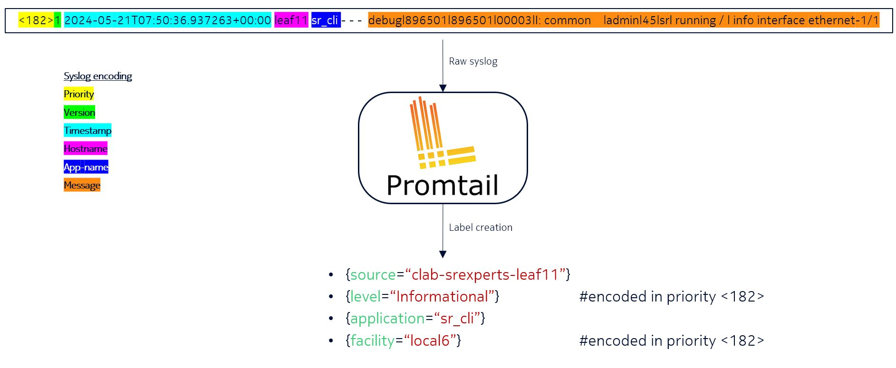
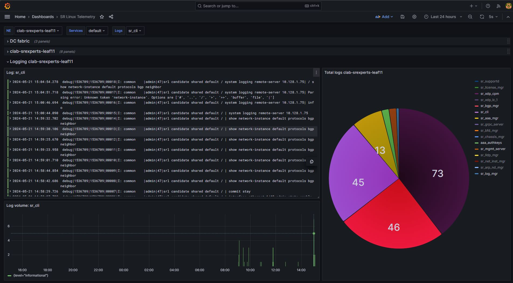

# SR Linux remote logging with Syslog and Loki

| Item              | Details                                                         |
| ----------------- | --------------------------------------------------------------- |
| Short Description | Leveraging SR Linux Syslog to enable modern centralized logging |
| Skill Level       | Beginner                                                        |
| Tools Used        | SR Linux, Syslog, Grafana, Loki                                 |

In today's rapidly evolving network environments, maintaining robust and efficient operations is more critical than ever. Remote logging plays a pivotal role in achieving this by providing a comprehensive and centralized method for monitoring, analyzing, and troubleshooting network activities across diverse and distributed systems.

In the network field, remote logging using Syslog is a de facto standard way to implement logging. Typically, the network nodes sends syslog messages to a centralized syslog collector, and an operator eyeballs the aggregated logs on the collector.

With the proliferation of distributed computing systems, the logging systems had a solid boost both in terms of log collection techniques, aggregation, querying and visualization. Modern logging stacks and services emerged - Logstash, Loki, Datadog, and dozens of cloud-provided logging solutions. In this exercise we bring you the modern logging stack based on Loki and Grafana to the SR Linux-based network deployment to showcase how modern distributed logging drastically improves the operational experience.

The logging stack of our choice consists of a syslog collector ([Promtail](https://grafana.com/docs/loki/latest/send-data/promtail/)), a database for central log storage ([Loki](https://grafana.com/docs/loki/latest/)) and a visualization tool ([Grafana](https://grafana.com/docs/grafana/latest/)) for querying and analyzing data.

At a high level, SR Linux nodes will send syslog messages formatted according to [RFC5424](https://datatracker.ietf.org/doc/html/rfc5424) to Promtail, which is responsible for collecting the logs. Promtail will create additional labels assigned to the logs and pass them through to the Loki database. Grafana can then query the logs based on the labels assigned to them.



## Objective

The goal of this lab is to get you familiar with remote logging on SR Linux. You will discover how to configure remote logging on SR Linux and apply various filters to granularly select the messages for logging. All this using the GrafanaLabs logging stack - Promtail, Loki, and Grafana.

While we will cover the most important steps, you might find the official [SR Linux Logging configuration guide](https://documentation.nokia.com/srlinux/24-3/books/config-basics/logg.html?hl=logging) and [SR Linux Log Events Guide](https://documentation.nokia.com/srlinux/24-3/title/log_events.html) useful to learn more about logging configuration on SR Linux.

## Accessing a lab node

Start by logging into `clab-srexperts-leaf11` node. You can log in by using the container name.

```bash
ssh admin@clab-srexperts-leaf11
```

## Configure logging on SR Linux

Let's start from the beginning of our data pipeline and configure logging on SR Linux nodes.

Nokia SR Linux Network OS design employs a high level of granularity where each service (e.g. `bgp_mgr`, `acl_mgr` and so on) is represented as a standalone process with a messaging bus enabling inter-process communication. These processes implement logging via the standard Linux Syslog interface. In particular, SR Linux uses a well-known rsyslog server to manage Syslog messages in the underlying Linux OS.

Basic logging configuration consists of specifying a source of the log messages, filters to apply to the sourced log messages, and specifying an output destination for the filtered log messages.

Messages logged to Linux syslog [facilities](https://documentation.nokia.com/srlinux/24-3/books/config-basics/logg.html#input-sources-log-messages__ai9ep6mg6y) and messages generated by SR Linux [subsystems](https://documentation.nokia.com/srlinux/24-3/books/config-basics/logg.html#input-sources-log-messages__ai9ep6mg6z) can be used as input sources for log messages. You can find a list of those facilities and subsystems in the documentation.

When defining a Linux OS facility or SR Linux subsystem as a log source, users can provide a priority parameter that narrows the capture to a given severity, a range, or a specific set of severities.

A destination for the ingested and filtered log messages can be one of the following:

* **local log file**: a file on disk that can be configured with retention policies.
* **buffer**: an in-memory file.
* **console**: console output.
* **remote**: remote server.

In the course of this lab exercise, we will work with a `remote-destination` output type, as we intend to send the log messages over to the Promtail service that acts as a Syslog collector and forwarder.

Let's see what the logging configuration might look like:

```
--{ + running }--[  ]--
A:leaf11# system logging

--{ + running }--[ system logging ]--
A:leaf11# info
    network-instance mgmt
    # <snippet>
    remote-server 10.128.1.75 {
        transport udp
        remote-port 1514
        subsystem aaa {
            priority {
                match-above informational
            }
        }
        subsystem acl {
            priority {
                match-above informational
            }
        }
        # other subsystems snipped here for brevity
        subsystem vxlan {
            priority {
                match-above informational
            }
        }
    }
```

Now log into `clab-srexperts-leaf11` and navigate to the `system logging remote-server 10.128.<group-id>.75` context. With the `info` command you can see what is configured in this context. Compare the configuration with the example above. What do you notice?

```
--{ + running }--[  ]--
A:leaf11# system logging remote-server 10.128.1.75

--{ + running }--[ system logging remote-server 10.128.1.75 ]--
A:leaf11# info detail
    transport udp
    remote-port 1514
    facility local6 {
        priority {
            match-above informational
        }
    }
```

You should notice we don't define individual [subsystems](https://documentation.nokia.com/srlinux/24-3/books/config-basics/logg.html#input-sources-log-messages__ai9ep6mg6z) here, but only define a facility `local6` matching informational level priority and above. By default, SR Linux subsystem messages are logged to Linux syslog facility `local6`, which gives us a configuration efficiency if we want to capture all.

### Log message format

Consider the following example of syslog-formatted messages of the `chassis` subsystem that can be seen on SR Linux:

```bash
2024-05-17T20:27:21.252868+00:00 leaf11 local6|NOTI sr_chassis_mgr: chassis|1476|1476|00122|N: The subinterface ethernet-1/50.0 is now up
2024-05-17T20:27:23.630370+00:00 leaf11 local6|NOTI sr_chassis_mgr: chassis|1476|1476|00123|N: Interface lag1 is now up
2024-05-17T20:27:23.630388+00:00 leaf11 local6|NOTI sr_chassis_mgr: chassis|1476|1476|00124|N: The subinterface lag1.1 is now up
2024-05-17T20:27:23.630494+00:00 leaf11 local6|NOTI sr_chassis_mgr: chassis|1476|1476|00125|N: The subinterface lag1.101 is now up
```

Log message format that is used by rsyslog when sending to remote destination has the following signature:

```
<TIMESTAMP> <HOSTNAME> <FACILITY>|<SEVERITY> <APPLICATION>: <SUBSYSTEM>|<PID>|THREAD_ID|SEQUENCE|<SEVERITY>: <MESSAGE> 
```

where

```
<TIMESTAMP>   - Time in format - MMM DD HH:MM:SS.
<HOSTNAME>    - SR Linux hostname.
<APPLICATION> - SR Linux application name, in the context of Syslog this is the Message ID.
<SUBSYSTEM>   - SR Linux subsystem name, which is configured under /system/logging/remote-server 
<PID>         - Process ID.
<THREAD_ID>   - Thread ID.
<SEQUENCE>    - Sequence number, which allows to reproduce order of the messages sent by SR Linux.
<SEVERITY>    - A singe char indicating criticality of the message (I - informational, W - warning, etc.)
<MESSAGE>     - Application free-form message that provides information about the event, that could contain network-instance name, like "Network-instance default".
```

<details>
<summary>Dumping syslog messages sent to the remote-server?</summary>
<br>
The format that rsyslog uses to send log messages to the remote destination differs from the default format used for buffer and file destination.

To see the messages on the wire as they are being sent towards a remote syslog collector users can leverage `tcpdump` tool available on SR Linux:

```
--{ running }--[  ]--
A:leaf1# bash 
[admin@leaf11 ~]$ tcpdump -vAnni any dst 10.128.1.75
tcpdump: listening on any, link-type LINUX_SLL2 (Linux cooked v2), snapshot length 262144 bytes

07:50:36.937551 mgmt0.0 Out IP (tos 0x0, ttl 64, id 10656, offset 0, flags [DF], proto UDP (17), length 182)
    10.128.1.33.48501 > 10.128.1.75.1514: UDP, length 154
E...).@.@..+..!..K.u....zj<182>1 2024-05-21T07:50:36.937263+00:00 leaf11 sr_cli - - -  debug|896501|896501|00003|I: common    |admin|45|srl running / | info interface ethernet-1/1
```

</details>

## Promatil

Now we are at a point when a raw syslog message has been generated by SR Linux and sent towards its first stop - Promtail.

> Promtail and Loki instances are deployed as part of the lab running on your cloud instance.

Promtail will take the raw syslog and generate additional labels associated with the log entry. The log processing/transformation is a very important process in the whole logging story. It allows you to enrich, parse and tune the log messages before they are sent to the log collector.

You can find the Promtail configuration file [here](../../../clab/configs/promtail/promtail-config.yml). Let's have a closer look and break it down a bit.

This section specifies where Promtail should send the logs to. In this case, it's sending logs to a Loki instance, by referring to its DNS name. The `loki` name is resolved by docker to the associated IP address of the Loki container.

```yaml
clients:
  - url: http://loki:3100/loki/api/v1/push
```

Next we define Promtail to be used as a syslog collector. It listens on all IP addresses on UDP port 1514 and generates a static label `job: syslog` which will be applied to all log entries.

```yaml
scrape_configs:
  - job_name: syslog
    syslog:
      listen_address: 0.0.0.0:1514
      listen_protocol: udp
      idle_timeout: 300s
      label_structured_data: yes
      labels:
        job: "syslog"
```

Relabel configs is used to manipulate or add labels to the log entries. These labels can be very useful when querying them from the Loki database. In the example below we manipulate only one label - the `source` label.

`source_labels` extracts a value from the specified field in the syslog message, in this case the `hostname`, and replaces it with `clab-srexperts-$1` and applies it to the `target_label` `source`.

Besides altering the value of the `source` label, we also use the values from the syslog internal values (e.g. `__syslog_message_severity`) and apply the value to a label with a more human-friendly name `level`.

```yaml
scrape_configs:
    #<snippet>
    relabel_configs:
      - source_labels: ["__syslog_message_hostname"]
        replacement: clab-srexperts-$1
        target_label: "source"
      - source_labels: ["__syslog_message_severity"]
        target_label: "level"
      - source_labels: ["__syslog_message_app_name"]
        target_label: "application"
      - source_labels: ["__syslog_message_facility"]
        target_label: "facility"
      - source_labels: ["__syslog_message_proc_id"]
        target_label: "procid"
```



## Loki

Time to open up Loki and query some logs based on the label created by Promtail. Log into the Grafana dashboard with `admin`/`SReXperts2024` credentials.

> To open up [Grafana](https://grafana.com) UI on your laptop use `http://<group-id>.srexperts.net:3000` address.

With Grafana UI loaded

1. Use the menu icon in the top left corner
2. Click on Explore
3. Select Loki as data source
4. In `Label filter` select label `source` with value `clab-srexperts-leaf11`
5. Click `Run query`
6. You should now see all the logs related to `clab-srexperts-leaf11`
7. Add a extra search label by clicking on `+`
8. In `Label filter` select label `application` with value `sr_cli`
9. You should now see all cli activity on `clab-srexperts-leaf11`


## Grafana

Users have the possibility to implement Loki logs into Grafana dashboards. Have a look into the `SR Linux Telemetry` dashboard.



## Tasks

* Try to add a dashboard to Grafana displaying log messages for a given subsystem.
* Experiment with promtail log parsing and try to parse the messages contained in the raw syslog message as a structured log message or a label.
