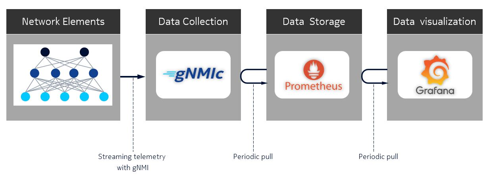
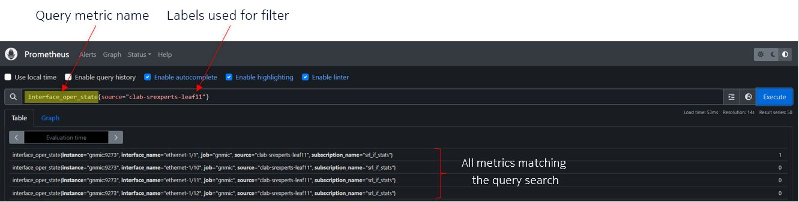
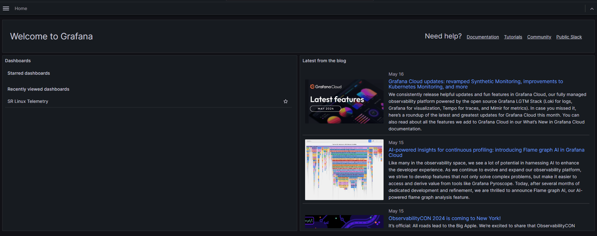
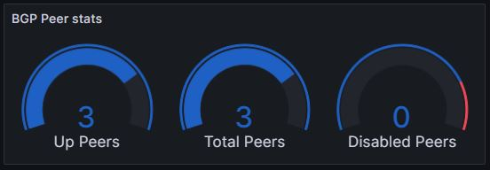
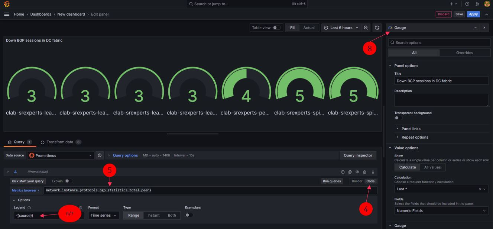
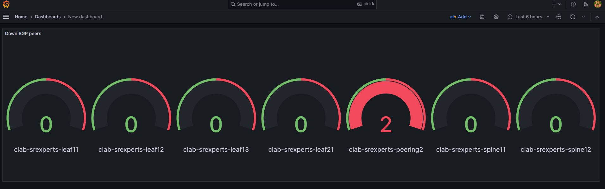

# SR Linux Streaming Telemetry

| Item              | Details                                                                                         |
| ----------------- | ----------------------------------------------------------------------------------------------- |
| Short Description | Getting familiar with Streaming Telemetry on SR Linux for enhanced visibility and observability |
| Skill Level       | Beginner                                                                                        |
| Tools Used        | SR Linux, gNMIc, Prometheus, Grafana                                                            |

Today's networks require reliable monitoring in WAN, edge, and data center domains, emphasizing real-time data collection and transmission for network visibility.
Streaming telemetry is the comprehensive practice of transmitting measurements from various network devices in real time to a collector for storage and further processing, ultimately creating a monitoring and reporting system.

A Streaming Telemetry stack consists of:

- Streaming Telemetry collector (e.g. [gNMIc](https://gnmic.openconfig.net/)) to retrieve the metrics from the network elements.
- Time-series Database (e.g. Prometheus) to collect, store and aggregate the collected metrics.
- Visualization tool (e.g. Grafana) to visualize the collected data and run queries on top of it.

gNMI is a modern gRPC-based network management interface that is currently the most popular protocol to collect Streaming Telemetry data from the networking devices. It is imoprtant to understand, that Streaming Telemetry with gNMI operates on the configuration and state data streamed from the network devices, but it does not provide flow extraction/sampling like netflow/ipfix.

## Objective

The goal of this exercise is to let you get familiar with streaming telemetry on SR Linux by making use of gNMI (gRPC Network Management Interface) to retrieve data from the nodes using
a gNMI client tool called [gNMIc](https://gnmic.openconfig.net/). You will then learn how the telemetry stack works by collecting additional data and visualize these in Grafana. By the end of this lab, you will learn:

- differences between SNMP and streaming telemetry
- how to identify and subscribe to streaming telemetry metrics
- how the components of the telemetry stack work together
- how to configure and enable streaming telemetry using gNMI over gRPC on SR Linux
- how to create visualizations of the metrics in Grafana

## Streaming telemetry and SNMP

The alternative to streaming telemetry data is the widely used SNMP (simple network management protocol) a pull-based model where the monitoring system periodically requests data from network devices. This method can cause delays in detecting issues and consumes considerable resources on both the monitored device and the monitoring system.

In contrast, streaming telemetry’s push-based approach allows network devices to stream data continuously and automatically to a centralized location. This approach enables near real-time network data collection, significantly improving the visibility and responsiveness of network monitoring. Streaming telemetry also leverages standardized data models, such as IETF YANG and OpenConfig, promoting consistency in the data collected across various devices and vendors.

## Who are you gNMI?

gRPC Network Management Interface (gNMI) is a protocol to manage and report a network element’s configuration and operational data. gNMI is built on top of Google’s widely deployed gRPC protocol. gRPC provides protocol buffers (protobufs), a language neutral mechanism to transport structured data efficiently over networks making it an ideal method for streaming operational data from network elements.

There are 4 remote procedure calls (RPC) services defined by the gNMI specification which are supported by SR Linux:

| RPC type     | Description                                                                                                                                                         |
| ------------ | ------------------------------------------------------------------------------------------------------------------------------------------------------------------- |
| Capabilities | Provides the client with information about the device, such as gNMI version, used data models and supported encodings. Frequently used to test the gNMI connection. |
| GET          | Retrieve information from the device, typically small amount of data.                                                                                               |
| SET          | Is used to set, modify or delete configuration on a network device.                                                                                                 |

| Subscribe | Used for streaming telemetry - receiving a stream of state or configuration data from the device. Subscribe RPC supports different modes: In a SAMPLE mode, the data is returned with a cadence governed by a client-provided interval; in an ON-CHANGE mode data is streamed every time there is a change in the subscribed data elements. |

## gNMIc as a command line interface to gNMI

[gNMIc](https://gnmic.openconfig.net/) is a command line tool developed by Nokia and donated to the OpenConfig project. It lets you interact with the gNMI server running on the SR Linux nodes. It can be used to run the various RPCs we discused above against SR Linux.

Log into your lab server and run the help command of the `gnmic` tool. Look at the available commands this tool offers. You should recognize the 4 gNMI RPCs: Capabilities, GET, SET, and Subscribe.

```bash
>$ gnmic --help
run gnmi rpcs from the terminal (https://gnmic.openconfig.net)

Usage:
  gnmic [command]

Available Commands:
  capabilities query targets gnmi capabilities
  get          run gnmi get on targets
  help         Help about any command
  ...          ...
  set          run gnmi set on targets
  subscribe    subscribe to gnmi updates on targets
  version      show gnmic version

```

### To what should I subscribe to?

The next step is fetching or subscribing to data on SR Linux. Since SR Linux is a fully YANG-modelled NOS, we need the identify the gNMI paths that point to the data we want to fetch. You can find these paths in the SR Linux CLI.

Open a second terminal where you log into `clab-srexperts-leaf11`. Let's say we want to retrieve the *host-name* of this device. You can find the XPath by running the following command in SR Linux CLI

```bash
--{ running }--[  ]--
A:leaf11# tree xpath system name
/system/name
/system/name/domain-name:
/system/name/host-name:

```

From the output you can find that for us to retrieve the *host-name* we will need to use the following XPath `/system/name/host-name`. Advanced CLI users who are well aware of the SR Linux YANG model can use this approach, but in many cases we don't know where or what we are looking for. This is when [YANG Browser](https://yang.srlinux.dev/v24.3.1) might come handy.

The YANG browser lets you do a search through the SR Linux YANG model. By simply typing for certain keywords, the YANG browser will return any matches found.


## TASK

### 1 gNMI GET

Now that you know the YANG path for the *host-name*, use gNMIc GET operation to fetch the *host-name* of `clab-srexperts-leaf11`

```bash
>$ gnmic -a clab-srexperts-leaf11 -u admin -p SReXperts2024 --skip-verify -e json_ietf get --path /system/name/host-name
[
  {
    "source": "clab-srexperts-leaf11",
    "timestamp": 1715173587237581773,
    "time": "2024-05-08T13:06:27.237581773Z",
    "updates": [
      {
        "Path": "srl_nokia-system:system/srl_nokia-system-name:name/host-name",
        "values": {
          "srl_nokia-system:system/srl_nokia-system-name:name/host-name": "leaf11"
        }
      }
    ]
  }
]

```

Now we would like to fetch the *traffic-rate* of our interfaces. Try to find in the [YANG Browser](https://yang.srlinux.dev/v24.3.1) the YANG path for traffic-rate and fire again a gNMIc GET operation. You will notice there is a match in the YANG browser for ingress-bps and egress-bps.

```bash
>$ sudo gnmic -a clab-srexperts-leaf11 -u admin -p SReXperts2024 --skip-verify -e json_ietf get --path /interface[name=*]/traffic-rate/in-bps
[
  {
    "source": "clab-srexperts-leaf11",
    "timestamp": 1715179859187275659,
    "time": "2024-05-08T14:50:59.187275659Z",
    "updates": [
      {
        "Path": "",
        "values": {
          "": {
            "srl_nokia-interfaces:interface": [
              {
                "name": "ethernet-1/1",
                "traffic-rate": {
                  "in-bps": "0"
                }
              },
              {
                "name": "ethernet-1/2",
                "traffic-rate": {
                  "in-bps": "0"
                }
              },
              {
                "name": "ethernet-1/3",
                "traffic-rate": {}
              },

              <snippet>
```

Notice that you will receive traffic rates for all interface available on the device. This is because we are matching all interfaces in the YANG path. Try to fetch now only the traffic-rate for interface ethernet-1/49

```bash
>$ sudo gnmic -a clab-srexperts-leaf11 -u admin -p SReXperts2024 --skip-verify -e json_ietf get --path /interface[name=ethernet-1/49]/traffic-rate/in-bps
[
  {
    "source": "clab-srexperts-leaf11",
    "timestamp": 1715180821959245729,
    "time": "2024-05-08T15:07:01.959245729Z",
    "updates": [
      {
        "Path": "srl_nokia-interfaces:interface[name=ethernet-1/49]/traffic-rate/in-bps",
        "values": {
          "srl_nokia-interfaces:interface/traffic-rate/in-bps": "143"
        }
      }
    ]
  }
]
```

### 2 gNMIc Subscribe

Let's start now with some real streaming of telemetry data. Instead of performing a gNMI GET, we will now use the Subscribe RPC service to stream back the traffic-rate for interface ethernet-1/49 every 5 seconds.
Choose now for a subscribe command with stream-mode sample with a sample-interval of 5 seconds. The traffic-rate should now pop on on your terminal every 5 seconds.

```bash
>$ sudo gnmic -a clab-srexperts-leaf11 -u admin -p SReXperts2024 --skip-verify -e json_ietf subscribe --stream-mode sample --sample-interval 5s --path /interface[name=ethernet-1/49]/traffic-rate/in-bps

{
  "source": "clab-srexperts-leaf11",
  "subscription-name": "default-1715181630",
  "timestamp": 1715181630980740286,
  "time": "2024-05-08T15:20:30.980740286Z",
  "updates": [
    {
      "Path": "srl_nokia-interfaces:interface[name=ethernet-1/49]/traffic-rate/in-bps",
      "values": {
        "srl_nokia-interfaces:interface/traffic-rate/in-bps": "289"
      }
    }
  ]
<update every 5 seconds>
}

```

Choosing for stream mode sample is useful when you have fast changing data, but there are other cases where your operational data doesn't change freuqently. Think about BGP neighborship state and interface operational states. It wouldn't be useful to receive their status every 5 seconds if it almost never changes. It would be much more efficient if we only receive an update when their state changes. For these cases you can use the on-change stream mode.

Search in the [YANG Browser](https://yang.srlinux.dev/v24.3.1) for the YANG path corresponding to the *oper-state* of interface ethernet-1/2.
Change now the stream mode to on-change and try to fetch the oper-state of the interface. You should notice that we only will receive an update when the operational state of interface ethernet-1/2 changes.

```bash
>$ sudo gnmic -a clab-srexperts-leaf11 -u admin -p SReXperts2024 --skip-verify -e json_ietf subscribe --stream-mode on-change --path /interface[name=ethernet-1/2]/oper-state
{
  "source": "clab-srexperts-leaf11",
  "subscription-name": "default-1715183276",
  "timestamp": 1715183276383801822,
  "time": "2024-05-08T15:47:56.383801822Z",
  "updates": [
    {
      "Path": "srl_nokia-interfaces:interface[name=ethernet-1/2]/oper-state",
      "values": {
        "srl_nokia-interfaces:interface/oper-state": "up"
      }
    }
  ]
}
{
  "source": "clab-srexperts-leaf11",
  "subscription-name": "default-1715183276",
  "timestamp": 1715183350700538948,
  "time": "2024-05-08T15:49:10.700538948Z",
  "updates": [
    {
      "Path": "srl_nokia-interfaces:interface[name=ethernet-1/2]/oper-state",
      "values": {
        "srl_nokia-interfaces:interface/oper-state": "down"
      }
    }
  ]
}
```

#### Optional

Defining subscriptions with subscribe command's CLI flags is a quick and easy way to test and work with gNMI subscribtions. A downside of that approach is that commands can get lengthy when defining multiple subscriptions. To make your life a bit more easy you can define your subscriptions in a configuration YAML file.

```bash
gnmic subscribe --config gnmi-config.yaml
```

```yaml
username: admin
password: SReXperts2024
skip-verify: true

targets:
  clab-srexperts-leaf11:
    subscriptions:
      - oper-state

subscriptions:
  oper-state:
    paths:
       - "/interface[name=ethernet-1/2]/oper-state"
    stream-mode: on-change

```

## Streaming telemetry using a Telemetry Stack

Now that you know how to stream metrics from SR Linux nodes, it's time to take it to the next level. Visualizing the data using a telemetry stack is crucial for understanding what is happening in your network in real-time. A telemetry stack typically consists of three elements:

1. Collector (gNMIc)
2. Time series database (Prometheus)
3. Visualization dashboard (Grafana)



### Telemetry stack components

Let's have a closer look at the telemetry stack components and try to understand what their roles are.

#### gNMIc

If you have been following the lab from the start, you should now be familiar with gNMIc. It is an Openconfig project developed by Nokia that allows subscribing to streaming telemetry data from network devices and export it to a variety of destinations. In this lab, gNMIc is used to subscribe to the telemetry data from the fabric nodes and export it to the prometheus time-series database.

The gNMIc configuration file [config.yml](../../clab/configs/gnmic/config.yml) is applied to the gNMIc container at startup. It instructs the container to subscribe to telemetry data and export it to the Prometheus time-series database. Examine the file to locate where the YANG paths are defined. You should also note Prometheus is defined as an output. This file should look familiar, as it aligns with what we defined earlier [here](#optional).

```yaml
username: admin
password: SReXperts2024
port: 57400
timeout: 10s
skip-verify: true
encoding: json_ietf

#<snippet>

subscriptions:
  srl_if_stats:
    paths:
      - /interface[name=ethernet-1/*]/statistics
      - /interface[name=*]/subinterface[index=*]/statistics/
      - /interface[name=ethernet-1/*]/oper-state
      - /interface[name=ethernet-1/*]/traffic-rate
    mode: stream
    stream-mode: sample
    sample-interval: 5s
#<snippet>

```

#### Prometheus

[Prometheus](https://prometheus.io) is a popular open-source time-series database. It is used in this lab to store the telemetry data exported by gnmic. The prometheus configuration file ([prometheus.yml](../../clab/configs/prometheus/prometheus.yml)) has a minimal configuration and instructs prometheus to scrape the data from the gnmic collector with a 5s interval. Metrics are stored with the timestamp (Time Series Data) at which they were recorded, alongside optional key-value pairs called labels.

\**If you need to adjust the data that is scraped by prometheus you have to edit the [config.yml](../../clab/configs/gnmic/config.yml) file.*

> To open up [Prometheus](https://prometheus.io/) UI on your laptop use `http://<group-id>.srexperts.net:9090` address.



#### Grafana

[Grafana](https://grafana.com) is another key component of this lab, as it provides visualization for the collected telemetry data. This repository includes preconfigured reference dashboards that provide multiple views on the collected real-time data.

(\**connect using the instructions below before moving on*)

> To open up [Grafana](https://grafana.com) UI on your laptop use `http://<group-id>.srexperts.net:3000` address.

Grafana is pre-configured with anonymous access enabled so that you can view the dashboards without authentication. To edit the dashboards you have to login with the username `admin` and password `admin`. The login button is in the top right corner of the Grafana UI.

There are some preconfigured dashboards avalailable. Navigate to the `SR Linux Telemetry` dashboard as described below to have a look and feel of what is available. Check which panels are available and what data they show. Try to understand how the data is collected and how it is visualized.



## Task

For creating dashboards you will need to log in. Click on the `Sign in` button in the top right. User `admin` with password `SReXperts2024`.

If you look to the `SR Linux Telemetry` dashboard you will see a panel named *BGP Peer stats*. It visualizes three gauges: Up peers, Total Peers and Disabled Peers.



Your task is to create a dashboard that visualizes if there are any BGP sessions down in the data center fabric. There is no metric that corresponds to the amount of BGP down session, but we can calculate it from the total amount of BGP Total peers available and subtract the total amount BGP sessons in Up state.

### 1 Create a new dashboard

1. Click the `burger menu` -> `Dashboards` -> `New` -> `New Dashboard`
2. Click `+ Add visualization` and select `Prometheus`
3. Click in the `Metrics` box and select `Metrics explorer`
4. Change the Metric view from `Builder` to `Code`
5. Type `total_peers` in the Metric browser and select `network_instance_protocols_bgp_statistics_total_peers`
6. Click `> Options` and choose `Custom` from the `Legend` dropdown menu
7. Type `{{source}}` in the `Legend` box
8. Click `Time series` in the upper right to expand the dropdown menu
9. Choose `Gauge` from the dropdown

You pannel should now look like this with gauges showing only the `total peers`



### 2 Calculate total BGP session that are down

10. In the Metric browser subtract `network_instance_protocols_bgp_statistics_total_peers` with `network_instance_protocols_bgp_statistics_up_peers`
11. In the `Panel options` section on the right, type `Down BGP session in DC fabric` in the `Title` box
12. Click `apply` in the upper right corner

You should now see the total amount of BGP session down in the fabric


