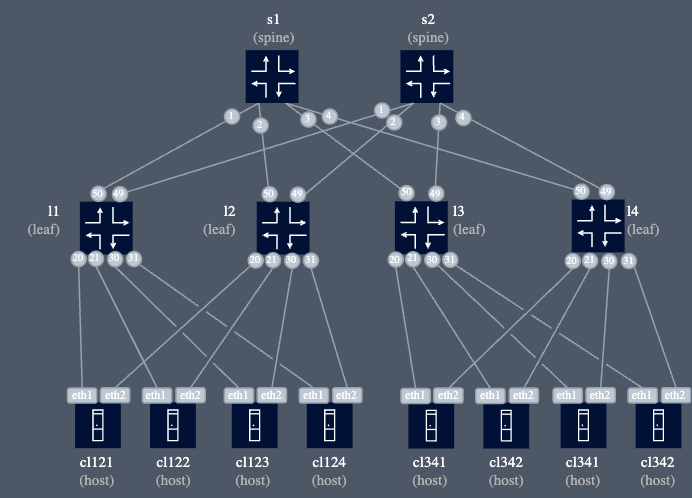

# Intent-based configuration management for SR Linux with Ansible

| Item              | Details                                                             |
| ----------------- | ------------------------------------------------------------------- |
| Short Description | Leveraging Ansible to enable intend-driven configuration management |
| Skill Level       | Intermediate                                                        |
| Tools Used        | SR Linux, Ansible, Python                                           |

## Prerequisites

1. Basic Ansible knowledge: playbooks, roles, Jinja templates
2. Good understanding of SR Linux networking concepts and EVPN

## Intro

Using the [Intent-based Ansible Lab repo](https://github.com/srl-labs/intent-based-ansible-lab) we will configure an SR Linux fabric using intents. These intents are a set of YAML files describing low-level network constructs as well as high-level intents.

We make a distinction between:

- **device-abstraction layer** or **level-1** intents: per-device intents, defined either on group- or host-level and the structure is close to the actual device data model, although not identical. It's a _normalized_ data model that facilitates common configuration of different NOSs. The playbook/roles support SR Linux and SROS (limited functionality) but could be extended with other NOSs as well.
- **service-level** or **level-2** intents: these are intents at a higher abstraction layer and are _fabric-wide_, as opposed to the device-abstraction layer intents. There are _l2vpn_, _l3vpn_ and _mh-access_ intents that describe bridge-domains, ip-vrfs and lags/ethernet-segments respectively.

## Objectives

- Configuration of a fabric through declarative intents with Ansible
- Understand the approach taken by inspecting the roles and playbook: full intent deployment, implicit pruning, jinja-templates
- Extend functionality of the playbook/roles

## Preparation

### Install Ansible components

Install Ansible components in a virtual-environment on your server instance as follows:

1. Clone intent-based-ansible-lab repo. This holds all the ansible roles and playbooks that will be used in this lab

    ```
    cd $HOME
    git clone https://github.com/srl-labs/intent-based-ansible-lab.git
    ```

2. Create Python virtual-env and install dependencies

    ```
    cd intent-based-ansible-lab
    python3 -m venv .venv
    source .venv/bin/activate
    pip install -U pip && pip install -r requirements.txt
    ```

3. Install the `nokia.srlinux` collection from Ansible Galaxy. This module contains the required plugins to connect to SR Linux devices using the JSON-RPC management interface:

    ```
    ansible-galaxy collection install nokia.srlinux
    ```

### Spin up a dedicated lab topology

We'll be using a dedicated topology with 2 spines and 4 leafs for this lab not to interfere with other labs on the existing hackathon topology.
Spin up the lab as follows:

```bash
sudo clab deploy -c -t topo.yml
```

Below diagram shows the topology and the connected clients:



### Install `fcli`

We will be using `fcli` to get state information from the fabric in tabular format. This is useful to verify the deployment of the intended changes after running the `cf_fabric` playbook.

In the `intent-based-ansible-lab` directory run:

```
source .aliases.rc
```

This creates a shell alias with the name `fcli`:

```bash
$ alias fcli
alias fcli='docker run -t --rm --network intent-lab -v /etc/hosts:/etc/hosts:ro -v /home/nokia/intent-based-ansible-lab/topo.yml:/topo.yml ghcr.io/srl-labs/nornir-srl -t /topo.yml'
```

Verify with `fcli sys-info` to get a list of nodes see if it's working.

**Note**: in this lab `fcli` is using the Containerlab topo file `topo.yml` to build the inventory to simplify things. Alternatively, you could build your own Nornir inventory and config file as explained in the [fcli repo](https://github.com/srl-labs/nornir-srl) but this is out-of-scope for this lab.

## Components

### Ansible inventory

This is contained in the `inv` directory inside the `intent-based-ansible-lab` and contains 2 files:

1. `ansible-inventory.yml`: this lists the nodes and groups and can also include other data that can be referenced in playbooks, in this case, the _ASN_ and _router-id_ are defined here. Also, 3 groups are defined: `leaf`, `spine` and `srl`.
2. `group_vars/srl.yml`: this is a standard Ansible location for group-specifics settings. In this case, it contains connection parameters to connect to SR Linux nodes, i.e. nodes in group `srl`.

### Intents

Intents are described as a set of YAML files and are placed in the `intent` directory, which is initially empty. We'll be copying in intent files from the `intent_examples` folder followed by an `ansible-playbook` run to deploy the intent.

There are 3 types of intents, based on their abstraction level. There are:

1. _Level-0 intents_ or _Device Intents_, which are the actual configuration data that is pushed to the device. These are generated from the level-1 intents and are device-specific. They are not stored in the intent directory but are generated by the `configure` role.
2. _Level-1 intents_ or _Infra Intents_, which are per-device intents and follow a schema that is close to the SR Linux device model but different enough to shield intents against data model changes of SR Linux across NOS versions and to support other NOSs like SROS using the same Infra Intent schemas or models. These intents are stored in `group_infra.yml` and `host_infra.yml` and contain configuration data for device groups and individual nodes respectively.  
3. _Level-2 intents_ or _Service Intents_ are at a higher abstraction layer and define _fabric-wide_ intents. These include:

    - **Fabric intent**: describes the underlay of the fabric, i.e. links, node types (e.g. leaf, spine), ASN ranges, loopback and ISL address ranges, attributes for BGP, etc. This intent is stored in `fabric.yml`. The associated role in `fabric` and this role will transform the Fabric Intent into level-1 intents
    - **Multi-homing Access intent**: describes LAG interfaces for multi-homed clients and the the associated role `mh_access` translates this into level-1 intents to provision LAG interfaces and Ethernet Segments on the appropriate nodes. The intents are stored in YAML files with filename starting with `mh_access`
    - **L2VPN intent**: describes fabric-wide Bridge Domains. The associated role is `l2vpn` which transforms the L2VPN intent into level-1 intents that include mac-vrf configuration on the appropriate nodes. Intents are stored in YAML files with filename starting with `l2vpn`
    - **L3VPN intent**: describes fabric-wide overlay routing. The associated role is `l3vpn` which transforms the L3VPN intent into level-1 intents that include ip-vrf configuration for the appropriate nodes. L3VPN intent file start with `l3vpn`

### The playbook

Configuration deployment happens with running the `cf_fabric.yml` playbook in `$HOME/intent-based-ansible-lab/playbooks/`. It calls the various roles in sequence to gradually build up the level-1 intent from level-2 intents and to finally create the level-0 intent via the `configure` role that calls the `rpc_` roles for each top-level resource.

It is run with the `ansible-playbook` command and takes the following parameters that are used in this lab:

- `--check`: Run the playbook in _dry-run_ mode. It executes all the roles but doesn't actually modify the state of the device
- `--diff`: show the difference after deploying the change between the new and the old configuration state of the device
- `-i`: points to the inventory
- `-e`: extra variables for the playbook/roles: we specify `intent_dir` to define the location of the intent directory
- `-l`: limit playbook run to a subset of nodes, e.g. `-l clab-4l2s-l1` to limit the run to leaf1

The Playbook is run against a set of nodes, as defined in the inventory and the `hosts` directive in the playbook and is deploying device config in a single transaction per device. Most of the playbook roles build up the configuration data on `localhost` and only in a final step, the `configure` role, is configuration pushed. If it fails, e.g. due to an Ansible-related error or device model mismatch, nothing is applied - it's all-or-nothing. This ensures there is no inconsistent, partial configuration pushed to the device and possible interdependency violations.

## Exercises

### 1. Configure the fabric underlay

To get a fabric-wide view on the state of the fabric, we use the `fcli` tool.

To ensure we start with a clean slate, check the network-instances on all the nodes with:

```
fcli ni
```

The first step after a design phase is the configuration of the fabric underlay. This includes inter-switch link addressing, underlay routing, ASN allocation in case of EBGP-based underlay routing, overlay routing infrastructure (IBGP sessions, route-reflectors), etc.

There are essentially 2 ways to configure the underlay: (1) via a high-level Fabric Intent or (2) via level-1 infra intents.

#### STEP 1: using a Fabric Intent

The [Fabric Intent Schema](https://github.com/srl-labs/intent-based-ansible-lab/blob/main/playbooks/roles/fabric/criteria/fabric_intent.json) is defined under the `fabric` role that uses it to validate the intent. It is in JSON-schema format and describes the structure of the fabric intent, required fields and other things.
This is your guide to write Fabric Intents.

A Fabric intent has already been prepared for this lab topology and sits in the `intent_examples/infra/underlay_with_fabric_intent` directory in `$HOME/intent-based-ansible-lab`.

Copy the files over to the `intent` directory. Make sure your current directory is `$HOME/intent-based-ansible`:

```bash
cp intent_examples/infra/underlay_with_fabric_intent/* intent
```

Inspect the `fabric.yml` file to understand the configuration options of the Fabric Intent. It describes the underlay routing, loopback address range for the nodes in the inventory, inter-switch links (`p2p` prefix), location of the RR's and cabling info. It also provides some override capabilities if you don't want the role to dynamically assign these parameters.

Also, notice that the `intent` directory has 2 additional level-1 intent files, `group_infra.yml` and `host_infra.yml`. The `group_infra.yml` files contain configuration data such as route-policies and filters. The `host_infra.yml` file is empty as all the node-specific configuration is handled by the Fabric Intent.

Let's go ahead and run the playbook first in _dry-run_ mode with the `--check` option and limit it to a specific node `clab-4l2s-l1`:

```bash
ansible-playbook -i inv -e intent_dir=${PWD}/intent --check --diff playbooks/cf_fabric.yml -l clab-4l2s-l1
```

This shows you the difference between per-device intent and device configuration state and it also shows that the configuration is valid - it has been accepted by the node.

Let's now deploy the underlay configuration to all nodes:

```bash
ansible-playbook -i inv -e intent_dir=${PWD}/intent --diff playbooks/cf_fabric.yml
```

`fcli` commands to verify the state of the fabric:

```bash
fcli ni                             # list of network-instances
fcli bgp-peers                      # get BGP sessions per network-instance
fcli subif -f itf=system0           # get system loopback addresses
fcli ipv4-rib -f ni=default -f prefix="192.168.255.*" # Check if all nodes have eachother's loopback
```

Change the underlay to _BGP unnumbered_ in the fabric intent (`intent/fabric.yml`), and **remove the ISL address range**, run the playbook again and check the BGP sessions with `fcli bgp-peers`.

You will see that the EBGP sessions for underlay routing are now using IPv6 LLA's thus not requiring IP address configuration on the inter-switch links.

#### STEP 2: using Infra intents

Although the Fabric intent is easy to use, you may need extra configuration flexibility at the expense of extra configuration data.

In this step, we provision the underlay via level-1 Infra intents.

The top-level resources and their schema are available in [`playbooks/roles/infra/criteria`](https://github.com/srl-labs/intent-based-ansible-lab/tree/main/playbooks/roles/infra/criteria) and are in json-schema format. When the `infra` role loads the level-1 intents from the `group_infra.yml` and `host_infra.yml` it validates the configuration data against these schemas.

Clear the `intent` folder and copy the files in `intent_examples/infra/underlay_with_level1_intents` over:

```bash
rm intent/*yml 
cp intent_examples/infra/underlay_with_level1_intents/* ./intent
```

Now the fabric underlay is fully defined by group-level and host-level infra intents.

Run the `cf_fabric` playbook again and notice the difference.

### 2. Configure Multi-homing Access

The **Multi-homing Access** intent is a requirement for services that have multi-homed clients. It involves creating a LAG interface with the proper member links and LACP parameters as well as the EVPN Ethernet Segment that is the standarized construct for EVPN multi-homing in either _all-active_ or _single-active_ mode.
There is an N:1 relationship between a L2VPN service and a Multi-homing Access instance.

These intents are handled by the `mh_access` role and the schema of `mh_access` intents are defined in [`playbooks/roles/mh_access/criteria/mh_access.json`](https://github.com/srl-labs/intent-based-ansible-lab/blob/main/playbooks/roles/mh_access/criteria/mh_access.json).

Let's start by adding a `mh_access` intent to create a multi-homed lag for `cl121` that is multi-homed to `clab-4l2s-l1` and `clab-4l2s-l2`:

```yaml
mh-1: # ID used to construct ESI <prefix>:<id>:<lag_id>, lag_id per rack, id farbic wide 
  lag_id: lag1
  mh_mode: all-active # all-active or single-active
  description: mh-1:LAG1
  lacp_interval: FAST
  interface_list:
    clab-4l2s-l1:
    - ethernet-1/20
    clab-4l2s-l2:
    - ethernet-1/20
  lacp: true
  vlan_tagging: true
  min_links: 1
```

Each Multi-Homing Access intent is identified by an id in the format `mh-`_identifier_ that must be unique across all `mh_access` intents. This intent creates a LAG interface `lag1` on nodes specified in the `interface_list` on the specified interfaces.

Alternatively, you can use interface tags to reference the interfaces of a multi-homing access like so:

```yaml
mh-1:
  lag_id: lag1
  mh_mode: all-active 
  description: mh-1:LAG1
  lacp_interval: FAST
  interface_tags: # interfaces must be tagged with ANY tags specified in interface_tags
    - mh-1
  lacp: true
  vlan_tagging: true
  min_links: 1
```

This decouples the MH Access intent definition from physical and topological aspects of the fabric. This requires that the proper interfaces are tagged with `mh-1` in the infra intents:

```yaml
clab-4l2s-l1:
  interfaces:
    ethernet-1/20:
      TAGS:
        - mh-1
clab-4l2s-l2:
  interfaces:
    ethernet-1/20:
      TAGS:
        - mh-1
```

Copy over above 2 files from `intent_examples/services` into `intent/` and run the playbook:

```
cp intent_examples/services/mh_access-1.yml intent_examples/services/host_infra_itf_tags.yml intent
ansible-playbook -i inv -e intent_dir=${PWD}/intent --diff playbooks/cf_fabric.yml
```

**Note**: Although we use a separate infra intent file for the interface tagging, it's equally valid to update the existing `group_infra.yml`or `host_infra.yml` files to include the interface tagging. All level-1 intents in group and host infra files get merged to a single per-device level-1 intent, with host data taking precedence over group data.

Check the LAGs in the fabric with `fcli lag`.

Check the EVPN Ethernet Segments with `fcli es`.

### 3. Configure Bridge Domains (L2VPN)

#### STEP 1: Configure `subnet-1`

**L2VPN** intents describe high-level parameters required to deploy a fabric-wide bridge-domain. The schema of the configuration data is defined in [`playbooks/roles/l2vpn/criteria/l2vpn.json`](https://github.com/srl-labs/intent-based-ansible-lab/blob/main/playbooks/roles/l2vpn/criteria/l2vpn.json).

Below is an example of a L2VPN intent definition:

```yaml
subnet-1:
  id: 101
  type: mac-vrf
  description: subnet-1
  proxy_arp: true
  interface_tags:
    - _mh-1     # interfaces created by mh_access intent 'mh-1' are tagged with '_mh-1'
  export_rt: 100:101
  import_rt: 100:101
  vlan: 100
```

A L2VPN intent definition starts with the name of the service, `subnet-1` in this example together with its properties. `id` is a unique ID across all service instances. This intent will create a mac-vrf on all nodes that have interfaces tagged with `_mh-1` with the mac-vrf name equal to the L2VPN name.

This `_mh_1` tag is a special type of tag, starting with `_` and is automatically added to interfaces by the Multi-homing Access intent `mh-1`. A sub-interface for each of the tagged interfaces is created with the proper VLAN encapsulation and associated with the mac-vrf instances on the nodes with the tagged interfaces.

Let's copy this file from the intent examples directory and deploy it:

```
cp intent_examples/services/l2vpn_101.yml intent
ansible-playbook -i inv -e intent_dir=${PWD}/intent --diff playbooks/cf_fabric.yml
```

Check the state of the service and the Ethernet Segments in the fabric with `fcli`:

```bash
fcli ni -f ni=subnet-1  # interfaces of mac-vrf 'subnet-1'
fcli es                 # Ethernet Segments
```

#### STEP 2: Add additional LAGs to `subnet-1`

We now have bridge domain across leaf1 and leaf2 with a single multi-homed interface for client `cl121`, which is not very useful. Lets add another another Multi-homing Access intent for `cl123` and `cl342` that are part of the same subnet (based on IP configuration of the `bond0.100` interface. See `topo.yml` file).

Two additional LAG interfaces are required to be mapped to the bridge domain:

- LAG with interface `e-1/30` on `leaf1` and `leaf2` for client `cl123`
- LAG with interface `e-1/30` on `leaf3` and `leaf4` for client `cl342`

The appropriate interface tagging has already been done in `host_infra_itf_tags.yml` of the previous step. We now need to reference these tags in 2 additional Multi-homing Access intents in the existing L2VPN intent.

The `mh_access_2.yml` file contains the 2 extra `mh_access` intents, the `l2vpn_101bis.yml` contains an updated L2VPN intent for `subnet-1` and now references these extra Multi-homing Access intents.

```bash
cp intent_examples/services/mh_access-2.yml intent
cp intent_examples/services/l2vpn_101bis.yml intent/l2vpn_101.yml # replaces the previous
ansible-playbook -i inv -e intent_dir=${PWD}/intent --diff playbooks/cf_fabric.yml
```

Verify `subnet-1`, LAGs and Ethernet Segments with:

```
fcli lag
fcli es
fcli ni -f ni=subnet-1
```

Verify L2 connectivity between clients `cl121`, `cl123` and `cl342`, e.g.:

```bash
docker exec -it clab-4l2s-cl121 ping -c3 10.0.1.3
docker exec -it clab-4l2s-cl121 ping -c3 10.0.1.4
```

Check MAC table of `subnet-1` with `fcli mac -f ni=subnet-1`.

### 4. Configure overlay routing (L3VPN)

#### STEP 1: Create a L3VPN service with 2 subnets

**L3VPN** intents describe high-level parameters required to deploy ip-vrf instances on the participating nodes. The schema of the configuration data is defined in [`playbooks/roles/l3vpn/criteria/l3vpn.json`](https://github.com/srl-labs/intent-based-ansible-lab/blob/main/playbooks/roles/l3vpn/criteria/l3vpn.json).

Below is an example of a L3VPN intent definition:

```yaml
## l3vpn_2001.yml
ipvrf-1:
  id: 2001
  type: ip-vrf
  arp_timeout: 280
  description: ipvrf-1::cust:Acme
  snet_list:
    - macvrf: subnet-1
      gw: 10.0.1.254/24
    - macvrf: subnet-2
      gw: 10.0.2.254/24
  export_rt: 100:2002
  import_rt: 100:2002
```

A L3VPN intent definition starts with the name of the service, `ipvrf-1` in this example together with its properties. `id` is a unique ID across all service instances (L2VPNs and L3VPNs).

`snet_list` is a list of subnets. Each subnet is defined by an existing mac-vrf on the node and the anycast gateway IP address of the subnet. This intent will create an ip-vrf with name `ipvrf-1` on all nodes that have mac-vrf `subnet-1` configured.

To verify inter-subnet routing, we need to create an additional L2VPN service. Let's first define 2 `mh_access` intents for multi-homed clients `cl122` and `cl341`. The appropriate interface-tagging has already been done in a previous step.

```yaml
## mh_access-3.yml
mh-4: # ID used to construct ESI <prefix>:<id>:<lag_id>, lag_id per rack, id farbic wide 
  lag_id: lag3
  mh_mode: all-active # all-active or single-active
  description: mh-4:LAG1
  lacp_interval: FAST
  interface_tags: # interfaces must be tagged with ANY tags specified in interface_tags
    - mh-4
  lacp: true
  vlan_tagging: true
  min_links: 1
mh-5: # ID used to construct ESI <prefix>:<id>:<lag_id>, lag_id per rack, id farbic wide 
  lag_id: lag4
  mh_mode: all-active # all-active or single-active
  description: mh-5:LAG1
  lacp_interval: FAST
  interface_tags: # interfaces must be tagged with ANY tags specified in interface_tags
    - mh-5
  lacp: true
  vlan_tagging: true
  min_links: 1
```

Next, we define a new L2VPN instance `subnet-2` and attach it to `cl122` with IP address `10.0.2.2/24` and `cl341` (`10.0.2.3/24`) through the internal tags of `mh-4` and `mh-5`:

```yaml
### l2vpn_102.yml
subnet-2:
  id: 102
  type: mac-vrf
  description: subnet-2
  proxy_arp: true
  interface_tags:
    - _mh-4
    - _mh-5
  export_rt: 100:102
  import_rt: 100:102
  vlan: 200
```

Now the L3VPN service is defined using the two L2VPN intents (subnets) together with the additional L2VPN intent for `subnet-2`. Let's copy this file from the intent examples directory and deploy it:

```bash
cp intent_examples/services/mh_access-3.yml intent
cp intent_examples/services/l2vpn_102.yml intent
cp intent_examples/services/l3vpn_2001.yml intent
ansible-playbook -i inv -e intent_dir=${PWD}/intent --diff playbooks/cf_fabric.yml
```

Check the `ipvrf-1` network-instances with `fcli ni -f ni=ipvrf-1`.

Verify inter-subnet connectivity:

```bash
docker exec -it clab-4l2s-cl121 ip address show dev bond0.100
docker exec -it clab-4l2s-cl121 ping -c3 10.0.2.3
```

Check the ARP table of `ipvrf-1` with `fcli arp -f ni="*ipvrf-1*"`.

#### STEP 2: Add a routed sub-interface to `ipvrf-1`

In this final step, we add a routed sub-interface to the `ipvrf-1` service to provide a routed interface to the client `cl011` connected to `clab-4l2s-l1` port `e-1/22` with IP address `10.5.0.1/31` - see `topo.yml` for details.

**Note**: `cl011` is not shown in the topology diagram. It is connected to `clab-4l2s-l1` on port `e-1/22`.

You're on your own now!

Define a _Level-1 Infra_ intent to add the routed sub-interface to the `ipvrf-1` service. Use a dedicated infra intent file. Look at existing infra intents and the [schemas](https://github.com/srl-labs/intent-based-ansible-lab/tree/main/playbooks/roles/infra/criteria) of the `infra` role to understand how to define the configuration data. You will need to define an `interface`, a `sub_interface` and add it to network-instance `ipvrf-1` on `clab-4l2s-l1`.

To verify your change, `cl011` should be able to reach the other clients in `subnet-1` and `subnet-2`.

```bash
docker exec -it clab-4l2s-cl011 ping -c3  10.0.1.3
docker exec -it clab-4l2s-cl011 ping -c3  10.0.2.3
```

[Solution](./solutions/routed-interface.md)

### 5. Extend the playbook

This exercise is elaborate and optional and is meant for those who want to extend the functionality of the playbook. You should have a good understanding of Ansible, Jinja2 templating and the SR Linux data model. It is expected that this exercise will take some time (60' estimated if all goes well).

The goal is to add static-route capabilities to the playbook by:

- defining the `network_instance` variable structure to add `static-routes` and `next-hop-groups` (Level-1 Infra intent)
- extending the `rpc_network-instance` role. More specifically, the Jinja template that generates the JSON-RPC payload for the `network-instance` resource from Level-1 Infra intents. The template is located in `playbooks/roles/rpc_network-instance/templates/srlinux/default/network-instance.j2`
- optionally, updating the json-schema of the `network-instance` resource in `playbooks/roles/infra/criteria/network_instance.json` to include the new parameters so intents are properly validated
- test your changes by adding a static route to the `ipvrf-1` service

To better understand the data model of SR Linux is, i.e. what it expects in the JSON-RPC payload, you can use the `gNMIc` tool to inspect the configuration **after** you have configured a static-route and next-hop-groups via the CLI. The relevant commands are:

```bash
gnmic --skip-verify -a clab-4l2s-l1 -u admin -p NokiaSrl1! get --path "/network-instance[name=ipvrf-1]/next-hop-groups" --type config -e json_ietf
gnmic --skip-verify -a clab-4l2s-l1 -u admin -p NokiaSrl1! get --path "/network-instance[name=ipvrf-1]/static-routes" --type config -e json_ietf
```

It may also help to uncomment the `debug` tasks in the `configure` role to see the generated JSON-RPC payload during playbook execution. It is recommended to limit the playbook run to a single node to avoid flooding the console with debug output.

To validate the solution, define a static route `10.66.66.66/32` in `ipvrf-1` with next-hop `10.5.0.1`, this is `cl011` connected to the routed-interface from the previous exercise. `cl011` should now be able to reach other nodes in the subnets of `ipvrf-1` using its loopback address `10.66.66.66`.

```bash
docker exec -it clab-4l2s-cl011 ping -c3 -I 10.66.66.66 10.0.2.3
```

[Solution](./solutions/extending_roles.md)

---

## Ending the Lab

Please remove the LAB topology of this activity with:

```bash
cd $HOME/intent-based-ansible-lab
sudo clab destroy -c -t topo.yml
```

Thank you!

## Further references

- Check the Ansible/Netbox demo booth - it is based on this Ansible collection
- <https://learn.srlinux.dev/tutorials/programmability/ansible/intent-based-management/>
- <https://github.com/srl-labs/intent-based-ansible-lab>
