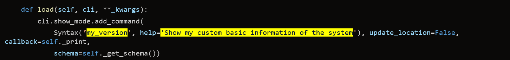
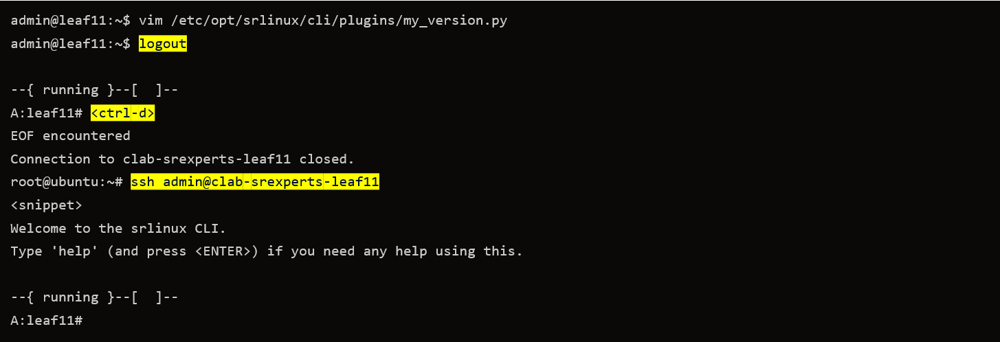
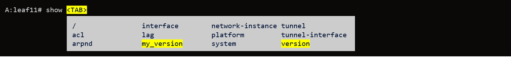
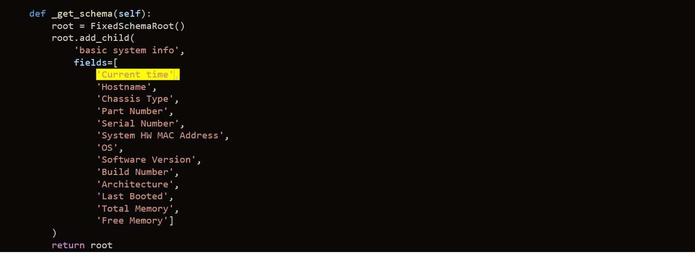
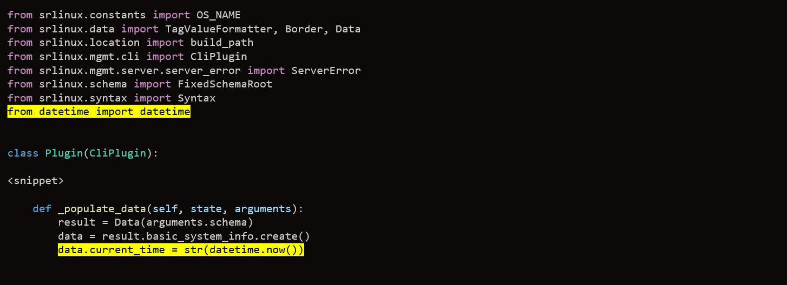
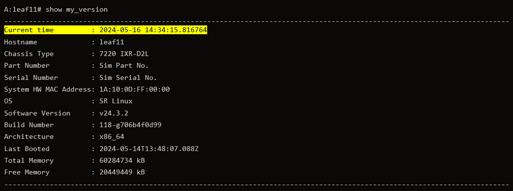
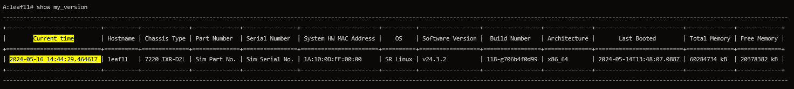
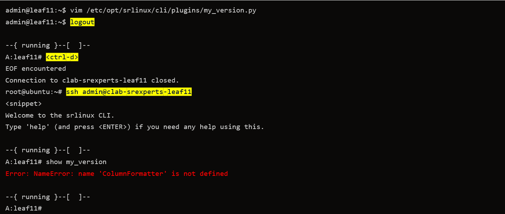
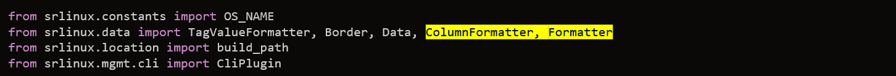
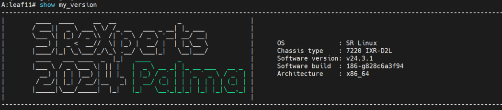

# Creating your own custom SR Linux CLI plugin

| Item              | Details                                           |
| ----------------- | ------------------------------------------------- |
| Short Description | Getting started with SR Linux CLI programmability |
| Skill Level       | Intermediate                                      |
| Tools Used        | SR Linux, Python                                  |

SR Linux CLI is powered by an open source Python-based framework that allows users to customize the CLI experience like no other network operating system.  
Do you want to change the way existing command works, create one of your own and make the CLI the way you want it to be? This is the right place to start.

## Objective

In this exercise, you will explore the native show commands and dive into all the building blocks that are needed to create your own CLI plugin in SR Linux. As a final task you will create your own CLI command by augmenting the current available `show version` command with additional information and use different formatters to visualize the data in various ways.

## Accessing a lab node

In this lab you will create your own CLI show command on `clab-srexperts-leaf11` node. You can log in by using the container name.

```bash
ssh admin@clab-srexperts-leaf11
```

## Navigate the SR Linux CLI engine filesystem

Custom CLI commands can be added to SR Linux using a Python plugin framework. It is important to understand that the native show commands (the ones you get with SR Linux by default) use this very framework themselves.

The native CLI commands are a convenient way to learn how to create your own CLI commands since their source code is available on the system and can be browsed by any user with admin rights.

### Go to the plugin's directory

Once you are logged in to `clab-srexperts-leaf11` go to the Linux shell of SR Linux by typing the `bash` command. You will now be served with a Linux prompt you are all familiar with. From there you will be able to navigate to the directory where all the CLI commands are stored.

```bash
--{ running }--[  ]--
A:leaf11# bash
admin@leaf11:~$
```

Navigate to the CLI plugins directory.

```bash
cd /opt/srlinux/python/virtual-env/lib/python3.11/dist-packages/srlinux/mgmt/cli/plugins/reports/
```

Here you can find all the show commands available in SR Linux which we call reports. These do nothing else then retrieving state information and visualizing it in a more human readable way. Have a look in the list, you should be able to recognize some familiar show commands.

```bash
admin@leaf11:/opt/srlinux/python/virtual-env/lib/python3.11/dist-packages/srlinux/mgmt/cli/plugins/reports$ ls
<snippet>
bgp_l3vpn_ipv6_exact_route_detail_report.py            __init__.py                                      static_mpls_entries_report.py
bgp_l3vpn_ipv6_exact_route_report.py                   interface_brief_report.py                        static_mpls_reports.py
bgp_l3vpn_ipv6_routes_summary_report.py                interface_detail_report.py                       system_aaa_authentication_reports.py
bgp_neigh_advertised_routes_report.py                  interface_queues.py                              system_application_report.py
bgp_neighbor_detail_report.py                          interface_reports.py                             system_lldp_reports.py
bgp_neighbor_summary_report.py                         interface_summary_report.py                      system_logging.py
bgp_neigh_received_routes_report.py                    isis_adjacency_report.py                         system_network_instance_reports.py
bgp_reports_detail.py                                  isis_database_report.py                          system_reports.py
bgp_summary_report.py                                  isis_hostname_report.py                          tunnel_interface_detail_reports.py
bgp_vpn_instance_report.py                             isis_interface_report.py                         tunnel_interface_reports.py
bridge_table_mac_duplication_report.py                 isis_reports_detail.py                           tunnel_vxlan_reports.py
bridge_table_mac_table_report.py                       isis_summary_report.py                           version.py
```

## Navigate the code

Time to dive into some CLI code examples! Open the file `version.py` to see one of the simplest CLI show commands of the system.

This Python file is associated with the `show version` command. Later we will augment this file to create our own custom `show my_version` CLI plugin.

> For convenience, open a second terminal session so that you can execute the `show version` command while looking at the Python code.

Every CLI show command has the following structure:

```python
class Plugin(CliPlugin):

    def load(self, cli, **_kwargs):
        cli.show_mode.add_command(
            Syntax('version', help='Show basic information of the system'), update_location=False, callback=self._print,
            schema=self._get_schema())

    def _print(self, state, output, arguments, **_kwargs):
        self._fetch_state(state)
        result = self._populate_data(state, arguments)
        self._set_formatters(result)
        output.print_data(result)

    def _get_schema(self):
        # <snippet>

    def _fetch_state(self, state):
        hostname_path = build_path('/system/name/host-name:')
        # <snippet>

    def _populate_data(self, state, arguments):
        # <snippet>

    def _set_formatters(self, data):
        # <snippet>
```

Each plugin must be defined as a class of type `CLIPlugin`. A class has attributes and methods. This particular command has six methodes which you will find in other show commands as well: `load()`, `_print()`, `_get_schema()`, `_fetch_state()`, `_populate_data()` and `_set_formatters()`.  
Let's look a bit closer at each of these methods.

- `load()`: load is mandatory for every CLI plugin command and will be executed by the CLI engine when a CLI session starts.  
  It's purpose is to define the CLI command syntax and to define help desciptions, but most importantly to define the callback function when this `show version` command is executed.
- `_print()`: It's the callback function which is executed when the `show version` command is entered by the CLI user. It will fetch all information from the state datastore and print the data on screen according to a certain schema and format.
- `_get_schema()`: This method builds a schema object that describes how the data that this command operates on is stored.
- `_fetch_state()`: Fetches the relevant information that the user wants to visualize from the state data store.
- `_populate_data()`: This method populates the retrieved data into the schema object.
- `_set_formatter()`: Specifies how the retrieved data should be formatted on screen. Users can choose for a predefined formatter or create a formatter of their own.

Don't panic if you don't understand everything at once. We will go through each of these methods in more detail in the next steps.

## Where is the data coming from?

1. Go to the SR Linux terminal and run the `show version` command. This is the result from executing the `_print()` method. You should recognize the fields from the schema object. Try to correlate what you see on the screen with what is defined in code.
2. Look at the code for the `_fetch_state()` method

   ```python
       def _fetch_state(self, state):
        hostname_path = build_path('/system/name/host-name:')
        chassis_path = build_path('/platform/chassis')
        software_version_path = build_path('/system/app-management/application[name="idb_server"]')
        control_path = build_path('/platform/control[slot="*"]')
   ```

The first 4 lines define 4 different gNMI paths that point to different leafs and containers in [SR Linux YANG](https://learn.srlinux.dev/yang/). You can see here we are retrieving state information regarding hostname, chassis type, software version, etc... You can get the same information using the CLI `info from state` command.

Try to fetch this information from the SR Linux CLI. By doing so you understand from where this data is coming from and that a CLI show command is nothing more than a more human readable representation of what is defined in the state datastore.

You can guess that the `_populate_data()` method parses the info returned from the state datastore to extract the relevant information and the assign a value to each of the fields of the schema.

```
--{ running }--[  ]--
A:leaf11# info from state system name host-name
    system {
        name {
            host-name leaf11
        }
    }
```

## Task: write your own CLI command

1. Now you will have your first CLI customization experience by taking the existing `show version` command and modifying it to your purpose.
    A relative easy way to start is to copy the `version.py` Python file to the directory SR Linux is scanning for new CLI plugins.

    Go to the plugins directory if you are not there yet `/opt/srlinux/python/virtual-env/lib/python3.11/dist-packages/srlinux/mgmt/cli/plugins/reports/`. This is where the Python source code for the native CLI commands are located. Copy the `version.py` to `/etc/opt/srlinux/cli/plugins` and name the new file `my_version.py`

    ```bash
    cp version.py /etc/opt/srlinux/cli/plugins/my_version.py
    ```

2. Modify the code of `my_version.py` by changing the name of the command to `show my_version` and modify the help string in the `load()` method.
  
   

3. To load the new CLI command you will need to restart your CLI session. Exit the bash session and exit the CLI session and log in again.
  
   

4. Once logged in again type `show` with the `<TAB>` key. You should now see that your `my_version` CLI command being recognized by the CLI engine and auto-suggested alongside other native commands.

   

5. Display the usage and help string for the new `my_version` command. The new help string *Show my custom basic information of the system* is displayed. This proves that the new CLI command is being executed.

   

6. We will now add extra data to this CLI command to be displayed. Edit the `my_version.py` file and add an extra field in the `_get_schema()` method. Add the *Current time* field so we can keep track of date and time.

   

7. In the `_populate_date()` method, set the value of the new field to the current time. You will need to import an extra Python module `datetime` to get the time.

    

8. After completing the change, save the file, restart your CLI session and run the show command again. Notice that the time is now visible in the show command.

   

### Apply different formatters

9. Now we will change how the data is being visualized by defining other formatters. Currently `_set_formatter()` is using `TagValueFormatter()`. This displays each field as a tag/value pair, line by line. Replace this with `ColumFormatter()` which will visualize the data in table format. Exit the bash shell, exit the CLI and restart the session to see the output in a new style!

    

    

10. A Python error is displayed when you run the command. This is normal since the ColumnFormatter is unknown to the CLI Plugin and it should be imported first. Now you know that Python runtime errors are displayed when you try to run a new command.

    

11. Fix the issue by importing ColumnFormatter. Refresh your CLI session and try to run the command again. You should now see the data in table format.

    

12. With SR Linux you can also implement your own custom Formatter to give the user full flexibility how the data should be visualized. Copy/paste the MyFormatter class to `my_version.py`, you can find it here below in the dropdown menu.

<details>
<summary>MyFormatter class</summary>

```python
class MyFormatter(Formatter):

    banner_list = [
"|\t ____  ____     __  __                _                  |",
"|\t/ ___||  _ \ ___\ \/ /_ __   ___ _ __| |_ ___            |",
"|\t\___ \| |_) / _ \\\  /| '_ \ / _ \ '__| __/ __|           |",
"|\t ___) |  _ <  __//  \| |_) |  __/ |  | |_\__ \           |",
"|\t|____/|_| \_\___/_/\_\ .__/ \___|_|   \__|___/           |",
"|\t ____   ___ ____  _  |_|  \033[5;92m ____       _                 \033[00m |",
"|\t|___ \ / _ \___ \| || |   \033[5;92m|  _ \ __ _| |_ __ ___   __ _ \033[00m |",
"|\t  __) | | | |__) | || |_  \033[5;92m| |_) / _` | | '_ ` _ \ / _` |\033[00m |",
"|\t / __/| |_| / __/|__   _| \033[5;92m|  __/ (_| | | | | | | | (_| |\033[00m |",
"|\t|_____|\___/_____|  |_|   \033[5;92m|_|   \__,_|_|_| |_| |_|\__,_|\033[00m |",
"|\t                                                         |"]


    def __init__(self):
        self.banner = [list(line.strip()) for line in self.banner_list]

    def iter_format(self, entry, max_width):

        data = [f"\tOS              : {entry.os}",
                f"\tChassis type    : {entry.chassis_type}",
                f"\tSoftware version: {entry.software_version}",
                f"\tSoftware build  : {entry.build_number}",
                f"\tArchitecture    : {entry.architecture}"]

        position = [3,4,5,6,7]

        for i, row in enumerate(self.banner):
            if i in position:
                line = "".join(row) + data[position.index(i)]
            else:
                line = "".join(row)
            yield line

```

</details>

13. In the `_set_formatter()` method, reference to the new `MyFormatter`. Refresh the CLI session and run `show my_version` again.

    

14. You have reached the end of this tutorial. If you would like to add other state information to your cli command please feel free to do so.

    
