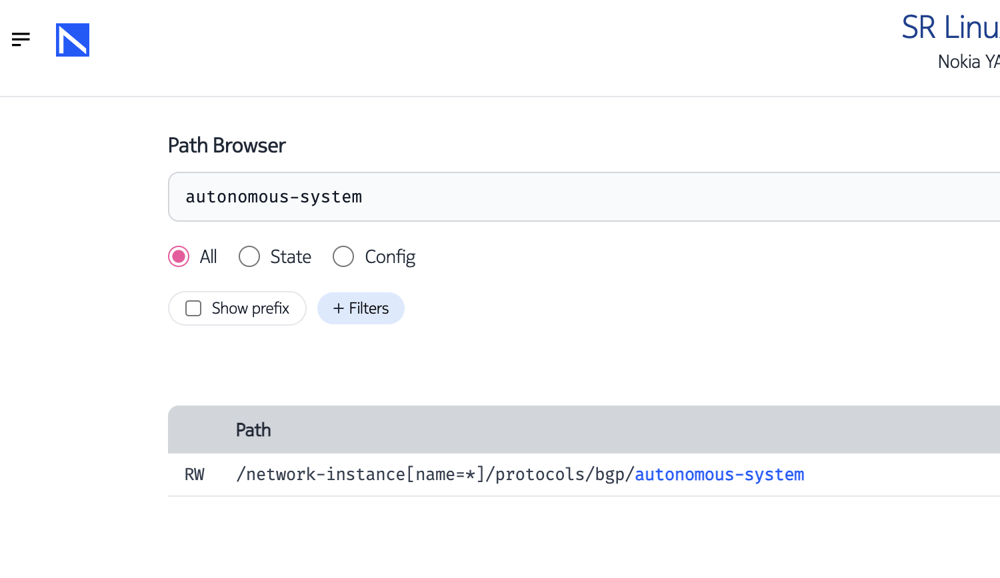

# Creating a Custom CLI Plugin for SR Linux

| Item              | Details                                                                  |
| ----------------- | ------------------------------------------------------------------------ |
| Short Description | Using SR Linux CLI programmability to create custom commands on SR Linux |
| Skill Level       | Intermediate/Advanced                                                    |
| Tools Used        | SR Linux, Python                                                         |

Before attempting this exercise, it is recommended that you have already completed the [beginner level exercise](../srl-cli-plugin-show-version). In that tutorial you will learn the basic structure of a CLI plugin on SR Linux.

This lab demonstrates how to construct a custom CLI plugin for SR Linux. During this lab, the user will learn how to create a new _show command_ plugin which will collect, parse and display useful information about each BGP peer on the router.

**Difficulty:** Intermediate/Advanced

In this exercise, you will create a completely new CLI show command by following these steps:

- Defining the command schema
- Defining the CLI syntax
- Retrieving the state datastore information
- Populating the schema
- Displaying and Verifying the output

Each section will provide the user a learning activity to complete along with relavent documentation and instruction, the solutions will often be revealed inline using a drop-down, the full plugin as well as the skeleton will be found in the [solutions](solutions/) directory.

> Try to complete the activity on your own before checking the solution.

## Custom CLI Command Requirements

The goal of this CLI command is to be able to show interesting details about bgp neighbor(s) in way that is not available by default with any of the SR Linux's default show commands.

- The CLI command will allow the user to select the neighbor(s) by neighbor address, peer as, network-instance, or bgp group name
- The CLI command will scan the available options from the state datastore for the option chosen by the user
- It will display the network-instance, the bgp group, the peer as, and the interface used to reach the peer for each neighbor

## Skeleton Python Example

Start with the [skeleton.py](solutions/skeleton.py) Python file below. It provides a skeleton implementation of the CLI plugin class that you will complete as you develop your CLI command.

In the skeleton file, most of the methods are implemented with the `pass` statement. This makes them syntactically correct in Python and lets the CLI engine load the plugin even though it does not do anything useful. You will replace the pass statement with the plugin code for the different methods as you follow this exercise.

Notice the `print` statement in the body of the load() method. It will help you verify that the plugin loaded properly when the CLI session started.

Here is the inline copy of the [skeleton.py](solutions/skeleton.py):

```python
from srlinux.mgmt.cli import CliPlugin, KeyCompleter
from srlinux.syntax import Syntax
from srlinux.schema import FixedSchemaRoot
from srlinux.location import build_path
from srlinux import strings
from srlinux.data import Border, ColumnFormatter, TagValueFormatter, Borders, Data, Indent
from srlinux.syntax.value_checkers import IntegerValueInRangeChecker
import json


class Plugin(CliPlugin):

    '''
        Load() method: load new CLI command at CLI startup
        Input: cli, the root node of the CLI command hierarchy
    '''
    def load(self, cli, **_kwargs):
        print("\n##########\n\n---> DEBUG: LOADING BGP-BY CLI PLUGIN\n\n##########\n")

    '''
        _my_schema() method: construct the schema for this cli command
        Return: schema object
    '''
    def _my_schema(self):
        root = FixedSchemaRoot()
        ## add your code here
        return root

    '''
        _fetch_state() method: extract relevant data from the state datastore
        Input: state, reference to the datastores
        Input: arguments, the CLI command's context
        Return: copy of a section of the state datastore
    '''
    def _fetch_state(self, state, arguments):
        pass ## replace with your code

    '''
        _populate_schema() method: fill in schema from state datastore
        Input: state_datastore, state datastore extract
        Input: arguments, the CLI command's context
        Return: filled in schema
    '''
    def _populate_schema(self, state_datastore, arguments):
        pass ## replace with your code

    '''
        _set_formatters() method:
        Input: schema, schema to augment with formatters
    '''
    def _set_formatters(self, schema):
        pass ## repace with your code

    '''
        _print() method: the callback function
        Input: state, reference to the datastores
        Input: arguments, the CLI command's context
        Input: output, the CLI output object
    '''
    def _print(self, state, arguments, output, **_kwargs):
        #state_datastore = self._fetch_state(state, arguments)
        #schema = self._populate_schema(state_datastore, arguments)
        #self._set_formatters(schema)
        #output.print_data(schema)
        pass ## remove pass once the methods above are implemented
```

It is helpful to have multiple terminal windows open while developing CLI plugins because each time you make a change, you must upload the file to the correct location on the SR Linux filesystem and then log out and log back in to have the changes load.

📝 _You could edit the file directly on the router as well. Both nano and vim are installed by default, but in this exercise we will be editing the files on the cloud instance and uploading them to the SR Linux node `clab-srexperts-peering2`_

Log into the router in your first terminal window.

💻 `ssh admin@clab-srexperts-peering2`

Now, in another window, upload the [skeleton.py](solutions/skeleton.py) file. Note that we will always name the uploaded file `bgp-by.py` to keep things clean at each step.

💻 `scp skeleton.py clab-srexperts-peering2:/etc/opt/srlinux/cli/plugins/bgp-by.py`

Logout of the session in your original window by using `ctrl-D` and then log back into the router.

Note the message showing that the [skeleton.py](solutions/skeleton.py) was loaded successfully.

```
$ ssh clab-srexperts-peering2
Warning: Permanently added 'clab-srexperts-peering2' (ED25519) to the list of known hosts.
................................................................
:                  Welcome to Nokia SR Linux!                  :
:              Open Network OS for the NetOps era.             :
:                                                              :
:    This is a freely distributed official container image.    :
:                      Use it - Share it                       :
:                                                              :
: Get started: https://learn.srlinux.dev                       :
: Container:   https://go.srlinux.dev/container-image          :
: Docs:        https://doc.srlinux.dev/24-3                    :
: Rel. notes:  https://doc.srlinux.dev/rn24-3-2                :
: YANG:        https://yang.srlinux.dev/release/v24.3.2        :
: Discord:     https://go.srlinux.dev/discord                  :
: Contact:     https://go.srlinux.dev/contact-sales            :
................................................................

Last login: Tue May 21 13:13:05 2024 from 10.128.1.1

##########

---> DEBUG: LOADING BGP-BY CLI PLUGIN

##########

Using configuration file(s): ['/home/admin/.srlinuxrc']
Welcome to the srlinux CLI.
Type 'help' (and press <ENTER>) if you need any help using this.

--{ running }--[  ]--
A:peering2#
```

When you log in, the CLI engine scans the `/etc/opt/srlinux/cli/plugins` directory for any Python file containing a `CliPlugin` class and executes the `load()` method for each of them. This new message is printed by the `bgp-by.py` plugin's `load()` method. If the message doesn't appear, check the directory and make sure that the file `bgp-by.py` has been copied there.

To further verify your setup, you can edit bgp-by.py and verify that the change appears once you exit and restart the CLI session. For example, add the following intentionally wrong code in the load() method:

```python
def load(self, cli, **_kwargs):
    print("\n##########\n\n---> DEBUG: LOADING BGP-BY CLI PLUGIN\n\n##########\n")
    intentional python syntax error
```

Save the file, exit the CLI session and restart it:

```
$ ssh clab-srexperts-peering2
Warning: Permanently added 'clab-srexperts-peering2' (ED25519) to the list of known hosts.
................................................................
:                  Welcome to Nokia SR Linux!                  :
:              Open Network OS for the NetOps era.             :
:                                                              :
:    This is a freely distributed official container image.    :
:                      Use it - Share it                       :
:                                                              :
: Get started: https://learn.srlinux.dev                       :
: Container:   https://go.srlinux.dev/container-image          :
: Docs:        https://doc.srlinux.dev/24-3                    :
: Rel. notes:  https://doc.srlinux.dev/rn24-3-2                :
: YANG:        https://yang.srlinux.dev/release/v24.3.2        :
: Discord:     https://go.srlinux.dev/discord                  :
: Contact:     https://go.srlinux.dev/contact-sales            :
................................................................

Last login: Tue May 21 13:14:37 2024 from 10.128.1.1
14:54:49.825 [ERROR] (ConnectionChecker-4) Error: Importing plugin 'bgp-by = /etc/opt/srlinux/cli/plugins/bgp-by.py:Plugin': SyntaxError: invalid syntax (<string>, line 19)
Using configuration file(s): ['/home/admin/.srlinuxrc']
Welcome to the srlinux CLI.
Type 'help' (and press <ENTER>) if you need any help using this.

--{ running }--[  ]--
A:peering2#
```

Python errors are displayed as the code is executed.

Go back and correct the error by removing the faulty line of code. You're now ready to start coding the custom CLI command.

> Important: Each time you change the Python code, make sure to save and upload your changes. To see the changes in the SR Linux CLI session, you must exit and restart the CLI session.

## Defining the Schema

The schema contains all the fields and values to be displayed by your CLI command. It must first be defined, like a template or container, and then later instantiated and filled in with the values to be displayed. The definition of the schema is done with the `_my_schema()` method.

The schema is a hierarchical object that starts with the 'root' and to which you add child nodes and fields. Like a YANG list, a child node can have a 'key' which means that there are multiple instances of that child with each one having multiple property fields.

The data we want to display about the matching neighbor(s):

- neighbor address
- network-instance
- interface peer is reachable from
- group name
- local asn
- peer asn

We will create the schema that represents the following yang data model:

```yang
    list network-instance {
        key "name";
        leaf "name";
        leaf "local-as";
        list neighbor {
            key "peer-address";
            leaf "peer-type"
            leaf "peer-as";
            leaf "peer-group";
            leaf "interface";
        }
    }
```

Start by creating the root object and add the network-instance child. Note that the network-instance child is a child of root:

```python
def _my_schema(self):
    root = FixedSchemaRoot()
    netinst = root.add_child(
        'netinst'
        key='name',
        fields = [ 'name', 'local-as' ]
    )
```

> Try to think about how it would look to add the remaining portions of the schema code before revealing the full solution below

<details>

<summary>Full Solution for _my_schema()</summary>

```python
def _my_schema(self):
    root = FixedSchemaRoot()
    netinst = root.add_child(
        'netinst',
        key = 'name',
        fields = [ 'name', 'local-as' ]
        )
    neigh = netinst.add_child(
        'neighbor',
        key = 'peer-address',
        fields = [ 'peer-type', 'peer-as', 'peer-group', 'interface' ]
    )

    return root
```

💡 Think back to our yang data model and notice that in the solution for the neigh object, the **.add_child()** method is called on the 'netinst' object, not the 'root'. Also notice the 'neigh' object has a 'key' - this is because there are multiple neighbors whose key is the value of their 'peer-address'.

</details>

## CLI Command Syntax

The CLI show command displays the neighbor(s) with the interface to use to reach them as well as the bgp group, local as and peer as information. Later, you will instantiate neighbor, network-instance, and bgp group nodes with values fetched from the router. You will fill the fields with the appropriate detail.

Based on the CLI command requirement, the command syntax could look like this:

`bgp-by [network-instance <value>] [peer-as <value>] [peer-address <value>] [bgp-group <value>]`

which means that `bgp-by` command takes in named arguments such as `network-instance`, `peer-as`, and so on.

To implement this command syntax in Python we should create the `Syntax` object in the `load()` method of our plugin class.

Replace the print and pass statements from the [skeleton.py](solutions/skeleton.py) file as shown below:

```python
def load(self, cli, **_kwargs):
    # Think about how the command should look on the cli:
    #
    #  show bgp-by [ peer-address | peer-as | network-instance | bgp-group ]
    syntax = Syntax('bgp-by', help="Displays brief but useful data related to BGP peers. \
                                    \n\nThe output can be filtered by selecting options at the command line.")
    syntax.add_named_argument(
        'network-instance',
        default='default',
        help='network instance name')
    syntax.add_named_argument(
        'peer-as',
        default='*',
        help='peer as number')
    syntax.add_named_argument(
        'peer-address',
        default='*',
        help='ip address of peer')
    syntax.add_named_argument(
        'bgp-group',
        default='*',
        help='bgp group name')

    print("Loading CLI:", syntax) ## Temporary display

    cli.show_mode.add_command(
        syntax,
        update_location=False,
        callback = self._print,
        schema = self._my_schema()
    )
```

This creates the syntax object with 'bgp-by' at the root and four arguments. All the arguments have a default value which makes them optional. The new CLI command is then appended to the 'show' commands with the cli.show_mode**.add_command()** method.

📝 Note that this `add_command` method also specifies the callback method and the schema definition method and defines update_location. The `update_location` option tells the CLI Plugin whether to update the location on the CLI as the user enters different portions of the datastore hierarchy. Setting this to False means that we do not want to change the user's location.

Save your file and scp it to the router again.

💻 `scp skeleton.py clab-srexperts-peering2:/etc/opt/srlinux/cli/plugins/bgp-by.py`

Logout of the session in your original window by using `ctrl-D` and then log back into the router.

💻 `ssh clab-srexperts-peering2`

```
$ ssh clab-srexperts-peering2
Warning: Permanently added 'clab-srexperts-peering2' (ED25519) to the list of known hosts.
................................................................
:                  Welcome to Nokia SR Linux!                  :
:              Open Network OS for the NetOps era.             :
:                                                              :
:    This is a freely distributed official container image.    :
:                      Use it - Share it                       :
:                                                              :
: Get started: https://learn.srlinux.dev                       :
: Container:   https://go.srlinux.dev/container-image          :
: Docs:        https://doc.srlinux.dev/24-3                    :
: Rel. notes:  https://doc.srlinux.dev/rn24-3-2                :
: YANG:        https://yang.srlinux.dev/release/v24.3.2        :
: Discord:     https://go.srlinux.dev/discord                  :
: Contact:     https://go.srlinux.dev/contact-sales            :
................................................................

Last login: Wed May 22 18:51:00 2024 from 10.128.1.1
Loading CLI: bgp-by [network-instance <value>] [peer-as <value>] [peer-address <value>] [bgp-group <value>]
Using configuration file(s): ['/home/admin/.srlinuxrc']
Welcome to the srlinux CLI.
Type 'help' (and press <ENTER>) if you need any help using this.

--{ running }--[  ]--
A:peering2#
```

The `load()` method is executed and this time, we have the output showing our **syntax** object printed to the screen. This is a good indication that the command has been successfully added to the CLI heirarchy.

Now, type `show <tab>` and you will see our **bgp-by** command in the list of options,

```
--{ running }--[  ]--
A:peering2# show <tab>
                  /                bgp-by           network-instance tunnel
                  acl              interface        platform         tunnel-interface
                  arpnd            lag              system           version
```

Next, type `show bgp-by ?` to get the help for our command.

```
--{ running }--[  ]--
A:peering2# show bgp-by ?
usage: bgp-by [network-instance <value>] [peer-as <value>] [peer-address <value>] [bgp-group <value>]

Displays brief but useful data related to BGP peers.

The output can be filtered by selecting options at the command line.

Named arguments:
  bgp-group         bgp group name
  network-instance  network instance name
  peer-address      ip address of peer
  peer-as           peer as number

*** Not all commands are listed, press '?' again to see all options ***

--{ running }--[  ]--
A:peering2# show bgp-by
```

As expected, the usage string shows the command with the arguments as they have been provided in the plugin code via the Syntax object. All arguments appear as optional and there is a help string for each.

Try to enter the following command:
`show bgp-by network-instance default peer-address 10.64.51.1 bgp-group eBGP-transit-v4`

The parameter names (network-instance, peer-address, peer-as, bgp-group) can be auto-completed with the `<tab>` key, but the values (default, 10.64.51.1, eBGP-transit-v4) can't be autocompleted yet. SR Linux offers the 'suggestions' options for this purpose.

Return to the [skeleton.py](solutions/skeleton.py) file you have been editing and add the `suggestions` lines to your `load()` method.

```python
def load(self, cli, **_kwargs):
    # Think about how the command should look on the cli:
    #
    #  show bgp-by [ peer-address | peer-as | network-instance | bgp-group ]
    syntax = Syntax('bgp-by', help="Displays brief but useful data related to BGP peers. \
                                    \n\nThe output can be filtered by selecting options at the command line.")
    syntax.add_named_argument(
        'network-instance',
        default='default',
        suggestions=KeyCompleter(path='/network-instance[name=*]'),
        help='network instance name')
    syntax.add_named_argument(
        'peer-as',
        default='*',
        help='peer as number')
    syntax.add_named_argument(
        'peer-address',
        default='*',
        suggestions=KeyCompleter(path='/network-instance[name=*]/protocols/bgp/neighbor[peer-address=*]'),
        help='ip address of peer')
    syntax.add_named_argument(
        'bgp-group',
        default='*',
        suggestions=KeyCompleter(path='/network-instance[name=*]/protocols/bgp/group[group-name=*]'),
        help='bgp group name')

    print("Loading CLI:", syntax) ## Temporary display

    cli.show_mode.add_command(
        syntax,
        update_location=False,
        callback = self._print,
        schema = self._my_schema()
    )
```

The 'suggestions' option uses the `KeyCompleter()` method to return a list of possible completions from the state datastore by the provided `path`. In the code snippet above we use `KeyCompleter(path='/network-instance[name=*]')` to retrieve available network instance names to autosuggest the `network-instance` named argument.  
In the same spirit, we provide the key completion functionality for all other arguments of our show command.

📝 The options to display can be filtered. For example, the peer-address suggestion string uses the path `/network-instance[name=*]/protocols/bgp/neighbor[peer-address=*]`. If you only wanted to show the user options with peers whose address started with '10.64' you could change the suggestions path to `/network-instance[name=*]/protocols/bgp/neighbor[peer-address=10.64*]`

Save your file and scp it to the router again.

💻 `scp skeleton.py clab-srexperts-peering2:/etc/opt/srlinux/cli/plugins/bgp-by.py`

Logout of the session in your original window by using `ctrl-D` and then log back into the router.

💻 `ssh clab-srexperts-peering2`

Now, you are able to use `<tab>` to autocomplete the available options each of the commands we supplied suggestions for (bgp-group, peer-address, and network-instance):

```
--{ running }--[  ]--
A:peering2# show bgp-by peer-address <value:*>
                                      10.64.51.1        fd00:fc00:0:51::1
                                      10.64.54.2        fd00:fde8:0:54::2
```

We can not autocomplete 'peer-as' because it is just a leaf under neighbor and not a key. Only the keys from a list are able to be suggested. However, we can still sanity check that the user enters an appropriate option for peer-as.

A `value_checker` method is similar to a `KeyCompleter()` method, except that it checks the value of the argument and rejects unwanted values. There are two built-in value checkers that check integer and decimal ranges, but a custom value checker can also be created.

We could use a built-in value checker for the peer-as, but we can only check 16-bit ASNs since it only accepts a single range:

```python
syntax.add_named_argument(
    'peer-as',
    default='*',
    value_checker=IntegerValueInRangeChecker(1, 65536)
    help='peer as number')
```

The built-in value checker can't check for both the 16-bit and 32-bit asn, so we can implement our own custom value checker:

```python
class CheckASN(object):
    def __call__(self, value) -> bool:
        try:
            if (1 <= int(value) <= 65536):
                pass
            elif (131072 <= int(value) <= 4294967294):
                pass
            else:
                raise ValueError()
        except ValueError:
            raise ValueError(f"\nThis is not a valid 16-bit or 32-bit ASN: '{value}'")
        return True
```

A custom value checker must be a callable object method. A new class CheckASN(object) is defined. Its `__call__()` method is used as the callable value_checker. It returns True if the input value is a valid 16-bit or 32-bit asn; otherwise, it displays an error message.

Call the value checker for the peer-as parameter.

```python
syntax.add_named_argument(
    'peer-as',
    default='*',
    value_checker=CheckASN(),
    help='peer as number')
```

Add these configurations (you can put the class at the bottom for this) then save your file and scp it to the router again.

💻 `scp skeleton.py clab-srexperts-peering2:/etc/opt/srlinux/cli/plugins/bgp-by.py`

Logout of the session in your original window by using `ctrl-D` and then log back into the router.

💻 `ssh clab-srexperts-peering2`

Now, we are able to check if a peer-as is a valid asn.

```
--{ running }--[  ]--
A:peering2# show bgp-by peer-as 131000
Parsing error: While parsing 'bgp-by': Wrong value for 'peer-as': Invalid value '131000':
This is not a valid 16-bit or 32-bit ASN: '131000'

--{ running }--[  ]--
A:peering2# show bgp-by peer-as 131073

--{ running }--[  ]--
A:peering2#
```

## Retrieving State Datastore Information

At this point, the following tasks have been completed:

- A schema has been built with nodes and fields that will be used to store information retrieved from the datastore
- Command syntax and help strings are defined
- Input argument suggestion and input value validators are implemented
- The command has been added to the overall CLI tree

The next step is to retrieve the state datastore information that our command needs to do its work. The `_fetch_state()` method of the plugin class is used to retrieve the relevant section of the state datastore. Its input parameters are 'state' and 'arguments':

```python
    def _fetch_state(self, state, arguments):
        pass ## replace with your code
```

- 'state' is used to access the state datastore
- 'arguments' is used to retrieve the entered command line arguments that were defined in the syntax section

To fetch the state information from SR Linux we need to query the state datastore:

```python
state.server_data_store.get_data(path, recursive=True)
```

> The `state` object is passed to the `_fetch_state()` as its argument.

As you can see, the `get_data` method requires a path to an element of the state datastore to fetch the data from. You can identify the path to a certain container/list/leaf of SR Linux by browsing the state datastore from the CLI. Say you wanted to find the path to use to fetch `local-as` for a peer:

You could enter into the state datastore:

```
--{ running }--[  ]--
A:peering2# enter state

--{ state }--[  ]--
A:peering2#
```

And then navigate to the needed context and execute `pwc xpath`:

```
--{ state }--[  ]--
A:peering2# network-instance default protocols bgp neighbor 10.64.51.1 local-as

--{ state }--[ network-instance default protocols bgp neighbor 10.64.51.1 local-as ]--
A:peering2# pwc xpath
/network-instance[name=default]/protocols/bgp/neighbor[peer-address=10.64.51.1]/local-as
```

But there is also an off-box solution! Nokia has an [online YANG browser for SR Linux](https://yang.srlinux.dev/) that is very fast and full-featured, allowing you to view the data model in many different forms.

Visit the site, choose version 24.3.2 and you will be taken to the default view, which is the path browser.

Try typing in 'autonomous-system' or 'local-as' and see if you can find a path.

 

Now try to find the paths to the other data we are trying to find:

- peer-address
- peer-type
- peer-as
- next-hop ip-address
- peer-group

<details>
<summary>Solution for Data Paths</summary>
peer-address, peer-type, peer-as, peer-group can all be found from this path:

`/network-instance[name=*]/protocols/bgp/neighbor[peer-address=*]/`

For the local-as, we can access it from both the previous path as well as from

`/network-instance[name=*]/protocols/bgp/autonomous-system`

For the next-hops, the path is:

`/network-instance[name=*]/route-table/next-hop[index=*]`

</details>

The **.get_data()** method retrieves a branch of the state datastore. The 'path' parameter indicates which branch. If 'recursive' is set to True, all the sub-branches are retrieved as well.

The 'path' objects define a sequence of hierarchical nodes within the YANG model and are built from the xpath syntax of an element in the YANG model.

Consider this peer_path example: `/network-instance[name={name}]/protocols/bgp/neighbor[peer-address={peer-address}]`

In this case, you want to retrieve everything under the `/network-instance[name={name}]/protocols/bgp/neighbor[peer-address={peer-address}]` either for the specific peer or for all peers. This is implemented in the `build_path()` statement, which first retrieves the network-instance and peer-address arguments from the CLI command (the default values we assigned are 'default' for the network-instance and '\*' for the peer-address) and then uses those to build the path object. The path object is used to retrieve the corresponding state datastore and save it as the `self._peer_path_data` object.

Taking these into consideration, let's look at an example from one of the built-in cli plugins. This is from **version.py** which may be familiar if you did the beginner module where you modified that one.

```python
    def _fetch_state(self, state):
        hostname_path = build_path('/system/name/host-name:')
        chassis_path = build_path('/platform/chassis')
        software_version_path = build_path('/system/app-management/application[name="idb_server"]')
        control_path = build_path('/platform/control[slot="*"]')

        try:
            self._hostname_data = state.server_data_store.get_data(hostname_path, recursive=True)
        except ServerError:
            self._hostname_data = None

        try:
            self._chassis_data = state.server_data_store.get_data(chassis_path, recursive=True)
        except ServerError:
            self._chassis_data = None

        try:
            self._software_version = state.server_data_store.get_data(software_version_path, recursive=True)
        except ServerError:
            self._software_version = None

        try:
            self._control_data = state.server_data_store.get_data(control_path, recursive=True)
        except ServerError:
            self._control_data = None
```

Let's try to use that example and the paths we found to create our own `_fetch_state()` method.

> Give it a try before looking at the solution below

<details>

<summary>Solution for _fetch_state()</summary>

```python
def _fetch_state(self, state, arguments):

    ## build a YANG path object from the path string for each
    ## of the sections of the state tree we are trying to find

    ## the local-as is a single leaf we can retrieve
    local_as_path = build_path('/network-instance[name={name}]/protocols/bgp/autonomous-system', name=arguments.get('network-instance'))

    ## this path contains the peer-address, the peer-as and the bgp-group
    peer_path = build_path('/network-instance[name={name}]/protocols/bgp/neighbor[peer-address={peer_address}]', name=arguments.get('network-instance'), peer_address=arguments.get('peer-address'))

    ## this path contains all of the next-hops so that we can find
    ## the exit interface for each of the peers we are displaying
    nh_path = build_path('/network-instance[name={name}]/route-table/next-hop[index=*]', name=arguments.get('network-instance'))

    ## Attempt to retrieve the state data from the datastore
    ## for each of the YANG path objects we created above. If
    ## there is an issue with retrieving the data, set the value
    ## to None
    try:
        self._local_as_path_data = state.server_data_store.get_data(local_as_path, recursive=False)
    except ServerError:
        self._local_as_path_data = None

    try:
        self._peer_path_data = state.server_data_store.get_data(peer_path, recursive=True)
    except ServerError:
        self._peer_path_data = None

    try:
        self._nh_path_data = state.server_data_store.get_data(nh_path, recursive=True)
    except ServerError:
        self._nh_path_data = None

    ## we are not returning anything, as we just set the paths as
    ## object attributes
```

</details>

Next, call the `_fetch_state()` method in the callback method by removing the comment:

```python
def _print(self, state, arguments, output, **_kwargs):
    self._fetch_state(state, arguments)
    #schema = self._populate_schema(state, arguments)
    #self._set_formatters(schema)
    #output.print_data(schema)
```

Save your file and scp it to the router again.

💻 `scp skeleton.py clab-srexperts-peering2:/etc/opt/srlinux/cli/plugins/bgp-by.py`

Logout of the session in your original window by using `ctrl-D` and then log back into the router.

💻 `ssh clab-srexperts-peering2`

Try running the command again using whichever options you want.

```
--{ running }--[  ]--
A:peering2# show bgp-by network-instance default

--{ running }--[  ]--
A:peering2# show bgp-by peer-address 10.64.51.1

--{ running }--[  ]--
A:peering2#
```

There is no output because more steps are required to populate the schema with state datastore information and to append the formatter to the schema

## Populating the Schema

Now we will populate the schema defined at the beginning of the lab.

```yang
    list network-instance {
        key "name";
        leaf "name";
        leaf "local-as";
        list neighbor {
            key "peer-address";
            leaf "peer-type";
            leaf "peer-as";
            leaf "peer-group"
            leaf "interface";
        }
    }
```

This is done in the `_populate_schema()` method.

Most of the previous work we have done has been fairly uniform for all CLI Plugins, but it is important to remember that this is just a Python script and you can be as creative as you like as long as you provide what is required. The names of all the methods could have been whatever you wanted with the exception of the load() method which is required because it is what the system will use to call your plugin.

The `_populate_schema()` method is one place where you should get creative with your Python knowledge.

Consider that we have data path objects that have been collected from the state data store and now we need to effectively extract the data we want.

🔔 There are three main operators you need to be familiar with in order to process the data in the data path objects:

- `.items()`
  - when you have a list with multiple entries (think of anywhere we used one of our arguments), this will allow you to iterate through all of the data path objects at that branch
- `.get()`
  - to traverse a branch of a data path object, you will need to use this to get each new level of the branch hierarchy as you progress further
- `.create()`
  - to create additional path objects at the current location in the hierarchy of a data path object

As you look through the following example, think about how you might approach this.

```
self._local_as_path_data                        schema

+--ro network-instance* [name]                  +--rw network-instance* [name]
   +--ro name                                      +--rw name
      +--ro protocols                              +--rw local-as
         +--ro bgp                                 +--rw neighbor* [peer-address]
            +--ro autonomous-system                   +--rw peer-type
                                                      +--rw peer-as
                                                      +--rw peer-group
                                                      +--rw interface
```

On the left, we have the data path object we extracted from the state data store and we stored that as field of the class.`_local_as_path_data`. On the right, we have the schema data path object that we created.

We need to look through all of the network-instance instances and for each of those, we need to create the object in our schema node and populate the local-as for each (by default, there is only one - recall that we named it 'default')

Look at the example below - we use all three of the operators mentioned above.

Example for local-as:

```python
def _populate_schema(self, arguments):
    ## use our schema to create a data path object that we can populate
    schema = Data(arguments.schema)
    for netinst in self._local_as_path_data.network_instance.items():
        ## if multiple network-instances ('*') were retrieved from the
        ## state datastore, populate each of them.
        netinst_node = schema.network_instance.create(netinst.name)
        ## store the value of autonomous-system in our schema node at the
        ## appropriate location in the schema node hierarchy
        netinst_node.local_as = netinst.protocols.get().bgp.get().autonomous_system

    return schema
```

Here are the other two data path objects we extracted from the router for reference:

```
self._peer_path_data                            self._nh_path_data

+--ro network-instance* [name]                  +--ro network-instance* [name]
   +--ro name                                      +--ro name
      +--ro protocols                              +--ro route-table
         +--ro bgp                                    +--ro next-hop* [index]
            +--ro neighbor* [peer-address]               +--ro index
               +--ro peer-type                           +--ro ip-address
               +--ro peer-as                             +--ro subinterface
               +--ro peer-group
```

> Try to finish populating the rest of the schema data object yourself

<details>

<summary>Full _populate_schema() method</summary>

```python
def _populate_schema(self, arguments):
    schema = Data(arguments.schema)
    peers = []
    for netinst in self._local_as_path_data.network_instance.items():
        netinst_node = schema.network_instance.create(netinst.name)
        netinst_node.local_as = netinst.protocols.get().bgp.get().autonomous_system
        for peeraddr in self._peer_path_data.network_instance.get(netinst.name).protocols.get().bgp.get().neighbor.items():
            peer_node = netinst_node.neighbor.create(peeraddr.peer_address)
            peer_node.peer_type = peeraddr.peer_type
            peer_node.peer_as = peeraddr.peer_as
            peer_node.peer_group = peeraddr.peer_group
            peers.append(peeraddr.peer_address)
        for nh_index in self._nh_path_data.network_instance.get(netinst.name).route_table.get().next_hop.items():
            if nh_index.ip_address in peers:
                netinst_node.neighbor.get(nh_index.ip_address).interface = nh_index.subinterface
                peers.remove(nh_index.ip_address)
                print(f"added {nh_index.subinterface} to {nh_index.ip_address}")


    return schema
```

</details>

Ok, so that is great and by default, that will populate all of the default settings, which in our case is everything in the default network-instance.

But we wanted the users to be able to filter on the arguments they passed at the cli, so we need to add some logic using Python.

Hint: to get the arguments that were passed by the user, use the following: `arguments.get('argument')`

For example, if you wanted to get what the user entered for 'peer-as', you would use: `arguments.get('peer-as')`

<details>
<summary>_populate_schema() with debugging + argument handling</summary>

If you want to confirm the filtering is working, you can use print() to see what is happening at the various steps.

```python
    def _populate_schema(self, arguments):
        schema = Data(arguments.schema)
        peers = []
            
        for netinst in self._local_as_path_data.network_instance.items():
            netinst_node = schema.network_instance.create(netinst.name)
            netinst_node.local_as = netinst.protocols.get().bgp.get().autonomous_system
            print(f"""
The Local AS is: {netinst_node.local_as} 

ARGUMENTS:

network-instance: {arguments.get('network-instance')}
peer-address: {arguments.get('peer-address')}
peer-as: {arguments.get('peer-as')}
peer-group: {arguments.get('bgp-group')}
""")
            if '*' != arguments.get('peer-as'):
                print(f"peer-as check success: {arguments.get('peer-as')}")
                for peeraddr in self._peer_path_data.network_instance.get(netinst.name).protocols.get().bgp.get().neighbor.items(): 
                    if peeraddr.peer_as == arguments.get('peer-as'):
                        peer_node = netinst_node.neighbor.create(peeraddr.peer_address)
                        peer_node.peer_type = peeraddr.peer_type
                        peer_node.peer_as = peeraddr.peer_as
                        peer_node.peer_group = peeraddr.peer_group
                        peers.append(peeraddr.peer_address) 
            elif '*' != arguments.get('peer-address'):
                print(f"peer-address check success: {arguments.get('peer-address')}")
                for peeraddr in self._peer_path_data.network_instance.get(netinst.name).protocols.get().bgp.get().neighbor.items(): 
                    if peeraddr.peer_address == arguments.get('peer-address'):
                        peer_node = netinst_node.neighbor.create(peeraddr.peer_address)
                        peer_node.peer_type = peeraddr.peer_type
                        peer_node.peer_as = peeraddr.peer_as
                        peer_node.peer_group = peeraddr.peer_group
                        peers.append(peeraddr.peer_address) 
            elif '*' != arguments.get('bgp-group'):
                print(f"peer-group check success: {arguments.get('bgp-group')}")
                for peeraddr in self._peer_path_data.network_instance.get(netinst.name).protocols.get().bgp.get().neighbor.items(): 
                    if peeraddr.peer_group == arguments.get('bgp-group'):
                        peer_node = netinst_node.neighbor.create(peeraddr.peer_address)
                        peer_node.peer_type = peeraddr.peer_type
                        peer_node.peer_as = peeraddr.peer_as
                        peer_node.peer_group = peeraddr.peer_group
                        peers.append(peeraddr.peer_address) 
            else:
                print(f"all default")
                for peeraddr in self._peer_path_data.network_instance.get(netinst.name).protocols.get().bgp.get().neighbor.items(): 
                    peer_node = netinst_node.neighbor.create(peeraddr.peer_address)
                    peer_node.peer_type = peeraddr.peer_type
                    peer_node.peer_as = peeraddr.peer_as
                    peer_node.peer_group = peeraddr.peer_group
                    peers.append(peeraddr.peer_address) 
            print(peers)
            for nh_index in self._nh_path_data.network_instance.get(netinst.name).route_table.get().next_hop.items():
                if nh_index.ip_address in peers:
                    netinst_node.neighbor.get(nh_index.ip_address).interface = nh_index.subinterface
                    peers.remove(nh_index.ip_address)
                    print(f"adding {nh_index.subinterface} for {nh_index.ip_address}")


        return schema
```

Try adding this to your file, upload it and run our command again, this time passing arguments to see how the script behaves with our debugging output.

<details>

<summary>example debugging output</summary>

```
--{ running }--[  ]--
A:peering2# show bgp-by bgp-group eBGP-transit-v6

The Local AS is: 64699 

ARGUMENTS:

network-instance: default
peer-address: *
peer-as: *
peer-group: eBGP-transit-v6

peer-group check success: eBGP-transit-v6
['fd00:fc00:0:51::1', 'fd00:fde8:0:54::2']
adding ethernet-1/1.0 for fd00:fde8:0:54::2
adding ethernet-1/2.0 for fd00:fc00:0:51::1

--{ running }--[  ]--
A:peering2# show bgp-by peer-address 10.64.54.2

The Local AS is: 64699 

ARGUMENTS:

network-instance: default
peer-address: 10.64.54.2
peer-as: *
peer-group: *

peer-address check success: 10.64.54.2
['10.64.54.2']
adding ethernet-1/1.0 for 10.64.54.2

--{ running }--[  ]--
A:peering2#
```

</details>

</details>

Ok, now we have populated our schema data object with only the filtered values we are looking to display, we just need to format our output.

First, clean all of the debugging out of your script, upload and relog into the router.

Now try to issue our command but add `| as json` to the end.

```
--{ running }--[  ]--
A:peering2# show bgp-by peer-address 10.64.51.1 | as json
{
  "network-instance": [
    {
      "name": "default",
      "local-as": 64699,
      "neighbor": [
        {
          "peer-address": "10.64.51.1",
          "peer-type": "ebgp",
          "peer-as": 65000,
          "peer-group": "eBGP-transit-v4",
          "interface": "ethernet-1/2.0"
        }
      ]
    }
  ]
}

--{ running }--[  ]--
A:peering2#
```

This is a perfect example of how we fully populated the data object we created with our schema!

## Formatter

To add a formatter, there are many options - remember that you can always write your own Python code to format the code in a custom way, but there are several very good formatters built in that you can use.

Please review the [formatter documentation](https://documentation.nokia.com/srlinux/24-3/books/cli-plugin/classes-utility-functions.html)

The thing to keep in mind is that you can apply the different formatters to each branch of your schema data object.

Remember that the paths in our data object are:

- `/network-instance`
- `/network-instance/neighbor`

Add the formatter to the _set_formatters() method and uncomment the call in the _print() callback method.

```python
    def _set_formatters(self, schema):
        schema.set_formatter('/network-instance', TagValueFormatter())
        schema.set_formatter('/network-instance/neighbor', Indent(ColumnFormatter(ancestor_keys=False), indentation=2))
    
    def _print(self, state, arguments, output, **_kwargs):
        self._fetch_state(state, arguments)
        schema = self._populate_schema(arguments)
        self._set_formatters(schema)
        output.print_data(schema)
```

## Results

Congratulations! You have created your own useful and unique CLI command!

Think about how you could extend or change this script to make it more specific to your needs.

```
--{ running }--[  ]--
A:peering2# show bgp-by peer-as 64599
name    : default
local-as: 64699
  +-------------------+-----------+---------+-----------------+----------------+
  |   peer-address    | peer-type | peer-as |   peer-group    |   interface    |
  +===================+===========+=========+=================+================+
  | 10.64.54.2        | ebgp      | 64599   | eBGP-transit-v4 | ethernet-1/1.0 |
  | fd00:fde8:0:54::2 | ebgp      | 64599   | eBGP-transit-v6 | ethernet-1/1.0 |
  +-------------------+-----------+---------+-----------------+----------------+

--{ running }--[  ]--
A:peering2# show bgp-by
name    : default
local-as: 64699
  +-------------------+-----------+---------+-----------------+----------------+
  |   peer-address    | peer-type | peer-as |   peer-group    |   interface    |
  +===================+===========+=========+=================+================+
  | 10.64.51.1        | ebgp      | 65000   | eBGP-transit-v4 | ethernet-1/2.0 |
  | 10.64.54.2        | ebgp      | 64599   | eBGP-transit-v4 | ethernet-1/1.0 |
  | fd00:fc00:0:51::1 | ebgp      | 65000   | eBGP-transit-v6 | ethernet-1/2.0 |
  | fd00:fde8:0:54::2 | ebgp      | 64599   | eBGP-transit-v6 | ethernet-1/1.0 |
  +-------------------+-----------+---------+-----------------+----------------+

--{ running }--[  ]--
A:peering2#
```
