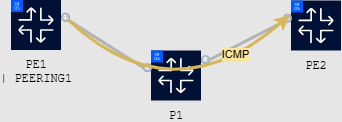

# Nokia SR OS with Ansible and NETCONF

| Item | Details |
| --- | --- |
| Short Description | Workflow automation over NETCONF with SR OS and Ansible  |
| Skill Level | Intermediate |
| Tools Used | SR OS, NETCONF, Ansible |

With Nokia's model-driven SR OS exposing all of its capabilities via NETCONF as well as gRPC and the traditional CLI, automation tools that could previously only be used with rigorous CLI scraping setups can now make use of the YANG-model when inputting data and receiving outputs. One such tool is Ansible.

This activity introduces you to automating configuration via Ansible's NETCONF [netcommon](https://docs.ansible.com/ansible/latest/collections/ansible/netcommon/) collection.  The [netcommon](https://docs.ansible.com/ansible/latest/collections/ansible/netcommon/) modules are created and supported by RedHat for all network vendors providing a consistent and supported multi-vendor interface.

## Topology



## Introduction

[Ansible](https://www.ansible.com/) is a suite of software tools that enables `infrastructure as code`. The suite is open-source and includes software provisioning, configuration management and application deployment functionality. Ansible has gained popularity with Systems Engineers looking after server infrastructures, however, with modules specifically designed for network management, Ansible enables network engineers to configure devices and gather device information. Ansible is agentless by design, making it especially suitable for managing network equipment that doesn't generally allow installing agent software. In addition, a collection of network-specific plugins and modules is available (including those for NETCONF) that are developed and maintaned directly by Ansible. This ensures they are continually updated and receive robust support.

Ansible enables automated activities by breaking them into small actions, known as plays.  These plays are bundled together and augmented with some logic into a set of plays, known as a playbook, that can perform more complicated workflows.

Ansible enables the automation of complex network tasks through simple, human-readable YAML syntax in its playbooks. With its extensive range of modules tailored for network management, Ansible allows network engineers to configure devices and gather device information efficiently. Playbooks can be written and maintained to do network device configuration, as mentioned, but software upgrades and security compliance are also within reach (though out of scope of this usecase).

The Ansible [netcommon](https://docs.ansible.com/ansible/latest/collections/ansible/netcommon/) modules used in this activity rely on NETCONF as a management protocol. NETCONF is a network management protocol that can be used to configure, manipulate, and delete the configurations of network devices. It can also be used to perform any operation (action) that is modeled in YANG.  As any operation that is modelled can be used operations such as rebooting the router or running OAM tests can be performed depending on support from the target node. NETCONF uses XML-based encoding for configuration data and protocol messages and has several options for secured transport. In this lab, SSH is used for transport


## Getting Started

In this lab we will learn how to write, use and modify Ansible playbooks to interact with Nokia's model-driven SR OS. The example solution has been developed using a combination vsCode's remote development capabilities and a regular SSH session on a Hackathon instance similar to the one that has been made available to you.

## Accessing the lab

In this lab you will interact with nodes `pe1`, `p1`, `p2` and `pe2` in the instance topology. These nodes are accessible using your provided credentials as:

```
ssh -l admin clab-srexperts-pe1
ssh -l admin clab-srexperts-p1
ssh -l admin clab-srexperts-p2
ssh -l admin clab-srexperts-pe2
```

## High-level tasks overview

The following tasks recommended in this activity and example solutions are included in the [ansible-example](./ansible-example) directory. In the following sections they are described in detail.

1. Traffic flow between `pe1` and `pe2`
2. Create an IPv6 filter configuration on a router using a provided Ansible playbook.
3. Apply the IPv6 filter created in the previous step using a provided Ansible playbook to a network interface.
4. Undo the changes made in step 3 using the same playbook.
5. NETCONF Comparison in Ansible playbooks

    5.1. Implicit and explicit commits\
    5.3. Compare RPC\
    5.2. Commit RPC

6. Sending a ping via NETCONF

## Task 1 - Traffic flow between `pe1` and `pe2`

In this first task, we'll start by connecting to the topology and make sure everything is behaving as expected.

*If your outputs don't match the outputs listed, please ask for assistance as it may impact the rest of your experience with this lab activity.*

Log in to `pe1` using the credentials provided and issue the command:

```
ping clab-srexperts-pe2 count 9999
```

Your output should be similar to:

```
[/]
A:admin@pe1# ping fd00:fde8::1:22 count 9999
PING fd00:fde8::1:22 56 data bytes
64 bytes from fd00:fde8::1:22: icmp_seq=1 ttl=63 time=6.40ms.
64 bytes from fd00:fde8::1:22: icmp_seq=2 ttl=63 time=6.30ms.
64 bytes from fd00:fde8::1:22: icmp_seq=3 ttl=63 time=6.40ms.
```

Leave this session running in the background so the impact of the next tasks on this flow of traffic can be observed and the command can be restarted as needed. Open a new terminal session to continue with task 2.

## Task 2 - Creating a filter configuration

For this task we'll use the playbook [playbook.yml](./ansible/playbook.yml) provided in the [ansible](./ansible) folder. In this text we assume the Hackathon instance is used as the platform from which the ansible playbook is executed, though feel free to use your own system if this is more familiar to you.

### Step 1: Look at the files in the [ansible](./ansible) directory

Use the `ls` command (or a suitable alternative) to see which folders and files exist in this directory. You'll notice there are three files:

- [ansible.cfg](./ansible/ansible.cfg)
- [hosts](./ansible/hosts)
- [playbook.yml](./ansible/playbook.yml)

It is important to understand how these three files work in order to understand how Ansible functions.

The first file, [ansible.cfg](./ansible/ansible.cfg), sets some generic configuration for the Ansible process.  This includes the disabling of `host_key_checking` as this can be problematic in dynamic lab situations like this one. Disabling this setting is not recommended for production environments.

The second file, [hosts](./ansible/hosts), includes the Ansible inventory. An inventory is made up of target devices that Ansible can run against and select targets from. This file also defines the groups of devices that Ansible can operate on.  There are many other options available in the hosts file, more information can be found [in the Ansible documentation](https://docs.ansible.com/ansible/latest/inventory_guide/intro_inventory.html).

The third file, [playbook.yml](./ansible/playbook.yml) is the playbook, and, as the name suggests, it includes plays to be executed.

In addition, you will see there are a further three directories. They are:

- [host_vars](./ansible/host_vars)
- [group_vars](./ansible/group_vars)
- [roles](./ansible/roles)

The first two directories, [host_vars](./ansible/host_vars) and [group_vars](./ansible/group_vars) contain files that provide variables for a given host/group that give the Ansible process further information that it can use.

*Which file currently contains some placeholder credentials and connection details Ansible will use?*

**Update the credentials using those provided to you.** Notice that hostkey verification is disabled for this lab topology. This setting is not recommended for environments that aren't strictly for temporary lab use.

*Note: For a production deployment or any environment containing sensitive information storing credentials in plain text is not a good approach. Though it lies outside the scope of this usecase, [Ansible Vault](https://docs.ansible.com/ansible/latest/cli/ansible-vault.html) would be a good approach to solve the credential issue.*

Saving the best for last, the [roles](./ansible/roles) directory is a structured directory structure that includes the various roles used by the playbook.

The structure of this directory (generally) is the following:

```
roles
│
└───role1
│   │
│   └───files
│   |   │   <generated payloads>
|   |
│   └───tasks
│   |   │   main.yml
│   |
│   └───templates
│   |   │   template.j2
│
└───role2
    │
    │   ...
```

The `tasks/main.yml` files contain the actions that the role will do, using templates from the templates directory. The hierarchy is then made clear: the playbook includes plays that call roles that call tasks.

Variables to populate template values can be input interactively or set statically in one of the files above.

Have a look through the files and subfolders in the `filter` role's directory to see if you can understand what the task is doing and what the template is used for.

Additional information about this directory structure is available in [the Ansible documentation](https://docs.ansible.com/ansible/latest/playbook_guide/playbooks_reuse_roles.html#role-directory-structure).

For the predefined roles, variables are used to identify when certain attributes need to be sent as payload and when they should be omitted instead. Explore the [host_vars/p1](./ansible/host_vars/p1) file and compare it to [roles/filter/templates/filter.j2](./ansible/roles/filter/templates/filter.j2) to see what that looks like. Observe that the `roles/filter/templates/filter.j2` file resembles the MD-CLI's [YANG model](https://github.com/nokia/7x50_YangModels/blob/master/latest_sros_24.3/nokia-submodule/nokia-conf-filter.yang) for ipv6-filters with [Jinja2-style logic statements](https://palletsprojects.com/p/jinja/) (Jinja2 is a templating language) added.

The logic in the template file means that if a target host doesn't have any variables set for a particular task to resolve, the role can be executed against the target host and there will be no changes made as the generated payload will not contain anything. This offers flexibility and means specific hosts need not always be specified.

What do you expect to see in the role's [files](./ansible/roles/filter/files) folder when this task is executed in terms of file formats and contents?

### Step 2: Running the pre-created playbook for a specific task

For the remainder of this activity, we will be using tags to filter out which role will be executed, to introduce some granularity into the single playbook without requiring a playbook file per task. Tags are Ansible's way of providing additional data that can be used to call or restrict certain plays or tasks. You can read more about using tags [in the Ansible documentation](https://docs.ansible.com/ansible/latest/playbook_guide/playbooks_tags.html). Filtering tasks and plays is a two-step process. The first step is assigning tags and the second is whitelisting the tags you wish to run as a comma-separated list, i.e.

```
ansible-playbook playbook.yml -t role1,role2
```

Now, try executing the playbook [playbook.yml](./ansible/playbook.yml) in the [ansible](./ansible) directory and use tags to specify that only the `filter` role should be executed. To do this, issue the following command:

```
ansible-playbook playbook.yml -t filter
```

Immediately, you'll notice there were no target hosts recognized. Specify that the process should use the [hosts](./ansible/hosts) file from before either by updating the [ansible.cfg](./ansible/ansible.cfg) file or by using a CLI flag. To use a CLI flag, your command would turn into

```
ansible-playbook playbook.yml -t filter -i hosts
```

and the configuration file option involves adding `inventory = hosts` to `ansible.cfg`, and the command from before would stay the same.

Again, you'll notice an error appears:

```
ansible-playbook playbook.yml -i hosts -t filter

PLAY [Configuring ACL IP-Filters] ***************************************************************************************************************************************************************

TASK [filter : Generate Filter Configuration XML] ***********************************************************************************************************************************************
An exception occurred during task execution. To see the full traceback, use -vvv. The error was: ansible.errors.AnsibleUndefinedVariable: 'operation' is undefined. 'operation' is undefined
fatal: [p1]: FAILED! => {"changed": false, "msg": "AnsibleUndefinedVariable: 'operation' is undefined. 'operation' is undefined"}

PLAY RECAP **************************************************************************************************************************************************************************************
p1                         : ok=0    changed=0    unreachable=0    failed=1    skipped=0    rescued=0    ignored=0
```

The predefined roles have an expectation that an extra variable `operation` is passed to the Ansible interpreter. This variable is directly assigned to be the value used as NETCONF `operation` attribute in the payload being sent by the various roles and thus is important. Refer to section [RFC6241](https://datatracker.ietf.org/doc/html/rfc6241#section-7.2) for the possible values an operation can have. The default in most cases will be `merge`, and that is also an acceptable value here.

Add the `operation` variable with its value set to `merge` to your command using the cli flag `-e` or `--extra-vars` and specify your extra variables as `key=value` in a double-quoted string, where multiple variables are separated by spaces. The expected output of your playbook run is:

```
# ansible-playbook playbook.yml -i hosts -t filter -e "operation=merge"

PLAY [Configuring ACL IP-Filters] ***************************************************************************************************************************************************************

TASK [filter : Generate Filter Configuration XML] ***********************************************************************************************************************************************
changed: [p1]

TASK [filter : Loading configuration with netconf] **********************************************************************************************************************************************
changed: [p1]

PLAY [Configuring IP Interface] *****************************************************************************************************************************************************************

PLAY RECAP **************************************************************************************************************************************************************************************
p1                         : ok=2    changed=2    unreachable=0    failed=0    skipped=0    rescued=0    ignored=0
```

*Optional: Consider the host_vars and nodes that don't have variables set for the role to use; try removing `p1` as a host targeted for the filter task and replace it by `sros_routers`, then re-run your command. What result do you observe?*

### Step 3: Exploring the output of your playbook

In the output received at the end of the previous step, you can see that the `filter` role was executed. The hierarchy is also made clear in this output. Indeed, the `PLAY` value is taken from the playbook's name for the play tagged as `filter` and targets only host `p1`, the `filter` role then contains tasks named `Generate Filter Configuration XML` and `Loading configuration with netconf`. The other plays in the playbook aren't executed as their tags weren't included.

Look now to the files generated in [roles/filter/files](./ansible/roles/filter/files). Are they formatted as you expected? Do they contain the data you expected?

Finally, log in to the `p1` node and confirm the changes executed by Ansible are present on node `p1`. You can use [host_vars/p1](./ansible/host_vars/p1) as a guide to point you towards the configuration it should have created. The configuration should correspond to:

```
configure {
    filter {
        ipv6-filter "55" {
            entry 1 {
                match {
                    next-header ipv6-icmp
                    icmp {
                        code 128
                    }
                }
                action {
                    drop
                }
            }
        }
    }
}
```

If you are confirming the configuration changes on node `p1`, ensure you either use the `read-only` configuration mode or exit your configuration session with no pending changes in the candidate configuration once you have verified the result.

### Step 4: Dealing with uncertainty in networking

In the topology, `pe1` could be routed to `pe2` via either of `p1` and `p2`. Depending on any number of variables, your deployed instance may be using one or the other. This is unpredictable and so we must ensure that both core routers are being configured with an ACL to control the flow of traffic. The convenient thing with our Ansible-based approach is that adding a node to run existing playbooks against requires almost no effort. To illustrate, you'll be making sure that configurations going forward are executed on both node `p1` and node `p2`. Make the following modifications to achieve this:

- Add `p2` as a host to the Ansible inventory file using its hostname, `clab-srexperts-p2`.
- In that same inventory file, create a sub-group to `sros_routers` that includes both `p1` and `p2` named `core`. Make sure `sros_routers` still includes `p1`, `p2` and `pe1` after your changes. You can identify subgroups using syntax similar to the following:

```
[parentgroup:children]
childgroup
```

- In [group_vars](./ansible/group_vars), add a file for `core` and add contents of the host_vars file for `p1` to it, but bump the identifier from `55` to `56`. This shows precedence between variables at different levels. More information on that topic is available [here](https://docs.ansible.com/ansible/latest/playbook_guide/playbooks_variables.html#understanding-variable-precedence).
- Modify the target of the plays in [playbook.yml](./ansible/playbook.yml) to run against the newly created group of nodes, `core`, and re-run the previous command.

Notice the differences in output and explore the configuration of both `p1` and `p2`. Both nodes should have a filter configured now, `p1` having a filter with ID 55 and `p2` having a filter with ID 56.

*Optional: You could also solve this treating `p2` as a host similar to `p1`, with its own host_vars entry and adding it as a target to the list. Do you see why that approach would be less preferred?*

*Optional: Applying the configuration to the `sros_routers` group instead of to `core` also works and even has the same configuration result. Why doesn't any configuration appear on `pe1`?*

## Task 3 - Applying a filter to an interface

The previous task wouldn't have had any impact on the ICMP traffic flow created in task 1, it only created a filter and didn't apply it anywhere. This task will use the filter created in the previous step and apply it to the interface `pe1` on both node `p1` and node `p2`, in both the ingress and egress directions. The intended configuration for this is:

```
configure {
    router "Base" {
        interface "pe1" {
            egress {
                filter {
                    ipv6 "55"
                }
            }
            ingress {
                filter {
                    ipv6 "55"
                }
            }
        }
    }
}
```

As before, the `host_vars` and `group_vars` have some information included that controls what is sent down to the router and is acted upon by the role `interface`. Modify your playbook command from before to now run the play tagged `interface`. The Ansible playbook output should report 4 changes between generating the configuration payloads and using them to modify the configuration on `p1` and `p2`.

The traffic flow on `pe1` should now be interrupted due to the filter dropping ICMPv6 packets.

## Task 4 - Removing a filter from an interface

Quickly realizing this might not have been the correct thing to do based on the missing traffic and not wanting to push it with the scream test, un-do your changes from task 3. Remember that the operation variable we have added to the playbook input is copied directly into the NETCONF edit-config payload and that it has multiple possible values:

- merge
- replace
- create
- remove
- delete

Use the appropriate operation value and remove the filter from the interface. Verify the result in any or all of the ways as before; Ansible should report it made changes, the configuration on the `pe1` interface both on `p1` and `p2` nodes will be updated and traffic from `pe1` should now resume.

## Task 5 - Configuration comparison in Ansible playbooks

To potentially avoid such happy little accidents followed by immediate rollbacks, there is a case to be made for including a `compare` before every `commit` as is generally considered best practice for the MD-CLI. Since the NETCONF and MD-CLI interfaces are equipotent, this is entirely possible.

### Step 1:

Looking at the [Nokia Developer Portal Ansible examples for SR OS](https://network.developer.nokia.com/sr/learn/sr-os-ansible/sr-os-ansible-examples/) there is a lot of source material available on how a `compare` operation can be launched. It uses the [Netcommon RPC module](https://docs.ansible.com/ansible/latest/collections/ansible/netcommon/netconf_rpc_module.html#ansible-collections-ansible-netcommon-netconf-rpc-module). Modify the existing `interface` role's tasks by adding a `compare` RPC to it that runs after the last task of the role completes. For the example solution, three tasks have to be added to the existing `interface`:

- The first additional task should look for the template `compare.j2` in `ansible/roles/interface/templates`. It should load this file taking into account relevant variables just like any other task and store the resulting payload in the role's `files/` folder. This template [compare.j2](./ansible/roles/interface/templates/compare.j2) following the [Nokia YANG model for the compare operation](https://github.com/nokia/7x50_YangModels/blob/2a28af0e7fba2170eeec83315aafe27f54e221f2/latest_sros_22.7/nokia-oper-global.yang#L118) is provided to you. The example solution uses `compare-{{ inventory_hostname}}.xml` as a naming scheme for the generated payload.
- In the second task, this generated file in `files/` should be sent as a NETCONF RPC to the target device. The output should be stored in a variable `comparison_out`.
- Your implementation should output the difference between the configuration before and after the role was executed. To do this, include a task that outputs the result of `compare` by printing out the contents of `comparison_output`.

As an example, your additions might look like this:

```
    ...
    - name: Preparing compare RPC
      connection: local
      template: ...

    - name: Send the compare RPC to the target host
      ansible.netcommon.netconf_rpc:
        content: "..."
        rpc: action
        xmlns: urn:ietf:params:xml:ns:yang:1
      register: out


    - name: Show comparison output on stdout
      debug: var=comparison_out.stdout_lines

    ...
```

Use the existing tasks in the role for inspiration or refer to the [ansible-example](./ansible-example) folder that mirrors the [ansible](./ansible) folder amended with some example solutions.
Once again add the filter to the interfaces as you did in task 3. This should automatically run your compare tasks.

Does the comparison yield the expected output? Did Ansible report any changes? Was the configuration on either of the P-nodes updated? Was the traffic flow impacted?

### Step 2: Removing implicit commits

Clearly, something went wrong in the last step. A comparison output ran and generated no difference between the router and candidate, yet the router still has an updated configuration. This is explained by the [netconf_config](https://docs.ansible.com/ansible/latest/collections/ansible/netcommon/netconf_config_module.html) module being an abstraction for several RPC calls rolled into a single module. Looking at the documentation, it has several configuration options. One of those options determines whether or not a `commit` will be triggered by `netconf_config` when it is executed. A commit being triggered by the `netconf_config` action before a `compare` is executed explains the behavior we have seen.

Using the documentation for the action, update the configuration of your `interface` role such that the `netconf_config` action no longer triggers a commit and no longer locks the configuration. Re-run your playbook, now with the operation set to delete to ensure something would actually change in the configuration (otherwise the comparison output will be empty regardless).

As each role begins and terminates its own NETCONF connection, adding a separate role for the comparison operation is not considered.

In this step, you may encounter errors similar to this one:

```
fatal: [p1]: FAILED! => {"changed": false, "msg": "MINOR: MGMT_CORE #2052: Exclusive datastore access unavailable - model-driven interface editing global candidate"}
```

These errors can occur for instance when the global candidate configuration already contains configuration when the playbook starts. To resolve this, you can log in to the troubled node and issue the following commands to resolve the issue:

```
edit-config global
discard
quit-config
```

## Step 3 - Commit

This is all well and good, however now we don't commit the configuration so essentially the previous steps have been a step back in terms of functionality. Fortunately, we now know how to use the `netconf_rpc` module and commit of itself is an RPC so we are not at all in trouble here. Once again modify the `interface` role's tasks and add a commit action. No template file is provided this time, so there are slightly more changes to execute:

- Create the `commit.j2` template in the `templates` folder for your `interface` role based on what is in the `compare.j2` template and [the SR OS Yang model](https://github.com/nokia/7x50_YangModels/blob/2a28af0e7fba2170eeec83315aafe27f54e221f2/latest_sros_24.3/ietf/nokia-sr-ietf-netconf-augments.yang#L263). The Nokia Developer Portal's Ansible examples may also be of use.
- Add a `generate-commit` task to the `interface` role's `tasks/main.yml` that generates a file in the `files/` directory that contains the payload of your commit RPC. The example solution assumes that `commit-{{ inventory_hostname}}.xml` as a naming scheme is used.
- Add a `send-commit` task to the `interface` role's `tasks/main.yml` that takes the generated file as input, and sends the correct RPC to the target host.

Once again perform the `merge` and / or `delete` operations, do you see any room for improvement? Does the comparison give you the expected output in all cases?

*Optional: Explore options that add Ansible variables as comments into your commit history.*

*Optional: Can you modify your playbooks and roles so that the interface changes are reverted after some time if not explicitly accepted? This is known as a confirmed commit.*


## Task 6 - Send a ping via NETCONF

Finally, to close off this activity, and as your ICMP traffic flow might have already stopped, let's explore what else we can do from NETCONF.

We started this activity by logging in to the `pe1` node to trigger a ping command. This ensured we had something to look at for the duration of this usecase and to let us easily spot when our changes are put through to the node succesfully. The flow of the usecase might have been a little nicer if we had been able to use an Ansible playbook to send this ping traffic.

In addition to an improved flow, being able to use pings from within your playbook gives some options to verify connectivity between sites and / or measure latency and make educated decisions based on that. With Nokia's model-driven SR OS, the result of a ping sent via NETCONF is itself YANG-modeled (as an `action` statement), making it even simpler to integrate into your Ansible playbooks. Scraping a CLI text output is fairly cumbersome, after all.

This task starts from the [playbook.yml](./ansible/playbook.yml) file. For this task you will have to write your own role `ping` using what you learnt in the previous tasks and sections. Your role should implement a NETCONF `action` RPC that sends a single ICMP Echo Request from `pe1`, `p1` and `p2`  to `pe2` and prints the received output to stdout. The YANG model for the ping command in model-driven SR OS is available [here](https://github.com/nokia/7x50_YangModels/blob/master/latest_sros_24.3/nokia-oper-global.yang#L9217).

As a high-level overview, this is an approach you could take:

- Build a directory under `ansible/roles/` named `ping`
- Create the subdirectories `tasks`, `templates` and `files` and add files to them, mirroring what is done with the provided roles
- Use the role as a play tagged `ping` in `playbook.yml`

*Optional: the example solution assumes you print the output to stdout. How would you go about printing out only the average packet round-trip-time?*
