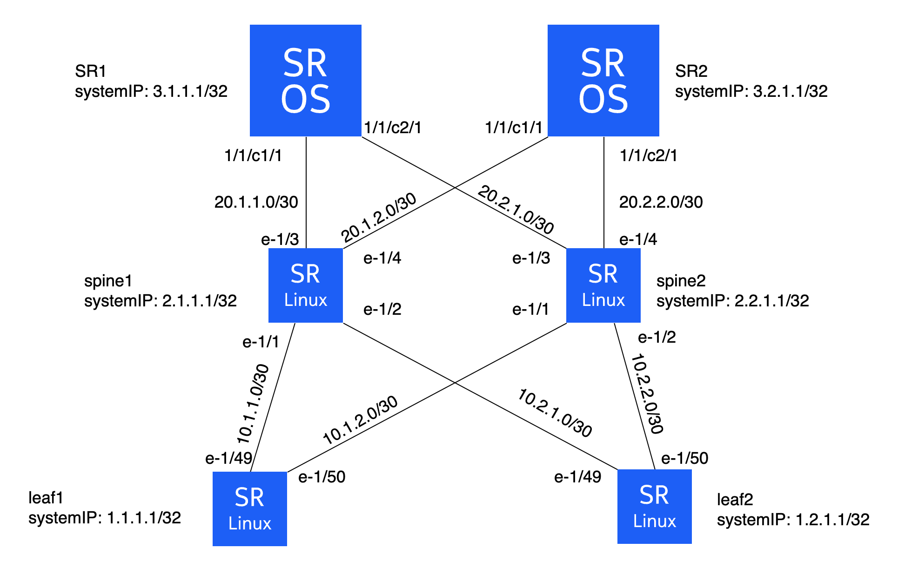

# SROS/SRL Configuration management using gNMI

The goal of this lab is to configure a network made of 4 SRL nodes and 2 SROS nodes using the gNMI interface.

**Grading: intermediate to Advanced**

## Deploying the lab

```shell
sudo clab deploy -c -t config.clab.yml
```



## Tools needed  

| Role | Software |
| --- | --- |
| Lab Emulation | [containerlab](https://containerlab.dev/) |
| Configuration and telemetry tool | [gNMIc](https://gnmic.openconfig.net/) |

## Tasks

* **Explore SROS gNMI XPATHs**

```shell
git clone https://github.com/nokia/7x50_YangModels.git
cd 7x50_YangModels/latest_sros_23.3
gnmic generate path --dir ietf --file nokia-combined/nokia-config.yang
```

* **Make sure the gNMI server of each node is up**

`gnmic -a $node -u $username -p $password --insecure capabilities`

`gnmic -a $node -u $username -p $password --skip-verify capabilities`

* **provision ports in SR1 and SR2**

XPATH: `/configure/port[port-id=*]/connector`

* **configure system IP addresses**

SROS XPATH: `/configure/router[router-name=Base]/interface`

SRL XPATH:  `/network-instance[name=default]/interface`

* **configure subinterfaces in SRLs**

XPATH: `/interface[name=*]/subinterface[index=*]`

* **add subinterfaces to the default network instance**

XPATH: `/network-instance[name=default]/interface`

* **configure ports in SROS Base router**

XPATH: `/configure/router[router-name=*]/interface[interface-name=*]/port`

* **configure IP addresses in all routers interfaces**

SROS XPATH: `/configure/router[router-name=Base]/interface[interface-name=*]/ipv4`

SRL  XPATH: `/interface[name=*]/subinterface[index=*]/ipv4`

* **configure BGP in all routers**

SROS XPATH: `/configure/router[router-name=Base]/bgp`

SRL  XPATH: `/network-instance[name=default]/protocols/bgp`

* **check that BGP peers are UP**

SROS XPATH: `/state/router[router-name=Base]/bgp`

SRL  XPATH: `/network-instance[name=default]/protocols/bgp`

* **Advanced: template all the configurations in a single set request file**

[gNMIc's set request template](https://gnmic.openconfig.net/cmd/set/#template-format)
