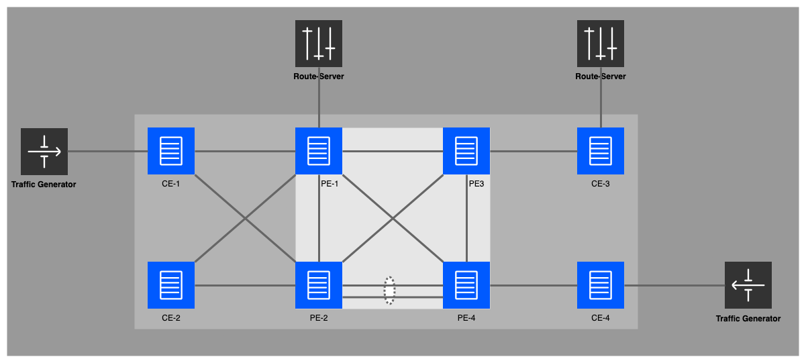

# SR OS Lab

This Network Lab is designed to provide infrastructure for hands-on experience. It is pre-configured with various scenarios, allowing users to gain practical knowledge and develop skills in configuring, programmability, streaming-telemetry.  


**Grading: Intermediate - Advanced**

## Topology



## Deploying the lab

1. Navigate to the SR OS lab folder 

	```
	cd sros-generic-lab/
	```
2. Deploy the lab using *containerlab* 

	```
	sudo containerlab deploy
	```

## Access Details  

SR OS Nodes can be connected through ssh using the hostnames with default username and password. </br>

**username:** admin </br>
**password:** admin </br>

| Node | Hostname |
| --- | --- |
| PE1 | clab-sros-srx2023-pe1    |
| PE2 | clab-sros-srx2023-pe2    |
| PE3 | clab-sros-srx2023-pe3    |
| PE4 | clab-sros-srx2023-pe4    |
| CE1 | clab-sros-srx2023-ce1    |
| CE2 | clab-sros-srx2023-ce2    |
| CE3 | clab-sros-srx2023-ce3    |
| CE4 | clab-sros-srx2023-ce4    |

example: ssh admin@clab-sros-srx2023-pe1


## Tools needed  

| Role | Software |
| --- | --- |
| Route-Server     | [gobgp](https://github.com/osrg/gobgp)   |
| Draw Topology      | [draw.io](https://app.diagrams.net/)        |
| Telemetry collector | [gNMIc](https://gnmic.openconfig.net/) |
| Service Discovery     | [consul](https://www.consul.io/)   |
| Lab Emulation | [containerlab](https://containerlab.dev/) |
| Time-Series DB      | [prometheus](https://prometheus.io)   |
| Visualization       | [grafana](https://grafana.com)        |
| Traffic Generator       | [iperf](https://github.com/esnet/iperf)        |


## Credentials section

| Tools | Login Info |
| --- | --- |
| Traffic Generator at CE-1     | docker exec -ti clab-sros-srx2023-tg1 bash   |
| Traffic Generator at CE-2     | docker exec -ti clab-sros-srx2023-tg2 bash   |
| Route-Server     | docker exec -ti clab-sros-srx2023-tg1 bash   |
| Telemetry collector | docker exec -ti clab-sros-srx2023-gnmic bash |
| Grafana       | Web Browser: public-ip:3000        |

## Tasks

* **Push ICMP Traffic** 

    Console into the Traffic Generator (iperf-src) at CE-1 
    
    ```
    docker exec -ti clab-sros-srx2023-tg1 bash
    ```
    Initiate ping to destination Traffic Generator (iperf-dst) at CE-4 
    
    ```
    ping 10.14.2.1
    ```

## Detailed Topology


